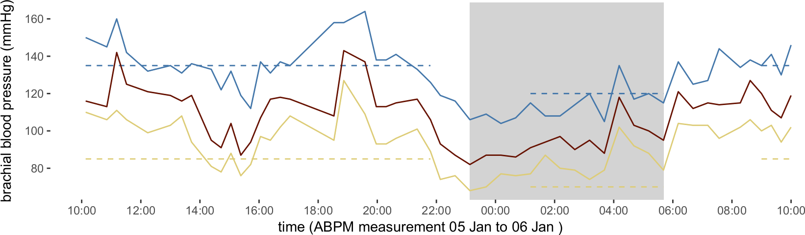
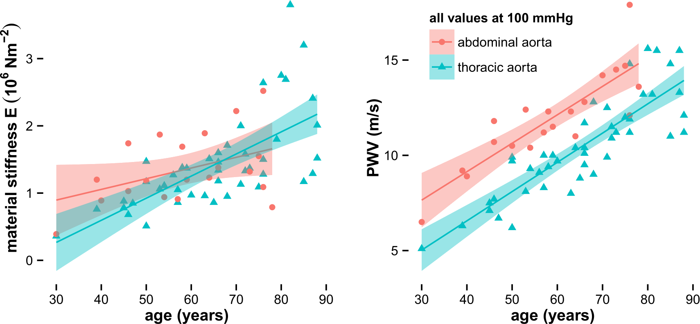

<!-- .slide: data-auto-animate-restart id="MEDI2101Wk10"-->
#### MEDI2101 Cardiovascular and Respiratory System.
### Block 4: Cardiovascular and respiratory system in disease
# LO4.1: Diseases of the vascular system.  Isolated Systolic Hypertension
(Week 10, Lecture 1)
##### Dr Mark Butlin (PhD, BE, SFHEA) (he/him)

Macquarie Medical School, Faculty of Medicine, Health and Human Sciences Macquarie University. On the land of the Wallumattagal clan of the Dharug Nation.

--
###  MEDI2101 Cardiovascular and Respiratory System
#### To do in Week 12

<a href="https://ilearn.mq.edu.au/course/view.php?id=64513#section-20"> MEDI2101 iLearn Week 12</a>

--
### Learning Evaluation of Unit
####

&nbsp

&nbsp

<h5><b>This week</b> you have the opportunity to tell me <b>what you think of the unit</b>. Link to survey on <a href="https://ilearn.mq.edu.au">iLearn landing page</a>.</h5>

<!--  <b>Wait until week 12</b> to tell me <b>what you think of me</b> (a second survey will be made available next week).
 -->

<!-- ---
### Learning Experience of Teaching
####

&nbsp;

<b>Last week</b> you had the opportunity to tell me <b>what you think of the unit</b>.  <b>This week</b> you have an opportunity to tell me <b>what you think of me</b>.
 -->

--
### Learning & Teaching Awards
#### 

&nbsp

&nbsp

<h5>Please consider voting for your favourite unit convenor/lecturer/tutor/demonstrator... next year.</h5>

&nbsp

<h5>(It does not have to be me!)</h5>

---
<!-- .slide: data-auto-animate-restart -->
## LO4.1.1 Using hypertension as an example, define the concepts of a risk factor, morbidity, and mortality.

--

hypertension = high blood pressure

What is "high"

--
### Hypertension
#### Morbidity

<b>morbidity:</b> The unhealthy characteristics of a person, usually associated with a disease.

<b>Hypertension example:</b> High blood pressure is a morbidity associated with hypertension. There may be other <em>co-morbidities</em> such as atherosclerosis of the coronary arteries, high cholesterol, etc.

--
### Hypertension
#### Mortality

<b>mortality:</b> A biomedical statistic characterising the number or proportion of people that die from a condition.

<b>Hypertension example:</b> In the USA, there are 10.8 deaths per 100,000 people directly attributable purely to hypertension and 30\% of all mortality is attributable to cardiovascular diseases in general*.

&nbsp;

*U.S. Department of Health and Human Services, <a href="https://www.cdc.gov/nchs/data/nvsr/nvsr68/nvsr68_09-508.pdf">National Vital Statistics Reports, (2019) 68:9.</a>

--
### Hypertension
#### Risk

<b>risk:</b> The probability of a detrimental event occurring e.g. contracting a disease; a sudden event like a heart attack; or death.

<b>Hypertension example:</b> "Roughly half the people with untreated hypertension die of heart disease related to poor blood flow (ischemic heart disease) and another third die of stroke."*

&nbsp;

*<a href="https://www.mayoclinic.org/diseases-conditions/high-blood-pressure/in-depth/high-blood-pressure/art-20045868">https://www.mayoclinic.org/diseases-conditions/high-blood-pressure/in-depth/high-blood-pressure/art-20045868</a>

--
### Hypertension
#### Risk factor

<b>risk factor:</b> A quantifiable indicator of the probability of someone either (a) contracting a disease (risk of disease) or (b) death (risk of mortality).

<b>Hypertension example:</b> Having high cholesterol is a risk factor for developing hypertension.

--

hypertension = high blood pressure

What is "high"

--
### Hypertension
#### What is high?

  

    
  

  

    
Averaged across the population, the higher the blood pressure, the more likely someone is to die.

  

  

    
Port et al. Systolic blood pressure and mortality. The Lancet. 2000. 355(9199):175-180.

  

--
### Hypertension
#### What is high?

Hypertension is not just a disease of the elderly but also increases risk of morbidity and mortality in young people as well.

&nbsp;

Sundström J et al Association of blood pressure in late adolescence with subsequent mortality: cohort study of Swedish male conscripts. BMJ. 2011. 22(342):d643.

--
### Hypertension
#### Guidelines

GPs and cardiologists in Australia have a choice of guidelines!
- Australian National Heart Foundation
- American College of Cardiology/American Heart Association (ACC/AHA)
- European Society of Cardiology/European Society of Hypertension (ESC/ESH)

--
### Hypertension - guidelines
<table>
<tr>
  <th>        </th>
  <th colspan="3"> ANHF and ESC/ESH (Australia and Europe)  </th>
  <th colspan="3"> ACC/ACH (USA) </th>
</tr><tr>
  <td>        </td>
  <td> systolic </td>
  <td> </td>
  <td> diastolic </td>
  <td> systolic </td>
  <td> </td>
  <td> diastolic 
</tr><tr>
  <td>        </td>
  <td> (mmHg)   </td>
  <td> </td>
  <td> (mmHg)    </td>
  <td> (mmHg)   </td>
  <td> </td>
  <td> (mmHg) 
</tr><tr>
  <td> optimal        </td>
  <td> < 120 </td>
  <td> and    </td>
  <td> < 80 </td>
  <td> - </td>
  <td> - </td>
  <td> - 
</tr><tr>
  <td> normal </td>
  <td> 120-129 </td>
  <td> and/or </td>
  <td> 80-84 </td>
  <td> < 120 </td>
  <td> and </td>
  <td> <  80 
</tr><tr>
  <td> elevated </td>
  <td> -       </td>
  <td> -      </td>
  <td> -     </td>
  <td> 120-129 </td>
  <td> and </td>
  <td> < 80 
</tr><tr>
  <td> high-normal </td>
  <td> 130-139 </td>
  <td> and/or </td>
  <td> 85-89 </td>
  <td> - </td>
  <td> - </td>
  <td> -
</tr><tr>
  <td> Stage 1 hypertension </td>
  <td> -       </td>
  <td> -      </td>
  <td> -     </td>
  <td> 130-139 </td>
  <td> or </td>
  <td> 80-89 mmHg
</tr><tr>
  <td> Stage 2 hypertension </td>
  <td> -       </td>
  <td> -      </td>
  <td> -     </td>
  <td> $\geqslant$140 </td>
  <td> or </td>
  <td> $\geqslant$90 
</tr><tr>
  <td> Grade 1 (mild) hypertension </td>
  <td> 140-159 </td>
  <td> and/or </td>
  <td> 90-99 </td>
  <td> - </td>
  <td> - </td>
  <td> - </td>
</tr><tr>
  <td> Grade 2 (moderate) hypertension </td>
  <td> 160-179 </td>
  <td> and/or </td>
  <td> 100-109 </td>
  <td> - </td>
  <td> - </td>
  <td> - </td>
</tr><tr>
  <td> Grade 3 (severe) hypertension </td>
  <td> $\geqslant$180 </td>
  <td> and/or </td>
  <td> $\geqslant$110 </td>
      <td> - </td>
  <td> - </td>
  <td> - </td>
</tr><tr>
  <td> isolated systolic hypertension </td>
  <td> $>$140  </td>
  <td> and    </td>
  <td> < 90 </td>
    <td> - </td>
  <td> - </td>
  <td> - </td>
</tr>
</table>

&nbsp;

<a href="http://dx.doi.org/10.5694/mja16.00526">Brachial arterial blood pressure cut-off values for different grades of hypertension according to the guidelines of the:  Australian National Heart Foundation (ANHF)</a>; <a href="https://doi.org/10.1016/j.jacc.2017.11.006">American College of Cardiology/American Heart Association (ACC/AHA)</a>; and the <a href="https://doi.org/10.1093/eurheartj/ehy339">European Society of Cardiology/European Society of Hypertension (ESC/ESH)</a>.

--
### Hypertension
#### When do you measure blood pressure?

Blood pressure constantly varies. It is usually higher during the day than at night (nocturnal dipping), and usually higher when measured in a clinical environment than when measured outside of the clinic. It also varies from minute to minute.

&nbsp;

Courtesy of the Blood Pressure and Vascular Function Laboratory, Macquarie University.

--
### Hypertension
#### When do you measure blood pressure?

An example of measurements taken by ambulatory blood pressure recording in a person whose blood pressure does not dip at night, which it normally should.

&nbsp;

Courtesy of the Blood Pressure and Vascular Function Laboratory, Macquarie University.

--
### Hypertension
#### When do you measure blood pressure?

  

    
  

  

    
By wearing an ambulatory blood pressure monitor for 24 hours, the variation in blood pressure throughout the day and night can be captured. Routinely measuring blood pressure at home with an automatic blood pressure monitor also is useful in diagnosing hypertension by getting blood pressure "out of the clinic".

  

  

    
National Heart Foundation and High Blood Pressure Research Council of Australia Ambulatory Blood Pressure Monitoring Consensus Committee

  

--
### Hypertension
#### When do you measure blood pressure?

  

    
  

  

    
An example of white coat hypertension. The blood pressure measured in the clinic is not always representative of the blood pressure in every day life. This person had high blood pressure in the clinic, but was normotensive outside of the clinic.

  

  

    
Courtesy of the Blood Pressure and Vascular Function Laboratory, Macquarie University.

  

--
### Hypertension
#### What causes hypertension?

We can largely answer this question from what we have learnt in the unit by asking the question: What raises blood pressure?*

<ul>
  <li> <b>autonomic function:</b> Increased sympathetic outflow chronically raising heart rate, cardiac contractility, total peripheral resistance and/or altering kidney function.</li>
  <li> <b>systemic arteries:</b> Stiffening of the arteries increasing total peripheral resistance.</li>
  <li> <b>kidneys:</b> Kidney dysfunction, chronically upregulating blood pressure.</li>
<ul>

&nbsp;

* Heart rate and stroke volume do not generally increase chronically as a cause of hypertension.

--
### Hypertension
#### What causes autonomic dysfunction, increased artery stiffness, and kidney dysfunction?

--
### Hypertension
#### What causes autonomic dysfunction, increased artery stiffness, and kidney dysfunction?

<ul>
  <li> The causes of hypertension are multifactorial, and most probably cases of essential hypertension* do not have a single cause.  </li>
 <li> Genetic studies have revealed a lot of genetic markers associated with function of the vascular endothelium associated with hypertension, but there hypertension is definitely not a single gene (or even a few multiple genes) disease.  </li>
 <li> Treatment does not usually tackle the root cause (the root cause often being unknown) but target the most effective way to lower blood pressure whilst minimising side effects.</li>
</ul>

&nbsp;

* Definition to come shortly.

--
### Hypertension
#### What causes autonomic dysfunction, increased artery stiffness, and kidney dysfunction?

Risk factors <em>for developing</em> hypertension:
- smoking
- a diet high in sodium (salt)
- physical inactivity
- being overweight or obese
- drinking too much alcohol
- high cholesterol

--
### Hypertension
#### What causes autonomic dysfunction, increased artery stiffness, and kidney dysfunction?

Hypertension is a risk factor for...

- left ventricular hypertrophy
- heart failure
- renal damage
- retinopathy
- cerebrovascular disease
- haemorrhagic stroke
- coronary artery disease
- heart attacks
- Alzheimer's disease and dementia
- ...

--
### Hypertension
#### What are the signs of hypertension?

Have a think how a typical patient will present to the GP if they have high blood pressure...

High blood pressure has no symptoms.

--
### Hypertension
#### Types of hypertension

Hypertension can be divided into either being "essential" or "secondary".

<b>Essential hypertension:</b> Chronically high blood pressure with no known cause (the majority of hypertension cases).

<b>Secondary hypertension:</b> Chronically high blood pressure with an identified cause. Makes up 5 to 10\% of hypertension cases. e.g. renal disease; renal artery stenosis; primary hyperaldosteronism; drug-induced hypertension (common side effect of the contraceptive pill) etc.

---
<!-- .slide: data-auto-animate-restart -->
## LO4.1.2 Define isolated systolic hypertension and communicate why this type of hypertension is particularly important.

--
### Isolated systolic hypertension
####

systolic pressure $\geqslant$140 mmHg

AND

diastolic pressure < 90 mmHg

&nbsp;

In Europe / Australia.

--
### Isolated systolic hypertension
####

  

    
  

  

    
Isolated diastolic hypertension (IDH) accounts for the majority of hypertension in younger individuals. With age, isolated systolic hypertension (ISH) accounts for the vast majority of hypertension. If is ISH that is associated with, and likely caused by, the stiffening of arteries.

  

  

    
Nilsson, PM et al. <em>Blood pressure and pulse wave velocity as metrics for evaluating pathologic ageing of the cardiovascular system}. Blood Press, 2013, 23:17--30.

  

---
<!-- .slide: data-auto-animate-restart -->
## LO4.1.3 Understand the role of capacitance in the large arteries in turning pulsatile flow into non pulsatile flow.

--
### Arterial capacitance and the *Windkessel* effect
#### Compliant arteries act as a capacitor, storing and releasing energy

--
### Arterial capacitance and the *Windkessel* effect
#### The heart: a pulsatile flow source

<b>Heart rate (HR):</b>	the number of beats of the heart per unit time (e.g. beats per minute bpm)

<b>Stroke volume (SV):</b> the volume of blood ejected by the left ventricle into the aorta in a single stroke (beat) of the heart

<b>Cardiac output (CO):</b>	the average rate of blood being ejected by the left ventricle into the aorta

\begin{equation}
  CO=SV\times HR
\end{equation}

--
### Arterial capacitance and the *Windkessel* effect
#### The heart: a pulsatile flow source

  

    
  

  

    
Ultrasound of the left ventricular outflow tract showing the pulsatile nature of flow into the systemic arterial vasculature.

  

  

    

  

--
### Arterial capacitance and the *Windkessel* effect
#### The capillaries: a non-pulsatile flow bed

  

    
  

  

    
Blood flow in a capillary, and response to smell, showing non-pulsatile nature of flow.

  

  

    
Chaigneau E, Oheim M, Audinat E, Charpak S. <em>Two-photon imaging of capillary blood flow in olfactory bulb glomeruli</em>. Proc Natl Acad Sci USA. 2003, 100:13081--6.

  

--
### Arterial capacitance and the *Windkessel* effect
#### The capillaries: a non-pulsatile flow bed

  

    
  

  

    
Pule pressure increases marginally as you travel from the aorta toward the large arteries like the brachial artery, but then decreases until the pulsatile blood being ejected from the heart becomes a non-pulsatile flow of blood at the level of the capillaries.

  

  

    

  

--
### Arterial capacitance and the *Windkessel* effect
#### Large arteries get stiffer with age

Increase in arterial stiffness as measured by material stiffness (E) and the arterial pulse wave velocity (PWV) with age.

&nbsp;

Butlin, M. & Avolio, A.P. <em>Age-related changes in the mechanical properties of arteries</em> in Mechanical properties of aging soft tissue, Springer, 2014, 37--74. Original data from Langewouters, G. J. et al. J Biomech, 1984, 17:425--35.

--
### Arterial capacitance and the *Windkessel* effect
#### Stiff arteries reduce the *Windkessel* effect

--
<!-- .slide: data-auto-animate data-background-image="images/TrampolineSimpsons.gif" -->
### Compliant large arteries</spab>

--
<!-- .slide: data-auto-animate data-background-image="images/TrampolineDunkFail.gif" -->
### Stiff large arteries

---
<!-- .slide: data-auto-animate-restart -->
## LO4.1.4 Describe the role of arteriosclerosis in isolated systolic hypertension (and how arteriosclerosis is different to atherosclerosis).

--
### Arteriosclerosis
#### is different to atherosclerosis

  

    
  

  

    
<b><em>Athero</em>sclerosis:</b> Small artery flow restriction (or blockage) through isolated plaque formation in the <b><em>intimal layer</em><b>.

    
Little to no influence on the <em>Windkessel</em> effect.

  

  

    

  

--
### Arteriosclerosis
#### is different to atherosclerosis

  

    
  

  

    
<b><em>Arterio</em>sclerosis:</b> Stiffening of the arteries including changes in the <b><em>medial layer</em></b>.

    
Changes the <em>Windkessel</em> effect.

  

  

    

  

--
### Arteriosclerosis
#### is different to atherosclerosis

  

    
  

  

    <h5><em>athero</em>sclerosis</h5>
    
Inward (narrowing) or outward arterial wall remodelling of usually small arteries due to formation of plaques.

  

  

    
Wikimedia Commons

  

  

    
  

  

    <h5><em>arterio</em>sclerosis</h5>
    
Microscopic changes to the arterial wall, and/or uniform thickening of the arterial wall, resulting in the artery becoming stiffer. Occurs in large and small arteries.

  

  

    

  

--
### Arteriosclerosis
#### Causes

What causes arteriosclerosis?

<ul>
<li> cross linking of the collagen fibres within the artery wall.</li>
<li> fragmentation of the elastin fibres within the artery wall.</li>
<li> smooth muscle cell proliferation causing thickening of the artery wall.</li>
<li> diffuse (not localised plaque) calcification of the medial layer of the artery wall.</li>
</ul>

--
### Arteriosclerosis
#### Risk factors

Risk factors for developing arteriosclerosis

- smoking
- a diet high in sodium (salt)
- physical inactivity
- being overweight or obese
- drinking too much alcohol
- high cholesterol

--
### Arteriosclerosis
#### Independent predictor of cardiovascular mortality

The stiffness of large arteries is an independent predictor of cardiovascular events, cardiovascular mortality, and all-cause mortality.

&nbsp;

&nbsp;

&nbsp;

Vlachopoulos, C et al. <wm>Prediction of cardiovascular events and all-cause mortality with arterial stiffness: a systematic review and meta-analysis</em>. J Am Coll Cardiol, 2010, 55:1318--27.

---
<!-- .slide: data-auto-animate-restart -->
## LO4.1.5 Identify and describe the mechanism of the main treatments for hypertension, including lifestyle changes and broad antihypertensive medication drug classes.
--
### Treatment of hypertension
####

Stiffening of large arteries is irreversible (no treatment)*.

&nbsp;

A small study has shown regular exercise can reverse it, and there is a wealth of research being undertaken to understand the disease in the hope that we can one day treat it.

--
### Treatment of hypertension
#### Mechanism of anti-hypertensive drugs

<table>
  <tr>
  <th> antihypertensive drug class   </th>
  <th> action </th>
  </tr><tr>
    <td> Diuretics </td>
    <td> Reduce blood volume through salt reduction. </td>
  </tr><tr>
    <td> Beta blockers </td>
    <td> Reduce heart rate, reduce cardiac output. </td>
  </tr><tr>
    <td> ACE inhibitors </td>
    <td> Reduce angiotensin production and reduce peripheral vasoconstriction. </td>
  </tr><tr>
    <td> ARB's </td>
    <td> Block angiotensin, reduce peripheral vasoconstriction. </td>
  </tr><tr>
    <td> Calcium channel blockers </td>
    <td> Prevent calcium entering smooth muscle, reduces heart contractility and peripheral vasoconstriction. </td>
  </tr><tr>
    <td> Alpha blockers </td>
    <td> Vasodilator, reduces peripheral resistance. </td>
  </tr><tr>
    <td> Alpha-2 Receptor agonists </td>
    <td> reduce sympathetic activity reduced heart rate and peripheral resistance. </td>
  </tr><tr>
    <td> Peripheral adrenergic inhibitors </td>
    <td> Block brain neurotransmitters, reduce smooth muscle contraction and peripheral resistance. </td>
  </tr><tr>
    <td> Vasodilators </td>
    <td> Directly act on blood vessels to reduce peripheral resistance. </td>
  </tr>
</table>

&nbsp;

ACE: angiotensin converting enzyme. ARB: angiotensin receptor blocker.

--
### Treatment of hypertension
#### Treatment with lifestyle changes

<table>
  <th>  risk factor </th>
  <th> lifestyle treatment </th>
</tr><tr>
  <td>  smoking </td>
  <td> stop smoking </td>
</tr><tr>
  <td>  a diet high in sodium (salt) </td>
  <td> reduce salt intake </td>
</tr><tr>
  <td>  physical inactivity </td>
  <td> become physically active </td>
</tr><tr>
  <td>  being overweight or obese </td>
  <td> lose weight </td>
</tr><tr>
  <td>  drinking too much alcohol </td>
  <td> reduce alcohol intake </td>
</tr><tr>
  <td>  high cholesterol </td>
  <td> dietary changes </td>
</tr><tr>
</table>

Lifestyle changes are often *extremely* effective in treating hypertension, sometimes more so than antihypertensive drugs. However, adherence to the "prescription" of lifestyle changes is often very poor.

Created for MEDI2101.

