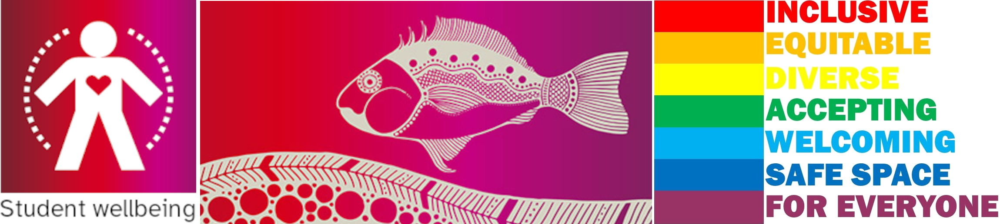

<!-- .slide: data-auto-animate-restart id="MEDI2101Wk10_1"-->
#### MEDI2101 Cardiovascular and Respiratory System.
### Block 4: Cardiovascular and respiratory system in disease
# LO4.1: Indigenous health
(Week 10, Lecture 1)
##### Guest lecturer: Dr John Hunter

Department of Health Sciences, Faculty of Medicine, Health and Human Sciences Macquarie University. On the land of the Wallumattagal clan of the Dharug Nation.

&nbsp;

&nbsp;

&nbsp;

This material is provided to you as a Macquarie University student for your individual research and study purposes only. You cannot share this material without permission. Macquarie University is the copyright owner of (or has licence to use) the intellectual property in this material. Legal and/or disciplinary actions may be taken if this material is shared without the University’s written permission.

--
### Learning Evaluation of the cardiovascular and respiratory unit
####

<b>This week</b> you have the opportunity to tell me <b>what you think of the unit</b>. Survey on the right hand side on the iLearn landing page for all units. <a href="https://ilearn.mq.edu.au">www.ilearn.mq.edu.au</a>

<!--   <b>Wait until next week</b> to tell me <b>what you think of me</b> (a second survey will be made available next week).
 -->

Please take a moment now to complete the survey*.

*This is not a wasted effort. Dr Butlin does engage with the feedback, retaining methods/content that are praised, and looking to fix areas identified for improvement.

--
### MEDI2101 Cardiovascular and Respiratory System
#### To do in Week 12

<a href="https://ilearn.mq.edu.au/course/view.php?id=64513#section-21"> MEDI2101 iLearn Week 12</a>

--
### MEDI2101 Final examination (Assessment Task 4)
####

<a href="https://ilearn.mq.edu.au/course/view.php?id=64513#section-25">Final examination details and front page available in iLearn.</a>

--
<!-- .slide: data-auto-animate-restart id="MEDI2101Wk13" -->
#### MEDI2101 Cardiovascular and Respiratory System.
# Block 5: Review and assess

#### To do in Week 13:

- No lecture, practical or new reading. 
- <b>Review:</b> Study week in preparation for final examination.
- <b>On-line quiz:</b> Review of many of the on-line questions you have come across already this week.
- I will be available in the lecture theatre or via Zoom (link in Week 13 material in iLearn) during the normal lecture time for any questions.
- Also contactable through the week on MEDI2101 iLearn forums, Discord, e-mail, and Zoom meeting outside of lecture time by appointment (link on right hand side in iLearn).

--
#### MEDI2101 Cardiovascular and Respiratory System.
### Block 4: Cardiovascular and respiratory system in disease
# LO4.1: Indigenous health
(Week 12, Lecture 1)
##### Guest lecturer: Dr John Hunter

Department of Health Sciences, Faculty of Medicine, Health and Human Sciences Macquarie University. On the land of the Wallumattagal clan of the Dharug Nation.

--
### Indigenous health
#### Guest lecturer: Dr John Hunter

<embed src="https://ilearn.mq.edu.au/mod/resource/view.php?id=7322376#toolbar=1" width="100%" height="400px">

<a href="https://ilearn.mq.edu.au/mod/resource/view.php?id=7322376">Click here to download PDF.</a>
