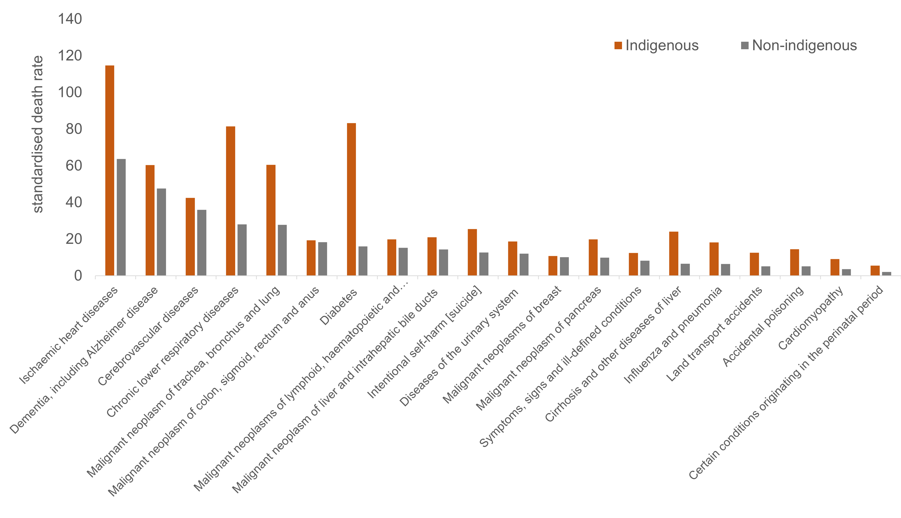
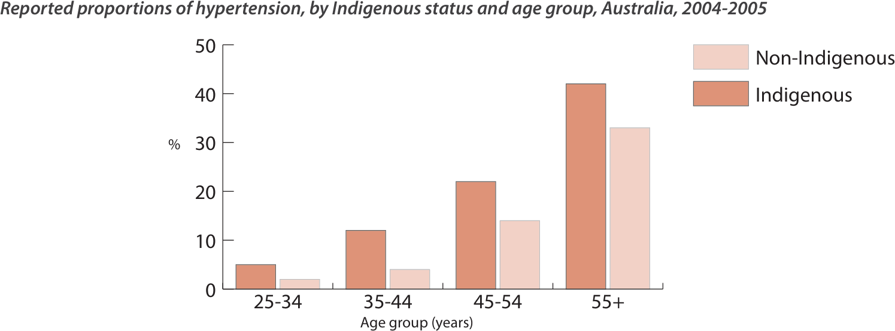
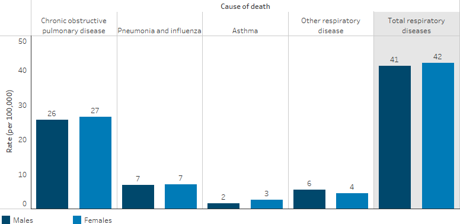
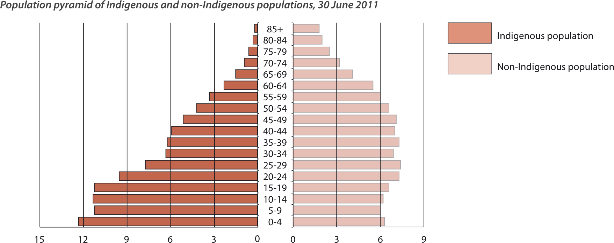
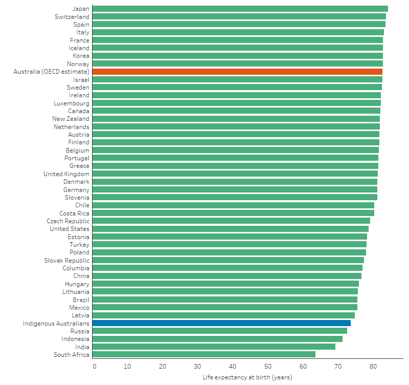
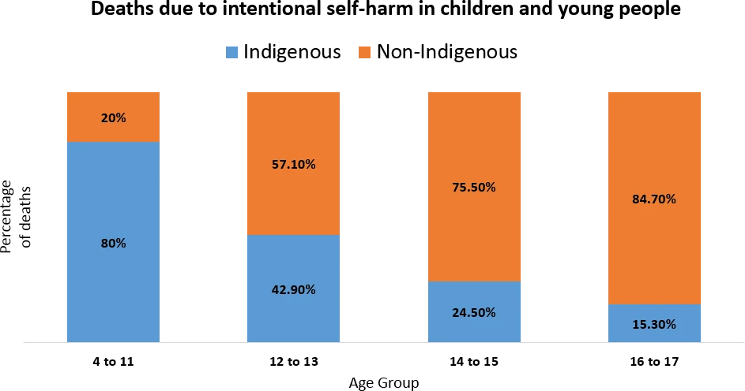
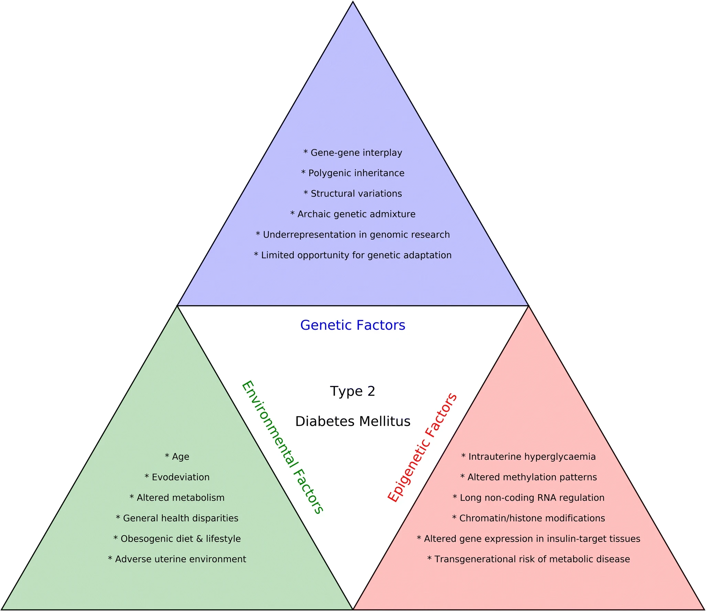

<!-- .slide: data-auto-animate-restart id="MEDI2101Wk12_2"-->
#### MEDI2101 Cardiovascular and Respiratory System.
### Block 4: Cardiovascular and respiratory system in disease
# LO4.3: Indigenous cardiorespiratory health
(Week 12, Lecture 2)
##### Dr Mark Butlin (PhD, BE, SFHEA) (he/him)

Macquarie Medical School, Faculty of Medicine, Health and Human Sciences Macquarie University. On the land of the Wallumattagal clan of the Dharug Nation.

--
<!-- .slide:  data-background-image="images/AboriginalAustralia1.png" -->

I acknowledge, thank and respect the traditional custodians of the stolen land I have lived upon, the people of the Wiradjuri, Bundjalung, Tharawal, Eora and Dharug nations, whose cultures and customs have nurtured and continue to nurture this land, since the Dreamtime.

--
<!-- .slide:  data-background-image="images/AboriginalAustralia1.png" -->

I acknowledge, that I have much to learn about the lived experience of Aboriginal peoples, the history of their nations, and the impact this has had on populations of people who before invasion of the land, had the fortune of good health and life expectancy.

--
### My limited lived experience
#### My immediate family

- **Grandfather, “Budge” Butlin**
  - Teacher in single teacher schools in regional NSW, including in indigenous communities.
- **Father, Ian Butlin**
  - A high school teacher giving support to indigenous students in a time of overt discrimination.
- **Myself**
  - Growing up as a child in Gilgandra (Wiradjuri for long water hole), witnessing socioeconomic disparity with my own eyes but through the educated guidance of my father and grandfather.

--
### My limited lived experience
#### Professor Noel Butlin (1921-1991)

Image source: <a href="https://openresearch-repository.anu.edu.au/handle/1885/247570">ANU Archives</a>

Butlin, N. (1993). <a href="https://multisearch.mq.edu.au/permalink/61MACQUARIE_INST/1c87tk9/alma9917900010802171">Economics and the Dreamtime: A Hypothetical History.</a> Cambridge: Cambridge University Press.

--
### My limited lived experience
#### Professor Noel Butlin (1921-1991)

"Noel Butlin provided a fundamental reassessment of the size and nature of the Aboriginal economy and population before 1788... . He convincingly argued that the early estimates
were likely to be substantial underestimates, and he eventually concluded that the pre-colonial population was between 1 and 1.5 million."

Hunter, B. H., & Carmody, J. (2015). Estimating the Aboriginal Population in Early Colonial Australia: The Role of Chickenpox Reconsidered. Australian Economic History Review, 55(2), 112–138. Butlin, N. G. (1983) <a href="https://multisearch.mq.edu.au/permalink/61MACQUARIE_INST/1c87tk9/alma9917928310802171">Our Original Aggression: Aboriginal Populations of Southeastern Australia 1788–1850</a> (Sydney: George Allen & Unwin).

---
<!-- .slide: data-auto-animate-restart -->
## LO4.3.1 Display cognisance of the statistics of cardiovascular and respiratory disease as faced by indigenous Australians.

--
<!-- .slide: data-background-color="#373A36" -->

The introduction of new diseases to indigineous communities by white settlement was fatal on the worst pandemic scale. "Our original aggression."*

The disease burden for indigenous Australians continues today.

The types of diseases and reasons behind them have changed.

*Butlin, N. G. (1983) <a href="https://multisearch.mq.edu.au/permalink/61MACQUARIE_INST/1c87tk9/alma9917928310802171">Our Original Aggression: Aboriginal Populations of Southeastern Australia 1788–1850</a> (Sydney: George Allen & Unwin).

--
### Statistics of cardiovascular and respiratory disease
#### 

The types of diseases and reasons behind them have changed.

Figure created for MEDI2101 using data from Australian Bureau of Statistics, <a href="https://www.abs.gov.au/ausstats/abs@.nsf/Lookup/by%20Subject/3303.0~2017~Main%20Features~Leading%20causes%20of%20death%20in%20Aboriginal%20and%20Torres%20Strait%20Islander%20people~9">3303.0 - Causes of Death, Australia, 2017</a>.

--
### Statistics of cardiovascular and respiratory disease
#### Cardiovascular

Gray C <em>et al.</em> <a href="https://healthbulletin.org.au/articles/review-of-cardiovascular-health-among-indigenous-australians/#fnl-10">Review of cardiovascular health among Indigenous Australians</a>. 2012. 12(4):1-36.

--
### Statistics of cardiovascular and respiratory disease
#### Cardiovascular

Cardiovascular related death rates (QLD, WA, SA, NT, 2002-2005) by indigenous status and age group. 

Gray C <em>et al.</em> <a href="https://healthbulletin.org.au/articles/review-of-cardiovascular-health-among-indigenous-australians/#fnl-10">Review of cardiovascular health among Indigenous Australians</a>. 2012. 12(4):1-36.

--
### Statistics of cardiovascular and respiratory disease
#### Respiratory

Australian Institute of Health and Welfare, National Indigenous Australians Agency. <a href="https://www.indigenoushpf.gov.au/measures/1-04-respiratory-disease">Tier 1 - Health status and outcomes. 1.04 Respiratory disease (2022).</a>

--
### Statistics of cardiovascular and respiratory disease
#### Respiratory

Australian Institute of Health and Welfare, National Indigenous Australians Agency. <a href="https://www.indigenoushpf.gov.au/measures/1-04-respiratory-disease">Tier 1 - Health status and outcomes. 1.04 Respiratory disease (2022).</a>

--
### Statistics of cardiovascular and respiratory disease
#### Population

Gray C <em>et al.</em> <a href="https://healthbulletin.org.au/articles/review-of-cardiovascular-health-among-indigenous-australians/#fnl-10">Review of cardiovascular health among Indigenous Australians</a>. 2012. 12(4):1-36.

--
### Statistics of cardiovascular and respiratory disease
#### Population - life expectancy (in 2017)

Australian Institute of Health and Welfare, National Indigenous Australians Agency. <a href="https://www.indigenoushpf.gov.au">Aboriginal and Torres Strait Islander Health Performance Framework (2022).</a>

---
<!-- .slide: data-auto-animate-restart -->
## LO4.3.2 Display cognisance of the cardiovascular and respiratory health barriers as faced by indigenous Australians.

--

"Indigenous people are culturally diverse, with cultural differences
providing unique access issues for health care services.
Health service planning should consider the needs of individual
communities, and rates of disease, rather than adopting a ‘one size
fits all’ approach."*

"Other barriers experienced by Indigenous people include:
poor coordination across the health system; socio-economic
disadvantage; poor access to acute care services and to primary
and specialist health care; sub-optimal provision of in-hospital
services; the availability of transport to health services; delays in
presentation; and language and cultural differences."*

*Gray C <em>et al.</em> <a href="https://healthbulletin.org.au/articles/review-of-cardiovascular-health-among-indigenous-australians/#fnl-10">Review of cardiovascular health among Indigenous Australians</a>. 2012. 12(4):1-36.

--
### Health barriers
#### Childhood stress - plausible predictor of lifetime cardiovascular risk

Australian Human Rights Commission. <a href="https://humanrights.gov.au/about/news/speeches/life-free-violence-and-fear-childs-right">A life free from violence and fear: a child’s right. 2016 International Congress on Child Abuse and Neglect.</a>

--
### Health barriers
#### Why the higher incidence of cardiovascular death in younger indigenous Australians?

Cardiovascular related death rates (QLD, WA, SA, NT, 2002-2005) by indigenous status and age group. 

Gray C <em>et al.</em> <a href="https://healthbulletin.org.au/articles/review-of-cardiovascular-health-among-indigenous-australians/#fnl-10">Review of cardiovascular health among Indigenous Australians</a>. 2012. 12(4):1-36.

--
### Health barriers
#### Why the higher incidence of cardiovascular death in younger indigenous Australians?

<ul>
<li> Reasons are likely multifactorial.</li>
<li> Risk factors not always assessed.</li>
<li> Risk factors are prevalent.</li>
<li> Follow up on risk factors is low.</li>
</ul>

      

Crinall B <em>et al.</em> <a href="https://pubmed.ncbi.nlm.nih.gov/27372907/">Cardiovascular disease risk in young Indigenous Australians: a snapshot of current preventive health care</a>. Aust N Z J Public Health. 2017 Oct;41(5):460-466.

--
### Health barriers
#### Aboriginal Austalians - genetic antiquity

"Aboriginal Australian groups are the descendants of the ancestral population that first colonized Australia. ... Archaeological evidence shows that by 40,000–45,000 years ago, humans were widespread within Australia.</b>"

Dating to ~40,000 years ago, a bone tool found in the Warratyi rock shelter, Flinders Ranges.

Malaspinas AS <em>et al.</em> <a href="https://www.nature.com/articles/nature18299">A genomic history of Aboriginal Australia. Nature</a>. 2016 Oct 13;538(7624):207-214. Image source: Hamm, G. <a href="https://theconversation.com/the-evidence-of-early-human-life-in-australias-arid-interior-67933">The evidence of early human life in Australia’s arid interior</a>. The Conversation. 7/11/2016.

--
### Health barriers
#### Genetic factors - the example of diabetes mellitus

<ul class="fragment">
<li>"Archaic genetic admixture."</li>
<li>"Underrepresentation in genomic research."</li>
<li>"Limited opportunity for genetic adaption."</li>
</ul>

&nbsp;  

Brzozowska MM <em>et al.</em> <a href="https://pubmed.ncbi.nlm.nih.gov/31278514/">Genetics, adaptation to environmental changes and archaic admixture in the pathogenesis of diabetes mellitus in Indigenous Australians</a>. Rev Endocr Metab Disord. 2019 Sep;20(3):321-332.

--
### Health barriers
#### Research

<ul>
<li style="font-size:2em; ">"Underrepresentation in genomic research."</li>
<ul>

--
### Health barriers
#### Research

<ul>
<li style="font-size:2em; ">"Underrepresentation in <strike>genomic</strike> research."</li>
<ul>

With different risk factors, genetic predisposition, environmental factors - studies in other populations do not always translate to the physiology and disease risk faced by Aboriginal Australians.

--
### Health barriers
#### Summary

- Poor access to healthcare.
- Socioeconomic disadvantage.
- Language and cultural differences poorly addressed in healthcare.
- Delay in presentation for healthcare.
- In healthcare, risk factors not always assessed, and frequently not addressed.
- Pathology not as well researched as in other populations.

---
<!-- .slide: data-auto-animate-restart -->
## LO4.3.3 Communicate awareness of improvements cardiovascular and respiratory disease in risk factors.

--
### Good news?
####

- Home ownership increased to 42% (2021) from 40% (2016)1. Slow, but in right direction.
- Indigenous low birthweight babies decreased from 11.3% in 2007 to 10.7% in 20172. (Low birthweight predictive of cardiovascular events in later life).
- Indigenous Australians aged 20-24 with a year 12 education increased from 45% in 2008 to 66% in 2018–192. (Poor education predictive of poor quality of life, in turn a cardiovascular risk factor, also strongly associated with dementia.)
- Proportion of indigenous Australian smokers is declining2.
- Access to healthcare increasing (87% had a usual place to attend for healthcare in 2012–13, 92% in 2018-192).

Many of the same improvements are seen in non-indigenous Australians too.

1<a href="https://www.abs.gov.au/statistics/people/aboriginal-and-torres-strait-islander-peoples/housing-statistics-aboriginal-and-torres-strait-islander-peoples/2021">Australian Bureau of Statistics. Housing Statistics for Aboriginal and Torres Strait Islander Peoples (2021).</a> 
2 Australian Institute of Health and Welfare, <a href="https://www.indigenoushpf.gov.au">Aboriginal and Torres Strait Islander Health Performance Framework - summary report 2020</a>.

--
### Good news?
####
984,000 Aboriginal and Torres Strait Islander people in 2021, up from 798,000 in 20161.

but... 
1,500,000 indigenous Australians in 1788 on the east coast of Australia alone2.

1<a href="https://www.abs.gov.au/statistics/people/aboriginal-and-torres-strait-islander-peoples/estimates-aboriginal-and-torres-strait-islander-australians/jun-2021">Australian Bureau of Statistics, Estimates of Aboriginal and Torres Strait Islander Australians (2021).</a> 
2Butlin, N. G. (1983) <a href="https://multisearch.mq.edu.au/permalink/61MACQUARIE_INST/1c87tk9/alma9917928310802171">Our Original Aggression: Aboriginal Populations of Southeastern Australia 1788–1850</a> (Sydney: George Allen & Unwin).

---
<!-- .slide: data-auto-animate-restart -->
## LO4.3.4 Describe how you can be part of a positive change.

--
### Your role
#### 
<h5>Right now:</h5>

Complete cultural safety training. Macquarie University <a href="https://ilearn.mq.edu.au/enrol/index.php?id=33737">Manawari Student Aboriginal Cultural Safety Training</a>. You can <a href="https://ilearn.mq.edu.au/enrol/index.php?id=33737">self-enrol</a> today.

&nbsp;

<h5>If practising in the medical setting:</h5>
<ul>
<li>Take the cultural safety training particular to your place of practise.</li>
<li>Ask if your patient identifies as Aboriginal or Torres Strait Islander origin1.</li>
<ul>
  <li>Acknowledges identity.</li>
  <li>Allows the start of access to service needs.</li>
  <li>If in hospital setting, allows data quality capture.</li>
</ul>
</ul>

1Victoria Department of Health, <a href="https://www.health.vic.gov.au/publications/aboriginal-cultural-safety-in-health-services-guidance-notes-and-resources">Aboriginal cultural safety in health services - Guidance notes and resources</a>.

--
### Your role
#### Benefits for any patient - regardless of background

But also important in treatment of indigenous Australians. Health care personnel should:

- learn to communicate well1.
- look to pathways to address economic disadvantage, where present, to allow access to medical care needed2.
- not make assumptions.
- treat holistically.

"Aboriginal and Torres Strait Islander health is viewed in a holistic way. It is not just about physical health and wellbeing, but also includes the social, emotional and cultural wellbeing of individuals, families and communities."3

1Amery R. <a href="https://pubmed.ncbi.nlm.nih.gov/28659103/">Recognising the communication gap in Indigenous health care</a>. Med J Aust. 2017 Jul 3;207(1):13-15. 2Victoria Department of Health, <a href="https://www.health.vic.gov.au/publications/aboriginal-cultural-safety-in-health-services-guidance-notes-and-resources">Aboriginal cultural safety in health services - Guidance notes and resources</a>. 3Australian Government Department of Health and Aged Care. <a href="https://www.health.gov.au/health-topics/aboriginal-and-torres-strait-islander-health/status-and-determinants">Status and determinants of Aboriginal and Torres Strait Islander health</a>.

--

"Aboriginal and Torres Strait Islander health is viewed in a holistic way. It is not just about physical health and wellbeing, but also includes the social, emotional and cultural wellbeing of individuals, families and communities."3

3Australian Government Department of Health and Aged Care. <a href="https://www.health.gov.au/health-topics/aboriginal-and-torres-strait-islander-health/status-and-determinants">Status and determinants of Aboriginal and Torres Strait Islander health</a>.

Information is useful when it is integrated.

This is the last presentation slide for MEDI2101.

Integrate the information on the cardiovascular and respiratory system. That is your knowledge now, to use in your careers ahead...

...and in the final exam.

