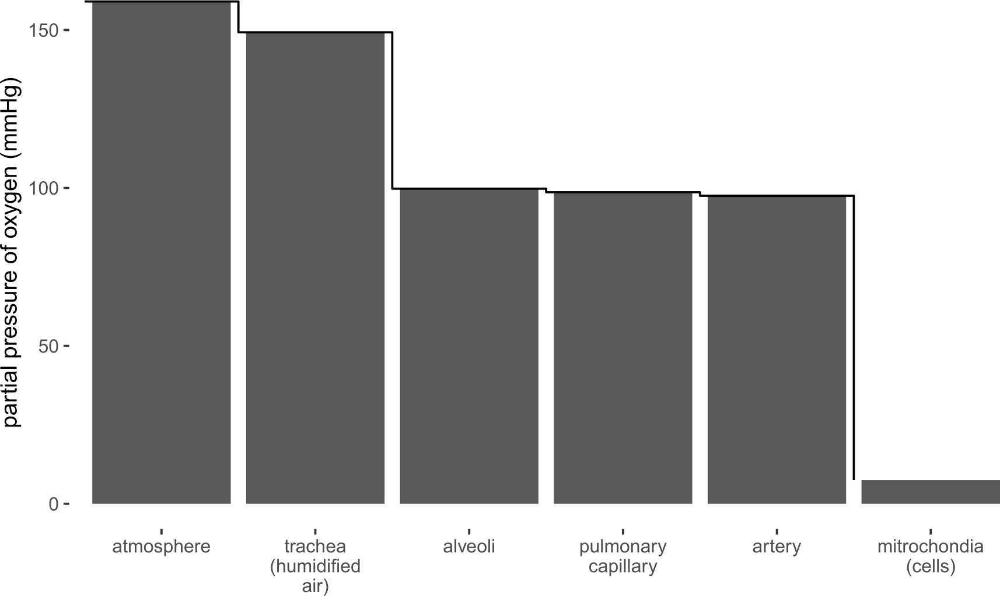
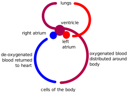

<!-- .slide: data-auto-animate-restart -->
#### MEDI2101 Cardiovascular and Respiratory System.
# Block 1: Respiratory System
Assoc. Prof. Mark Butlin (PhD, BE, SFHEA) (he/him) 
Macquarie Medical School, Faculty of Medicine, Health and Human Sciences Macquarie University. On the land of the Wallumattagal clan of the Dharug Nation.

&nbsp;

&nbsp;

&nbsp;

This material is provided to you as a Macquarie University student for your individual research and study purposes only. You cannot share this material without permission. Macquarie University is the copyright owner of (or has licence to use) the intellectual property in this material. Legal and/or disciplinary actions may be taken if this material is shared without the University’s written permission.

<aside class="notes">

Set-up checklist:

<ul>
<li>Room mic on.</li>
<li>Projecting correct content to correct screen.</li>
<li>Zoom:</li>
<ul>
    <li>Correct mic and camera.</li>
    <li>Capturing projected screen.</li>
    <li>Live transcript on.</li>
    <li>Chat screen visible.</li>
    <li>Focus mode on, speaker video spotlighted.</li>
    <li>RECORDING ON.</li>
</ul>
</ul>
</aside>

---
#### MEDI2101 Cardiovascular and Respiratory System.
### Block 1: Respiratory System
# LO1.1: "Reason" for the cardiovascular and respiratory system

Week 1, Lecture 1

Assoc. Prof. Mark Butlin (PhD, BE, SFHEA) (he/him) 
Macquarie Medical School, Faculty of Medicine, Health and Human Sciences Macquarie University. On the land of the Wallumattagal clan of the Dharug Nation.

---
<!-- .slide: data-auto-animate-restart -->
## LO1.1.1 Understand the root function of the cardiorespiratory system by comparing and contrasting surface diffusion, gills and lungs as respiratory apparatus.

--
<!-- .slide: data-background-image="images/Methicillin-resistant_Staphylococcus_aureus_10047.jpg" data-background-opacity="0.3" -->
### The root function of the cardiorespiratory system
#### &nbsp;

Bacteria do not have a cardiovascular or respiratory system.

And yet they live.

Methicillin-resistant Staphylococcus aureus bacteria. Image #10047 from the Centers for Disease Control and Prevention's Public Health Image Library

--

### The root function of the cardiorespiratory system
####
* **Cellular respiration**
    * breakdown of organic molecules to produce ATP.
* **Energy conversion**
    * A sufficient supply of oxygen is required for the aerobic respiratory machinery (e.g. Kreb's Cycle) and to convert stored energy.
* **Gas exchange**
    * Cellular metabolism generates carbon dioxide must be removed from the cell; oxygen must be able to enter the cell.

--

### The root function of the cardiorespiratory system
#### Comparing and contrasting surface diffusion, gills and lungs as respiratory apparatus

* **Single-cell organisms** 
    * Exchange gases directly across their cell membrane. The slow diffusion rate of oxygen relative to carbon dioxide limits the size of single-celled organisms.
* **Small living organisms** 
    * Simple animals that lack specialized respiratory exchange surfaces have flattened, tubular, or thin shaped body plans, which are the most efficient for gas exchange. These simple animals are rather small in size.
* **Larger animals** 
    * Cannot maintain gas exchange by diffusion across their outer surface. They will have some kind of respiratory surface that increases the surface area for exchange, thus allowing for larger bodies.

--

### The root function of the cardiorespiratory system
#### Comparing and contrasting surface diffusion, gills and lungs as respiratory apparatus

##### Methods of respiration

* **Sponges and jellyfish**
    * Lack specialized organs for gas exchange and take in gases directly from the surrounding water.
* **Annelids (inc. flatworms) and arthropods**
    * Use their outer surfaces as gas
exchange surfaces.
* **Fish**
    * Use gills.
* **Terrestrial vertebrates**
    * Utilize internal lungs

--
<!-- .slide: data-background="#373A36" -->

Eels (a fish) obtain 60% of their oxygen through their skin.

Why can't humans breath through their skin?

We do - but only about 1% of our carbon dioxide is removed via the skin.

Constraints of water loss dictate that terrestrial animals must develop more efficient respiration without dehydration (lungs).

<aside class="notes">
<ul>
<li> Flatworms and annelids use their outer surfaces as gas exchange surfaces.</li>
<li> Earthworms have a series of thin-walled blood vessels known as capillaries. Gas exchange occurs at capillaries located throughout the body as well as those in the respiratory surface.</li>
<li> Amphibians use their skin as a respiratory surface.</li>
<li> Frogs eliminate carbon dioxide 2.5 times as fast through their skin as they do through their lungs.</li>
<li> Eels (a fish) obtain 60% of their oxygen through their skin.</li>
<li> Humans exchange only 1% of their carbon dioxide through their skin.</li>
</ul>

Gills greatly increase the surface area for gas exchange. They occur in a variety of animal groups including arthropods (including some terrestrial crustaceans), annelids, fish, and amphibians. Gills typically are convoluted outgrowths containing blood vessels covered by a thin epithelial layer. Typically gills are organized into a series of plates and may be internal (as in crabs and fish) or external to the body (as in some amphibians).

Gills are very efficient at removing oxygen from water: there is only 1/20 the amount of oxygen present in water as in the same volume of air.

Water flows over gills in one direction while blood flows in the opposite direction through gill capillaries. This counter-current flow maximizes oxygen transfer.

</aside>
--

### The root function of the cardiorespiratory system
#### Tracheal systems

* Many terrestrial animals have their **respiratory surfaces** inside the body and connected to the outside by a series of tubes.
* **Tracheae** are tubes that carry air directly to cells for gas exchange.
* **Spiracles** are openings at the body surface that lead to tracheae that branch into smaller tubes known as tracheoles.
* **Body movements** or contractions speed up the rate of diffusion of gases from tracheae into body cells.
* However, tracheae will not function well in animals whose body is longer than about 5 cm.

--

### The root function of the cardiorespiratory system
#### Tracheal systems

<figure>
    

    <figcaption>
        
Spiracles lead to tracheae that branch into tracheoles, bringing air from the outer surface of the insect into the body of the animal.

    </figcaption>
</figure>

--

### The root function of the cardiorespiratory system
#### Lungs
<figure>
    
 
    <figcaption>
    
Lungs are ingrowths of the body wall and connect to the outside by a series of tubes and small openings.

    
Lungs exist in a number of terrestrial and air borne organisms where large size limits the ability of air to diffuse into the body.

    </figcaption>
</figure>

--

### The root function of the cardiorespiratory system
#### Lungs

<figure>
  

  <figcaption>
    
Amphibians have lungs interfacing with their closed circulatory system.

    
Lungs are ingrowths of the body wall and connect to the outside by a series of tubes and small openings.

    
Lungs exist in a number of terrestrial and air borne organisms where large size limits the ability of air to diffuse into the body.

  </figcaption>
</figure>

--
<!-- .slide: data-background="#D6D2C4" -->
### LO1.1.1 Understand the root function of the cardiorespiratory system by comparing and contrasting surface diffusion, gills and lungs as respiratory apparatus

#### Reflection quiz

Go to <a href="https://buzzonk.com/" >https://buzzonk.com</a> and enter the code provided by the lecturer.

<a href="https://buzzonk.com/">https://buzzonk.com</a>

--
<!-- .slide: data-background="#D6D2C4" -->
### LO1.1.1 Understand the root function of the cardiorespiratory system by comparing and contrasting surface diffusion, gills and lungs as respiratory apparatus

#### Reflection quiz

Cellular respiration is:

(A) the breakdown of organic molecules to produce ATP.
(B) the bulk movement of air into and out of the lungs.
(C) the movement of gases from the atmosphere down to the cells.
(D) the use of lungs within a cell to bring air into the cell.
--
<!-- .slide: data-background="#D6D2C4" -->
### LO1.1.1 Understand the root function of the cardiorespiratory system by comparing and contrasting surface diffusion, gills and lungs as respiratory apparatus

#### Reflection quiz

Why does a frog need to keep its skin wet?

(A) Because slimy skin is protective from predators.

(B) Because the frog would dehydrate otherwise.

(C) To keep it cool through evaporative cooling.

(D) To help it change into a prince or princess one day.

<aside class="notes">Amphibians use their skin as a respiratory surface. Frogs eliminate carbon dioxide 2.5 times as fast through their skin as they do through their lungs.</aside>

<a href="https://buzzonk.com/">https://buzzonk.com</a>

--
<!-- .slide: data-background="#D6D2C4" -->
### LO1.1.1 Understand the root function of the cardiorespiratory system by comparing and contrasting surface diffusion, gills and lungs as respiratory apparatus

#### Reflection quiz

Are you ready for the next learning outcome?

(A) Yes.

(B) No.

(C) Have we started learning?

(D) Will this question be in the exam?

---
<!-- .slide: data-auto-animate-restart -->
## LO1.1.2 Describe the oxygen cascade, the movement of carbon dioxide through the body, and map the key factors that influence gas exchange between the atmosphere and blood.

--

### The oxygen cascade
#### 

**The function of the cardiorespiratory system (with regards to to oxygen)**

* Get the oxygen from atmospheric air to all of the body's cells.

Gases (and fluids) move down a pressure gradient. That is, they flow
from a higher pressure region to a lower pressure region.

--

### The oxygen cascade
#### Dalton's law and partial pressure

**Dalton's law**

The sum of the individual pressures that make up a mixture of gases
is the total pressure of that mixture of gases.

The pressure of an individual gas within a mixture of gases is known
as the *partial pressure*.

--

### The oxygen cascade
#### Dalton's law and partial pressure

Using Dalton's law we can calculate the the partial pressure of oxygen (pO2) and carbon dioxide (pCO2) in atmospheric ("dry") air and humid air (as found in the lungs). In reading this table, note that gases flow from regions of higher partial pressure to lower partial pressure.

<table>
    <tr>
        <th></th>
        <th>dry air </th>
        <th>100% humid air </th>
    </tr>
        <td>Atmospheric pressure </td>
        <td> 760 mmHg </td>
        <td> 760 mmHg </td>
    </tr>
    <tr>
        <td>Vapour pressure </td>
        <td> 0 mmHg </td>
        <td> 24 mmHg </td>
    </tr>
    <tr>
        <td>Gas pressure (atmospheric pressure - vapour pressure) </td>
        <td> 760 mmHg </td>
        <td> 736 mmHg </td>
    </tr>
    <tr>
        <td> pO2 = 21% \(\times\) gas pressure </td>
        <td> 160 mmHg </td>
        <td> 155 mmHg </td>
    </tr>
    <tr>
        <td> pCO2 = 0.033% \(\times\) gas pressure </td>
        <td> 0.25 mmHg </td>
        <td> 0.24 mmHg </td>
    </tr>
</table>

&nbsp

Extension from D.U. Silverthorn, <em>Human Physiology: An integrated approach.</em>

--

### The oxygen cascade
#### Partial pressure gradients and flow of gases

<figure>
    
    <figcaption>
        <b>The oxygen cascade.</b> A gas flows from a region of higher partial pressure to a region of lower partial pressure. Therefore, oxygen will flow from the atmosphere right down to the mitochondria along the cascade of partial pressures along that pathway.
    </figcaption>
</figure>

Figure created for MEDI2101

--
### Movement of carbon dioxide from venous blood to the atmosphere
####

<figure>
    
    <figcaption>
        A gas flows from a region of higher partial pressure to a region of lower partial pressure. Therefore, carbon dioxide will flow from vein, to alveoli, to trachea, and into the atmosphere.
    </figcaption>
</figure>

Figure created for MEDI2101.

--

<!-- .slide: data-background="#373A36" -->

So far we are talking about the passive diffusion of gases from higher pressure to lower pressure.

Later in this unit we will address the mechanical bulk movement of gases in air (ventilation) and in fluid (blood flow).

--
<!-- .slide: data-background="#D6D2C4" -->
### LO1.1.2 Describe the oxygen cascade, the movement of carbon dioxide through the body, and map the key factors that influence gas exchange between the atmosphere and blood.
#### Reflection quiz

Dalton's law describes:

(A) the oxygen cascade.

(B) the movement of carbon dioxide from higher to lower partial pressure regions.

(C) that the total pressure of a gas mixture is the sum of the pressure of the gases in that mixture.

(D) every action has an equal and opposite reaction.

--
<!-- .slide: data-background="#D6D2C4" -->
### LO1.1.2 Describe the oxygen cascade, the movement of carbon dioxide through the body, and map the key factors that influence gas exchange between the atmosphere and blood

#### Reflection quiz

How are you feeling?

(A) Great.

(B) OK so far.

(C) You have scared me by introducing a law of gases in lecture 1.

(D) The first learning outcome was ok, but this second one lost me.

---
<!-- .slide: data-auto-animate-restart -->
## LO1.1.3 Understand the limits and benefits of one, two, three, and four chamber hearts as found in nature.

--

### Evolution and the heart
####

The heart allows movement of blood gases dissolved in a fluid around the body.

The heart allows for the *circulation* of fluid (usually blood, but in the case of spiders, haemolymph) transporting oxygen received at the lungs to the cells, where the oxygen is used, and the fluid is then returned to the lungs again.

--

### Evolution and the heart
####

<figure>
    
    <figcaption>The heart allows for the <em>circulation</em> of fluid (usually blood, but in the case of spiders, haemolymph) transporting oxygen received at the lungs to the cells, where the oxygen is used, and the fluid is then returned to the lungs again.
    </figcaption>
</figure>

Figure created for MEDI2101.

--

### Evolution and the heart
#### Open circulatory system (some invertebrates)

<figure>
    
    <figcaption>
        <ul>
            <li> Spider bodies are filled with haemolymph, which is pumped through arteries by a heart (single tube) into spaces called sinuses surrounding the internal organs.</li>
    <li> When the heart relaxes, blood is drawn back toward the heart through open-ended pores (ostia).</li>
    <li> Haemolymph contains hemocyanin, a respiratory protein similar in function to haemoglobin. Hemocyanin contains two copper atoms, tinting the haemolymph with a faint blue colour.</li>
        </ul>
    </figcaption>
</figure>

--

### Evolution and the heart
#### Closed circulatory system (some invertebrates, including the earthworm)

<figure>
    
    <figcaption>
        The earthworm is an example of an invertebrate that has a closed circulatory system. The earthworm, like the spider, has a simple pump (heart) but has an interconnected system of vessels.
    </figcaption>
</figure>

--

### Evolution and the heart
#### Closed circulatory system (some invertebrates, including the earthworm)

<figure>
    
    <figcaption>
        The earthworm is an example of an invertebrate that has a closed circulatory system. The earthworm, like the spider, has a simple pump (heart) but has an interconnected system of vessels.
    </figcaption>
</figure>

--

### Evolution and the heart
#### Closed vs open circulatory system

<figure>
    
    <figcaption>
        Closed system has an interconnecting system of vessels whereas the open system requires diffusion through other body compartments.
    </figcaption>
</figure>

<a href="http://cnx.org/contents/GFy_h8cu@10.53:rZudN6XP@2/Introduction">http://cnx.org/contents/GFy_h8cu@10.53:rZudN6XP@2/Introduction</a>

--

### Evolution and the heart
#### Fish circulatory system and two chambered heart

<figure>
    
    <figcaption>
        <ol>
            <li> Gills</li>
            <li> Oxygen depleted from blood in vasculature as it circulates</li>
            <li> Two chambered heart drives the circulation of blood</li>
        </ol>
    </figcaption>
</figure>

--

### Evolution and the heart
#### Fish circulatory system and two chambered heart
<figure>
    
    <figcaption>
        Schematic representation of the circulatory system of the fish.
    </figcaption>
</figure>

Figure created for MEDI2101.

--

### Evolution and the heart
#### Fish circulatory system and two chambered heart
<figure>
    
    <figcaption>
        
The fish heart has the formation of chambers with a priming chamber (atrium) and larger main chamber (ventricle), showing the rudimentary components of half the mammalian heart.

        <ul>
            <li> Simple circular flow of blood.</li>
            <li> <b>Venous blood</b> interfaces with <b>water</b> within the gills for interchange of blood gases oxygen and carbon dioxide.</li>
        </ul>
    </figcaption>
</figure>

--

### Evolution and the heart
#### Circulatory system of the frog and the three chambered heart
* Juvenile amphibians (water dwelling phase) have a two chamber heart similar to fish.
* They develop a three chamber heart into adulthood. The respiratory system may change (e.g. frogs change from gills to lungs) or stay the same (axolotl retains gills).

--

### Evolution and the heart
#### Circulatory system of the frog and the three chambered heart
<figure>
    
    <figcaption>
        A schematic of the frog vasculature from 1927 showing a connected, closed circulation and a heart that consists of several chambers.
    </figcaption>
</figure>

The biology of the frog by Holmes, Samuel J. (1927).

--

### Evolution and the heart
#### Circulatory system of the frog and the three chambered heart
<figure>
    
    <figcaption>
        
Amphibian heart consisting of three main chambers consisting of a left and right atrium and a common ventricle.

        <ul>
            <li> <b>advantage:</b>the ventilatory space (lungs) are now perfused by actively pumped blood (unlike the two chamber fish heart).</li>
            <li> <b>disadvantage:</b> oxygenated and de-oxygenated blood mixes (reduced partial pressure difference between systemic arterial blood and cells).</li>
        </ul>
    </figcaption>
</figure>

Figure created for MEDI2101.

--

### Evolution and the heart
#### Circulatory system of the frog and the three chambered heart
<figure>
    
    <figcaption>
        Schematic representation of the frog circulatory system showing reduced partial pressure of oxygen in the systemic vasculature by mixing of oxygenated and de-oxygenated blood in the ventricle.
    </figcaption>
</figure>

Figure created for MEDI2101.

--

### Evolution and the heart
#### The incomplete septum (turtle heart)
<figure>
    
    <figcaption>
        The turtle heart also consists of three chambers, but the large chamber (ventricle) has an incomplete septum that when the heart muscle contracts partially closes, in effect dividing the ventricle momentarily into two ventricles.
    </figcaption>
</figure>

--

### Evolution and the heart
#### The complete septum, but blood mixing at anastomosed right and left aorta (crocodile)
<figure>
    
    <figcaption>
        
In the crocodile we see a heart that is similar to that of the mammalian heart (four chambers).

        
However, the crocodile retains (in evolutionary terms) two aorta that are symmetrical and lead out of the left and right hand sides of the heart.

        
They are anastomosed and still allow mixing of oxygenated and deoxygenated blood.

    </figcaption>
</figure>

--

### Evolution and the heart
#### Mammals
<figure>
    
    <figcaption>
        
The mammalian circulatory system has a pump (right heart) for the pulmonary circulation and another pump (left heart) for the systemic circulation.

        
There is no mixing of the oxygenated and de-oxygenated blood, ensuring that the partial pressure of oxygen in the systemic vasculature is as high as the lungs can provide, increase the partial pressure difference in oxygen between arterial blood and the cells.

    </figcaption>
</figure>

Figure created for MEDI2101.

--

### Evolution and the heart
#### Overview of evolutionary development of the heart
<figure>
    
    <figcaption>
        
The evolution of the heart displayed through how the heart exists in reptiles and mammals today.

        
The evolution of the heart increased the separation of oxygenated and deoxygenated blood, thereby driving greater efficiency.

    </figcaption>
</figure>

National Science Foundation

--

### Evolution and the heart
#### Human heart - embryology
<figure>
    
    <figcaption>
        
Embryonic development of the heart.

        
Note that the stages of embryonic development are not dissimilar to the stages of evolutionary development.

        
The final stages see the closing of the septums between the two atria and the two ventricles.

    </figcaption>
</figure>

--

### Evolution and the heart
#### Human heart - embryology
<figure>
    
    <figcaption>
        
One of the more common congenital cardiac defects is an atrial septal defect.

        
This allows oxygenated blood to mix with deoxygenated blood, and reduce the stroke volume on contraction of the left ventricle.

        
The atria start out as one chamber in embryological development and then the septum forms and in normal development is complete before birth.

    </figcaption>
</figure>

--

### Evolution and the heart
#### Human heart - embryology
<figure>
    
    <figcaption>
        
 Types of ventricular septal defects:

        <ol>
            <li> Conoventricular, malaligned</li>
            <li> Perimembranous </li>
            <li> Inlet</li>
            <li> Muscular</li>
    </figcaption>
</figure>

--
<!-- .slide: data-background="#D6D2C4" -->
### LO1.1.3 Understand the limits and benefits of one, two, three, and four chamber hearts as found in nature
#### Reflection quiz

--
<!-- .slide: data-background="#D6D2C4" -->
### LO1.1.3 Understand the limits and benefits of one, two, three, and four chamber hearts as found in nature

#### Reflection quiz

Why did the lecturer just teach us about evolution?

(A) Because he is sneakily teaching embryology.

(B) Because it assists in understanding the exchange of oxygen and carbon dioxide between blood and air.

(C) Because he is an agnostic fence-sitter who believes in scientific evidence.

(D) All of the above.

---
<!-- .slide: data-auto-animate-restart -->
## LO1.1.4 Define the following terms and understand the relationships between them (as they relate to the cardiovascular and respiratory systems): pressure, pressure gradient, flow, velocity of flow, resistance and radius.

--

### LO1.1.5 Define and understand the relationships: pressure, pressure gradient, flow, velocity of flow, resistance and radius.
####

See this week's on-line activity in iLearn and reading material (physics lecture).

If you do not understand the concepts of pressure, flow, resistance and radius it makes it very hard to understand:

* **the respiratory system**
    * flow of air in tubes due to a pressure differential
* **the cardiovascular system**
    * flow of fluid (blood) in tubes due to a pressure differential
* **cardiovascular regulation**
    * in part through changes in radius of vessels to modulate resistance, to alter pressure and blood flow
* **respiratory diseases**
    * can alter radius of airway, increasing resistance, decreasing air flow

---
<!-- .slide: data-auto-animate-restart -->
## LO1.1.6 Explain the relationships between atmospheric pressure, water vapour pressure and the partial pressures of individual gases and comprehend the relationship between the pressure of a gas and the volume in which it is contained.

See this week's on-line activity in iLearn.

---
<!-- .slide: data-auto-animate-restart -->
## LO1.1.7 Outline the main anatomy of the upper respiratory system and explain the function of each structure.

See anatomy material in iLearn and attend anatomy class.

