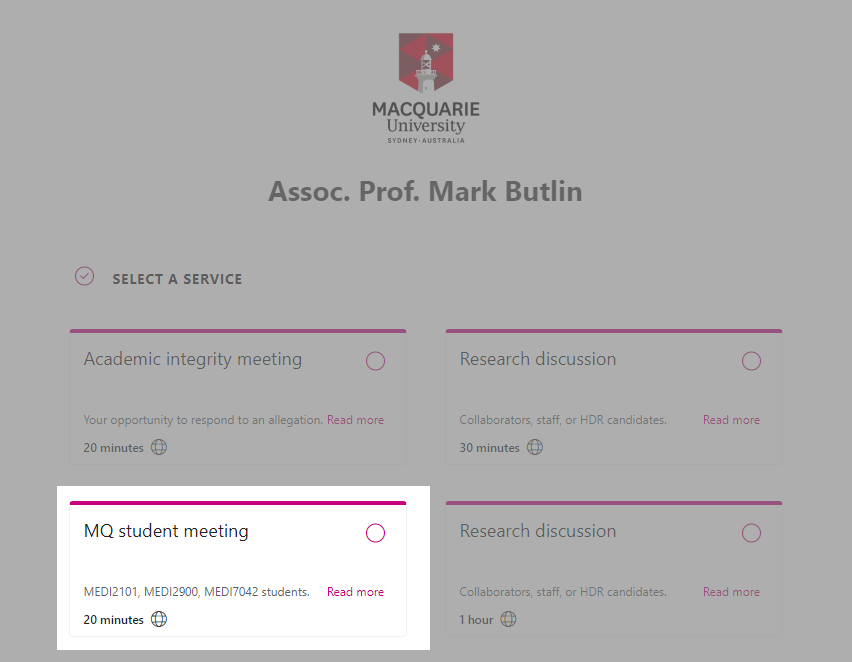

<!-- .slide: id="MEDI2101Wk1_2" data-auto-animate-restart -->
#### MEDI2101 Cardiovascular and Respiratory System.
# Unit overview
(Week 1, Lecture 2)
##### Dr Mark Butlin (PhD, BE, SFHEA) (he/him)

Macquarie Medical School, Faculty of Medicine, Health and Human Sciences Macquarie University. On the land of the Wallumattagal clan of the Dharug Nation.

--
<!-- .slide:  data-background-image="images/AboriginalAustralia1.png" -->

I acknowledge, thank and respect the traditional custodians of the stolen land I have lived upon, the people of the Wiradjuri, Bundjalung, Tharawal, Eora and Dharug nations, whose cultures and customs have nurtured and continue to nurture this land, since the Dreamtime.

--
<!-- .slide: data-background-image="images/CollaborationsMap.png" -->
<h3>Collaborations</h3>
<h4></h4>

--
<!-- .slide: data-background-color="#373A36" -->

Mark Butlin:

Top 0.025% (number 9 of 35,307 researchers) in
  arterial pressure.

No ranking in respiratory physiology.

&nbsp

<a
    href="https://expertscape.com/ex/arterial+pressure">https://expertscape.com/ex/arterial+pressure</a>

<!-- --
### Live lectures in Echo360
#### Taking notes
 -->

<!-- --
<h3>Live lectures in Echo360</h3>
<h4>Posting questions</h4>
 -->

<!-- --
<h3>Live lectures in Echo360</h3>
<h4>Posting questions</h4>

Questions are anonymous to your peers.

It is not <em>completely</em> anonymous - teaching staff can go into the system to find out who
  posted what.

Impolite posting will not be tolerated.
 -->

<!-- --
<h3>Live lectures in Echo360</h3>
<h4>Why Echo360? (and not Zoom)</h4>
<ul>
  <li> Formal Q&A system</li>
  <ul>
    <li> Including possibility to answer questions following the lecture that the lecturer did not answer during the lecture.</li>
  </ul>
  <li> Feedback to unit convenor on how many people are using the live or catchup versions of the lecture.</li>
  <li> Embraces accessibility with automatic generation of a text transcript of the lecture.</li>
</ul>

Disadvantages

<ul>
  <li>I can't see you all!</li>
  <li>No green screen effect (apologies for the drab background)</li>
</ul>

Zoom will be used for anatomy classes to facilitate the interactive "tutorial style" approach to those classes.
 -->

--
### Unit description and outcomes
####

--
<h3>Unit description</h3>
<h4></h4>

This unit introduces integrated learning of the <b>anatomy and physiology of the cardiovascular and respiratory system</b>.

It focuses on: the <b>mechanisms that maintain homeostasis</b> in these coordinated systems including acid-base balance; a working knowledge of the <b>dynamic cardiovascular and respiratory responses to physical challenges</b>; the ability to relate cardiovascular and respiratory diseases to their underlying pathophysiological pathways.

 You will also critically <b>consider scientific and medical evidence</b> in cardiovascular and respiratory contexts to inform hypothesis generation, discussion and individual decision-making.

--

<h3>Unit outcomes</h3>
<h4></h4>
<ul>
<li> Describe the <b>histological and anatomical structures</b> of the cardiovascular and
  respiratory systems.</li>
<li> Explain the <b>functions of the cardiovascular and respiratory system</b>, as well as the
  <b>mechanisms that maintain homeostasis</b> in these coordinated systems.
</li>
<li> Relate knowledge of the structure and function of the cardiovascular and respiratory system
  to <b>disease processes</b>.</li>
<li> Use biomedical literature and the <b>method of scientific enquiry</b> to outline the
  cardiovascular and respiratory response to physical challenges.</li>
<li> Effectively participate in scheduled activities and in peer teams, seeking and reflecting
  on feedback to improve individual and group performance.</li>
</ul>

--

### Unit difficulty
####

--
<!-- .slide: data-background-image="images/Internal_organs - cardiorespiratory.png" data-background-size="70%" -->
<h3>Unit difficulty</h3>
<h4>2nd year unit</h4>

&nbsp

&nbsp

&nbsp

&nbsp

&nbsp

&nbsp

&nbsp

&nbsp

&nbsp

Modified from <a href="https://commons.wikimedia.org/wiki/File:Internal_organs.svg">https://commons.wikimedia.org/wiki/File:Internal_organs.svg</a>

--
<h3>Past grades</h3>
<h4></h4>

--
### Unit overview
####

--
<!-- .slide: data-background-image="images/MEDI2101 Table Overview_1.png" data-background-size="100%" -->

--
<!-- .slide: data-background-image="images/MEDI2101 Table Overview_2.png" data-background-size="100%" -->

--
<!-- .slide: data-background-image="images/MEDI2101 Table Overview_3.png" data-background-size="100%" -->

--
<!-- .slide: data-background-image="images/MEDI2101 Table Overview_4.png" data-background-size="100%" -->

--
<!-- .slide: data-background-image="images/MEDI2101 Table Overview_5.png" data-background-size="100%" -->

--
<h3>Unit structure</h3>
<h4></h4>
<ul>
<li> <b>lectures</b> new knowledge</li>
<li> <b>on-line quizes</b> new knowledge (different to lectures)</li>
<li> <b>reading material</b> reinforce (and extends) the lecture and on-line activities</li>
<li> <b>practicals</b> new knowledge (building on lectures and/or tutorials)</li>
<ul>

--
### Unit structure
#### Lectures

- Lectures will be conducted in person. (Likely to be more engaging in person, possibly more benefit?)
  - Please ask questions. Put your hand up. If I don't see you - shout out.
- Lectures will be simulcast via Zoom.
  - You are welcome to ask questions via the chat function in Zoom.
- Lecture recordings will be available via Echo360 the day after the lecture.
- PDF of slides available by link from left hand menu, then "Print to PDF".

--
### Unit structure
#### Lectures

<video width="66%" data-autoplay src="images/pdf_version_of_slides_instructions.mp4"></video>

--
<h3>Unit structure</h3>
<h4>On-line quizes</h4>
<ul>
  <li>Available in each week's iLearn section.</li>
  <li>Introduces new material.</li>
  <li>Guided learning... hopefully presented in an interesting way.</li>
</ul>

--
<h3>Unit structure</h3>
<h4>Reading material</h4>

--
<h3>Unit structure</h3>
<h4>Practicals - anatomy (Weeks 1 to 6)</h4>
<ul>
  <li><b>Timetabled "Practical 1":</b> Anatomy wet lab (weeks 3 and 6). Bring lab coat.</li>
  <li><b>Timetabled "Practical 2":</b> Anatomy dry lab (weeks 1, 2, 4 and 5).</li>
  <li> <b>Make sure to do the pre-work.</b> Without doing the pre-work, you will not get much
    value out of the on-line classes.</li>
  <li> On-line anatomy quiz each week (Week 1 through 6) to help you test your knowledge.</li>
  <li> Anatomy test (Week 7)</li>
  <ul>
    <li>On-line</li>
    <li>During lecture time.</li>
  </ul>
</ul>
--
<h3>Unit structure</h3>
<h4>Practicals - anatomy (Weeks 1 to 6)</h4>

<h5>&nbsp;</h5>
<h5>Cardiovascular and respiratory anatomy - a mini-unit within a unit</h5>

Delivered through the series of anatomy workshops (12 hours face-to-face) + on-line / self-paced study.

Dr Mirjana Strkalj. Anatomy Teaching Lead.

--
<h3>Unit structure</h3>
<h4>Practicals - Physiological measurement (Weeks 7 to 10)</h4>

Timetabled "Practical 2":</b> Physiology practicals (weeks 7 to 10).

Learning physiology through doing.

- Learning how to take some non-invasive cardiovascular and respiratory measurements.
- Provoking the body and observing the cardiovascular and respiratory response.
- Deducing <em>how</em> the response occurred.

Collection of data for Asessment Task 3.

--
### Assessment tasks
####

--
<h3>Assessment tasks</h3>
<h4>Assessment task 1: Formative quiz (0%). Due week 3.</h4>

On-line in iLearn.

Reviews some of the respiratory component (physiology and anatomy) of MEDI2101.

0% assessment task, but it provides written feedback on working out specific answers where people might make mistakes (e.g., in a final exam).

<ul>
  <li> Feedback is provided with each question.</li>
  <li> The mark will also provide you feedback on whether you are tracking well so far.</li>
</ul>

--
<h3>Assessment tasks</h3>
<h4>Assessment Task 2: Anatomy test (20%). During lecture, week 7.</h4>
<ul>
  <li> Anatomy quiz delivered during the 1st hour of the week 7 lecture.</li>
  <li> Created by Dr Mirjana Strkalj.</li>
  <li> It is likely to be challenging.</li>
</ul>

--
<h3>Assessment tasks</h3>
<h4>Assessment Task 3: Manuscript (35%) Due week 8 and 12</h4>

Three parts:

<ol>
  <li> <b>Figure for an introduction.</b> Flow diagram explaining your hypothesis for what will
    happen in the experiment (Due week 8).
  <li> <b>Conducting experiment.</b> In class during physiological measurement practical. Not assessed, but will be beneficial because:
  <ul>
    <li>you will get to see and experience the physiology you will be talking about.</li>
    <li>teaching staff will likely guide you toward the correct thinking.</li>
  </ul>
  <li> <b>Discussion.</b> Discussion of results, limitations, and conclusion. (Due week 12)
</ol>

--
<h3>Assessment tasks</h3>
<h4>Assessment Task 4: Exam (45%). Held during exam period.</h4>

Traditional final examination during examination period.

 

Week 13 is a review week. (No new content, and no teaching activities.)

--
<!-- .slide:  data-background-image="images/studiosity.png" data-background-position="right" data-background-size="contain" -->
<h3>Assessment tasks</h3>
<h4>Free help</h4>

- <a href="https://students.mq.edu.au/support/study/writing/studiosity">Studiosity</a> (External service. Free sessions for Macquarie University students)
- <a href="https://students.mq.edu.au/support/study/writing/writewise">WriteWise</a> (Macquarie free service.)
- <a href="https://ilearn.mq.edu.au/enrol/index.php?id=16580">StudyWise</a> (Macquarie free course.)

Relatively new tool:

- <a href="https://students.mq.edu.au/support/technology/systems/ilearn/assignments-grades">Turn-it-in Draft Coach</a> Check grammar, citations, and similarity <b>before</b> submitting your assessment task.

--
<h3>Assessment tasks</h3>
<h4>Accessibility support</h4>

If you are someone with an on-going health condition, disability and/or are a carer of a person with a disability, please consider contacting <a href="https://students.mq.edu.au/support/accessibility-disability">Accessibility Support and Services</a> early during session to put in an Individual Education Access Plan for MEDI2101.

You are welcome to contact me (you do not need to provide details) so that I can follow up with Accessibility Support to make sure they have put in place your Individual Education Access Plan in MEDI2101.

--
<!-- .slide: data-auto-animate -->
<h3>Open virtual and real door</h3>
<h4></h4>

--
<h3>Activities this week.</h3>
<h4></h4>

<a href="https://ilearn.mq.edu.au/course/view.php?id=64513&notifyeditingon=1#section-5"> MEDI2101 iLearn Week 1</a>