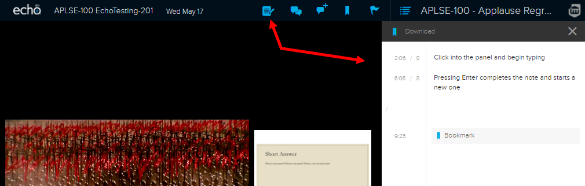
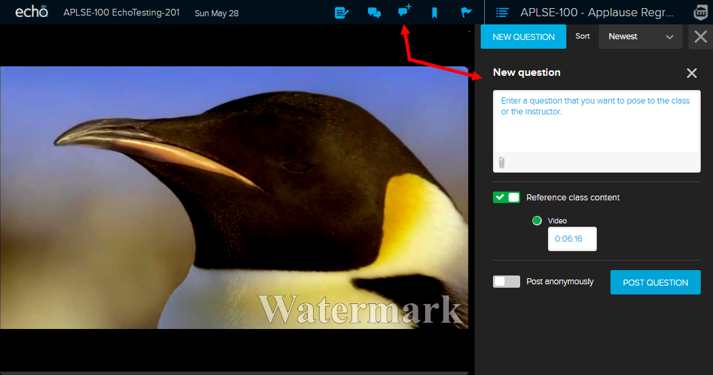
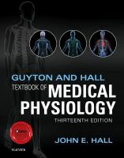

<!-- .slide: id="MEDI2101Wk1_2" -->  
#### MEDI2101 Cardiovascular and Respiratory System.
# Unit overview
(Week 1, Lecture 2)
##### Dr Mark Butlin (PhD, BE, SFHEA)
Macquarie Medical School

Faculty of Medicine, Health and Human Sciences, Macquarie University.

--
<!-- .slide:  data-background-image="images/AboriginalAustralia1.png" -->

I acknowledge, thank and respect the traditional custodians of the stolen land I have lived upon, the people of the Wiradjuri, Bundjalung, Tharawal, Eora and Dharug nations, whose cultures and customs have nurtured and continue to nurture this land, since the Dreamtime.

--
<!-- .slide: data-background-image="images/CollaborationsMap.png" -->
<h3>Collaborations</h3>
<h4></h4>

--
<!-- .slide: data-background-color="#373A36" -->
<h1 style="color:white">Mark Butlin:</h1>
<h1 style="color:white">Top 0.025% (number 7 of 28,135 researchers) in
  arterial pressure.</h1>
<h1 class="no-toc-progress fragment" style="color:white">No ranking in respiratory physiology.</h1>

&nbsp

<a
    href="https://expertscape.com/ex/arterial+pressure">https://expertscape.com/ex/arterial+pressure</a>

--
<h2>Using Echo360 for live lectures.</h2>

--
<h3>Live lectures in Echo360</h3>
<h4>Taking notes</h4>

--
<h3>Live lectures in Echo360</h3>
<h4>Posting questions</h4>

--
<h3>Live lectures in Echo360</h3>
<h4>Posting questions</h4>

Questions are anonymous to your peers.

It is not <em>completely</em> anonymous - teaching staff can go into the system to find out who
  posted what.

Impolite posting will not be tolerated.

--
<h3>Live lectures in Echo360</h3>
<h4>Why Echo360? (and not Zoom)</h4>
<ul>
  <li> Formal Q&A system</li>
  <ul>
    <li> Including possibility to answer questions following the lecture that the lecturer did not answer during the lecture.</li>
  </ul>
  <li> Feedback to unit convenor on how many people are using the live or catchup versions of the lecture.</li>
  <li> Embraces accessibility with automatic generation of a text transcript of the lecture.</li>
</ul>

Disadvantages

<ul>
  <li>I can't see you all!</li>
  <li>No green screen effect (apologies for the drab background)</li>
</ul>

Zoom will be used for anatomy classes to facilitate the interactive "tutorial style" approach to those classes.

--
<h2>Unit description and outcomes</h2>

--
<h3>Unit description</h3>
<h4></h4>

This unit introduces integrated learning of the <b>anatomy and physiology of the cardiovascular and respiratory system</b>.

It focuses on: the <b>mechanisms that maintain homeostasis</b> in these coordinated systems including acid-base balance; a working knowledge of the <b>dynamic cardiovascular and respiratory responses to physical challenges</b>; the ability to relate cardiovascular and respiratory diseases to their underlying pathophysiological pathways.

 You will also critically <b>consider scientific and medical evidence</b> in cardiovascular and respiratory contexts to inform hypothesis generation, discussion and individual decision-making.

--

<h3>Unit outcomes</h3>
<h4></h4>
<ul>
<li> Describe the <b>histological and anatomical structures</b> of the cardiovascular and
  respiratory systems.</li>
<li> Explain the <b>functions of the cardiovascular and respiratory system</b>, as well as the
  <b>mechanisms that maintain homeostasis</b> in these coordinated systems.
</li>
<li> Relate knowledge of the structure and function of the cardiovascular and respiratory system
  to <b>disease processes</b>.</li>
<li> Use biomedical literature and the <b>method of scientific enquiry</b> to outline the
  cardiovascular and respiratory response to physical challenges.</li>
<li> Effectively participate in scheduled activities and in peer teams, seeking and reflecting
  on feedback to improve individual and group performance.</li>
</ul>

--

<h2>Unit difficulty</h2>

--
<!-- .slide: data-background-image="images/Internal_organs - cardiorespiratory.png" data-background-size="70%" -->
<h3>Unit difficulty</h3>
<h4>2nd year unit</h4>

&nbsp

&nbsp

&nbsp

&nbsp

&nbsp

&nbsp

&nbsp

&nbsp

&nbsp

Modified from <a href="https://commons.wikimedia.org/wiki/File:Internal_organs.svg">https://commons.wikimedia.org/wiki/File:Internal_organs.svg</a>

--
<h3>Past grades</h3>
<h4></h4>

--
<h2>Unit overview</h2>

--
<!-- .slide: data-background-image="images/MEDI2101 Table Overview_1.png" data-background-size="100%" -->

--
<!-- .slide: data-background-image="images/MEDI2101 Table Overview_2.png" data-background-size="100%" -->

--
<!-- .slide: data-background-image="images/MEDI2101 Table Overview_3.png" data-background-size="100%" -->

--
<!-- .slide: data-background-image="images/MEDI2101 Table Overview_4.png" data-background-size="100%" -->

--
<!-- .slide: data-background-image="images/MEDI2101 Table Overview_5.png" data-background-size="100%" -->

--
<h3>Unit structure</h3>
<h4></h4>
<ul>
<li> <b>lectures</b> new knowledge</li>
<li> <b>on-line quizes</b> new knowledge (different to lectures)</li>
<li> <b>reading material</b> reinforce (and extends) the lecture and on-line activities</li>
<li> <b>practicals</b> new knowledge (building on lectures and/or tutorials)</li>
<ul>

--
<h3>Unit structure</h3>
<h4>Lectures</h4>
<ul>
  <li>on-line</li>
  <li>live via Echo360</li>
  <li>recorded for review (Echo360)</li>
</ul>

--
<h3>Unit structure</h3>
<h4>On-line quizes</h4>
<ul>
  <li>Available in each week's iLearn section.</li>
  <li>Introduces new material.</li>
  <li>Guided learning... hopefully presented in an interesting way.</li>
</ul>

--
<h3>Unit structure</h3>
<h4>Reading material</h4>

--
<h3>Unit structure</h3>
<h4>Practicals - anatomy (Weeks 1 to 6)</h4>
<ul>
  <li>On-line</li>
  <li>Use time slot for Practical 2 for weeks 1 through 6</li>
  <ul>
    <li>Ignore Practical 1 timetable.</li>
  </ul>
  <li> <b>Make sure to do the pre-work.</b> Without doing the pre-work, you will not get much
    value out of the on-line classes.</li>
  <li> On-line anatomy quiz each week (Week 1 through 6) to help you test your knowledge.</li>
  <li> Anatomy test (Week 7)</li>
  <ul>
    <li>On-line</li>
    <li>During lecture time.</li>
  </ul>
</ul>

--
<h3>Unit structure</h3>
<h4>Practicals - Physiological measurement (Weeks 7 to 10)</h4>

--
<h2>Assessment tasks</h2>

--
<h3>Assessment tasks</h3>
<h4>Assessment task 1: Formative quiz (0%). Due week 3.</h4>

On-line in iLearn.

Reviews some of the respiratory component (physiology and anatomy) of MEDI2101.

0% assessment task, but <b>compulsory to complete to pass the unit.</b>

Feedback:

<ul>
  <li> Feedback is provided with each question.</li>
  <li> The mark will also provide you feedback on whether you are tracking well so far.</li>
</ul>

--
<h3>Assessment tasks</h3>
<h4>Assessment Task 2: Anatomy test (25%). During lecture, week 7.</h4>
<ul>
  <li> On-line anatomy quiz.</li>
  <li> Created by Dr Mirjana Strkalj</li>
  <li> It is likely to be hard.</li>
</ul>

--
<h3>Assessment tasks</h3>
<h4>Assessment Task 3: Manuscript (35%) Due week 8 and 12</h4>

Three parts:

<ol>
  <li> <b>Figure for an introduction</b> Flow diagram explaining your hypothesis for what will
    happen in the experiment (Due week 8).
  <li> <b>Conducting experiment</b> Hopefully in class during physiological measurement practical.
    If not, a video demonstration will be provided and a data set and results placed on iLearn.
  <li> <b>Discussion</b> Discussion of results, limitations, and conclusion. (Due week 12)
</ol>

--
<h3>Assessment tasks</h3>
<h4>Assessment Task 4: Exam (40%). Held during exam period.</h4>

The final exam was able to be held on campus last year and the same is planned for this year as
  well.

However, if restrictions do not allow for an on-campus exam, an on-line equivalent will be put in
  place

 

Week 13 has been left open as a review week.

--
<h3>Assessment tasks</h3>
<h4>Accessibility support</h4>

If you are someone with an on-going health condition, disability and/or are a carer of a person with a disability, please consider contacting Accessibility Support and Services early during session to put in an Individual Education Access Plan for MEDI2101.

You are welcome to contact me (you do not need to provide details) so that I can follow up with Accessibility Support to make sure they have put in place your Individual Education Access Plan in MEDI2101.

--
<!-- .slide: data-auto-animate -->
<h3>Open (virtual) door</h3>
<h4></h4>

--
<h3>Activities this week.</h3>
<h4></h4>

<ul>
<li> <b>Complete on-line activity:</b> Cardiorespiratory physical concepts of pressure, flow and
  resistance</li>
<li> <b>Read:</b> PHYS149 lecture notes</li>
<li> <b>Read:</b> Guyton and Hall, Chapter 41</li>
<li> <b>Complete anatomy preparation worksheet:</b> Upper respiratory</li>
<li> <b>Attend and engage with:</b> Upper respiratory anatomy class</li>
<li> <b>Complete anatomy formative quiz:</b> Upper respiratory</li>
</ul>