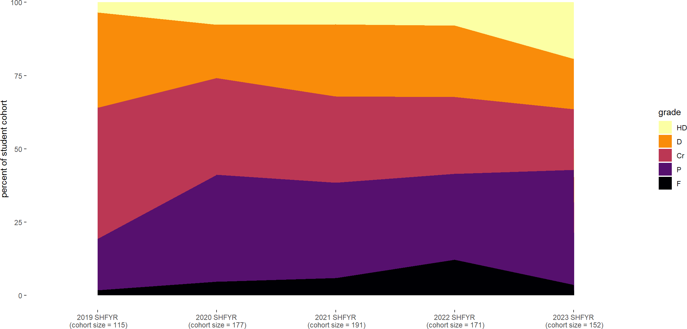

<!-- .slide: id="MEDI2101Wk1_2" data-auto-animate-restart -->
#### MEDI2101 Cardiovascular and Respiratory System.
# Unit overview

Week 1, Lecture 2

Assoc. Prof. Mark Butlin (PhD, BE, SFHEA) (he/him) 
Macquarie Medical School, Faculty of Medicine, Health and Human Sciences Macquarie University. On the land of the Wallumattagal clan of the Dharug Nation.

&nbsp;

&nbsp;

&nbsp;

This material is provided to you as a Macquarie University student for your individual research and study purposes only. You cannot share this material without permission. Macquarie University is the copyright owner of (or has licence to use) the intellectual property in this material. Legal and/or disciplinary actions may be taken if this material is shared without the University’s written permission.

--
### Unit support

<ul>
  <li>Recognition that the university journey can have difficulties with causes <b>both internal and external</b> to the university.</li>
  <li>+ demands are different now (cost of living, university fees, world “temperament”).</li>
  <li>+ world temperament is not great (unsettled after/during COVID-19 impact; wars; climate change; ...)
  <li>+ this is a second year unit that many will be sitting in their first year.</li>
</ul>

**Please contact Mark Butlin early if you are having difficulties, so that we can help you succeed in this unit.**

--
<!-- .slide:  data-background-image="images/AboriginalAustralia1.png" -->

I acknowledge, thank and respect the traditional custodians of the stolen land I have lived upon, the people of the Wiradjuri, Bundjalung, Tharawal, Eora and Dharug nations, whose cultures and customs have nurtured and continue to nurture this land, since the Dreamtime.

--
<!-- .slide: data-background-image="images/CollaborationsMap.png" -->
<h3>Your unit convener's experience</h3>
<h4>Engineer | Research collaborations | Industry collaborations | Clinical work</h4>

--
<!-- .slide: data-background-color="#373A36" -->

Mark Butlin:

Top 0.023% (number 8 of 34,194 researchers) in
  arterial pressure.

No ranking in respiratory physiology.

&nbsp

<a
    href="https://expertscape.com/ex/arterial+pressure">https://expertscape.com/ex/arterial+pressure</a>

<!--
### Live lectures in Echo360
#### Taking notes

<h3>Live lectures in Echo360</h3>
<h4>Posting questions</h4>

<h3>Live lectures in Echo360</h3>
<h4>Posting questions</h4>

Questions are anonymous to your peers.

It is not <em>completely</em> anonymous - teaching staff can go into the system to find out who
  posted what.

Impolite posting will not be tolerated.

<h3>Live lectures in Echo360</h3>
<h4>Why Echo360? (and not Zoom)</h4>
<ul>
  <li> Formal Q&A system</li>
  <ul>
    <li> Including possibility to answer questions following the lecture that the lecturer did not answer during the lecture.</li>
  </ul>
  <li> Feedback to unit convenor on how many people are using the live or catchup versions of the lecture.</li>
  <li> Embraces accessibility with automatic generation of a text transcript of the lecture.</li>
</ul>

Disadvantages

<ul>
  <li>I can't see you all!</li>
  <li>No green screen effect (apologies for the drab background)</li>
</ul>

Zoom will be used for anatomy classes to facilitate the interactive "tutorial style" approach to those classes.

<h3>Unit description and outcomes</h3>
<h4></h4>

<h3>Unit description</h3>
<h4></h4>

This unit introduces integrated learning of the <b>anatomy and physiology of the cardiovascular and respiratory system</b>.

It focuses on: the <b>mechanisms that maintain homeostasis</b> in these coordinated systems including acid-base balance; a working knowledge of the <b>dynamic cardiovascular and respiratory responses to physical challenges</b>; the ability to relate cardiovascular and respiratory diseases to their underlying pathophysiological pathways.

 You will also critically <b>consider scientific and medical evidence</b> in cardiovascular and respiratory contexts to inform hypothesis generation, discussion and individual decision-making.

<h3>Unit outcomes</h3>
<h4></h4>
<ul>
<li> Describe the <b>histological and anatomical structures</b> of the cardiovascular and
  respiratory systems.</li>
<li> Explain the <b>functions of the cardiovascular and respiratory system</b>, as well as the
  <b>mechanisms that maintain homeostasis</b> in these coordinated systems.
</li>
<li> Relate knowledge of the structure and function of the cardiovascular and respiratory system
  to <b>disease processes</b>.</li>
<li> Use biomedical literature and the <b>method of scientific enquiry</b> to outline the
  cardiovascular and respiratory response to physical challenges.</li>
<li> Effectively participate in scheduled activities and in peer teams, seeking and reflecting
  on feedback to improve individual and group performance.</li>
</ul>
-->

<!-- .slide: data-background-image="images/Internal_organs - cardiorespiratory.png" data-background-size="70%" -->
<!-- <h3>Systems physiology</h3> -->
<!--  <h4>2nd year unit</h4> -->

&nbsp

&nbsp

&nbsp

&nbsp

&nbsp

&nbsp

&nbsp

&nbsp

&nbsp

Modified from <a href="https://commons.wikimedia.org/wiki/File:Internal_organs.svg">https://commons.wikimedia.org/wiki/File:Internal_organs.svg</a>

<aside class="notes">This is a systems physiology unit, and encompasses the interaction between many different body components. This is what makes this unit fun and interesting. It is also what can make this unit challenging.</aside>

--
<h3>Past grades</h3>
<h4></h4>

--
<h3>Past grades</h3>
<h4></h4>

Uat#: Unit assessment task number #

--
### Learning opportunities
#### Face-to-face

<table>
  <tbody>
    <tr>
      <td>
          <h5>Lecture</h5>
      </td>
      <td>
Lectures are held each week. Live in person. Simulcast live via Echo360. Catch-up via Echo360 (next day).
         
        Closed captioning is available through Echo360.

      </td>
    </tr>
    <tr>
      <td>
          <h5>Lectorial</h5>
      </td>
      <td>
In weeks 1, 2, 3, 4 and 6, a lecture style tutorial covering anatomy content.
         
        Lectorials are <strong>only offered in person, on campus</strong>. There is no Echo360 catch-up for the lectorials.

      </td>
    </tr>
    <tr>
      <td>
          <h5>Practical</h5>
      </td>
      <td>
In weeks 5, the practical will be in the wet-lab anatomy space for teaching and review of anatomy content.
         In weeks 7 to 12, the practicals will be on physiology with hands on taking of physiological measurements.
         
        Practicals are <strong>only offered in person, on campus</strong>. There is no Echo360 catch-up for the practicals.
        

      </td>
    </tr>
    </tbody>
    </table>

--
### Learning opportunities
#### Self-paced
<table>
  <tbody>
    <tr>
      <td>
          <h5>On-line module</h5>
      </td>
      <td>
On-line modules are provided in each week's material on the unit iLearn page. These provide a mixture of <b>new concepts</b> and review.

      </td>
    </tr>
    <tr>
      <td>
          <h5>Reading</h5>
      </td>
      <td>
The list of reading is provided in Leganto (links in iLearn). It is recommended to use a text-to-speech tool.

      </td>
    </tr>
  </tbody>
</table>
 

<strong>There are no tutorials </strong>in this unit, given the concentration on practical classes. On-line video / slide / reading / quiz material is provided each week in place of tutorials.

--
#### Unit overview
#### Block 1: Respiratory system

<table style="width:100%" class="table-bordered table-hover">
  <thead class="text-uppercase">
    <tr>
      <th rowspan="2">Week</th>
      <th colspan="2">Face-to-face</th>
      <th rowspan="2">Self-paced</th>
      <th rowspan="2">Assessment task</th>
    </tr>
    <tr>
      <th>Week topic and lectures</th>
      <th>Lectorials and practicals</th>
    </tr>
  </thead>
  <tbody>
    <tr>
      <th>1</th>
      <th align="left">
        <h5>Introduction of concepts</h5>
        1.1 "Reason" for the cardiovascular and respiratory system
         - Unit introduction</th>
      <td><strong>Lectorial: </strong> Upper respiratory anatomy</td>
      <td><strong>Module:</strong> Cardiovascular and respiratory physical concepts: pressure, flow and resistance
         <strong>Reading:</strong> Guyton and Hall (See Leganto)
      </td>
      <td></td>
    </tr>
    <tr>
      <th>2</th>
      <th align="left">
        <h5>Respiratory system</h5>
        1.2 Ventilation
         1.3 Gas exchange
      </th>
      <td><strong>Lectorial: </strong>Lower respiratory anatomy</td>
      <td><strong>Module:</strong> The scientific method in (bio)medical investigation
         Knowledge for AT3
         
        <strong>Reading:</strong> Guyton and Hall (See Leganto)
      </td>
      <td></td>
    </tr>
    <tr>
      <th>3</th>
      <th align="left">
        <h5>Respiratory regulation</h5>
        1.4 The respiratory centre and regulation output
         1.5 Respiratory regulation inputs
      </th>
      <td><strong>Practical: </strong>Upper and lower respiratory anatomy (review)</td>
      <td><strong>Module:</strong> Arterial blood gases and acidosis and alkalosis
         
        <strong>Reading:</strong> Guyton and Hall (See Leganto)
      </td>
      <td style="color:white" bgcolor="#373A36">AT1: Formative online quiz (0%)</td>
    </tr>
  </tbody>
</table>

--
<!-- #### Unit overview -->
#### Block 2: Cardiovascular system

<table style="width:100%" class="table-bordered table-hover">
  <thead class="text-uppercase">
    <tr>
      <th rowspan="2">Week</th>
      <th colspan="2">Face-to-face</th>
      <th rowspan="2">Self-paced</th>
      <th rowspan="2">Assessment task</th>
    </tr>
    <tr>
      <th>Week topic and lectures</th>
      <th>Lectorials and practicals</th>
    </tr>
  </thead>
  <tbody>
    <tr>
      <th>4</th>
      <th align="left">
        <h5>The heart</h5>
        2.1 Basics of the heart
         2.2 Intrinsic regulation of the heart
      </th>
      <td><strong>Lectorial: </strong>The heart and mediastinum</td>
      <td><strong>Module:</strong> The Wigger's diagram
         
        <strong>Reading:</strong> Guyton and Hall (See Leganto)
      </td>
      <td></td>
    </tr>
    <tr>
      <th>5</th>
      <th align="left">
        <h5>Circulatory system</h5>
        2.3 Basics of the circulatory system
         2.4 Blood pressure and flow
      </th>
      <td><strong>Lectorial: </strong>The major blood vessels</td>
      <td><strong>Module:</strong> The constituents of blood
         
        <strong>Reading:</strong> Guyton and Hall (See Leganto)
      </td>
      <td></td>
    </tr>
    <tr>
      <th>6</th>
      <th align="left">
        <h5>Cardiovascular regulation</h5>
        2.5 Cardiovascular regulation, part 1
         2.6 Cardiovascular regulation, part 2</th>
      <td><strong>Practical: </strong>Anatomy review</td>
      <td><strong>Module:</strong> Renal regulation of acid-base balance
         
        <strong>Reading:</strong> Guyton and Hall (See Leganto)
      </td>
      <td></td>
    </tr>
    <tr>
      <th>7</th>
      <th align="left">AT2: Anatomy test
         
        <h5>The microcirculation and lymph flow</h5>
        2.7 Fluid exchange at the capillaries
      </th>
      <td><strong>Practical: </strong> Introduction to some respiratory and cardiovascular instrumentation.</td>
      <td><strong>Module:</strong> The lymphatic system and lymphedema
         
        <strong>Reading:</strong> Guyton and Hall (See Leganto)
      </td>
      <td style="color:white" bgcolor="#373A36">AT2: Anatomy test during lecture period (20%)</td>
    </tr>
  </tbody>
</table>

--
#### Unit overview
#### Block 3: Cardiovascular and respiratory integration

<table style="width:100%" class="table-bordered table-hover">
  <thead class="text-uppercase">
    <tr>
      <th rowspan="2">Week</th>
      <th colspan="2">Face-to-face</th>
      <th rowspan="2">Self-paced</th>
      <th rowspan="2">Assessment task</th>
    </tr>
    <tr>
      <th>Week topic and lectures</th>
      <th>Lectorials and practicals</th>
    </tr>
  </thead>
  <tbody>
    <tr>
      <th>8</th>
      <th align="left">AT2 special consideration: Supplementary anatomy test
        <h5>3.1 Introduction to exercise cardiovascular and respiratory physiology</h5>
      </th>
      <td style="color:white" bgcolor="#373A36"><strong>Practical: </strong> Physiological measurement data collection for AT3.2.</td>
      <td><strong>Module:</strong> Exercise, a modifiable lifestyle factor to reduce cardiovascular risk
         
        <strong>Reading:</strong> Guyton and Hall (See Leganto)
      </td>
      <td style="color:white" bgcolor="#373A36">AT3.1 Hypothesis testing. Publication figure (10%)</td>
    </tr>
    <tr>
      <th>9</th>
      <th align="left">
        <h5>
            3.2 Cardiorespiratory homeostasis and thermal regulation</h5>
      </th>
      <td><strong>Practical: </strong> Exercise physiology</td>
      <td><strong>Module:</strong> Extremes of thermoregulation
         
        <strong>Reading:</strong> Guyton and Hall (See Leganto)
      </td>
      <td></td>
    </tr>
  </tbody>
</table>

--
#### Unit overview
#### Block 4: Cardiovascular and respiratory system in disease

<table style="width:100%" class="table-bordered table-hover">
  <thead class="text-uppercase">
    <tr>
      <th rowspan="2">Week</th>
      <th colspan="2">Face-to-face</th>
      <th rowspan="2">Self-paced</th>
      <th rowspan="2">Assessment task</th>
    </tr>
    <tr>
      <th>Week topic and lectures</th>
      <th>Lectorials and practicals</th>
    </tr>
  </thead>
  <tbody>
    <tr>
      <th>10</th>
      <th align="left">
        <h5>
            4.1 Indigenous cardiovascular and respiratory health</h5>
      </th>
      <td><strong>Practical: </strong> Autonomic function tests</td>
      <td><strong>Module:</strong> Intergenerational trauma and social determinants of health</td>
      <td></td>
    </tr>
    <tr>
      <th>11</th>
      <th align="left">
        <h5 style="">
            4.2 Conduction diseases 4.4 Heart failure</h5>
      </th>
      <td><strong>Practical: </strong> Electrical activity of the heart</td>
      <td><strong>Module:</strong> Heart failure
         
        <strong>Reading:</strong> Journal article (See Leganto)</td>
      <td></td>
    </tr>
    <tr>
      <th>12</th>
      <th align="left">
        <h5>
            4.3 Chronic obstructive pulmonary disease 4.4 Isolated Systolic Hypertension</h5>
      </th>
      <td><strong>Practical: </strong> Respiratory physiology</td>
      <td><strong>Module:</strong> COPD. ISH.
         
        <strong>Reading:</strong> Journal article (See Leganto)</td>
      <td style="color:white" bgcolor="#373A36">AT3.2: Hypothesis testing. Discussion (25%)
      </td>
    </tr>
  </tbody>
</thead>

--
#### Unit overview
#### Block 5: Review and assess

<table style="width:100%" class="table-bordered table-hover">
  <thead class="text-uppercase">
    <tr>
      <th rowspan="2">Week</th>
      <th colspan="2">Face-to-face</th>
      <th rowspan="2">Self-paced</th>
      <th rowspan="2">Assessment task</th>
    </tr>
    <tr>
      <th>Week topic and lectures</th>
      <th>Lectorials and practicals</th>
    </tr>
  </thead>
  <tbody>
    <tr>
      <td bgcolor="#D6D2C4">13</td>
      <td bgcolor="#D6D2C4">Review
         Q&amp;A session in lecture</td>
      <td bgcolor="#D6D2C4">-</td>
      <td bgcolor="#D6D2C4">-</td>
      <td></td>
    </tr>
    <tr>
      <td bgcolor="#D6D2C4">Exam period</td>
      <td bgcolor="#D6D2C4">Examination</td>
      <td bgcolor="#D6D2C4">-</td>
      <td bgcolor="#D6D2C4">-</td>
      <td style="color:white" bgcolor="#373A36">AT4: Final exam (45%)</td>
    </tr>
  </tbody>
</table>

--
### Teaching staff
####

 &nbsp; 

- **Unit convener / lecturer:** [Assoc. Prof. Mark Butlin](https://researchers.mq.edu.au/en/persons/mark-butlin) &nbsp;
- **Anatomy teaching leads:** Dr Jessica Madden; [Dr Linda Ban](https://researchers.mq.edu.au/en/persons/linda-ban) &nbsp;
<!-- - **Anatomy teaching staff:** Rohit Harwad; Arshia Jamshidi; Sadhvi Naresh; Aleksander Strkalj &nbsp; -->
- **Physiology teaching staff:** [Dr Linda Ban](https://researchers.mq.edu.au/en/persons/linda-ban), [Dr Peter Burke](https://researchers.mq.edu.au/en/persons/peter-burke), [Assoc. Prof. Mark Butlin](https://researchers.mq.edu.au/en/persons/mark-butlin) &nbsp;
- **Guest lecturers:** [Bianca Coehla](https://au.linkedin.com/in/bianca-coelho-1341831b?original_referer=https%3A%2F%2Fduckduckgo.com%2F); [Dr Isabella Tan](https://researchers.mq.edu.au/en/persons/isabella-tan); [Prof. Alvin Ing](https://researchers.mq.edu.au/en/persons/alvin-ing) &nbsp;

--
<h3>Assessment tasks</h3>
<h4>Assessment task 1: Formative quiz (0%). Due week 3.</h4>

On-line in iLearn.

Due in week 3, but able to submit after <b>without</b> special consideration.

No time limit.

Reviews some of the respiratory component (physiology and anatomy) of MEDI2101.

0% assessment task, but it provides written feedback on working out specific answers where people might make mistakes (e.g., in a final exam).

<ul>
  <li> Feedback is provided with each question.</li>
  <li> The mark will also provide you feedback on whether you are tracking well so far.</li>
</ul>

--
<h3>Assessment tasks</h3>
<h4>Assessment Task 2: Anatomy test (20%). During lecture, week 7.</h4>
<ul>
  <li> Anatomy quiz delivered during the 1st hour of the week 7 lecture.</li>
  <li> Closed book, timed.
  <li> Usually a challenging test, but always has high achievers.</li>
</ul>

--
<h3>Assessment tasks</h3>
<h4>Assessment Task 3: Manuscript (35%) Due week 8 and 12</h4>

Three parts:

<table style="width:100%" >
  <thead>
  <tr>
    <th>Part</th>
    <th>Description</th>
    <th>Due</th>
  </tr>
  </thead>
  <tbody>
  <tr>
    <td>3 Part A</td>
    <td>Figure for an introduction section. Flow diagram explaining your hypothesis for what will
    happen in the experiment</td>
    <td>Week 8</td>
  </tr>
  <tr>
    <td>Data collection</td>
    <td>Conducting experiment in class during physiological measurement practical. Not assessed, but will be beneficial because:
  <ul>
    <li>you will get to see and experience the physiology you will be talking about.</li>
    <li>teaching staff will likely guide you toward the correct thinking.</li>
  </ul></td>
  <td>Week 8</td>
  </tr>
  <tr>
  <td>3 Part B</td>
  <td>Written discussion of results, limitations, and conclusion.</td>
  <td>Week 12</td>
  </tr>
  </tbody>
</table>

--
<h3>Assessment tasks</h3>
<h4>Assessment Task 4: Exam (45%). Held during exam period.</h4>

Traditional final examination during examination period.

 

Week 13 is a review week. (No new content, and no teaching activities.)

--
<!-- .slide:  data-background-image="images/studiosity.png" data-background-position="right" data-background-size="contain" -->
<h3>Assessment tasks</h3>
<h4>Free help</h4>

- <a href="https://students.mq.edu.au/support/study/writing/studiosity">Studiosity</a> External service. Free sessions for Macquarie University students
- <a href="https://students.mq.edu.au/support/study/writing/writewise">WriteWise</a> Macquarie free service. One on one sessions. Advice for assessments, beyond just written assessments.
- <a href="https://ilearn.mq.edu.au/enrol/index.php?id=16580">StudyWise</a> Macquarie free course.
- <a href="https://students.mq.edu.au/support/technology/systems/ilearn/assignments-grades">Turn-it-in Draft Coach</a> Check grammar, citations, and similarity <b>before</b> submitting your assessment task.

--
<h3>Assessment tasks</h3>
<h4>Accessibility support</h4>

If you are someone with an on-going health condition, disability and/or are a carer of a person with a disability, please consider contacting <a href="https://students.mq.edu.au/support/accessibility-disability">Accessibility Support and Services</a> early during session to put in an Individual Education Access Plan (IEAP) for MEDI2101.

You are welcome to contact me (you do not need to provide details) so that I can follow up with Accessibility Support to make sure they have put in place your Individual Education Access Plan in MEDI2101.

--
<!-- .slide: data-auto-animate -->
<h3>Open virtual and real door</h3>
<h4></h4>

--
<h3>Activities this week.</h3>
<h4></h4>
<a href="https://ilearn.mq.edu.au/course/view.php?id=77359&section=5"> MEDI2101 iLearn Week 1</a>
