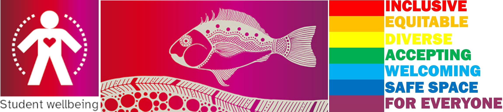
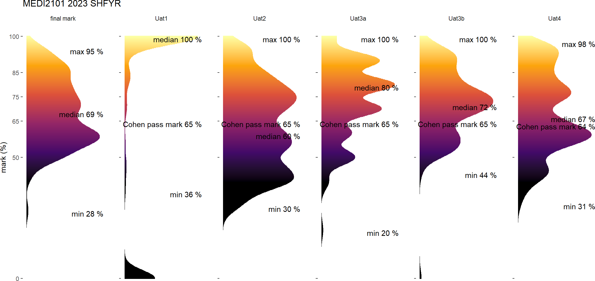

<!-- .slide: id="MEDI2101Wk1_2" data-auto-animate-restart -->
#### MEDI2101 Cardiovascular and Respiratory System.
# Unit overview

Week 1, Lecture 2

Assoc. Prof. Mark Butlin (PhD, BE, SFHEA) (he/him) 
Macquarie Medical School, Faculty of Medicine, Health and Human Sciences Macquarie University. On the land of the Wallumattagal clan of the Dharug Nation.

--
### Unit support

<ul>
  <li>Recognition that the university journey can have difficulties with causes <b>both internal and external</b> to the university.</li>
  <li>+ demands are different now (cost of living, university fees, world “temperament”).</li>
  <li>+ world temperament is not great (unsettled after/during COVID-19 impact; wars; climate change; ...)
  <li>+ this is a second year unit that many will be sitting in their first year.</li>
</ul>

**Please contact Mark Butlin early if you are having difficulties, so that we can help you succeed in this unit.**

--
<!-- .slide:  data-background-image="images/AboriginalAustralia1.png" -->

I acknowledge, thank and respect the traditional custodians of the stolen land I have lived upon, the people of the Wiradjuri, Bundjalung, Tharawal, Eora and Dharug nations, whose cultures and customs have nurtured and continue to nurture this land, since the Dreamtime.

--
<!-- .slide: data-background-image="images/CollaborationsMap.png" -->
<h3>Your unit convener's experience</h3>
<h4>Engineer | Research collaborations | Industry collaborations | Clinical work</h4>

--
<!-- .slide: data-background-color="#373A36" -->

Mark Butlin:

Top 0.023% (number 8 of 34,194 researchers) in
  arterial pressure.

No ranking in respiratory physiology.

&nbsp

<a
    href="https://expertscape.com/ex/arterial+pressure">https://expertscape.com/ex/arterial+pressure</a>

<!--
### Live lectures in Echo360
#### Taking notes

<h3>Live lectures in Echo360</h3>
<h4>Posting questions</h4>

<h3>Live lectures in Echo360</h3>
<h4>Posting questions</h4>

Questions are anonymous to your peers.

It is not <em>completely</em> anonymous - teaching staff can go into the system to find out who
  posted what.

Impolite posting will not be tolerated.

<h3>Live lectures in Echo360</h3>
<h4>Why Echo360? (and not Zoom)</h4>
<ul>
  <li> Formal Q&A system</li>
  <ul>
    <li> Including possibility to answer questions following the lecture that the lecturer did not answer during the lecture.</li>
  </ul>
  <li> Feedback to unit convenor on how many people are using the live or catchup versions of the lecture.</li>
  <li> Embraces accessibility with automatic generation of a text transcript of the lecture.</li>
</ul>

Disadvantages

<ul>
  <li>I can't see you all!</li>
  <li>No green screen effect (apologies for the drab background)</li>
</ul>

Zoom will be used for anatomy classes to facilitate the interactive "tutorial style" approach to those classes.

<h3>Unit description and outcomes</h3>
<h4></h4>

<h3>Unit description</h3>
<h4></h4>

This unit introduces integrated learning of the <b>anatomy and physiology of the cardiovascular and respiratory system</b>.

It focuses on: the <b>mechanisms that maintain homeostasis</b> in these coordinated systems including acid-base balance; a working knowledge of the <b>dynamic cardiovascular and respiratory responses to physical challenges</b>; the ability to relate cardiovascular and respiratory diseases to their underlying pathophysiological pathways.

 You will also critically <b>consider scientific and medical evidence</b> in cardiovascular and respiratory contexts to inform hypothesis generation, discussion and individual decision-making.

<h3>Unit outcomes</h3>
<h4></h4>
<ul>
<li> Describe the <b>histological and anatomical structures</b> of the cardiovascular and
  respiratory systems.</li>
<li> Explain the <b>functions of the cardiovascular and respiratory system</b>, as well as the
  <b>mechanisms that maintain homeostasis</b> in these coordinated systems.
</li>
<li> Relate knowledge of the structure and function of the cardiovascular and respiratory system
  to <b>disease processes</b>.</li>
<li> Use biomedical literature and the <b>method of scientific enquiry</b> to outline the
  cardiovascular and respiratory response to physical challenges.</li>
<li> Effectively participate in scheduled activities and in peer teams, seeking and reflecting
  on feedback to improve individual and group performance.</li>
</ul>
-->

<!-- .slide: data-background-image="images/Internal_organs - cardiorespiratory.png" data-background-size="70%" -->
<!-- <h3>Systems physiology</h3> -->
<!--  <h4>2nd year unit</h4> -->

&nbsp

&nbsp

&nbsp

&nbsp

&nbsp

&nbsp

&nbsp

&nbsp

&nbsp

Modified from <a href="https://commons.wikimedia.org/wiki/File:Internal_organs.svg">https://commons.wikimedia.org/wiki/File:Internal_organs.svg</a>

<aside class="notes">This is a systems physiology unit, and encompasses the interaction between many different body components. This is what makes this unit fun and interesting. It is also what can make this unit challenging.</aside>

--
<h3>Past grades</h3>
<h4></h4>

--
<h3>Past grades</h3>
<h4></h4>

Uat#: Unit assessment task number #

--
### Learning opportunities
#### 5 formats

<table>
  <tbody>
    <tr>
      <td colspan="2">
        <h5>Face-to-face</h5>
      </td>
    </tr>
    <tr>
      <td>
          <h5>Lecture</h5>
      </td>
      <td>
Lectures are held each week. Live in person. Live via Zoom. Catch-up via Echo360 (next day).
         
        Closed captioning is available both live (via Zoom) and through Echo360.

      </td>
    </tr>
    <tr>
      <td>
          <h5>Lectorial</h5>
      </td>
      <td>
In weeks 1, 2, 4 and 5, a lecture style tutorial covering anatomy content.
         
        Lectorials are <strong>only offered in person, on campus</strong>. There is no Echo360 catch-up for the lectorials.

      </td>
    </tr>
    <tr>
      <td>
          <h5>Practical</h5>
      </td>
      <td>
In weeks 3 and 6, the practical will be in the wet-lab anatomy space for teaching and review of anatomy content.
         In weeks 7 to 12, the practicals will be on physiology with hands on taking of physiological measurements.
         
        Practicals are <strong>only offered in person, on campus</strong>. There is no Echo360 catch-up for the practicals.
        

      </td>
    </tr>
    <tr>
      <td colspan="2">
        <h5>Self-paced</h5>
      </td>
    </tr>
    <tr>
      <td>
          <h5>On-line module</h5>
      </td>
      <td>
On-line modules are provided in each week's material on the unit iLearn page. These provide a mixture of <b>new concepts</b> and review.

      </td>
    </tr>
    <tr>
      <td>
          <h5>Reading</h5>
      </td>
      <td>
The list of reading is provided in Leganto (links in iLearn). It is recommended to use a text-to-speech tool.

      </td>
    </tr>
  </tbody>
</table>
 

<strong>There are no tutorials </strong>in this unit, given the concentration on practical classes. On-line video / slide / reading / quiz material is provided each week in place of tutorials.

--
### Unit overview
####

  <table style="width:100%" class="table-bordered table-hover">
      <thead class="text-uppercase" style="font-size:small;">
          <tr>
              <th style="color:white" rowspan="2" bgcolor="#000000">Week</th>
              <th style="color:white" rowspan="2" bgcolor="#000000">Topic</th>
              <th colspan="3" style="color:white" bgcolor="#373A36">Face-to-face</th>
              <th style="color:white" colspan="4" bgcolor="#AAAAAA">Self-paced</th>
          </tr>
          <tr>
              <th style="color:white" bgcolor="#373A36">Lectures</th>
              <th style="color:white" bgcolor="#373A36">Lectorial</th>
              <th style="color:white" bgcolor="#373A36">Practical</th>
              <th style="color:white" bgcolor="#AAAAAA">Online module</th>
              <th style="color:white" bgcolor="#AAAAAA">Reading</th>
              <th style="color:white" bgcolor="#AAAAAA">Assessment task</th>
          </tr>
      </thead>
      <tbody>
          <tr>
              <th bgcolor="#EAAED5">1-3</th>
              <th colspan="7" bgcolor="#EAAED5" align="left"><button onclick="toggleRows(['block1_1', 'block1_2', 'block1_3'])"><b>1 Respiratory system</b></button></th>
          </tr>
                      <tr id="block1_1">
              <th bgcolor="#EAAED5">1</th>
              <th bgcolor="#EAAED5"><a href="./index_MEDI2101_block1.html#/MEDI2101Wk1_1" target="_blank">Introduction of concepts</a></th>
              <td bgcolor="#EAAED5">1.1 "Reason" for the cardiovascular and respiratory system  - Unit introduction
              </td>
              <td bgcolor="#EAAED5">Upper respiratory anatomy</td>
              <td></td>
              <td bgcolor="#EAAED5">Cardiovascular and respiratory physical concepts: pressure, flow and resistance</td>
              <td bgcolor="#EAAED5">Guyton and Hall (<a href="https://ap01.alma.exlibrisgroup.com/leganto/public/61MACQUARIE_INST/lists/32184454860002171?auth=SAML">See Leganto</a>)</td>
              <td> </td>
          </tr>
          <tr id="block1_2">
              <th bgcolor="#EAAED5">2</th>
              <th bgcolor="#EAAED5"><a href="./index_MEDI2101_block1.html#/MEDI2101Wk2_1" target="_blank">Respiratory system</a></th>
              <td bgcolor="#EAAED5">1.2 Ventilation  1.3 Gas exchange</td>
              <td bgcolor="#EAAED5">Lower respiratory anatomy</td>
              <td></td>
              <td bgcolor="#EAAED5">The scientific method in (bio)medical investigation  Knowledge for AT3</td>
              <td bgcolor="#EAAED5">Guyton and Hall (<a href="https://ap01.alma.exlibrisgroup.com/leganto/public/61MACQUARIE_INST/lists/32184454860002171?auth=SAML">See Leganto</a>)</td>
              <td> </td>
          </tr>
          <tr id="block1_3">
              <th bgcolor="#EAAED5">3</th>
              <th bgcolor="#EAAED5"><a href="./index_MEDI2101_block1.html#/MEDI2101Wk3_1" target="_blank">Respiratory regulation</a></th>
              <td bgcolor="#EAAED5">1.4 The respiratory centre and regulation output  1.5 Respiratory regulation
                  inputs </td>
              <td></td>
              <td bgcolor="#EAAED5">Upper and lower respiratory anatomy (review)</td>
              <td bgcolor="#EAAED5">Arterial blood gases and acidosis and alkalosis</td>
              <td bgcolor="#EAAED5">Guyton and Hall (<a href="https://ap01.alma.exlibrisgroup.com/leganto/public/61MACQUARIE_INST/lists/32184454860002171?auth=SAML">See Leganto</a>)</td>
              <td bgcolor="#373A36"><a href="#section-6" style="color:white">AT1: Formative online quiz (0%)</a></td>
          </tr>
          <tr>
              <th bgcolor="#F1A7B2">4-7</th>
              <th colspan="7" bgcolor="#F1A7B2" align="left"><button onclick="toggleRows(['block2_1', 'block2_2', 'block2_3', 'block2_4', 'block2_5'])"><b>2 Cardiovascular system</b></button></th>
          </tr>
          <tr id="block2_1">
              <th bgcolor="#F1A7B2">4</th>
              <th bgcolor="#F1A7B2"><a href="./index_MEDI2101_block2.html#/MEDI2101Wk4_1" target="_blank">The heart</a></th>
              <td bgcolor="#F1A7B2">2.1 Basics of the heart  2.2 Intrinsic regulation of the heart</td>
              <td bgcolor="#F1A7B2">The heart and mediastinum</td>
              <td></td>
              <td bgcolor="#F1A7B2">The Wigger's diagram</td>
              <td bgcolor="#F1A7B2">Guyton and Hall (<a href="https://ap01.alma.exlibrisgroup.com/leganto/public/61MACQUARIE_INST/lists/32184454860002171?auth=SAML">See Leganto</a>)</td>
              <td> </td>
          </tr>
          <tr id="block2_2">
              <th bgcolor="#F1A7B2">5</th>
              <th bgcolor="#F1A7B2"><a href="./index_MEDI2101_block2.html#/MEDI2101Wk5_1" target="_blank">Circulatory system</a></th>
              <td bgcolor="#F1A7B2">2.3 Basics of the circulatory system  2.4 Blood pressure and flow</td>
              <td bgcolor="#F1A7B2">The major blood vessels</td>
              <td></td>
              <td bgcolor="#F1A7B2">The constituents of blood</td>
              <td bgcolor="#F1A7B2">Guyton and Hall (<a href="https://ap01.alma.exlibrisgroup.com/leganto/public/61MACQUARIE_INST/lists/32184454860002171?auth=SAML">See Leganto</a>)</td>
              <td> </td>
          </tr>
          <tr id="block2_3">
              <th bgcolor="#F1A7B2">6</th>
              <th bgcolor="#F1A7B2"><a href="./index_MEDI2101_block2.html#/MEDI2101Wk6_1" target="_blank">Cardiovascular regulation</a></th>
              <td bgcolor="#F1A7B2">2.5 Cardiovascular regulation, part 1  2.6 Cardiovascular regulation, part 2</td>
              <td></td>
              <td bgcolor="#F1A7B2">Anatomy review</td>
              <td bgcolor="#F1A7B2">Renal regulation of acid-base balance</td>
              <td bgcolor="#F1A7B2">Guyton and Hall (<a href="https://ap01.alma.exlibrisgroup.com/leganto/public/61MACQUARIE_INST/lists/32184454860002171?auth=SAML">See Leganto</a>)</td>
              <td> </td>
          </tr>
          <tr id="block2_4">
              <th bgcolor="#F1A7B2">7</th>
              <th bgcolor="#F1A7B2"><a href="./index_MEDI2101_block2.html#/MEDI2101Wk7" target="_blank">The microcirculation and lymph flow</a></th>
              <td bgcolor="#F1A7B2">AT2: Anatomy test  2.7 Fluid exchange at the capillaries</td>
              <td></td>
              <td bgcolor="#F1A7B2">Introduction to some respiratory and cardiovascular instrumentation.</td>
              <td bgcolor="#F1A7B2">The lymphatic system and lymphedema</td>
              <td bgcolor="#F1A7B2">Guyton and Hall (<a href="https://ap01.alma.exlibrisgroup.com/leganto/public/61MACQUARIE_INST/lists/32184454860002171?auth=SAML">See Leganto</a>)</td>
              <td bgcolor="#373A36"><a href="#section-11" style="color: white;">AT2: Anatomy test during lecture
                      period (20%)</a></td>
          </tr>
          <tr id="block2_5">
              <td colspan="8">Midsession break</td>
          </tr>
          <tr>
              <th bgcolor="#FF99DB">8-9</th>
              <th colspan="7" bgcolor="#FF99DB" align="left"><button onclick="toggleRows(['block3_1', 'block3_2'])"><b>3 Cardiovascular and respiratory integration</b></button></th>
          </tr>
          <tr id="block3_1">
              <th bgcolor="#FF99DB">8</th>
              <th bgcolor="#FF99DB"><a href="./index_MEDI2101_block3.html#/MEDI2101Wk8" target="_blank">Exercise cardiovascular and respiratory
                      physiology</a></th>
              <td bgcolor="#FF99DB">3.1 Introduction to exercise cardiovascular and respiratory physiology</td>
              <td></td>
              <td style="color:white" bgcolor="#373A36">Physiological measurement data collection for AT3.2.</td>
              <td bgcolor="#FF99DB">Exercise, a modifiable lifestyle factor to reduce cardiovascular risk</td>
              <td bgcolor="#FF99DB">Guyton and Hall (<a href="https://ap01.alma.exlibrisgroup.com/leganto/public/61MACQUARIE_INST/lists/32184454860002171?auth=SAML">See Leganto</a>)</td>
              <td bgcolor="#373A36"><a href="#section-13" style="color:white">AT3.1 Hypothesis testing. Publication
                      figure (10%)</a></td>
          </tr>
          <tr id="block3_2">
              <th bgcolor="#FF99DB">9</th>
              <th bgcolor="#FF99DB"><a href="./index_MEDI2101_block3.html#/MEDI2101Wk9" target="_blank">Cardiorespiratory homeostasis and thermal regulation</a></th>
              <td bgcolor="#FF99DB">3.2 Cardiovascular homeostasis and thermal regulation</td>
              <td></td>
              <td bgcolor="#FF99DB">Thermoregulation</td>
              <td bgcolor="#FF99DB">Extremes of thermoregulation</td>
              <td bgcolor="#FF99DB">Guyton and Hall (<a href="https://ap01.alma.exlibrisgroup.com/leganto/public/61MACQUARIE_INST/lists/32184454860002171?auth=SAML">See Leganto</a>)</td>
              <td> </td>
          </tr>
          <tr>
              <th bgcolor="#D6D2C4">10-12</th>
              <th colspan="7" bgcolor="#D6D2C4" align="left"><button onclick="toggleRows(['block4_1', 'block4_2', 'block4_3'])"><b>4 Cardiovascular and respiratory system in disease</b></button></th>
          </tr>
          <tr id="block4_1">
              <th bgcolor="#D6D2C4">10</th>
              <th bgcolor="#D6D2C4"><a href="./index_MEDI2101_block4.html#/MEDI2101Wk10" target="_blank">Indigenous cardiorespiratory health</a></th>
              <td bgcolor="#D6D2C4">4.5 Indigenous cardiovascular and respiratory health</td>
              <td></td>
              <td bgcolor="#D6D2C4">Autonomic function tests</td>
              <td></td>
              <td bgcolor="#D6D2C4"><a href="https://ap01.alma.exlibrisgroup.com/leganto/public/61MACQUARIE_INST/lists/32184454860002171?auth=SAML">Reading provided in Leganto</a></td>
              <td> </td>
          </tr>
          <tr id="block4_2">
              <th bgcolor="#D6D2C4">11</th>
              <th bgcolor="#D6D2C4"><a href="./index_MEDI2101_block4.html#/MEDI2101Wk11_1" target="_blank" style="">Heart conduction diseases. Heart
                      failure.</a></th>
              <td bgcolor="#D6D2C4">4.3 Conduction diseases 4.4 Heart failure</td>
              <td></td>
              <td bgcolor="#D6D2C4">Electrical activity of the heart</td>
              <td bgcolor="#D6D2C4">Heart failure</td>
              <td bgcolor="#D6D2C4"><a href="https://ap01.alma.exlibrisgroup.com/leganto/public/61MACQUARIE_INST/lists/32184454860002171?auth=SAML">Reading provided in Leganto</a></td>
              <td> </td>
          </tr>
          <tr id="block4_3">
              <th bgcolor="#D6D2C4">12</th>
              <th bgcolor="#D6D2C4"><a href="./index_MEDI2101_block4.html#/MEDI2101Wk1_1" target="_blank">Chronic Obstructive Pulmonary Disease. Isolated Systolic Hypertension</a>
              </th>
              <td bgcolor="#D6D2C4">4.1 Chronic obstructive pulmonary disease 4.2 Isolated Systolic Hypertension</td>
              <td> </td>
              <td bgcolor="#D6D2C4">Physiological measurement in the diseased state</td>
              <td bgcolor="#D6D2C4">COPD. ISH.</td>
              <td bgcolor="#D6D2C4"><a href="https://ap01.alma.exlibrisgroup.com/leganto/public/61MACQUARIE_INST/lists/32184454860002171?auth=SAML">Reading provided in Leganto</a></td>
              <td bgcolor="#373A36"><a href="#section-18" style="color: white;">AT3.2: Hypothesis testing. Discussion
                      (25%)</a></td>
          </tr>
          <tr>
              <th style="color:white" bgcolor="#373A36">13-exam</th>
              <th style="color:white" colspan="7" bgcolor="#373A36" align="left"><button onclick="toggleRows(['block5_1', 'block5_2'])"><b>5 Review and assess</b></button></th>
          </tr>
          <tr id="block5_1">
              <td style="color:white" bgcolor="#373A36">13</td>
              <td style="color:white" bgcolor="#373A36">Review</td>
              <td style="color:white" bgcolor="#373A36">Q&amp;A</td>
              <td></td>
              <td></td>
              <td> </td>
              <td> </td>
          </tr>
          <tr id="block5_2">
              <td style="color:white" bgcolor="#373A36">Exam period</td>
              <td style="color:white" bgcolor="#373A36">Examination</td>
              <td> </td>
              <td> </td>
              <td> </td>
              <td> </td>
              <td></td>
              <td bgcolor="#373A36"><a href="#section-21" style="color: white;">AT4: Final exam (45%)</a></td>
          </tr>
      </tbody>
  </table>

--
### Teaching staff
####

--
<h3>Assessment tasks</h3>
<h4>Assessment task 1: Formative quiz (0%). Due week 3.</h4>

On-line in iLearn.

Available any time up until end of week 3.

No time limit.

Reviews some of the respiratory component (physiology and anatomy) of MEDI2101.

0% assessment task, but it provides written feedback on working out specific answers where people might make mistakes (e.g., in a final exam).

<ul>
  <li> Feedback is provided with each question.</li>
  <li> The mark will also provide you feedback on whether you are tracking well so far.</li>
</ul>

--
<h3>Assessment tasks</h3>
<h4>Assessment Task 2: Anatomy test (20%). During lecture, week 7.</h4>
<ul>
  <li> Anatomy quiz delivered during the 1st hour of the week 7 lecture.</li>
  <li> Created by Dr Mirjana Strkalj.</li>
  <li> Usually a challenging test, but always has high achievers.</li>
</ul>

--
<h3>Assessment tasks</h3>
<h4>Assessment Task 3: Manuscript (35%) Due week 8 and 12</h4>

Three parts:

<table style="width:100%" >
  <thead>
  <tr>
    <th>Part</th>
    <th>Description</th>
    <th>Due</th>
  </tr>
  </thead>
  <tbody>
  <tr>
    <td>3 Part A</td>
    <td>Figure for an introduction section. Flow diagram explaining your hypothesis for what will
    happen in the experiment</td>
    <td>Week 8</td>
  </tr>
  <tr>
    <td>Data collection</td>
    <td>Conducting experiment in class during physiological measurement practical. Not assessed, but will be beneficial because:
  <ul>
    <li>you will get to see and experience the physiology you will be talking about.</li>
    <li>teaching staff will likely guide you toward the correct thinking.</li>
  </ul></td>
  <td>Week 8</td>
  </tr>
  <tr>
  <td>3 Part B</td>
  <td>Written discussion of results, limitations, and conclusion.</td>
  <td>Week 12</td>
  </tr>
  </tbody>
</table>

--
<h3>Assessment tasks</h3>
<h4>Assessment Task 4: Exam (45%). Held during exam period.</h4>

Traditional final examination during examination period.

 

Week 13 is a review week. (No new content, and no teaching activities.)

--
<!-- .slide:  data-background-image="images/studiosity.png" data-background-position="right" data-background-size="contain" -->
<h3>Assessment tasks</h3>
<h4>Free help</h4>

<!-- - <a href="https://students.mq.edu.au/support/study/writing/studiosity">Studiosity</a> (External service. Free sessions for Macquarie University students) -->
- <a href="https://students.mq.edu.au/support/study/writing/writewise">WriteWise</a> (Macquarie free service.)
- <a href="https://ilearn.mq.edu.au/enrol/index.php?id=16580">StudyWise</a> (Macquarie free course.)

Relatively new tool:

- <a href="https://students.mq.edu.au/support/technology/systems/ilearn/assignments-grades">Turn-it-in Draft Coach</a> Check grammar, citations, and similarity <b>before</b> submitting your assessment task.

--
<h3>Assessment tasks</h3>
<h4>Accessibility support</h4>

If you are someone with an on-going health condition, disability and/or are a carer of a person with a disability, please consider contacting <a href="https://students.mq.edu.au/support/accessibility-disability">Accessibility Support and Services</a> early during session to put in an Individual Education Access Plan for MEDI2101.

You are welcome to contact me (you do not need to provide details) so that I can follow up with Accessibility Support to make sure they have put in place your Individual Education Access Plan in MEDI2101.

--
<!-- .slide: data-auto-animate -->
<h3>Open virtual and real door</h3>
<h4></h4>

--
<h3>Activities this week.</h3>
<h4></h4>

<a href="https://ilearn.mq.edu.au/course/view.php?id=64513#section-5"> MEDI2101 iLearn Week 1</a>