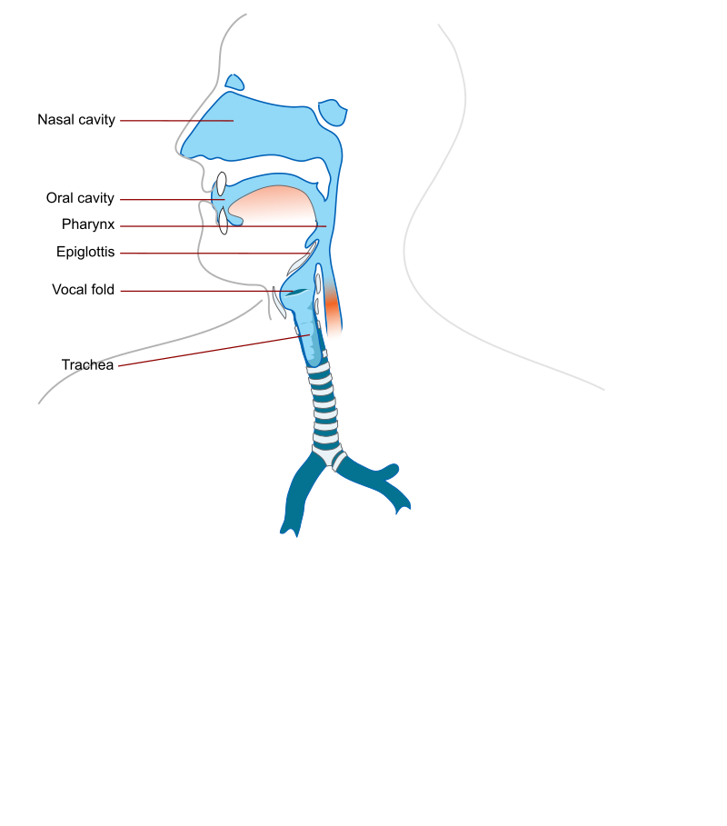
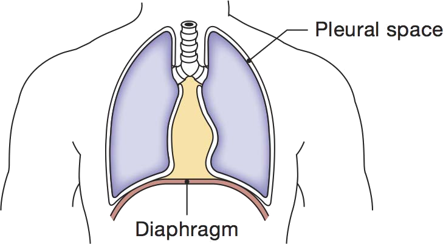
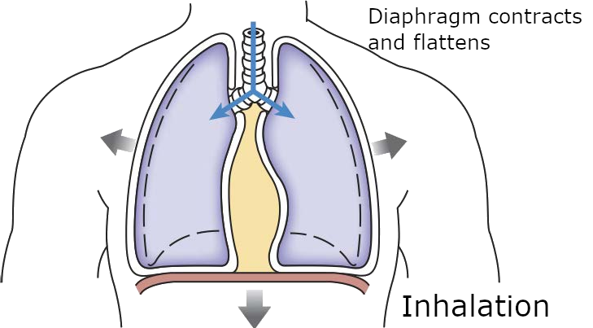
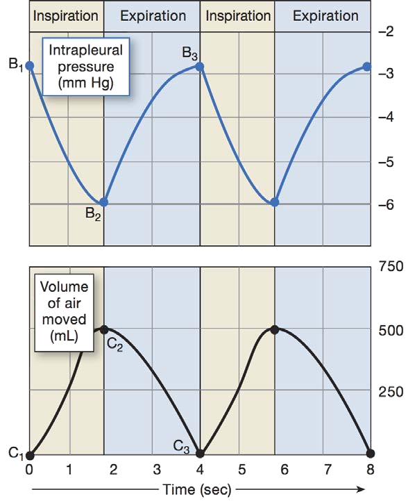
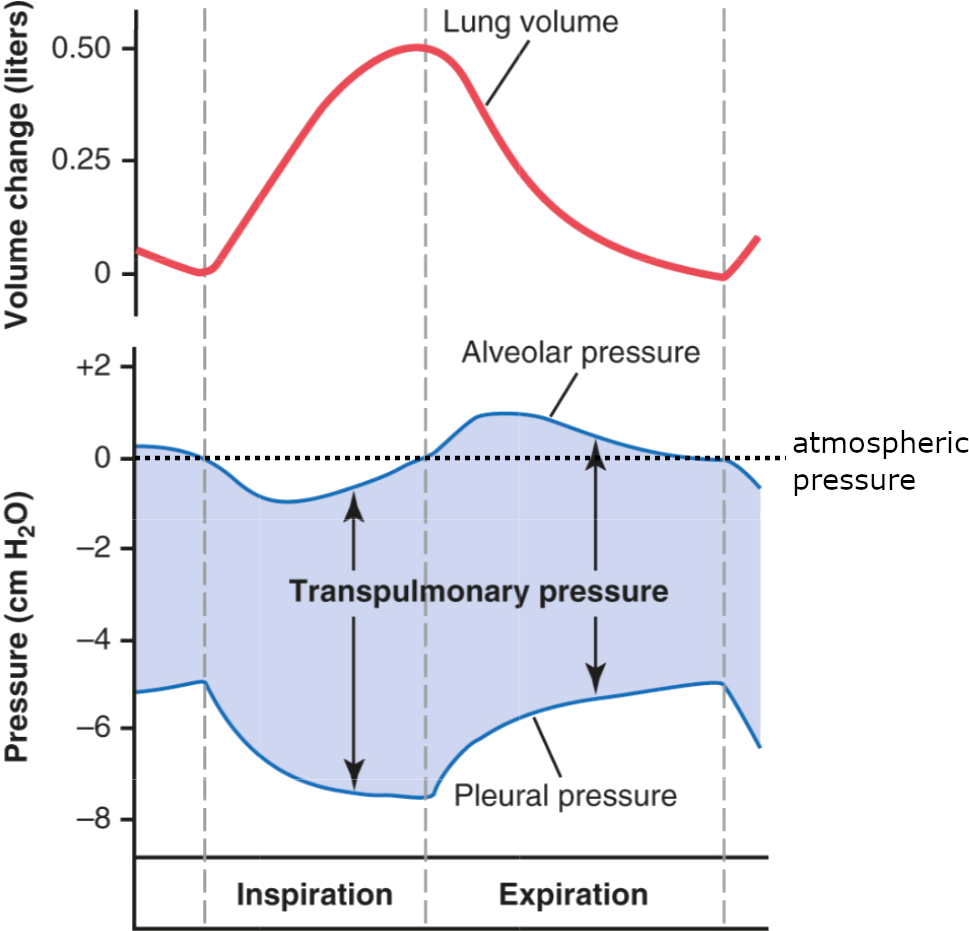

<!-- .slide: id="MEDI2101Wk2_1" -->
#### MEDI2101 Cardiovascular and Respiratory System.
### Block 1: Respiratory System
# LO1.2: Basics of the respiratory system - ventilation
(Week 2, Lecture 1)
##### Dr Mark Butlin (PhD, BE, SFHEA) (he/him)

Macquarie Medical School, Faculty of Medicine, Health and Human Sciences Macquarie University. On the land of the Wallumattagal clan of the Dharug Nation.

--
### MEDI2101 Cardiovascular and Respiratory System
#### To do in Week 2

<a href="https://ilearn.mq.edu.au/course/view.php?id=64513#section-5"> MEDI2101 iLearn Week 2</a>

---
## LO1.2.1 Describe the five major functions of the respiratory system (1): conduction of air; (2): conditioning of air and protection from inhaled substances; (3): vocalisation; (4): gas exchange; and (5): pH regulation

--
<!-- .slide: data-auto-animate -->
### The five major functions of the respiratory system
#### 
The 5 major functions of the respiratory system are to:

- **conduct air** from atmosphere to alveoli and vice versa.
- **condition the air** and protect the lungs from inhaled, problematic substances.
- facilitate **gas exchange** with blood.
- assist in **blood pH regulation**.
- allow for **vocalisation** for communication.
    

All of these functions, other than vocalisation, are to facilitate (or in the case of pH, a result of) respiration.

  
--
<!-- .slide: data-auto-animate -->
### The five major functions of the respiratory system
#### 
<figure>
  
  <figcaption>

External respiration in the mammalian system is the movement of gasses to/from:

<ul>
<li> <b>(I)</b> the atmosphere to the lung;</li>
<li> <b>(II)</b> the lungs to the blood then through the blood stream to/from the capillaries;</li>
<li> <b>(III)</b> to/from the blood stream and the cells.</li>
<ul>

Cellular respiration refers to the the use of O2 and generation of CO2 in generating ATP (energy).

  </figcaption>
</figure>

Silverthorn, D U. <em>Human Physiology, an Integrated Approach</em>.

--
<!-- .slide: data-auto-animate -->
### The five major functions of the respiratory system
#### 

Respiration in multi-cellular life can be used to refer to two different things:

- **Cellular respiration**: The **intracellular reaction** of oxygen (O2) with organic molecules to produce carbon dioxide (CO2) and water (H2O) and (importantly) energy (ATP).
- **External respiration**: The **movement of gases** between the environment (air for land-dwelling life) and the body's cells to supply O2 and remove CO2.

When we are talking about the movement of air through the lungs, we are addressing part of the pathway of external respiration, not cellular respiration.

    
--
<!-- .slide: data-auto-animate -->
### The five major functions of the respiratory system
#### Conduction of air

<figure>
  
  <figcaption>
   
Referring to the bulk movement of air into, and out of, the lungs (specifically, alveoli) from the surrounding atmosphere.

- Upper respiratory tract
  - Mouth (oral) cavity (air and food)
  - Nasal cavity (air only)
  - Pharynx (air and food)
  - Larynx (vocal cords, air only)

- Lower respiratory tract (only air)
  - Trachea
  - Branching bronchi
  - Lungs (with alveoli)
  </figcaption>
</figure>

--
<!-- .slide: data-auto-animate -->
### The five major functions of the respiratory system
#### Conduction of Air

<figure>
  
  <figcaption>
Functions of the nose

- warming air before it enters the lungs
- filters air to remove some particles
- olfactory sense (smell)
- resonating chamber for speech
  </figcaption>
</figure>
    
--
<!-- .slide: data-auto-animate -->
### The five major functions of the respiratory system
#### Conduction of Air

<figure>
  
  <figcaption>
Function of the pharynx

- passage for air and food intake
- equalise air pressure between the atmosphere and the middle ear through the Eustacian tube    
  </figcaption>
</figure>

--
<!-- .slide: data-auto-animate -->
### The five major functions of the respiratory system
#### Conduction of Air

<figure>
  
  <figcaption>
Function of the larynx

The larynx contains the epiglottis (diversion of food) and the vocal cords (forced breath hold, vocalisation).

- **epiglottis:** elastic cartilage "trap door" that is closed when swallowing food/liquid to prevent food/liquid from entering the trachea (wind pipe)
- **false vocal cords:** close to block/hold breath eg. when lifting a heavy object (these "vocal" cords don't produce sound)
- **true vocal cords:** elastic ligaments that when stretched, produce sound as air passes by them.
  - pitch = degree of stretch
  - amplitude = amount of air pressure applied
  </figcaption>
</figure>

&nbsp

National Cancer Institute, an agency part of the National Institutes of Health

--
<!-- .slide: data-auto-animate -->
### The five major functions of the respiratory system
#### Conduction of Air

<figure>
  
  <figcaption>
    
  </figcaption>
</figure>

Silverthorn, D U. <em>Human Physiology, an Integrated Approach.</em>

--
<!-- .slide: data-auto-animate -->
### The five major functions of the respiratory system
#### Conduction of Air

Airway resistance (\$R$\) and corollary of Poiseuille's law

\begin{equation}
  R = \dfrac{8\mu L}{\pi r^4}
\end{equation}

where:
- $\mu$ fluid viscosity
- $L$ length of tube
- $r$ radius of the tube

The important thing to remember: resistance is directly proportional to the length of the tube, and inversely proportional to the fourth power of radius.

<em>This means that a change in radius has a dramatic effect on resistance.</em>

--
<!-- .slide: data-auto-animate -->
### The five major functions of the respiratory system
#### Conduction of Air

\begin{equation}
R = \dfrac{8\mu L}{\pi r^4}
\end{equation}

As flow $Q$ is dependent on resistance:

\begin{equation}
  Q \propto \dfrac{\Delta P}{R}
\end{equation}

$\downarrow$ radius $\rightarrow$ $\uparrow$ resistance $\rightarrow$ $\downarrow$ flow

and inversely

$\uparrow$ radius $\rightarrow$ $\downarrow$ resistance $\rightarrow$ $\uparrow$ flow

--
<!-- .slide: data-auto-animate data-background-image="images/stainless_steel_drinking_straws.jpg" data-background-size="contain" -->

Which straw has the

greatest resistance?

$R = \dfrac{8\mu L}{\pi r^4}$

--
<!-- .slide: data-auto-animate data-background-image="images/stainless_steel_drinking_straws.jpg" data-background-size="contain" data-background-opacity="0.3" -->

Which straw has the

greatest resistance?

$R = \dfrac{8\mu L}{\pi r^4}$

To decrease resistance and increase flow:

<ul data-id="directionlist">
<li> increase the diameter (radius)</li>
<li> decrease the length</li>
</ul>

--
<!-- .slide: data-auto-animate data-background-image="images/stainless_steel_drinking_straws.jpg" data-background-size="contain" data-background-opacity="0.3" -->

Which straw has the

greatest resistance?

$R = \dfrac{8\mu L}{\pi r^4}$

To increase resistance and decrease flow:

<ul data-id="directionlist">
<li> decrease the diameter (radius)</li>
<li> increase the length</li>
</ul>

--
<!-- .slide: data-auto-animate data-background-image="images/LungBranches2.png" data-background-size="contain" -->

<table border="0">
  <tr>
    <td width="80%"></td>
    <td>Does the single trachea, or the combination of both bronchi, have the greatest resistance?</td>
  </tr>
  <tr>
    <td></td>
    <td>
$R = \dfrac{8\mu L}{\pi r^4}$
</td>
  <tr>
</table>

--

<!-- .slide: data-auto-animate data-background-image="images/LungBranches.png" data-background-size="contain" -->

--
<!-- .slide: data-auto-animate -->
### The five major functions of the respiratory system
#### Conduction of Air

<figure>
  
  <figcaption>
    <ul>
    <li> Air moves through the trachea, bronchi, and bronchioles.</li>
    <li> Exchange of gases between air and blood occurs at the level of the alveoli (largest cross sectional area, lowest resistance).</li>
    </ul>
  </figcaption>
</figure>

--
<!-- .slide: data-auto-animate -->
### The five major functions of the respiratory system
#### Conditioning of air and protection from inhaled substances

The respiratory mucosa lining the conducting airways conditions air before it reaches the alveoli.

- **Warming** 
  - Air is warmed to 37oC so core body temp is maintained and to protect the alveoli.
- **Humidifying** 
  - Water vapor is added to 100% humidity so the exchange epithelium doesn’t dry.
- **Filtering** 
  - Removal of particles and pathogens to protect the body from inflammation and infection.
    
--
<!-- .slide: data-auto-animate -->
### The five major functions of the respiratory system
#### Conditioning of air and protection from inhaled substances

The mucosal lining also **traps** and **transports** some **pathogens**. 

The **ciliary beat** that removes mucous (and trapped pathogens) relies on the thin saline secreted by epithelial cells of the respiratory system.

--
<!-- .slide: data-auto-animate -->
### The five major functions of the respiratory system
#### Conditioning of air and protection from inhaled substances

<figure>
  
  <figcaption>

The mucosal lining is primarily made up of sodium and chloride ions in water (saline).

The epithelial cilia beat and along with the generation of the mucosal lining assist in transporting pathogens out of the airway.

This secretion involves:

<ul>
  <li> Cl- secretion into the airway lumen from epithelial cells.</li>
  <li> Na+ is drawn into the lumen by the electrochemical gradient.</li>
  <li> H2O is drawn into the lumen by the concentration gradient.</li>
</ul>
  </figcaption>
</figure>

Silverthorn, D U. <em>Human Physiology, an Integrated Approach</em>.

    
--
<!-- .slide: daa-auto-animate data-background="#111111" -->
<video data-autoplay data-src="images/MucociliaryClearance.mp4"></video>

<a href="https://www.youtube.com/watch?v=HMB6flEaZwI">https://www.youtube.com/watch?v=HMB6flEaZwI</a>

    
--
<!-- .slide: data-auto-animate data-background="#111111" -->
<video data-autoplay data-src="images/CiliaryBeating.mp4"></video>

<a href="https://www.youtube.com/watch?v=1Q8RL1g9txk">https://www.youtube.com/watch?v=1Q8RL1g9txk</a>

    
--
<!-- .slide: data-auto-animate -->
### The five major functions of the respiratory system
#### Conditioning of air and protection from inhaled substances

The mucosal lining is a fluid. Therefore, there is a surface tension drawing the wetted surfaces together especially in the elastic, flexible alveoli.

An air pressure is needed to overcome this surface tension (Laplace Law).

\begin{equation}
\mathrm{pressure} = \dfrac{2\times\mathrm{surface\~tension}}{\mathrm{radius\~of\~alveoli}}
\end{equation}

If the mucosal fluid was pure water, a pressure of 18 cmH2O would be required to keep the alveoli open (<em>Guyton and Hall Textbook of Medical Physiology</em>).
    
--
<!-- .slide: data-auto-animate -->
### The five major functions of the respiratory system
#### Conditioning of air and protection from inhaled substances

<figure>
  
  <figcaption>

 A surfactant has a hydrophilic head (attracted to water) and hydrophobic tail (repels water).

This reduces surface tension. In the alveoli, by reducing surface tension, the required pressure to keep the alveoli open is reduced (Laplace Law).

  
<b>Surfactant</b>

  <ul>
    <li> reduces surface tension</li>
    <ul>
      <li> hydrophilic head</li>
      <li> hydrophobic tail</li>
    </ul>
  </ul>        
  
  <ul>
    <li> produced by the alveolar cells</li>
    <li> has a half life of about 14 hours</li>
    <li> lines alveoli and small bronchioles</li>
  </ul>

            

  </figcaption>
</figure>

--
<!-- .slide: data-auto-animate -->
### The five major functions of the respiratory system
#### Conditioning of air and protection from inhaled substances

**Alveolar stability**
      
Action of surfactant:

$\dfrac{2T\downarrow}{R}=P\downarrow$

- Surfactant differentially reduces surface tension, more at lower volumes and less at higher volumes, giving alveolar stability and reducing the likelihood of alveolar collapse.
- Surfactant is formed relatively late in fetal life.
- Premature infants born without adequate amounts. experience respiratory distress requiring immediate therapy.
      
--
<!-- .slide: data-auto-animate data-background-image="images/bubbles-pexels-photo-3661471.jpg"  data-background-size="contain"-->

<table>
  <tr> 
    <td width="30%" style="font-size:1.5em">An everyday example of surfactant: bubbles</td>
    <td width="40 %"></td>
    <td width="30%"></td>
  </tr>
  <tr>
    <td></td>
    <td></td>
    <td><h3>Soap (surfactant) decreases water surface tension, allowing bubbles to form at lower air pressure.</h3></td>
  </tr>
</table>

--
<!-- .slide: data-auto-animate -->
### The five major functions of the respiratory system
#### Gas exchange between air and blood

 Oxygen needs to travel across the alveolar surface from the alveolar air into the blood stream.
 
 Carbon dioxide needs to travel in the reverse direction.
 
 This will be covered in greater detail in the following lecture.
      
--
<!-- .slide: data-auto-animate -->
### The five major functions of the respiratory system
#### pH regulation
  
When carbon dioxide is dissolved in blood (water):

\begin{equation}
\mathrm{carbon\~dioxide} + \mathrm{water} \rightarrow \mathrm{carbonic\~acid} \rightarrow \mathrm{hydrogen\~ions} + \mathrm{bicarbonate\~ions}
\end{equation}

\begin{equation}
\mathrm{CO}_2 + \mathrm{H}_2\mathrm{O} \overset{\mathrm{carbonic\~anhydrase}}{\rightarrow} \mathrm{H}_2\mathrm{CO}_3 \rightarrow \mathrm{H}^+ + \mathrm{HCO}^{3-}
\end{equation}

Increasing the concentration of H+ increases the acidity (decreases pH) and vice versa.

  
--
<!-- .slide: data-auto-animate -->
### The five major functions of the respiratory system
#### pH regulation
  
By altering the rate of ventilation, the rate of CO2 movement our of the blood can be modified, thereby changing blood pH. 

Regulation of ventilation (and pH) will be covered next week.

--
<!-- .slide: data-auto-animate -->
### The five major functions of the respiratory system
#### Vocalisation
      
Speech (or just vocal noise) requires three main processes to work together:

1. Air must be in motion (muscles of respiration and clear airways).
1. Vibrations must be established in the air stream (vocal cords).
1. The buzzing sound of the vibrating air stream must be altered by the shape of the resonator (which includes the throat, as well as the oral and nasal cavities).

---
## LO1.2.2 Explain how lung pressure and volume changes during normal breathing, relate these changes to air flow, and graph and interpret the alveolar and intra-pleural pressure changes across the respiratory cycle.

--
<!-- .slide: data-auto-animate data-background-image="images/musclesofrespiration1.png" data-background-size="contain" data-background-position="right" -->
  
### Pressure-volume changes during normal breathing
####
    
Inspiration involves the:

- **diaphragm** which moves down toward the abdomen.
- **external intercostals and scalenes** which pull the ribs up and out.

&nbsp

Silverthorn, D U. <em>Human Physiology, an Integrated Approach</em>.

    
--
<!-- .slide: data-auto-animate data-background-image="images/musclesofrespiration2.png" data-background-size="contain" data-background-position="left" -->
  
### Pressure-volume changes during normal breathing
####

<table>
  <tr>
    <td width="25%"></td>
    <td>
Exhalation is <b>nominally passive</b> (i.e. a relaxation of muscles), but may involve:

- <b>internal intercostals</b> antagonistic muscle group.
- <b>abdominal muscles</b> which compress the abdominal cavity pushing viscera and the diaphragm upward.
    </td>
  <tr>
</table>

&nbsp

Silverthorn, D U. <em>Human Physiology, an Integrated Approach</em>.

  
--
<!-- .slide: data-auto-animate -->
### Pressure-volume changes during normal breathing
####
Isolating the action of the diaphragm.

<figure>
  
  <figcaption>
    
  </figcaption>
</figure>

--
<!-- .slide: data-auto-animate -->
### Pressure-volume changes during normal breathing
####
Isolating the action of the diaphragm.

<figure>
  
  <figcaption>
As it contracts, it flattens and decreases intrapleural pressure, increasing the volume of the lungs, assisting inspiration (along with the other inspiratory muscles).
  </figcaption>
</figure>

--
<!-- .slide: data-auto-animate -->
### Pressure-volume changes during normal breathing
####
Isolating the action of the diaphragm.

<figure>
  
  <figcaption>
Upon relaxation, the diaphragm curves upward once more, increasing intrapleural pressure, decreasing lung volume, and assisting exhalation.
  </figcaption>
</figure>

--
<!-- .slide: data-auto-animate -->
### Pressure-volume changes during normal breathing
####

**Boyle's law**

That pressure ($P$) of a fixed mass of material (e.g. air) is inversely proportional to volume ($V$).

\begin{equation}
P 	\propto \dfrac{1}{V}
\end{equation}

The corollary is that if the pressure on a material is changed, the volume must also change proportionally.

\begin{equation}
P_1\cdot V_1 = P_2 \cdot V_2
\end{equation}

--
<!-- .slide: data-auto-animate -->
### Pressure-volume changes during normal breathing
####

<figure>
  
  <figcaption>
Boyle's Law states that if the volume of a fluid is changed, then the pressure must change inversely and proportionally. 

So if we halve the volume, the pressure would double.

\begin{equation}
P_1\cdot V_1 = P_2 \cdot V_2
\end{equation}
  </figcaption>
</figure>

Silverthorn, D U. <em>Human Physiology, an Integrated Approach</em>.

--
<!-- .slide: data-auto-animate data-background="#111111" -->
<video data-autoplay data-src="images/BoylesLaw.mp4"></video>

<a href="https://www.youtube.com/watch?v=N5xft2fIqQU">https://www.youtube.com/watch?v=N5xft2fIqQU</a>

  
--
<!-- .slide: data-auto-animate -->
### Pressure-volume changes during normal breathing
####

How does Boyle's Law relate to inspiration?

If we increase the volume of the lungs, it will reduce the pressure within the lungs.

$P_1\cdot V_1 = P_2 \cdot V_2$

As fluid (includes gases) will move from a region of higher pressure to a region of lower pressure (from the surrounding atmosphere, into the lungs).

This air movement is <b>bulk flow</b> because the entire gas mixture is moving (not individual gases, as in diffusion across a <em>partial pressure</em> gradient).

  
--
<!-- .slide: data-auto-animate -->
### Pressure-volume changes during normal breathing
####

How does Boyle's Law relate to exhalation?

If we decrease the volume of the lungs, it will increase the pressure within the lungs.

$P_1\cdot V_1 = P_2 \cdot V_2$

As fluid (includes gases) will move from a region of higher pressure to a region of lower pressure (from the lungs, out to the surrounding atmosphere).

--
<!-- .slide: data-auto-animate -->
### Pressure-volume changes during normal breathing
####

<figure>
  
  <figcaption>

<b>(A1)</b>  In the brief pause between breaths, alveolar pressure ($P_A$) is equal to atmospheric pressure $P_{atm}$ (0 cmH2O). No difference between $P_A$ and $P_{atm}$ means no air flow.

<b>(A2) Inspiration.</b> Inspiratory muscles contract, and increase thoracic volume, decreasing $P_A$. Air flows into the alveoli (C1 to C2).

<b>(A3)</b>  When $P_A$ is equal to $P_{atm}$ the inward flow of air stops. At the end of inspiration, lung vol is at its maximum (C2).

<b>(A4) Exhalation.</b> is normally passive, inspiratory muscles relax and elastic recoil returns the diaphragm and ribs to their resting positions. Thoracic volume decreases, increasing $P_A$ above $P_{atm}$. So air flows out of the lungs (C2 to C3).

<b>(A5)</b>  At the end of exhalation, air movement ceases when $P_A$ is again equal to $P_{atm}$. One respiratory cycle consists of an inspiration and an exhalation.

  </figcaption>
</figure>

--
<!-- .slide: data-auto-animate -->
### Pressure-volume changes during normal breathing
####

<figure>
  
  <figcaption>

Lung tissue is non-contractile (no muscle in the lung tissue) but <em>is</em> elastic. It moves with the chest wall, due to the cohesive forces generated by the pleural fluid between the pleural membranes. The intra-pleural pressure is the pressure of the pleural fluid.

<b>(B1)</b> The intra-pleural pressure is negative at rest. 

<b>(B1-B2)</b> Inspiration.
        
The expanding thoracic cage, decreases intrapleural pressure. 

This pressure is a partially transferred to the lungs and alveoli (partially, as the lung tissue is elastic). 

This in turn decreases lung pressure, and flow of air into the lungs follows.    
  </figcaption>
</figure>

Silverthorn, D U. <em>Human Physiology, an Integrated Approach</em>.

--
<!-- .slide: data-auto-animate -->
### Pressure-volume changes during normal breathing
####

<figure>
  
  <figcaption>
The intrapleural pressure pulls and pushes the alveolar (and lung) pressure. 

As lung pressure falls below atmospheric pressure, there is an inward flow of air (inspiration) as per Boyle's Law. 

When alveolar pressure rises above atmospheric pressure, there is an outward flow of air (exhalation).
  </figcaption>
</figure>

<em>Guyton and Hall Textbook of Medical Physiology</em>

  
--
<!-- .slide: data-auto-animate -->
### Pressure-volume changes during normal breathing
#### Collapsed Lung
<figure>
  
  <figcaption>
If the intrapleural space is punctured, the intrapleural pressure equalises to atmospheric pressure.
      
This means the intrapleural pressure would be equal to the lung pressure.

The lack of a negative intrapleural pressure on the elastic tissue of the lung means that the elastic tissue recoils to its unstretched state.

That is, the lung collapses.
  </figcaption>
</figure>

Silverthorn, D U. <em>Human Physiology, an Integrated Approach</em>.

    
---
## LO1.2.3 Describe the four pulmonary volumes and the four pulmonary lung capacities.

--
<!-- .slide: data-auto-animate -->
### The four pulmonary volumes and four pulmonary capacities
#### 

<!-- 
Volume numbers (y-axis) are approximate normals for a 70 kg adult male, or a 50 kg adult female.
 -->

Modified from <a href="https://commons.wikimedia.org/wiki/File:Lungvolumes.svg">https://commons.wikimedia.org/wiki/File:Lungvolumes.svg</a>

--
<!-- .slide: data-auto-animate -->
### The four pulmonary volumes and four pulmonary capacities
#### The pulmonary volumes

- **tidal volume**
  - the amount of air inspired (or expired) in a single, normal breath. For an adult, tidal volume is around 0.5 litres.
- **inspiratory reserve volume**
  - on a big breath in, the maximum amount of air that can be inspired above the normal tidal volume. For an adult, around 3 litres.
- **expiratory reserve volume**
  - on a big breath out, the maximum amount of air that can be expired beyond the normal tidal volume. For an adult, around 1.1 L.
- **residual volume**
  - the amount of air left in the lungs after a maximal breath out. For an adult, around 1.2 L.

--
<!-- .slide: data-auto-animate -->
### The four pulmonary volumes and four pulmonary capacities
#### The pulmonary volumes

- **inspiratory capacity** = tidal volume + inspiratory reserve volume
- **functional residual capacity** = expiratory reserve volume + residual volume
- **vital capacity** = tidal volume + inspiratory reserve + expiratory reserve
- **total lung capacity** = vital capacity + residual volume

--
<!-- .slide: data-auto-animate -->
### The four pulmonary volumes and four pulmonary capacities
#### Minute respiratory volume, or minute ventilation

The rate at which air moves through the lungs is called the minute ventilation, or minute respiratory volume ($\dot{V}$). If we know:

- **the tidal volume ($V_T$)**
  - the volume breathed with each breath
- **the respiratory rate ($RR$)**
  - the number of breaths per minute

we can calculate the minute ventilation

\begin{equation}
\dot{V} = V_T \times RR
\end{equation}

There is not much more I can teach you about this - but it is important.

--
<!-- .slide: data-background="#373A36" -->

Vocalisation

--
<!-- .slide: data-auto-animate data-background="#111111" -->
<video data-autoplay data-src="images/VocalCords.mp4"></video>

<a href="https://www.youtube.com/watch?v=BipS88vaFfI">https://www.youtube.com/watch?v=BipS88vaFfI</a>
