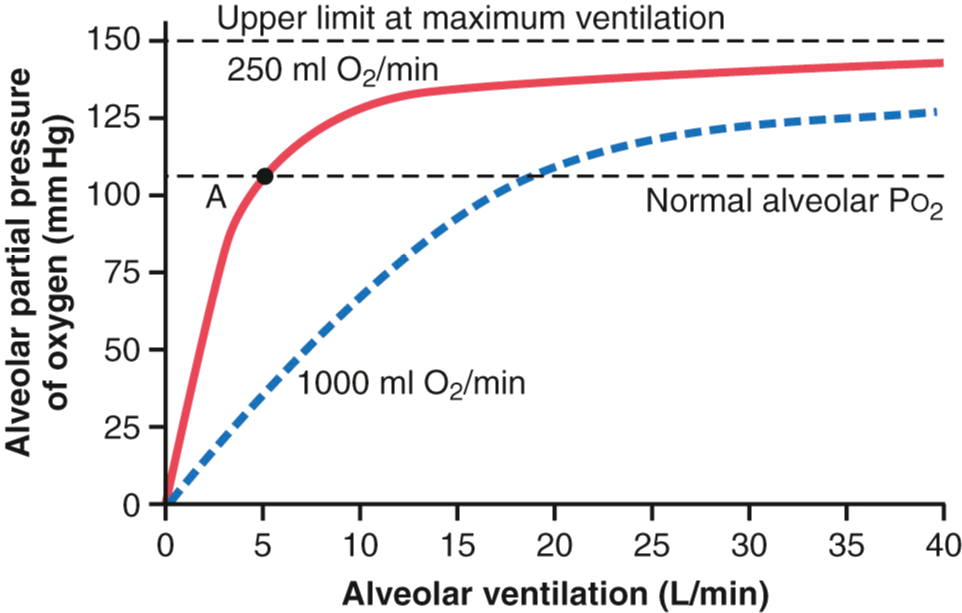
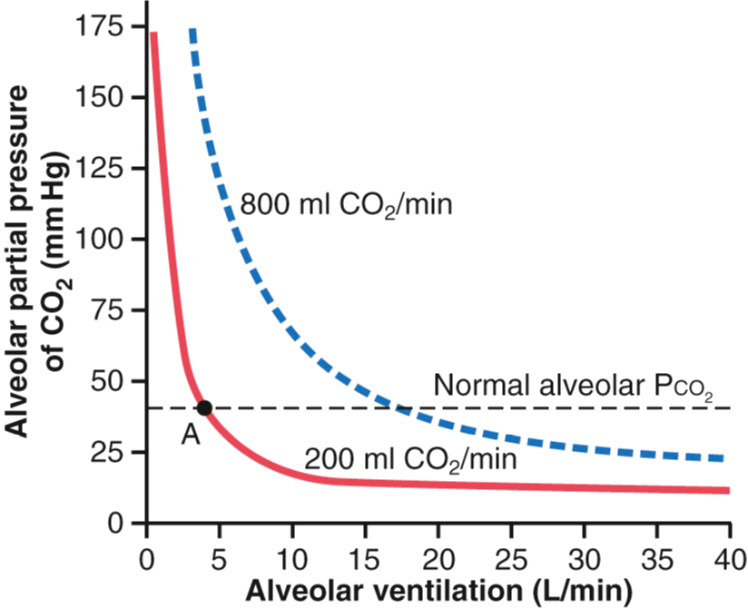

<!-- .slide: id="MEDI2101Wk2_2" -->
#### MEDI2101 Cardiovascular and Respiratory System.
### Block 1: Respiratory System
# LO1.2: Basics of the respiratory system - gas exchange
(Week 2, Lecture 2)
##### Dr Mark Butlin (PhD, BE, SFHEA)

Macquarie Medical School

Faculty of Medicine, Health and Human Sciences, Macquarie University.
      
---
## LO1.2.4 Communicate the factors that determine the rate of diffusion of a gas across a membrane.

--
<!-- .slide: data-auto-animate -->
### Diffusion of a gas across a membrane
#### Main anatomical elements of the respiratory airway

<figure>
  
  <figcaption>
<b>Bulk transport of gases</b>

The movement of air as a whole from the surrounding atmosphere into and out of the lungs (and alveoli).
  </figcaption>
</figure>

Wikimedia Commons

--
<!-- .slide: data-auto-animate -->
### Diffusion of a gas across a membrane
#### Main anatomical elements of the respiratory airway

<figure>
  
  <figcaption>
<b>Gas exchange between air and blood</b>

Diffusion of gases from a region of higher partial pressure to a region of lower partial pressure, across the alveolar membrane and capillary wall.

Capillaries are the smallest of blood vessels and are around the diameter of a single red blood cell and form a dense network supplying the cells of the body with nutrients. More detail will be in the cardiorespiratory component of the unit.
  </figcaption>
</figure>

Wikimedia Commons

--
<!-- .slide: data-auto-animate -->
### Diffusion of a gas across a membrane
####

**Diffusion of gases (recap)**

- Diffusion is the movement of a material from a region of higher concentration to a region of lower concentration.
- The pressure of a particular gas (eg. oxygen) in a mix of gases (eg. in air or blood) is called the partial pressure.
- The greater the difference in partial pressure of a gas between two mediums (eg. air and blood), the greater the rate of diffusion.

Modified from Wikimedia Commons

--
<!-- .slide: data-auto-animate -->
### Diffusion of a gas across a membrane
####

**Diffusion - definition**

\begin{equation}
D\approx \dfrac{\Delta P \times A \times S}{d \times \sqrt{MW}}
\end{equation}

<table>
  <tr>
    <td width=40%>

where

- **$D$** diffusion rate
- **$\Delta P$** difference in partial pressures
- **$A$** cross sectional area of the pathway
- **$S$** solubility of the gas
- **$MW$** molecular weight of the gas
- **$d$** distance of Diffusion
  </td><td>

<b>Important information in the diffusion equation for normal, healthy respiration:</b>

Diffusion ($D$) of a particular gas is dependent on the magnitude of the partial pressure difference ($\Delta P$) of that gas.

  </td>
  </tr>
</table>

--
<!-- .slide: data-auto-animate -->
### Diffusion of a gas across a membrane
####

<figure>
  
  <figcaption>
  
Movement of gasses from air to blood, and vice versa, is not a "pumped" (bulk flow) mechanism.

  
It is due to diffusion of gases from a region of higher partial pressure to a region of lower partial pressure.

  </figcaption>
</figure>

Modified from <a href="https://upload.wikimedia.org/wikipedia/commons/8/8b/Alveoli.svg">https://upload.wikimedia.org/wikipedia/commons/8/8b/Alveoli.svg</a>

--
<!-- .slide: data-auto-animate -->
### Diffusion of a gas across a membrane
####

<figure>
  
  <figcaption>
$\uparrow$ ventilation $\uparrow$ alveolar pO2 and therefore $\uparrow$ diffusion of oxygen from the alveolus into blood.

Absorption of oxygen into blood at rest and during exercise.
  </figcaption>
</figure>

Figure 40-4, <em>Guyton and Hall Textbook of Medical Physiology</em>

--
<!-- .slide: data-auto-animate -->
### Diffusion of a gas across a membrane
####

<figure>
  
  <figcaption>
$\uparrow$ ventilation $\downarrow$ alveolar pCO2 and therefore $\uparrow$ diffusion of carbon dioxide from the blood into the alveolus.

Absorption of oxygen into blood at rest and during exercise.
  </figcaption>
</figure>

Figure 40-5, <em>Guyton and Hall Textbook of Medical Physiology</em>

---
## LO1.2.5 Explain the clinical quantification of gas exchange in terms of the ventilation-perfusion ratio.

--
<!-- .slide: data-auto-animate -->
### Ventilation-perfusion ratio
####

In broad terms:

- Increased ventilation increases partial pressure of alveolar oxygen, increasing diffusion of oxygen into and carbon dioxide out of blood.
- Increased lung perfusion increases the effective "surface area" (blood) exposed to the area for gas exchange, increasing diffusion of oxygen into and carbon dioxide out of blood.

--
<!-- .slide: data-auto-animate -->
### Ventilation-perfusion ratio
####

<figure>
  
  <figcaption>
Increased ventilation increases partial pressure of alveolar oxygen, increasing diffusion of oxygen into and carbon dioxide out of blood.

Increased lung perfusion increases the effective "surface area" (blood) exposed to the area for gas exchange, increasing diffusion of oxygen into and carbon dioxide out of blood.    
  </figcaption>
</figure>

Original content created for MEDI2101.

--
<!-- .slide: data-auto-animate -->
### Ventilation-perfusion ratio
####

$\mathrm{ventilation\~perfusion\~ratio}=\dfrac{\mathrm{alveolar\~ventilation}}{\mathrm{blood\~flow}} = \dfrac{\dot V_{A}}{\dot Q}$

--
<!-- .slide: data-auto-animate -->
$\mathrm{ventilation\~perfusion\~ratio}=\dfrac{\mathrm{alveolar\~ventilation}}{\mathrm{blood\~flow}} = \dfrac{\dot V\_{A}}{\dot Q}$

What does it mean if the ventilation-perfusion ratio is zero?

Without ventilation ($\dot V_A=0$) alveolar oxygen partial pressure and alveolar carbon dioxide partial pressure will equilibrate with blood oxygen and carbon dioxide partial pressure.

Without a partial pressure difference between air and blood there will be no diffusion of oxygen into blood and carbon dioxide out of blood.

Therefore blood will not be oxygenated and cells will not receive the oxygen required to live.

--
<!-- .slide: data-auto-animate -->
$\mathrm{ventilation\~perfusion\~ratio}=\dfrac{\mathrm{alveolar\~ventilation}}{\mathrm{blood\~flow}} = \dfrac{\dot V\_{A}}{\dot Q}$

What does it mean if the ventilation-perfusion ratio reaches a very large number (becoming infinite)?

Without perfusion ($\dot Q=0$) alveolar oxygen partial pressure and alveolar carbon dioxide partial pressure will equilibrate with blood oxygen and carbon dioxide partial pressure of the stagnant blood in the lungs.

Without a partial pressure difference between air and blood there will be no diffusion of oxygen into blood and carbon dioxide out of blood.

Therefore blood will not be oxygenated and cells will not receive the oxygen required to live.

--
<!-- .slide: data-auto-animate -->
$\mathrm{ventilation\~perfusion\~ratio}=\dfrac{\mathrm{alveolar\~ventilation}}{\mathrm{blood\~flow}} = \dfrac{\dot V\_{A}}{\dot Q}$

What does it mean if the ventilation-perfusion ratio reaches a very large number (becoming infinite)?

Also, blood is not circulating so there is no bulk movement of oxygen to where it is needed in the body!

--
<!-- .slide: data-auto-animate -->
### Ventilation-perfusion ratio
####

- 1 litre of blood can contain around 200 ml of oxygen.
- 1 litre of dry air has around 210 ml of oxygen.
- Therefore, the ideal $\frac{\dot V_{A}}{\dot Q}$ ratio is around 1.

It is a bit more complex than this due to regional differences in the lung, and the normal $\frac{\dot V_{A}}{\dot Q}$ ratio is around 0.8.

This also makes sense if we know the average normal ventilation rate is around 4 L/min and the cardiac output is 5 L/min ($\frac{4\mathrm{~L/min}}{5\mathrm{~L/min}}=0.8$).

--
<!-- .slide: data-auto-animate -->
### Ventilation-perfusion ratio
####

**A low $\frac{\dot V_{A}}{\dot Q}$ ratio** means either low ventilation or high perfusion. It may be seen in conditions that reduce ventilation such as:

- asthma
- chronic bronchitis
- acute pulmonary edema
 

**A high  $\frac{\dot V_{A}}{\dot Q}$ ratio** means either high ventilation or low perfusion. It may be seen in:

- pulmonary embolism (reducing lung blood perfusion)
- emphysema (increased ventilation due to overwork to compensate for lung damage)

    We will be revisiting the ventilation-perfusion ratio in the unit content on homeostasis in exercise, and in chronic obstructive pulmonary disease.

---
## LO1.2.6 Summarise the five steps of the scientific method (identify a question, formulate a hypothesis, make a testable prediction, conduct an experiment and analyse the results).

See on-line tutorial in iLearn.

---
## LO1.2.7 Relate the principles of falsification and Occam’s Razor to the scientific method in the context of (bio)medical investigation.

See on-line tutorial in iLearn.

---
## LO1.2.8 Outline the main anatomy of the lower respiratory system and explain the function of each structure.

See anatomy material in iLearn and attend anatomy class.

