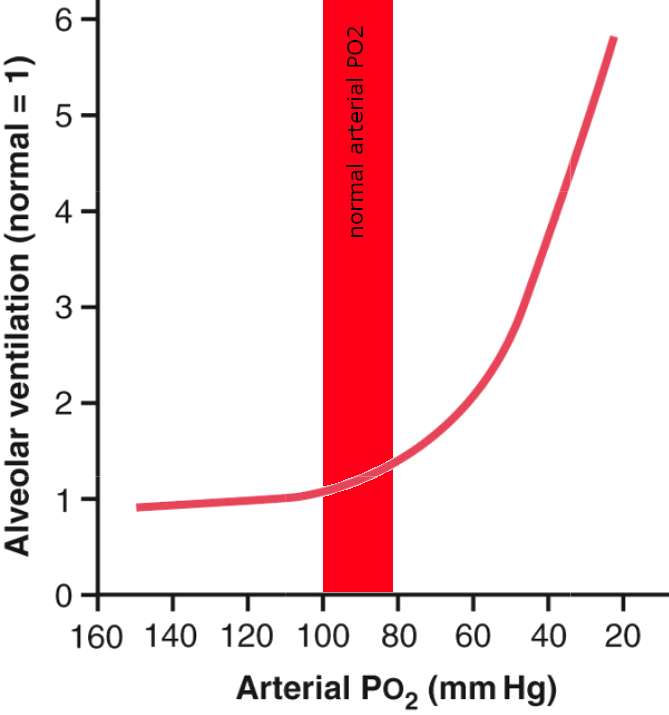
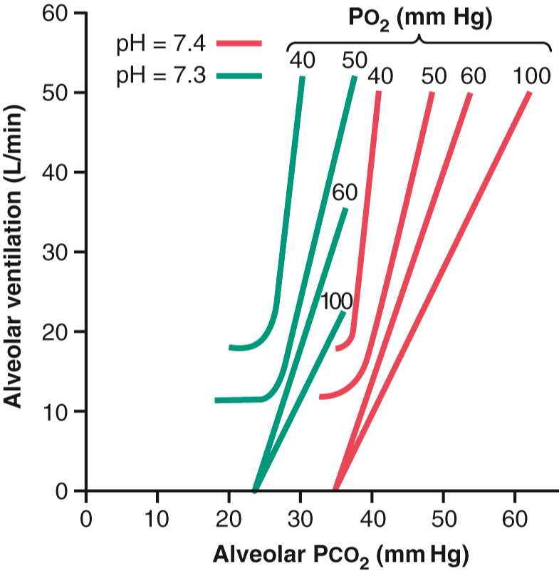
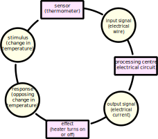

<!-- .slide: data-auto-animate-restart id="MEDI2101Wk3_1"-->
#### MEDI2101 Cardiovascular and Respiratory System.
### Block 1: Respiratory System
# LO1.3: Respiratory regulation inputs
(Week 3, Lecture 1)
##### Assoc. Prof. Mark Butlin (PhD, BE, SFHEA) (he/him)

Macquarie Medical School, Faculty of Medicine, Health and Human Sciences Macquarie University. On the land of the Wallumattagal clan of the Dharug Nation.

&nbsp;

&nbsp;

&nbsp;

This material is provided to you as a Macquarie University student for your individual research and study purposes only. You cannot share this material without permission. Macquarie University is the copyright owner of (or has licence to use) the intellectual property in this material. Legal and/or disciplinary actions may be taken if this material is shared without the University’s written permission.

--
### MEDI2101 Cardiovascular and Respiratory System
#### To do in Week 3

<a href="https://ilearn.mq.edu.au/course/view.php?id=64513#section-8"> MEDI2101 iLearn Week 3</a>

--
###
#### A lot of work?

- In theory, each 10 credit point unit should have around 10 to 12 hours of content / work each week (including time to complete assessments).
- I have tried to put together the best material to help you progress toward a medical / clinical career.
- Nothing is compulsory. As an adult learner, you can decide whether you engage a lot or a little.

--
###
#### Anatomy quizzes - or anything else missed?

Please send me a private message through the iLearn private message system.

I am very happy to extend the closing time on any of the anatomy formative quizzes if you have not completed them.

---
<!-- .slide: data-auto-animate-restart -->
Respiration changes in response to the physiological status and surrounding environment. That is a **change** in the physiology or environment needs to be **detected** and a response invoked as a result. The inputs that regulate respiration include:

- **higher order brain centres** responding to environmental stressors.
- **peripheral chemoreceptors** signal received by the glossopharyngeal nerve.
- **central chemoreceptors** located in the intracranial space
- **other sensory nerves** 

---
<!-- .slide: data-auto-animate-restart -->
## LO1.3.1 Know the normal levels of the three arterial blood parameters that are monitored and used to regulate ventilation: (1) oxygen, (2) carbon dioxide, and (3) pH levels.

--
### Arterial blood gases and pH
#### Why gases in blood -- this is a respiratory lecture? (Review)

  

  
  

  

  
Gas exchange occurs from an area of higher gas partial to pressure to an area of lower gas partial pressure.

  

  

  
Silverthorn, D.U. Human Physiology: An Integrated Approach, 8th Ed. 2019

  

--
### Arterial blood gases and pH
#### Why gases in blood -- this is a respiratory lecture? (Review)

Partial pressures of oxygen and carbon dioxide in the body.

<table>
  <tr>
    <th></th>
    <th> alveoli </th>
    <th></th>
    <th> venous blood </th>
    <th> arterial blood </th>
    <th></th>
    <th> tissue cells </th>
    <th></th>
    <th> venous blood </th></tr>
  <tr>
    <td> P$_{O_2}$ (%) </td>
    <td> 100 </td>
    <td>$\longrightarrow$</td>
    <td> 40 </td>
    <td> 85 - 100 </td>
    <td>$\longrightarrow$</td>
    <td> 10 - 30 </td>
    <td></td>
    <td> 40 </td></tr>
  <tr>
    <td> P$_{CO_2}$ (%) </td>
    <td> 40 </td>
    <td>$\longleftarrow$</td>
    <td> 46 </td>
    <td> 35 - 45 </td>
    <td> </td>
    <td> 50 </td>
    <td> $\longrightarrow$ </td>
    <td> 46 </td></tr>
  <tr>
    <td> </td>
    <td> </td>
    <td> </td>
    <td> $\downarrow$ </td>
    <td> $\downarrow$ </td>
    <td> </td>
    <td> $\downarrow$ </td>
    <td> </td>
    <td> $\downarrow$ </td></tr>
  <tr>
    <td> pH </td>
    <td>  </td>
    <td> </td>
    <td> 7.37 </td>
    <td> 7.38 - 7.42 </td>
    <td></td>
    <td> 7.34 </td>
    <td></td>
    <td> 7.37</td>
  </tr>
</table>

Concentration of carbon dioxide effects fluid pH.

--
### Arterial blood gases and pH
#### Carbon dioxide in blood

Dissolving of carbon dioxide in blood (water):

\begin{equation}
  \mathrm{CO}_2 + \mathrm{H}_2\mathrm{O} \overset{\mathrm{carbonic~anhydrase}}{\longrightarrow} \mathrm{H}_2\mathrm{CO}_3 \longrightarrow \mathrm{H}^+ + \mathrm{HCO}_3^-
\end{equation}

carbon dioxide + water $\longrightarrow$ carbonic acid $\longrightarrow$ hydrogen ions + bicarbonate ions

--
### Arterial blood gases and pH
#### Carbon dioxide in blood
Carriage of carbon dioxide by haemoglobin:

$\mathrm{CO}_2 + \mathrm{Hb} \longleftrightarrow \mathrm{HbCO}_2$

carbon dioxide + haemoglobin $\\longleftrightarrow$ carbaminohaemoglobin

--
### Arterial blood gases and pH
#### Oxygen in blood

Oxygen is carried in two ways in the blood:

1. bound to haemoglobin
1. dissolved in plasma

--
### Arterial blood gases and pH
####
We have established that:
- oxygen is important for cellular respiration
- carbon dioxide is a by-product of cellular respiration and needs to be removed
- carbon dioxide decreases pH1

Effective functioning of body processes require rather narrow ranges of these parameters, <em>especially pH</em>.

&nbsp

1 We will not go into the chemistry in this unit. This is covered in more details in the renal unit. If you are a chemistry lover, see Chapter 31 of the Guyton and Hall textbook.

--
### Arterial blood gases and pH
#### Normal ranges of arterial blood gases, pH and bicarbonate

<table>
  <tr>
    <th> arterial blood </th>
    <th> low     </th>
    <th> normal   </th>
    <th> high </th>
  </tr>
  <tr>
    <td> paO2       </td>
    <td> < 80 mmHg  </td>
    <td> 80 -- 100 mmHg</td>
    <td> > 100 mmHg</td>
  </tr>
  <tr>
    <td> O2 saturation </td>
    <td> < 95 % </td>
    <td> 95 - 99 %  </td>
    <td> N/A </td>
  </tr>
  <tr>
    <td> paCO2      </td>
    <td> < 35 mmHg </td>
    <td> 35 - 45 mmHg</td>
    <td> > 45 mmHg </td>
  </tr>
  <tr>
    <td> pH             </td>
    <td> < 7.35 (acidosis)      </td>
    <td> 7.35 - 7.45 </td>
    <td> > 7.45 (alkalosis) </td>
  </tr>
  <tr>
    <td> HCO3-      </td>
    <td> < 22 mEq/L </td>
    <td> 22 - 26 mEq/L   </td>
    <td> > 26 mEq/L </td>
  </tr>
</table>

Acidosis and alkalosis can each be subclassified as respiratory or metabolic in origin. This is the subject of the on-line module this week.

If blood oxygen, carbon dioxide, and pH is pathological when outside a normal range, there must be sensors in the body that detect abnormalities to feedback to the respiratory and cardiovascular system to bring these gases / pH back into the normal range.

---
<!-- .slide: data-auto-animate-restart -->
## LO1.3.2 Identify that central and peripheral chemoreceptors monitor carbon dioxide and oxygen levels to regulate breathing

--
### Chemoreceptor input to the respiratory centre
#### 

**Note:** In the context of this learning outcome we are discussing chemoreceptor feedback to breathing regulation.

**Chemoreceptors also feedback to the cardiovascular centres of the brain.** More on this in Week 6.

--
### Chemoreceptor input to the respiratory centre
####  Peripheral chemoreceptors

<figure>
  
  <figcaption>
Peripheral chemoreceptors are located in the carotid and aortic bodies.
<ul class="fragment">
<li> Fed by a small artery branching off the aorta (or carotid artery).</li>
<li> Each minute, the carotid (or aortic) body receives twenty times its own weight in arterial blood supply.</li>
<li> Therefore, they are chemosensing <em>arterial</em>, not venous blood.</li>
</ul>

Peripheral chemoreceptors are sensitive to:

<ul>
<li> oxygen</li>
<li> carbon dioxide</li>
<li> hydrogen ions</li>
</ul>

  </figcaption>
</figure>

Guyton and Hall Textbook of Medical Physiology

--
### Chemoreceptor input to the respiratory centre
#### Peripheral chemoreceptors

  

  
  

  

  
The ventilatory response to oxygen sensing in the peripheral chemoreceptors is only modified slightly for oxygen in the range of normal arterial PO2, and greatly for PO2 below that.

 For high PO2 there is very little ventilatory response.

  

  

  
Modified from Guyton and Hall Textbook of Medical Physiology

  

--
### Chemoreceptor input to the respiratory centre
#### Peripheral chemoreceptors

<figure>
  
  <figcaption>

Sensitive to change in arterial blood CO2
  </figcaption>
</figure>

Guyton and Hall Textbook of Medical Physiology

--
### Chemoreceptor input to the respiratory centre
#### Peripheral chemoreceptors

<figure>
  
  <figcaption>

Sensitive to change in arterial blood CO2

Lower arterial pO2 increases peripheral chemoreceptor sensitivity to pCO2 
  </figcaption>
</figure>

Guyton and Hall Textbook of Medical Physiology

--
### Chemoreceptor input to the respiratory centre
#### Peripheral chemoreceptors

<figure>
  
  <figcaption>

Sensitive to change in arterial blood pCO2

Lower arterial pO2 increases peripheral chemoreceptor sensitivity to pCO2 

Decreased pH (pH lowered by increased CO2 and the bicarbonate reaction) increases sensitivity to pCO2 (leftward shift in curve)

Respiratory sensitivity of peripheral chemoreceptors to pCO2 is 7$\times$ greater and 5$\times$ more rapid than central chemoreceptors.

  </figcaption>
</figure>

Guyton and Hall Textbook of Medical Physiology

--
### Chemoreceptor input to the respiratory centre
#### Central chemoreceptors

Centres in the brain that regulate breathing, in addition to receiving signals from the peripheral chemoreceptors, are *directly* chemosensitive.

-  Highly sensitive to H+ concentration
   -  However, H+ ions do not readily cross the blood-brain barrier
   -  Therefore, changes in blood H+ concentration have little effect on central chemoreceptors
-  Not directly sensitive to CO2 concentration
-  Not particular sensitive to O2 concentration

--
<!-- .slide: data-background="#111111" -->

Then how do the central chemoreceptors modify ventilation in response to partial pressures of blood gases?

--
### Chemoreceptor input to the respiratory centre
#### Central chemoreceptors

\begin{equation}
  \mathrm{CO}\_2 + \mathrm{H}\_2\mathrm{O} \overset{\mathrm{carbonic~anhydrase}}{\longrightarrow} \mathrm{H}\_2\mathrm{CO}\_3 \longrightarrow \mathrm{H}^+ + \mathrm{HCO}_3^-
\end{equation}

carbon dioxide + water $\longrightarrow$ carbonic acid $\longrightarrow$ hydrogen ions + bicarbonate ions

-  CO2 easily passes through the blood-brain barrier (unlike H+)
-  Therefore, when blood CO2 rises, so does cerebrospinal fluid CO2.
-  Cerebrospinal fluid CO2 is converted to HCO3- and H+.
-  The central chemoreceptors, which are highly sensitive to H+, sense the cerebrospinal fluid H+.

--
<!-- .slide: data-background="#111111" -->

Central chemoreceptors are, therefore, highly sensitive to blood CO2, but not blood H+.

--
<!-- .slide: data-background-image="images/fishtankheater.jpg" data-background-opacity="0.6" -->
### Chemoreceptor input to the respiratory centre
####

<aside class="notes">
The chemosensing pathway provides a negative feedback loop for changes in oxygen, carbon dioxide, and H+ in blood by sensing these parameters, the feedback leading to a change in ventilation and an opposite change in that parameter. The figure gives the example of blood oxygen. A drop in blood oxygen would be detected by chemosensors, the signal fed to the respiratory centre, where the somatic neuronal output increases respiratory rate and tidal volume, increasing the partial pressure of O2 in the alveoli, and therefore more oxygen will diffuse into blood (opposing the initial drop in blood oxygen).
</aside>

---
<!-- .slide: data-auto-animate-restart -->
## LO1.3.3 Understand the receptors and reflexes affecting respiratory centres: stretch (Hering-Breuer); juxtacapillary; irritant; proprioceptors; thermoreceptors; pain; cough and sneezing; deglutation.

--
### Reflex inputs to the respiratory centre
####

**reflex**

The sum total of any particular involuntary activity.

Dorland's Illustrated Medical Dictionary, 29th Ed.

--
<!-- .slide: data-background="#111111" -->

What are some reflexes that would influence breathing / ventilation?

--
### Reflex inputs to the respiratory centre
#### Hering-Breuer reflex

-  **Stretch receptors** are located in the bronchi and bronchioles.
-  At high levels of stretch, they communicate to the central respiratory centre via the vagi to **cease inspiration**.
-  **Only activated during hyperinflation** (tidal volume > 3$\times$ normal tidal volume).

--
### Reflex inputs to the respiratory centre
#### Apnoea

The cessation of breathing for a period of time. 

Apnoea can be:

- **centrally caused** loss of pacing signal from respiratory centre;
- **physically caused** relaxation of the soft palate occluding the airway; or
- **a reflex response via the juxtacapillary ("J") receptors** in wall alveoli, in contact with capillaries and can produce apnoea. Stimulated by:
  -  pulmonary congestion
  -  pneumonia
  -  exogenous/endogenous chemicals (histamine, serotonin)

After cessation of apnoea, there is usually a reflex response of increased breathing rate / tidal volume, as blood oxygen would have depleted and carbon dioxide increased, stimulating the chemoreceptors.

--
### Reflex inputs to the respiratory centre
#### Increased ventilation

Occurs under a number of scenarios. There are at least four different receptors that can increase minute ventilation, and may lead to hyperventilation:

<ul>
  <li> irritant receptors</li>
  <li> proprioceptors</li>
  <li> metaboreceptors</li>
  <li> thermoreceptors</li>
  <li> pain receptors</li>
</ul>

<b>Note:</b> Some of these mechanisms may lead to hyperventilation, but not all increases in respiratory rate and/or tidal volume are hyperventilation.

<b>Hyperventilation:</b> An abnormally high rate and/or depth of breathing, <b>resulting in loss of blood CO2.  Hyperventilation is <em>not</em> simply a fast breathing rate.</b>

--
<!-- .slide: data-auto-animate data-background-image="images/bleach.jpg" -->
### Reflex inputs to the respiratory centre
#### Increased ventilation - irritant receptors

**Irritant receptors in the lungs** stimulated by harmful chemicals (e.g. ammonia, sulphur dioxide).

Irritant receptor stimulation results in reflex hyperventilation and bronchospasm, reducing likelihood of harmful chemicals entering the alveoli.

--
<!-- .slide: data-auto-animate data-background-image="images/Sprinter_at_starting_block.jpg" -->
### Reflex inputs to the respiratory centre
#### Increased ventilation - proprioceptors

**Proprioceptors** (provide sense of position) in joints, muscles, tendons when stimulated also cause hyperventilation.

Immediately activated with dynamic exercise, causing increased breathing rate/volume even before increased oxygen demand.

--
<!-- .slide: data-auto-animate data-background-image="images/Sprinter_at_starting_block.jpg" -->
### Reflex inputs to the respiratory centre
#### Increased ventilation - metaboreceptors

**Metaboreceptors** are peripheral nerve endings that respond to metabolites such as CO2, H+, lactate. Primarily in skeletal muscle.

These are different to chemoreceptors (located in the carotid bifurcation, aortic arch, and vasomotor centre of the brain) in that they are not sensing circulating blood gasses/H+ but the local metabolite concentrations in the muscle.

--
<!-- .slide: data-auto-animate data-background-image="images/snow.jpg" -->
### Reflex inputs to the respiratory centre
#### Increased ventilation - thermoreceptors 

**Thermoreceptors**, mostly cutaneous, responding to body temperature outside of the normal range. Both increased *and* decreased body temperature can cause increased ventilation.

--
### Reflex inputs to the respiratory centre
#### Increased ventilation - pain receptors

**Pain receptors** also signal to the respiratory centre.

Also can cause a hyperventillatory response.

Robert Weis, <a href="https://commons.wikimedia.org/wiki/File:Children%27s_pain_scale.JPG">https://commons.wikimedia.org/wiki/File:Children%27s_pain_scale.JPG</a>

--
### Reflex inputs to the respiratory centre
#### Cough reflex
-  Protective reflex caused by irritation of parts of the respiratory tract beyond nose like larynx, trachea and bronchi.
-  Communicated by vagal nerve.
-  Cough begins with deep inspiration followed by forceful expiration with closed glottis.
-  Intrapleural pressure rises above 100 mmHg.
-  Then, glottis is suddenly opened with explosive outflow of air at a high velocity (up to 160 km/hr) so the irritants may be expelled out of the respiratory tract.

--
<!-- .slide: data-auto-animate data-background-image="images/sneeze.jpg" -->
<h3 style="color:white">Reflex inputs to the respiratory centre</h3>
<h4 style="color:white"> Sneeze reflex</h4>

Similar reflex to a cough, but initiated by irritation of the nasal mucus membrane.

--
### Reflex inputs to the respiratory centre
#### Deglutation reflex

<figure>
  <video data-autoplay data-src="images/MySwallowStudy.mp4" width="40%"></video>
  <figcaption>
<ul>
  <li> During swallowing of the food, respiration is arrested.</li>
  <li> This is a type of apnoea (aka swallowing apnoea or deglutation apnoea).</li>
  <li> Prevents entry of the food particles into the respiratory tract.</li>
  <li> During the swallow, the hyoid bone can be seen elevating, and the epiglottis closing as a result.</li>
</ul>
  </figcaption>
</figure>

<a href="https://www.youtube.com/watch?v=Ri8bBhw9msQ">https://www.youtube.com/watch?v=Ri8bBhw9msQ</a>

--
### Reflex inputs to the respiratory centre
#### Respiratory receptors and reflexes: summary

<table>
  <tr>
    <th> receptor </th>
    <th> located </th>
    <th> senses </th>
    <th> reflex </th>
  </tr><tr>
    <td> <b>central chemoreceptors</b> </td>
    <td> central (brain) </td>
    <td> blood O2, CO2 </td>
    <td> alters minute ventilation</td>
  </tr><tr>
    <td> <b>peripheral chemoreceptors</b>        </td>
    <td> peripheral (carotid/aorta) </td>
    <td> blood O2, CO2, H+ </td>
    <td> alters minute ventilation</td>
  </tr><tr>
    <td> <b>juxtacapillary receptors</b> </td>
    <td> alveoli                 </td>
    <td> congestion         </td>
    <td> apnoea</td>
  </tr><tr>
    <td> <b>lung irritant receptors</b>  </td>
    <td> respiratory epithelium  </td>
    <td> airborne irritants </td>
    <td> cough, sneeze</td>
  </tr><tr>
    <td> <b>pain receptors</b> </td>
    <td> skin, some internal tissue </td>
    <td> pain               </td>
    <td> increased minute ventilation </td>
  </tr><tr>
    <td> <b>proprioceptors</b> </td>
    <td> throughout body            </td>
    <td> movement           </td>
    <td> increased minute ventilation</td>
  </tr><tr>
    <td> <b>metaboreceptors</b> </td>
    <td> primarily skeletal muscle </td>
    <td> metabolite concentration </td>
    <td> increased minute ventilation</td>
  </tr><tr>
    <td> <b>stretch receptors</b> </td>
    <td> bronchi/bronchioles        </td>
    <td> hyperinflation     </td>
    <td> Hering-Breuer</td>
  </tr><tr>
    <td> <b>thermoreceptors</b>       </td>
    <td> immediately under skin     </td>
    <td> temperature        </td>
    <td> alters minute ventilation</td>
  </tr><tr>
    <td> <b>touch receptors</b> </td>
    <td> pharynx </td>
    <td> food </td>
</td>
  </tr>
</table>

--
### Reflex inputs to the respiratory centre
#### Respiratory receptors and reflexes: summary

<table>
  <tr>
    <th> reflex          </th>
    <th> receptor </th>
    <th> action </th>
  </tr><tr>
    <td> cough           </td>
    <td> respiratory irritant receptors </td>
    <td> increased intrathoracic pressure and release</td>
  </tr><tr>
    <td> sneeze       </td>
    <td> respiratory irritant receptors </td>
    <td>  increased intrathoracic pressure and release</td>
  </tr><tr>
    <td> deglutation  </td>
    <td> pharynx touch receptors </td>
    <td> apnoea</td>
  </tr><tr>
    <td> Hering-Breuer </td>
    <td> bronchi/bronchiole stretch receptors </td>
    <td> cessation of inspiration </td>
  </tr><tr>
    <td>hyperventilation* </td>
    <td> lung irritant; proprioceptors; thermoreceptors; pain receptors </td>
    <td> increased minute ventilation </td>
  </tr>
<table>

&nbsp

*These receptors may only cause increased breathing rate / volume. Hyperventilation would only occur in the more extreme cases, with continued hyperventilation reducing lung pCO2, causing hypocapnia - a low pCO2 in blood.

--
### Reflex inputs to the respiratory centre
#### Respiratory receptors and reflexes: summary

</img>

Created for MEDI2101
