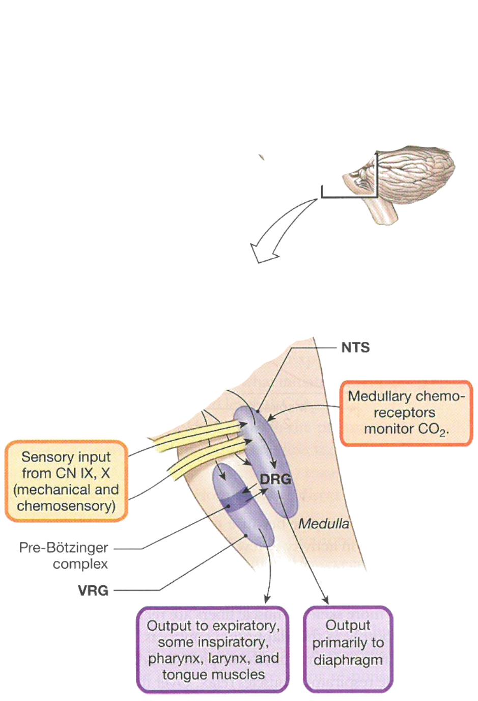
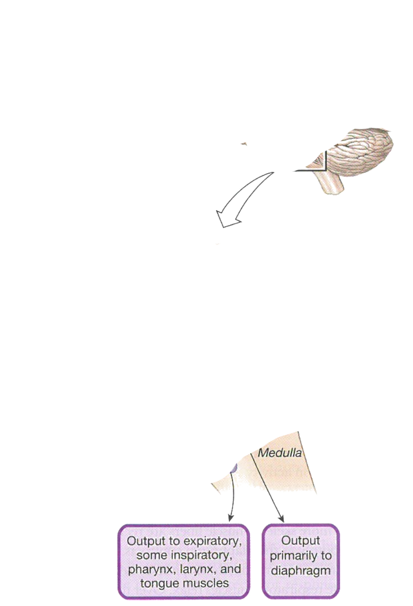
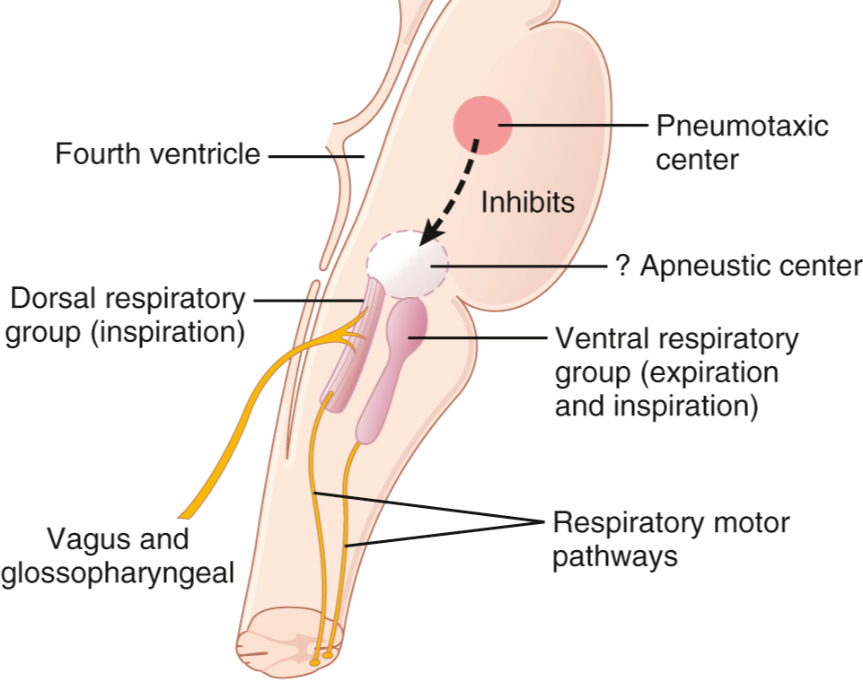
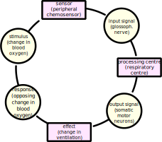

<!-- .slide: id="MEDI2101Wk3_2" -->
#### MEDI2101 Cardiovascular and Respiratory System.
### Block 1: Respiratory System
# LO1.3: The respiratory centre and respiratory regulation output
(Week 3, Lecture 2)
##### Dr Mark Butlin (PhD, BE, SFHEA) (he/him)

Macquarie Medical School, Faculty of Medicine, Health and Human Sciences Macquarie University. On the land of the Wallumattagal clan of the Dharug Nation.

---
## LO1.3.4 Recognise the respiratory centre role in regulating respiration.

--
<!-- .slide: data-auto-animate -->
### The respiratory centre
####

To have an **effect**, the outcome of the respiratory input has to alter minute ventilation. 

This means all respiratory regulatory responses have to illicit a change in either or both:

- breathing rate
- tidal volume

\begin{equation}
  \mathrm{minute\~ventilation} = \mathrm{ventilation\~rate} \times \mathrm{tidal\~volume}
\end{equation}

--
<!-- .slide: data-auto-animate -->
### The respiratory centre
#### 
</img>

Created for MEDI2101

--
<!-- .slide: data-auto-animate -->
### The respiratory centre
#### 

<figure>
  
  <figcaption>

Central neural control of spontaneous breathing, conscious control of breathing, and modification of ventilation is:

<ul>
 <li> highly complex;</li>
 <li> still being studied and mapped.</li>
</ul>
  </figcaption>
</figure>

Silverthorn, D.U. Human Physiology: An Integrated Approach, 8th Ed. 2019

<aside class="notes">Simplified pathway of central pathways for respiratory control. The area from the Pons and above is responsible for normal rhythm of breathing. The medulla has a role in modifying ventilation and some rhythm. If the spinal chord is severed below the medulla, breathing will cease. The respiratory centre receives inputs (that can change respiratory rate and depth) from the higher order brain centres, from the peripheral and central chemoreceptors (Section \ref{sec:chemoreceptors}) and from various respiratory sensors (Section \ref{sec:respiratoryreflexes}).}{PRG: pontine respiratory group; NTS: nucleus tractus solitarius; DRG: dorsal respiratory group; VRG: ventral respiratory group.</aside> 

--
<!-- .slide: data-auto-animate -->
### The respiratory centre
#### 
<figure>
  
  <figcaption>

Normal respiration:

<ul>
<li> <b>PRG:</b> pontine respiratory group</li>
<li> <b>NTS:</b> nucleus tractus solitarius</li>
<li> <b>DRG:</b> dorsal respiratory group</li>
<li> <b>VRG:</b> ventral respiratory group.</li>
</ul>
  </figcaption>
</figure>

Silverthorn, D.U. Human Physiology: An Integrated Approach, 8th Ed. 2019

--
<!-- .slide: data-auto-animate -->
### The respiratory centre
#### 

<figure>
  
  <figcaption>

Sever the pons: Loss of sinus rhythm (but still breathing)

<ul>
<li> <b>PRG:</b> pontine respiratory group</li>
<li> <b>NTS:</b> nucleus tractus solitarius</li>
<li> <b>DRG:</b> dorsal respiratory group</li>
<li> <b>VRG:</b> ventral respiratory group.</li>
</ul>
  </figcaption>
</figure>

Modified from Silverthorn, D.U. Human Physiology: An Integrated Approach, 8th Ed. 2019

--
<!-- .slide: data-auto-animate -->
### The respiratory centre
#### 

<figure>
  
  <figcaption>

Sever the medulla: No breathing

<ul>
<li> <b>PRG:</b> pontine respiratory group</li>
<li> <b>NTS:</b> nucleus tractus solitarius</li>
<li> <b>DRG:</b> dorsal respiratory group</li>
<li> <b>VRG:</b> ventral respiratory group.</li>
</ul>
  </figcaption>
</figure>

Modified from Silverthorn, D.U. Human Physiology: An Integrated Approach, 8th Ed. 2019

--     
<!-- .slide: data-auto-animate -->
### The respiratory centre
#### 

<figure>
  
  <figcaption>

Simplified pathway of central pathways for respiratory control.

<ul>
  <li> <b>pneumotaxic centre</b></li>
  <ul>
    <li> arrests duration of inspiratory phase</li>
    <li> increases rate of respiration</li>
  </ul>
  <li> <b>apneustic centre</b></li>
  <ul>
    <li> increases depth of inspiration</li>
  </ul>
  <li> <b>dorsal respiratory group</b></li>
  <ul>
    <li> generates respiratory pacemaker signal</li>
    <li> generates respiratory ramp signal (changes volume inspired by the lungs)</li>
    <li> input site of glossopharyngeal nerves (carrying peripheral chemoreceptor signals)</li>
  </ul>
  <li> <b>ventral respiratory group</b></li>
  <ul>
    <li> is inactive during normal breathing.</li>
    <li> contributes to inspiration and expiration during increased ventilatory requirements.</li>
  </ul>
</ul>
  </figcaption>
</figure>

&nbsp

Guyton and Hall Textbook of Medical Physiology

--
<!-- .slide: data-auto-animate -->
### The respiratory centre
#### Inputs to the respiratory centre

The respiratory centre of the brain sets the respiratory rate and respiratory depth (i.e. minute ventilation) in response to the inputs it receives. These inputs include:

- <b>higher order brain centres</b> responding to environmental stressors.
- <b>peripheral chemoreceptors</b> signal received by the glossopharyngeal nerve.
- <b>central chemoreceptors</b> located in the intracranial space
- <b>other sensory nerves</b> (see previous lecture).

--
<!-- .slide: data-auto-animate -->
### The respiratory centre
#### Outputs of the respiratory centre
<figure>
  
  <figcaption>

Nerves involved in the input to (glossopharyngeal nerve) and output of (intercostal and phrenic nerves) the respiratory centre.

In response to the inputs it receives, the respiratory centre modulates respiratory rate and respiratory depth (i.e. minute ventilation) through:

<ul>
  <li> <b>somatic motor neurons</b> including:</li>
  <ul>
    <li> <b>phrenic nerve</b> innervates the diaphragm</li>
    <li> <b>intercostal nerves</b> innervate the intercostal muscles</li>
  </ul>
<ul>
  </figcaption>
</figure>

M. Richardson, Physiology for practice: the mechanisms controlling respiration, Nursing Times, 2003;99(41):48--50.

--
<!-- .slide: data-auto-animate -->
### The respiratory centre
#### Outputs of the respiratory centre

Respiratory regulatory responses have to illicit a change in either or both:

-   breathing rate
-   tidal volume

\begin{equation}
  \mathrm{minute\~ventilation} = \mathrm{ventilation\~rate} \times \mathrm{tidal\~volume}
\end{equation}

--
<!-- .slide: data-background="#111111" data-auto-animate -->

<h3 style="color:white" data-id="comms">Respiratory regulation: communicating</h3>
<h4></h4>

(as a professional, or... in assessment task 3 or the final exam)

change $\rightarrow$ detected how? $\rightarrow$ processed how? $\rightarrow$ output where? $\rightarrow$ action

--
<!-- .slide: data-background-image="images/fishtankheater.jpg" data-auto-animate -->

<h3 style="color:white" data-id="comms">Respiratory regulation: communicating</h3>
<h4></h4>

change $\rightarrow$ detected how? $\rightarrow$ processed how? $\rightarrow$ output where? $\rightarrow$ action

--
<!-- .slide: data-auto-animate -->
<h3 data-id="comms">Respiratory regulation: communicating</h3>
<h4></h4>

What is one mechanism that increases oxygen intake during walking?

change $\rightarrow$ detected how? $\rightarrow$ processed how? $\rightarrow$ output where? $\rightarrow$ action

One of the actions of walking is movement (change) that stimulates proprioceptors (detected). These signal to the respiratory centre of the brain (processed), with resulting increased activity in the phrenic and and intercostal nerves (output) causing an increase in breathing rate and tidal volume (action). This increases minute ventilation and the partial pressure of oxygen in the alveoli, which increases diffusion of oxygen into the blood.

&nbsp

The vasomotor cortex would also be engaged during exercise - more on this later in the unit.

---
## LO1.3.5 Be able to identify the primary acid-base disturbances (respiratory and metabolic acidosis and alkalosis).

See on-line module in iLearn.

---
## LO1.1.7 / LO1.2.8 Outline the main anatomy of the upper and lower respiratory system and explain the function of each structure.

Review. See anatomy material in iLearn and on-line anatomy class.
