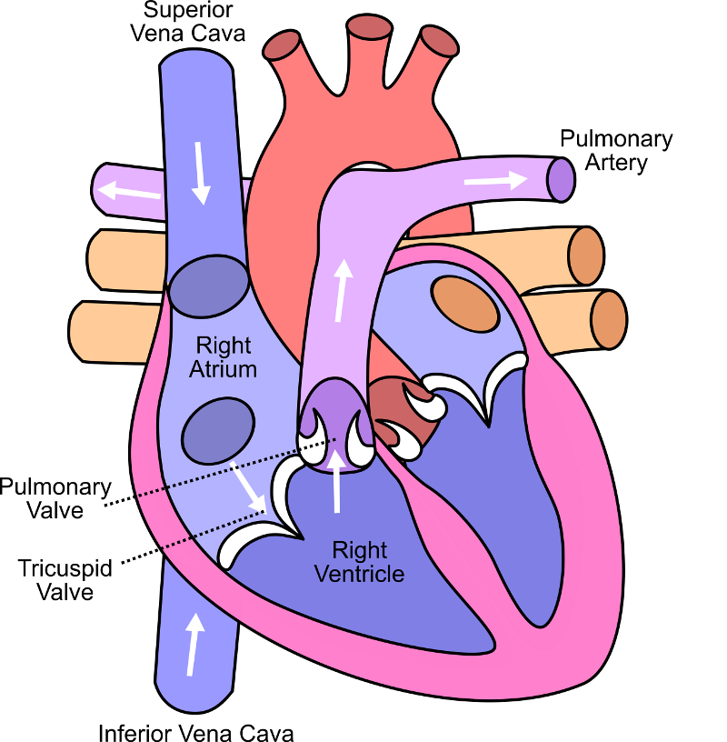

<!-- .slide: data-auto-animate-restart id="MEDI2101Wk4_1"-->
#### MEDI2101 Cardiovascular and Respiratory System.
# Block 2: Cardiovascular System
##### Assoc. Prof. Mark Butlin (PhD, BE, SFHEA) (he/him)

Macquarie Medical School, Faculty of Medicine, Health and Human Sciences Macquarie University. On the land of the Wallumattagal clan of the Dharug Nation.

&nbsp;

&nbsp;

&nbsp;

This material is provided to you as a Macquarie University student for your individual research and study purposes only. You cannot share this material without permission. Macquarie University is the copyright owner of (or has licence to use) the intellectual property in this material. Legal and/or disciplinary actions may be taken if this material is shared without the University’s written permission.

---
<!-- .slide: data-auto-animate-restart -->
#### MEDI2101 Cardiovascular and Respiratory System.
### Block 2: Cardiovascular System
# LO2.1: The heart - basics
(Week 4, Lecture 1)
##### Assoc. Prof. Mark Butlin (PhD, BE, SFHEA) (he/him)

Macquarie Medical School, Faculty of Medicine, Health and Human Sciences Macquarie University. On the land of the Wallumattagal clan of the Dharug Nation.

---
<!-- .slide: data-auto-animate-restart data-background="#111111" -->
<video data-autoplay data-src="images/heart_mayo_clinic.mp4"></video>

<a href="https://www.mayoclinic.org/diseases-conditions/heart-disease/multimedia/circulatory-system/vid-20084745">https://www.mayoclinic.org/diseases-conditions/heart-disease/multimedia/circulatory-system/vid-20084745</a>

--
<h3>MEDI2101 Cardiovascular and Respiratory System</h3>
<h4>To do in Week 4</h4>

<a href="https://ilearn.mq.edu.au/course/view.php?id=64513#section-9"> MEDI2101 iLearn Week 4</a>

--
<h3>MEDI2101 Cardiovascular and Respiratory System</h3>
<h4>Overview of marks</h4>

<a href="https://ilearn.mq.edu.au/course/view.php?id=64513#section-2">Assessment Task 1 marks overview</a>

---
<!-- .slide: data-auto-animate-restart -->
## LO2.1.1 Relate the gross anatomy of the heart to the function of the heart.

--
<!-- .slide: data-background-image="images/heart-960_720.jpg" data-auto-animate -->

<h3 style="color:white">Function and gross anatomy of the heart</h3>
<h4></h4> 

Functions of the heart:

<ul>
  <li> pump blood</li>
  <ol>
    <li class="fragment"> receive deoxygenated blood from the organs of the body</li>
    <li class="fragment"> pump this blood to the lungs</li>
    <li class="fragment"> receive oxygenated blood from the lungs</li>
    <li class="fragment"> pump this blood to all the organs of the body</li>
  </ol>
  <li class="fragment"> love?</li>
</ul>

--
<!-- .slide: data-background-image="images/vertigo.jpg" data-auto-animate -->

<aside class="notes">Free climber, Alex Honnold, on the 914m El Capitan, Yosemite National Park, 2017. <a href="https://en.wikipedia.org/wiki/Alex_Honnold">https://en.wikipedia.org/wiki/Alex_Honnold
</a></aside>

--
<!-- .slide:  data-auto-animate -->
### Function of the heart
####

  

  
  

  

  
"It has been shown by reason and experiment that the blood by the beat of the ventricles flows through the lungs and heart and is pumped to the whole body. There it passes through pores in the flesh into the veins through which it returns from the periphery everywhere to the center, from the smaller veins into the larger ones, finally coming to the vena cava and right auricle. <b>This occurs in such an amount, with such an outflow through the arteries, and such a reflux through the veins, that it cannot be supplied by the food consumed. It is also much more than is needed for nutrition. It must therefore be concluded that the blood in the animal body moves around in a circle continuously</b>, and that <b>the action or function of the heart is to accomplish this by pumping. This is the only reason for the motion and beat of the heart.</b>"

  
William Harvey. "On the motion of the heart and blood in animals" (1628).

  

  

  

--
<!-- .slide: data-background-image="images/pump.jpg" data-background-size="cover" -->

--    
<!-- .slide:  data-auto-animate -->
### Function of the heart
####

  

  
  

  

  
The pathway of oxygenated (red) and deoxygenated (blue) blood through the systemic and pulmonary vascular systems.

  
The <b>L</b>eft side of the heart receives oxygenated blood from the <b>L</b>ungs.

  
The <b>R</b>ight side of the heart receives de-oxygenated blood from the <b>R</b>est of the body.

  

  

  
(Created for MEDI2101)

  

--
<!-- .slide:  data-auto-animate -->
### Function of the heart
####

$\begin{eqnarray}
\mathrm{approx.~number~of~beats~per~hour} &=& 60\mathrm{~bpm} \times 60\mathrm{~minutes}\\
                                                 &=& 3600\mathrm{~beats}\\
\mathrm{approx.~number~of~beats~per~day}   &=& 3600\mathrm{~beats} \times 24\mathrm{~hours}\\
                                                 &=& 86,400\mathrm{~beats}\\
\mathrm{approx.~number~of~beats~per~year}       &=& 86,400\mathrm{~beats} \times 365\mathrm{~days} \\
                                                 & \approx & 31,500,000\mathrm{~beats}\\
\mathrm{approx.~number~of~beats~per~lifetime}  & \approx & 2,600,000,000\mathrm{~for~men} \\
                                                & \approx & 2,700,000,000\mathrm{~for~women}\\
\end{eqnarray}$

      

&nbsp

For people in Australia born 2000–2002, life expectancy of 80.9 (male) and 85 (female) years (Australian Institute of Health and Welfare, <em>Deaths in Australia</em>, 2019).

--    
<!-- .slide:  data-auto-animate -->
### Function of the heart
####

  

  
  

  

  
  
Position of the heart in the chest with labelling of the aorta, pulmonary artery (PA), right ventricle (RV), left ventricle (LV) and left atrium (LA). Right atrium not visible from this aspect.

  

  

  
1950's American Frohse Anatomical Chart: Chest & Abdomen Viscera. AU$286.60 on Ebay (+$89.56 postage).

  

--
<!-- .slide:  data-auto-animate -->
### Function of the heart
#### The four chambers of the human heart

      
      
      
      
      
      

<aside class="notes">The four chambers of the human heart and the supplying and distributing veins and arteries.</aside>

--
<!-- .slide:  data-auto-animate data-background-image="images/p42_HeartValvesAndStrings_highres.png" data-background-opacity="0.66" -->

A coloured SEM through the heart valves showing:

<ul>
  <li> mitral valve (center)</li>
  <li> aortic valve (upper center)</li>
  <li> left ventricle (bottom)</li>
  <li> aorta (top right)</li>
  <li> thread-like chordae tendineae and the papillary muscles (thick bands at the lower right and left)</li>
  <li> trabeculae carnae (columnar structures on the innner wall of the ventricle)</li>
</ul>

&nbsp

USUMU NISHINAGA/SCIENCE PHOTO LIBRARY

--
<!-- .slide:  data-auto-animate data-background-image="images/colouring_heart.jpg" data-background-opacity="0.66" data-background-size="contain" -->

&nbsp

Revision: colour it in! (If you want to.)

--
<!-- .slide:  data-auto-animate data-background-image="images/CoronaryArteriesOfTheHeart_p3.jpg" data-background-opacity="0.66" data-background-size="contain" data-background-position="right"-->
### Function of the heart
#### External anatomy, coronary arteries

The coronary arteries that supply the heart muscle with oxygenated blood.

Science Photo Library.

--
<!-- .slide:  data-auto-animate -->
### Function of the heart
#### External anatomy, the pericardium

---
<!-- .slide: data-auto-animate-restart -->
## LO2.1.2 Identify that there are three types of myocardial cells: (1) contractile, (2) auto-rhythmic, and (3) conductive.

--    
<!-- .slide:  data-auto-animate -->
### Myocardial cells
#### Contractile myocardial cells

  

    

    
    

  

  

  
Contractile myocardial cells make up most of the heart and are the component we refer to when we talk about "heart muscle".

  <ul >
    <li class="fragment" data-fragment-index="2"> Form a complex network joined by intercalated disks consisting of:</li>
      <ul  class="fragment" data-fragment-index="2">
        <li> desmosomes: strong physical connection between cells</li>
        <li> gap junctions: electrical connection of one cell to the next</li>
      </ul>
  </ul>

  

  

  

--    
<!-- .slide:  data-auto-animate -->
### Myocardial cells
#### Contractile myocardial cells

  

    

    
    
    

  

  

  
Contractile myocardial cells make up most of the heart and are the component we refer to when we talk about "heart muscle".

  <ul >
    <li class="fragment" data-fragment-index="2"> Form a complex network joined by intercalated disks consisting of:</li>
      <ul  class="fragment" data-fragment-index="2">
        <li> desmosomes: strong physical connection between cells</li>
        <li> gap junctions: electrical connection of one cell to the next</li>
      </ul>
    <li class="fragment" data-fragment-index="3"> Striated muscle, but much smaller fibres than skeletal muscle.</li>
  </ul>
  

  

  

--
<!-- .slide:  data-auto-animate data-background-image="images/p13_CapillariesOfTheHeart.jpg"-->

<h3 style="color:white">Mitochondria occupies about 1/3rd of the fibre - a high energy demand.</h3>
<h3 class="fragment" style="color:white">Cardiac myocytes consume 70-80% of the blood oxygen delivered - about twice that of most other cells in the body.

DENNIS KUNKEL MICROSCOPY/SCIENCE PHOTO LIBRARY

--
<!-- .slide:  data-auto-animate -->
### Myocardial cells
#### Myocardial autorhythmic cells (pacemaker or excitatory cells)

<ul>
  <li> provide the initial signal for commencement of myocardial contraction</li>
  <li> do not have organised sarcomeres, and therefore contribute very little to heart contraction/relaxation.</li>
  <li> smaller with fewer contractile fibres than myocardial <em>contractile</em> cells</li>
  <li> do not contribute to the measured electrocardiogram (ECG)</li>
</ul>

--
<!-- .slide:  data-auto-animate -->
### Myocardial cells
#### Conductive myocardial cells
<ul>
  <li> provide a pathway for conduction of action potentials through the heart</li>
  <li> do not have organised sarcomeres, and therefore contribute very little to heart contraction/relaxation.</li>
  <li> smaller with fewer contractile fibres than myocardial <em>contractile</em> cells</li>
  <li> do not contribute to the measured electrocardiogram (ECG)</li>
</ul>

---
<!-- .slide: data-auto-animate-restart -->
## LO2.1.3 Compare and contrast action potentials of myocardial auto-rhythmic and contractile cells (and recognise that these differ from action potentials in nerves and other types of muscle).

--
<!-- .slide:  data-auto-animate -->
### Action potentials
#### Membrane potential

  

  
  

  

  
The cell membrane by allowing some ions to travel across but not others creates a potential difference between the inside and outside of the cell.

  

  

  

  

--
<!-- .slide:  data-auto-animate -->
### Action potentials
#### Membrane potential

  

  
  

  

  
The potential difference across a cell membrane is the same principle as a simple battery, where a potential difference between two materials (or solutions) exists.

  

  

  

  

--
<!-- .slide:  data-auto-animate -->
### Action potentials
#### Membrane potential

<h5>The Nernst equation</h5>

\begin{equation}
E\_{x}=\dfrac{RT}{z\_{x}F}ln\dfrac{[X]\_{o}}{[X]\_{i}}
\end{equation}

- $E_x$ Nernst potential for ion X (membrane potentials, inside with respect to outside)
- $[X]_o$ concentration of X outside the cell
- $[X]_i$ concentration of X inside the cell
- $z_x$ valence of ion X
- $R$ Universal gas constant
- $T$ absolute temperature
- $F$ Faraday constant

--
<!-- .slide:  data-auto-animate -->
### Action potentials
#### Membrane potential

For Na+ ions with a concentration of 144 mm/L outside of the cell and 7 mm/L inside the cell:

\begin{eqnarray}
E\_{x}   & = & \dfrac{RT}{z\_{x}F}ln\dfrac{[X]\_{o}}{[X]\_{i}}\\\\
E\_{Na+} & = & \dfrac{8.314 \times 310}{+1 \times 96485} \times  ln \dfrac{144}{7}\\\\
         & = & 0.081\~V
\end{eqnarray}

-   $R$ Universal gas constant = 8.314 J$\cdot$K-1$\cdot$mol-1
-   $T$ absolute temperature, body = 37oC = 310 K
-   $F$ Faraday constant = 96485 C$\cdot$mol-1

--
<!-- .slide:  data-auto-animate -->
### Action potentials
#### Cardiac cell ionic concentrations

Approximate resting ionic concentrations of a cardiomyocyte.

<table>
  <tr>
    <th> Ion </th>
    <th> Intracellular concentration (mm/L) </th>
    <th> Extracellular concentration (mm/L)</th>
    <th> Equilibrium potential (mV) </th>
  </tr><tr>
      <td>Na+</td>
      <td> 7             </td>
      <td> 144           </td>
      <td> +81         </td>
  </tr><tr>
      <td> K+</td>
      <td> 151           </td>
      <td> 4             </td>
      <td> -97         </td>
  </tr><tr>
      <td>Cl-</td>
      <td> 4             </td>
      <td> 114           </td>
      <td> -90         </td>
  </tr><tr>
      <td></td>
      <td>               </td>
      <td> Sum:          </td>
      <td> -106        </td>
  </tr>
</table>

&nbsp

Source: Little RC. Physiology of the heart and circulation, Year Book Medical Publishers, Chicago, 1977.

--
<!-- .slide:  data-auto-animate -->
### Action potentials
#### Spontaneous depolarisation. Movement of ions during the action potential.

Created for MEDI2101

--
<!-- .slide:  data-auto-animate -->
### Action potentials
#### Spontaneous depolarisation. Movement of ions during the action potential.

  

  
  

  

  
Cardiac myocytes have a vastly different action potential to nerve cells. In typical nerve cells, the action potential duration is about 1 ms

  
Skeletal muscle cell action potential duration is around 2 to 5 ms. Cardiac muscle cell action potential duration is around 200 to 400 ms.

  

  

  
R.E. Klabunde, <em>Cardiovascular Physiology Concepts</em>. <a href="https://cvphysiology.com/Arrhythmias/A010">https://cvphysiology.com/Arrhythmias/A010</a>

  

--
<!-- .slide:  data-auto-animate -->
### Action potentials
#### Spontaneous depolarisation. Movement of ions during the action potential.

  

  
  

  

  
Duration of action potential (the plateau) is largely due to the influx of calcium, which is unique to cardiac muscle cells.

  
Skeletal muscle cells has a similar rapid influx sodium but not the same calcium influx.

  

  

  
Guyton and Hall, <em>Textbook of Medical Physiology</em>.

  

--
<!-- .slide:  data-auto-animate -->
### Action potentials
#### Myocardial excitation-contraction coupling

Action potential enters from adjacent cell, then...

<ol>
  <li> Ca2+ enters cell through voltage-gated Ca2+ channels.</li>
  <li> Ca2+ induces Ca2+ release from the sarcoplasmic reticulum (storage) through ryanodine receptor channels (the calcium "spark").</li>
  <li> Ca2+ ions bind to troponin on actin filaments, initiating contraction.</li>
  <li> Ca2+ unbinds from troponin, initiating relaxation.</li>
  <li> Ca2+ pumped back into the sarcoplasmic reticulum (storage).</li>
  <li> Ca2+ exchanged with Na+.</li>
  <li> Na+ gradient maintained by the Na+-K+-ATPase balance.</li>
</ol>

--
<!-- .slide:  data-auto-animate -->
### Action potentials
#### Myocardial excitation-contraction coupling

ATP: adenosine triphospate. ADP: adenosine diphosphate. Pi: phosphate. See Kreb's cycle.

