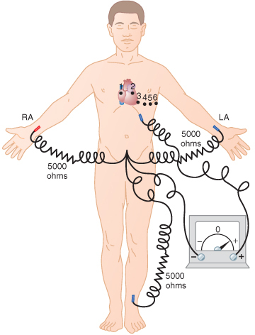

<!-- .slide: id="MEDI2101Wk4_2" -->
#### MEDI2101 Cardiovascular and Respiratory System.
### Block 2: Cardiovascular System
# LO2.1: Electrical and mechanical events of the heart
(Week 4, Lecture 2)
##### Dr Mark Butlin (PhD, BE, SFHEA) (he/him)

Macquarie Medical School, Faculty of Medicine, Health and Human Sciences Macquarie University. On the land of the Wallumattagal clan of the Dharug Nation.

---
## LO2.1.4 Describe the conduction of electrical signals through the heart.

--
<!-- .slide:  data-auto-animate -->
### Conduction of electrical signals
#### 

  

    
  

  

    
Conduction pathway of the heart.

    <ul>
      <li> sinoatrial (SA) node</li>
      <li> atrioventricular (AV) node</li>
      <li> bundle of His</li>
      <li> left bundle branch</li>
      <li> right bundle branch</li>
      <li> Purkinje fibres</li>
    </ul>
  

  

    

  

--
<!-- .slide:  data-auto-animate -->
### Conduction of electrical signals
#### Approximate action potential conduction velocities in various tissues
<table>
  <tr>
    <th> tissue </th>
    <th> conduction velocity (m/s)</th>
  </tr><tr>
    <td> large nerve fibres        </td>
    <td> 80 to 120</td>
  </tr><tr>
    <td> skeletal muscle fibres    </td>
    <td> 40</td>
  </tr><tr>
    <td> Purkinje fibres           </td>
    <td> 4  </td>
  </tr><tr>
    <td> ventricular muscle fibres </td>
    <td> 0.5</td>
  </tr><tr>
    <td> atrial muscle fibres      </td>
    <td> 0.3</td>
  </tr>
</table>

Conduction through cardiomyocytes is extremely slow compared to other tissues.

The specialised conduction pathways of the heart (e.g. Purkinje fibres) have a faster conduction velocity, but still slower than most other tissues.

--
<!-- .slide:  data-auto-animate -->
### Conduction of electrical signals
####

  

    
  

  

    
Different parts of the heart depolarise at different times. This diagram illustrates prepotentials as might be recorded from pacemaker cells in the:

    <ul>
      <li> <b>A</b> sinoatrial node</li>
      <li> <b>B</b> artrioventricular node</li>
      <li> <b>C</b> bundle of His</li>
      <li> <b>D</b> Purkinje fibers.</li>
    </ul>
  
The threshold for myocardial depolarisation is indicated as -70 mV.  Each prepotential is shown to start from a common point at the end of the ventricular repolarisation.

  

  

    

  

--
<!-- .slide:  data-auto-animate -->
### Conduction of electrical signals
####

  

    
  

  

    
All excitable tissue has a <b>refractory period</b> (cannot be re-stimulated during/immediately following an action potential).

    
The extended action potential of cardiac myocytes extends the refractory period, reducing the likelihood of a second contraction within a typical cardiac cycle.

  

  

    
Guyton and Hall, <em>Textbook of Medical Physiology</em>.

  

--
<!-- .slide: data-auto-animate data-background="#111111" -->
<video data-autoplay data-src="images/ConductionPathwayoftheHeart.mp4"></video>

<a href="http://www.handwrittentutorials.com">www.handwrittentutorials.com</a>

---
## LO2.1.5 Identify the waves, segments and intervals of an electrocardiogram (ECG) and relate these electrical events to the mechanical events of the cardiac cycle.

--
<!-- .slide:  data-auto-animate -->
### Electrocardiogram and related mechanical events
####

The sum of potential differences across the heart can be represented as a moving dipole.

<!-- \animategraphics[autoplay,loop,scale=0.6]{1}{images/ECGDipole}{1}{4} -->
<!-- \animategraphics[autoplay,loop,scale=0.6]{4}{images/ECGDipole}{1}{4} -->

--
<!-- .slide:  data-auto-animate -->
### Electrocardiogram and related mechanical events
#### Einthoven's triangle -- measuring heart electrical activity

  

    
  

  

    
We can record that moving dipole by placing electrodes <em>anywhere</em> around the heart.

    
A standardised way is to use a three electrode arrangement known as Einthoven's triangle.

  

  

    

  

--
<!-- .slide:  data-auto-animate -->
### Electrocardiogram and related mechanical events
#### Einthoven's triangle -- measuring heart electrical activity

  

    
  

  

    
Projection of the moving dipole onto Einthoven's triangle, and schematic of the resultant signal generated by the sampling of that moving dipole.

  

  

    

  

--
<!-- .slide:  data-auto-animate -->
### Electrocardiogram and related mechanical events
#### Einthoven's triangle -- measuring heart electrical activity

  

    
  

  

    
Projection of the moving dipole onto Lead II of Einthoven's triangle

  

  

    
<a href="https://www.medicine.mcgill.ca/physio/vlab/cardio/ECGbasics.htm">https://www.medicine.mcgill.ca/physio/vlab/cardio/ECGbasics.htm</a>

  

--
<!-- .slide: data-auto-animate data-background-image="images/Willem_Einthoven_ECG.jpg" data-background-size="contain" -->

--
<!-- .slide: data-auto-animate data-background="#111111" -->
<video data-autoplay data-src="images/ECG_BusinessCard.mp4"></video>

<a href="https://www.youtube.com/watch?v=lcakOUh1XOs">https://www.youtube.com/watch?v=lcakOUh1XOs</a>

--
### Electrocardiogram and related mechanical events
#### 

--
<!-- .slide: data-auto-animate data-background="#111111" -->

Why PQRST and not ABCDE?

The four deflections prior to the correction formula were labelled ABCD and the 5 derived deflections were labelled PQRST. The choice of P is a mathematical convention dating from Descartes (as used also by Du Bois-Reymond in his galvanometer's `disturbance curve' 50 years previously) by using letters from the second half of the alphabet. N has other meanings in mathematics and O is used for the origin of the Cartesian coordinates. P is simply the next letter.

In fact Einthoven used O, P, Q, R, S, T, U, V, W, X to mark the timeline on his diagrams.

&nbsp

<a href="https://ecglibrary.com/ecghist.html">https://ecglibrary.com/ecghist.html</a>

--
<!-- .slide: data-auto-animate data-background-image="images/cardiac_animation.gif" data-background-size="contain" -->

Reddit user "Skywalkthis" <a href="https://www.reddit.com/r/educationalgifs/comments/br0lk3/cardiac_cycle_and_the_ecg_explained/">https://www.reddit.com/r/educationalgifs/comments/br0lk3/cardiac_cycle_and_the_ecg_explained/</a>

  
--
<!-- .slide:  data-auto-animate -->
### Electrocardiogram and related mechanical events
#### Wiggers' diagram

  

    
  

  

    
This is a graphical animation of the Wiggers' diagram.

    
Here we relate the ECG activity to the phases of the cardiac cycle.

    
Note that the ECG (caused by the polarisation/depolarisation of the cardiomyocytes) slightly precedes the mechanical events as there is a slight lag between cellular depolarisation and cellular contraction.

    
See this week's on-line module in iLearn, which is all about Wiggers and his diagram.

  

  

    
Reddit user "Skywalkthis" <a href="https://www.reddit.com/r/educationalgifs/comments/br0lk3/cardiac_cycle_and_the_ecg_explained/">https&#x3A;//www.reddit.com/r/educationalgifs/comments/br0lk3/cardiac_cycle_and_the_ecg_explained/</a>

  

--
<!-- .slide:  data-auto-animate -->
### Electrocardiogram and related mechanical events
#### The 12 lead ECG - bipolar limb leads

  

    
  

  

    
The bipolar limb leads are the direct connection of two of the three physical leads of Einthoven's triangle.

  

  

    

  

--
<!-- .slide:  data-auto-animate -->
### Electrocardiogram and related mechanical events
#### The 12 lead ECG - augmented unipolar limb leads

  

    
  

  

    
The augmented unipolar limb leads have the same configuration as the bipolar limb leads, but two of the limbs are connected to the negative terminal, and the other limb to the positive terminal.

    <ul>
      <li> <b>aVR</b> positive terminal on the right arm</li>
      <li> <b>aVL</b> positive terminal on the left arm</li>
      <li> <b>avF</b> positive terminal on the left leg</li>
    </ul>
  

  

    

  

--
<!-- .slide:  data-auto-animate -->
### Electrocardiogram and related mechanical events
#### The 12 lead ECG - chest (precordial) leads

  

    
  

  

    
The 6 chest (precordial) leads have:

    <ul>
       <li>  Negative electrode connected jointly to the LA, RA and LL.</li>
       <li>  Positive electrode connected to a single chest electrode (6 different positions for 6 different leads).</li>
    </ul>
    
  

  

    

  

--
<!-- .slide:  data-auto-animate -->
### Electrocardiogram and related mechanical events
#### The 12 lead ECG

  

    

    
    
    

  

  

    <ul>
    <li> Bipolar leads:</li>
    <ul>
     <li> [1] Lead I</li>
     <li> [2] Lead II</li>
     <li> [3] Lead III</li>
    </ul>
    <li>Augmented leads:</li>
    <ul>
     <li> [4] aVR</li>
     <li> [5] aVL</li>
     <li> [6] aVF</li>
    </ul>
    <li class="fragment"  data-fragment-index="1"> Chest leads:</li>
    <ul>
     <li class="fragment" data-fragment-index="1"> [7 through 12] V1 to V6</li>
    </ul>
    </ul>
    
The addition of the precordical leads to the bipolar and unipolar leads (now 12 leads in total) gives a more 3 dimensional "picture" of the heart.

  

  

    

  

--
<!-- .slide: data-auto-animate data-background="#111111" -->
<video data-autoplay data-src="images/ECG1-ECGFirstPrinciples.mp4"></video>

<a href="https://www.handwrittentutorials.com">www.handwrittentutorials.com</a>

--
<!-- .slide: data-auto-animate data-background-image="images/ECGreal.png" data-background-size="contain" -->

&nbsp

A traditional paper copy of a 12 lead ECG examination.

--
<!-- .slide:  data-auto-animate -->
### Electrocardiogram and related mechanical events
#### The 12 lead ECG

  

    
  

  

    
The various intervals of the ECG. The length of these intervals gives information on whether there are normal conduction pathways in the heart, or some pathology.

    
(The exact length of "normal" ECG intervals, and the diagnosis of heart conditions from the ECG will be touched on in the block on the cardiovascular and respiratory system in disease.)

  

  

    
<a href="https://ecgwaves.com/ecg-topic/ecg-normal-p-wave-qrs-complex-st-segment-t-wave-j-point/">https://ecgwaves.com/ecg-topic/ecg-normal-p-wave-qrs-complex-st-segment-t-wave-j-point/</a>

  

--
<!-- .slide:  data-auto-animate -->
### Electrocardiogram and related mechanical events
#### The 12 lead ECG

  

    
  

  

    <h3>Wait! What? A "U" wave?<h3>
    <h3>What is the U wave?</h3>
    

      
Usually not present.
      
Thought to indicate some kind of pathology.

      
Cause? Theories include:

      <ul>
            <li>  repolarisation of the Purkinje fibres (unlikely given small volume of Purkinje fibres)</li>
            <li>  late depolarisation or repolarisation of sections of the left ventricle, especially in left ventricular hypertrophy</li>
      </ul>
    

  

  

    
<a href="https://ecgwaves.com/ecg-topic/ecg-normal-p-wave-qrs-complex-st-segment-t-wave-j-point/">https://ecgwaves.com/ecg-topic/ecg-normal-p-wave-qrs-complex-st-segment-t-wave-j-point/</a>

  

--
<!-- .slide: data-auto-animate data-background="#111111" -->
<video data-autoplay data-src="images/ECG2-PQRST.mp4"></video>

<a href="https://www.handwrittentutorials.com">www.handwrittentutorials.com</a>

--
### Electrocardiogram and related mechanical events
#### Diagnosis

The ECG leads can be used to help diagnose different conditions.

<ul>
     <li>  change in the position of the heart</li>
     <li>  hypertrophy of the left or right ventricle</li>
     <li>  bundle branch block</li>
     <li>  Purkinje fibre blocks</li>
     <li>  ischaemic injury to the cardiac muscle</li>
     <li> ...and many other conditions.</li>
</ul>

More details to be provided in Cardiovascular and Respiratory System in Disease block.

--
<!-- .slide: data-auto-animate data-background-image="images/ECG_example.png" data-background-size="contain" data-visibility="hidden"-->

Normal

sinus

rhythm

--
<!-- .slide: data-auto-animate data-background-image="images/ECG_example_isolated_ventricular_ectopics.png" data-background-size="contain" data-visibility="hidden"-->

Isolated

ventricular

ectopics

--
<!-- .slide: data-auto-animate data-background-image="images/Myocardial_infaction_ECG.png" data-background-size="contain" data-visibility="hidden"-->

Myocardial infarction

--
<!-- .slide: data-auto-animate data-background="#111111" data-visibility="hidden" -->

Extension information (not part of MEDI2101 assessable material). For those that are interested in more information about the use of the ECG in diagnoses of heart conditions, this video gives a succinct summary. <a href="https://www.youtube.com/watch?v=XCmtP7597PI">www.handwrittentutorials.com</a>

<video data-autoplay data-src="images/ECG3-SegmentsIntervalsDiseases.mp4"></video>

---
## LO2.1.6 Define the following key terms and explain the relationship between them: (i) stroke volume, (ii) cardiac output, and (iii) heart rate.

--
<!-- .slide:  data-auto-animate -->
### Quantifying the output of the heart
#### The diastolic and systolic phases of the heart

--
<!-- .slide: data-auto-animate data-background-image="images/LV_volume.jpg" data-background-size="contain" -->

Angiogram with contrast in the left ventricle at end diastole and end systole.

&nbsp

&nbsp

&nbsp

&nbsp

&nbsp

&nbsp

&nbsp

&nbsp

&nbsp

 Can be used to estimate stroke volume of the left ventricle. (An estimate only, as the angiogram provides a 2D representation (area). Volume requires 3D quantification.

--
<!-- .slide:  data-auto-animate -->
### Quantifying the output of the heart
#### Pressure-volume loop

Created for MEDI2101

--
<!-- .slide:  data-auto-animate -->
### Quantifying the output of the heart
#### 

\begin{equation}
  \mathrm{Stroke\~Volume}=\mathrm{end\~diastolic\~volume}-\mathrm{end\~systolic\~volume}
\end{equation}

the <b>volume</b> of blood ejected by the left ventricle into the aorta (or right ventricle into the pulmonary artery) in a <b>single beat of the heart</b>. Usually expressed in ml.

--
<!-- .slide:  data-auto-animate -->
### Quantifying the output of the heart
####

\begin{equation}
  \mathrm{Stroke\~Volume}=\mathrm{end\~diastolic\~volume}-\mathrm{end\~systolic\~volume}
\end{equation}

the <b>volume</b> of blood ejected by the left ventricle into the aorta (or right ventricle into the pulmonary artery) in a <b>single beat of the heart</b>. Usually expressed in ml.

$\begin{align}
      \mathrm{cardiac\~output} &= \mathrm{stroke\~volume}\times\mathrm{heart\~rate}\\\\
      \mathrm{CO} &= \mathrm{SV} \times \mathrm{HR}
\end{align}$

the <b>rate</b> of blood being ejected by the left ventricle into the aorta (or right ventricle into the pulmonary artery). Usually expressed in l/min.

--
<!-- .slide:  data-auto-animate -->
### Quantifying the output of the heart
####
$\begin{align}
\mathrm{CO} &= \mathrm{SV} \times \mathrm{HR}
\end{align}$

How do we measure heart rate?

<ul class="fragment">
  <li>  palpation of the arterial pulse</li>
  <li>  ECG (RR interval)</li>
  <li>  photoplethysmography (e.g. finger blood volume)</li>
  <li>  non-contact photoplethysmography (more of a research device at this stage)</li>
</ul>

--
<!-- .slide:  data-auto-animate -->
### Quantifying the output of the heart
####
$\begin{align}
\mathrm{CO} &= \mathrm{SV} \times \mathrm{HR}
\end{align}$

How do we measure stroke volume?

<ul class="fragment">
  <li>  <b>estimate</b> by x-ray catheter placed radio-opaque dye (invasive).</li>
  <li>  <b>estimate</b> by body impedance measurements (non-invasive).</li>
  <li>  <b>measure</b>* by transesophageal Doppler (non-invasive**).</li>
  <li>  <b>measure</b> by placing a flow probe around the ascending aorta or pulmonary artery (highly invasive).</li>
</ul>

*Accurate Doppler ultrasound requires measurement of the angle of insonation and knowledge of the arterial cross sectional area - not easy things to measure. So transesophageal Doppler is more accurate than some methods, but still not highly accurate.

**As the Doppler probe is in the oesophagus and does not cross any membranes / skin, it is technically non-invasive.

<aside class="notes">## LO2.1.7 Define the following key terms and explain the relationships between them: after-load, pre-load, arterial resistance, contractility, ejection fraction, end diastolic volume. ### Left ventricular dynamics</aside>

---
## LO2.1.7 Be familiar with the Wiggers' Diagram relating left heart pressures and volumes with heart sounds and the electrocardiogram.

See this week's on-line module in iLearn.

--
<!-- .slide:  data-auto-animate -->
### Wiggers' diagram
#### Connects electrical activity, heart sounds, left ventricular volume, and left ventricular/atrial and aortic blood pressure.

---
## LO2.1.8 Name and identify the major anatomy of the thoracic wall, viscera, and the internal and external anatomy of the heart.

See anatomy material in iLearn and attend this week's anatomy class.

