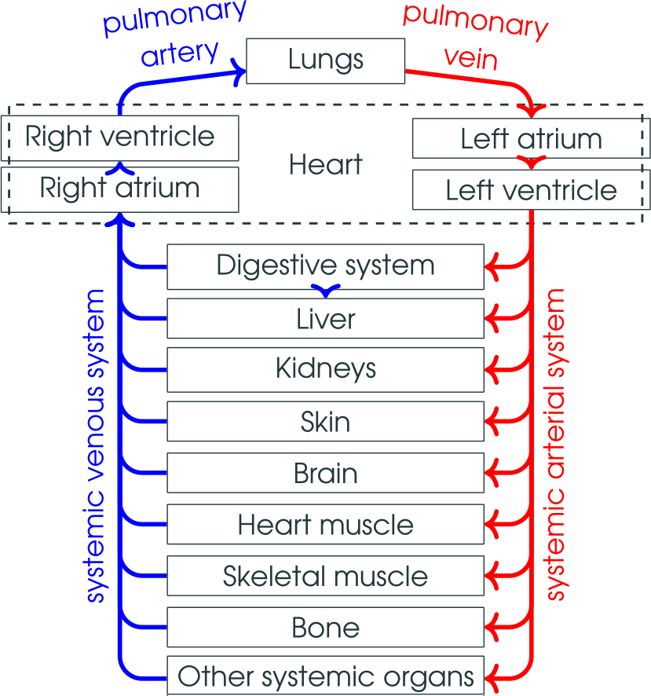
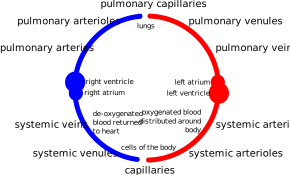

<!-- .slide: data-auto-animate-restart id="MEDI2101Wk5_1"-->
#### MEDI2101 Cardiovascular and Respiratory System.
### Block 2: Cardiovascular System
# LO2.2: The circulatory system
(Week 5, Lecture 1)
##### Dr Mark Butlin (PhD, BE, SFHEA) (he/him)

Macquarie Medical School, Faculty of Medicine, Health and Human Sciences Macquarie University. On the land of the Wallumattagal clan of the Dharug Nation.

&nbsp;

&nbsp;

&nbsp;

This material is provided to you as a Macquarie University student for your individual research and study purposes only. You cannot share this material without permission. Macquarie University is the copyright owner of (or has licence to use) the intellectual property in this material. Legal and/or disciplinary actions may be taken if this material is shared without the University’s written permission.

--

<!-- .slide: data-auto-animate data-background="#111111" -->
<video data-autoplay data-src="images/CirculatorySystemAnimatedSong.mp4"></video>

Source: <a href="https://www.youtube.com/watch?v=U2WG4gRt1yE">www.youtube.com/watch?v=U2WG4gRt1yE</a>

--
### MEDI2101 Cardiovascular and Respiratory System
#### To do in Week 5

<a href="https://ilearn.mq.edu.au/course/view.php?id=64513#section-10">MEDI2101 iLearn Week 5</a>

--
### MEDI2101 Cardiovascular and Respiratory System
#### Assesssment Task 2: Anatomy test

<a href="https://ilearn.mq.edu.au/course/view.php?id=64513#section-12">Assessment Task 2 description in iLearn</a>

--
### History of the "discovery" of circulation
#### "Discovery" of the circulation: 1628. William Harvey.

  

  
  

  

  
"the blood in the animal body moves around in a circle continuously"

  
William Harvey. "On the motion of the heart and blood in animals" (1628).

  

  

  

--
<!-- .slide: data-auto-animate data-background-image="images/SpainMammothHeart.jpg" data-background-size="contain" data-background-position="right" -->
### History of the "discovery" of circulation
#### 10,000 BC. El Pindel cave. Spain.

<aside class="notes">Painting in El Pindal cave, Spain, circa 10,000 BC showing the location of the heart in a mammoth.</aside>

--
### History of the "discovery" of circulation
#### 2650 BC. The emperor of China, Hwang-Ti.

**In his medical book, Nei ching:**

"
  all blood is under the control of the heart. The blood flows in a continuous circle and never stops."

--
### History of the "discovery" of circulation
#### 1552 BC. Ancient Egyptians.

**Smith papyrus**

"Counting the pulse"

--
### History of the "discovery" of circulation
#### 1552 BC. Ancient Egyptians.

**Ebers papyrus**

"From the heart arise the vessels which go to the whole body ... if the physician lay his finger on the head, on the neck, on the hand, on the epigastrium, on the arm or the leg, everywhere the motion of the heart touches him, coursing through the vessels to all the members ... When the heart is diseased its work is imperfectly performed; the vessels proceeding from the heart become inactive, so that you cannot feel them ... If the heart trembles, has little power and sinks, the disease is advancing."

--
### History of the "discovery" of circulation
#### 260--375 BC. Hippocrates.

"TThe vessels spread themselves over the body filling it with spirit, juice, and motion are all of them but branches of an original vessel. I protest I know now where it begins or where it ends, for in a circle there is neither a beginning nor an end."

--
<!-- .slide: data-auto-animate data-background-image="images/GalenDiagram.jpg" data-background-size="contain" data-background-position="right" -->
### History of the "discovery" of circulation
#### The influence of unscientific process and of Christianity 100--200 AD. Galen.

<aside class="notes">Galen's proposal on the movement of blood.</aside>

--
### History of the "discovery" of circulation
#### (Re)"discovery" of the circulation: 1628. William Harvey.

  

  
  

  

  
"It has been shown by reason and experiment that the blood by the beat of the ventricles flows through the lungs and heart and is pumped to the whole body. There it passes through pores in the flesh into the veins through which it returns from the periphery everywhere to the center, from the smaller veins into the larger ones, finally coming to the vena cava and right auricle. <b>This occurs in such an amount, with such an outflow through the arteries, and such a reflux through the veins, that it cannot be supplied by the food consumed. It is also much more than is needed for nutrition. It must therefore be concluded that the blood in the animal body moves around in a circle continuously</b>, and that the action or function of the heart is to accomplish this by pumping. This is the only reason for the motion and beat of the heart."

  
William Harvey. "On the motion of the heart and blood in animals" (1628).

  

  

  

--
### History of the "discovery" of circulation
#### (Re)"discovery" of the circulation: 1628. William Harvey.

Images source: William Harvey. "On the motion of the heart and blood in animals" (1628).

<aside class="notes">Practical experiment demonstrating that blood in the veins travels back toward the heart.</aside>

---
<!-- .slide: data-auto-animate-restart -->
## LO2.2.1 Recognise the transport functions of the cardiovascular system (giving examples of the transport of materials: (i) entering, (ii) moving within, and (iii) leaving the body).

--
### The transport functions of the cardiovascular system
####

The main functions of the circulatory system are:

- **transportation**
  -  brings oxygen to body cells and takes away carbon dioxide and metabolic waste products
  -  carries nutrients from the gastrointestinal tract to body cells
  -  carries hormones from endocrine glands to body cells
  -  carries immune cells, antibodies (in blood) to sites where
    needed

- **regulation**
  -  helps regulate the pH of body fluid
  -  helps regulate body temperature
  -  regulates water content of cells

---
<!-- .slide: data-auto-animate-restart -->
## LO2.2.2 Recall the organisation of the cardiovascular system, including: (i) the central location of the heart, (ii) major blood vessels, (iii) pulmonary and systemic divisions of the circulation, and (iv) key portal systems.

--
### The organisation of the cardiovascular system
####

  

  
  

  

  
The pathway of oxygenated (red) and deoxygenated (blue) blood through the systemic and pulmonary vascular systems.

  
The <b>L</b>eft side of the heart receives oxygenated blood from the <b>L</b>ungs.

  
The <b>R</b>ight side of the heart receives de-oxygenated blood from the <b>R</b>est of the body.

  

  

  

Image: M.Butlin. Created for MEDI2101.

--
<!-- .slide: data-auto-animate data-background-image="images/Circulatory_System_Systemic.png" data-background-size="contain" data-background-position="right" -->
### The organisation of the cardiovascular system
#### Systemic circulation

The <em>systemic</em> circulation

showing the major systemic arteries (red) and the major systemic veins (blue).

&nbsp;

Image source: Wikipedia (creative commons license).

--
<!-- .slide: data-auto-animate data-background-image="images/Circulatory_System_Pulmonary.png" data-background-size="contain" data-background-position="right" -->
### The organisation of the cardiovascular system
#### Pulmonary circulation

The <em>pulmonary</em> circulation.

Note that the pulmonary arteries (blue) carry de-oxygenated blood away from the heart toward the lungs.  The pulmonary veins (red) carry oxygenated blood from the lungs to the heart.

In both the systemic and pulmonary circulation, <b>A</b>rteries carry blood <b>A</b>way from the heart.

&nbsp;

Image source: Wikipedia (creative commons license).

--
### The organisation of the cardiovascular system
#### Circulation

  

    
  

  

    
There are five broad types of blood vessels. In order of travelling away from the heart:

    <ul> 
      <li> arteries
      <li> arterioles
      <li> capillaries
      <li> venules
      <li> veins
    <ul>
    
These exist in this order in both the pulmonary and systemic circulation.

  

  

  

Image: M.Butlin. Created for MEDI2101.

--
### The organisation of the cardiovascular system
#### The exception to the rule: Portal systems

**A portal system** is where a capillary bed drains through veins *into another capillary system*.

This is a limited occurrence in the human body:

- **hepatic portal system** takes blood from sections of the gastrointestinal capillary network and drains into capillaries of the liver.
- **hypophyseal portal system** at the base of the brain between the hypothalamus and anterior pituitary gland, transporting hormones.

--
### The organisation of the cardiovascular system
#### The exception to the rule: Portal systems

  

    
  

  

    
Blood circulates from the heart, through arteries, through a capillary network, and into veins and then back to the heart.

    
Portal systems are a rare exceptions to this, where one capillary network drains through a vein to another capillary network.
 
    
The diagram on the left shows the hepatic portal system, with the hepatic portal vein draining blood from the gastrointestinal tract to the liver.

  

  

  

Image source: <a href="http://cnx.org/content/col11496/1.6/">Anatomy & Physiology, Connexions.</a>

---
<!-- .slide: data-auto-animate-restart -->
## LO2.2.3 Compare and contrast the structure, mechanical properties and functions of the five major types of blood vessels: (1) arteries, (2) arterioles, (3) capillaries, (4) venules, and (5) veins.

--
### The five major types of blood vessels
####

  

    
  

  

    
There are five broad types of blood vessels. In order of travelling away from the heart:

    <ol> 
      <li> arteries
      <li> arterioles
      <li> capillaries
      <li> venules
      <li> veins
    <ol>
    
These exist in this order in both the pulmonary and systemic circulation.

  

  

  

Image: M.Butlin. Created for MEDI2101

--
### The five major types of blood vessels
#### Layers within the larger blood vessels

--
<!-- .slide: data-auto-animate data-background-image="images/p16_Artery.jpg" -->

&nbsp;

&nbsp;

&nbsp;

&nbsp;

&nbsp;

&nbsp;

Image source: MICROSCOPY CORE FACILITY, VIB GENT/SCIENCE PHOTO LIBRARY

--
### The five major types of blood vessels
#### Layers within the larger blood vessels
- **Intima** Lining of epithelial cells forming the endothelium.
- **Media** Contains load bearing components: elastin; collagen (collagen is 10-50 times stiffer than elastin); and smooth muscle cells. Collagen and elastic fibers allow vessels to stretch to prevent over expansion due to the pressure that is exerted on the walls.
- **Adventitia** Strong outer covering of arteries and veins. Connective tissue and some collagen and elastin.

--
### The five major types of blood vessels
#### Classification of blood vessels by structure and function

<table>
  <tr>
    <th> structure    </th>
    <th> diameter (mm)   </th>
    <th> wall thickness (h) (mm)   </th>
    <th> length  (cm)   </th>
    <th> h/radius </th>
    <th>  function</th>
  </tr><tr>
    <td>Aorta        </td>
    <td> 25    </td>
    <td> 2    </td>
    <td> 40    </td>
    <td> 0.16 </td>
    <td>  conduit</td>
  </tr><tr>
    <td> Medium arteries    </td>
    <td> 4    </td>
    <td> 0.8    </td>
    <td> 15    </td>
    <td> 0.40 </td>
    <td>  conduit, resistance</td>
  </tr><tr>
    <td> Arterioles    </td>
    <td> 0.3    </td>
    <td> 0.2    </td>
    <td> 0.2    </td>
    <td> 1.33 </td>
    <td>  resistance</td>
  </tr><tr>
    <td> Capillaries    </td>
    <td> 0.008    </td>
    <td> 0.001    </td>
    <td> 0.075    </td>
    <td> 0.25 </td>
    <td> exchange</td>
  </tr><tr>
    <td> Venules        </td>
    <td> 0.02    </td>
    <td> 0.002    </td>
    <td> 0.2    </td>
    <td> 0.20</td>
    <td>  conduit</td>
  </tr><tr>
    <td> Medium veins    </td>
    <td> 5    </td>
    <td> 0.5    </td>
    <td> 15    </td>
    <td> 0.20 </td>
    <td>  conduit</td>
  </tr><tr>
    <td> Large veins    </td>
    <td> 15    </td>
    <td> 0.8    </td>
    <td> 20    </td>
    <td> 0.11 </td>
    <td>  conduit</td>
  </tr><tr>
    <td> Vena cava    </td>
    <td> 30    </td>
    <td> 1.5    </td>
    <td> 40    </td>
    <td> 0.10 </td>
    <td>  conduit</td>
  </tr>
</table>

&nbsp;

Adapted from Handbook of Physiology, 1963.

<aside class="notes">Characteristic dimensions of human systemic blood vessels. The structure provides information on the function.</aside>

--
### The five major types of blood vessels
#### Classification of arteries by structure and function
- **Elastic or conducting arteries** largest diameters; pressure high and fluctuates
- **Muscular or medium arteries** smooth muscle allows vessels to regulate blood supply by constricting or dilating
- **Arterioles** transport blood from small arteries to capillaries

--
### The five major types of blood vessels
#### Classification of arteries by structure and function

Elastic artery (left) and muscular artery (right).

<aside class="notes">Histological example of a large artery, which comprises of much more elastin and much less smooth muscle than more distal arteries. Histological example of a resistance artery, demonstrating the much larger proportion of smooth muscle than in more proximal, elastic arteries.</aside>

--
### The five major types of blood vessels
#### Classification of veins by structure and function

- **Venules and small veins** tubes of endothelium on delicate basement membrane
- **Medium and large veins** valves allow blood to flow toward heart but not in opposite direction
    
--
### The five major types of blood vessels
#### Capacitance (or compliance)

The arteries and veins are elastic. This means that they are compliant.

Compliance ($C$) is the ability to accommodate a volume ($V$) under a pressure ($P$).

\begin{equation}
  C = \dfrac{\Delta V}{\Delta P}
\end{equation}

<b>Role of compliance in arteries:</b> Arterial compliance transforms the pulsatile output of the heart into a continuous blood flow by the time the blood reaches the capillaries.</b>

--
<!-- .slide: data-auto-animate  -->

<b>Ejection from the left ventricle is pulsatile.</b> This Doppler ultrasound image of flow from the left ventricular outflow tract shows the rhythmic period of blood flow into the aorta followed by a period of no blood flow into the aorta.

--
<!-- .slide: data-auto-animate  -->

Capillary flow (shown here as nasal capillaries in response to a smell) is non-pulsatile.

Chaigneau E et al. Two-photon imaging of capillary blood flow in olfactory bulb glomeruli. Proc Natl Acad Sci USA. 2003, 100:13081--6.

--
### The five major types of blood vessels
#### Capacitance (or compliance)

**Role of capacitance in veins**

Allows for a great change in the blood volume that resides in the venous system.

That is, at rest, there is a large blood volume in the veins.

During times of high oxygen demand this can be mobilised (due to signals received by the central nervous system that result in increased sympathetic outflow and contraction of smooth muscle in the veins).

--
### The five major types of blood vessels
#### Capacitance (or compliance)

  

    
  

  

    

  

  

  

Image: M.Butlin. Created for MEDI2101

<aside class="notes">When at rest, the majority of the blood at any one time resides in the systemic veins. The veins have a very high capacitance to accommodate this. Veins also have smooth muscle and can contract (due to signals received by the central nervous system that result in increased sympathetic outflow) in order to distribute some this blood volume into the pulmonary vasculature and systemic arteries in order to increase blood flow and oxygenation of blood.</aside>

--
### The five major types of blood vessels
#### The endothelium
<ul>
    <li>  Long thought of as an inert single layer of cells lining blood vessels that passively allowing the passage of water and other small molecules across the vessel wall.</li>
    <li>  Located at the interface between the blood and the vessel wall of all blood vessels.</li>
    <ul>
      <li>  The cells are in close contact and form a layer that prevents blood cell interaction with the vessel wall.</li>
    </ul>
    <li>  It plays a critical role in:</li>
    <ul>
        <li>  the mechanics of blood flow (releases vasoactive substances, e.g. nitric oxide, to increase vessel diameter)</li>
        <ul>
          <li> contraction and relaxation of vascular smooth muscle</li>
        </ul>
        <li>  the regulation of coagulation</li>
        <li>  leukocyte adhesion</li>
        <li>  vascular smooth muscle cell growth</li>
        <li>  forming a barrier to the transvascular diffusion of liquids and solutes.</li>
    </ul>
</ul>

--
### The five major types of blood vessels
#### Capillaries

  

    
  

  

    <ul>
      <li>  Smooth muscle in arterioles, metarterioles, precapillary sphincters regulates blood flow into capillary network</li>
      <li>  Blood flows from arterioles through metarterioles, then through capillary network</li>
      <li>  Venules drain the network</li>
    </ul>
  

  

  

Image: Schematic of the capillary network and the feeding arterioles and draining venules. Tortora and Grabowski, Principles of Anatomy and Physiology.

--
### The five major types of blood vessels
#### Capillaries

Capillaries are constructed of a single layer of squamous epithelial cells on a basement membrane.

The vessels are barely large enough for a red blood cell to pass through (4 to 9 micrometres diameter).

Capillary types classified by diameter and permeability:

<ul>
    <li> <b>Continuous</b> Do not have fenestrae</li>
    <li> <b>Fenestrated</b> Have pores</li>
    <li> <b>Sinusoidal</b> Large diameter with large fenestrae</li>
</ul>

Fenestrated and sinusoidal capillaries allow absorption and filtration of water and ions from blood to other body cells.

---
<!-- .slide: data-auto-animate-restart -->
### Student Experience Survey
#### Have your say

  

    <iframe width="560" height="315" src="https://www.youtube.com/embed/tHqQLwE7Wgg" title="YouTube video player" frameborder="0" allow="accelerometer; autoplay; clipboard-write; encrypted-media; gyroscope; picture-in-picture" allowfullscreen></iframe>
  

  

    <ul>
      <li><b>Check your email inbox</b> for the Student Experience Survey.</li>
      <li>Help shape the future of higher education in Australia.</li>
      <li><b>Complete for a chance to win $1000.</b></li>
      <li>Survey closes this Sunday (28th August).</li>
    </ul>
    
  

  

  

