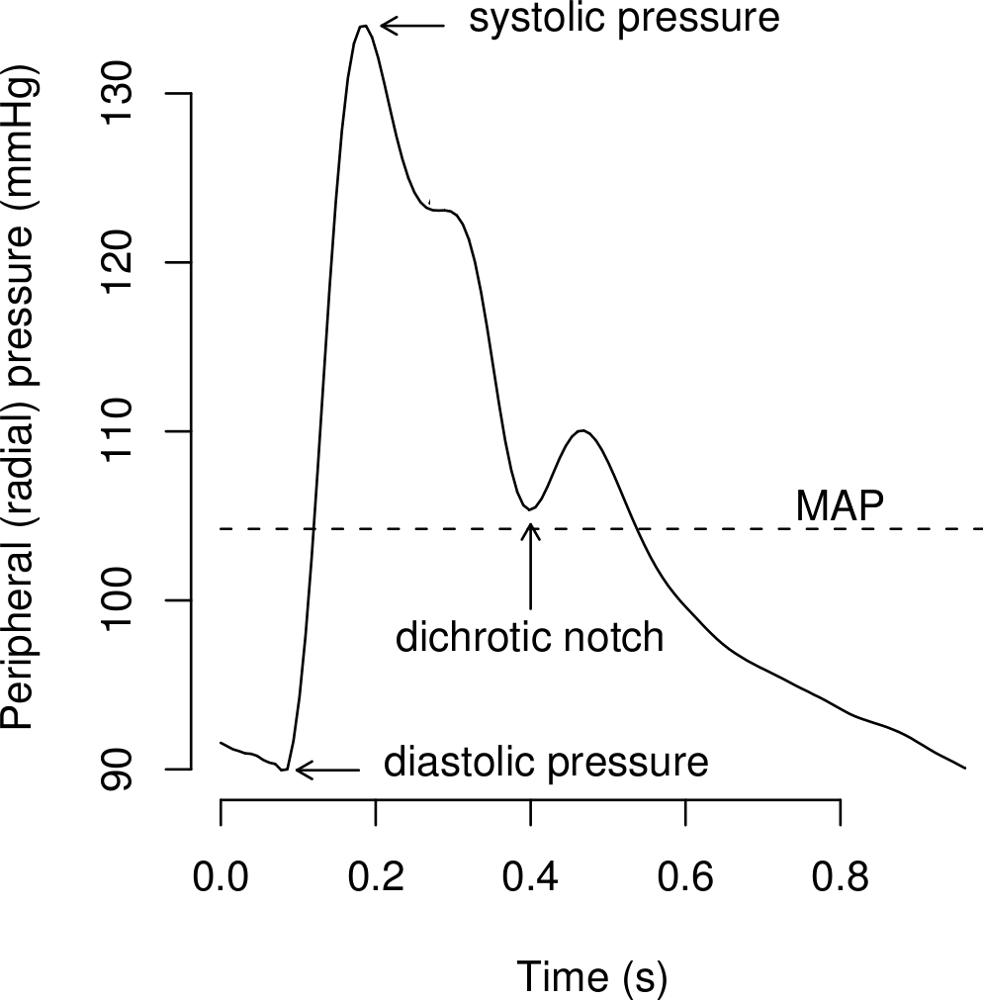

<!-- .slide: id="MEDI2101Wk5_2" -->
#### MEDI2101 Cardiovascular and Respiratory System.
### Block 2: Cardiovascular System
# LO2.2: Blood pressure and flow
(Week 5, Lecture 2)
##### Dr Mark Butlin (PhD, BE, SFHEA) (he/him)

Macquarie Medical School, Faculty of Medicine, Health and Human Sciences Macquarie University. On the land of the Wallumattagal clan of the Dharug Nation.

---
## LO2.2.4 Describe the pressure changes that occur during the cardiac cycle and relate these to blood flow through the heart and vessels.

--
<!-- .slide:  data-auto-animate -->
### Systemic arterial pressure over the cardiac cycle
####

--
<!-- .slide:  data-auto-animate -->
### Systemic arterial pressure over the cardiac cycle
####

  

    
  

  

    
The major waveform features of the blood pressure waveform in the aorta (left) and brachial or radial artery (right).

    
Note that the incisura in the aortic waveform (caused by the closing of the aortic valve) is co-incident in approximate timing with the dichrotic notch in the radial waveform, even though the dichrotic notch is <em>not</em> caused by the closing of the aortic valve.

  

  

    
Avolio AP, Butlin M, Walsh A. Arterial blood pressure measurement and pulse wave analysis–their role in enhancing cardiovascular assessment. 2010; 31 : R1–47.

  

--
<!-- .slide:  data-auto-animate -->
### Systemic arterial pressure over the cardiac cycle
#### 

$\begin{equation}
  \mathrm{pulse\~pressure\~(PP)} =  \mathrm{systolic\~pressure}-\mathrm{diastolic\~pressure}
\end{equation}$

$\begin{eqnarray}
  \mathrm{mean\~pressure\~(MAP)}   & = & \mathrm{area\~under\~the\~curve} \\\\
                    & \approx & \mathrm{diastolic\~pressure} + \dfrac{1}{3}\mathrm{pulse\~pressure}\\
\end{eqnarray}$

The mean arterial pressure (MAP) is the statistical mean of the wave (i.e. the average). We do not need to <em>estimate</em> MAP (using the "1/3rd rule") if we have the waveform - we can find the average to get the true mean.

--
<!-- .slide:  data-auto-animate -->
### Systemic arterial pressure over the cardiac cycle
#### Blood pressure throughout the systemic circulation

  

    
  

  

    
As we move away from the heart mean blood pressure falls.

    
It is the pressure difference that drives blood flow.
 
    
A sometimes unexpected (but always present) feature is that systolic pressure is higher in the brachial artery (large arteries) than in the aorta. This is due to wave reflection augmenting the waveform in the large arteries, but to a lesser extent at the aorta.

  

  

    

  

--
<!-- .slide:  data-auto-animate -->
### Systemic arterial pressure over the cardiac cycle
#### Blood pressure throughout the systemic circulation

---
## LO2.2.5 Explain the relationship of blood flow, pressure gradients and resistance and use Poiseuille's Law to explain the factors that influence resistance.

--
<!-- .slide:  data-auto-animate -->
### Blood flow, pressure gradients and resistance
####

  

    
  

  

    
Blood flows due to a pressure gradient. (We have already covered the concept of bulk flow in the respiratory component).

    
That is, a fluid (liquid or gas) will travel from a region of higher pressure to a region of lower pressure.

  

  

    
<a href="https://sites.psu.edu/musingsofameteorologist/2013/02/05/how-does-air-move/">https://sites.psu.edu/musingsofameteorologist/2013/02/05/how-does-air-move/</a>

  

--
<!-- .slide: data-auto-animate -->
### Blood flow, pressure gradients and resistance
####

\begin{equation}
  \mathrm{flow} = \dfrac{P_1 - P_2}{\mathrm{resistance}}
\end{equation}

For those that have done a little physics, you may recognise this from electrical work and Ohm's law:

\begin{equation}
  V  =  I\cdot R
\end{equation}

\begin{equation}
  \mathrm{or\~\~}I  =  \frac{V}{R}
\end{equation}

\begin{equation}
  \mathrm{flow} = \dfrac{\mathrm{potential\~difference\~or\~pressure\~difference}}{\mathrm{resistance}}
\end{equation}

--
<!-- .slide: data-auto-animate -->
### Blood flow, pressure gradients and resistance
####
Blood flow in arteries can often be analysed through electrical model current flow (electrical) and fluid flow (blood) are analogous in many aspects of physics.

<table>
  <tr>
    <th> electrical charge </th>
    <th> blood </th>
  </tr><tr>
    <td> voltage ($V$) </td>
    <td> blood pressure ($P$) </td>
  </tr><tr>
    <td> current ($I$) </td>
    <td> blood flow ($\dot{Q}$) </td>
  </tr><tr>
    <td> resistance ($R$) </td>
    <td> resistance ($R$) </td>
  </tr>
</table>

--
<!-- .slide: data-auto-animate -->
### Blood flow, pressure gradients and resistance
####
\begin{equation}
  \mathrm{flow} = \dfrac{P_1 - P_2}{\mathrm{resistance}}
\end{equation}

\begin{equation}
  \mathrm{resistance} \propto \dfrac{1}{\mathrm{vessel\~radius}^4}
\end{equation}

Therefore,

\begin{equation}
  \mathrm{flow} \propto \left(P_1 - P_2\right)\cdot \mathrm{vessel\~radius}^4
\end{equation}

<b>Example:</b>

If we halve the radius of a vessel, we increase resistance by $2^{4}=16$, resulting in $1/16^{th}$ of the flow.

--
<!-- .slide: data-auto-animate data-background-image="images/stainless_steel_drinking_straws.jpg" data-background-size="contain" -->

--
<!-- .slide: data-auto-animate -->
### Blood flow, pressure gradients and resistance
####

  

    

      
      
    

  

  

\begin{equation}
flow = \dfrac{P_1 - P_2}{resistance}
\end{equation}

Increased arterial blood pressure ($P_1$) increases blood flow through a larger difference of $P_1$ to $P_2$ (where $P_2$ is downstream pressure).

Increases vessel radius (e.g. sympathetic inhibition), decreases resistance, increasing flow.

  

  

    
Guyton and Hall Textbook of Medical Physiology.

  

<aside class="notes">Flow is proportional to the pressure difference. If we consider the venous system near atmospheric pressure (0 mmHg, though actually pressure in the venous system is a little higher than this), then the driving force for blood flow is the arterial pressure minus 0 mmHg. Sympathetic stimulation changes the resistances of vessels. Increased resistance decreases flow and decreased resistance increases flow. The pressure at which there is zero flow is called the critical closing pressure (this is more applicable in the intracrannial space - more on this later).</aside>

--
<!-- .slide: data-auto-animate -->

--
<!-- .slide: data-auto-animate -->
### Blood flow, pressure gradients and resistance
####

  

    
  

  

    
Flow is driven by a pressure difference between two regions.

    
Therefore, blood will flow from the aorta, to the arteries, to the arterioles, to the capillaries, to the venules, to the veins, then to the vena cava as pressure gets lower and lower as we travel through the systemic vasculature.

    
The arterioles have highly variable resistance, and therefore can regulate the pressure drop, and thus blood flow across this segment.

  

  

    
Medical Colouring in Book

  

---
## LO2.2.6 Define mean arterial pressure (MAP) and explain the relationship between MAP, cardiac output and total peripheral resistance.

--
<!-- .slide:  data-auto-animate -->
### MAP, CO and total peripheral resistance
####

We have so far talked about pressure, resistance and flow in general terms. If we lump the systemic circulation together, we can equate these terms (left column) to the systemic circulation as a whole (right column).

<table>
  <tr>
    <th> fluid dynamics in a tube </th>
    <th> systemic cardiovasculature </th>
  </tr><tr>
    <td> $P_1 - P_2$              </td>
    <td> mean arterial pressure $-$ venous pressure</td>
  </tr><tr>
    <td> resistance               </td>
    <td> total peripheral resistance (TPR) </td>
  </tr><tr>
    <td> flow                     </td>
    <td> cardiac output (CO)</td>
  </tr>
</table>

--
<!-- .slide:  data-auto-animate -->
### MAP, CO and TPR
#### (Mean arterial pressure, cardiac output and total peripheral resistance)

$\begin{align}
  \mathrm{flow} & =  \dfrac{P_1 - P_2}{\mathrm{resistance}}\\\\
  \mathrm{CO}   & =  \dfrac{\mathrm{MAP} - \mathrm{venous\~pressure}}{\mathrm{TPR}}\\\\
  \\mathrm{CO}  &\approx  \dfrac{\mathrm{MAP}}{\mathrm{TPR}}
\end{align}$

--
<!-- .slide:  data-auto-animate -->
### MAP, CO and TPR
#### (Mean arterial pressure, cardiac output and total peripheral resistance)

**What is total peripheral resistance?**

The combined resistance of all arteries, arterioles and capillaries in the systemic vasculature.

It can be modified by:
- combined regional changes in arteriolar resistance
- combined regional changes in regulation at the pre-capillary area

---
## LO2.2.7 Understand that there is local (regional) short-term and long-term autoregulation of blood flow and the mechanisms driving that regulation (oxygen, metabolic, and myogenic theories; angiogenesis and collateral circulation).

--
<!-- .slide:  data-auto-animate -->
### Local (regional) blood flow autoregulation
####

We will be talking next week about systemic regulation of blood pressure and blood flow.

However, different organs need different blood flow according to the activity and metabolic requirements.

Therefore, there must be **regional** as well as **systemic** regulation of blood flow.

--
<!-- .slide:  data-auto-animate -->
### Local (regional) blood flow autoregulation
####

Autoregulation describes the ability of local tissue to counter local blood flow changes due to systemic changes in blood pressure.

Autoregulation exists to some extent in all tissues, but is very strong in the brain (cerebral autoregulation) and in the coronary circulation.

--
<!-- .slide:  data-auto-animate -->
### Local (regional) blood flow autoregulation
####

  

    
  

  

    
Decreasing the oxygen carrying capacity of blood (decrease atmospheric pO2, pneumonia, carbon monoxide poisoning) causes an increase in <b>local</b> blood flow, often enough to compensate for the loss of oxygen.

  

  

    
Guyton and Hall Textbook of Medical Physiology.

  

--
<!-- .slide:  data-auto-animate data-background-image="images/Sprinter_at_starting_block.jpg"-->
### Local (regional) blood flow autoregulation
#### Example

During exercise, skeletal muscle can have as much as a 10 times greater oxygen demand and creates more carbon dioxide that needs to be removed, therefore requires greater blood flow. Vasodilation in the arteries supplying the skeletal muscle can in part facilitate this (along with increased cardiac output).

At the same time, the brain requires a constant supply of blood, regardless of changes in cardiac output. Local vascular regulation ensures that the blood flow to the brain is constant, in the face of changes in blood pressure and cardiac output.

The precise <em>mechanism</em> behind regional control of blood flow is unknown - but we have some theories...

--
<!-- .slide:  data-auto-animate -->
### Local (regional) blood flow autoregulation
#### Theories for local autoregulation mechanism

**Vasodilator theory of local response to low oxygen**

1. $\downarrow$ oxygen concentration in blood
1. $\uparrow$ vasodilator substance formation
1. $\uparrow$ diffusion of vasodilators to interstitial fluid
1. $\downarrow$ resistance at local precapillary sphincters and metarterioles.

**Vasodilators:** adenosine (through increased ATP degradation), adenosine phosphates, carbon dioxide, potassium ions, hydrogen ions (from lactic acid)

--
<!-- .slide:  data-auto-animate -->
### Local (regional) blood flow autoregulation
#### Theories for local autoregulation mechanism

**Oxygen (or nutrient) demand theory of local response to low oxygen**

Oxygen is required for smooth muscle contraction.

Therefore, absence of oxygen means smooth muscle cannot contract i.e. dilation and lower resistance.

--
<!-- .slide:  data-auto-animate -->
### Local (regional) blood flow autoregulation
#### Theories for local autoregulation mechanism

**Metabolic theory**

1. $\uparrow$ blood pressure
1. $\uparrow$ blood flow
1. $\downarrow$ decrease concentration of metabolites (due to greater volume passing through vessel bed)
1. $\downarrow$ vasodilation ($\uparrow$) vasoconstriction
1. $\downarrow$ blood flow

--
<!-- .slide:  data-auto-animate -->
### Local (regional) blood flow autoregulation
#### Theories for local autoregulation mechanism

**Myogenic theory**

Sudden stretch of the vessel wall causes smooth muscle to contract.

i.e. direct myogenic response of smooth muscle to stretch decreases vessel diameter and increases resistance.

**Mechanism:** stretch opens calcium channels and influx of calcium causes muscle contraction.

--
<!-- .slide: data-background="#111111" -->

So which theory is correct?

Most likely a combination of all four theories.

--
<!-- .slide:  data-auto-animate -->
### Local (regional) blood flow autoregulation
#### Hyperaemic response - Reactive hyperaemia

  

    
  

  

      
Reactive hyperaemia:

      <ul>
          <li> blood flow blocked to tissue.</li>
          <li> local metabolic demand during flow occlusion leads to vasodilatory metabolites, decreasing local resistance.</li>
          <li> when blood flow is restored, large compensatory blood flow due to vasodilated bed.</li>
          <li> additional effect of increased blood flow inducing increased shear on the endothelium, causing release of nitric oxide, causing further </li>arterial dilation.
      </ul>
  

  

    
Guyton and Hall Textbook of Medical Physiology.

  

--
<!-- .slide:  data-auto-animate -->
### Local (regional) blood flow autoregulation
#### Hyperaemic response - Reactive hyperaemia

  

    
  

  

    
Shear stress on the endothelial cell (i.e. blood flowing along the vessel wall) stimulates the l-arginine–nitric oxide (NO) pathway inducing smooth muscle relaxation.

    
l-arginine is oxidised via nitric oxide synthase (NOS) to form NO.

    
NO in the smooth muscle cell stimulates guanylate cyclase, which converts guanosine triphosphate (GTP) to cyclic guanosine monophosphate (cGMP), which in turn causes smooth muscle relaxation.

    <!-- 
NO is also involved in the inhibition of platelet aggregation and leukocyte adhesion.}% The conversion of l-arginine to NO is prevented by analogues of l-arginine, such as N G -monomethyl-l-arginine (l-NMMA) and N $\omega$-nitro-l-arginine methyl ester (l-NAME)
 -->
  

  

    
Butlin, M. Structural and functional effects on large artery stiffness: An in-vivo experimental investigation. PhD Thesis, UNSW, 2007.

  

--
<!-- .slide:  data-auto-animate -->
### Local (regional) blood flow autoregulation
#### Hyperaemic response - Active hyperaemia

  

    
  

  

    
Active hyperaemia:

    <ul>
      <li> increased metabolic demand due to increased tissue activity</li>
      <li> local metabolism leads to vasodilator substances being generated</li>
      <li> dilation of vessels, decreased resistance, and increased blood flow</li>
    </ul>
  

  

    
Guyton and Hall Textbook of Medical Physiology.

  

<!-- LO2.2.? Be familiar with the Korotkoff sounds and palpation of the pulse in order to estimate brachial arterial systolic and diastolic pressure.]{Measurement of blood pressure: Korotkoff sounds and palpation of the pulse}  Attend this week's practical activity. -->

---
## LO2.2.8 Recall the constituents of blood and their general function with detailed knowledge of red blood cells and haemoglobin.

See this week's on-line module in iLearn.

---

## LO2.2.9 Name and identify the anatomy of the major blood vessels.

See anatomy material in iLearn and attend this week's anatomy class.

