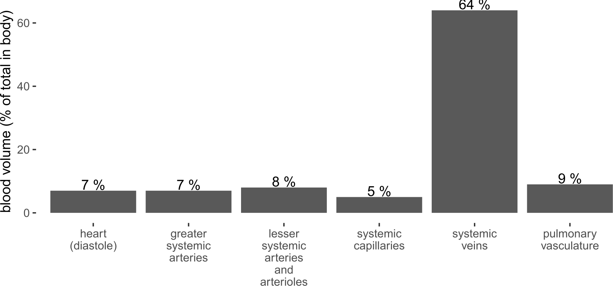
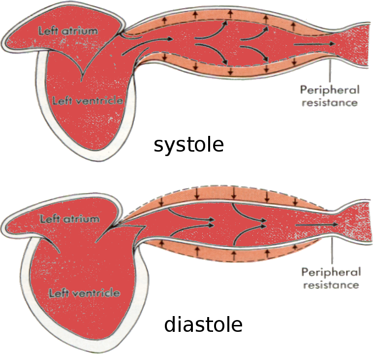

<!-- .slide: data-auto-animate-restart id="MEDI2101Wk6_1"-->
#### MEDI2101 Cardiovascular and Respiratory System.
### Block 2: Cardiovascular System
# LO2.3: Cardiovascular regulation.  Part 1.
(Week 6, Lecture 1)
##### Dr Mark Butlin (PhD, BE, SFHEA) (he/him)

Macquarie Medical School, Faculty of Medicine, Health and Human Sciences Macquarie University. On the land of the Wallumattagal clan of the Dharug Nation.

&nbsp;

&nbsp;

&nbsp;

This material is provided to you as a Macquarie University student for your individual research and study purposes only. You cannot share this material without permission. Macquarie University is the copyright owner of (or has licence to use) the intellectual property in this material. Legal and/or disciplinary actions may be taken if this material is shared without the University’s written permission.

--
### MEDI2101 Cardiovascular and Respiratory System
#### To do in Week 6

<a href="https://ilearn.mq.edu.au/course/view.php?id=64513#section-11"> MEDI2101 iLearn Week 6</a>

--
###  Assessment Task 3 Part A: Manuscript figure
####

<a href="https://ilearn.mq.edu.au/course/view.php?id=64513#section-14">Assessment description</a>

--
### Open (physical and virtual) door
####

<a href="https://ilearn.mq.edu.au/course/view.php?id=64513">MEDI2101 Q&A Forum</a>

<a href="https://ilearn.mq.edu.au/course/view.php?id=64513">MEDI2101 iLearn private message</a>

<a href="https://ilearn.mq.edu.au/course/view.php?id=64513">Discord</a>

<a href="https://ilearn.mq.edu.au/course/view.php?id=64513">See Dr Butlin's availability and book a time (face to face or video conference)</a>

---
<!-- .slide: data-auto-animate-restart -->
**Cardiovascular regulation:** a mechanism that alters blood flow (and pressure) to maintain optimal perfusion. 

Requires an <em>input</em> (measurement) and an <em>output</em> (action).

--
<!-- .slide: data-background="#111111" -->

Blood pressure cannot be controlled directly.

--

Blood pressure cannot be controlled directly.</h3>

Therefore, we either need to alter stroke volume ($SV$) or heart rate ($HR$) to alter cardiac output ($CO$), change total peripheral resistance ($TPR$), or increase or decrease blood volume.

$\begin{eqnarray}
\mathrm{MAP} & = & \mathrm{CO} \times \mathrm{TPR} \\\\
                & = & \mathrm{SV} \times \mathrm{HR} \times \mathrm{TPR}
\end{eqnarray}$

$\begin{equation}
\mathrm{MAP} \propto \mathrm{blood~volume}
\end{equation}$

All of the cardiovascular regulatory pathways must result in a change in one or more of these factors (SV, HR, TPR, and/or blood volume) if there is a change in arterial blood pressure.

---
<!-- .slide: data-auto-animate-restart -->
## LO2.3.1 Explain how venous return to the heart can be altered (respiratory pump; skeletal muscle pump; abdominal compression reflex; sympathetic stimulation of the systemic veins).

--
### Altered venous return to the heart
####

  

    
  

  

    
When thinking of venous return, it is usually referring to return of blood from the systemic vasculature via the inferior and superior vena cava to the right heart.

    
However, this same flow must logically also return to the left heart after travelling through the pulmonary circulation.

  

Image modified from BruceBlaus, <a href="https://commons.wikimedia.org/wiki/File:Vena_Cava-ar.png">https://commons.wikimedia.org/wiki/File:Vena_Cava-ar.png</a>

--
### Altered venous return to the heart
####

$\begin{align}
\mathrm{venous\~return} &= \dfrac{P_1 - P_2}{\mathrm{resistance}}\\\\
                &= \dfrac{\mathrm{venous\~pressure} - \mathrm{right\~atrial\~pressure}}{\mathrm{venous\~resistance}}
\end{align}$

Venous return can be increased through a number of mechanisms:

- respiratory pump
- skeletal muscle pump
- abdominal compression reflex
- sympathetic stimulation of the systemic veins

--
### Altered venous return to the heart
#### Respiratory pump (a.k.a. thoracic pump)

**inspiration**

- decreased intrathoracic pressure $\rightarrow$ decreased right atrial pressure
- increased abdominal pressure $\rightarrow$ increased inferior vena cava blood pressure
- increased (venous pressure $-$ right atrial pressure), therefore more blood flow to the heart

**expiration**

- increased intrathoracic pressure $\rightarrow$ increased pulmonary venous pressure
- increased blood flow to the left side of the heart

Therefore, an increase in respiration = increased venous return to the heart.

--
<!-- .slide: data-auto-animate data-background="#111111" -->
<video data-autoplay data-src="images/respiratorypump.mp4"></video>

Source: <a href="https://www.youtube.com/watch?v=RVYKlsoEEMU">www.youtube.com/watch?v=RVYKlsoEEMU</a>

--

--
### Altered venous return to the heart
#### Skeletal muscle pump

Mechanism of increased venous return during movement (especially <em>dynamic</em> (not isometric) exercise).

  

    
  

  

    
During skeletal muscle contraction (and shortening), the veins are compressed, increasing local pressure and increasing flow.

    
When the skeletal muscle relaxes and pressure drops, <b>retrograde flow of blood is prevented by the valves in the veins.</b>

  

  

    
<a href="http://cnx.org/content/col11496/1.6/">OpenStax College, Anatomy & Physiology, Connexions Web site.</a>

  

--
### Altered venous return to the heart
#### Abdominal compression reflex
Central nervous system output can cause skeletal muscle contraction, especially abdominal muscle.

This compresses venous reservoirs, increasing effective blood volume and venous return to the heart.

Evidence for this mechanism: if the majority of skeletal muscle is fundamentally inactive (e.g. people who are paralysed), hypotensive (systemic blood pressure drop) episodes are much more frequent*.

*Guyton and Hall Textbook of Medical Physiology, Chapter 18.

--
### Altered venous return to the heart
#### Sympathetic stimulation of systemic veins
The venous system is a large reservoir of blood volume. Vasoconstriction of the veins increases the effective blood volume in the arterial system and also increases return of blood to the heart.

  

    
  

  

    

  

Image created for MEDI2101.

--
### Altered venous return to the heart
#### Sympathetic stimulation of systemic veins

  

    
  

  

    

  

By shifting some of the blood volume from the venous to the arterial system it will increase pressure:

\begin{equation}
  \mathrm{systemic\~arterial\~pressure} \propto \mathrm{systemic\~arterial\~volume}
\end{equation}

Image created for MEDI2101.

<!--
Increasing arterial pressure will increase arterial blood flow:

\begin{equation}
  \mathrm{flow} = \dfrac{\mathrm{arterial\~pressure} - \mathrm{venous\~pressure}}{\mathrm{total\~peripheral\~resistance}}
\end{equation} -->

--
### Altered venous return to the heart
#### The effect of gravity, and hydrostatic pressure

The fluid (e.g. blood) in our body can move in response to gravity. This is especially true of blood under low pressure (i.e. venous blood). 

As the venous system is very compliant, a change in body position can alter the distribution of blood if there is change in the hydrostatic pressure (height of the column of fluid). 

When standing, there is a greater hydrostatic pressure (greater weight of the fluid) toward the feet than there is closer to the heart. This means that when we stand, the compliant venous system is more distended, and there is an increased blood volume in the lower extremities. This also impacts on venous return of blood to the heart, as the flow of blood must overcome the hydrostatic pressure within the column of fluid that is the veins.

---
<!-- .slide: data-auto-animate-restart -->
## LO2.3.2 Explain how venous return to the heart impacts cardiac output and blood volume (Frank-Starling law of the heart; the three atrial reflexes (Bainbridge reflex, volume reflex, cardiopulmonary baroreceptors))

--
### Altered venous return to the heart
#### Frank-Starling law of the heart

**Definition: Frank-Starling mechanism of the heart**

An increase in the return of blood from the venous system (venous return) causes a greater volume of blood in the ventricle at the end of diastole (end diastolic volume), in turn increasing the contraction force of the heart muscle fibers (cardiac contractility), and therefore the greater the stroke volume and cardiac output.

--
### Altered venous return to the heart
#### Frank-Starling law of the heart

  

    
  

  

    
At low diastolic volumes, a small change in end diastolic volume results in a larger change in stroke volume (and cardiac output) than the same change in diastolic volume at high diastolic volumes.

    
<b>How can the increase in stroke volume exceed the increase in end diastolic volume?</b>

  

  

    

  

--
### Altered venous return to the heart
#### Frank-Starling law of the heart
**What is cardiac contractility?** The strength of contraction of the myocardial fibres.

The greater the contraction, the lower the end systolic volume, and the greater the stroke volume (therefore, greater cardiac output).

(A) end diastolic volume and (B) end systolic volume.

Increased cardiac contractility decreases end systolic volume, therefore increasing stroke volume.

\begin{equation}
\mathrm{stroke\~volume} = \mathrm{end\~diastolic\~volume} - \mathrm{end\~systolic\~volume}
\end{equation}

--
### Altered venous return to the heart
#### Atrial reflex: The Bainbridge Reflex alters heart rate and cardiac contractility

- Response to increase venous pressure (transmitted to the right atrium, distending the atrium)
- Activates the venoatrial stretch receptors.
- Transmits along the vagus nerve to the central nervous system, feeding back to the heart through the sympathetic and parasympathetic system.
- An <em>increase</em> in atrial pressure causes an <em>increase</em> in cardiac contractility and an <em>increase</em> in heart rate.

The Bainbridge reflex can cause about a 40 to 60% increase in heart rate in response to increased atrial pressure.

An additional 15% increase in heart rate in response to increased atrial pressure can be due to direct stretching of the sinus node, increasing the pacemaker rate.

--
### Altered venous return to the heart
#### Atrial reflex: The Volume Reflex altering blood volume

Stretch of the atria feeds through to the:

  

1.  kidney afferent arterioles instigating dilation.

<ul>
  <li> $\downarrow$ kidney afferent arteriolar resistance </li>
  <li> $\uparrow$ glomerular capillary pressure</li>
  <li> $\uparrow$ filtration of fluids in kidney tubules</li>
  <li> $\downarrow$ blood volume</li>
</ul>
  

  

    
    
2.  hypothalamus decreasing antidiuretic hormone.

    <ul>
      <li> $\downarrow$ antidiuretic hormone</li>
      <li> $\downarrow$ reabsorption of water from tubules</li>
      <li> $\downarrow$ blood volume</li>
    </ul>
    
  

Both mechanisms increase fluid loss (via the kidneys), decreasing blood volume and therefore blood pressure.

--
### Altered venous return to the heart
#### Atrial natriuetic peptide

Not grouped under the Volume Reflex, but also is a heart mechanism of controlling blood volume:

- Released by cells in the atria of the heart in response to distension of the atria (stretching of the atrial myocytes).
- Promotes the loss of salt and water though the kidneys, reducing blood volume.

Also causes vasodilation (decrease in total peripheral resistance).

--
### Altered venous return to the heart
#### Atrial and pulmonary artery stretch receptors (cardiopulmonary baroreceptors)

The atria and pulmonary artery contain stretch receptors. 

As pressure increases within an artery (or atrium), the vessel (or atrium) will stretch. 

Therefore, these stretch receptors are called baroreceptors (baro = pressure, as in barometric). 

The stretch receptors in the atrium and pulmonary artery are known specifically as <em>cardiopulmonary baroreceptors</em>*.

These receptors have a **negative feedback** to the central nervous system in response to vessel wall stretch as a result of increase/decrease in blood pressure.

&nbsp;

* This is distinct from what is termed, simply, "the baroreceptors" located in the aorta and carotid artery.

--
### Altered venous return to the heart
#### Summary

Increased venous return to the heart can potentially:

  

    
<b>Positive feedback (increases arterial blood pressure)</b>

    <ul>
      <li> increase stroke volume directly (increased end diastolic volume can increase stroke volume).</li>
      <li> increase stroke volume through Frank-Starling mechanism (increased contractility, decreasing end systolic volume).</li>
      <li> increase heart rate and stroke volume through the Bainbridge reflex (activation of venoatrial stretch receptors).</li>
    </ul>
  

  

    
<b>Negative feedback (decreases arterial blood pressure)</b>

    <ul>
      <li> decrease blood volume through the atrial volume reflex.</li>
      <li> decrease blood volume through atrial natriuetic peptide release.</li>
      <li> decrease stroke volume and heart rate through activiation of the cardiopulmonary baroreceptors.</li>
    </ul>
  

  

    

  

--
### Altered venous return to the heart
#### Summary

Decreased venous return to the heart can potentially:

  

    
<b>Positive feedback (decreases arterial blood pressure)</b>

    <ul>
      <li> decrease stroke volume directly (decreased end diastolic volume can decrease stroke volume).</li>
      <li> decrease stroke volume through Frank-Starling mechanism (decreased contractility, increasing end systolic volume).</li>
      <li> decrease heart rate and stroke volume through the Bainbridge reflex (less activation of venoatrial stretch receptors).</li>
    </ul>
  

  

    
<b>Negative feedback (increases arterial blood pressure)</b>

    <ul>
      <li> increase blood volume through the reduced atrial volume reflex.</li>
      <li> increase blood volume through reduced atrial natriuetic peptide release.</li>
      <li> increase stroke volume and heart rate through less activation of the cardiopulmonary baroreceptors.</li>
    </ul>
  

  

    

  

---
<!-- .slide: data-auto-animate-restart -->
## LO2.3.3 Describe the differential sympathetic and parasympathetic innervation of the heart and systemic vasculature, including a description of the vasomotor centre of the brain.

--
### Sympathetic and parasympathetic innervation
####

  

    
  

  

    
Centers  that regulate the cardiovascular system are spread across the brain

    
A large concentration of neurons controlling breathing and the cardiovascular system are centred in the lower brain, namely the medulla (5) and spinal cord (6).

  

Image: By John A Beal, PhD, Dep't. of Cellular Biology \& Anatomy, Louisiana State University Health Sciences Center – Shreveport [Creactive Commons BY 2.5], via Wikimedia Commons

--
### Sympathetic and parasympathetic innervation
#### Vasomotor centre of the brain*

  

    
  

  

    
* The vasomotor centre is <em>not</em> the motor cortex that controls skeletal muscle movement. However, the motor cortex does communicate with the vasomotor centre, which is a pathway employed in exercise.

  

Image: Guyton and Hall Textbook of Medical Physiology

--
### Sympathetic and parasympathetic innervation
#### Vasomotor centre of the brain*

  

    
  

  

<b>Inputs and processing</b>

<ul>
<li> <b>vasoconstrictor area</b> anterolateral portions of the upper medulla</li>
<li> <b>vasodilator area</b> anterolateral portions of the lower half of the medulla</li>
<li> <b>sensory area</b> nucleus tractus solitarius in the posterolateral portions of the medulla and lower pons, <em>receives peripheral signals from the vagus and glossopharyngeal nerves</em>.</li>
</ul>
  

Image: Guyton and Hall Textbook of Medical Physiology

--
<!-- .slide: data-auto-animate   -->
### Sympathetic and parasympathetic innervation
#### Vasomotor centre of the brain

  

    
  

  

<b>Outputs from the vasomotor complex</b>

<ul>
<li> <b>sympathetic nerve fibres</b> extend from the lateral vasomotor centre.</li>
<li> <b>parasympathetic nerve fibres</b> extend from the medial vasomotor centre.</li>
</ul>

Therefore, the vasomotor centre has influence over heart rate and cardiac contractility, altering cardiac output. Sympathetic system also innervates blood vessels.)

The vasomotor centre <em>processes inputs</em> to invoke these functional responses. <b>It does not invoke these responses without an input.</b>

Image: Guyton and Hall Textbook of Medical Physiology

--
### Sympathetic and parasympathetic innervation
#### Sympathetic and parasympathetic nervous input to the heart

  

    
  

  

<ul>
  <li> Sympathetic stimulation:</li>
    <ul>
      <li> $\uparrow$ from resting 60-70 bpm heart rate (HR) to as high as 180 or even 250 bpm.</li>
      <li> increases cardiac contractility up to 200% and therefore increase stroke volume</li>
    </ul>
    <li> Sympathetic inhibition:</li>
    <ul>
      <li> smaller decrease in HR from resting level</li>
      <li> combined with decrease in cardiac contractility, can decrease cardiac output (CO) by about 30% from normal.</li>
    </ul>
</ul>
<ul class="fragment">
      <li> Strong parasympathetic (vagal) stimulation:</li>
            <ul>
             <li> can stop the heartbeat for a few seconds</li>
             <li> can reduce heart rate to 20 to 40 bpm</li>
             <li> can reduce cardiac contractility by up to 20-30%. Smaller than effect of sympathetic stimulation as vagal stimulation is mainly at the atria and less so in the ventricles.</li>
            </ul>
     </ul>
  

Image: Guyton and Hall Textbook of Medical Physiology

     
--
### Sympathetic and parasympathetic innervation
#### Sympathetic and parasympathetic nervous input to the heart

  

    
  

  

\begin{equation}
  CO=HR\times SV
\end{equation}
  

Image: Guyton and Hall Textbook of Medical Physiology

--
### Sympathetic and parasympathetic innervation
#### Sympathetic and parasympathetic nervous input to peripheral arteries

Besides acting directly on the heart rate and cardiac contractility, the central nervous system (sympathetic and parasympathetic outputs) innervate the resistance (muscular) arteries of the body, changing their diameter and therefore their resistance.

\begin{equation}
  R = \dfrac{8\mu L}{\pi r^4}
\end{equation}

where:
- $\mu$ fluid viscosity
- $L$ length of tube
- $r$ radius of the tube

--
### Sympathetic and parasympathetic innervation
#### Sympathetic and parasympathetic nervous input to peripheral arteries

  

    
  

  

    
<b>Thinking of the systemic vasculature in a "lumped" way:</b>

    
The <em>Windkessel</em> model of the systemic vasculature.

    
Summing all of the peripheral resistance provides the impact on pressure within the <em>Windkessel</em> (large arteries).

  

  

    

  

--
### Sympathetic and parasympathetic innervation
#### Sympathetic and parasympathetic nervous input to peripheral arteries

  

    
  

  

<ul>
     <li> <b>pump</b> Pump<li>
     <ul><li>(left ventricle)</li></ul>
     <li> <b>C</b> Capacitance</li>
     <ul><li>(Elastic arteries)</li></ul>
     <li> <b>R</b> Resistance</li>
     <ul><li>(Muscular arteries, total peripheral resistance)</li></ul>
     <li> <b>~</b> Valve</li>
     <ul><li>(Aortic valve)</li></ul>
</ul>

&nbsp;

<ul>
<li> <b>CO</b> pump flow</li>
<ul><li>(cardiac output)</li></ul>
<li> <b>MAP</b> mean pressure in <em>Windkessel</em></li>
<ul></li> (mean pressure in large, elastic arteries)</li></ul>
</ul>

  

  

    

  

--

\begin{equation}
MAP\uparrow~=CO\times TPR\uparrow
\end{equation}

<ul>
     <li> <b>MAP</b> mean arterial pressure</li>
     <li> <b>CO</b> cardiac output</li>
     <li> <b>TPR</b> total peripheral resistance</li>
</ul>

--
### Sympathetic and parasympathetic innervation
#### Sympathetic and parasympathetic nervous input to peripheral arteries

  

    
  

  

  
Sympathetic innervation causing vasoconstriction in smooth muscle of:

  <ul>
    <li> small arteries</li>
    <li> arterioles</li>
    <li> veins</li>
  </ul>
  
In some tissues (e.g. mesentary), also constriction of:

  <ul>
    <li> metarterioles</li>
    <li> precapillary sphincters</li>
  </ul>
  
Effect on large arteries...? The effect on large arteries is still not quantified. The theory is, as the large arteries are more elastic and contain much less smooth muscle, they do not play much of a role in blood flow regulation through changes in resistance.</li>
  

  

    
Guyton and Hall Textbook of Medical Physiology

  

--
### Sympathetic and parasympathetic innervation
#### Rate of response

The central nervous system very rapidly alters blood pressure

- Arterial pressure can be doubled in just a few seconds
- Arterial pressure can be halved in 10 to 40 seconds

&nbsp;

How are such rapid changes in blood pressure made?
      

--
### Sympathetic and parasympathetic innervation
#### Rate of response

A rapid rise in blood pressure is invoked by:

<ul>
<li> constriction of most arterioles in the systemic vasculature, increasing peripheral resistance.</li>
<li> constriction of the veins, increasing blood volume delivered to the heart, causing greater stretch of the heart and greater ejection of blood (Frank-Starling mechanism).</li>
<li> direct stimulation of the heart increasing heart rate and heart muscle fibre contractility.</li>
</ul>

&nbsp;

Why are such rapid changes in blood pressure required?

--
### Sympathetic and parasympathetic innervation
#### Overview of sympathetic and parasympathetic drivers of blood pressure

&nbsp;

Image: Sherwood L. Human Physiology: From Cells to Systems. 4th Ed

--
### Sympathetic and parasympathetic innervation
#### Physiological example: Vasovagal syncope

<ul>
<li> Large vagal cardioinhibitory response to emotional stress (e.g. bad news, sight of blood), physical stress, and sometimes in response to blood flow changes during urination, bowel movement, coughing or swallowing (Valsalva maneuver effect).</li>
<li> Vagal output reduces heart rate. Simultaneously, there is a vasodilatory response in the arteries.</li>
<li> The drop in cardiac output and peripheral resistance lowers drives a dramatic reduction in blood pressure and therefore reduced blood flow to peripheral organs.</li>
<li> Less blood flow to the brain causes fainting.</li>
</ul>

--
<!-- .slide: data-auto-animate-->
### Sympathetic and parasympathetic innervation
#### Physiological example: Vasovagal syncope

<!--  -->

Data/image source: Macquarie University Blood Pressure and Vascular Function Laboratory
