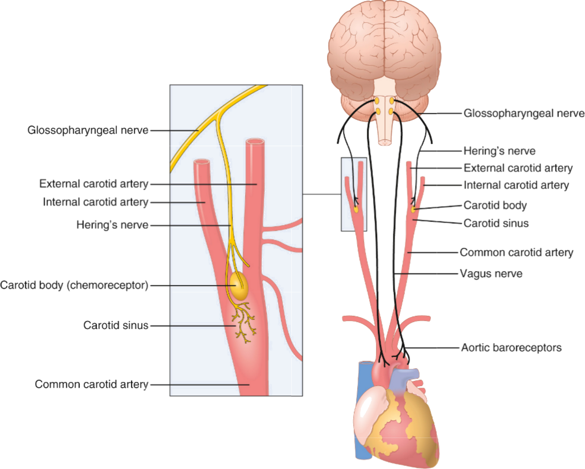
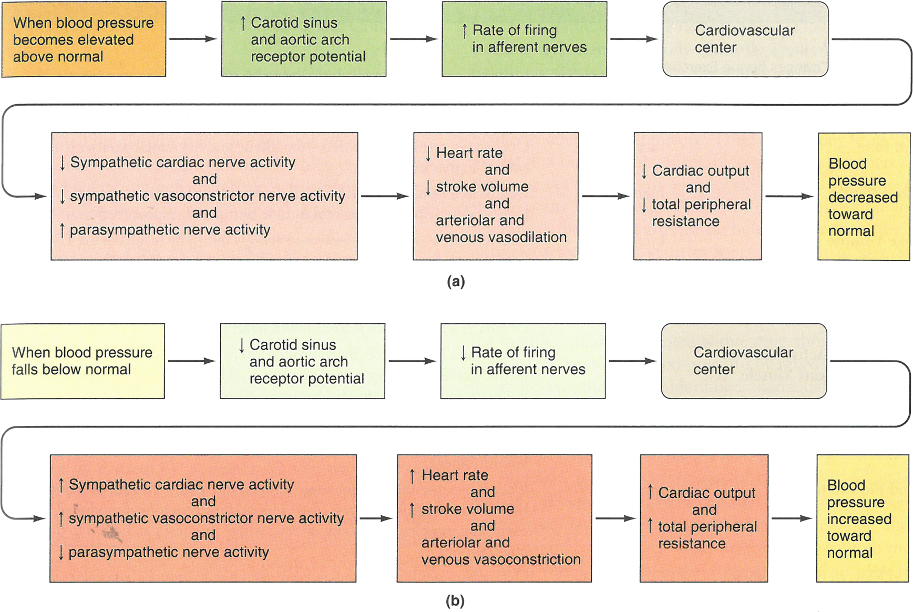
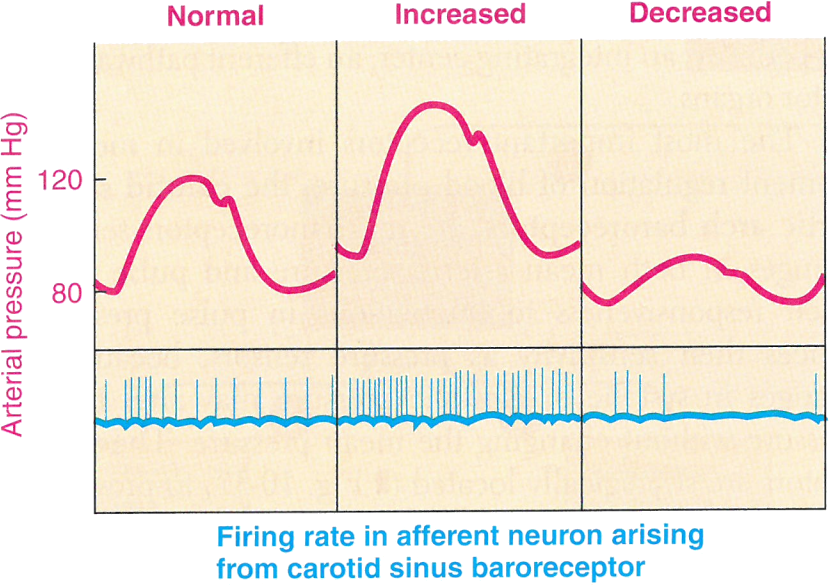
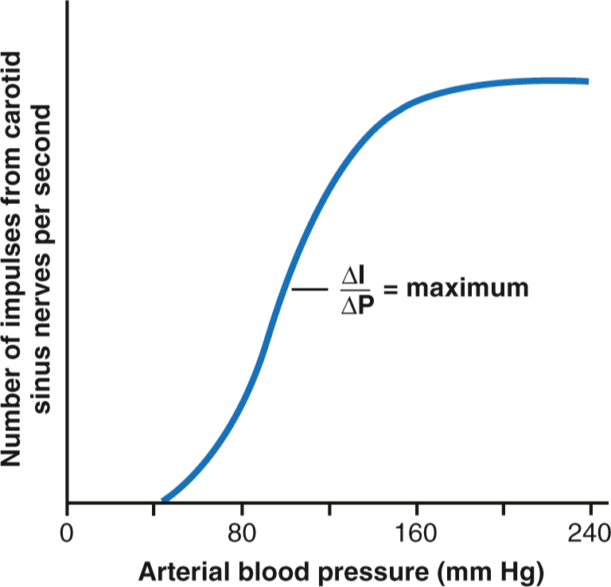
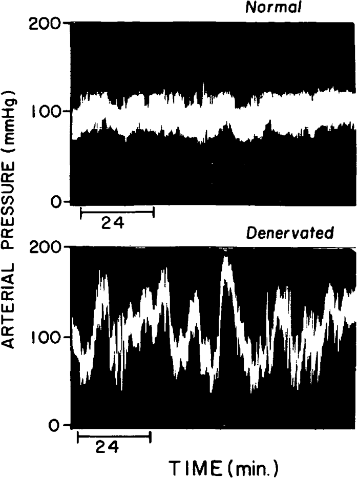
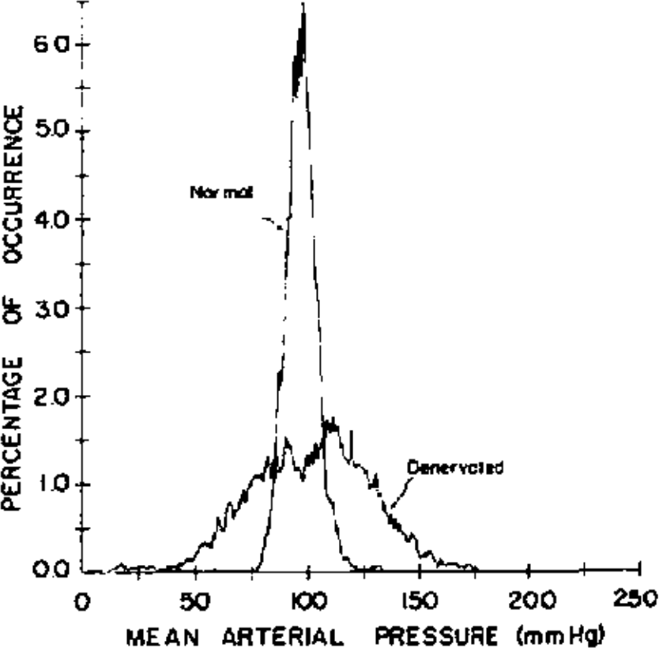
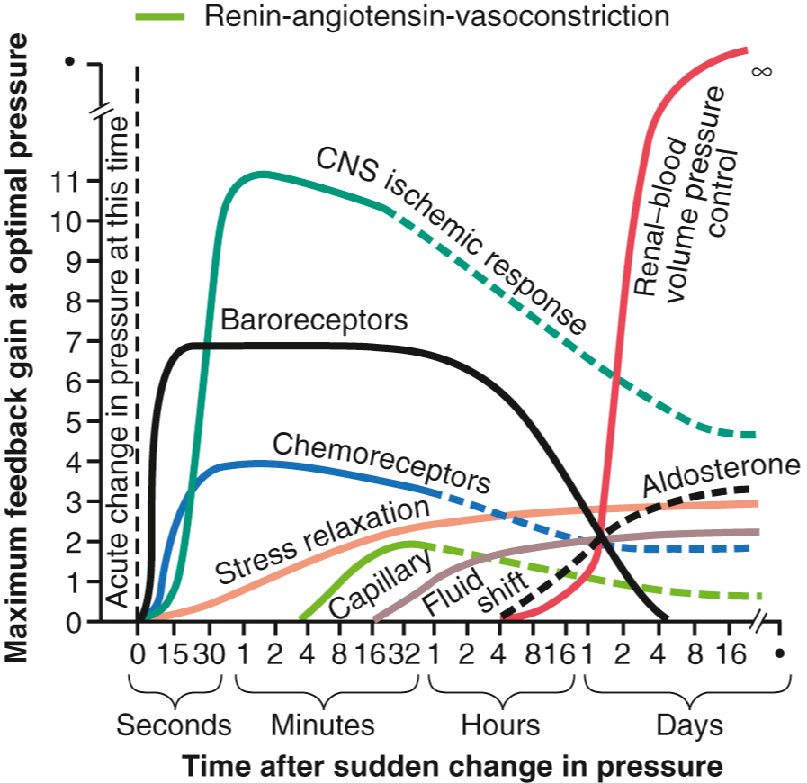

<!-- .slide: id="MEDI2101Wk6_2" -->
#### MEDI2101 Cardiovascular and Respiratory System.
### Block 2: Cardiovascular System
# LO2.3: Cardiovascular regulation.  Part 2.
(Week 6, Lecture 2)
##### Dr Mark Butlin (PhD, BE, SFHEA) (he/him)

Macquarie Medical School, Faculty of Medicine, Health and Human Sciences Macquarie University. On the land of the Wallumattagal clan of the Dharug Nation.

---
## LO2.3.4 Outline the key steps of the baroreceptor reflex, include the: stimulus, sensors, changes in sympathetic and parasympathetic outputs, arteriolar and myocardial targets, and the resulting systemic changes.

--
### Baroreceptor reflex
####

  

    
  

  

  
Baroreceptors:

    <ul>
     <li> "stretch" receptors</li>
     <li> located primarily in the carotid arteries (to a lesser degree in the aortic arch)</li>
     <li> provide a negative feedback</li>
    </ul>

Input: $\uparrow$ pressure $\longrightarrow~\uparrow$ vessel stretch

 $\longrightarrow$ vasomotor complex $\longrightarrow$ 

Output: $\downarrow$ sympathetic drive &nbsp;&nbsp;&nbsp;&nbsp;&nbsp;&nbsp;&nbsp;&nbsp;$\uparrow$ parasympathetic drive

  

  

    
Guyton and Hall Textbook of Medical Physiology.

  

--
<!-- .slide: data-auto-animate -->
### Baroreceptor reflex
####

Sherwood L. Human Physiology: From Cells to Systems. 4th Ed

--
<!-- .slide: data-auto-animate -->
### Baroreceptor reflex
####

  

    
  

  

    
An example of baroreceptor firing rate in response to transient blood pressure changes.

  

  

    
Sherwood L. Human Physiology: From Cells to Systems. 4th Ed

  

--
<!-- .slide: data-auto-animate -->
### Baroreceptor reflex
####

  

    
  

  

    
Baroreflex response curve.

    
Different levels of blood pressure activate the baroreflex complex to a different extent.

  

  

    
Guyton and Hall Textbook of Medical Physiology.

  

--
<!-- .slide: data-auto-animate-->
### Baroreceptor reflex
#### Physiological example 1: Valsalva maneuver (with faint)

Macquarie University Blood Pressure and Vascular Function Laboratory

<aside class="notes">Valsalva maneuver (blowing against a closed system with an open glottis) to change intrathoracic pressure. Large systemic effects on sympathetic and parasympathetic output driven by and driving blood pressure (systolic blood pressure, SBP), cardiac output (heart rate HR, stroke volume SV), and total peripheral resistance (TPR) changes.</aside>

--
<!-- .slide: data-auto-animate data-background-image="images/VRL098.png" data-background-size="contain"-->
### Baroreceptor reflex
#### Physiological example 2: Orthostatic challenge

&nbsp;

Macquarie University Blood Pressure and Vascular Function Laboratory

<aside class="notes">{A normal response to standing up from a supine (laying down) position. There is an initial blood pressure drop (due to gravity effect is increase systemic venous pooling of blood, decreasing venous return, see Section \\ref{sec:venousreturn}). The blood pressure drop invokes the baroreceptors. Resulting sympathetic increase / parasympathetic withdrawal increases heart rate (and cardiac contractility) and blood pressure is normalised.</aside>

--
<!-- .slide: data-auto-animate data-background-image="images/VRL099.png" data-background-size="contain" -->
### Baroreceptor reflex
#### Physiological example 2: Orthostatic challenge

&nbsp;

Macquarie University Blood Pressure and Vascular Function Laboratory

<aside class="notes">If baroreceptor feedback and autonomic processing is abnormal, either orthostatic hypotension (sustained blood pressure drop) or orthostatic tachycardia (sustained heart rate increase) may occur. This plot presents a case of tachycardic response to moving from supine to upright (this time by use of a tilt-table).</aside>

--
<!-- .slide: data-auto-animate -->
### Baroreceptor reflex
#### Baroreceptors and short-term control of arterial blood pressure

Baroreceptor dennervation in the dog shows the removal of the buffering reflex that the baroreceptors provide to counteract changes in blood pressure.

&nbsp;

Cowley AW Jr et al. Role of baroreceptor reflex in daily control of arterial blood pressure and other variables in dogs. Circ Res. 1973;32(5):564-76.

--
<!-- .slide: data-auto-animate -->
### Baroreceptor reflex
#### Baroreceptors and long-term control of arterial blood pressure
**The argument *against* long-term blood pressure control by baroreceptors**

"One reason that the baroreceptors have been considered by some physiologists to be <b>relatively unimportant in chronic regulation of arterial pressure</b> is that they <b>tend to reset in 1 to 2 days to the pressure level to which they are exposed</b>. That is, if the arterial pressure rises from the normal value of 100 mmHg to 160 mmHg, a very high rate of baroreceptor impulses are at first transmitted. During the next few minutes, the rate of firing diminishes considerably; then it diminishes much more slowly during the next 1 to 2 days, at the end of which time the rate of firing will have returned to nearly normal despite the fact that the mean arterial pressure still remains at 160 mmHg."

&nbsp;

Guyton and Hall Textbook of Medical Physiology.

--
<!-- .slide: data-auto-animate -->
### Baroreceptor reflex
#### Baroreceptors and long-term control of arterial blood pressure
**The argument *for* long-term blood pressure control by baroreceptors**

"Experimental studies, however, have suggested that <b>the baroreceptors do not completely reset and may therefore contribute to long-term blood pressure regulation</b>, especially by influencing sympathetic nerve activity of the kidneys. For example, with prolonged increases in arterial pressure, the baroreceptor reflexes may mediate decreases in renal sympathetic nerve activity that promote increased excretion of sodium and water by the kidneys. This action, in turn, causes a gradual decrease in blood volume, which helps to restore arterial pressure toward normal."

&nbsp;

Guyton and Hall Textbook of Medical Physiology.

---
## LO2.3.5 Outline the key steps of the chemoreceptor reflex, including the: stimulus, sensors, changes in sympathetic and parasympathetic outputs, the arteriolar and myocardial targets, and the local and systemic changes.

--
### Chemoreceptor reflex
####
<ul>
<li> chemoreceptors monitor changes in blood concentrations of oxygen, carbon dioxide, and hydrogen ions</li>
<li> chemoreceptors are located in the carotid bodies and the aortic arch</li>
<li> they sense</li>
<ul>
        <li> <b>hypoxia</b> lowered blood oxygen availability</li>
        <li> <b>acidosis</b> increased hydrogen ion concentration in blood</li>
        <li> <b>hypercapnia</b> excess carbon dioxide in blood</li>
</ul>
<li> signals to the central nervous system (both the respiratory and cardiovascular centres).</li>
<li> in addition to respiratory changes, sympathetic and parasympathetic output alters cardiac contractility and heart rate (cardiac output), and vasoconstriction (total peripheral resistance).</li>
</ul>

We don't need any more information as we have covered chemoreceptors in Week 3, and the sympathetic and parasympathetic effect of the heart and blood vessels in the first lecture today.

---
## LO2.3.6 Understand the concept of transmural pressure, why this is important in cerebral ischaemia, and how this is related to the Cushing reflex.

--
<!-- .slide: data-auto-animate data-background-image="images/bubble.jpg" -->
<h3 style="color:white">Cerebral ischaemia</h3>
<h4 style="color:white">Transmural pressure</h4>

The transmural pressure is the difference between the pressure outside a container of flexible/elastic material (for example, an artery) and that inside the container.

--
<!-- .slide: data-auto-animate data-background-image="images/bubble2.png" -->
<h3 style="color:white">Cerebral ischaemia</h3>
<h4 style="color:white">Transmural pressure</h4>

--
<!-- .slide: data-auto-animate data-background-image="images/bubble3.png" -->

--
<!-- .slide: data-auto-animate data-background-image="images/bubble4.png" -->

&nbsp;

&nbsp;

&nbsp;

The transmural pressure is the difference between the outside and inside pressure.

In the case of a bubble (or a systemic artery) it is the difference between the inside pressure (blood pressure in an artery) and atmospheric pressure (=0 mmHg).

--
<!-- .slide: data-auto-animate data-background-image="images/bubble5.png" -->

&nbsp;

&nbsp;

The intracranial space has a positive pressure, above atmospheric pressure (healthy range approx. 7 to 20 mmHg), and high pressures in pathology/injury.

Therefore, the transmural arterial pressure can be close to, or less than zero at high intracranial pressures.

At a transmural pressure of zero (critical closing pressure), blood will not be able to flow to the brain tissue.

--
<!-- .slide: data-auto-animate -->
### Cerebral ischaemia
#### Causes of cerebral ischaemia

- <b>Local causes</b> for example, stroke by vascular occlusion.
- <b>Systemic causes</b> for example, blood loss.
- <b>Cushing reflex</b> increased intracranial pressure above brain arterial blood pressure

--
<!-- .slide: data-auto-animate -->
### Cerebral ischaemia
#### Cushing reflex

If the intracranial pressure reaches or exceeds the critical closing pressure of the intracranial vasculature (approximately 0 mmHg transmural pressure), blood supply to the brain will be cut.

<blockquote>
<b>Cushing reaction (or reflex)</b>

The blocking of blood flow (by increased pressure of the cerebrospinal fluid) results in a reaction that drives arterial pressure higher, above the level of the cerebrospinal fluid pressure, to restore blood flow to the brain.

</blockquote

--
<!-- .slide: data-auto-animate -->
### Cerebral ischaemia
#### Response to cerebral ischaemia

Cerebral ischaemia causes a unique response whereby the vasomotor cortex senses and responds directly to the ischaemic event.

Mechanisms:
- Vasoconstrictor and cardioaccelerator neurons in the vasomotor center in the lower brainstem respond directly to the ischemia.
- Believed to be activated by high CO2 in the region when blood is unable to carry the waste product away from the region.
- Possible other factors are involved such as lactic acid and other acidic substances in the vasomotor center.

--
<!-- .slide: data-auto-animate data-background="#111111" -->

This direct vasomotor response is not invoked in everyday physiological events.

Why?
 

Arterial pressure must fall below intracranial pressure.

$\begin{equation}
\mathrm{flow} = \dfrac{\mathrm{arterial~pressure} - \mathrm{intracranial~pressure}}{\mathrm{resistance}}
\end{equation}$

--
<!-- .slide: data-auto-animate -->
### Cerebral ischaemia
#### Response to cerebral ischaemia

$\begin{equation}
\mathrm{flow} = \dfrac{\mathrm{arterial\~pressure} - \mathrm{intracranial\~pressure}}{\mathrm{resistance}}
\end{equation}$
  
Why is intracranial pressure instead of venous pressure in this equation? 

If intracranial pressure exceeds venous pressure, then the veins will be collapsed, and it is the difference between arterial and intracranial pressure that determines flow.

Ischaemia of the vasomotor centre does not start to occur until systemic blood pressure falls below 60 mmHg, and does not reach maximum effect until pressures of 15 to 20 mmHg*

* Guyton and Hall Textbook of Medical Physiology

--
<!-- .slide: data-auto-animate -->
<blockquote>

<b>"The greedy brain"</b>

<em>If</em> the vasomotor centre is directly and fully invoked, parasympathetic output ceases and sympathetic outflow is maximal.

        <ul>
          <li> Maximal heart rate and contractility will occur to maximise cardiac output.</li>
          <li> Peripheral vessels will contract, some organs (e.g. kidneys) receive very, very minimal blood flow. This increases total peripheral resistance.</li>
          <li> Systemic blood pressure can reach 250 mmHg for periods of up to 10 minutes*.</li>
        </ul>
</blockquote>

*Guyton and Hall Textbook of Medical Physiology}

---
## LO2.3.7 Understand how changes in blood volume alter systemic arterial blood pressure

--
<!-- .slide: data-auto-animate -->
### Blood volume and systemic arterial blood pressure
#### 

\begin{equation}
\mathrm{systemic\~arterial\~blood\~pressure} \propto \mathrm{blood\~volume}
\end{equation}

If total blood volume is increased, blood pressure will increase.

This is not a rapid method to alter blood pressure, as it takes a longer period of time to alter blood volume (as opposed to altering venous return, or chemosensor and baroreceptor feedback).

--
<!-- .slide: data-auto-animate -->
### Blood volume and systemic arterial blood pressure
#### Functions of the kidneys
<ul>
  <li> regulation of blood ionic composition (Na+, K+, Ca2+, Cl-, phosphate ions)</li>
  <li> regulates blood volume by regulating amount of water excreted (urine)</li>
  <li> regulates blood pressure through</li>
        <ul>
        <li> regulation of blood volume</li>
        <li> secreting renin (renin-angiotensin system)</li>
        </ul>
  <li> regulates blood pH by excreting H+ and conserving bicarbonate ions</li>
  <li> regulate red blood cell production through release of the hormone erythropoietin</li>
  <li> synthesises vitamin D</li>
  <li> filters waste products in blood, excreted in urine</li>
</ul>

--
<!-- .slide: data-auto-animate -->
### Blood volume and systemic arterial blood pressure
#### The Renin-Angiotensin System (RAS)
<!-- .slide: data-auto-animate -->

<ul>
  <li> Falling blood volume, or reduced blood flow (e.g. through sympathetic stimulation of  vascular smooth muscle) to the kidneys, induces renin secretion from the kidneys into the blood</li>
  <li> Renin and angiotensin converting enzyme produce angiotensin II, a powerful vasoconstrictor.</li>
  <li> Vasoconstriction increases resistance, and therefore pressure.</li>
  <li> Angiotensin II also causes aldosterone secretion, which causes sodium ion and water reabsorption.</li>
  <li> This increases blood volume, also increasing blood pressure.</li>
</ul>

&nbsp;

See this week's on-line module in iLearn.

---
## LO2.3.8 Recognise that there is hormonal control of blood pressure.

--
<!-- .slide: data-auto-animate -->
### Hormonal control of blood pressure
#### Norepinephrine and epinephrine (noradrenaline and adrenaline)

<b>Vasoconstrictor: Norepinephrine</b>

Vasoconstrictor nerve terminals release predominantly norephinephrine, a potent vasoconstrictor acting on alpha adrenergic receptors of vascular smooth muscle.

--
<!-- .slide: data-auto-animate -->
### Hormonal control of blood pressure
#### Norepinephrine and epinephrine (noradrenaline and adrenaline)

<b>The adrenal medullae</b>
<ul>
  <li> sympathetic nerves also terminate in the adrenal medullae</li>
  <li> stimulation causes secretion of both epinephrine and norepinephrine into the blood stream</li>
  <li> therefore, these potent vasoconstrictors act systemically on most organs*</li>
</ul>

&nbsp;

* Epinephrine can cause vasodilation because it also has a beta-adrenergic receptor stimulatory effect, which dilates rather than constricts certain vessels. It has only a weak constriction effect on blood vessels of skeletal muscles.

--
<!-- .slide: data-auto-animate -->
### Hormonal control of blood pressure
#### Antidiruetic hormone (ADH) or vasopressin

Produced by the hypothalamus (in the brain), transported to the pituitary gland where it is released into the blood.

Induced by:
<ul>
<li> <b>hypovolemia</b> decreased blood volume caused by, for example, dehydration. Sensed by the cardiopulmonary baroreceptors and communicated to the hypothalamus.</li>
<li> <b>hypovolemia</b> sensed by hypothalamic osmoreceptors in response to high extracellular osmolarity.</li>
<li> <b>hypotension</b> sensed by the baroreceptors.</li>
<li> <b>angiotensin II</b> increased in circulating blood.</li>
</ul>
  

 Increases reabsorption of water from renal tubules, increasing blood volume, increasing extracellular fluid and decreasing extracellular osmolarity.

 Causes vasoconstriction (only at very high concentrations, as may occur in severe hypovolemic shock).

---
## LO2.3.9 Use the prior knowledge of the cardiovascular regulatory pathways to describe responses to physiological challenges.

--
<!-- .slide: data-auto-animate data-background-image="images/MAPoverview.png" data-background-size="contain" -->
### Bringing it all together

&nbsp;

Sherwood L. Human Physiology From Cells to Systems. 4th Ed.

--
<!-- .slide: data-auto-animate -->
### Bringing it all together
#### Consider the time course

Guyton and Hall Textbook of Medical Physiology.

--
<!-- .slide: data-auto-animate data-background-image="images/fishtankheater.jpg" data-background-opacity="0.5"-->
### Bringing it all together
#### Feedback loops - overshoot and undershoot (oscillations)
  
<blockquote>
Baroreflex, chemoreceptors, and the Cushing reflex are closed-loop feedback systems. This means that they change what they are sensing, thus all are susceptible to over/under shoot in blood pressure during regulation of blood pressure and flow.
</blockquote>

--
<!-- .slide: data-auto-animate -->
### Bringing it all together
#### Feedback loops - overshoot and undershoot (oscillations)

**Baroreflex associated blood pressure oscillations**

- **cause** lag between detection of blood pressure change and implementation of response results in a slow over/under shoot in baroreflex response to pressure falls/rises.
- **frequency** have a similar frequency response (and possibly are the cause of) "Mayer waves", that rise and fall at a frequency of approximately 0.1 to 0.15 Hz (an oscillation every 6 to 10 seconds).

<b>Chemoreceptor associated blood pressure oscillations</b>

<ul>
<li> <b>cause</b> Similar over/under shoot response as described in baroreflex above.</b>
<li> <b>when</b> stronger at lower blood pressures, where the baroreflex has a lesser effect.</b>
</ul>

--
<!-- .slide: data-auto-animate -->
### Bringing it all together
#### Feedback loops - overshoot and undershoot (oscillations)

**Blood pressure oscillations caused by the Cushing reflex**

When the Cushing reflex is activated and blood flow is restored to the brain, the reflex is lessened causing a decrease in blood pressure to a point near where blood flow to the brain again stops, causing an increase in the Cushing reflex, and an increase in blood pressure.

--
<!-- .slide: data-auto-animate data-background-image="images/CirculatoryShock_Sherwood.png" data-background-size="contain" -->

  

    <h3>Bringing it all together</h3>
  

  

    
Cardiovascular regulation in clinical emergency (simplified)

  

  

    
Sherwood L. Human Physiology: From Cells to Systems. 4th Ed.

  

--
<!-- .slide: data-auto-animate data-background-image="images/hemorrhage_Sherwood.png" data-background-size="contain" data-background-position="right"-->
### Bringing it all together

Response to haemorrhage

&nbsp;

Sherwood L. Human Physiology: From Cells to Systems. 4th Ed.

--
<!-- .slide: data-auto-animate -->
### Bringing it all together
#### Regulating mean arterial pressure: An overview

To alter systemic arterial blood pressure (here mean arterial pressure, MAP), we must change one or more of:

$\begin{align}
\mathrm{MAP} & = \mathrm{CO} \times \mathrm{TPR}\\\\
  & = \mathrm{SV} \times \mathrm{HR} \times \mathrm{TPR}
\end{align}$

$ \mathrm{MAP} \propto \mathrm{blood\~volume} $

--
<!-- .slide: data-auto-animate -->
### Bringing it all together
#### Regulating mean arterial pressure: An overview

Venous return mechanisms (where venous return is altered, e.g. by sympathetic stimulation of the venous smooth muscle; skeletal muscle pump; respiratory pump;). For increased venous return (opposite for decreased venous return):
<ul>
      <li> <b>Frank-Starling law of the heart:</b> positive feedback, increases stroke volume through increased cardiac contractility</li>
      <li> <b>Bainbridge reflex:</b> positive feedback, increases stroke volume (through cardiac contractility) and heart rate.</li>
      <li> <b>Atrial (volume) reflex:</b> negative feedback, signals to kidneys to increase fluid loss, reducing blood volume.</li>
      <li> <b>Cardiopulmonary baroreceptors:</b> negative feedback, signal to the central nervous system, decreasing sympathetic and increasing parasympathetic outflow (effects across SV, HR, TPR, and longer term, blood volume).</li>
</ul>

--
<!-- .slide: data-auto-animate -->
### Bringing it all together
#### Regulating mean arterial pressure: An overview

Other mechanisms that alter blood pressure:

<ul>
  <li> <b>baroreceptors:</b> negative feedback, signal to the central nervous system, decreasing sympathetic and increasing parasympathetic outflow (effects across SV, HR, TPR, and longer term, blood volume).</li>
  <li> <b>chemoreceptors:</b> negative feedback, signal to the central nervous system, decreasing sympathetic and increasing parasympathetic outflow (effects across SV, HR, TPR, and longer term, blood volume). Also cross-talk with respiratory system.</li>
</ul>
  
--
<!-- .slide: data-auto-animate -->
### Bringing it all together
#### Regulating mean arterial pressure: An overview

<ul>
  <li> <b>renal control of blood volume:</b> controlled (primarily) by central nervous system sympathetic outflow. Slower acting for blood pressure control than baroreceptors and chemoreceptors as it alters blood volume.</li>
  <li> <b>hormonal control of blood pressure:</b> also controlled (primarily) by central nervous system sympathetic outflow. Different hormones act on different places (vasocronstrictors = TPR changes; renal acting = changes in blood volume)</li>
</ul>

--
<!-- .slide: data-auto-animate data-background="#111111" -->

Remember that sympathetic and parasympathetic changes do not just "happen".

There must be a reason (cause, an input to the central nervous system) for the changes in sympathetic and parasympathetic outflow to occur.

--
<!-- .slide: data-auto-animate -->
### Bringing it all together
#### Regulating mean arterial pressure: An overview

<table>
  <tr>
    <th> receptor </th>
    <th> located </th>
    <th> senses </th>
  </tr><tr>
    <td> cardiopulmonary baroreceptors </td>
    <td> atria and pulmonary artery </td>
    <td> pulmonary arterial pressure </td>
  </tr><tr>
    <td> baroreceptors </td>
    <td> aorta and carotid artery </td>
    <td> systemic arterial blood pressure </td>
  </tr><tr>
    <td> chemoreceptors </td>
    <td> central (brain) and peripheral (carotid/aorta) </td>
    <td> blood O2, CO2, H+</td>
  </tr><tr>
    <td> pain receptors </td>
    <td> skin, some internal tissue </td>
    <td> pain</td>
  </tr><tr>
    <td> proprioceptors </td>
    <td> throughout body </td>
    <td> movement </td>
  </tr><tr>
    <td> thermoreceptors </td>
    <td> immediately under skin </td>
    <td> temperature </td>
  </tr><tr>
    <td> higher order brain </td>
    <td> throughout brain </td>
    <td> e.g. stress </td>
  </tr>
</table>

There are many receptors throughout the body that signal to the central nervous system and result in changes in sympathetic and parasympathetic outflow. This table is a list (that is not exhaustive) of some of those things that alter sympathetic and parasympathetic activity. Some of these will be familiar from the respiratory regulation material (Week 3).

---
## LO2.3.7 Understand how changes in blood volume alter systemic arterial blood pressure

Covered only briefly in this lecture. See this week's anatomy material in iLearn

---
## LO2.3.10 Identify cardiovascular and respiratory anatomy using surface body markers.

and review of LO2.1.8 Name and identify the major anatomy of the mediastinum and the heart and explain the function of each structure, and  LO2.2.9 Name and identify the anatomy of the major blood vessels. LO2.3.9 also covered in part in Week 3 anatomy material. See this week's anatomy material in iLearn and attend this week's anatomy class.

