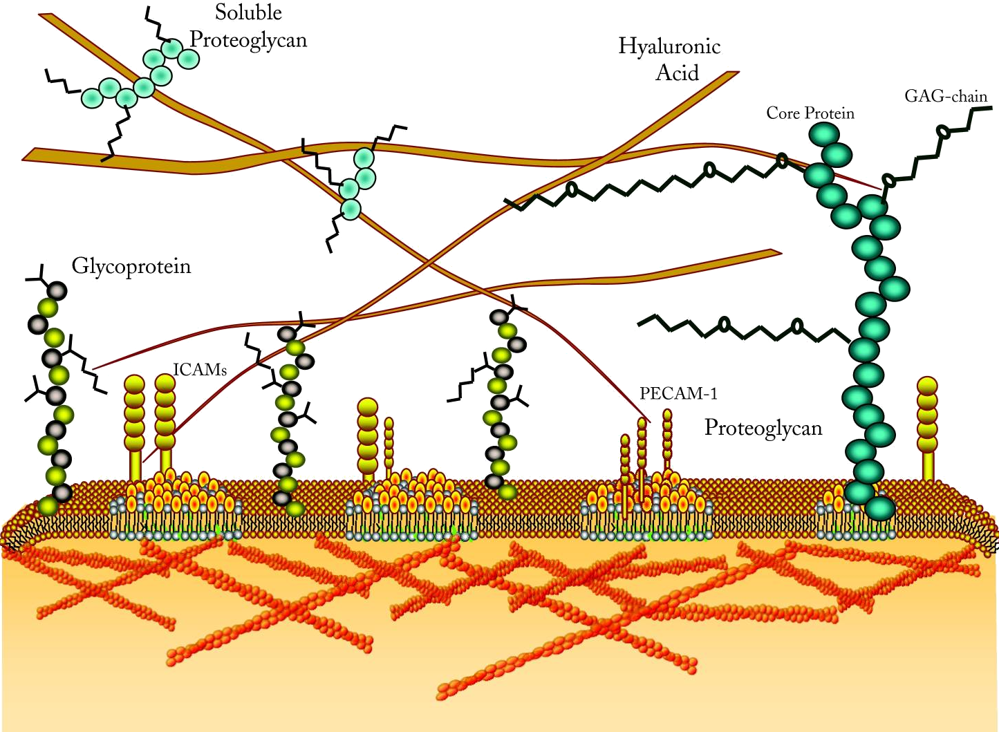
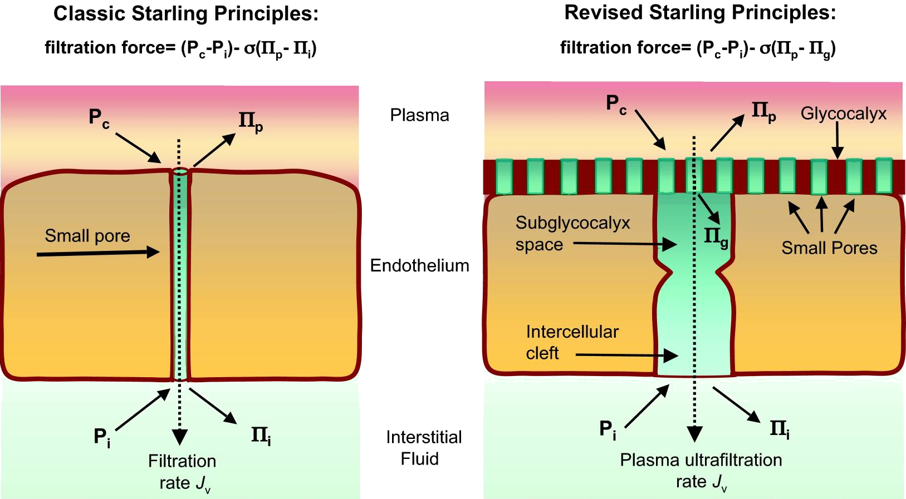

<!-- .slide: data-auto-animate-restart id="MEDI2101Wk7"-->
#### MEDI2101 Cardiovascular and Respiratory System.
### Block 2: Cardiovascular System
# LO2.4: Capillary fluid exchange
(Week 7)
##### Assoc. Prof. Mark Butlin (PhD, BE, SFHEA) (he/him)

Macquarie Medical School, Faculty of Medicine, Health and Human Sciences Macquarie University. On the land of the Wallumattagal clan of the Dharug Nation.

&nbsp;

&nbsp;

This material is provided to you as a Macquarie University student for your individual research and study purposes only. You cannot share this material without permission. Macquarie University is the copyright owner of (or has licence to use) the intellectual property in this material. Legal and/or disciplinary actions may be taken if this material is shared without the University’s written permission.

--
### MEDI2101 Cardiovascular and Respiratory System
#### To do in Week 7

<a href="https://ilearn.mq.edu.au/course/view.php?id=77359&section=11"> MEDI2101 iLearn Week 7</a>

--
###  Assessment Task 3a: Manuscript figure
####

<a href="https://ilearn.mq.edu.au/mod/assign/view.php?id=8175914)">Assessment description</a>

---
<!-- .slide: data-auto-animate-restart -->
## LO2.4.1 Describe the structure of a capillary network and identify types of capillaries according to degree of permeability.

--
### Capillaries (Revision)
####

  

    
  

  

    <ul>
        <li> Smooth muscle in arterioles, metarterioles, precapillary sphincters regulates blood flow into capillary network</li>
        <li> Blood flows from arterioles through metarterioles, then through capillary network</li>
        <li> Venules drain the network</li>
    </ul>

  

  

    
Tortora and Grabowski, Principles of Anatomy and Physiology.

  

--
### Capillaries
####

  

    
  

  

<h6>Vasomotion</h6>

Periodic contraction and release of smooth muscle in metarterioles and the precapillary sphincters causes intermittent flow and cessation of flow in individual capillaries.

<h6>Average blood flow across a capillary bed</h6>

The intermittent flow in individual capillaries averaged across a capillary bed in an area of tissue results in a continuous (generally) non-pulsatile flow of blood through the tissue.

  

  

    
Tortora and Grabowski, Principles of Anatomy and Physiology.

  

--
### Capillaries
####

  

    
  

  

        <h6>Vasomotion regulation</h6>
        
Decreased tissue oxygen drives:

          <ul>
            <li> more frequent periods of flow through individual capillaries.</li>
            <li> long periods of flow within each capillary</li>
          </ul>
          
The net effect being increased blood flow to the tissue bed.

  

  

    
Tortora and Grabowski, Principles of Anatomy and Physiology.

  

--
### Capillaries (Revision)
####

  

    
  

  

    
Capillary wall consists of endothelial cells on a basement membrane.

    
 Capillary types classified by diameter and permeability:

              <ul>
                  <li> <b>Continuous</b> Do not have fenestrae</li>
                  <li> <b>Fenestrated</b> Have pores</li>
                  <li> <b>Sinusoidal</b> Large diameter with large fenestrae</li>
              </ul>
              
Fenestrated and sinusoidal capillaries allow absorption and filtration of water and ions from blood to other body cells.

  

  

    

  

---
<!-- .slide: data-auto-animate-restart -->
## LO2.4.2 Describe caveolae and intercellular clefts and their function within capillaries.
  
--
### Endothelial cells of capillaries: caveloae and intercellular clefts
####

  

    
  

  

    <h6>Intercellular clefts</h6>
        <ul>
          <li> channel between adjacent endothelial cells</li>
          <li> width: $\approx$ 6 to 7 nm (slightly smaller than albumin)</li>
          <li> allow <em>transport of water and water soluble ions</em></li>
        </ul>
        
 

    
        <h6>Caveolae (<em>"small caves"</em>)</h6>
        
a.k.a. plasmalemmal vesicles. Made of caveolins, proteins associated with cholesterol and sphingolipids.

          <ul>
            <li> can carry larger proteins into the cell</li>
            <li> can join to form vesicular channels through the cell</li>
          </ul>
    
  

  

    

  

--
### Endothelial cells of capillaries: caveloae and intercellular clefts
####

Nature of the endothelium and capillary pores varies between organs

- <b>blood brain barrier:</b> <em>tight junctions</em> at intercellular clefts. Only small molecules can pass through capillary wall (water, oxygen, carbon dioxide)*</li>
- <b>liver:</b> intercellular clefts are wide, almost all dissolved plasma substances can pass into the interstitial space</li>
- <b>gastrointestinal tract:</b> intercellular cleft size midway between brain and liver.</li>
- <b>glomeruli of kidneys:</b> fenestrated, allowing easy passage of small molecules and ions</li>

&nbsp;

*Increasing evidence that there is vesicular transport for larger molecules across the blood brain barrier.

--
<!-- .slide: data-auto-animate data-background-image="images/p32_KidneyGlomeruli.jpg"-->

&nbsp;

Capillaries of the kidney glomeruli (STEVE GSCHMEISSNER/SCIENCE PHOTO LIBRARY)

--
<!-- .slide: data-auto-animate data-background-image="images/p34_KidneyCapillary.jpg" -->
<h3 style="color:white">Endothelial cells of capillaries: caveloae and intercellular clefts</h3>
<h4></h4>

&nbsp;

The lumen wall of the glomerular capillaries of the kidney consists of a fenestrated epithelium (pink). (STEVE GSCHMEISSNER/SCIENCE PHOTO LIBRARY)

--
<!-- .slide: data-auto-animate data-background-image="images/p53_EndothelialCellsOfTheBrain.jpg" -->
<h3 style="color:white">Endothelial cells of capillaries: caveloae and intercellular clefts</h3>
<h4></h4>

&nbsp;

Endothelial cell later from the inner surface of the blood vessels in a rat brain. The cells have been stained for the tight-junction-associated protein zonula occludens-1 (green) and the nuclei using DAPI (blue). (DANIEL SCHROEN, CELL APPLICATION INC./SCIENCE PHOTO LIBRARY)

---
<!-- .slide: data-auto-animate-restart -->
## LO2.4.3 Describe the principle of diffusion in the context of transfer of material across the endothelium of capillaries.

--
### Transfer of material across the endothelium
#### Diffusion

Blood solutes pass from areas of high concentration to areas of low concentration.
<ul>
  <li> oxygen</li>
  <li> carbon dioxide</li>
  <li> glucose</li>
  <li> amino acids</li>
  <li> hormones</li>
</ul>

e.g. Oxygen is in a higher concentration in the blood that the interstitial fluid, therefore oxygen will diffuse from the blood into the interstitia. Carbon dioxide is of a higher concentration in the interstitial fluid than in the blood, and therefore will diffuse into the blood.

&nbsp;

Diffusion is a concept we have already covered in the respiratory block of the unit (diffusion of gases across the alveolar wall). It is the same mechanism here

--
### Transfer of material across the endothelium
#### Permeability of the endothelium

The size of the fenestrae of the capillaries regulates what plasma contents can pass through the endothelium wall:

<ul>
  <li> all plasma solutes, other than proteins, can pass through most capillary walls</li>
  <li> therefore, proteins remain in the blood</li>
  <li> capillaries of the liver have larger fenestrae called sinusoids. These allow some proteins (fibrinogen, albumin) to enter the blood stream.</li>
  <li> capillaries in the brain have very small fenestrae, and greatly limit what can diffuse across the endothelium. This is called the <em>lood-brain barrier</em>.</li>
</ul>

--
### Transfer of material across the endothelium
#### Permeability of the endothelium - Effect of molecule size

Example in skeletal muscle (remembering that capillaries in different tissues have different permeability).

&nbsp;

Image: Pappenheimer, J. R. Passage of molecules through capillary walls. Physiological Reviews, 1953, 33, 387-423.

--
### Transfer of material across the endothelium
#### Lipid-soluble material

Lipid-soluble substances can diffuse through the endothelial cell membrane wall (as well as being able to travel through pores, dependent on size).

Therefore, lipid-soluble material can travel through any area of the capillary wall, allowing high rates of transport.

What is lipid soluble? Oxygen and carbon dioxide.

--
### Transfer of material across the endothelium
#### Lipid insoluble material

Substances that are soluble in water but not in lipids can only travel through capillary pores / intercellular clefts.

<ul>
  <li> Relatively slower rates of transfer than lipid soluble material.</li>
  <li> Rates can be faster than the intra-capillary flow of plasma (up to 80$\times$ greater).</li>
</ul>

 What is lipid insoluble (but water soluble)? sodium ions, chloride ions, glucose.

--
### Transfer of material across the endothelium
#### Use Starling's hypothesis to calculate the net flow across the capillary wall

Starling forces:
<ul>
  <li> <b>capillary pressure ($P_c$):</b> pressure for fluid flow <em>outward</em> from the capillary</li>
  <li> <b>interstitial fluid pressure ($P_{if}$):</b> pressure for fluid flow <em>inward</em> to the capillary</li>
  <li> <b>plasma colloid osmotic pressure ($\Pi_{p}$):</b> osmosis drive for fluid <em>inward</em> to the capillary</li>
  <li> <b>interstitial fluid osmotic pressure ($\Pi_{if}$):</b> osmosis drive for fluid <em>outward</em> from the capillary</li>
</ul>

\begin{equation}
\mathrm{net\~filtration\~pressure}=P_c + \Pi_{if} - P_{if} - \Pi_p
\end{equation}

--
### Transfer of material across the endothelium
#### Use Starling's hypothesis to calculate the net flow across the capillary wall
\begin{equation}
\mathrm{net\~filtration\~pressure}=P_c + \Pi_{if} - P_{if} - \Pi_p
\end{equation}

Image: Guyton and Hall Textbook of Medical Physiology.

--
### Transfer of material across the endothelium
#### Use Starling's hypothesis to calculate the net flow across the capillary wall

\begin{equation}
\mathrm{net\~filtration\~pressure}=P_c + \Pi_{if} - P_{if} - \Pi_p
\end{equation}

Forces across the capillary wall at the <em>arterial</em> end of capillaries

<table>
      <tr>
        <th> Outward pressures                  </th>
        <th> (mmHg) </th>
        <th> Inward pressures </th>
        <th> (mmHg) </th>
        <th> total (mmHg)</th>
      </tr><tr>
        <td> capillary pressure ($P_c$)                  </td>
        <td> 30 </td>
        <td> interstitial pressure ($P_{if}$)</td>
        <td> -3 </td>
        <th> 33 </th>
      </tr><tr>
        <td> interstitial osmotic pressure ($\Pi_{if}$)  </td>
        <td> 8 </td>
        <td> plasma osmotic pressure ($\Pi_p$)           </td>
        <td> 28 </td>
        <th> -20 </th>
      </tr><tr>
        <th> total outward pressure              </th>
        <th> 38 </th>
        <th> total inward pressure </th>
        <th> 25 </th>
        <th> net filtration pressure 13 mmHg (outward flow)</th>
      </tr>
</table>

&nbsp;

Source: Adapted from Guyton and Hall Textbook of Medical Physiology.

--
### Transfer of material across the endothelium
#### Use Starling's hypothesis to calculate the net flow across the capillary wall

\begin{equation}
\mathrm{net\~filtration\~pressure}=P_c + \Pi_{if} - P_{if} - \Pi_p
\end{equation}

Forces across the capillary wall at the <em>venous</em> end of capillaries

<table>
      <tr>
        <th> Outward pressures                  </th>
        <th> (mmHg) </th>
        <th> Inward pressures </th>
        <th> (mmHg) </th>
        <th> total (mmHg)</th>
      </tr><tr>
        <td> capillary pressure ($P_c$)                  </td>
        <td> 10 </td>
        <td> interstitial pressure ($P_{if}$)</td>
        <td> -3 </td>
        <th> 13 </th>
      </tr><tr>
        <td> interstitial osmotic pressure ($\Pi_{if}$)  </td>
        <td> 8 </td>
        <td> plasma osmotic pressure ($\Pi_p$)           </td>
        <td> 28 </td>
        <th> -20 </th>
      </tr><tr>
        <th> total outward pressure              </th>
        <th> 18 </th>
        <th> total inward pressure </th>
        <th> 25 </th>
        <th> net filtration pressure -7 mmHg (inward flow)</th>
      </tr>
</table>

&nbsp;

Source: Adapted from Guyton and Hall Textbook of Medical Physiology.

--
### Transfer of material across the endothelium
#### Bulk flow and Starling's hypothesis

  

    
  

  

<ul>
    <li> Protein in blood and interstitial fluids exerts an osmotic pressure ($\approx$23 mmHg)</li>
    <li> Pressure along the capillary changes along its length</li>
    <ul>
        <li> high at arterial end ($\approx$33 mmHg)</li>
        <li> low at venous end ($\approx$13 mmHg)</li>
    </ul>
    <li class="fragment"> at the arteriolar end, capillary pressure is initially higher than osmotic pressure -- <em>filtration</em></li>
    <li class="fragment"> at the venular end, capillary pressure is lower than osmotic pressure -- <em>re-absorption</em></li>
</ul>
  

  

    

  

--
### Transfer of material across the endothelium
#### Bulk flow and Starling's hypothesis

$\begin{equation}\mathrm{net\~filtration\~pressure}=P_c + \Pi_{if} - P_{if} - \Pi_p\end{equation}$

Average forces across the capillary wall over the length of the capillary (Principle of Starling equilibrium):

<table>
      <tr>
        <th> Outward pressures                  </th>
        <th> (mmHg) </th>
        <th> Inward pressures </th>
        <th> (mmHg) </th>
        <th> total (mmHg)</th>
      </tr><tr>
        <td> average capillary pressure ($P_c$)                  </td>
        <td> 17.3 </td>
        <td> interstitial pressure ($P_{if}$)</td>
        <td> -3 </td>
        <th> 20.3 </th>
      </tr><tr>
        <td> interstitial osmotic pressure ($\Pi_{if}$)  </td>
        <td> 8 </td>
        <td> plasma osmotic pressure ($\Pi_p$)           </td>
        <td> 28 </td>
        <th> -20 </th>
      </tr><tr>
        <th> total outward pressure              </th>
        <th> 25.3 </th>
        <th> total inward pressure </th>
        <th> 25 </th>
        <th> net filtration pressure 0.3 mmHg (outward flow)</th>
      </tr>
</table>

&nbsp;

Source: Adapted from Guyton and Hall Textbook of Medical Physiology.

--
### Transfer of material across the endothelium
#### Bulk flow and Starling's hypothesis

<blockquote>
<h5>Starling equilibrium</h5>

The amount of filtration and absorption across the capillary wall is approximately equal.

Thus, the amount of fluid placed into the interstitium at the arterial end of capillaries is almost wholly re-absorbed at the venous end of capillaries.

<blockquote>

--
<!-- .slide: data-auto-animate data-background="#111111" -->

But where does the fluid from the  0.3 mmHg outward pressure go?

LO2.4.6 Describe the function of the lymphatic system and broadly its anatomy.

---
<!-- .slide: data-auto-animate-restart -->
## LO2.4.4 Understand that understanding of physiology is constantly evolving with new evidence, and apply this understanding specifically to the Starling hypothesis.

--
### Revising the Starling hypothesis
#### Historical understanding: Starling-Landis model

  

    
  

  

    
"Fluid movement across capillary walls (flux per unit area; $Jv/A$) is driven by Starling forces: the difference in hydrostatic pressure ($\Delta P$) and colloid osmotic pressure ($\Delta \Pi$), between the capillary lumen ($c$) and the interstitial compartment ($i$). Fluid and proteins filtered out of the capillaries accumulates in the interstitial space, decreasing both $Pc$ and $\Pi c$ and increasing interstitial pressure. Interstitial pressure is decreased by lymphatic outflow. $Lp$ is the hydraulic conductivity and $\sigma$ is the hydrostatic pressure solute reflection coefficient, intrinsic properties of the vessel wall, characterizing sieving or resistance to the passage of solutes (fluid resistance in the case of $Lp$)."

  

  

    
Yuan SY, Rigor RR. <a href="https://www.ncbi.nlm.nih.gov/books/NBK54123/">Regulation of Endothelial Barrier Function.</a> San Rafael (CA): Morgan & Claypool Life Sciences; 2010. Chapter 2, Structure and Function of Exchange Microvessels.

  

--
### Revising the Starling hypothesis
#### Historical understanding: Starling-Landis model

Example in skeletal muscle (remembering that capillaries in different tissues have different permeability).

&nbsp;

Image: Pappenheimer, J. R. Passage of molecules through capillary walls. Physiological Reviews, 1953, 33, 387-423.

--
### Revising the Starling hypothesis
#### Problems with the hypothesis
<ul>
  <li> <b>Intercellular clefts (in the frog mesentery) were measured at 150 nm $\times$ 20 nm</b>1. Large enough for albumin (7 nm) to pass through.</li>
  <li> When <b>arterial pressure is dropped below interstitial pressure</b>, there is a period of absorption, then <b>filtration is restored</b> (still with low capillary pressure)2.</li>
</ul>

&nbsp;

1Adamson, R.H. and C.C. Michel, Pathways through the intercellular clefts of frog mesenteric capillaries. J Physiol, 1993. 466: p. 303-27. 
2Michel, C.C. and M.E. Phillips, Steady-state fluid filtration at different capillary pressures in perfused frog mesenteric capillaries. J Physiol, 1987. 388: p. 421-35.

--
### Revising the Starling hypothesis
#### The endothelial glycocalyx

Structural components of the endothelial glycocalyx.

Image: Yuan SY, Rigor RR. <a href="https://www.ncbi.nlm.nih.gov/books/NBK54123/">Regulation of Endothelial Barrier Function.</a> San Rafael (CA): Morgan & Claypool Life Sciences; 2010. Chapter 2, Structure and Function of Exchange Microvessels.

--
### Revising the Starling hypothesis
#### The endothelial glycocalyx

Image: Yuan SY, Rigor RR. <a href="https://www.ncbi.nlm.nih.gov/books/NBK54123/">Regulation of Endothelial Barrier Function.</a> San Rafael (CA): Morgan & Claypool Life Sciences; 2010. Chapter 2, Structure and Function of Exchange Microvessels.

--
### Revising the Starling hypothesis
#### The revised Starling Principle

"In the revised Starling model, fluid flux is driven by the pressure differences between the capillary lumen and the relatively protein-free, volume-restricted space between endothelial cells (intercellular cleft). In this case, the principle barrier to fluid permeability is the glycocalyx network that restricts fluid entry to the intercellular space."

&nbsp;

&nbsp;

Yuan SY, Rigor RR. <a href="https://www.ncbi.nlm.nih.gov/books/NBK54123/">Regulation of Endothelial Barrier Function.</a> San Rafael (CA): Morgan & Claypool Life Sciences; 2010. Chapter 2, Structure and Function of Exchange Microvessels.

---
<!-- .slide: data-auto-animate-restart -->
## LO2.4.5 List the constituents of the interstitium.

See this week's on-line module in iLearn.

---
<!-- .slide: data-auto-animate-restart -->
## LO2.4.6 Describe the function of the lymphatic system and broadly its anatomy.

See this week's on-line module in iLearn.

---
<!-- .slide: data-auto-animate-restart -->
## LO2.4.7 Define lymphodema and identify the common causes of the condition.

See this week's on-line module in iLearn.

<!--<!-- .slide: data-auto-animate-restart 
Do your best to have a break this mid-session break. 
You have earned the break - the first half of MEDI2101 is the busiest, most intensive half. 
&nbsp; 
We look forward to welcoming you back in Week 8. The second half of the Cardiovascular and Respiratory unit is the most interesting half.-->