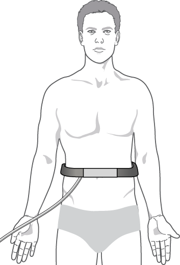
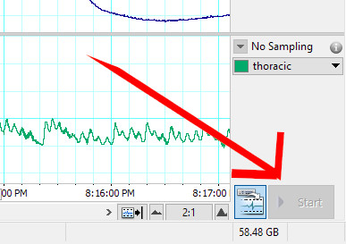

<!-- .slide: id="MEDI2101Wk7prac" -->
#### MEDI2101 Cardiovascular and Respiratory System.
### Block 2: Cardiovascular System
# Week 7, Practical: Introduction to some respiratory and cardiovascular instrumentation
##### Dr Mark Butlin (PhD, BE, SFHEA) (he/him)

Macquarie Medical School, Faculty of Medicine, Health and Human Sciences Macquarie University. On the land of the Wallumattagal clan of the Dharug Nation.

--

### No learning outcomes? 
#### We **LOVE** learning outcomes!

This class introduces the respiratory and cardiovascular devices that we will be using in MEDI2101 - and in Assessment Task 3.1 and 3.2.

The physiogical measurement classes re-inforces some of the theory (and builds on the learning outcomes) that we have learnt in lectures and the on-line modules.

If you find yourself standing around not doing much in todays practical then
you should:

- observe what is happening to the cardiorespiratory parameters being measured.
- think about what is causing the changes.
- discuss with people in your group the possible mechanisms that behind the changes.

Doing this will help you write the discussion section of the manuscript (assessment task 3.2)
 

--
### Blood pressure measurement
####

  

    
  

  

    
Have a volunteer place the cuff on their non-dominant arm.

    <ul>
      <li> If a cuff has a dot, that should be placed aligned with the surface projection of the brachial artery. If there is no dot, align the tube exiting the cuff with the brachial artery.</li>
      <li> Cuff should be firm. Not overly tight. Not overly loose.</li>
      <li> Feet should be flat on the floor. Legs not crossed.</li>
      <li> The arm should be supported e.g. by resting the forearm on the table.</li>
    </ul>
  

  

    

  

--
### Blood pressure measurement
####

  

    
  

  

    
Auscultation and   Korotkoff sounds: (occur during "B" on left)

    <ul>
    <li> <b>Phase I:</b> First sound. Sharp tapping. Systolic blood pressure.</li>
    <li> <b>Phase II:</b> Softer. "Swishing" or "swooshing".</li>
    <li> <b>Phase III:</b> Thumping, often louder than Phase I.</li>
    <li> <b>Phase IV:</b> Softer, muffled sound. Diastolic pressure <em>if</em> Phase V not detected.</li>
    <li> <b>Phase V:</b> Disappearance of sounds (silence). Diastolic pressure.</li>
    </ul>
  

  

    

  

--
### Blood pressure measurement
####

  

    <video data-autoplay src="images/Korotkoff Sounds Annotated Video.mp4"></video>
  

  

    
Auscultation and   Korotkoff sounds: (occur during "B" on left)

    <ul>
    <li> <b>Phase I:</b> First sound. Sharp tapping. Systolic blood pressure.</li>
    <li> <b>Phase II:</b> Softer. "Swishing" or "swooshing".</li>
    <li> <b>Phase III:</b> Thumping, often louder than Phase I.</li>
    <li> <b>Phase IV:</b> Softer, muffled sound. Diastolic pressure <em>if</em> Phase V not detected.</li>
    <li> <b>Phase V:</b> Disappearance of sounds (silence). Diastolic pressure.</li>
    </ul>
  

  

    
<a href="https://www.youtube.com/watch?v=VJrLHePNDQ4">https://www.youtube.com/watch?v=VJrLHePNDQ4</a>

  

--
### Blood pressure measurement
####

&nbsp;

Avolio, A. P.; Butlin, M. & Winter, Cardiology: Blood pressure. The Physiological Measurement Handbook, CRC Press, 2014, 14-41.

--

### 4 questions on blood pressure.
####

<a href="https://flux.qa/Q525TY">https://flux.qa/Q525TY</a>

--
### Respiratory belt
####

  

    
  

  

    <ul>
      <li> The respiratory belt is placed just below the level of the diaphragm, stretching the respiratory belt a little before fastening the velcro.</li>
      <li> Start the data acquisition software and look at the respiratory signal that is being recorded.</li>
    </ul>
    
    

  

  

    

  

--

### 3 questions on respiratory measurement.
####

<a href="https://flux.qa/Q525TY">https://flux.qa/Q525TY</a>

--
### Electrocardiogram
####

  

    
  

  

    <h5>Lead I configuration</h5>
    <ul>
      <li> With the three physical leads of the ECG, get a Lead I ECG signal.</li>
      <li> Record the signal for roughly 10 seconds.</li>
      <li> Note where P, Q, R and S would be labelled on this recorded waveform.</li>
      <ul>
        <li> What cardiac event does the P wave correspond to?</li>
      </ul>
    </ul>
  

  

    

  

--
### Electrocardiogram
####

  

    
  

  

    <h5>Lead II configuration</h5>
    <ul>
      <li> With the three physical leads of the ECG, get a Lead II ECG signal.</li>
      <li> Record the signal for roughly 10 seconds.</li>
      <li> How does the lead II configuration differ from the lead I configuration?</li>
    </ul>
  

  

    

  

--

### 4 questions on the electrocardiogram
####

<a href="https://flux.qa/Q525TY">https://flux.qa/Q525TY</a>

--
### Respiratory and cardiovascular variability
####

  

    
    
    

  

  

    
Measure the following things and enter them in the spreadsheet (<a href="https://bit.ly/2MkvaCT">https://bit.ly/2MkvaCT</a>):

    <ul>
      <li> your respiratory rate </li>
      <li> your heart rate </li>
      <li> your blood pressure </li>
      <li> your arterial bood oxygen saturation (SpO2)
    </ul>
  

  

    
Wellcome Collection gallery (2018-04-06): <a href="https://wellcomecollection.org/works/kpreuaus">https://wellcomecollection.org/works/kpreuaus</a>

  

--

### 4 questions on cardiovascular and respiratory variability.
####

<a href="https://flux.qa/Q525TY">https://flux.qa/Q525TY</a>
