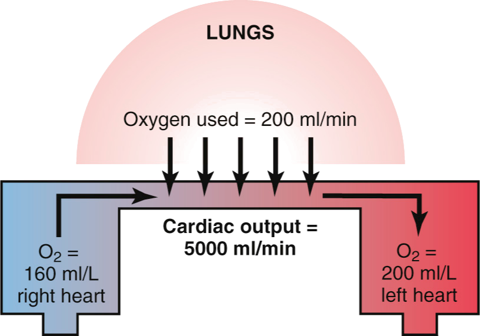
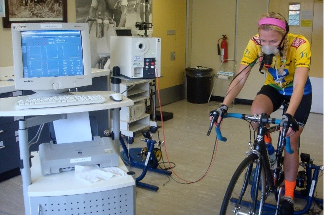

<!-- .slide: id="MEDI2101Wk8" -->
#### MEDI2101 Cardiovascular and Respiratory System.
# Block 3: Cardiovascular and respiratory integration
##### Dr Mark Butlin (PhD, BE, SFHEA)

Macquarie Medical School

Faculty of Medicine, Health and Human Sciences, Macquarie University.

---
#### MEDI2101 Cardiovascular and Respiratory System.
### Block 3: Cardiovascular and respiratory integration
# LO3.1: Introduction to exercise cardiorespiratory physiology
(Week 8)
##### Dr Mark Butlin (PhD, BE, SFHEA)

Macquarie Medical School

Faculty of Medicine, Health and Human Sciences, Macquarie University.

--
### Feedback - Assessment Task 2: Anatomy
#### Dr Mirjana Strkalj

&nbsp;

<a href="temp.html#marks" target="\_blank"
>Overview of marks</a>

--
###  MEDI2101 Cardiovascular and Respiratory System
#### To do in Week 8

- **Attend and engage with:** lecture on introduction to exercise cardiorespiratory physiology (welcome!)
- **Complete on-line activity:** Exercise, a modifiable lifestyle factor to reduce cardiovascular risk
- **Read:** Guyton & Hall, Chapter 85 (pay attention to the lecture learning outcomes, and read relevant sections of Chapter 85)
- **Attend and engage with:** Physiological measurement - Autonomic function
- **Submit:** Assessment Task 3.1 - manuscript figure

Things that would be helpful to bring along to this week's "practical":

<ul>
<li>stop watch, watch with a second hand, or timer on your phone.</li>
<li>automatic blood pressure device, if you have access to one.</li>
<li>an area nearby your computer where you can lie down for 5 minutes (bring a pillow?).</li>
<li>pen and paper.</li>
</ul>

--
###  MEDI2101 Cardiovascular and Respiratory System
#### To do in Week 8 - Submit assessment task 3.1

--
###  MEDI2101 Cardiovascular and Respiratory System
#### Details on AT4 Final Exam

<a href="https://ilearn.mq.edu.au/course/view.php?id=53730#section-21" target="\_blank">Description of AT4 Final Exam on iLearn.</a>

---
## LO3.1.1 Communicate the difference between the three metabolic systems of skeletal muscle during exercise.

--
<!-- .slide: data-auto-animate -->
### Metabolic systems of skeletal muscle
#### Summary of the three systems

<table>
  <tr>
    <th>system</th>
    <th>process</th>
    <th>fuel</th>
    <th>moles ATP / minute</th>
    <th>speed of ATP mobilisation</th>
    <th>capacity</th>
  </tr>
  <tr>
    <td><b>phosphocreatine-creatine</b></td>
    <td>anaerobic</td>
    <td>stored phosphagens</td>
    <td>4</td>
    <td>very fast</td>
    <td>very limited</td>
  </tr>
  <tr>
    <td><b>glycogen–lactic acid</b></td>
    <td>anaerobic</td>
    <td>glycolosis of glycogen / glucose</td>
    <td>2.5</td>
    <td>fast</td>
    <td>limited</td>
  </tr>
  <tr>
    <td><b>aerobic</b></td>
    <td>aerobic</td>
    <td>oxidative phosphorylation of glycogen, glucose, fats, proteins</td>
    <td>1</td>
    <td>slow</td>
    <td>unlimited</td>
  </tr>
</table>

--
<!-- .slide: data-auto-animate -->
### Metabolic systems of skeletal muscle
#### 

&nbsp;

Guyton & Hall Textbook of Medical Phyiology. Figure 85.1.

--
<!-- .slide: data-auto-animate -->
### Metabolic systems of skeletal muscle
#### 

&nbsp;

Modified from Guyton & Hall Textbook of Medical Phyiology. Figure 85.1.

--
<!-- .slide: data-auto-animate -->
### Metabolic systems of skeletal muscle
#### 

  

    
  

  

    
    
In reality, at any point in time, all three systems are operating, but to different magnitudes.

    
All three systems produce metabolites.

    
  

  

    
Modified from McArdle WD, Katch FI, Katch VL. Exercise Physiology: Energy, Nutrition, and Human Performance. 5th ed. Philadelphia, PA: Lippincott Williams & Wilkins, 2001.

  

--
<!-- .slide: data-auto-animate -->
### Metabolic systems of skeletal muscle
#### 

  

    
  

  

    
Any period of aerobic activity requires oxygen. 

  

  

    
Modified from McArdle WD, Katch FI, Katch VL. Exercise Physiology: Energy, Nutrition, and Human Performance. 5th ed. Philadelphia, PA: Lippincott Williams & Wilkins, 2001.

  

---
## LO3.1.2 Link respiratory oxygen absorption to body oxygen consumption and cardiac output (Fick Principle).

--
<!-- .slide: data-auto-animate -->
### Oxygen absorption and oxygen consumption
####

- Ventilatory oxygen intake (V̇O2) is the amount of O2 taken up by the lungs and transferred to the blood stream.
- Cellular oxygen consumption, tied to blood flow (Q̇O2) is the amount of oxygen taken up or consumed by the cells e.g. skeletal muscle cells.
- These terms are used interchangeably when the body is in steady–state i.e. the O2 stores are constant.

\begin{align}
\mathrm{ventilatory\~oxygen\~intake} &= \mathrm{cellular\~oxygen\~consumption}\\\\
\dot V\mathrm{O}_2 &= \dot Q\mathrm{O}_2\\\\
          &= \dot Q \times \left([\mathrm{O}_2]_\mathrm{arterial} - [\mathrm{O}_2]_\mathrm{venous} \right)
\end{align}

--
<!-- .slide: data-auto-animate -->
### Oxygen absorption and oxygen consumption
#### Fick principle

--
<!-- .slide: data-auto-animate -->
### Oxygen absorption and oxygen consumption 
#### Fick principle

  

    
  

  

\begin{equation}
\dot V\mathrm{O}_2 = \dot Q \times \left([\mathrm{O}_2]_\mathrm{arterial} - [\mathrm{O}_2]_\mathrm{venous} \right)
\end{equation}

$\dot Q$ = cardiac output

Therefore, if we measure:

<ul>
  <li> V̇O2: the difference in oxygen concentration of air we breath in to that breathed out</li>
  <li> $[\mathrm{O}_2]_\mathrm{arterial}$: oxygen concentration in an arterial blood sample</li>
  <li> $[\mathrm{O}_2]_\mathrm{venous}$: oxygen concentration in a venous blood sample</li>
</ul>

we can calculate cardiac output.

  

  

    

  

--
<!-- .slide: data-auto-animate -->
### Oxygen absorption and oxygen consumption
#### Fick principle

  

    
  

  

    
By measuring expired oxygen content (and knowing atmospheric oxygen is 21%) and minute ventilation, we can calculate oxygen used.

    
By sampling venous and arterial blood we can measure venous and arterial oxygen content.

    
By using the Fick principle, we can calculate cardiac output.

  

  

    
Figure 20-19, Guyton & Hall Textbook of Medical Physiology.

  

--
<!-- .slide: data-auto-animate -->
### Oxygen absorption and oxygen consumption
#### Fick principle

  

    
  

  

\begin{equation}
\dot V\mathrm{O}_2 = \dot Q \times \left([\mathrm{O}_2]_\mathrm{arterial} - [\mathrm{O}_2]_\mathrm{venous} \right)
\end{equation}

\begin{align}
\dot Q &=  \dfrac{\dot V\mathrm{O}_2}{[\mathrm{O}_2]_\mathrm{arterial} - [\mathrm{O}_2]_\mathrm{venous}}\\\\
       &= \dfrac{200\mathrm{~ml/min}}{200\mathrm{~ml/L} - 160\mathrm{~ml/L}}
\end{align}

  

  

    
Figure 20-19, Guyton & Hall Textbook of Medical Physiology.

  

--
<!-- .slide: data-auto-animate -->
### Oxygen absorption and oxygen consumption
#### Fick principle

  

    
  

  

\begin{align}
\mathrm{cardiac~output} &= \dfrac{200\mathrm{~ml/min}}{40\mathrm{~ml/L}}\\\\
                        &= 5\mathrm{~L/min}
\end{align}
  

  

    
Figure 20-19, Guyton & Hall Textbook of Medical Physiology.

  

---
## LO3.1.3 Describe the limit of pulmonary ventilation (maximum V̇O2) and its limiting factors.

--
<!-- .slide: data-auto-animate -->
### V̇O2 max.
####

V̇O2 max. (maximum ventilatory oxygen consumption) is defined as the maximal volume of oxygen that a body can take up and use.

It can be used as a measure of someone's cardiovascular fitness.

<video data-autoplay data-src="images/vo2max.mp4" width="50%"></video>

<a href="https://www.youtube.com/watch?v=fn3Yr-LS_l0">Memorial Hermann, https://www.youtube.com/watch?v=fn3Yr-LS_l0</a>

--
<!-- .slide: data-auto-animate -->
### V̇O2 max.
####

V̇O2 max. (maximum ventilatory oxygen consumption) is defined as the maximal volume of oxygen that a body can take up and use.

It can be used as a measure of someone's cardiovascular fitness.

&nbsp;

<a href="https://montenbaik.com/2014/09/frecuencia-cardiaca-y-zonas-de-entrenamiento/">https://montenbaik.com/2014/09/frecuencia-cardiaca-y-zonas-de-entrenamiento/</a>

--
<!-- .slide: data-auto-animate -->
### V̇O2 max.
####

It can be used as a measure of someone's cardiovascular fitness.

<table>
  <tr>
  <th>athlete</th>
  <th>average V̇O2 at maximal exercise (L/min)</th>
  </tr><tr>
  <td>Untrained average male</td>
  <td>3.6</td>
  </tr><tr>
  <td>Athletically trained average male</td>
  <td>4.0</td>
  </tr><tr>
  <td>Male marathon runner</td>
	<td>5.1</td>
  </tr>
</table>

&nbsp;

Chapter 85, Guyton and Hall Textbook of Medical Physiology.

--
<!-- .slide: data-auto-animate -->
### V̇O2 max.
#### Rate limiting components

--
<!-- .slide: data-auto-animate -->
### V̇O2 max.
#### Rate limiting components

  

    
  

  

    
A person's V̇O2 max. is limited by:

    <ul>
      <li>maximal sustained tidal volume and respiratory rate, and alveolar diffusion (determines maximum [O2]alveolar)</li>
      <li>maximum cardiac output (maximum blood flow Q̇)</li>
      <li>maximal exercise workload (determines maximum [O2]cellular)</li>
    </ul>
  

  

    

  

--
<!-- .slide: data-auto-animate -->
### V̇O2 max.
#### Rate limiting components

<ul>
    <li>maximal sustained tidal volume and respiratory rate, and alveolar diffusion (determines maximum [O2]alveolar)</li>
</ul>

If a person <em>exercises</em> maximally, their minute ventilation is 100 to 110 L/min.

If a person <em>breaths</em> maximally, their minute ventilation is 150 to 160 L/min

<b>The respiratory system is not (normally*) the limiting factor in V̇O2 max.</b>

*may be limiting in the diseased respiratory system.

&nbsp;

Chapter 85, Guyton and Hall Textbook of Medical Physiology.

--
<!-- .slide: data-auto-animate -->
### V̇O2 max.
#### Rate limiting components
<ul>
    <li>maximal <del>sustained tidal volume and respiratory rate, and</del> alveolar diffusion (determines maximum [O2]alveolar)</li>
</ul>

<table>
  <tr>
    <th>athelete</th>
    <th>maximal alveolar oxygen diffusion of oxygen (ml/min)</th>
  </tr><tr>
    <td>nonathlete</td>
    <td style="text-align:center">48</td>
  </tr><tr>
    <td>speed skater</td>
    <td style="text-align:center">64</td>
  </tr><tr>
    <td>swimmer</td>
    <td style="text-align:center">71</td>
  </tr><tr>
    <td>rower</td>
    <td style="text-align:center">80</td>
  </tr>
</table>

Unknown if the increased lung capillary vascularisation is a training effect, or an effect of self-selection (those with greater oxygen diffusion capacity might succeed in the relevant sports).

--
<!-- .slide: data-auto-animate -->
### V̇O2 max.
#### Rate limiting components

  

    
  

  

    
A person's V̇O2 max. is limited by:

    <ul>
      <li>maximal <del>sustained tidal volume and respiratory rate, and</del> alveolar diffusion (determines maximum [O2]alveolar)</li>
      <li>maximum cardiac output (maximum blood flow Q̇)</li>
      <li>maximal exercise workload (determines maximum [O2]cellular)</li>
    </ul>
  

  

    

  

--
<!-- .slide: data-auto-animate -->
### V̇O2 max.
#### Rate limiting components

<ul>
  <li>maximum cardiac output (maximum blood flow Q̇)</li>
</ul>

<table>
  <tr>
  <th>athlete</th>
  <th>average maximum cardiac output (L/min)</th>
  </tr><tr>
  <td>Untrained average male</td>
  <td style="text-align:center">23</td>
  </tr><tr>
  <td>Male marathon runner</td>
	<td style="text-align:center">30</td>
  </tr>
</table>

Marathon runners' heart chambers approx. 40% bigger than untrained person.

Marathon runners' heart mass is approx. 40% more than untrained person.

Therefore, increased end diastolic volume coupled with increased cardiac contractility (decreased end systolic volume) increases potential stroke volume.

&nbsp;

Chapter 85, Guyton and Hall Textbook of Medical Physiology.

--
<!-- .slide: data-auto-animate -->
### V̇O2 max.
#### Rate limiting components

<ul>
  <li>maximum cardiac output (maximum blood flow Q̇)</li>
</ul>

Endurance athletes also have a higher stroke volume at rest, but normal cardiac output, through a lower resting heart rate.

<table>
  <tr>
  <th></th>
  <th>stroke volume (ml)</th>
  <th>heart rate (beats/min)</th>
  <th>cardiac output (L/min)</th>
  </tr><tr>
    <th>Resting</th>
    <td></td>
    <td></td>
    <td></td>
  </tr><tr>
    <td>Nonathlete</td>
    <td>75</td>
    <td>75</td>
    <td>5.6</td>
  </tr><tr>
   <td>Marathoner</td>
    <td>105</td>
    <td>50</td>
    <td>5.3</td>
  </tr><tr>
    <th>Maximum</th>
    <td></td>
    <td></td>
    <td></td>
  </tr><tr>
    <td>Nonathlete</td>
      <td>110</td>
      <td>195</td>
      <td>21.5</td>
  </tr><tr>
    <td>Marathoner</td>
      <td>162</td>
      <td>185</td>
      <td>30.0</td>
  </tr>
</table>

&nbsp;

Chapter 85, Guyton and Hall Textbook of Medical Physiology.

--
<!-- .slide: data-auto-animate -->
### V̇O2 max.
#### Rate limiting components

  

    
  

  

    
A person's V̇O2 max. is limited by:

    <ul>
      <li>maximal <del>sustained tidal volume and respiratory rate, and</del> alveolar diffusion (determines maximum [O2]alveolar)</li>
      <li>maximum cardiac output (maximum blood flow Q̇)</li>
      <li>maximal exercise workload (determines maximum [O2]cellular)</li>
    </ul>
  

  

    

  

--
<!-- .slide: data-auto-animate -->
### V̇O2 max.
#### Rate limiting components

<ul>
  <li>maximal exercise workload (determines maximum [O2]cellular)</li>
</ul>

Larger skeletal muscle mass, or sustained muscle recruitment, will increase skeletal muscle oxygen consumption, increasing [O2]cellular.

The ability of blood vessels supplying skeletal muscle to vasodilate (local autoregulation) in response to exercising skeletal muscle increases blood flow to the muscle, increasing oxygen delivery, increasing potential [O2]cellular.

--
<!-- .slide: data-auto-animate -->
### V̇O2 max.
#### Rate limiting components

  

    
A person's V̇O2 max. is limited by:

    <ul>
      <li>maximal <del>sustained tidal volume and respiratory rate, and</del> alveolar diffusion (determines maximum [O2]alveolar)</li>
      <li>maximum cardiac output (maximum blood flow Q̇)</li>
      <li>maximal exercise workload (determines maximum [O2]cellular)</li>
    </ul>
  

  

  

  

    
Modified from Buckley, Holmes & Mapp, Exercise on Prescription (1999).

  

--
<!-- .slide: data-auto-animate -->
### V̇O2 max.
#### Rate limiting components

Modified from Buckley, Holmes & Mapp, Exercise on Prescription (1999).

---
## LO3.1.4 Use the prior knowledge of the body's multiple receptors to describe responses to exercise, and the unique role of the baroreceptors during exercise.

--
<!-- .slide: data-auto-animate -->
### Cardiorespiratory regulation in exercise
#### Local autoregulation

Increased oxygen consumption and/or production of metabolites in skeletal muscle causes vasodilation of blood vessels supplying the region, decreasing blood flow resistance and thereby increasing blood flow to the skeletal muscle

Exercise often causes increased sympathetic outflow (stimulated from multiple sources) which would cause vasoconstriction and increased vessel resistance. However, skeletal muscle blood vessels are less sensitive to sympathetic activity and therefore the sympathetic change has minimal effect on arterial resistance in skeletal muscle.

&nbsp;

LO2.2.7 Understand that there is local (regional) short-term and long-term autoregulation of blood flow and the mechanisms driving that regulation (oxygen, metabolic, and myogenic theories; angiogenesis and collateral circulation).

--
<!-- .slide: data-auto-animate -->
### Cardiorespiratory regulation in exercise
#### Local autoregulation

--
<!-- .slide: data-auto-animate -->
### Cardiorespiratory regulation in exercise
#### Changes to venous return

- skeletal muscle pump (where there is muscle movement)
- respiratory muscle pump (where there is increased tidal volume and/or respiratory rate)

Positive feedback of Frank-Starling mechanism and Bainbridge reflex magnify the initial arterial blood pressure effect of increased venous return by changing heart dynamics.

&nbsp;

&nbsp;

LO2.3.1 Explain how venous return to the heart can be altered (respiratory pump, skeletal muscle pump and abdominal compression reflex, and sympathetic stimulation of the systemic veins). 
LO2.3.2 Explain how venous return to the heart impacts cardiac output and blood volume (Frank-Starling law of the heart; the three atrial reflexes (Bainbridge reflex, volume reflex, cardiopulmonary baroreceptors).

--
<!-- .slide: data-auto-animate -->
### Cardiorespiratory regulation in exercise
#### Body receptors

<table>
  <tr>
    <th>change</th>
    <th>sensed</th>
  </tr><tr>
    <td>body movement</td>
    <td>proprioceptors</td>
  </tr><tr>
    <td>local production of metabolites</td>
    <td>metaboreceptors</td>
  </tr>
  <tr>
    <td>production of metabolites, systemically circulating</td>
    <td>central/peripheral chemoreceptors</td>
  </tr>
  <tr>
    <td>pain</td>
    <td>pain receptors</td>
  </tr>
  <tr>
    <td>increased body heat</td>
    <td>thermoreceptors</td>
  </tr>
</table>
<ul>
<li>This is not necessarily an exhaustive list.</li>
<li>Not all receptors are engaged in all exercise types.</li>
<li>The response depends on the type and magnitude of the exercise.</li>
</ul>

&nbsp;

&nbsp;

LO 1.3.2 Identify that central and peripheral chemoreceptors monitor carbon dioxide and oxygen levels to regulate breathing 
LO 1.3.3 Understand the receptors and reflexes affecting respiratory centres 
LO 2.3.3 Describe the differential sympathetic and parasympathetic innervation of the heart and systemic vasculature, including a description of the vasomotor centre of the brain. 
LO2.3.5 Outline the key steps of the chemoreceptor reflex, including the: stimulus, sensors, changes in sympathetic and parasympathetic outputs, the arteriolar and myocardial targets, and the local and systemic changes.

--
<!-- .slide: data-auto-animate -->
### Cardiorespiratory regulation in exercise
#### Motor cortex and other higher order centres

  

    
  

  

    
The motor cortex communicates directly with the vasomotor and respiratory centres of the brain.

    
There can also be <b>anticipatory cardiovascular response</b> <em>before exercise has even started</em>. Higher order centres, in anticipation of commencing exercise, can cause increased sympathetic / decreased parasympathetic output.

  

  

    
LO2.3.3 Describe the differential sympathetic and parasympathetic innervation of the heart and systemic vasculature, including a description of the vasomotor centre of the brain.

  

--
<!-- .slide: data-auto-animate -->
### Cardiorespiratory regulation in exercise
#### Resetting of the baroreceptors

The baroreceptors provide negative feedback, decreasing blood pressure in response to a blood pressure increase - not an ideal response during exercise.

SNA: sympathetic nerve activity; RSNA: renal SNA; MAP: mean arterial pressure. <a href="http://doi.org/10.3389/fnins.2017.00461">Dampney Roger A. L., Resetting of the Baroreflex Control of Sympathetic Vasomotor Activity during Natural Behaviors, Frontiers in Neuroscience, (2017), 11:461.</a>

--
<!-- .slide: data-auto-animate -->
### Cardiorespiratory regulation in exercise
#### Resetting of the baroreceptors

The baroreceptors reset (rightward, upward shift in baroreceptor function curve) during exercise. i.e. the baroreceptors are less sensitive for the same blood pressure.

&nbsp;

SNA: sympathetic nerve activity; RSNA: renal SNA; MAP: mean arterial pressure. <a href="http://doi.org/10.3389/fnins.2017.00461">Dampney Roger A. L., Resetting of the Baroreflex Control of Sympathetic Vasomotor Activity during Natural Behaviors, Frontiers in Neuroscience, (2017), 11:461.</a>

---
## LO3.1.5 Discuss the role of exercise as a modifiable lifestyle factor to reduce risk of cardiovascular events

See this week's on-line module in iLearn.

