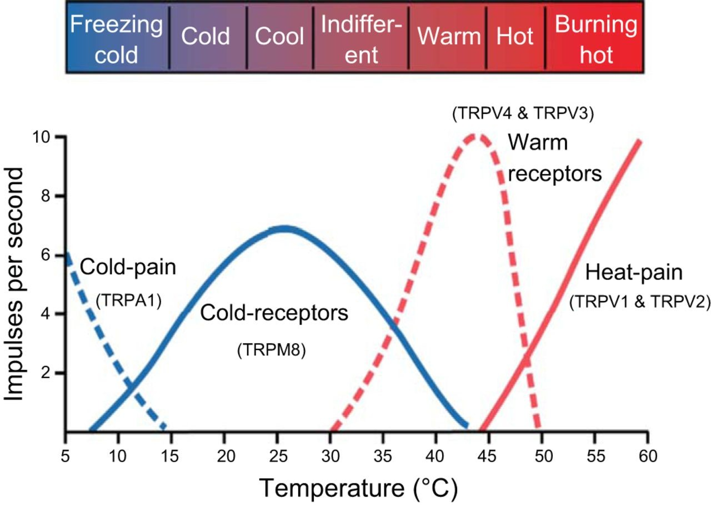

<!-- .slide: data-auto-animate-restart id="MEDI2101Wk9" -->
#### MEDI2101 Cardiovascular and Respiratory System.
### Block 3: Cardiovascular and respiratory integration
# LO3.2: Thermoregulation
(Week 9)
##### Dr Mark Butlin (PhD, BE, SFHEA) (he/him)

Based partially on the lecture of Dr Karen Peebles, Department of Health Professions.

Macquarie Medical School, Faculty of Medicine, Health and Human Sciences Macquarie University. On the land of the Wallumattagal clan of the Dharug Nation.

&nbsp;

&nbsp;

&nbsp;

This material is provided to you as a Macquarie University student for your individual research and study purposes only. You cannot share this material without permission. Macquarie University is the copyright owner of (or has licence to use) the intellectual property in this material. Legal and/or disciplinary actions may be taken if this material is shared without the University’s written permission.

--
### Feedback - Assessment Task 2: Anatomy test
#### Dr Mirjana Strkalj

Dichotomous modified Angoff method, passing score = 60%.

--
###  MEDI2101 Cardiovascular and Respiratory System
#### Looking back on: Assessment task 3.1

Cannot say too much, as some people are yet to submit under special consideration.

The aim is to have marks back to you as quickly as possible (single marker), to use that feedback in Assessment Task 3.2.

<!-- isometric exercise feedback
- Consider relative magnitude of contribution. e.g.
  - Venous return of blood: small blood volume in forearm + isometric exercise (negligible skeletal muscle pump) = very little effect on venous return of blood
  - and, (no marks deducted for Assessment Task 3.1) submaximal isometric exercise in one arm over three minutes unlikely to change systemic blood gases (no chemoreceptor response)
- A few hints moving into Assessment Task 3.2:
  - Skeletal muscle doing work means **metabolism** and generation of metabolic products.
  - Chemoreceptors (actually not that applicable in this experiment) communicate to the respiratory centre <b>and the vasomotor center</b> of the brain.
  - Assessment Task description: "Some of the references in the manuscript may also be helpful for the assessment task." -->

<!-- 

&nbsp;

R. K. Khurana and A. Setty, "The value of the isometric hand-grip test-studies in various autonomic disorders," Clinical Autonomic
Research, vol. 6, no. 4, pp. 211–218, Aug. 1996.
 -->

--
###  MEDI2101 Cardiovascular and Respiratory System
#### Looking back on: Assessment task 3.1

Frank-**Starling** mechanism.

<em>Not</em> Frank-<b>Sterling</b>

<em>Not</em> Frank-<b>Stalin</b>

--
###  MEDI2101 Cardiovascular and Respiratory System
#### Looking ahead to: Assessment task 3.2

<a href="https://ilearn.mq.edu.au/course/view.php?id=53730#section-18" target="\_blank">Description of AT3.2 Manuscript discussion, in iLearn.</a>

Data summary will be made available sometime this week (perhaps on the weekend).

--
###  MEDI2101 Cardiovascular and Respiratory System
#### Looking further ahead to: Assessment Task 4 (Final Examination)

Front page and second page of the final examination are <a href="https://ilearn.mq.edu.au/course/view.php?id=64513#section-25" target="\_blank"> available on iLearn</a>.

--
###  MEDI2101 Cardiovascular and Respiratory System
#### To do in Week 9

<a href="https://ilearn.mq.edu.au/course/view.php?id=64513#section-17"> MEDI2101 iLearn Week 9</a>

---
<!-- .slide: data-auto-animate-restart -->
## LO3.2.1 State what normal body temperatures are and the consequences when temperature moves outside those ranges.

--
### Normal body temperature
####

***Core*** body temperature (deep body tissue) is very constant (±0.6°C*).

Nominally, it is said that core body temperature is 37.5°C.

But core body temperature varies from person to person.

Body temperature also varies with:

<ul>
    <li>time of day: ~35.7°C in the morning and ~37.2°C in the evening.</li>
    <li>month: ~0.5°C higher in the luteal phase than in the follicular phase as oestrogen decreases and progesterone increases.</li>
    <li>age</li>
    <li>pathology (e.g. fever)</li>
</ul>

&nbsp;

* Chapter 74, Guyton & Hall Textbook of Medical Physiology.

--
### Normal body temperature
####

If core temperature:

<ul>
    <li><b>exceeds 41°C:</b> lethal, cytotoxicity, proteins denature and impaired DNA synthesis.</li>
    <li><b>drops below 34°C:</b> amnesia, hypothermia.</b></li>
    <li><b>drops below 30°C:</b> arrhythmia and cardiac arrest. Water crystallization in superficial tissue.
</ul>

To ensure survival warm-blooded (endothermic) animals need mechanisms to preserve body temperature.

<b>Thermoregulation (the ability to maintain core body temperature) is one of the most vital functions of the body.</b>

Measuring body temperatures is a vital sign.

--
### Normal body temperature
#### Body temperature varies with site of measurement

    

        
        
Shell (skin) temperature ~4°C cooler than core temperature - but highly variable.

    

    

        
    

    

        
<a href="https://doi.org/10.1046/j.1471-6712.2002.00069.x">Sund-Levander et. al. Normal oral, rectal, tympanic and axillary body temperature in adult men and women: a systematic literature review. Scandinavian Journal of Caring Sciences (2002),16:122-128.</a> Chapter 74 Guyton & Hall Textbook of Medical Physiology.

    

--
<!-- .slide: data-background-image="images/WorldTemperaturesAnimation.gif" -->

Core temperature is maintained (±0.6°C)

under all sorts of environmental conditions.

---
<!-- .slide: data-auto-animate-restart -->
## LO3.2.2 Describe heat balance and the types of heat transfer.

--
### Thermal balance
#### The heat balance equation

heat storage = metabolism - work - evaporation ± conduction ± convection ± radiation

--
### Thermal balance
#### Metabolism

heat storage = metabolism - work - evaporation ± conduction ± convection ± radiation

<a href="https://chart-studio.plotly.com/~aatish/115.embed">"aatish", Plotly</a>

<!-- https://chart-studio.plotly.com/~aatish/115.embed{"x": [37.8, 196.5, 69.125, 325, 21.5, 58.588, 20.5, 3.6, 10, 7.72, 5.444, 1.215, 1.769, 4.44, 4.725, 37.9, 37.2, 10.5, 9.4, 10.1, 3.6, 8.4, 98, 50.4, 137.9, 0.54, 0.611, 0.85, 34.3, 8.1, 2.95, 12.7, 10, 0.9, 0.92, 11.05, 0.075, 0.225, 0.66, 0.624, 9, 5.74, 1.28, 3.67, 4, 2.343, 1.16, 5.075, 6.696, 14.28, 2.01, 2.26, 1.698, 4.27, 3.16, 0.0078, 0.0085, 0.00827, 0.148, 0.056, 0.0156, 0.0169, 0.0086, 0.0165, 0.0094, 0.0192, 0.014, 0.004900000000000001, 0.0054, 0.027, 0.061, 0.0115, 0.0639, 0.045200000000000004, 0.0701, 0.0149, 0.019899999999999998, 0.09609999999999999, 0.0294, 0.0366, 0.027800000000000002, 0.0161, 0.0096, 0.0197, 0.022, 0.011699999999999999, 0.0087, 0.0335, 0.0356, 0.0842, 0.0219, 0.0095, 0.0095, 0.0205, 0.0219, 0.027399999999999997, 0.0162, 0.0088, 0.037399999999999996, 0.2414, 0.0737, 0.4043, 0.1795, 0.0516, 0.0159, 0.0124, 0.0533, 0.030899999999999997, 0.0404, 0.0136, 0.023600000000000003, 0.5622, 0.5207999999999999, 0.598, 0.19419999999999998, 0.2545, 0.362, 1.0243, 0.146, 0.0915, 0.0159, 0.022, 0.0175, 0.0104, 0.0112, 0.1072, 0.01091, 0.0052, 0.0037, 0.008, 0.01025, 2, 2.21, 2.4, 2.25, 2.75, 0.07, 0.044, 0.02, 0.45, 0.7212000000000001, 0.8227000000000001, 0.75, 0.4, 0.0578, 0.45, 0.0205, 0.010199999999999999, 0.010199999999999999, 0.0332, 0.01, 0.011699999999999999, 0.011800000000000001, 0.0389, 0.0173, 0.0104, 0.0065, 0.0147, 0.0062, 0.013099999999999999, 0.0171, 0.004, 0.0079, 0.00805, 0.0035, 0.0091, 0.004, 0.009699999999999999, 0.0052, 0.0024, 0.030199999999999998, 0.049, 0.011800000000000001, 0.048, 0.061, 0.061200000000000004, 0.1301, 0.1164, 0.006900000000000001, 0.1019, 0.133, 0.0777, 0.012199999999999999, 0.0446, 0.044, 0.53, 0.65, 3, 1.581, 3.0044, 2.3, 3.025, 2.43, 2, 0.6724, 0.109, 0.1277, 0.0453, 0.05, 0.046490000000000004, 0.06297, 0.04531, 0.053, 0.039, 0.20611000000000002, 15.91, 4.22, 1.43, 3.6375, 1.365, 0.19, 0.1168, 0.225, 4.67, 0.82, 0.875, 8.5, 10.45, 3, 9.5, 16.9, 0.3, 3.35, 2.33, 0.206, 0.2615, 0.17, 0.1715, 0.0638, 0.284, 1.16, 0.95, 1.314, 0.964, 0.113, 0.173, 9.156, 0.63, 0.406, 0.62, 0.094, 0.138, 0.06, 0.075, 0.0795, 0.102, 0.267, 0.195, 0.088, 0.032, 2.63, 0.775, 2.456, 0.629, 1.613, 0.322, 0.801, 0.255, 0.426, 6.784, 0.34, 0.3, 0.215, 0.214, 0.49, 0.121, 3.849, 2.687, 0.914, 0.16, 0.075, 0.139, 0.022, 0.01, 0.0238, 0.498, 0.323, 3.28, 11.136, 0.197, 0.173, 0.143, 0.10679999999999999, 0.085, 0.0291, 0.022, 0.019600000000000003, 0.0395, 0.015, 0.016, 0.0606, 0.106, 0.0633, 0.0365, 0.0572, 0.0378, 0.046799999999999994, 0.06420000000000001, 0.0693, 0.07579999999999999, 0.048100000000000004, 0.0438, 0.011, 0.0152, 0.0083, 0.0089, 26.385, 11.3, 0.024, 0.0423, 0.042, 0.055549999999999995, 0.02702, 0.03225, 0.06420000000000001, 0.031, 0.024, 0.037700000000000004, 0.023899999999999998, 0.0205, 0.0404, 0.023899999999999998, 0.0218, 0.092, 0.062299999999999994, 0.00715, 0.016, 0.0169, 0.0501, 0.344, 0.062, 0.032799999999999996, 0.0346, 0.027, 0.023399999999999997, 0.027, 0.028, 0.0183, 0.0223, 0.2132, 1.87, 0.030699999999999998, 0.362, 0.07193000000000001, 0.05962, 0.0175, 0.0654, 0.0339, 0.0461, 0.0299, 0.038799999999999994, 0.0353, 0.027600000000000003, 0.0297, 0.028399999999999998, 0.052399999999999995, 0.0126, 0.1085, 0.0694, 0.9, 0.1379, 0.0303, 0.08, 0.0502, 0.0475, 0.05053, 0.0217, 0.0768, 0.0415, 0.1108, 0.069, 0.112, 0.067, 0.098, 0.00737, 0.028, 0.02, 0.0402, 0.0531, 0.044, 0.0438, 0.0286, 0.0288, 0.0351, 0.046700000000000005, 0.0337, 0.0389, 0.0255, 0.06565, 0.0178, 0.0522, 0.0685, 0.0674, 0.008060000000000001, 0.0218, 0.0264, 0.09378, 0.138, 0.134, 0.135, 0.134, 0.201, 0.2581, 0.183, 0.2051, 0.187, 0.11, 0.032299999999999995, 0.0342, 0.0195, 0.0282, 1.0046, 0.019100000000000002, 0.102, 0.11329, 0.096, 0.0835, 0.0865, 0.0232, 0.0476, 0.0455, 0.0496, 0.0159, 0.0215, 0.0215, 0.02, 0.026, 0.0228, 0.023190000000000002, 0.019530000000000002, 0.019100000000000002, 0.01893, 0.02038, 0.06620000000000001, 0.024579999999999998, 0.012, 0.028300000000000002, 0.033299999999999996, 0.0332, 0.0215, 0.0257, 0.049, 0.059, 0.036, 0.0628, 0.055, 0.0308, 0.0798, 0.012199999999999999, 0.1657, 0.076, 0.109, 0.187, 0.2506, 0.0787, 0.009, 0.0396, 0.0613, 0.012, 0.0152, 0.0569, 0.1378, 0.1378, 0.1393, 0.1286, 0.1151, 0.03754, 0.0842, 0.191, 0.1065, 0.087, 0.15762, 0.13240000000000002, 0.812, 0.2, 0.0235, 0.0678, 0.112, 0.1761, 0.193, 0.1732, 0.152, 0.1186, 0.135, 0.0714, 2.3, 0.09570000000000001, 1.1122999999999998, 0.46, 0.1123, 0.06, 0.095, 0.244, 0.06425, 0.23, 4.295, 2.65, 0.2236, 0.36660000000000004, 0.206, 0.624, 0.44, 0.32, 0.5996, 0.303, 0.24, 0.237, 0.24, 0.65, 0.274, 0.2522, 0.174, 0.167, 0.229, 0.2054, 0.68, 0.039, 0.0571, 0.075, 0.0458, 0.0694, 0.0874, 0.2283, 0.202, 0.542, 0.602, 0.058, 0.123, 0.2606, 48, 3.79, 4.33, 2.15, 1.11, 4.54, 3.51, 8.19, 45.19, 1.16, 1.74, 3.77, 0.24, 30.6, 3.977, 3.5, 0.0258, 0.0242, 0.0465, 0.0282, 0.0669, 0.101, 0.0917, 1.354, 0.558, 1.782, 0.982, 0.0116, 0.157, 0.0091, 0.0070999999999999995, 0.0108, 0.0070999999999999995, 0.0431, 5.775, 0.016399999999999998, 0.019350000000000003, 0.019, 0.4, 0.329, 0.935, 1.165, 2.488, 0.812, 0.751, 0.013, 0.122, 0.336, 0.0755, 0.104, 0.014, 0.0443, 0.018600000000000002, 0.0126, 0.07, 6.96, 2.66, 4.878, 29.3, 32.49, 2.674, 0.127, 0.166, 4.25, 2.005, 4.765, 1.385, 1.018, 0.976, 2.82, 1.141, 0.861, 0.916, 0.01, 29.917, 0.034, 0.695, 0.616, 1.276, 0.428, 1.551, 0.717, 1.294, 0.837, 0.645, 0.693, 10.3, 2.725, 3.58, "1542", "70", "0.0447"], "y": [0.2465079365079365, 0.20988295165394402, 0.2766003616636528, 0.15821230769230768, 0.3864186046511628, 0.4371031610568717, 0.29, 0.38166666666666665, 0.2687, 0.5, 0.2799412196914034, 0.47983539094650207, 0.5014132278123233, 0.55, 0.525079365079365, 0.2369920844327177, 0.23768817204301076, 0.2977142857142857, 0.44893617021276594, 0.3105940594059406, 0.2602777777777778, 0.2067857142857143, 0.173, 0.22200396825396826, 0.17400290065264684, 0.7592592592592593, 0.6595744680851063, 0.36470588235294116, 0.16699708454810497, 0.2708641975308642, 0.4138983050847458, 0.4483464566929134, 0.45, 0.6611111111111111, 0.7793478260869565, 0.2700452488687783, 2.2, 1.0711111111111111, 0.7393939393939394, 0.4807692307692308, 0.3, 0.1529616724738676, 0.4953125, 0.32888283378746597, 0.248, 0.33973538198890313, 0.4, 0.3150738916256158, 0.1260454002389486, 0.16001400560224088, 0.2751243781094527, 0.4008849557522124, 0.43992932862190814, 0.20210772833723653, 0.43481012658227847, 1.4871794871794872, 1.7058823529411764, 1.1366384522370012, 0.10945945945945945, 2.4839285714285713, 2.551282051282051, 1.3313609467455623, 2.36046511627907, 0.48484848484848486, 2.595744680851064, 0.7968750000000001, 2.1928571428571426, 4.693877551020408, 1.1296296296296295, 0.3074074074074074, 0.5180327868852459, 6.156521739130435, 0.6682316118935838, 1.725663716814159, 1.0955777460770328, 7.248322147651007, 2.1658291457286434, 0.3236212278876171, 4.806122448979592, 0.9480874316939891, 1.3417266187050358, 2.3975155279503104, 1.84375, 1.4923857868020305, 1.8090909090909089, 3.760683760683761, 1.67816091954023, 0.33134328358208953, 1.345505617977528, 0.4608076009501187, 4.575342465753425, 4.726315789473684, 1.7052631578947368, 0.9073170731707317, 1.821917808219178, 1.9416058394160587, 3.401234567901235, 3.590909090909091, 0.4973262032085562, 0.19676884838442418, 2.360922659430122, 0.18402176601533515, 2.0495821727019496, 2.761627906976744, 3.0188679245283017, 1.4919354838709677, 0.4071294559099437, 1.401294498381877, 0.6757425742574258, 4.75, 0.8644067796610169, 0.04357879758093205, 0.5581797235023042, 0.48511705685618733, 1.6318228630278064, 0.49666011787819253, 0.3726519337016575, 0.23674704676364347, 5.507534246575343, 1.3398907103825135, 6.559748427672956, 0.9954545454545454, 1.0685714285714285, 2.423076923076923, 1.8571428571428574, 0.146455223880597, 8.643446379468378, 5, 2.4054054054054053, 0.6, 1.0926829268292682, 0.36, 0.3398190045248869, 0.275, 0.4, 0.42872727272727273, 1.21, 1.1704545454545454, 0.5, 0.33, 0.6999445368829728, 0.42202503950407194, 0.45, 0.38, 1.0397923875432526, 0.25, 3.1999999999999997, 3.3039215686274517, 2.196078431372549, 1.3403614457831323, 2.6, 2.5470085470085473, 2.101694915254237, 1.5012853470437018, 1.7976878612716762, 2.2019230769230766, 2.9076923076923076, 1.5034013605442178, 3.096774193548387, 5.099236641221374, 3.198830409356725, 3.3, 6.10126582278481, 7.478260869565217, 9, 5.7032967032967035, 7.7, 5.391752577319588, 5.403846153846154, 6, 1.9701986754966887, 2.2510204081632654, 3.9406779661016946, 1.4104166666666667, 1.2491803278688525, 1.0473856209150325, 0.8370484242890085, 1.1503436426116838, 1.1159420289855073, 0.7114818449460255, 0.4819548872180451, 0.7194337194337194, 2.6229508196721314, 1.26457399103139, 0.990909090909091, 0.23, 0.20107692307692307, 0.55, 0.9601518026565465, 0.36013846358673945, 0.57, 0.7001652892561984, 0.5201646090534979, 0.57, 0.6513979773944081, 1.5321100917431192, 1.9498825371965545, 0.9646799116997794, 1.09, 1.1185201118520112, 1.052882324916627, 1.0549547561244756, 1.0735849056603772, 1.341025641025641, 0.870894182717966, 0.07800125707102451, 0.262085308056872, 0.16013986013986015, 0.1836426116838488, 0.2021978021978022, 0.8, 1.0017123287671232, 1.04, 0.4400428265524625, 0.5390243902439025, 0.9154285714285715, 0.39905882352941174, 0.28497607655502394, 0.356, 0.29242105263157897, 0.3045562130177515, 0.65, 0.2, 0.3201716738197425, 0.6359223300970874, 0.8260038240917782, 0.3, 0.7988338192419825, 0.9247648902821317, 0.4507042253521127, 0.2353448275862069, 0.4336842105263158, 0.5357686453576864, 0.3392116182572614, 0.6814159292035398, 0.861271676300578, 0.30000000000000004, 0.44, 0.5300492610837438, 0.49, 0.7404255319148936, 0.5702898550724638, 0.98, 0.9, 0.6981132075471698, 0.7999999999999999, 0.6, 0.5933333333333334, 0.85, 0.640625, 0.22999999999999998, 0.3429677419354839, 0.3, 0.5500794912559619, 0.4500309981401116, 0.8198757763975155, 0.4500624219725343, 0.6890196078431372, 0.46995305164319245, 0.27999705188679247, 0.3429411764705882, 0.63, 0.8702325581395348, 0.5126168224299066, 0.45, 0.9057851239669421, 0.4899974019225773, 0.5800148864905099, 0.5499999999999999, 0.7575000000000001, 1.2306666666666666, 1, 1.8, 3.2, 1.5, 0.6299196787148594, 0.639938080495356, 0.27999999999999997, 0.25, 0.7000000000000001, 0.7699421965317919, 0.8398601398601399, 1.3295880149812735, 0.8505882352941176, 1.1855670103092784, 0.9681818181818183, 1.3724489795918366, 1.250632911392405, 1.1933333333333331, 1.4, 1.0495049504950495, 0.869811320754717, 1.156398104265403, 1.1643835616438356, 1.1695804195804196, 1.2195767195767198, 1.371794871794872, 1.1573208722741433, 1.4502164502164503, 1.3073878627968338, 1.1205821205821205, 1.0707762557077627, 2.7454545454545456, 1.3026315789473686, 2.08433734939759, 1.0674157303370786, 0.25000189501610764, 0.209, 1.9000000000000001, 1.3593380614657211, 1.1, 0.7722772277227723, 1.6321243523316062, 2.586046511627907, 0.8847352024922117, 1.5, 1.7, 3.209549071618037, 1.8117154811715481, 2.4390243902439024, 1.3861386138613863, 1.8117154811715481, 2.701834862385321, 1.1597826086956522, 1.5698234349919744, 2.3916083916083917, 1.8, 1.6331360946745563, 1.4910179640718564, 0.5, 1.3596774193548387, 2.4695121951219514, 1.869942196531792, 1.8296296296296295, 2.7094017094017095, 2.1999999999999997, 2.75, 3.33879781420765, 2.210762331838565, 0.7631332082551595, 0.61, 1.4299674267100977, 0.6400552486187845, 1.2206311691922702, 1.6571620261657163, 1.7085714285714284, 1.2905198776758409, 1.0265486725663717, 0.8026030368763557, 1.060200668896321, 0.8969072164948454, 1.0991501416430596, 1.0615942028985508, 1.430976430976431, 0.7816901408450705, 0.8301526717557253, 1.0714285714285714, 0.7502304147465438, 1.2103746397694524, 0.587, 0.8803480783176215, 1.6600660066006598, 2.4, 1.796812749003984, 1.2126315789473685, 1.2170987532159112, 0.9493087557603688, 1.4401041666666667, 0.7903614457831325, 1.1200361010830324, 0.7898550724637681, 0.8803571428571428, 1.1507462686567163, 1.5, 2.8629579375848033, 2.2714285714285714, 3.1, 1.9104477611940296, 1.3898305084745761, 1.55, 1.8310502283105026, 2.36013986013986, 1.628472222222222, 2.373219373219373, 1.6937901498929333, 2.99406528189911, 1.9305912596401027, 2.2901960784313724, 1.9497334348819495, 2.7808988764044944, 1.7318007662835249, 1.4394160583941604, 0.8694362017804154, 2.9776674937965257, 2.8394495412844036, 3.541666666666667, 1.3521006611217743, 0.860144927536232, 0.7597014925373134, 0.8503703703703703, 0.617910447761194, 0.7398009950248756, 0.839984502130957, 0.7349726775956285, 0.8220380302291566, 0.7898395721925133, 0.79, 1.3993808049535605, 1.219298245614035, 1.38974358974359, 1.8085106382978724, 0.6399562014732232, 1.5497382198952878, 0.8323529411764706, 1.1801571188984021, 1.1104166666666666, 1.089820359281437, 0.9699421965317919, 2.3405172413793105, 1.1008403361344536, 1, 1.1693548387096775, 1.578616352201258, 1.5395348837209304, 1.7209302325581395, 1.6600000000000001, 2.2, 1.6184210526315788, 1.9879258300991807, 2.0378904249871987, 2.0418848167539267, 2.0813523507659797, 1.8400392541707558, 1.3700906344410877, 1.7697314890154598, 1.7916666666666667, 1.6501766784452296, 1.8798798798798801, 1.5301204819277106, 3.130232558139535, 1.5914396887159532, 1.3408163265306123, 1.2101694915254237, 1.261111111111111, 1.0987261146496816, 1.030909090909091, 1.6785714285714286, 1.050125313283208, 1.9098360655737707, 0.7423053711526856, 1.1105263157894738, 0.5798165137614679, 0.5700534759358289, 0.5818036711891461, 0.9758576874205844, 2.5, 0.8106060606060607, 0.8401305057096249, 2.6, 2.098684210526316, 0.7803163444639719, 1.4753265602322205, 1.5050798258345428, 1.6539842067480257, 1.4502332814930017, 1.3397046046915726, 0.500799147575919, 1.157957244655582, 0.7900523560209425, 1.7098591549295774, 0.8701149425287357, 0.8412637990102778, 0.6593655589123867, 0.7029556650246305, 0.79, 2.6808510638297873, 0.9793510324483777, 1.0803571428571428, 1.040885860306644, 0.8818652849740932, 0.9901847575057737, 0.8598684210526315, 0.9696458684654301, 0.7911111111111111, 1.0798319327731092, 0.345, 0.9811912225705329, 0.38002337498876204, 0.525, 0.8504007123775601, 1.7016666666666667, 0.9431578947368421, 0.743032786885246, 1.0505836575875487, 0.5800000000000001, 0.36, 0.25, 0.6498211091234348, 0.710038188761593, 0.85, 0.6900641025641026, 0.8400000000000001, 0.45999999999999996, 0.5300200133422281, 0.4201320132013201, 0.95, 0.6050632911392405, 0.47, 0.8, 0.47992700729927007, 0.6399682791435369, 0.5298850574712644, 0.5598802395209581, 0.45982532751091704, 0.6835443037974683, 0.9810294117647059, 1.4794871794871796, 1.6865148861646233, 1.0506666666666666, 1.587336244541485, 1.6296829971181555, 1.0297482837528604, 1.1151992991677617, 1.5999999999999999, 0.602029520295203, 0.5649501661129569, 0.75, 0.7601626016260162, 0.8599386032233307, 0.128, 0.18100263852242743, 0.2117782909930716, 0.26, 0.2756756756756757, 0.17797356828193833, 0.24643874643874644, 0.15103785103785103, 0.0670059747731799, 0.1810344827586207, 0.22586206896551725, 0.15994694960212202, 0.475, 0.08519607843137254, 0.2494342469197888, 0.25685714285714284, 0.9806201550387597, 0.9793388429752066, 0.9698924731182796, 1.1985815602836878, 0.9417040358744394, 0.504950495049505, 0.781897491821156, 0.4200147710487445, 0.43548387096774194, 0.33002244668911335, 0.40346232179226066, 1.353448275862069, 0.8101910828025478, 0.7692307692307693, 1.591549295774648, 1.111111111111111, 1.591549295774648, 0.6310904872389791, 0.22950649350649352, 1.530487804878049, 1.1627906976744184, 1.131578947368421, 0.35600000000000004, 0.6838905775075987, 0.48877005347593583, 0.4901287553648069, 0.33440514469453375, 0.5, 0.45006657789613846, 1.4615384615384615, 0.8032786885245902, 0.6101190476190477, 0.7549668874172185, 0.5769230769230769, 1.0785714285714285, 0.8306997742663657, 1.1989247311827957, 1.492063492063492, 0.86, 0.205, 0.32, 0.2849938499384994, 0.194, 0.18, 0.3120044876589379, 0.7078740157480315, 0.6198795180722891, 0.26901176470588234, 0.3648877805486284, 0.21699895068205666, 0.4630324909747292, 0.5514734774066797, 0.42663934426229505, 0.37999999999999995, 0.5029798422436459, 0.47502903600464574, 0.46997816593886466, 2.9, 0.09999999999999999, 0.6294117647058823, 0.4906474820143885, 0.4902597402597403, 0.42398119122257055, 0.35046728971962615, 0.37008381689232756, 0.30962343096234307, 0.34775888717156106, 0.5017921146953405, 0.48992248062015503, 0.27994227994227994, 0.11796116504854369, 0.1581651376146789, 0.15307262569832403, "0.164", "0.21", "1.81"], "uid": "f23eef", "fill": "none", "mode": "markers", "name": "Metabolic Rate per kg  (Liters of O2 \/ hour \/ kg)", "text": ["Antilocapra americana", "Connochaetes taurinus", "Ovis canadensis", "Alces alces", "Capreolus capreolus", "Odocoileus virginianus", "Pecari tajacu", "Alopex lagopus", "Canis latrans", "Canis mesomelas", "Cerdocyon thous", "Fennecus zerda", "Vulpes macrotis", "Vulpes vulpes", "Vulpes vulpes alascensis", "Acinonyx jubatus", "Felis concolor", "Felis pardalis", "Felis rufus", "Felis serval", "Felis wiedii", "Felis yagouaroundi", "Panthera leo", "Panthera onca", "Panthera tigris", "Galerella sanguinea", "Herpestes javanicus", "Suricata suricatta", "Hyaena hyaena", "Proteles cristatus", "Eira barbara", "Gulo gulo", "Lutra lutra", "Martes americana", "Martes martes", "Meles meles", "Mustela erminea", "Mustela frenata", "Mustela vison", "Spilogale putorius", "Taxidea taxus", "Ailurus fulgens", "Bassariscus sumichrasti", "Nasua narica", "Nasua nasua", "Potos flavus", "Procyon cancrivorus", "Procyon lotor", "Ursus ursinus", "Arctictis binturong", "Arctogalidia trivirgata", "Fossa fossana", "Genetta tigrina", "Nandinia binotata", "Paradoxurus hermaphroditus", "Saccopteryx bilineata", "Hipposideros galeritus", "Rhinonycteris aurantius", "Macroderma gigas", "Eumops perotis", "Molossus molossus", "Tadarida brasiliensis", "Mormoops blainvilli", "Mormoops megalophylla", "Pteronotus davyi", "Pteronotus parnellii", "Pteronotus personatus", "Pteronotus quadridens", "Natalus tumidirostris", "Noctilio albiventris", "Noctilio leporinus", "Anoura caudifera", "Artibeus fimbriatus", "Artibeus jamaicensis", "Artibeus lituratus", "Carollia perspicillata", "Chiroderma doriae", "Chrotopterus auritus", "Desmodus rotundus", "Diaemus youngi", "Diphylla ecaudata", "Erophylla bombifrons", "Glossophaga soricina", "Koopmania concolor", "Leptonycteris curasoae", "Macrotus californicus", "Monophyllus redmani", "Phyllostomus discolor", "Phyllostomus elongatus", "Phyllostomus hastatus", "Platyrrhinus lineatus", "Rhinophylla fischerae", "Rhinophylla pumilio", "Sturnia tildae", "Sturnira lilium", "Tonatia bidens", "Uroderma bilobatum", "Vampyressa pusilla", "Cynopterus brachyotis", "Dobsonia anderseni", "Dobsonia minor", "Dobsonia moluccensis", "Dobsonia praedatrix", "Eonycteris spelaea", "Macroglossus minimus", "Megaloglossus woermanni", "Melonycteris melanops", "Nyctimene albiventer", "Nyctimene cyclotis", "Nyctimene major", "Paranyctimene raptor", "Pteropus giganteus", "Pteropus hypomelanus", "Pteropus poliocephalus", "Pteropus pumilus", "Pteropus rodricensis", "Pteropus scapulatus", "Pteropus vampyrus", "Rousettus aegyptiacus", "Rousettus amplexicaudatus", "Syconycteris australis", "Antrozous pallidus", "Chalinolobus gouldii", "Eptesicus fuscus", "Histiotus velatus", "Miniopterus gigas australis?", "Miniopterus schreibersi", "Myotis lucifuga", "Myotis nigricans", "Nyctophilus geoffroyi", "Plecotus auritus", "Heterohyrax brucei", "Dendrohyrax dorsalis", "Procavia capensis", "Procavia habessinica", "Procavia johnstoni", "Amblysomus hottentotus", "Chrysochloris asiatica", "Eremitalpa granti namibensis", "Atelerix albiventris", "Echinosorex gymnura", "Erinaceus concolor", "Erinaceus europaeus", "Hemiechinus auritus", "Hylomys suillus", "Paraechinus aethiopicus", "Blarina brevicaudata", "Blarina carolinensis", "Crocidura crossei", "Crocidura flavescens", "Crocidura hildegardeae", "Crocidura leucodon", "Crocidura luna", "Crocidura olivieri", "Crocidura poensis", "Crocidura russula", "Crocidura suaveolens", "Crocidura viaria", "Cryptotis parva", "Neomys anomalus", "Neomys fodiens", "Notiosorex crawfordi", "Sorex alpinus", "Sorex araneus", "Sorex cinereus", "Sorex coronatus", "Sorex minutus", "Sorex ornatus", "Sorex vagrans", "Suncus etruscus", "Suncus murinus", "Condylura cristata", "Neurotrichus gibbsii", "Scalopus aquaticus", "Scapanus latimanus", "Scapanus orarius", "Scapanus townsendii", "Echinops telfari", "Geogale aurita", "Hemicentetes nigriceps", "Hemicentetes semispinosus", "Limnogale mergulus", "Microgale cowani", "Microgale dobsoni", "Microgale talazaci", "Setifer setosus", "Tenrec ecaudatus", "Lepus alleni", "Lepus americanus", "Lepus arcticus", "Lepus californicus", "Lepus timidus", "Lepus townsendii", "Oryctolagus cuniculus", "Sylvilagus audubonii", "Ochotona princeps", "Ochotona dauurica", "Elephantulus brachyrhynchus", "Elephantulus edwardii", "Elephantulus intufi", "Elephantulus myurus", "Elephantulus rozeti", "Elephantulus rufescens", "Macroscelides proboscideus", "Petrodromus tetradactylus", "Manis crassicaudata", "Manis javanica", "Manis tetradactyla", "Manis pentadactyla", "Manis tricuspis", "Callithrix jacchus", "Cebuella pygmaea", "Saguinus geoffroyi", "Alouatta palliata", "Aotus trivirgatus", "Saimiri sciureus", "Cercopithecus mitis", "Colobus guereza", "Erythrocebus patas", "Papio anubis", "Papio ursinus", "Cheirogaleus medius", "Propithecus verreauxi", "Eulemur fulvus", "Arctocebus calabarensis", "Euoticus elegantulus", "Galago moholi", "Galago senegalensis", "Galagoides demidoff", "Loris tardigradus", "Nycticebus coucang", "Otolemur crassicaudatus", "Otolemur garnettii", "Perodicticus potto", "Tarsius syrichta", "Tarsius spectrum", "Agouti paca", "Aplodontia rufa", "Bathyergus janetta", "Bathyergus suillus", "Cryptomys bocagei", "Cryptomys damarensis", "Cryptomys darlingi", "Cryptomys hottentotus", "Cryptomys hottentotus amatus", "Cryptomys hottentotus natalensis", "Cryptomys mechowi", "Georychus capensis", "Heliophobius argentocinereus", "Heterocephalus glaber", "Capromys pilorides", "Geocapromys ingrahami", "Geocapromys brownii", "Cavia porcellus", "Dolichotis salinicola", "Galea musteloides", "Kerodon ruprestris", "Microcavia niata", "Chinchilla laniger", "Lagostomus maximus", "Ctenomys australis", "Ctenomys fulvus", "Ctenomys maulinus", "Ctenomys opimus", "Ctenomys peruanus", "Ctenomys talarum", "Dasyprocta azarae", "Dasyprocta leporina", "Myoprocta acouchy", "Dipus sagitta?", "Jaculus jaculus", "Jaculus orientalis", "Napaeozapus insignis", "Sicista betulina", "Zapus hudsonicus", "Proechimys semispinosus", "Thrichomys apereoides", "Coendou prehensilis", "Erethizon dorsatum", "Geomys bursaris", "Geomys pinetis", "Thomomys bottae", "Thomomys talpoides", "Thomomys umbrinus", "Chaetodipus baileyi", "Chaetodipus californicus", "Chaetodipus fallax", "Chaetodipus hispidus", "Chaetodipus intermedius", "Chaetodipus penicillatus", "Dipodomys agilis", "Dipodomys deserti", "Dipodomys heermanni", "Dipodomys merriami", "Dipodomys microps", "Dipodomys nitratoides", "Dipodomys ordii", "Dipodomys panamintinus", "Heteromys anomalus", "Heteromys desmarestianus", "Liomys irroratus", "Liomys salvani", "Microdipodops megacephalus", "Microdipodops pallidus", "Perognathus flavus", "Perognathus longimembris", "Hydrochaeris hydrochaeris", "Hystrix africaeaustralis", "Abrothrix lanosus", "Abrothrix longipilis", "Acomys cahirinus", "Acomys russatus", "Acomys spinosissimus", "Acomys subspinosus", "Aethomys namaquensis", "Akodon albiventer", "Akodon azarae", "Alticola argentatus", "Apodemus flavicollis", "Apodemus hermonensis", "Apodemus mystacinus", "Apodemus sylvaticus", "Arborimus longicaudus", "Arvicola terrestris", "Auliscomys micropus", "Baiomys taylori", "Calomys ducilla?", "Calomys musculinus", "Calomys venustus", "Cannomys badius", "Chelemys macronyx", "Chionomys nivalis", "Chroeomys anadinus", "Chroeomys olivaceus", "Cleithrionomys glareolus", "Cleithrionomys rufocanus", "Cleithrionomys rutilus", "Clethrionomys californicus", "Clethrionomys gapperi", "Conilurus penicillatus", "Cricetomys gambianus", "Cricetulus migratorius", "Cricetus cricetus", "Desmodillus auricularis", "Dicrostonyx groenlandicus", "Eligmodontia typus", "Euneomys chinchilloides", "Gerbillurus paeba", "Gerbillurus setzeri", "Gerbillurus tytonis", "Gerbillurus vallinus", "Gerbillus allenybi", "Gerbillus dasyurus", "Gerbillus gerbillus", "Gerbillus nanus", "Gerbillus perpallidus", "Gerbillus pusillus", "Gerbillus pyramidum", "Graomys griseoflavus", "Hydromys chrysogaster", "Isthmomys pirrensis", "Lagurus curtatus", "Lemmus lemmus", "Lemmus sibericus", "Lemniscomys griselda", "Lemniscomys rosalia", "Malacothrix typica", "Maresomys boliviensis", "Mastomys natalensis", "Megadontomys thomasi", "Meriones hurriane", "Meriones tristrami", "Meriones unguiculatus", "Mesocricetus auratus", "Micromys minutus", "Microtus agrestis", "Microtus arvalis", "Microtus brandti", "Microtus breweri", "Microtus californicus", "Microtus guentheri", "Microtus longicaudus", "Microtus mexicanus", "Microtus montanus", "Microtus ochrogaster", "Microtus oeconomus", "Microtus pennsylvanicus", "Microtus pinetorum", "Microtus richardsoni", "Microtus subterraneus", "Microtus townsendii", "Microtus xanthognathus", "Millardia meltada", "Mus minutoides", "Mus spretus", "Myopus schisticolor", "Mystromys albicaudatus", "Nannospalax ehrenbergi\u00a02n = 52", "Nannospalax ehrenbergi\u00a02n = 54", "Nannospalax ehrenbergi\u00a02n = 58", "Nannospalax ehrenbergi\u00a02n = 60", "Nannospalax leucodon", "Neofiber alleni", "Neotoma albigula", "Neotoma cinerea", "Neotoma fuscipes", "Neotoma lepida", "Notomys alexis", "Notomys cervinus", "Ochrotomys nuttalli", "Oligoryzomys longicaudatus", "Ondatra zibethicus", "Onychomys torridus", "Otomys irroratus", "Otomys sloggetti", "Otomys unisulcatus", "Oxymycterus roberti", "Parotomys brantsii", "Peromyscus boylii", "Peromyscus californicus", "Peromyscus c. insignis", "Peromyscus c. parasiticus", "Peromyscus crinitus", "Peromyscus eremicus", "Peromyscus gossypinus", "Peromyscus leucopus", "Peromyscus l. noveboracensis", "Peromyscus maniculatus", "Peromyscus m.artemisidae", "Peromyscus m. austerus", "Peromyscus m. gambeli", "Peromyscus m. nebrascensis", "Peromyscus m. sonoriensis", "Peromyscus megalops", "Peromyscus oreas", "Peromyscus polionotus", "Peromyscus sitkensis", "Peromyscus truei gilberti", "Peromyscus truei truei", "Phenacomys intermedius", "Phodopus sungorus", "Phyllotis darwini chilensis", "Phyllotis darwini darwini", "Phyllotis darwini rupestris", "Phyllotis magister", "Phyllotis xanthopygus", "Podomys floridanus", "Pseudomys gracilicaudatus", "Pseudomys hermannsburgensis", "Rattus colletti", "Rattus fuscipes", "Rattus lutreolis", "Rattus sordidus", "Rattus villosissimus", "Reithrodon auritus", "Reithrodontomys megalotis", "Rhabdomys pumilio", "Saccostomus campestris", "Scotinomys teguina", "Scotinomys xerampelinus", "Sekeetamys calurus", "Sigmodon alleni", "Sigmodon fulviventer", "Sigmodon hispidus", "Sigmodon leucotis", "Sigmodon ochrognathus", "Steatomys pratensis", "Stochomys longicaudatus", "Tachyoryctes splendens", "Tatera afra", "Tatera indica", "Tatera leucogaster", "Thallomys paedulcus", "Uromys caudimaculatus", "Myoxus glis", "Muscardenis avellanarius", "Graphiurus ocularis", "Aconaemys fuscus", "Octodon bridgesi", "Octodon degus", "Octodon lunatus", "Octodontomys gliroides", "Octomys mimax", "Spalacopus cyanus", "Tympanoctomys barrerae", "Pedetes capensis", "Ammospermophilus leucurus", "Cynomys ludovicanus", "Epixerus wilsoni", "Funisciurus congicus", "Funisciurus isabella", "Funisciurus lemnisciatus", "Funisciurus pyrrhopus", "Glaucomys volans", "Heliosciurus rufobrachium", "Marmota flaviventris", "Marmota monax", "Paraxerus cepapi", "Paraxerus palliatus ornatus", "Paraxerus palliatus tongensis", "Sciurus aberti", "Sciurus carolinensis", "Spermophilus armatus", "Spermophilus beecheyi", "Spermophilus beldingi", "Spermophilus citellus", "Spermophilus lateralis", "Spermophilus mohavensis", "Spermophilus parryi", "Spermophilus richardsoni", "Spermophilus satutatus", "Spermophilus spilosoma", "Spermophilus tereticaudus", "Spermophilus townsendii", "Spermophilus tridecemlineatus", "Spermophilus undulatus", "Tamias alpinus", "Tamias amoenus", "Tamias merriami", "Tamias minimus", "Tamias palmeri", "Tamias striatus", "Tamiasciurus hudsonicus", "Tamiasciurus hudsonicus preblei", "Xerus inauris", "Xerus princeps", "Pltilocerus lowii", "Tupaia glis", "Urogale everetti", "Orycteropus afer", "Bradypus variegatus", "Cabassous centralis", "Chaetophractus nationi", "Chaetophractus vellerosus", "Chaetophractus villosus", "Dasypus novemcinctus", "Euphractus sexcinctus", "Priodontes maximus", "Tolypeutes matacus", "Zaedyus pichi", "Choloepus hoffmanni", "Cyclopes didactylus", "Myrmecophaga tridactyla", "Tamandua mexicana", "Tamandua tetradactyla", "Antechinomys laniger", "Antechinomys laniger \u2018spenceri\u2019", "Antechinus flavipes", "Antechinus stuartii", "Antechinus swainsoni", "Dasycercus cristicaudata", "Dasyuroides byrnei", "Dasyurus geoffroyi", "Dasyurus hallucatus", "Dasyurus maculatus", "Dasyurus viverrinus", "Ningaui yvonnae", "Phascogale tapoatafa", "Planigale gilesi", "Planigale ingrami", "Planigale maculata", "Planigale tenuirostris", "Pseudantechinus macdonnellensis", "Sarcophilus harrisii", "Sminthopsis crassicaudata", "Sminthopsis macroura", "Sminthopsis murina", "Myrmecobius fasciatus", "Caluromys derbianus", "Chironectes minimus", "Didelphis marsupialis", "Didelphis virginiana", "Lutreolina crassicaudata", "Philander opossum", "Gracilinanus microtarsus", "Marmosa robinsoni", "Metachirus nudicaudatus", "Monodelphis brevicaudata", "Monodelphis domestica", "Acrobates pygmaeus", "Burramys parvus", "Cercartetus conncinnus", "Cercartetus lepidus", "Cercartetus nanus", "Dendrolagus matschiei", "Lagorchestes conspicillatus", "Macropus eugenii", "Macropus robustus", "Macropus rufus", "Setonyx brachyurus", "Petaurus breviceps", "Gymnobelideus leadbeateri", "Spilocuscus maculatus", "Trichosurus vulpecula", "Phascolarctos cinereus", "Bettongia gaimardi", "Bettongia penicillata", "Potorous tridactylus", "Aepyprimnus rufescens", "Petauroides volans", "Pseudocheirus occidentalis", "Pseudocheirus peregrinus", "Tarsipes rostratus", "Lasiorhinus latifrons", "Notoryctes caurinus", "Echymipera kalabu", "Echymipera rufescens australis", "Echymipera rufescens rufescens", "Isoodon auratus", "Isoodon macrourus", "Isoodon obesulus", "Macrotis lagotis", "Perameles gunni", "Perameles nasuta", "Ornithorhynchus anatinus", "Zaglossus bruijni", "Tachyglossus aculeatus", "Tachyglossus setosus", "Loxodonta africana", "Homo sapiens", "Microtus pennsylvanicus"], "type": "scatter", "xsrc": "aatish:113:6a0e85", "ysrc": "aatish:113:868f84", "marker": {"line": {"color": "white"}, "color": "rgb(4, 158, 215)", "symbol": "circle", "opacity": 1, "maxdisplayed": 0}, "opacity": 1, "textsrc": "aatish:113:a72ab9"}]
{"font": {"size": 12, "color": "#444", "family": "\"Droid Sans\", sans-serif"}, "title": "An ounce of a smaller creature gulps more air than an ounce of a bigger creature.", "width": 839, "xaxis": {"type": "log", "range": [-3.0487233614159743, 3.6466006736099374], "ticks": "", "title": "Weight (kg)", "nticks": 0, "showgrid": false, "showline": false, "tickfont": {"size": 10, "color": "black", "family": "\"Verdana\", monospace"}, "tickmode": "auto", "zeroline": false, "autorange": true, "tickangle": "auto", "titlefont": {"size": 12, "color": "black", "family": "\"Verdana\", monospace"}, "showexponent": "all", "exponentformat": "B", "showticklabels": true}, "yaxis": {"type": "log", "range": [-1.5149943233393786, 1.108512075871814], "ticks": "", "title": "Metabolic Rate per kg  (Liters of O2 \/ hour \/ kg)", "nticks": 0, "showgrid": true, "showline": false, "tickfont": {"size": 10, "color": "black", "family": "\"Verdana\", monospace"}, "tickmode": "auto", "zeroline": false, "autorange": true, "gridcolor": "white", "gridwidth": 1, "tickangle": "auto", "titlefont": {"size": 12, "color": "black", "family": "\"Verdana\", monospace"}, "showexponent": "all", "exponentformat": "B", "showticklabels": true}, "height": 606, "autosize": true, "dragmode": "zoom", "hovermode": "closest", "titlefont": {"size": 17, "color": "#444", "family": "\"Open sans\", verdana, arial, sans-serif"}, "separators": ".,", "annotations": [{"x": -2.6197887582883936, "y": 0.812913356642855, "ax": 0, "ay": -35, "text": "Etruscan Shrew", "xref": "x", "yref": "y"}, {"x": 3.1880843737149376, "y": -0.8239087409443184, "ax": 0, "ay": 38, "text": "African Elephant"}, {"x": 1.8573324964312683, "y": -0.6478174818886374, "ax": 78, "ay": -101, "text": "YOU ARE HERE"}, {"x": -1.3419886033428876, "y": 0.2671717284030138, "ax": 41, "ay": -47, "text": "Meadow Vole"}, {"x": 0.30102999566398114, "y": -0.5850266520291818, "ax": -38, "ay": 45, "text": "Platypus"}, {"x": 0.32221929473391925, "y": -0.22184874961635637, "ax": 47, "ay": -61, "text": "Rabbit"}, {"x": -2.3490537642996583, "y": 0.6405359660495402, "ax": -34, "ay": 35, "text": "Bat"}, {"x": -0.3372421683184258, "y": -0.05551732784983136, "ax": 42, "ay": -55, "text": "Squirrel"}, {"x": 2.0125575933970565, "y": -0.7276517793900111, "ax": 38, "ay": -48, "text": "Lion"}, {"x": 2.1553360374650614, "y": -0.7212463990471709, "ax": 44, "ay": -57, "text": "Tiger"}, {"x": 0.5405508867303208, "y": -0.6212463161061196, "ax": -50, "ay": 59, "text": "Armadillo"}, {"x": 1.785311962776077, "y": -0.3318126159012845, "ax": 33, "ay": -39, "text": "Deer"}, {"x": 0.6569885617347905, "y": -0.24175172171102055, "ax": 35, "ay": -50, "text": "Fox"}, {"x": -1.657804646582211, "y": 0.19929243344676548, "ax": -56, "ay": 56, "text": "Deer Mouse"}], "hidesources": false, "plot_bgcolor": "rgb(213, 226, 233)", "paper_bgcolor": "rgb(213, 226, 233)"}-->

--
<!-- .slide: data-auto-animate data-background-image="images/DeerMouse.webp" data-background-size="stretch" -->

<a href="https://animalia.bio/deer-mouse">https://animalia.bio/deer-mouse</a>

--
### Thermal balance
#### Metabolism - Work

heat storage = metabolism - work - evaporation ± conduction ± convection ± radiation

 

metabolism = energy produced from oxygen consumption

work = the amount of external work done (force x distance) e.g. moving an object, or moving your body, or endothermic chemical reactions in body maintenance.

heat left over = metabolism - work

--
<!-- .slide: data-auto-animate data-background-image="images/heatGuytonEvaporation.png" data-background-size="contain" -->
### Thermal balance
#### Evaporation

heat storage = metabolism - work - evaporation ± conduction ± convection ± radiation

- skin (sweat)
- respiratory tract

Very efficient cooling as it takes a lot of energy to evaporate water (~0.58 kcal/g).

Rate of evaporation depends on:

- air temperature and relative humidity
- amount of skin surface exposed
- convective currents around the body

--
<!-- .slide: data-auto-animate data-background-image="images/heatGuytonEvaporation.png" data-background-size="contain" data-background-opacity="0.4" -->
### Thermal balance
#### Evaporation

heat storage = metabolism - work - evaporation ± conduction ± convection ± radiation

&nbsp;

<a href="https://thingsishouldprobablyknow.blogspot.com/2011/11/how-is-feels-like-temperature.html">Things I Probably Should Know. "How is the "feels like" temperature calculated?"</a>

--
### Thermal balance
#### Evaporation - panting and salivation

heat storage = metabolism - work - evaporation ± conduction ± convection ± radiation

&nbsp;

From lecture of Professor Alvin Ing.

--
<!-- .slide: data-auto-animate data-background-image="images/heatGuytonConduction.png" data-background-size="contain" -->
### Thermal balance
#### Conduction

heat storage = metabolism - work - evaporation ± conduction ± convection ± radiation

Movement of heat between objects that are directly in contact.

\begin{equation}
\dot Q_{conduction} =-kA\dfrac{\Delta T}{d}
\end{equation}

- $\dot Q_{conduction}$ = energy (heat) transfer rate
- $k$ = material thermal conductivity (metal, wood, water, air)
- $A$ = area
- $\Delta T$ = temperature difference
- $d$ = thickness of material

--
<!-- .slide: data-auto-animate data-background-image="images/heatGuytonConvection.png" data-background-size="contain" -->
### Thermal balance
#### Convection

heat storage = metabolism - work - evaporation ± conduction ± convection ± radiation

"facilitated conduction"

Transfer of heat to a <em>moving</em> gas or liquid.

Driven by:

- temperature gradient
- body movement and/or wind

--
<!-- .slide: data-auto-animate data-background-image="images/heatGuytonConvection.png" data-background-size="contain" data-background-opacity="0.4" -->
### Thermal balance
#### Convection

heat storage = metabolism - work - evaporation ± conduction ± convection ± radiation

&nbsp;

<a href="https://thingsishouldprobablyknow.blogspot.com/2011/11/how-is-feels-like-temperature.html">Things I Probably Should Know. "How is the "feels like" temperature calculated?"</a>

--
<!-- .slide: data-auto-animate data-background-image="images/heatGuytonRadiation.png" data-background-size="contain" -->
### Thermal balance
#### Radiation

heat storage = metabolism - work - evaporation ± conduction ± convection ± radiation

Electromagnetic radiation transferred beetwen objects that are not in contact.

--
### Thermal balance
#### Radiation

heat storage = metabolism - work - evaporation ± conduction ± convection ± radiation

Electromagnetic radiation transferred beetwen objects that are not in contact.

    

        
    

    

        
e.g. ultraviolet radiation from the sun infrared radiation from the body

    

    

        

    

--

<a href="https://www.aspetar.com/journal/upload/PDF/2016310114011.pdf">Gerrard, D. Testing the waters: Highlighting the safety of open water swimmers, Aspetar Sports Medicine Journal.</a>

--
<!-- .slide: data-auto-animate data-background-image="images/WorldTemperaturesAnimation.gif" -->

Core temperature is maintained (±0.6°C)

under all sorts of environmental conditions.

---
<!-- .slide: data-auto-animate-restart -->
## LO3.2.3 Describe the cardiovascular and respiratory mechanisms involved in body temperature regulation.

--
<!-- .slide: data-auto-animate data-background-image="images/fishtankheater.jpg" data-background-opacity="0.6" -->
### Thermoregulation
####

--
<!-- .slide: data-auto-animate data-background-image="images/fishtankheater.jpg" data-background-opacity="0.6" -->
### Thermoregulation
#### Central and peripheral thermoreceptors

--
<!-- .slide: data-auto-animate  -->
### Thermoregulation
#### Central thermoreceptors

Found in the hypothalamus (preoptic anterior hypothalamus), spinal cord, viscera and great veins.

- Majority of central thermoreceptors are warm-sensitive neurons which increase their discharge rate (2-10 fold) with an increase in brain/core temperature.
- A few are cold sensitive neurons, which increase their discharge rate with a fall in brain/core temperature. Those in the viscera and great veins are also cold-sensitive.
- Warm-sensitive neurons also inhibit cold-sensitive neurons.

--
<!-- .slide: data-auto-animate  -->
### Thermoregulation
#### Central thermoreceptors

Intracellular recordings from the preoptic anterior hypothalamus

&nbsp;

<a href="http://doi.org/10.1113/jphysiol.1996.sp021304">Griffin JD, <em>et al.</em> Cellular mechanisms for neuronal thermosensitivity in the rat hypothalamus. J Physiol. 1996 Apr 1;492(Pt 1):231-42.</a>

--
<!-- .slide: data-auto-animate  -->
### Thermoregulation
#### Peripheral thermoreceptors

- Found in the skin, oral and urogenital mucosa.
- Majority of peripheral thermoreceptors are cold-sensitive neurons (beneath epidermis). Convey impulses via thin myelinated nerve fibres.
- Warm-sensitive neurons (dermis). Convey impulses via unmyelinated nerve fibres.

--
<!-- .slide: data-auto-animate  -->
### Thermoregulation
#### Central and peripheral thermoreceptors

    

        
    

    

        <ul>
            <li>Heat and cold sensitive receptors can be active at the same time.</li>
            <li>Heat and cold sensitive receptors are active even for air temperature equal to core body temperature.</li>
        </ul>
    

    

        
<a href="http://doi.org/10.1152/advan.00126.2014">Tansey EA, Johnson CD. Recent advances in thermoregulation. Adv Physiol Educ. 2015 Sep;39(3):139-48.</a>

    

--
<!-- .slide: data-auto-animate data-background-image="images/fishtankheater.jpg" data-background-opacity="0.6" -->
### Thermoregulation
#### Afferent pathway

--
### Thermoregulation
#### Afferent pathway

    

        
    

    

        
Information from skin afferents (cold and warm) enter the dorsal horn (lamina I) then to the bain via:

        <ol>
            <li><b>Spino-thalamo-cortical pathway (discriminative temperature sensation).</b> Second-order neurons (lamina 1) → thalamus → insular cortex. </li>
            <li><b>Spino-reticulo-hypothalamic pathway (thermoregulation).</b> Second-order neurons (lamina 1) → lateral parabrachial nucleus reticular formation (junction of midbrain and pons) → hypothalamus (median preoptic nucleus).</li>
        </ol>
    

    

        
<a href="http://doi.org/10.1152/ajpregu.00668.2006">Romanovsky AA. Thermoregulation: some concepts have changed. Functional architecture of the thermoregulatory system. Am J Physiol Regul Integr Comp Physiol. 2007 Jan;292(1):R37-46.</a>

    

--
<!-- .slide: data-auto-animate data-background-image="images/fishtankheater.jpg" data-background-opacity="0.6" -->
### Thermoregulation
#### Hypothalamus

--
<!-- .slide: data-auto-animate  -->
### Thermoregulation
#### Hypothalamus - simplified

    

        
    

    

        
Historical (simplified) understanding:

        <ul>
            <li>Hypothalamus is the central integrator. Compares the temperature signals to a set point.</li>
            <li>Error between input and set point evokes a counter-regulatory response.</li>
        </ul>
    

    

        
Modified from Figure 74-7, Guyton & Hall Textbook of Medical Physiology.

    

--
<!-- .slide: data-auto-animate  -->
### Thermoregulation
#### Hypothalamus - moving toward fuller understanding

&nbsp;

Response to cold (left) and warmth (right). <a href="http://doi.org/10.1152/advan.00126.2014">Tansey EA, Johnson CD. Recent advances in thermoregulation. Adv Physiol Educ. 2015 Sep;39(3):139-48.</a>

--
<!-- .slide: data-auto-animate data-background-image="images/fishtankheater.jpg" data-background-opacity="0.6" -->
### Thermoregulation
#### End modifiers of body temperature  (effectors)

--
### Thermoregulation
#### End modifiers of body temperature (effectors)

<table>
    <tr>
        <th>effectors that increase temperature</th>
        <th>effectors that decrease temperature</th>
    </tr> 
    <tr>
        <td colspan="2" style="text-align:center">skin blood vessels</td>
    </tr>
    <tr>
        <td colspan="2" style="text-align:center">endocrine tissue</td>
    </tr>
    <tr>
        <td colspan="2" style="text-align:center">behaviour</td>
    </tr>
    <tr>
        <td style="text-align:center">arrector pili muscles</td>
        <td style="text-align:center">sweat glands</td>
    </tr>
    <tr>
        <td style="text-align:center">shivering</td>
        <td></td>
    </tr>
    <tr>
        <td style="text-align:center">brown adipose tissue</td>
        <td style="text-align:center"></td>
    </tr>
</table>

--
### Thermoregulation
#### End modifiers of body temperature (effectors): skin blood vessels

    

<table>
    <tr>
        <th>effectors that increase temperature</th>
        <th>effectors that decrease temperature</th>
    </tr> 
    <tr>
        <td colspan="2" style="text-align:center;color:purple"><b>skin blood vessels</b></td>
    </tr>
    <tr>
        <td colspan="2" style="text-align:center">endocrine tissue</td>
    </tr>
    <tr>
        <td colspan="2" style="text-align:center">behaviour</td>
    </tr>
    <tr>
        <td style="text-align:center">arrector pili muscles</td>
        <td style="text-align:center">sweat glands</td>
    </tr>
    <tr>
        <td style="text-align:center">shivering</td>
        <td></td>
    </tr>
    <tr>
        <td style="text-align:center">brown adipose tissue</td>
        <td style="text-align:center"></td>
    </tr>
</table>

    

    

        <ul>
            <li>Especially in palms and feet as high surface area to volume ratio, lots blood vessels, and presence of arteriovenous shunts.</li>
            <li>Initially evoked by passive vasodilation (withdrawal of noradrenergic sympathetic vasoconstriction).</li>
            <li>As core temperature increases active vasodilation evoked by cholinergic sympathetic nerves.</li>
            <li>Magnitude of vasodilation can be profound (hyperthermia can increase skin blood flow from 300 ml/min to 8 L/min).</li>
        </ul>
    

    

        
Figure 74-2, Guyton & Hall Textbook of Medical Physiology.

    

--
### Thermoregulation
#### End modifiers of body temperature (effectors): endocrine

    

<table>
    <tr>
        <th>effectors that increase temperature</th>
        <th>effectors that decrease temperature</th>
    </tr> 
    <tr>
        <td colspan="2" style="text-align:center">skin blood vessels</td>
    </tr>
    <tr>
        <td colspan="2" style="text-align:center;color:purple"><b>endocrine tissue</b></td>
    </tr>
    <tr>
        <td colspan="2" style="text-align:center;color:purple"><b>behaviour</b></td>
    </tr>
    <tr>
        <td style="text-align:center">arrector pili muscles</td>
        <td style="text-align:center">sweat glands</td>
    </tr>
    <tr>
        <td style="text-align:center">shivering</td>
        <td></td>
    </tr>
    <tr>
        <td style="text-align:center">brown adipose tissue</td>
        <td style="text-align:center"></td>
    </tr>
</table>
    

    

        <ul>
            <li>Decrease in heat production i.e. inhibition of shivering and chemical thermogenesis.</li>
            <li>Behavioural responses: remove clothing, change position, open windows etc.</li>
            <li>What happens if these heat loss mechanisms fail?</li>
            <ul>
                <li>Heatstroke</li>
                <li>Induces seizures (fever particularly in children).</li>
                <li>Neuronal damage to brain, liver and kidney.</li>
                <li>Extreme cases can cause death.</li>
            </ul>
        </ul>
    

    

        

    

--
### Thermoregulation
#### End modifiers of body temperature (effectors): piloerection and shivering

    

<table>
    <tr>
        <th>effectors that increase temperature</th>
        <th>effectors that decrease temperature</th>
    </tr> 
    <tr>
        <td colspan="2" style="text-align:center">skin blood vessels</td>
    </tr>
    <tr>
        <td colspan="2" style="text-align:center">endocrine tissue</td>
    </tr>
    <tr>
        <td colspan="2" style="text-align:center">behaviour</td>
    </tr>
    <tr>
        <td style="text-align:center;color:red"><b>arrector pili muscles</b></td>
        <td style="text-align:center">sweat glands</td>
    </tr>
    <tr>
        <td style="text-align:center;color:red"><b>shivering</b></td>
        <td></td>
    </tr>
    <tr>
        <td style="text-align:center">brown adipose tissue</td>
        <td style="text-align:center"></td>
    </tr>
</table>
    

    

        <ul>
            <li><b>Piloerection (goosebumps).</b> Evoked by an increase in sympathetic neural discharge to the skin. Mediated by α1-adrenergic response.</li>
            <li><b>Shivering.</b> Increased oscillating contraction of skeletal muscles - generates heat. Evoked by activation of anterior motor neurons. Can increase metabolic rate by ~3-fold.</li>
        </ul>
    

    

        

    

--
### Thermoregulation
#### End modifiers of body temperature (effectors): brown adipose tissue

    

<table>
    <tr>
        <th>effectors that increase temperature</th>
        <th>effectors that decrease temperature</th>
    </tr> 
    <tr>
        <td colspan="2" style="text-align:center">skin blood vessels</td>
    </tr>
    <tr>
        <td colspan="2" style="text-align:center">endocrine tissue</td>
    </tr>
    <tr>
        <td colspan="2" style="text-align:center">behaviour</td>
    </tr>
    <tr>
        <td style="text-align:center">arrector pili muscles</td>
        <td style="text-align:center">sweat glands</td>
    </tr>
    <tr>
        <td style="text-align:center">shivering</td>
        <td></td>
    </tr>
    <tr>
        <td style="text-align:center;color:red"><b>brown adipose tissue</b></td>
        <td style="text-align:center"></td>
    </tr>
</table>

    

    

        <ul>
            <li>Increase metabolic rate secondary to activation of brown adipose tissue (generates heat).</li>
            <li>Variable (newborn > healthy adult > obesity and old adults).</li>
            <li>Location: supraclavicular region, neck, mediastinal, para-aortic and supra renal regions.</li>
            <li>Brown adipose tissue characteristics:</li>
            <ul>
                <li> highly vascular</li>
                <li> small fat vacuoles</li>
                <li> lots of mitochondria</li>
                <li> dense sympathetic innervation</li>
            </ul>
        </ul>
    

    

        
<a href="https://www.slideserve.com/rico/brown-fat-s-potential-for-solving-the-obesity-problem">Crowley, C. <em>et al.</em> Brown's fat potential for solving the obesity problem.</a>

    

--
### Thermoregulation
#### End modifiers of body temperature (effectors): sweat glands

    

<table>
    <tr>
        <th>effectors that increase temperature</th>
        <th>effectors that decrease temperature</th>
    </tr> 
    <tr>
        <td colspan="2" style="text-align:center">skin blood vessels</td>
    </tr>
    <tr>
        <td colspan="2" style="text-align:center">endocrine tissue</td>
    </tr>
    <tr>
        <td colspan="2" style="text-align:center">behaviour</td>
    </tr>
    <tr>
        <td style="text-align:center">arrector pili muscles</td>
        <td style="text-align:center;color:blue"><b>sweat glands</b></td>
    </tr>
    <tr>
        <td style="text-align:center">shivering</td>
        <td></td>
    </tr>
    <tr>
        <td style="text-align:center">brown adipose tissue</td>
        <td style="text-align:center"></td>
    </tr>
</table>
    

    

        
    

    

        
Chapter 74, Guyton & Hall Textbook of Medical Physiology.

    

<!--

<a href="https://courses.lumenlearning.com/suny-ap2/chapter/energy-and-heat-balance/">Lumen Learning, Module 8: Metabolism and Nutrition. Energy and Heat Balance</a>
-->

---
<!-- .slide: data-auto-animate-restart -->
## LO3.2.4 Apply understanding of thermoregulation to real life examples of extreme temperature challenges.

Touching on: heat stroke Raynaud's disease and Anna Bägenholm who was trapped in freezing water for 80 minutes with no air and survived.  See this week's on-line module in iLearn.
