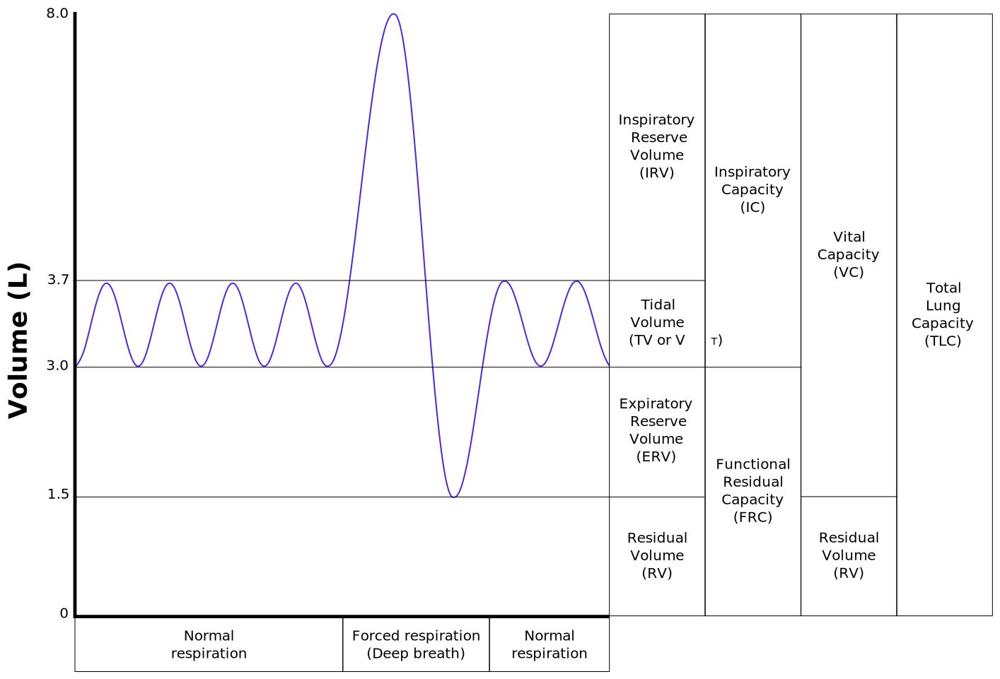

<!-- .slide: data-auto-animate-restart id="MEDI2101Wk12prac"-->
#### MEDI2101 Cardiovascular and Respiratory System.
### Block 3: Cardiovascular and respiratory integration
# Week 12, Practical: Respiratory function
<!-- ##### Dr Mark Butlin (PhD, BE, SFHEA) (he/him) -->

Macquarie Medical School, Faculty of Medicine, Health and Human Sciences Macquarie University. On the land of the Wallumattagal clan of the Dharug Nation.

&nbsp;

&nbsp;

<b>Practical designed by Dr Peter Burke</b>. This material is provided to you as a Macquarie University student for your individual research and study purposes only. You cannot share this material without permission. Macquarie University is the copyright owner of (or has licence to use) the intellectual property in this material. Legal and/or disciplinary actions may be taken if this material is shared without the University’s written permission.

--
### Regulation of breathing automaticity by CO2
#### Carbon dioxide chemosensation by the brain

Central respiratory chemoreception (CRC) fundamentals.
- Drive to breathe
- Maintains pH within narrow limits

<quote>Blood carbon dioxide (pCO2) as the principal factor that affects the rate and depth of breathing, respiratory sensations, air hunger and breathlessness.</quote>

--
### Regulation of breathing automaticity by CO2
#### Carbon dioxide chemosensation by the brain

<b>Many fundamentals are still unknown.</b>

Central respiratory chemoreception (CRC) is one of the few sensory processes whose molecular and cellular basis remain largely unknown. 
- What is sensed: CO2 or H+ ?
- Where is it sensed: glia, neurons? 

Also one of the few sensory processes whose neuronal network and wiring remains unclear.
- How many chemoreceptive nuclei exist in the brain?
- How is breathing regulated by CRC(s)?
- How does peripheral O2 carotid body chemoreceptors inputs integrate with central pH/pCO2 respiratory chemoreception?

--
### A brief history of the landmark discoveries
#### 1905 The hunt for the drive to breathe

  

     &nbsp; 
     &nbsp; 
    
  

  

    <blockquote>"CO2 pressure in the respiratory center is the factor that normally determines the lung ventilation."
    </blockquote>
  

  

    Haldane JS, Priestley JG. The regulation of the lung-ventilation. J Physiol. 1905 May 9;32(3-4):225-66. doi: <a href="https://doi.org/10.1113/jphysiol.1905.sp001081">10.1113/jphysiol.1905.sp001081.</a> <a href="https://www.npg.org.uk/collections/search/portrait/mw223602">https://www.npg.org.uk/collections/search/portrait/mw223602</a>
  

--
### A brief history of the landmark discoveries
#### 1927 Carotid body identified as major sensor for blood oxygen in mammals

Dr. CJF Heymans 
Nobel Prize for Physics or Medicine in 1938 for discovery of carotid baroreceptors and chemoreceptors.

--
### A brief history of the landmark discoveries
#### 1963 Discovery of ventral surface chemosensitive area of the medulla oblongata

  

    
  

  

    A site for pH/pCO2  respiratory chemoreception: "Area M"
  

  

    Mitchell RA, Loeschcke HH, Massion WH, Severinghaus JW. Respiratory responses mediated through superficial chemosensitive areas on the medulla. J Appl Physiol (1985). 1963 May 1;18(3):523-533. doi: <a href="https://doi.org/10.1152/jappl.1963.18.3.523">10.1152/jappl.1963.18.3.523</a>.
  

--
### A brief history of the landmark discoveries
#### 2006 RetroTrapezoid Nucleus (RTN) neurons

RTN, the modern incarnation of "Area M". RTN neuron activity encodes arterial pH/pCO2

Burke PG, Kanbar R, Basting TM, Hodges WM, Viar KE, Stornetta RL, Guyenet PG. State-dependent control of breathing by the retrotrapezoid nucleus. J Physiol. 2015 Jul 1;593(13):2909-26. doi: <a href="https://doi.org/10.1113/JP270053">10.1113/JP270053</a>.

--
### A brief history of the landmark discoveries
#### What we’ve known for over a century

  

    
        <ul>
    <li>pCO2 is tightly regulated</li>
    <li>Normal pCO2 is around 38 mmHg.</li>
    <li>For every 1 mmHg rise in pCO2 ventilation increases ~2 litres/min in man at rest.</li>
    <li>2 mmHg rise in pCO2 decrease pH by less than 0.01 pH units.</li>
    </ul>
  

  

    Carotid body sensory inputs influence the gain of the breathing responses to CO2.</li>
    <ul>
      <li>CB stimulation (hypoxia) increases gain</li>
      <li>CB inhibition/excision reduces gain</li>
    </ul>
    <b>Implication</b>
      <ul>
          <li>Brain sensors for pCO2 / pH must be exquisitely sensitive to changes in these variables AND / OR</li>
          <li>Response to pCO2 / pH is tuned by networks evolved to produce extremely high gain.</li>
      </ul>
  

  

    Nielsen M, Smith H. Studies on the regulation of respiration in acute hypoxia; preliminary report. Acta Physiol Scand. 1951 Feb 21;22(1):44-6. doi: 10.1111/j.1748-1716.1951.tb00748.x.
  

--
### Sleep disordered breathing
#### Sleep unmasks a sensitive hypocapnia-induced apnoea

Sleep often unmasks a sensitive hypocapnic-induced apnoea threshold. 
Sleep blunts the ventilatory response to hypercapnea

Adapted from Bulow K. Respiration and wakefulness in man. Acta Physiol Scand Suppl. 1963;209:1-110.

--
### Sleep disordered breathing
#### Sleep unmasks a sensitive hypocapnia-induced apnoea

Central sleep apnoea
- Commonly observed in heart failure and some CVD, opiate use and other CNS depressants, idiopathic, or in the healthy at altitude. 
- Carotid body hyperactivity

Eckert DJ, Jordan AS, Merchia P, Malhotra A. Central sleep apnea: Pathophysiology and treatment. Chest. 2007 Feb;131(2):595-607. doi: <a href="https://doi.org/10.1378/chest.06.2287">10.1378/chest.06.2287</a>.

--
<video data-autoplay src="images/Breathlessness and the brain.mp4" width=90%></video>

<a href="https://www.youtube.com/watch?v=HPDniPm2JD0&t=12s">
Neuroscience Research Australia - NeuRA. Breathlessness and the brain.</a> Professor Simon Gandevia – CO2 sensing under paralysis.

--
### Practical activity 1
#### Perform a lung function test

1. Click the FVC button.
2. Get ready with the spirometer.
3. Press the "Start" button.
4. Breathe in deeply, put the spirometer to your mouth and pinching your nose, breath out as hard and fast as possible, pushing, pushing, pushing until you cannot expel any more air.

--
### Practical activity 2
#### Hypothesise, and test hypothesis, under which condition would have the longeset breath hold
Record <a href="https://bit.ly/2MkvaCT">in the spreadsheet</a> heart rate and SpO2 before and immediately at the end of the following breath holds. Also record the duration of the breath hold.

Longest breath hold possible following:

1. normal, quiet breathing.

2. a full forced expiration . (Breath out as far as you can, then breath hold.)

3. a full forced inspiration.  (Breath in as far as you can, then breath hold.)

4. hyperventilation. (Breathe deeply and forcefully at a rate of about 1 breath/3 seconds, 20 times, then breath hold.)

5. exercise. (30 or more squats.)

<!--### Practical activity
#### Capnograph demonstration-->
--
### For the last time, let's play...

Buzzer link: <a href="https://buzzonk.com/">https://buzzonk.com/</a>

<label for="fname">Room code:</label>
<input style="font-size: 30pt;" type="text" id="roomcode" name="roomcode">

<a href="https://jeopardylabs.com/play/medi2101-week-12-practical">Jeopardy link</a>

