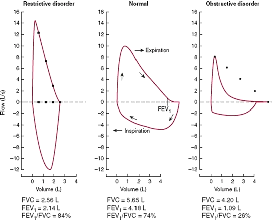

<!-- # MEDI2101  Cardiovascular and Respiratory System.
# Practicals

Macquarie Medical School, Faculty of Medicine, Health and Human Sciences Macquarie University. On the land of the Wallumattagal clan of the Dharug Nation.

&nbsp;

&nbsp;

Practical designed by Assoc. Prof. Mark Butlin and Dr Peter Burke. This material is provided to you as a Macquarie University student for your individual research and study purposes only. You cannot share this material without permission. Macquarie University is the copyright owner of (or has licence to use) the intellectual property in this material. Legal and/or disciplinary actions may be taken if this material is shared without the University’s written permission.
 -->

<!-- .slide: data-auto-animate-restart id="MEDI2101Wk2prac" -->
#### MEDI2101 Cardiovascular and Respiratory System.
#### Block: Respiratory
# Week 2. Physiology practical. Pressure, resistance, flow and respiration

Macquarie Medical School, Faculty of Medicine, Health and Human Sciences Macquarie University. On the land of the Wallumattagal clan of the Dharug Nation.

&nbsp;

&nbsp;

&nbsp;

Practical designed by Assoc. Prof. Mark Butlin. This material is provided to you as a Macquarie University student for your individual research and study purposes only. You cannot share this material without permission. Macquarie University is the copyright owner of (or has licence to use) the intellectual property in this material. Legal and/or disciplinary actions may be taken if this material is shared without the University’s written permission.

--

### No learning outcomes? 
#### But we **LOVE** learning outcomes!

This class introduces the respiratory and cardiovascular devices that we will be using in MEDI2101 - and in assessment 2.

The physiogical measurement classes re-inforces some of the theory (and builds on the learning outcomes) that we have learnt in lectures and the on-line modules.

If you find yourself standing around not doing much in today's practical then
you should:

- observe what is happening to the cardiorespiratory parameters being measured.
- think about what is causing the changes.
- discuss with people in your group the possible mechanisms that behind the changes.

Doing this will help you write assessment 2.

--
### Respect
#### We are working in a privileged space. Do not abuse that privilege.

- You can only place instrumentation on someone **if they give you consent** to do so. &nbsp; 
- It is perfectly **reasonable for someone to refuse consent**. &nbsp; 
- **You do not have to have measurement taken** on you at all if you don't want to. (This will not hinder your success in this unit.) &nbsp; 
- You may prefer to place instrumentation on yourself, rather than have someone else do it. &nbsp; 
- <b>Callous ``humour'' (of people's appearance or abilities) is not tolerated</b>. Besides being hurtful:
  -  it erodes trust in the person speaking the callous ``humour''.
  -  it undermines collegial, professional, or clinician-patient relationships.

Piemonte NM, Abreu S. <a href="https://doi.org/10.1001/amajethics.2020.608">Responding to Callous Humor in Health Care. AMA J Ethics. 2020 Jul 1;22(7):E608-614.</a>

- Be gentle with the equipment. It is expensive. Do not touch equipment that is not involved in the practical.

---
### Practical activity 1
#### Perform a lung function test

1. Click the FVC button.
2. Get ready with the spirometer.
3. Press the "Start" button.
4. Breathe in deeply, put the spirometer to your mouth and pinching your nose, breath out as hard and fast as possible, pushing, pushing, pushing until you cannot expel any more air.
5. Breathe back in again as hard and fast as you can.

--
### Practical activity 1
#### Perform a lung function test

Modified from <a href="https://i.ytimg.com/vi/xbIKxAk-wIA/maxresdefault.jpg">https://i.ytimg.com/vi/xbIKxAk-wIA/maxresdefault.jpg</a>

--
### Practical activity 1
#### The four pulmonary volumes and four pulmonary capacities

<!-- 
Volume numbers (y-axis) are approximate normals for a 70 kg adult male, or a 50 kg adult female.
 -->

Modified from <a href="https://commons.wikimedia.org/wiki/File:Lungvolumes.svg">https://commons.wikimedia.org/wiki/File:Lungvolumes.svg</a>

---
### Practical activity 2
#### Pressure, flow and resistance

<!-- Device to be made: Two containers joined with a large diameter tube, and a small diameter tube. Both tubes can be blocked off. Container 2 is slightly larger than container 1. -->

1. Block both the tubes. 
2. Fill container 1 with water to the first (lower) marker.
3. Open the smaller diameter tube and time how long it takes for container 2 to fill to the line.

--
### Practical activity 1
#### Pressure, flow and resistance

1. Empty container 2 and block both the tubes.
2. Refill container 1 with water to the first (lower) marker.
3. Open the larger diameter tube and time how long it takes for container 2 to fill to the line.

<blockquote>Did it take more or less time than the smaller diameter tube? Why?</blockquote>

<blockquote>What parts of the cardiorespiratory physiology might this be mimicking?</blockquote>

--
### Practical activity 1
#### Pressure, flow and resistance

1. Empty container 2 and block both the tubes.
2. Refill container 1 with water to the second (higher) marker.
3. Open the larger diameter tube and time how long it takes for container 2 to fill to the line.

<blockquote>Did it take more or less time than when container 1 was filled to the lower line? Why?</blockquote>

<blockquote>What are we changing when we fill to the higher line and what parts of the cardiorespiratory system does that apply to?</blockquote>

---
### Let's play...

Buzzer link: <a href="https://buzzonk.com/">https://buzzonk.com/</a>

<label for="fname">Room code:</label>
<input style="font-size: 30pt;" type="text" id="roomcode" name="roomcode">

<a href="https://jeopardylabs.com/play/medi2101-week-02-practical">Jeopardy link</a>

