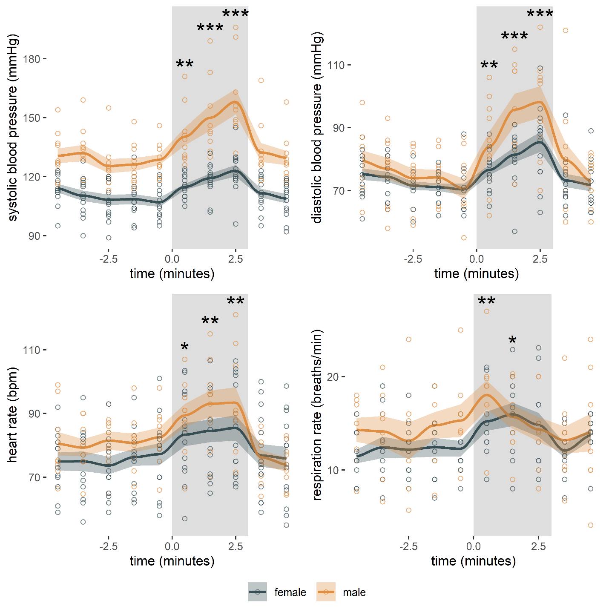

<!-- .slide: data-auto-animate-restart id="MEDI2101Wk10prac"-->
#### MEDI2101 Cardiovascular and Respiratory System.
### Block 3: Cardiovascular and respiratory integration

# Week 9, Practical: Autonomic function tests
<!-- ##### Dr Mark Butlin (PhD, BE, SFHEA) (he/him) -->

Macquarie Medical School, Faculty of Medicine, Health and Human Sciences Macquarie University. On the land of the Wallumattagal clan of the Dharug Nation.

&nbsp;

&nbsp;

This material is provided to you as a Macquarie University student for your individual research and study purposes only. You cannot share this material without permission. Macquarie University is the copyright owner of (or has licence to use) the intellectual property in this material. Legal and/or disciplinary actions may be taken if this material is shared without the University’s written permission.

--

### What is an autonomic function test?

####

Any test that interrogates autonomic function for the purposes of diagnosing dysfunction.

**Types of tests include (but not limited to):**

- Valsalva maneuvre
- 0.1 Hz breathing (Respiratory Sinus Arrhythmia)
- head-up tilt test
- active stand challenge
- isometric hand-grip test

**Measurement devices:** Autonomic function tests are usually done using a lead II ECG and standard oscillometric automatic blood pressure cuff.

Most tests measure both the heart rate and blood pressure **response** to a **challenge** i.e. how heart rate and blood pressure respond to a perturbation to the cardiovascular and respiratory system.

--

### Isometric hand-grip challenge (completed last week)
#### Rest period

1. Choose a volunteer.
2. Get their maximum grip strength by starting the recording software and have the volunteer squeeze, with their dominant hand, the hand force meter maximally for 2 seconds. Read off the peak value of force achieved. Enter that value in the spreadsheet: <https://bit.ly/2MkvaCT>
3. Have them sit down and place a blood pressure cuff on their non-dominant arm.
4. Fit them with the respiratory belt.
5. Start the recording software.
6. On the turn of each minute, start the blood pressure monitor. Enter the value of blood pressure and pulse rate in the spreadsheet.
7. At the 30 second point of each minute, note the respiratory rate and enter that in the spreadsheet.

--

### Isometric hand-grip challenge (completed last week)
#### Hand-grip challenge and recovery

8. After 5 minutes rest (and 5 blood pressure, pulse rate, and respiratory rate measurements), have the volunteer squeeze and hold the force metre at 30% of the maximum.
9. Start the blood pressure cuff immediately. Every minute for three minutes, record blood pressure, pulse rate, and respiratory rate. **Watch the force metre on the recording software. Ensure the volunteer is maintaining 30% of their maximum hand-grip strength.**
10. At three minutes, the volunteer can release the hand-grip. Immediately start the blood pressure monitor. Record blood pressure, pulse rate, and respiratory rate at approximately 30 seconds and 90 seconds following release of the hand-grip. Enter those values into the spreadsheet.

**Repeat for at least one more volunteer in your group.**

<!--  -->

--

### Valsalva maneuvre
####

**Do not attempt this test if you have been diagnosed with high blood pressure, or have been diagnosed with an arrhythmia.**

1. Find your radial pulse and monitor your pulse. (This test is usually done with the nose clamped shut. But seeing as you have your finger on your pulse, you won't be doing that.)

2. Close your mouth.

3. Take a deep breath in then try to forcefully exhale (like you are blowing up a balloon) but keeping your mouth closed - that is, NOT letting air pass your lips.

4. Take note of any changes in your pulse rate.

5. Continue the forceful attempt to exhale (without exhalation) for roughly 10 to 15 seconds, then resume normal breathing.

--

### Active stand challenge
####

**Do not volunteer to be a participant in this study if you often have dizzy spells, or if you often feel light-headed when standing up.**

--

### Active stand challenge

#### Set up

1. Choose a volunteer*.
2. Enter into the spreadsheet their:
   1. age
   2. sex
   3. height
   4. weight
3. Have them lay down on the bed.
4. Place a blood pressure cuff on their non-dominant arm.
5. Fit them with the respiratory belt.
6. Fit them with the pulse oximeter (in this experiment we are mainly concerned with the heart rate).
7. Start the recording software. Check quality of all signals. Correct instrumentation if the signals are not good.

<b>*Do not volunteer to be a participant in this study if you often have dizzy spells, or if you often feel light-headed when standing up.</b>

--

### Active stand challenge

#### Supine period

8. With the volunteer supine, repeat each minute over 5 minutes:
   1. At the 30 second point of each minute, start the blood pressure monitor. Enter the value of blood pressure in the spreadsheet ( <https://bit.ly/2MkvaCT> ).
   2. At the 30 second point of each minute, note the respiratory rate and heart rate and enter that in the spreadsheet.

--

### Active stand challenge

#### Active stand period (Keep the data acquisition system recording.)

9. <b>Whilst the participant is still laying down on the bed</b>, start the blood pressure monitor.
10. When the reading on the pressure value on the screen rises to about 120 mmHg, have the volunteer move quickly to a standing position and then <b>stay very still</b>.
11. Enter the first blood pressure and pulse rate reading into the spreadsheet ( <https://bit.ly/2MkvaCT> ).
12. Take a respiratory rate value in the first 30 seconds of standing. Enter it into the spreadsheet.
13. Repeat blood pressure (and pulse rate) and respiratory rate measurements each minute for 3 minutes of standing.

<!-- ### Active stand challenge

#### Repeat

Repeat for at least one other volunteer in your group. Also enter that data into the spreadsheet.

### What now for Assessment Task 3, Part 2?

####

The unit convenor will be compiling the data across **all** the practical classes, and providing that data summary to you.

You will be able to write up the Discussion section of the manuscript based on that data summary.

Do not use the individual data from your group, or this practical today.-->
--
### Introducing another device

#### The Peñáz* technique of blood pressure measurement

<b>Strengths:</b>

<ul>
    <li> Tracks blood pressure (and pulse rate) continuously.</li>
    <li> Records the blood pressure waveform not just systolic and diastolic blood pressure.</li>
    <li> Having the waveform allows for estimation of other parameters such as stroke volume and total peripheral resistance.</li>
</ul>

<b>Weaknesses:</b>

<ul>
    <li> Not particularly accurate at measuring blood pressure.</li>
    <li> Even worse at estimating stroke volume.</li>
    <li> Hard to estimate accuracy of total peripheral resistance calculation.</li>
</ul>

&nbsp;

*Peñáz, J. Photoelectric measurement of blood pressure, volume and flow in the finger. <em>Digest 10th Int Conf Med Biol Eng,</em> <b>1973</b>, 104.

--
### Valsalva maneuvre and active stand

#### Demonstration with pulse and blood pressure tracking (Peñáz* technique)

*Peñáz, J. Photoelectric measurement of blood pressure, volume and flow in the finger. <em>Digest 10th Int Conf Med Biol Eng,</em> <b>1973</b>, 104.

--

### Let's play Jeopardy

#### (sort of)

Buzzer link: <a href="https://buzzonk.com/">https://buzzonk.com/</a>

<label for="fname">Room code:</label>
<input type="text" id="roomcode" name="roomcode">

<a href="https://jeopardylabs.com/play/medi2101-week-9-practical">Jeopardy link</a>

