<!-- .slide: data-auto-animate-restart id="MEDI2101Wk4_1"-->
#### MEDI2101 Cardiovascular and Respiratory System.
### Block 2: Cardiovascular System
# Week 5: The heart
##### Assoc. Prof. Mark Butlin (PhD, BE, SFHEA) (he/him)

Macquarie Medical School, Faculty of Medicine, Health and Human Sciences Macquarie University. On the land of the Wallumattagal clan of the Dharug Nation.

--
<!-- .slide: data-auto-animate-restart data-background="#111111" -->
<video data-autoplay data-src="images/heart_mayo_clinic.mp4"></video>

<a href="https://www.mayoclinic.org/diseases-conditions/heart-disease/multimedia/circulatory-system/vid-20084745">https://www.mayoclinic.org/diseases-conditions/heart-disease/multimedia/circulatory-system/vid-20084745</a>

---
<!-- .slide: data-auto-animate-restart -->
&nbsp;
#### Learning objective
# Heart Anatomy and Function
### Relate the gross anatomy of the heart to its functional roles.

--
<!-- .slide: data-background-image="images/heart-960_720.jpg" data-auto-animate -->

<h3 style="color:white">Function and gross anatomy of the heart</h3>
<h4></h4> 

Functions of the heart:

<ul>
  <li> pump blood</li>
  <ol>
    <li class="fragment"> receive deoxygenated blood from the organs of the body</li>
    <li class="fragment"> pump this blood to the lungs</li>
    <li class="fragment"> receive oxygenated blood from the lungs</li>
    <li class="fragment"> pump this blood to all the organs of the body</li>
  </ol>
  <li class="fragment"> love?</li>
</ul>

--
<!-- .slide: data-background-image="images/vertigo.jpg" data-auto-animate -->

Free climber, Alex Honnold, on the 914m El Capitan, Yosemite National Park, 2017. <a href="https://en.wikipedia.org/wiki/Alex_Honnold">https://en.wikipedia.org/wiki/Alex_Honnold
</a>

--
<!-- .slide:  data-auto-animate -->
### Heart anatomy and function
####

  

  
  

  

  
"It has been shown by reason and experiment that the blood by the beat of the ventricles flows through the lungs and heart and is pumped to the whole body. There it passes through pores in the flesh into the veins through which it returns from the periphery everywhere to the center, from the smaller veins into the larger ones, finally coming to the vena cava and right auricle. <b>This occurs in such an amount, with such an outflow through the arteries, and such a reflux through the veins, that it cannot be supplied by the food consumed. It is also much more than is needed for nutrition. It must therefore be concluded that the blood in the animal body moves around in a circle continuously</b>, and that <b>the action or function of the heart is to accomplish this by pumping. This is the only reason for the motion and beat of the heart.</b>"

  
William Harvey. "On the motion of the heart and blood in animals" (1628).

  

  

  

--
<!-- .slide: data-background-image="images/pump.jpg" data-background-size="cover" -->

--    
<!-- .slide:  data-auto-animate -->
### Heart anatomy and function
####

  

  
  

  

  
The pathway of oxygenated (red) and deoxygenated (blue) blood through the systemic and pulmonary vascular systems.

  
The <b>L</b>eft side of the heart receives oxygenated blood from the <b>L</b>ungs.

  
The <b>R</b>ight side of the heart receives de-oxygenated blood from the <b>R</b>est of the body.

  

  

  
(Created for MEDI2101)

  

--
<!-- .slide:  data-auto-animate -->
### Heart anatomy and function
####

$\begin{eqnarray}
\mathrm{approx.~number~of~beats~per~hour} &=& 60\mathrm{~bpm} \times 60\mathrm{~minutes}\\
                                                 &=& 3600\mathrm{~beats}\\
\mathrm{approx.~number~of~beats~per~day}   &=& 3600\mathrm{~beats} \times 24\mathrm{~hours}\\
                                                 &=& 86,400\mathrm{~beats}\\
\mathrm{approx.~number~of~beats~per~year}       &=& 86,400\mathrm{~beats} \times 365\mathrm{~days} \\
                                                 & \approx & 31,500,000\mathrm{~beats}\\
\mathrm{approx.~number~of~beats~per~lifetime}  & \approx & 2,600,000,000\mathrm{~for~men} \\
                                                & \approx & 2,700,000,000\mathrm{~for~women}\\
\end{eqnarray}$

      

&nbsp

For people in Australia born 2000–2002, life expectancy of 80.9 (male) and 85 (female) years (Australian Institute of Health and Welfare, <em>Deaths in Australia</em>, 2019).

<!--<!-- .slide:  data-auto-animate 
### Function of the heart
####

  

  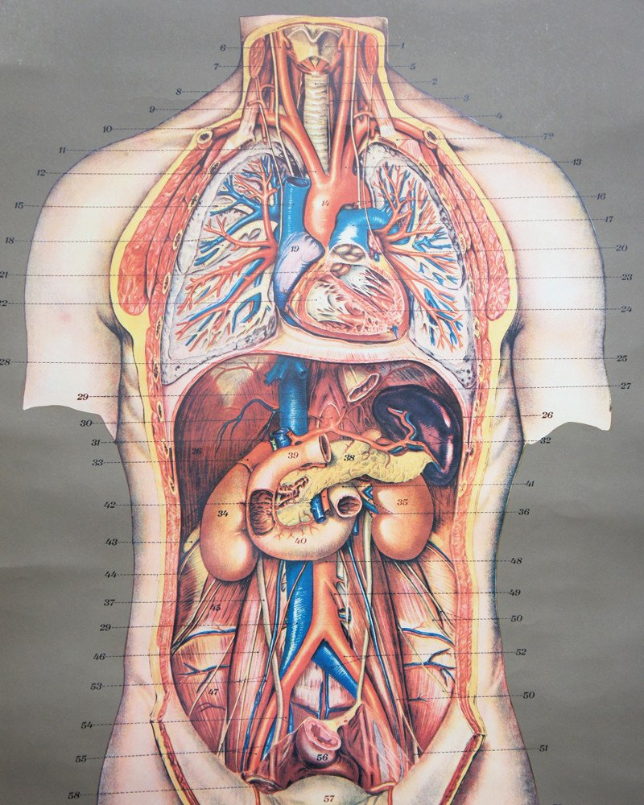
  

  

  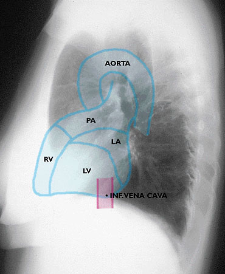
  
Position of the heart in the chest with labelling of the aorta, pulmonary artery (PA), right ventricle (RV), left ventricle (LV) and left atrium (LA). Right atrium not visible from this aspect.

  

  

  
1950's American Frohse Anatomical Chart: Chest & Abdomen Viscera. AU$286.60 on Ebay (+$89.56 postage).

  

-->

--
<!-- .slide:  data-auto-animate -->
### Heart anatomy and function
#### The four chambers of the human heart

      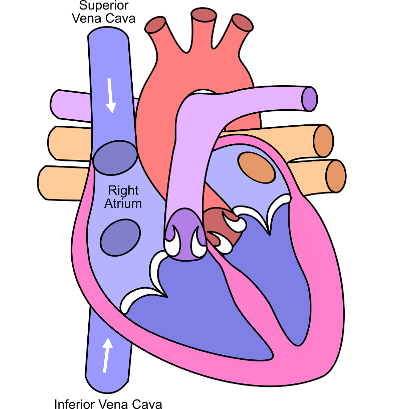
      
      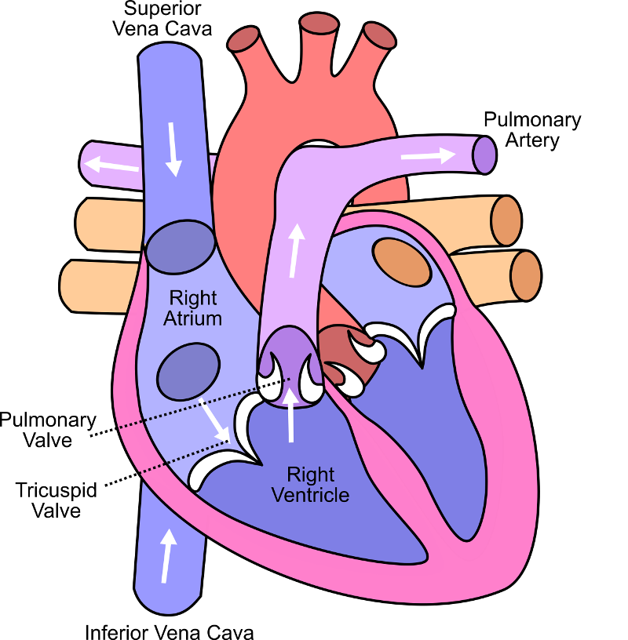
      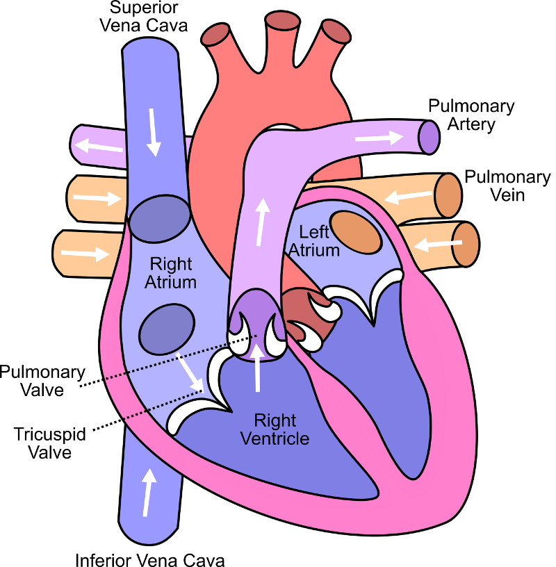
      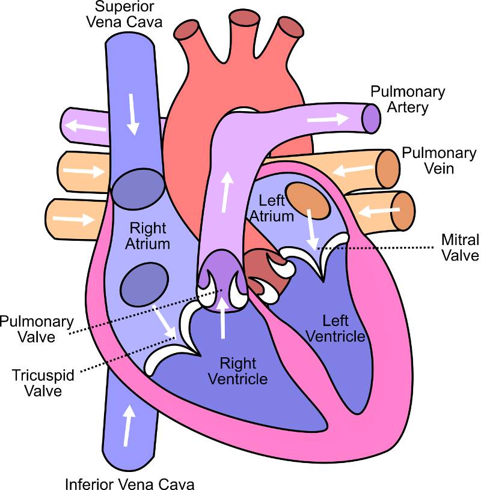
      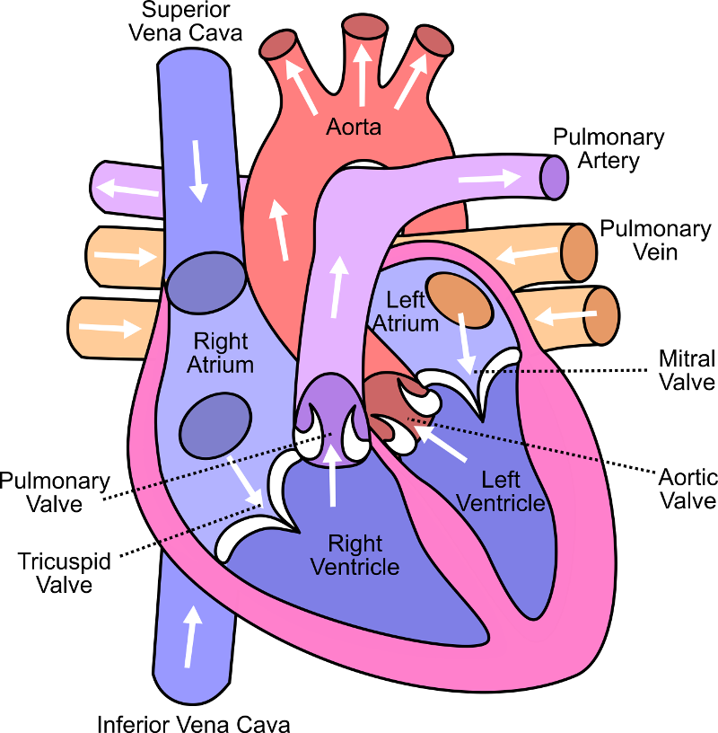

<aside class="notes">The four chambers of the human heart and the supplying and distributing veins and arteries.</aside>

<!-- slide:  data-auto-animate data-background-image="images/p42_HeartValvesAndStrings_highres.png" data-background-opacity="0.66" 

A coloured SEM through the heart valves showing:

<ul>
  <li> mitral valve (center)</li>
  <li> aortic valve (upper center)</li>
  <li> left ventricle (bottom)</li>
  <li> aorta (top right)</li>
  <li> thread-like chordae tendineae and the papillary muscles (thick bands at the lower right and left)</li>
  <li> trabeculae carnae (columnar structures on the innner wall of the ventricle)</li>
</ul>

&nbsp

USUMU NISHINAGA/SCIENCE PHOTO LIBRARY
-->

--
<!-- .slide:  data-auto-animate data-background-image="images/colouring_heart.jpg" data-background-opacity="0.66" data-background-size="contain" -->

&nbsp

Revision: colour it in! (If you want to.)

--
<!-- .slide:  data-auto-animate data-background-image="images/CoronaryArteriesOfTheHeart_p3.webp" data-background-opacity="0.66" data-background-size="contain" data-background-position="right"-->
### Heart anatomy and function
#### External anatomy, coronary arteries

The coronary arteries that supply the heart muscle with oxygenated blood.

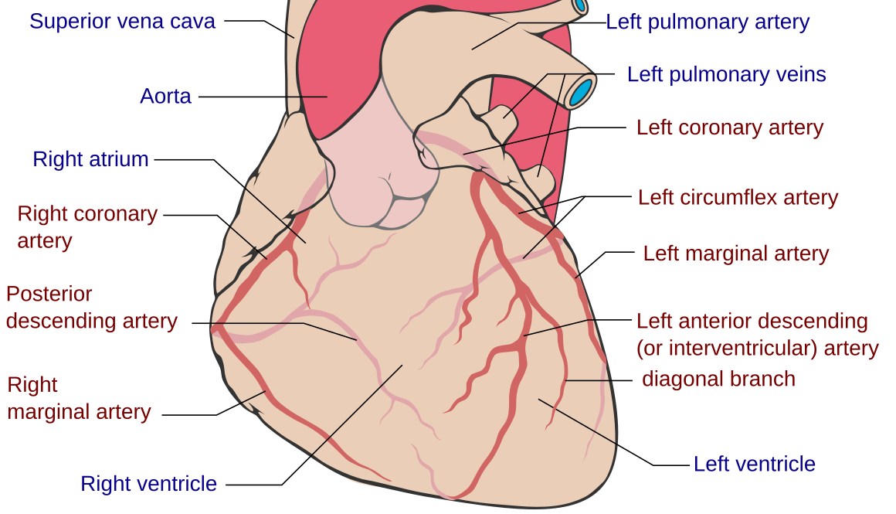

Science Photo Library.

--
<!-- .slide:  data-auto-animate -->
### Heart anatomy and function
#### External anatomy, the pericardium

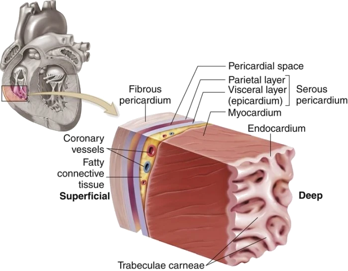

--
### Reflection quiz
#### Heart Anatomy and Function
#### Relate the gross anatomy of the heart to its functional roles.

<a href="https://flux.qa/DA285K">flux.qa/DA285K</a>

---
<!-- .slide: data-auto-animate-restart -->
&nbsp;
#### Learning objective
# Types of myocardial cells
### Identify the three types of myocardial cells: contractile, auto-rhythmic, and conductive.

<!-- <!-- .slide:  data-auto-animate 
### Myocardial cells
#### Contractile myocardial cells

  

    

      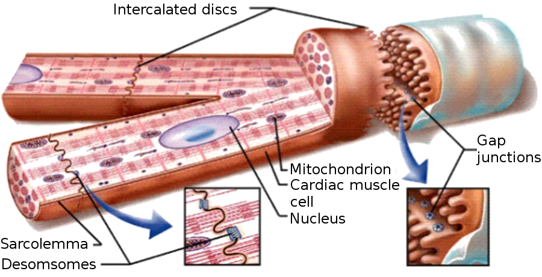
      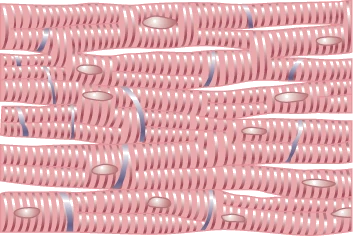
      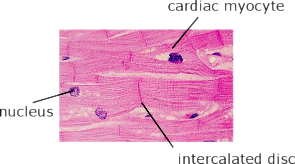
    

  

  

  
Contractile myocardial cells make up most of the heart and are the component we refer to when we talk about "heart muscle".

  <ul >
    <li class="fragment" data-fragment-index="2"> Form a complex network joined by intercalated disks consisting of:</li>
      <ul  class="fragment" data-fragment-index="2">
        <li> desmosomes: strong physical connection between cells</li>
        <li> gap junctions: electrical connection of one cell to the next</li>
      </ul>
  </ul>

  

  

  

-->

--    
<!-- .slide:  data-auto-animate -->
### Types of myocardial cells
#### Contractile myocardial cells

  

    

      
      <!---->
      <!---->
    

    

      
      
    

  

  

  
Contractile myocardial cells make up most of the heart and are the component we refer to when we talk about "heart muscle".

  <ul >
    <li class="fragment" data-fragment-index="2"> Form a complex network joined by intercalated disks consisting of:</li>
      <ul  class="fragment" data-fragment-index="2">
        <li> desmosomes: strong physical connection between cells</li>
        <li> gap junctions: electrical connection of one cell to the next</li>
      </ul>
    <li class="fragment" data-fragment-index="3"> Striated muscle, but much smaller fibres than skeletal muscle.</li>
  </ul>
  

  

  

--
<!-- .slide:  data-auto-animate data-background-image="images/p13_CapillariesOfTheHeart.jpg"-->

<h3 style="color:white">Mitochondria occupies about 1/3rd of the fibre - a high energy demand.</h3>
<h3 class="fragment" style="color:white">Cardiac myocytes consume 70-80% of the blood oxygen delivered - about twice that of most other cells in the body.

Photo source: Dennis Kunkel Microscopy/Science Photo Library

--
<!-- .slide:  data-auto-animate -->
### Types of myocardial cells
#### Myocardial autorhythmic cells (pacemaker or excitatory cells)

<ul>
  <li> provide the initial signal for commencement of myocardial contraction</li>
  <li> do not have organised sarcomeres, and therefore contribute very little to heart contraction/relaxation.</li>
  <li> smaller with fewer contractile fibres than myocardial <em>contractile</em> cells</li>
  <li> do not contribute to the measured electrocardiogram (ECG)</li>
</ul>

--
<!-- .slide:  data-auto-animate -->
### Types of myocardial cells
#### Conductive myocardial cells
<ul>
  <li> provide a pathway for conduction of action potentials through the heart</li>
  <li> do not have organised sarcomeres, and therefore contribute very little to heart contraction/relaxation.</li>
  <li> smaller with fewer contractile fibres than myocardial <em>contractile</em> cells</li>
  <li> do not contribute to the measured electrocardiogram (ECG)</li>
</ul>

--
### Reflection quiz
#### Types of Myocardial Cells
#### Identify the three types of myocardial cells: contractile, auto-rhythmic, and conductive.

<a href="https://flux.qa/DA285K">flux.qa/DA285K</a>

---
<!-- .slide: data-auto-animate-restart -->
&nbsp;
#### Learning objective
# Action potentials
### Compare and contrast the action potentials of myocardial auto-rhythmic and contractile cells, recognizing their differences from typical action potentials.

--
<!-- .slide:  data-auto-animate -->
### Action potentials
#### Membrane potential

  

  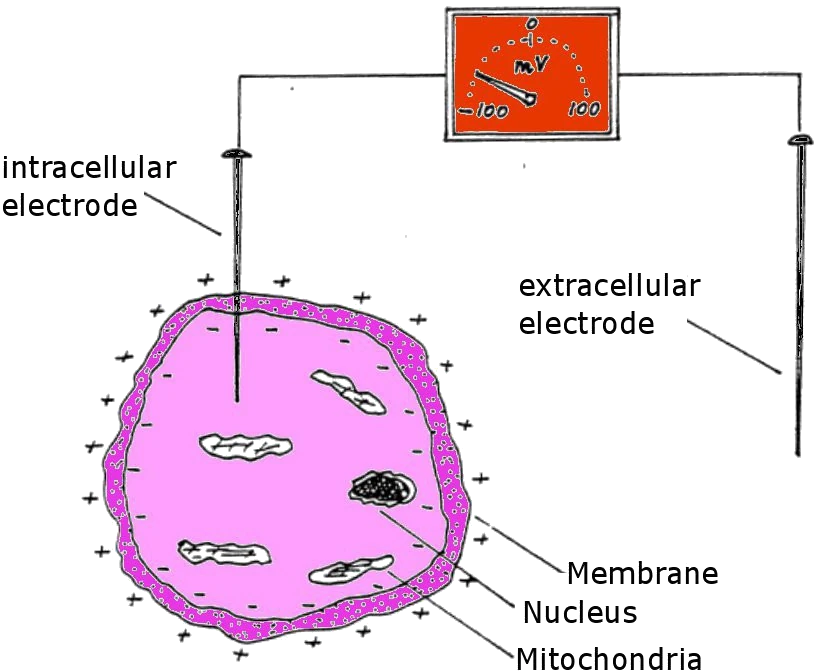
  

  

  
The cell membrane by allowing some ions to travel across but not others creates a potential difference between the inside and outside of the cell.

  

  

  

  

--
<!-- .slide:  data-auto-animate -->
### Action potentials
#### Membrane potential

  

  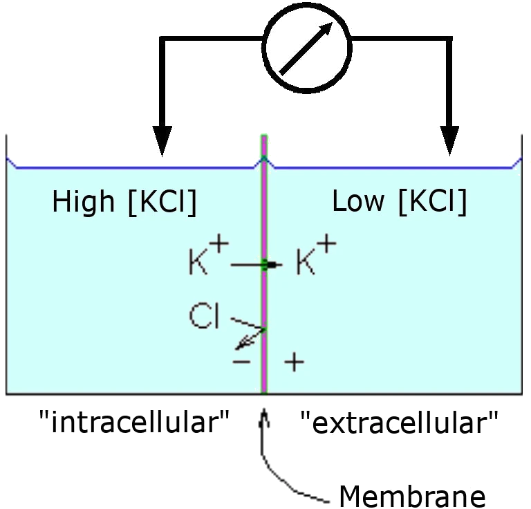
  

  

  
The potential difference across a cell membrane is the same principle as a simple battery, where a potential difference between two materials (or solutions) exists.

  

  

  

  

--
<!-- .slide:  data-auto-animate -->
### Action potentials
#### Membrane potential

<h5>The Nernst equation</h5>

\begin{equation}
E\_{x}=\dfrac{RT}{z\_{x}F}ln\dfrac{[X]\_{o}}{[X]\_{i}}
\end{equation}

- $E_x$ Nernst potential for ion X (membrane potentials, inside with respect to outside)
- $[X]_o$ concentration of X outside the cell
- $[X]_i$ concentration of X inside the cell
- $z_x$ valence of ion X
- $R$ Universal gas constant
- $T$ absolute temperature
- $F$ Faraday constant

--
<!-- .slide:  data-auto-animate -->
### Action potentials
#### Membrane potential

For Na+ ions with a concentration of 144 mm/L outside of the cell and 7 mm/L inside the cell:

\begin{eqnarray}
E\_{x}   & = & \dfrac{RT}{z\_{x}F}ln\dfrac{[X]\_{o}}{[X]\_{i}}\\\\
E\_{Na+} & = & \dfrac{8.314 \times 310}{+1 \times 96485} \times  ln \dfrac{144}{7}\\\\
         & = & 0.081\~V
\end{eqnarray}

-   $R$ Universal gas constant = 8.314 J$\cdot$K-1$\cdot$mol-1
-   $T$ absolute temperature, body = 37oC = 310 K
-   $F$ Faraday constant = 96485 C$\cdot$mol-1

--
<!-- .slide:  data-auto-animate -->
### Action potentials
#### Cardiac cell ionic concentrations

Approximate resting ionic concentrations of a cardiomyocyte.

<table>
  <tr>
    <th> Ion </th>
    <th> Intracellular concentration (mm/L) </th>
    <th> Extracellular concentration (mm/L)</th>
    <th> Equilibrium potential (mV) </th>
  </tr><tr>
      <td>Na+</td>
      <td> 7             </td>
      <td> 144           </td>
      <td> +81         </td>
  </tr><tr>
      <td> K+</td>
      <td> 151           </td>
      <td> 4             </td>
      <td> -97         </td>
  </tr><tr>
      <td>Cl-</td>
      <td> 4             </td>
      <td> 114           </td>
      <td> -90         </td>
  </tr><tr>
      <td></td>
      <td>               </td>
      <td> Sum:          </td>
      <td> -106        </td>
  </tr>
</table>

&nbsp

Source: Little RC. Physiology of the heart and circulation, Year Book Medical Publishers, Chicago, 1977.

--
<!-- .slide:  data-auto-animate -->
### Action potentials
#### Spontaneous depolarisation. Movement of ions during the action potential.

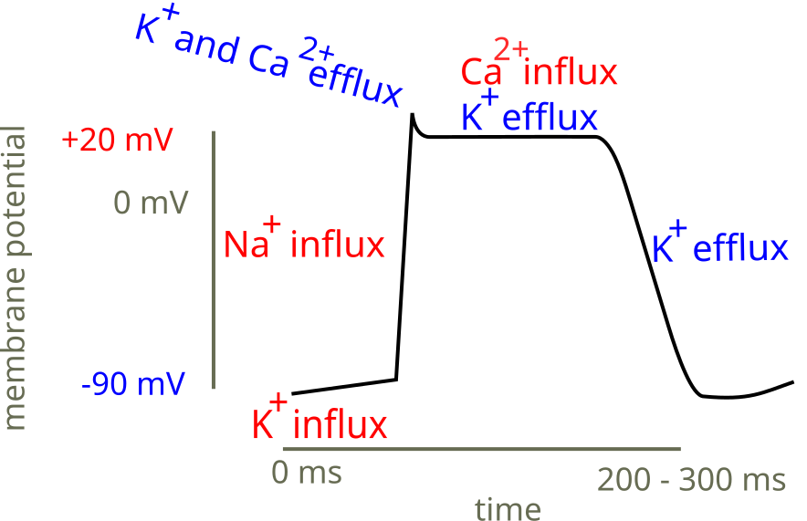

Created for MEDI2101

--
<!-- .slide:  data-auto-animate -->
### Action potentials
#### Spontaneous depolarisation. Movement of ions during the action potential.

  

  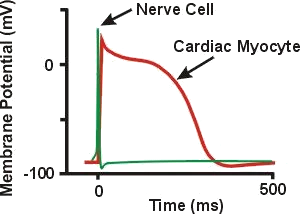
  

  

  
Cardiac myocytes have a vastly different action potential to nerve cells. In typical nerve cells, the action potential duration is about 1 ms

  
Skeletal muscle cell action potential duration is around 2 to 5 ms. Cardiac muscle cell action potential duration is around 200 to 400 ms.

  

  

  
R.E. Klabunde, <em>Cardiovascular Physiology Concepts</em>. <a href="https://cvphysiology.com/Arrhythmias/A010">https://cvphysiology.com/Arrhythmias/A010</a>

  

--
<!-- .slide:  data-auto-animate -->
### Action potentials
#### Spontaneous depolarisation. Movement of ions during the action potential.

  

  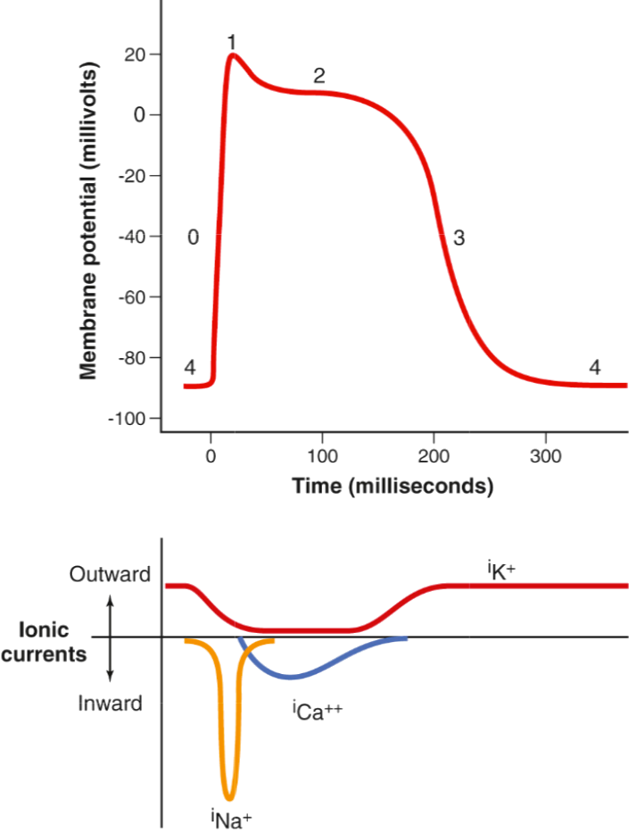
  

  

  
Duration of action potential (the plateau) is largely due to the influx of calcium, which is unique to cardiac muscle cells.

  
Skeletal muscle cells has a similar rapid influx sodium but not the same calcium influx.

  

  

  
Guyton and Hall, <em>Textbook of Medical Physiology</em>.

  

--
<!-- .slide:  data-auto-animate -->
### Action potentials
#### Myocardial excitation-contraction coupling

Action potential enters from adjacent cell, then...

<ol>
  <li> Ca2+ enters cell through voltage-gated Ca2+ channels.</li>
  <li> Ca2+ induces Ca2+ release from the sarcoplasmic reticulum (storage) through ryanodine receptor channels (the calcium "spark").</li>
  <li> Ca2+ ions bind to troponin on actin filaments, initiating contraction.</li>
  <li> Ca2+ unbinds from troponin, initiating relaxation.</li>
  <li> Ca2+ pumped back into the sarcoplasmic reticulum (storage).</li>
  <li> Ca2+ exchanged with Na+.</li>
  <li> Na+ gradient maintained by the Na+-K+-ATPase balance.</li>
</ol>

--
<!-- .slide:  data-auto-animate -->
### Action potentials
#### Myocardial excitation-contraction coupling

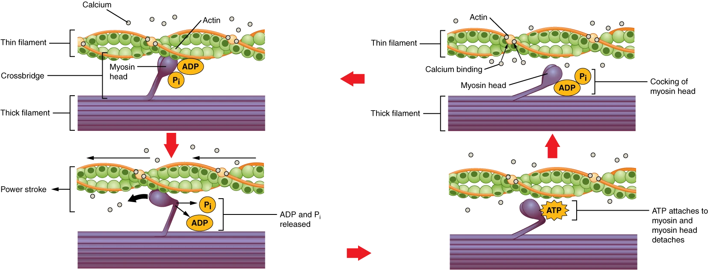

ATP: adenosine triphospate. ADP: adenosine diphosphate. Pi: phosphate. See Kreb's cycle.

--
### Reflection quiz
#### Action potentials
#### Compare and contrast the action potentials of myocardial auto-rhythmic and contractile cells, recognizing their differences from typical action potentials.

<a href="https://flux.qa/DA285K">flux.qa/DA285K</a>

---
<!-- .slide: data-auto-animate-restart -->
&nbsp;
#### Learning objective
# Electrical conduction
### Describe the pathway of electrical signal conduction through the heart.

--
<!-- .slide:  data-auto-animate -->
### Electrical conduction
####

  

    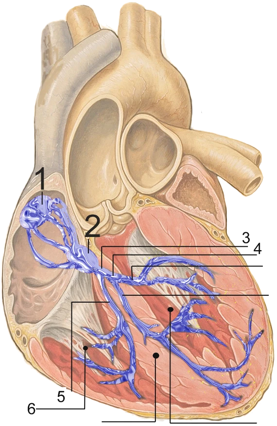
  

  

    
Conduction pathway of the heart.

    <ol>
      <li> sinoatrial (SA) node</li>
      <li> atrioventricular (AV) node</li>
      <li> bundle of His</li>
      <li> left bundle branch</li>
      <li> right bundle branch</li>
      <li> Purkinje fibres</li>
    </ol>
  

  

    

  

--
<!-- .slide:  data-auto-animate -->
### Electrical conduction
#### Approximate action potential conduction velocities in various tissues
<table>
  <tr>
    <th> tissue </th>
    <th> conduction velocity (m/s)</th>
  </tr><tr>
    <td> large nerve fibres        </td>
    <td> 80 to 120</td>
  </tr><tr>
    <td> skeletal muscle fibres    </td>
    <td> 40</td>
  </tr><tr>
    <td> Purkinje fibres           </td>
    <td> 4  </td>
  </tr><tr>
    <td> ventricular muscle fibres </td>
    <td> 0.5</td>
  </tr><tr>
    <td> atrial muscle fibres      </td>
    <td> 0.3</td>
  </tr>
</table>

Conduction through cardiomyocytes is extremely slow compared to other tissues.

The specialised conduction pathways of the heart (e.g. Purkinje fibres) have a faster conduction velocity, but still slower than most other tissues.

--
<!-- .slide:  data-auto-animate -->
### Electrical conduction
####

  

    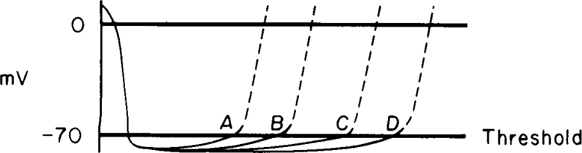
  

  

    
Different parts of the heart depolarise at different times. This diagram illustrates prepotentials as might be recorded from pacemaker cells in the:

    <ul>
      <li> <b>A</b> sinoatrial node</li>
      <li> <b>B</b> artrioventricular node</li>
      <li> <b>C</b> bundle of His</li>
      <li> <b>D</b> Purkinje fibers.</li>
    </ul>
  
The threshold for myocardial depolarisation is indicated as -70 mV.  Each prepotential is shown to start from a common point at the end of the ventricular repolarisation.

  

  

    

  

--
<!-- .slide:  data-auto-animate -->
### Electrical conduction
####

  

    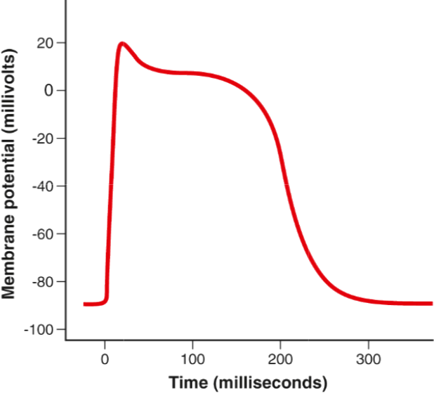
  

  

    
All excitable tissue has a <b>refractory period</b> (cannot be re-stimulated during/immediately following an action potential).

    
The extended action potential of cardiac myocytes extends the refractory period, reducing the likelihood of a second contraction within a typical cardiac cycle.

  

  

    
Guyton and Hall, <em>Textbook of Medical Physiology</em>.

  

--
### Reflection quiz
#### Electrical conduction
#### Describe the pathway of electrical signal conduction through the heart.

<a href="https://flux.qa/DA285K">flux.qa/DA285K</a>

---
<!-- .slide: data-auto-animate-restart -->
&nbsp;
#### Learning objective
# Electrocardiogram (ECG)
### Identify the waves, segments, and intervals of an ECG and relate these electrical events to the mechanical events of the cardiac cycle.

--
<!-- .slide:  data-auto-animate -->
### Electrocardiogram (ECG)
#### and related mechanical events

The sum of potential differences across the heart can be represented as a moving dipole.

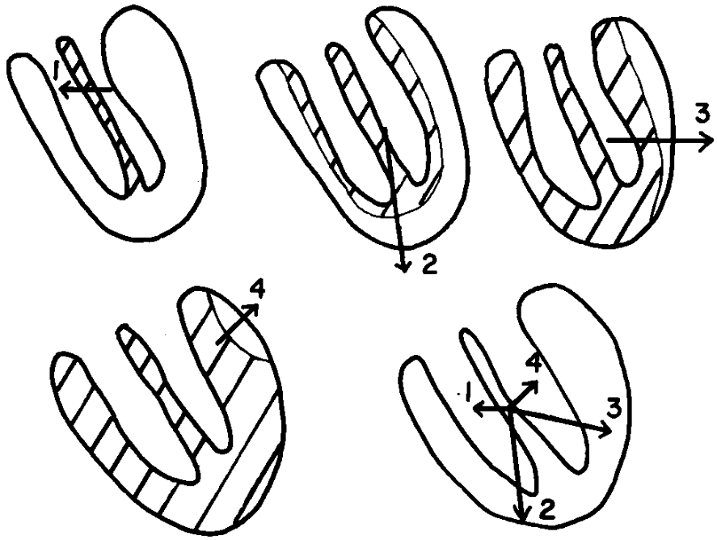
&nbsp;&nbsp;&nbsp;
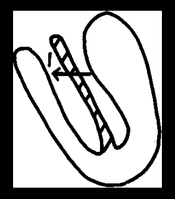

<!-- \animategraphics[autoplay,loop,scale=0.6]{1}{images/ECGDipole}{1}{4} -->
<!-- \animategraphics[autoplay,loop,scale=0.6]{4}{images/ECGDipole}{1}{4} -->

--
<!-- .slide:  data-auto-animate -->
### Electrocardiogram (ECG)
#### Einthoven's triangle -- measuring heart electrical activity

  

    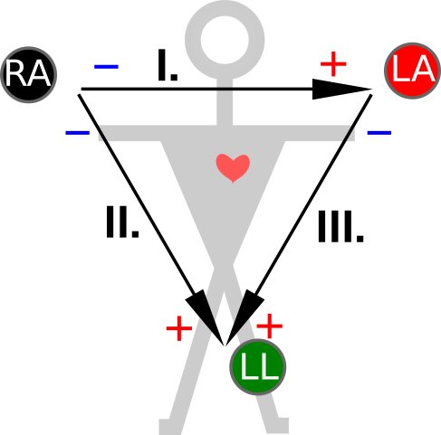
  

  

    
We can record that moving dipole by placing electrodes <em>anywhere</em> around the heart.

    
A standardised way is to use a three electrode arrangement known as Einthoven's triangle.

  

  

    

  

--
<!-- .slide:  data-auto-animate -->
### Electrocardiogram (ECG)
#### Einthoven's triangle -- measuring heart electrical activity

  

    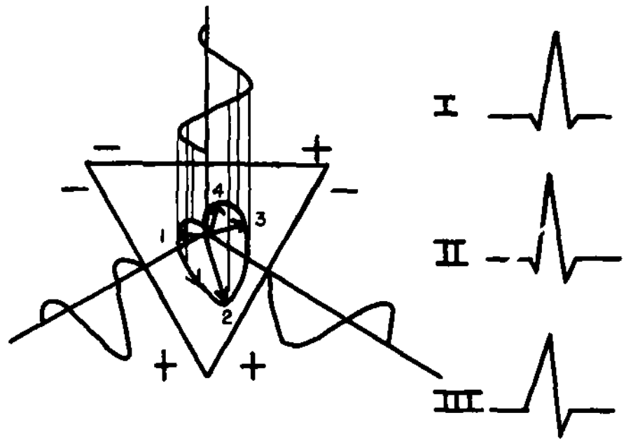
  

  

    
Projection of the moving dipole onto Einthoven's triangle, and schematic of the resultant signal generated by the sampling of that moving dipole.

  

  

    

  

--
<!-- .slide:  data-auto-animate -->
### Electrocardiogram (ECG)
#### Einthoven's triangle -- measuring heart electrical activity

  

    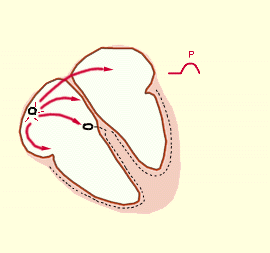
  

  

    
Projection of the moving dipole onto Lead II of Einthoven's triangle

  

  

    
<a href="https://www.medicine.mcgill.ca/physio/vlab/cardio/ECGbasics.htm">https://www.medicine.mcgill.ca/physio/vlab/cardio/ECGbasics.htm</a>

  

--
<!-- .slide: data-auto-animate data-background-image="images/Willem_Einthoven_ECG.jpg" data-background-size="contain" -->

--
<!-- .slide: data-auto-animate data-background="#000000" -->
<video data-autoplay data-src="images/ECG_BusinessCard.mp4"></video>

<a href="https://www.youtube.com/watch?v=lcakOUh1XOs">https://www.youtube.com/watch?v=lcakOUh1XOs</a>

--
### Electrocardiogram (ECG)
#### 
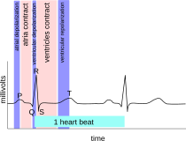

--
<!-- .slide: data-auto-animate data-background="#111111" -->

Why PQRST and not ABCDE?

The four deflections prior to the correction formula were labelled ABCD and the 5 derived deflections were labelled PQRST. The choice of P is a mathematical convention dating from Descartes (as used also by Du Bois-Reymond in his galvanometer's `disturbance curve' 50 years previously) by using letters from the second half of the alphabet. N has other meanings in mathematics and O is used for the origin of the Cartesian coordinates. P is simply the next letter.

In fact Einthoven used O, P, Q, R, S, T, U, V, W, X to mark the timeline on his diagrams.

&nbsp

<a href="https://ecglibrary.com/ecghist.html">https://ecglibrary.com/ecghist.html</a>

--
<!-- .slide: data-auto-animate data-background-image="images/cardiac_animation.gif" data-background-size="contain" -->

Reddit user "Skywalkthis" <a href="https://www.reddit.com/r/educationalgifs/comments/br0lk3/cardiac_cycle_and_the_ecg_explained/">https://www.reddit.com/r/educationalgifs/comments/br0lk3/cardiac_cycle_and_the_ecg_explained/</a>

  
--
<!-- .slide:  data-auto-animate -->
### Electrocardiogram (ECG)
#### Wiggers' diagram

  

    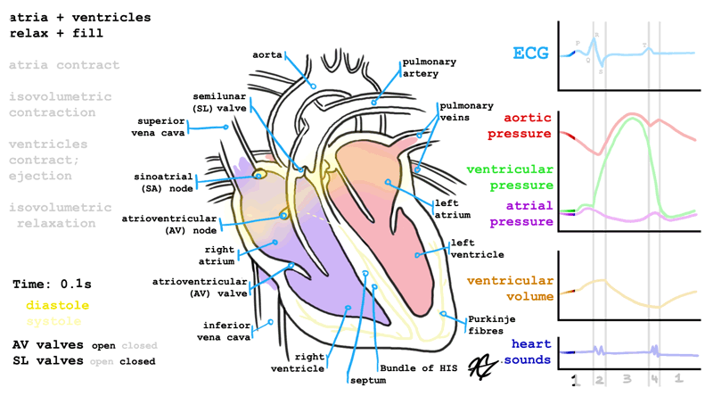
  

  

    
This is a graphical animation of the Wiggers' diagram.

    
Here we relate the ECG activity to the phases of the cardiac cycle.

    
Note that the ECG (caused by the polarisation/depolarisation of the cardiomyocytes) slightly precedes the mechanical events as there is a slight lag between cellular depolarisation and cellular contraction.

    
See this week's on-line module in iLearn, which is all about Wiggers and his diagram.

  

  

    
Reddit user "Skywalkthis" <a href="https://www.reddit.com/r/educationalgifs/comments/br0lk3/cardiac_cycle_and_the_ecg_explained/">https&#x3A;//www.reddit.com/r/educationalgifs/comments/br0lk3/cardiac_cycle_and_the_ecg_explained/</a>

  

--
<!-- .slide:  data-auto-animate -->
### Electrocardiogram (ECG)
#### The 12 lead ECG - bipolar limb leads

  

    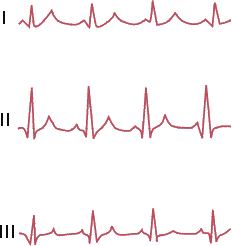
  

  

    
The bipolar limb leads are the direct connection of two of the three physical leads of Einthoven's triangle.

  

  

    

  

--
<!-- .slide:  data-auto-animate -->
### Electrocardiogram (ECG)
#### The 12 lead ECG - augmented unipolar limb leads

  

    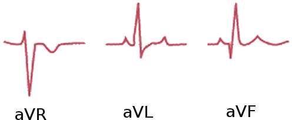
  

  

    
The augmented unipolar limb leads have the same configuration as the bipolar limb leads, but two of the limbs are connected to the negative terminal, and the other limb to the positive terminal.

    <ul>
      <li> <b>aVR</b> positive terminal on the right arm</li>
      <li> <b>aVL</b> positive terminal on the left arm</li>
      <li> <b>avF</b> positive terminal on the left leg</li>
    </ul>
  

  

    

  

--
<!-- .slide:  data-auto-animate -->
### Electrocardiogram (ECG)
#### The 12 lead ECG - chest (precordial) leads

  

    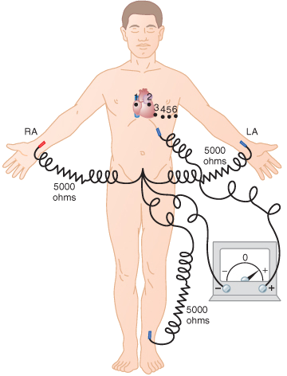
  

  

    
The 6 chest (precordial) leads have:

    <ul>
       <li>  Negative electrode connected jointly to the LA, RA and LL.</li>
       <li>  Positive electrode connected to a single chest electrode (6 different positions for 6 different leads).</li>
    </ul>
    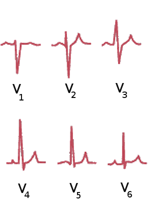
  

  

    

  

--
<!-- .slide:  data-auto-animate -->
### Electrocardiogram (ECG)
#### The 12 lead ECG

  

    

    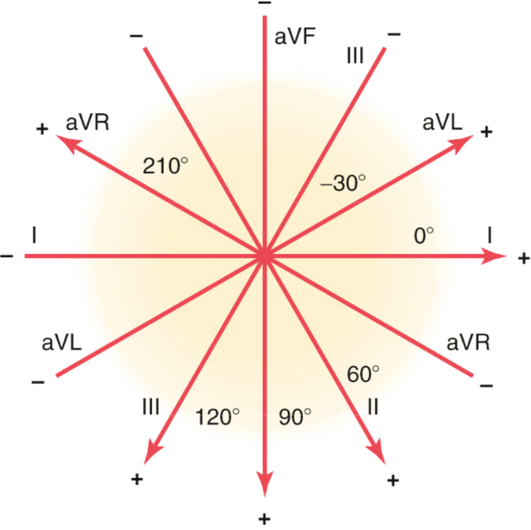
    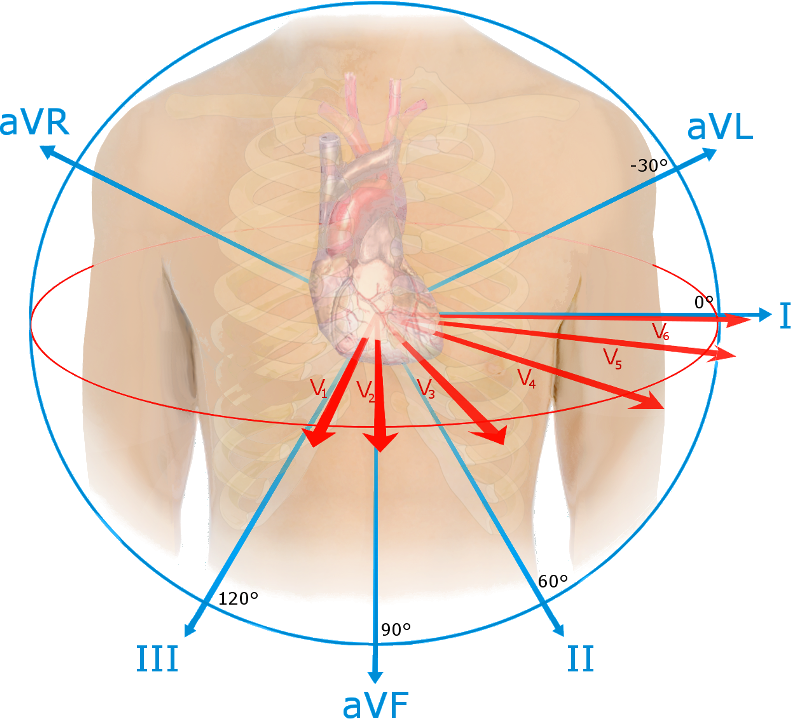
    

  

  

    <ul>
    <li> Bipolar leads:</li>
    <ul>
     <li> [1] Lead I</li>
     <li> [2] Lead II</li>
     <li> [3] Lead III</li>
    </ul>
    <li>Augmented leads:</li>
    <ul>
     <li> [4] aVR</li>
     <li> [5] aVL</li>
     <li> [6] aVF</li>
    </ul>
    <li class="fragment"  data-fragment-index="1"> Chest leads:</li>
    <ul>
     <li class="fragment" data-fragment-index="1"> [7 through 12] V1 to V6</li>
    </ul>
    </ul>
    
The addition of the precordical leads to the bipolar and unipolar leads (now 12 leads in total) gives a more 3 dimensional "picture" of the heart.

  

  

    

  

--
<!-- .slide: data-auto-animate data-background="#e7e7e7ff" -->
<video data-autoplay data-src="images/ECG1-ECGFirstPrinciples.mp4"></video>

<a href="https://www.handwrittentutorials.com">www.handwrittentutorials.com</a>

--
<!-- .slide: data-auto-animate data-background-image="images/ECGreal.png" data-background-size="contain" -->

&nbsp

A traditional paper copy of a 12 lead ECG examination.

--
<!-- .slide:  data-auto-animate -->
### Electrocardiogram (ECG)
#### The 12 lead ECG

  

    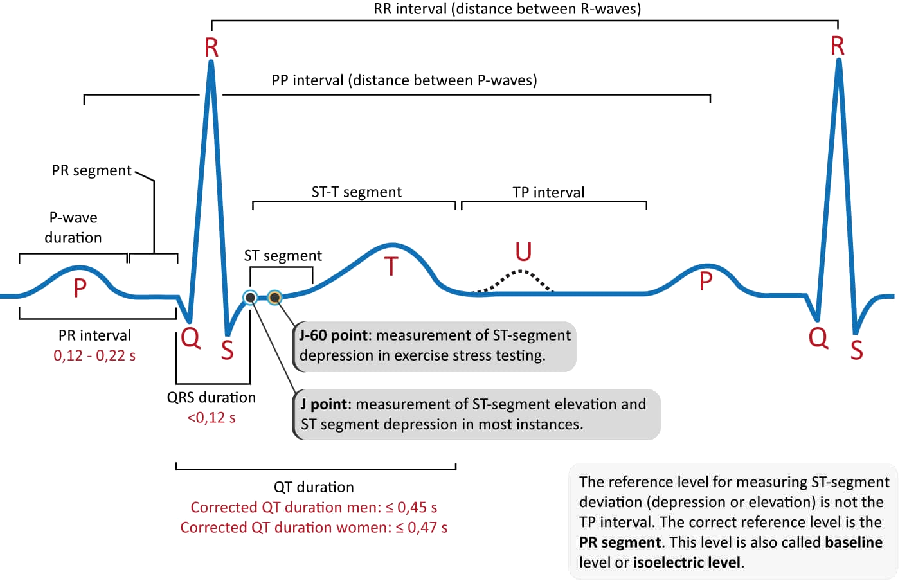
  

  

    
The various intervals of the ECG. The length of these intervals gives information on whether there are normal conduction pathways in the heart, or some pathology.

    
(The exact length of "normal" ECG intervals, and the diagnosis of heart conditions from the ECG will be touched on in the block on the cardiovascular and respiratory system in disease.)

  

  

    
<a href="https://ecgwaves.com/ecg-topic/ecg-normal-p-wave-qrs-complex-st-segment-t-wave-j-point/">https://ecgwaves.com/ecg-topic/ecg-normal-p-wave-qrs-complex-st-segment-t-wave-j-point/</a>

  

--
<!-- .slide:  data-auto-animate -->
### Electrocardiogram (ECG)
#### The 12 lead ECG

  

    
  

--
### Electrocardiogram (ECG)
#### Wait! What? A "U" wave? What is the U wave?

Usually not present.

Thought to indicate some kind of pathology.

Cause? Theories include:

<ul>
      <li>  repolarisation of the Purkinje fibres (unlikely given small volume of Purkinje fibres)</li>
      <li>  late depolarisation or repolarisation of sections of the left ventricle, especially in left ventricular hypertrophy</li>
</ul>

  
<a href="https://ecgwaves.com/ecg-topic/ecg-normal-p-wave-qrs-complex-st-segment-t-wave-j-point/">https://ecgwaves.com/ecg-topic/ecg-normal-p-wave-qrs-complex-st-segment-t-wave-j-point/</a>

--
### Electrocardiogram (ECG)
#### Diagnosis

The ECG leads can be used to help diagnose different conditions.

<ul>
     <li>  change in the position of the heart</li>
     <li>  hypertrophy of the left or right ventricle</li>
     <li>  bundle branch block</li>
     <li>  Purkinje fibre blocks</li>
     <li>  ischaemic injury to the cardiac muscle</li>
     <li> ...and many other conditions.</li>
</ul>

More details to be provided in Cardiovascular and Respiratory System in Disease block.

--
<!-- .slide: data-auto-animate data-background-image="images/ECG_example.png" data-background-size="contain" data-visibility="hidden"-->

Normal

sinus

rhythm

--
<!-- .slide: data-auto-animate data-background-image="images/ECG_example_isolated_ventricular_ectopics.png" data-background-size="contain" data-visibility="hidden"-->

Isolated

ventricular

ectopics

--
<!-- .slide: data-auto-animate data-background-image="images/Myocardial_infaction_ECG.png" data-background-size="contain" data-visibility="hidden"-->

Myocardial infarction

--
### Reflection quiz
#### Electrocardiogram (ECG)
#### Identify the waves, segments, and intervals of an ECG and relate these electrical events to the mechanical events of the cardiac cycle.

<a href="https://flux.qa/DA285K">flux.qa/DA285K</a>

---
<!-- .slide: data-auto-animate-restart -->
&nbsp;
#### Learning objective
# Key cardiac terms
### Define cardiac contractility, ejection fraction, stroke volume, cardiac output, heart rate, and explain the relationships between these terms.

--
<!-- .slide:  data-auto-animate -->
### Key cardiac terms
#### The diastolic and systolic phases of the heart
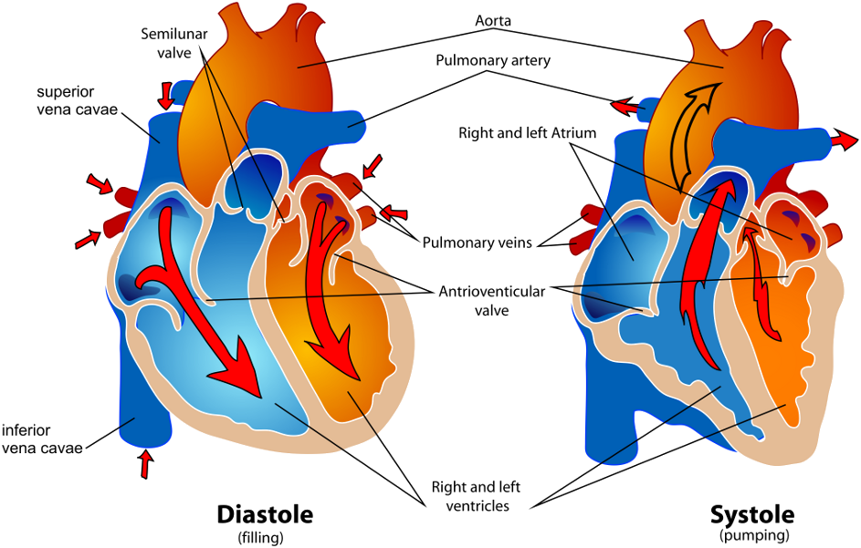

--
<!-- .slide: data-auto-animate data-background-image="images/LV_volume.jpg" data-background-size="contain" data-background="#000000" -->

Angiogram with contrast in the left ventricle at end diastole and end systole.

&nbsp

&nbsp

&nbsp

&nbsp

&nbsp

&nbsp

&nbsp

&nbsp

&nbsp

 Can be used to estimate stroke volume of the left ventricle. (An estimate only, as the angiogram provides a 2D representation (area). Volume requires 3D quantification.

--
<!-- .slide:  data-auto-animate -->
### Key cardiac terms
#### Pressure-volume loop
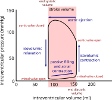

Created for MEDI2101

--
<!-- .slide:  data-auto-animate -->
### Key cardiac terms
#### Quantifying the output of the heart

\begin{equation}
  \mathrm{Stroke\~Volume}=\mathrm{end\~diastolic\~volume}-\mathrm{end\~systolic\~volume}
\end{equation}

the <b>volume</b> of blood ejected by the left ventricle into the aorta (or right ventricle into the pulmonary artery) in a <b>single beat of the heart</b>. Usually expressed in ml.

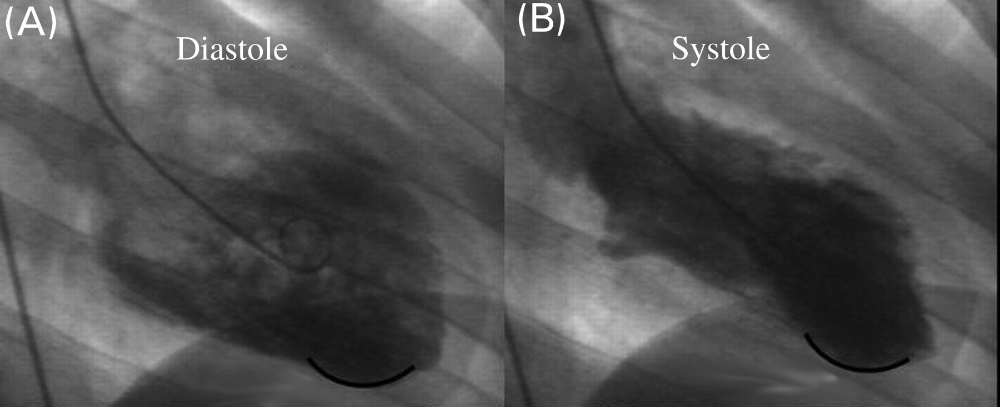

--
<!-- .slide:  data-auto-animate -->
### Key cardiac terms
#### Quantifying the output of the heart

\begin{equation}
  \mathrm{Stroke\~Volume}=\mathrm{end\~diastolic\~volume}-\mathrm{end\~systolic\~volume}
\end{equation}

the <b>volume</b> of blood ejected by the left ventricle into the aorta (or right ventricle into the pulmonary artery) in a <b>single beat of the heart</b>. Usually expressed in ml.

$\begin{align}
      \mathrm{cardiac\~output} &= \mathrm{stroke\~volume}\times\mathrm{heart\~rate}\\\\
      \mathrm{CO} &= \mathrm{SV} \times \mathrm{HR}
\end{align}$

the <b>rate</b> of blood being ejected by the left ventricle into the aorta (or right ventricle into the pulmonary artery). Usually expressed in l/min.

--
<!-- .slide:  data-auto-animate -->
### Key cardiac terms
#### Quantifying the output of the heart
$\begin{align}
\mathrm{CO} &= \mathrm{SV} \times \mathrm{HR}
\end{align}$

How do we measure heart rate?

<ul class="fragment">
  <li>  palpation of the arterial pulse</li>
  <li>  ECG (RR interval)</li>
  <li>  photoplethysmography (e.g. finger blood volume)</li>
  <li>  non-contact photoplethysmography (more of a research device at this stage)</li>
</ul>

--
<!-- .slide:  data-auto-animate -->
### Key cardiac terms
#### Quantifying the output of the heart
$\begin{align}
\mathrm{CO} &= \mathrm{SV} \times \mathrm{HR}
\end{align}$

How do we measure stroke volume?

<ul class="fragment">
  <li>  <b>estimate</b> by x-ray catheter placed radio-opaque dye (invasive).</li>
  <li>  <b>estimate</b> by body impedance measurements (non-invasive).</li>
  <li>  <b>measure</b>* by transesophageal Doppler (non-invasive**).</li>
  <li>  <b>measure</b> by placing a flow probe around the ascending aorta or pulmonary artery (highly invasive).</li>
</ul>

*Accurate Doppler ultrasound requires measurement of the angle of insonation and knowledge of the arterial cross sectional area - not easy things to measure. So transesophageal Doppler is more accurate than some methods, but still not highly accurate.

**As the Doppler probe is in the oesophagus and does not cross any membranes / skin, it is technically non-invasive.

--
<!-- .slide:  data-auto-animate -->
### Key cardiac terms
#### Ejection fraction

\begin{equation}
  \mathrm{Stroke\~Volume}=\mathrm{end\~diastolic\~volume}-\mathrm{end\~systolic\~volume}
\end{equation}

\begin{equation}
  \mathrm{ejection\~fraction}=\dfrac{\mathrm{Stroke\~Volume}}{\mathrm{end\~diastolic\~volume}}
\end{equation}

--
<!-- .slide:  data-auto-animate -->
### Key cardiac terms
#### Cardiac contractility

\begin{equation}
  \mathrm{Stroke\~Volume}=\mathrm{end\~diastolic\~volume}-\mathrm{end\~systolic\~volume}
\end{equation}

\begin{equation}
  \mathrm{ejection\~fraction}=\dfrac{\mathrm{Stroke\~Volume}}{\mathrm{end\~diastolic\~volume}}
\end{equation}

The greater the <b>cardiac contractility</b> (force of contraction of the contractile cardiomyocytes)...
- the lower the end systolic volume.
- the greater the stroke volume.

---
<!-- .slide: data-auto-animate-restart -->
&nbsp;
#### Learning objective
# Wiggers Diagram
### Understand the Wiggers' Diagram, which relates left heart pressures and volumes with heart sounds and the electrocardiogram.

See this week's on-line module in iLearn.

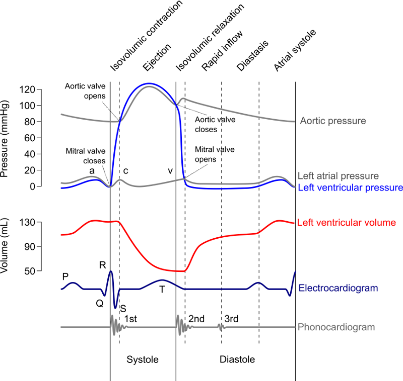

---
<!-- .slide: data-auto-animate data-background="#e7e7e7ff" -->
<video data-autoplay data-src="images/ConductionPathwayoftheHeart.mp4"></video>

<a href="http://www.handwrittentutorials.com">www.handwrittentutorials.com</a>

--
<!-- .slide: data-auto-animate data-background="#e7e7e7ff" -->
<video data-autoplay data-src="images/ECG2-PQRST.mp4"></video>

<a href="https://www.handwrittentutorials.com">www.handwrittentutorials.com</a>

--
<!-- .slide: data-auto-animate data-background="#e7e7e7ff" data-visibility="hidden" -->

Extension information (not part of MEDI2101 assessable material). For those that are interested in more information about the use of the ECG in diagnoses of heart conditions, this video gives a succinct summary. <a href="https://www.youtube.com/watch?v=XCmtP7597PI">www.handwrittentutorials.com</a>

<video data-autoplay data-src="images/ECG3-SegmentsIntervalsDiseases.mp4"></video>