<!-- .slide: data-auto-animate-restart id="MEDI2101Wk5_1"-->
#### MEDI2101 Cardiovascular and Respiratory System.
### Block 2: Cardiovascular System
# Week 6: The circulatory system, blood pressure and flow
##### Assoc. Prof. Mark Butlin (PhD, BE, SFHEA) (he/him)

Macquarie Medical School, Faculty of Medicine, Health and Human Sciences Macquarie University. On the land of the Wallumattagal clan of the Dharug Nation.

&nbsp;

&nbsp;

&nbsp;

This material is provided to you as a Macquarie University student for your individual research and study purposes only. You cannot share this material without permission. Macquarie University is the copyright owner of (or has licence to use) the intellectual property in this material. Legal and/or disciplinary actions may be taken if this material is shared without the University’s written permission.

--

<!-- .slide: data-auto-animate data-background="#111111" -->
<video data-autoplay data-src="images/CirculatorySystemAnimatedSong.mp4"></video>

Source: <a href="https://www.youtube.com/watch?v=U2WG4gRt1yE">www.youtube.com/watch?v=U2WG4gRt1yE</a>

--
<!-- .slide: data-auto-animate data-background-image="images/SpainMammothHeart.jpg" data-background-size="contain" data-background-position="right" -->
### History of the "discovery" of circulation
#### 10,000 BC. El Pindel cave. Spain.

<aside class="notes">Painting in El Pindal cave, Spain, circa 10,000 BC showing the location of the heart in a mammoth.</aside>

--
### History of the "discovery" of circulation
#### 2650 BC. The emperor of China, Hwang-Ti.

**In his medical book, Nei ching:**

"
  all blood is under the control of the heart. The blood flows in a continuous circle and never stops."

--
### History of the "discovery" of circulation
#### 1552 BC. Ancient Egyptians.

**Smith papyrus**

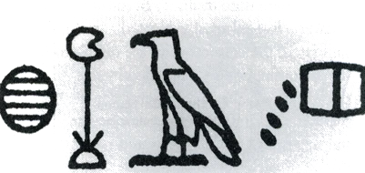

"Counting the pulse"

--
### History of the "discovery" of circulation
#### 1552 BC. Ancient Egyptians.

**Ebers papyrus**

"From the heart arise the vessels which go to the whole body ... if the physician lay his finger on the head, on the neck, on the hand, on the epigastrium, on the arm or the leg, everywhere the motion of the heart touches him, coursing through the vessels to all the members ... When the heart is diseased its work is imperfectly performed; the vessels proceeding from the heart become inactive, so that you cannot feel them ... If the heart trembles, has little power and sinks, the disease is advancing."

--
### History of the "discovery" of circulation
#### 260--375 BC. Hippocrates.

"TThe vessels spread themselves over the body filling it with spirit, juice, and motion are all of them but branches of an original vessel. I protest I know now where it begins or where it ends, for in a circle there is neither a beginning nor an end."

--
<!-- .slide: data-auto-animate data-background-image="images/GalenDiagram.webp" data-background-size="contain" data-background-position="right" -->
### History of the "discovery" of circulation
#### The influence of unscientific process and of Christianity 100--200 AD. Galen.

<aside class="notes">Galen's proposal on the movement of blood.</aside>

--
### History of the "discovery" of circulation
#### (Re)-"discovery" of the circulation: 1628. William Harvey.

  

  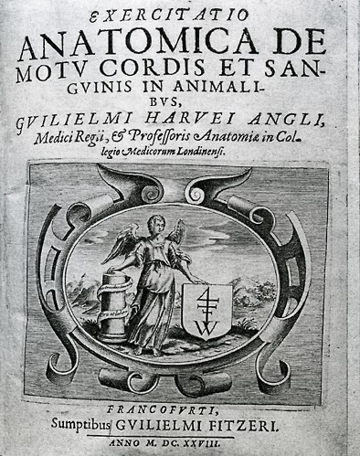
  

  

  
"It has been shown by reason and experiment that the blood by the beat of the ventricles flows through the lungs and heart and is pumped to the whole body. There it passes through pores in the flesh into the veins through which it returns from the periphery everywhere to the center, from the smaller veins into the larger ones, finally coming to the vena cava and right auricle. <b>This occurs in such an amount, with such an outflow through the arteries, and such a reflux through the veins, that it cannot be supplied by the food consumed. It is also much more than is needed for nutrition. It must therefore be concluded that the blood in the animal body moves around in a circle continuously</b>, and that the action or function of the heart is to accomplish this by pumping. This is the only reason for the motion and beat of the heart."

  
William Harvey. "On the motion of the heart and blood in animals" (1628).

  

  

  

--
### History of the "discovery" of circulation
#### (Re)-"discovery" of the circulation: 1628. William Harvey.

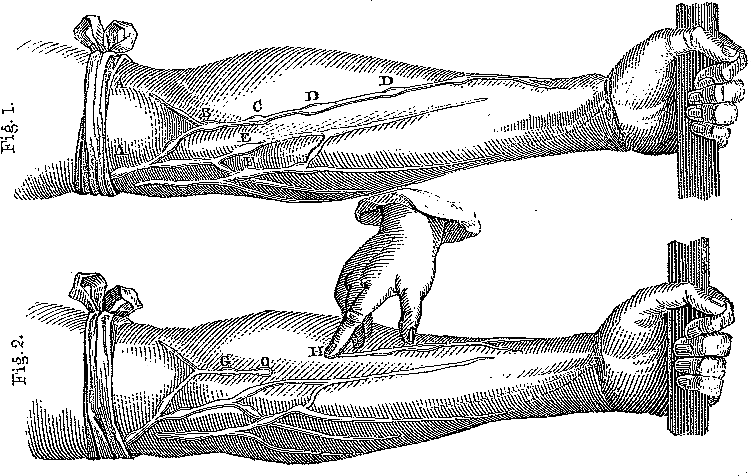

Images source: William Harvey. "On the motion of the heart and blood in animals" (1628).

<aside class="notes">Practical experiment demonstrating that blood in the veins travels back toward the heart.</aside>

---
<!-- .slide: data-auto-animate-restart -->
#### Learning objective
# Transport functions
### Recognise the transport functions of the cardiovascular system, providing examples of materials entering, moving within, and leaving the body.

--
### The transport functions of the cardiovascular system
####

The main functions of the circulatory system are:

- **transportation**
  -  brings oxygen to body cells and takes away carbon dioxide and metabolic waste products
  -  carries nutrients from the gastrointestinal tract to body cells
  -  carries hormones from endocrine glands to body cells
  -  carries immune cells, antibodies (in blood) to sites where
    needed
- **regulation**
  -  helps regulate the pH of body fluid
  -  helps regulate body temperature
  -  regulates water content of cells

--
### Reflection quiz
#### Transport functions
#### Recognise the transport functions of the cardiovascular system, providing examples of materials entering, moving within, and leaving the body.

<a href="https://flux.qa/DA285K">flux.qa/DA285K</a>

---
<!-- .slide: data-auto-animate-restart -->
#### Learning objective
# Cardiovascular organisation
### Recall the organisation of the cardiovascular system, including the central location of the heart, major blood vessels, pulmonary and systemic circulations, and key portal systems.

--
### The organisation of the cardiovascular system
####

  

  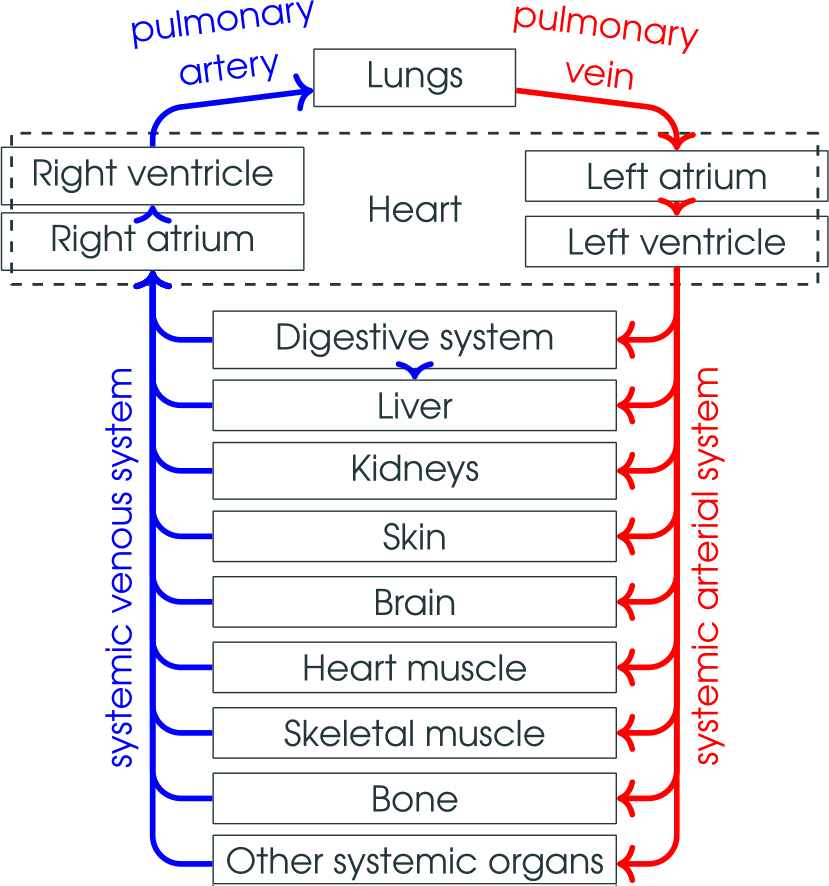
  

  

  
The pathway of oxygenated (red) and deoxygenated (blue) blood through the systemic and pulmonary vascular systems.

  
The <b>L</b>eft side of the heart receives oxygenated blood from the <b>L</b>ungs.

  
The <b>R</b>ight side of the heart receives de-oxygenated blood from the <b>R</b>est of the body.

  

  

  

Image: M.Butlin. Created for MEDI2101.

--
<!-- .slide: data-auto-animate data-background-image="images/Circulatory_System_Systemic.png" data-background-size="contain" data-background-position="right" -->
### The organisation of the cardiovascular system
#### Systemic circulation

The <em>systemic</em> circulation

showing the major systemic arteries (red) and the major systemic veins (blue).

&nbsp;

Image source: Wikipedia (creative commons license).

--
<!-- .slide: data-auto-animate data-background-image="images/Circulatory_System_Pulmonary.png" data-background-size="contain" data-background-position="right" -->
### The organisation of the cardiovascular system
#### Pulmonary circulation

The <em>pulmonary</em> circulation.

Note that the pulmonary arteries (blue) carry de-oxygenated blood away from the heart toward the lungs.  The pulmonary veins (red) carry oxygenated blood from the lungs to the heart.

In both the systemic and pulmonary circulation, <b>A</b>rteries carry blood <b>A</b>way from the heart.

&nbsp;

Image source: Wikipedia (creative commons license).

--
### The organisation of the cardiovascular system
#### Circulation

  

    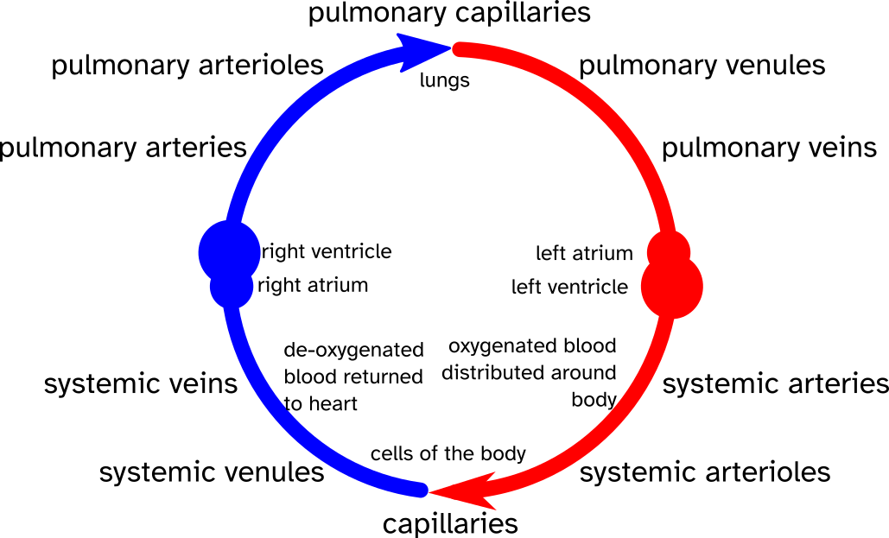
  

  

    
There are five broad types of blood vessels. In order of travelling away from the heart:

    <ul> 
      <li> arteries
      <li> arterioles
      <li> capillaries
      <li> venules
      <li> veins
    <ul>
    
These exist in this order in both the pulmonary and systemic circulation.

  

  

  

Image: M.Butlin. Created for MEDI2101.

--
### The organisation of the cardiovascular system
#### The exception to the rule: Portal systems

**A portal system** is where a capillary bed drains through veins *into another capillary system*.

This is a limited occurrence in the human body:

- **hepatic portal system** takes blood from sections of the gastrointestinal capillary network and drains into capillaries of the liver.
- **hypophyseal portal system** at the base of the brain between the hypothalamus and anterior pituitary gland, transporting hormones.

--
### The organisation of the cardiovascular system
#### The exception to the rule: Portal systems

  

    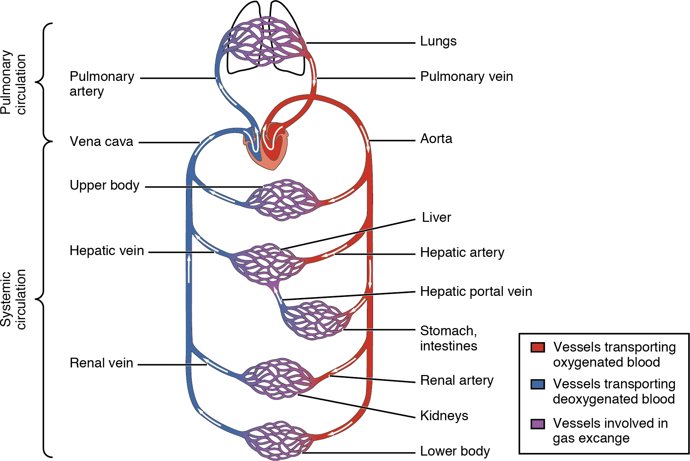
  

  

    
Blood circulates from the heart, through arteries, through a capillary network, and into veins and then back to the heart.

    
Portal systems are a rare exceptions to this, where one capillary network drains through a vein to another capillary network.
 
    
The diagram on the left shows the hepatic portal system, with the hepatic portal vein draining blood from the gastrointestinal tract to the liver.

  

  

  

Image source: <a href="http://cnx.org/content/col11496/1.6/">Anatomy & Physiology, Connexions.</a>

--
### Reflection quiz
#### Cardiovascular organisation
#### Recall the organisation of the cardiovascular system, including the central location of the heart, major blood vessels, pulmonary and systemic circulations, and key portal systems.

<a href="https://flux.qa/DA285K">flux.qa/DA285K</a>

---
<!-- .slide: data-auto-animate-restart -->
#### Learning objective
# Blood vessel structure and function
### Compare and contrast the structure, mechanical properties, and functions of the five major types of blood vessels: arteries, arterioles, capillaries, venules, and veins.

--
### The five major types of blood vessels
####

  

    
  

  

    
There are five broad types of blood vessels. In order of travelling away from the heart:

    <ol> 
      <li> arteries
      <li> arterioles
      <li> capillaries
      <li> venules
      <li> veins
    <ol>
    
These exist in this order in both the pulmonary and systemic circulation.

  

  

  

Image: M.Butlin. Created for MEDI2101

--
### The five major types of blood vessels
#### Layers within the larger blood vessels

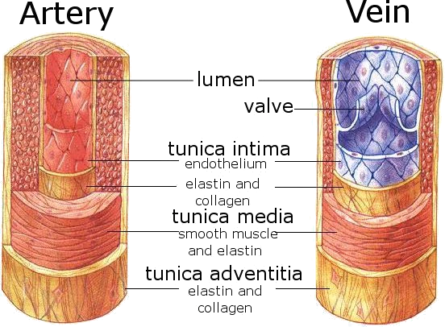

--
<!-- .slide: data-auto-animate data-background-image="images/p16_Artery.jpg" -->

&nbsp;

&nbsp;

&nbsp;

&nbsp;

&nbsp;

&nbsp;

Image source: MICROSCOPY CORE FACILITY, VIB GENT/SCIENCE PHOTO LIBRARY

--
### The five major types of blood vessels
#### Layers within the larger blood vessels
- **Intima** Lining of epithelial cells forming the endothelium.
- **Media** Contains load bearing components: elastin; collagen (collagen is 10-50 times stiffer than elastin); and smooth muscle cells. Collagen and elastic fibers allow vessels to stretch to prevent over expansion due to the pressure that is exerted on the walls.
- **Adventitia** Strong outer covering of arteries and veins. Connective tissue and some collagen and elastin.

--
### The five major types of blood vessels
#### Classification of blood vessels by structure and function

<table>
  <tr>
    <th> structure    </th>
    <th> diameter (mm)   </th>
    <th> wall thickness (h) (mm)   </th>
    <th> length  (cm)   </th>
    <th> h/radius </th>
    <th>  function</th>
  </tr><tr>
    <td>Aorta        </td>
    <td> 25    </td>
    <td> 2    </td>
    <td> 40    </td>
    <td> 0.16 </td>
    <td>  conduit</td>
  </tr><tr>
    <td> Medium arteries    </td>
    <td> 4    </td>
    <td> 0.8    </td>
    <td> 15    </td>
    <td> 0.40 </td>
    <td>  conduit, resistance</td>
  </tr><tr>
    <td> Arterioles    </td>
    <td> 0.3    </td>
    <td> 0.2    </td>
    <td> 0.2    </td>
    <td> 1.33 </td>
    <td>  resistance</td>
  </tr><tr>
    <td> Capillaries    </td>
    <td> 0.008    </td>
    <td> 0.001    </td>
    <td> 0.075    </td>
    <td> 0.25 </td>
    <td> exchange</td>
  </tr><tr>
    <td> Venules        </td>
    <td> 0.02    </td>
    <td> 0.002    </td>
    <td> 0.2    </td>
    <td> 0.20</td>
    <td>  conduit</td>
  </tr><tr>
    <td> Medium veins    </td>
    <td> 5    </td>
    <td> 0.5    </td>
    <td> 15    </td>
    <td> 0.20 </td>
    <td>  conduit</td>
  </tr><tr>
    <td> Large veins    </td>
    <td> 15    </td>
    <td> 0.8    </td>
    <td> 20    </td>
    <td> 0.11 </td>
    <td>  conduit</td>
  </tr><tr>
    <td> Vena cava    </td>
    <td> 30    </td>
    <td> 1.5    </td>
    <td> 40    </td>
    <td> 0.10 </td>
    <td>  conduit</td>
  </tr>
</table>

&nbsp;

Adapted from Handbook of Physiology, 1963.

<aside class="notes">Characteristic dimensions of human systemic blood vessels. The structure provides information on the function.</aside>

--
### The five major types of blood vessels
#### Classification of arteries by structure and function
- **Elastic or conducting arteries** largest diameters; pressure high and fluctuates
- **Muscular or medium arteries** smooth muscle allows vessels to regulate blood supply by constricting or dilating
- **Arterioles** transport blood from small arteries to capillaries

--
### The five major types of blood vessels
#### Classification of arteries by structure and function

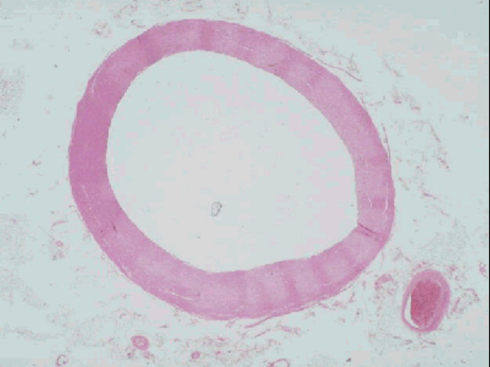
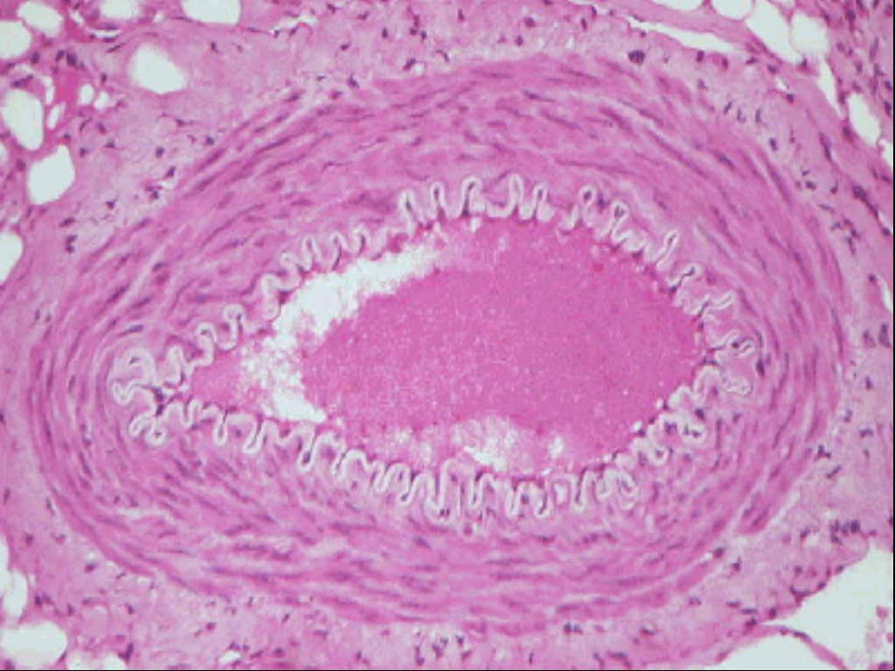

Elastic artery (left) and muscular artery (right).

<aside class="notes">Histological example of a large artery, which comprises of much more elastin and much less smooth muscle than more distal arteries. Histological example of a resistance artery, demonstrating the much larger proportion of smooth muscle than in more proximal, elastic arteries.</aside>

--
### The five major types of blood vessels
#### Classification of veins by structure and function

- **Venules and small veins** tubes of endothelium on delicate basement membrane
- **Medium and large veins** valves allow blood to flow toward heart but not in opposite direction
    
--
### The five major types of blood vessels
#### Capacitance (or compliance)

The arteries and veins are elastic. This means that they are compliant.

Compliance ($C$) is the ability to accommodate a volume ($V$) under a pressure ($P$).

\begin{equation}
  C = \dfrac{\Delta V}{\Delta P}
\end{equation}

<b>Role of compliance in arteries:</b> Arterial compliance transforms the pulsatile output of the heart into a continuous blood flow by the time the blood reaches the capillaries.</b>

--
<!-- .slide: data-auto-animate  -->
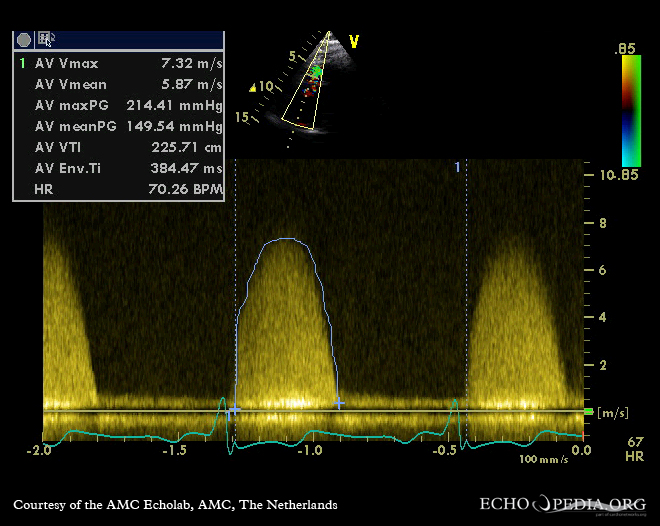

<b>Ejection from the left ventricle is pulsatile.</b> This Doppler ultrasound image of flow from the left ventricular outflow tract shows the rhythmic period of blood flow into the aorta followed by a period of no blood flow into the aorta.

--
<!-- .slide: data-auto-animate  -->

Capillary flow (shown here as nasal capillaries in response to a smell) is non-pulsatile.

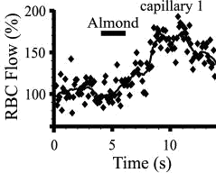

Chaigneau E et al. Two-photon imaging of capillary blood flow in olfactory bulb glomeruli. Proc Natl Acad Sci USA. 2003, 100:13081--6.

--
### The five major types of blood vessels
#### Capacitance (or compliance)

**Role of capacitance in veins**

Allows for a great change in the blood volume that resides in the venous system.

That is, at rest, there is a large blood volume in the veins.

During times of high oxygen demand this can be mobilised (due to signals received by the central nervous system that result in increased sympathetic outflow and contraction of smooth muscle in the veins).

--
### The five major types of blood vessels
#### Capacitance (or compliance)

  

    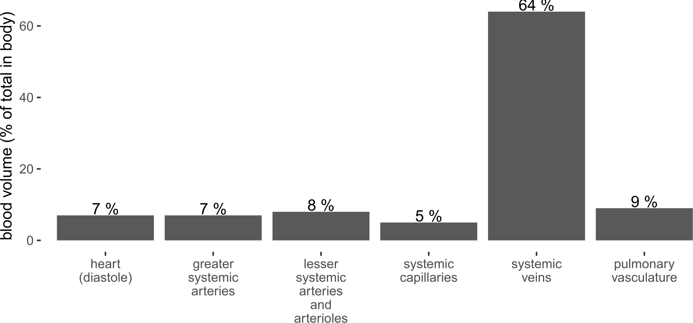
  

  

    

  

  

  

Image: M.Butlin. Created for MEDI2101

<aside class="notes">When at rest, the majority of the blood at any one time resides in the systemic veins. The veins have a very high capacitance to accommodate this. Veins also have smooth muscle and can contract (due to signals received by the central nervous system that result in increased sympathetic outflow) in order to distribute some this blood volume into the pulmonary vasculature and systemic arteries in order to increase blood flow and oxygenation of blood.</aside>

--
### The five major types of blood vessels
#### The endothelium
<ul>
    <li>  Long thought of as an inert single layer of cells lining blood vessels that passively allowing the passage of water and other small molecules across the vessel wall.</li>
    <li>  Located at the interface between the blood and the vessel wall of all blood vessels.</li>
    <ul>
      <li>  The cells are in close contact and form a layer that prevents blood cell interaction with the vessel wall.</li>
    </ul>
    <li>  It plays a critical role in:</li>
    <ul>
        <li>  the mechanics of blood flow (releases vasoactive substances, e.g. nitric oxide, to increase vessel diameter)</li>
        <ul>
          <li> contraction and relaxation of vascular smooth muscle</li>
        </ul>
        <li>  the regulation of coagulation</li>
        <li>  leukocyte adhesion</li>
        <li>  vascular smooth muscle cell growth</li>
        <li>  forming a barrier to the transvascular diffusion of liquids and solutes.</li>
    </ul>
</ul>

--
### The five major types of blood vessels
#### Capillaries

  

    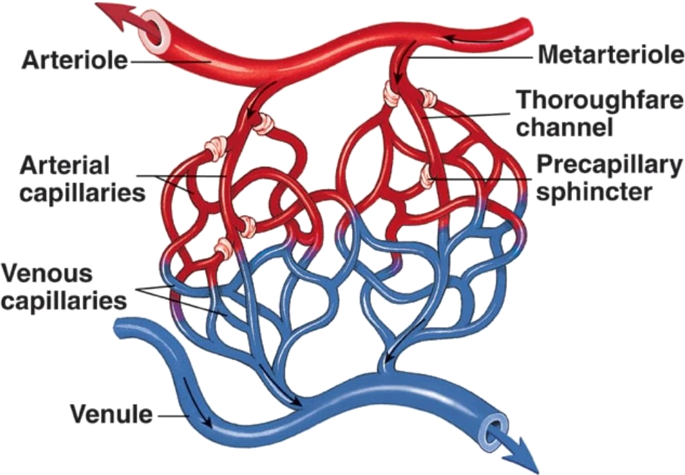
  

  

    <ul>
      <li>  Smooth muscle in arterioles, metarterioles, precapillary sphincters regulates blood flow into capillary network</li>
      <li>  Blood flows from arterioles through metarterioles, then through capillary network</li>
      <li>  Venules drain the network</li>
    </ul>
  

  

  

Image: Schematic of the capillary network and the feeding arterioles and draining venules. Tortora and Grabowski, Principles of Anatomy and Physiology.

--
### The five major types of blood vessels
#### Capillaries

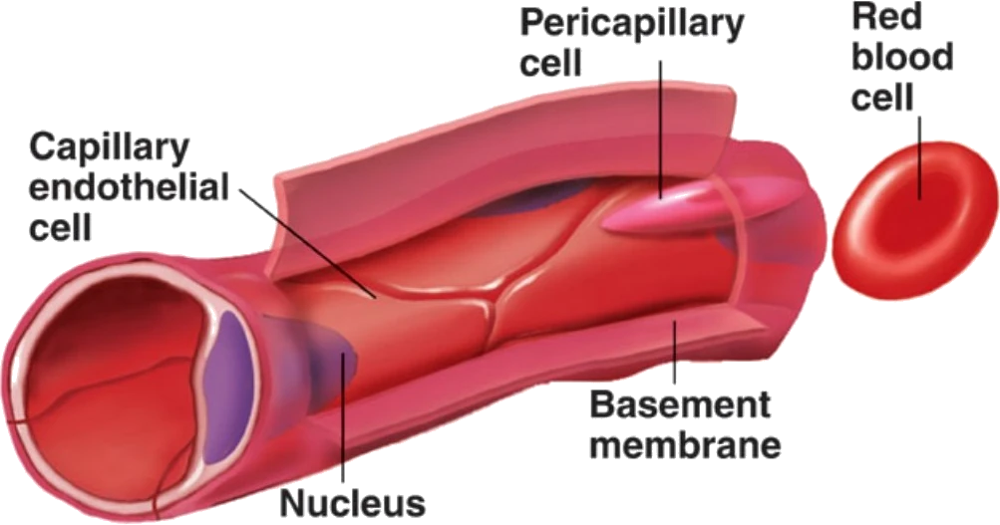

Capillaries are constructed of a single layer of squamous epithelial cells on a basement membrane.

The vessels are barely large enough for a red blood cell to pass through (4 to 9 micrometres diameter).

Capillary types classified by diameter and permeability:

<ul>
    <li> <b>Continuous</b> Do not have fenestrae</li>
    <li> <b>Fenestrated</b> Have pores</li>
    <li> <b>Sinusoidal</b> Large diameter with large fenestrae</li>
</ul>

Fenestrated and sinusoidal capillaries allow absorption and filtration of water and ions from blood to other body cells.

--
### Reflection quiz
#### Blood vessel structure and function
#### Compare and contrast the structure, mechanical properties, and functions of the five major types of blood vessels: arteries, arterioles, capillaries, venules, and veins.

<a href="https://flux.qa/DA285K">flux.qa/DA285K</a>

---
<!-- .slide: data-auto-animate-restart -->
#### Learning objective
# Cardiac cycle pressure changes
### Describe the pressure changes during the cardiac cycle and relate these to blood flow through the heart and vessels.

--
### Systemic arterial pressure over the cardiac cycle
####
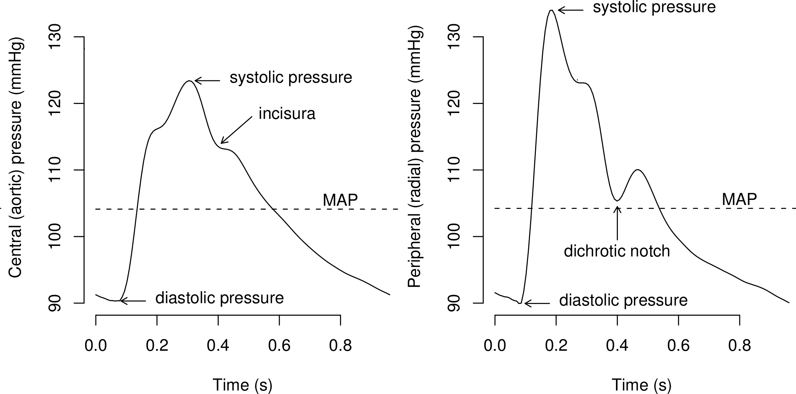

Image: Avolio AP, Butlin M, Walsh A. Arterial blood pressure measurement and pulse wave analysis–their role in enhancing cardiovascular assessment. 2010; 31 : R1–47.

--
### Systemic arterial pressure over the cardiac cycle
####

  

    
  

  

    
The major waveform features of the blood pressure waveform in the aorta (left) and brachial or radial artery (right).

    
Note that the incisura in the aortic waveform (caused by the closing of the aortic valve) is co-incident in approximate timing with the dichrotic notch in the radial waveform, even though the dichrotic notch is <em>not</em> caused by the closing of the aortic valve.

  

  

  

    
Image: Avolio AP, Butlin M, Walsh A. Arterial blood pressure measurement and pulse wave analysis–their role in enhancing cardiovascular assessment. 2010; 31 : R1–47.

--
### Systemic arterial pressure over the cardiac cycle
#### 

$\begin{equation}
  \mathrm{pulse\~pressure\~(PP)} =  \mathrm{systolic\~pressure}-\mathrm{diastolic\~pressure}
\end{equation}$

$\begin{eqnarray}
  \mathrm{mean\~pressure\~(MAP)}   & = & \mathrm{area\~under\~the\~curve} \\\\
                    & \approx & \mathrm{diastolic\~pressure} + \dfrac{1}{3}\mathrm{pulse\~pressure}\\
\end{eqnarray}$

The mean arterial pressure (MAP) is the statistical mean of the wave (i.e. the average). We do not need to <em>estimate</em> MAP (using the "1/3rd rule") if we have the waveform - we can find the average to get the true mean.

--
### Systemic arterial pressure over the cardiac cycle
#### Blood pressure throughout the systemic circulation

  

    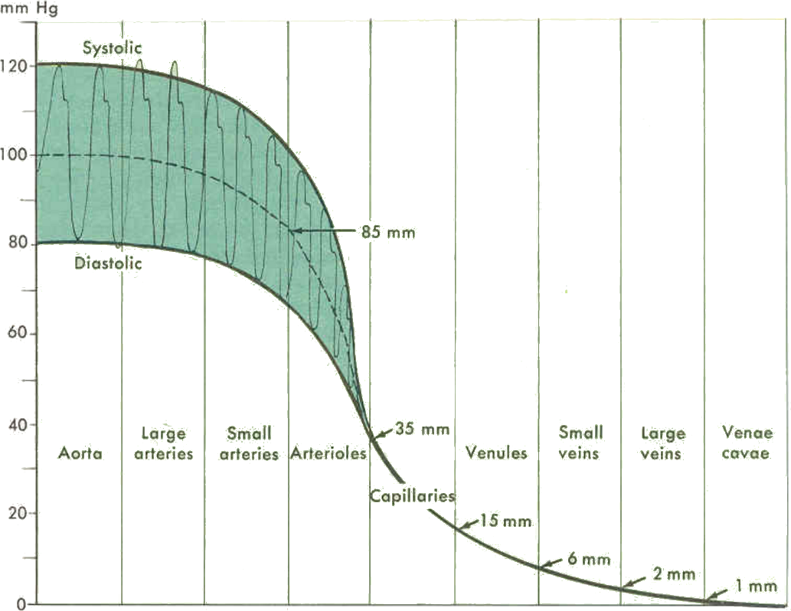
  

  

    
As we move away from the heart mean blood pressure falls.

    
It is the pressure difference that drives blood flow.
 
    
A sometimes unexpected (but always present) feature is that systolic pressure is higher in the brachial artery (large arteries) than in the aorta. This is due to wave reflection augmenting the waveform in the large arteries, but to a lesser extent at the aorta.

  

  

    

  

--
### Systemic arterial pressure over the cardiac cycle
#### Blood pressure throughout the systemic circulation

Image: Avolio AP, Butlin M, Walsh A. Arterial blood pressure measurement and pulse wave analysis–their role in enhancing cardiovascular assessment. 2010; 31 : R1–47.

--
### Reflection quiz
#### Cardiac cycle pressure changes
#### Describe the pressure changes during the cardiac cycle and relate these to blood flow through the heart and vessels.

<a href="https://flux.qa/DA285K">flux.qa/DA285K</a>

---
<!-- .slide: data-auto-animate-restart -->
#### Learning objective
# Blood flow dynamics
### Explain the relationship between blood flow, pressure gradients, and resistance, using Poiseuille's Law to describe the factors influencing resistance.

--
### Blood flow, pressure gradients and resistance
####

  

    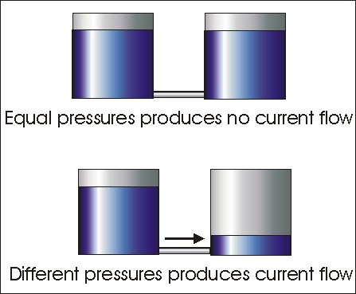
  

  

    
Blood flows due to a pressure gradient. (We have already covered the concept of bulk flow in the respiratory component).

    
That is, a fluid (liquid or gas) will travel from a region of higher pressure to a region of lower pressure.

  

  

  

Image source: <a href="https://sites.psu.edu/musingsofameteorologist/2013/02/05/how-does-air-move/">https://sites.psu.edu/musingsofameteorologist/2013/02/05/how-does-air-move/</a>

--
<!-- .slide: data-auto-animate -->
### Blood flow, pressure gradients and resistance
####

\begin{equation}
  \mathrm{flow} = \dfrac{P_1 - P_2}{\mathrm{resistance}}
\end{equation}

For those that have done a little physics, you may recognise this from electrical work and Ohm's law:

\begin{equation}
  V  =  I\cdot R
\end{equation}

\begin{equation}
  \mathrm{or\~\~}I  =  \frac{V}{R}
\end{equation}

\begin{equation}
  \mathrm{flow} = \dfrac{\mathrm{potential\~difference\~or\~pressure\~difference}}{\mathrm{resistance}}
\end{equation}

--
<!-- .slide: data-auto-animate -->
### Blood flow, pressure gradients and resistance
####
Blood flow in arteries can often be analysed through electrical model current flow (electrical) and fluid flow (blood) are analogous in many aspects of physics.

<table>
  <tr>
    <th> electrical charge </th>
    <th> blood </th>
  </tr><tr>
    <td> voltage ($V$) </td>
    <td> blood pressure ($P$) </td>
  </tr><tr>
    <td> current ($I$) </td>
    <td> blood flow ($\dot{Q}$) </td>
  </tr><tr>
    <td> resistance ($R$) </td>
    <td> resistance ($R$) </td>
  </tr>
</table>

--
<!-- .slide: data-auto-animate -->
### Blood flow, pressure gradients and resistance
####
\begin{equation}
  \mathrm{flow} = \dfrac{P_1 - P_2}{\mathrm{resistance}}
\end{equation}

\begin{equation}
  \mathrm{resistance} \propto \dfrac{1}{\mathrm{vessel\~radius}^4}
\end{equation}

Therefore,

\begin{equation}
  \mathrm{flow} \propto \left(P_1 - P_2\right)\cdot \mathrm{vessel\~radius}^4
\end{equation}

<b>Example:</b>

If we halve the radius of a vessel, we increase resistance by $2^{4}=16$, resulting in $1/16^{th}$ of the flow.

--
<!-- .slide: data-auto-animate data-background-image="images/stainless_steel_drinking_straws.webp" data-background-size="contain" -->

--
<!-- .slide: data-auto-animate -->
### Blood flow, pressure gradients and resistance
####

  

    

      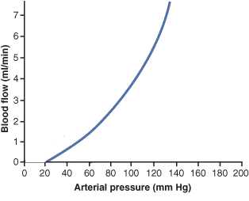
      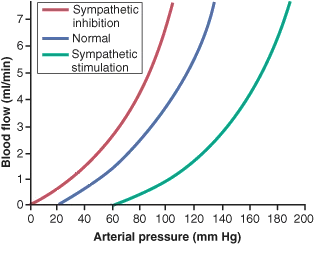
    

  

  

\begin{equation}
flow = \dfrac{P_1 - P_2}{resistance}
\end{equation}

Increased arterial blood pressure ($P_1$) increases blood flow through a larger difference of $P_1$ to $P_2$ (where $P_2$ is downstream pressure).

Increases vessel radius (e.g. sympathetic inhibition), decreases resistance, increasing flow.

  

  

  

Image: Guyton and Hall Textbook of Medical Physiology.

<aside class="notes">Flow is proportional to the pressure difference. If we consider the venous system near atmospheric pressure (0 mmHg, though actually pressure in the venous system is a little higher than this), then the driving force for blood flow is the arterial pressure minus 0 mmHg. Sympathetic stimulation changes the resistances of vessels. Increased resistance decreases flow and decreased resistance increases flow. The pressure at which there is zero flow is called the critical closing pressure (this is more applicable in the intracrannial space - more on this later).</aside>

--
<!-- .slide: data-auto-animate -->

--
<!-- .slide: data-auto-animate -->
### Blood flow, pressure gradients and resistance
####

  

    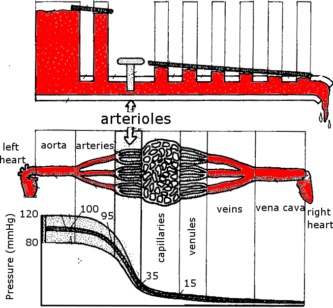
  

  

    
Flow is driven by a pressure difference between two regions.

    
Therefore, blood will flow from the aorta, to the arteries, to the arterioles, to the capillaries, to the venules, to the veins, then to the vena cava as pressure gets lower and lower as we travel through the systemic vasculature.

    
The arterioles have highly variable resistance, and therefore can regulate the pressure drop, and thus blood flow across this segment.

  

  

  

Image: Medical Colouring in Book

--
### Reflection quiz
#### Blood flow dynamics
#### Explain the relationship between blood flow, pressure gradients, and resistance, using Poiseuille's Law to describe the factors influencing resistance.

<a href="https://flux.qa/DA285K">flux.qa/DA285K</a>

---
<!-- .slide: data-auto-animate-restart -->
#### Learning objective
# Mean arterial pressure
### Define mean arterial pressure and explain its relationship with cardiac output and total peripheral resistance.

--
### MAP, CO and total peripheral resistance
####

We have so far talked about pressure, resistance and flow in general terms. If we lump the systemic circulation together, we can equate these terms (left column) to the systemic circulation as a whole (right column).

<table>
  <tr>
    <th> fluid dynamics in a tube </th>
    <th> systemic cardiovasculature </th>
  </tr><tr>
    <td> $P_1 - P_2$              </td>
    <td> mean arterial pressure $-$ venous pressure</td>
  </tr><tr>
    <td> resistance               </td>
    <td> total peripheral resistance (TPR) </td>
  </tr><tr>
    <td> flow                     </td>
    <td> cardiac output (CO)</td>
  </tr>
</table>

--
### MAP, CO and TPR
#### (Mean arterial pressure, cardiac output and total peripheral resistance)

$\begin{align}
  \mathrm{flow} & =  \dfrac{P_1 - P_2}{\mathrm{resistance}}\\\\
  \mathrm{CO}   & =  \dfrac{\mathrm{MAP} - \mathrm{venous\~pressure}}{\mathrm{TPR}}\\\\
  \\mathrm{CO}  &\approx  \dfrac{\mathrm{MAP}}{\mathrm{TPR}}
\end{align}$

--
### MAP, CO and TPR
#### (Mean arterial pressure, cardiac output and total peripheral resistance)

**What is total peripheral resistance?**

The combined resistance of all arteries, arterioles and capillaries in the systemic vasculature.

It can be modified by:
- combined regional changes in arteriolar resistance
- combined regional changes in regulation at the pre-capillary area

--
### Reflection quiz
#### Mean arterial pressure
#### Define mean arterial pressure and explain its relationship with cardiac output and total peripheral resistance.

<a href="https://flux.qa/DA285K">flux.qa/DA285K</a>

---
<!-- .slide: data-auto-animate-restart -->
#### Learning objective
# Blood flow regulation
### Understand the mechanisms of local (regional) short-term and long-term autoregulation of blood flow, including oxygen, metabolic, and myogenic theories, as well as angiogenesis and collateral circulation.

--
### Local (regional) blood flow autoregulation
####

We will be talking next week about systemic regulation of blood pressure and blood flow.

However, different organs need different blood flow according to the activity and metabolic requirements.

Therefore, there must be **regional** as well as **systemic** regulation of blood flow.

--
### Local (regional) blood flow autoregulation
####

Autoregulation describes the ability of local tissue to counter local blood flow changes due to systemic changes in blood pressure.

Autoregulation exists to some extent in all tissues, but is very strong in the brain (cerebral autoregulation) and in the coronary circulation.

--
### Local (regional) blood flow autoregulation
####

  

    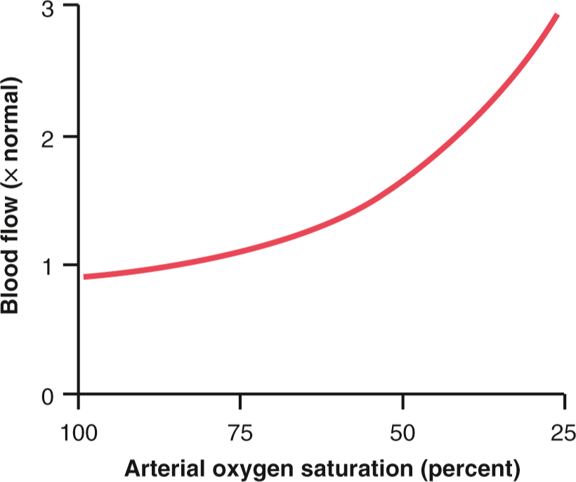
  

  

    
Decreasing the oxygen carrying capacity of blood (decrease atmospheric pO2, pneumonia, carbon monoxide poisoning) causes an increase in <b>local</b> blood flow, often enough to compensate for the loss of oxygen.

  

  

Image: Guyton and Hall Textbook of Medical Physiology.

--
<!-- .slide:  data-auto-animate data-background-image="images/Sprinter_at_starting_block.jpg"-->
### Local (regional) blood flow autoregulation
#### Example

During exercise, skeletal muscle can have as much as a 10 times greater oxygen consumpation and creates more carbon dioxide that needs to be removed, therefore requires greater blood flow. Vasodilation in the arteries supplying the skeletal muscle can in part facilitate this (along with increased cardiac output).

At the same time, the brain requires a constant supply of blood, regardless of changes in cardiac output. In this case, local vascular regulation ensures that the blood flow to the brain is constant, in the face of changes in blood pressure and cardiac output.

The precise <em>mechanism</em> behind regional control of blood flow is unknown - but we have some theories...

--
### Local (regional) blood flow autoregulation
#### Theories for local autoregulation mechanism

**Vasodilator theory of local response to low oxygen**

1. $\downarrow$ oxygen concentration in blood
1. $\uparrow$ vasodilator substance formation
1. $\uparrow$ diffusion of vasodilators to interstitial fluid
1. $\downarrow$ resistance at local precapillary sphincters and metarterioles.

**Vasodilators:** adenosine (through increased ATP degradation), adenosine phosphates, carbon dioxide, potassium ions, hydrogen ions (from lactic acid)

--
### Local (regional) blood flow autoregulation
#### Theories for local autoregulation mechanism

**Oxygen (or nutrient) demand theory of local response to low oxygen**

Oxygen is required for smooth muscle contraction.

Therefore, absence of oxygen means smooth muscle cannot contract i.e. dilation and lower resistance.

--
### Local (regional) blood flow autoregulation
#### Theories for local autoregulation mechanism

**Metabolic theory**

1. $\uparrow$ blood pressure.
1. $\uparrow$ blood flow.
1. $\downarrow$ decrease concentration of metabolites (due to greater volume passing through vessel bed). Most metabolites are vasodilators.
1. $\downarrow$ vasodilation ($\uparrow$) vasoconstriction.
1. $\downarrow$ blood flow.

--
### Local (regional) blood flow autoregulation
#### Theories for local autoregulation mechanism

**Myogenic theory**

Sudden stretch of the vessel wall causes smooth muscle to contract.

i.e. direct myogenic response of smooth muscle to stretch decreases vessel diameter and increases resistance.

**Mechanism:** stretch opens calcium channels and influx of calcium causes muscle contraction.

--
<!-- .slide: data-background="#111111" -->

So which theory is correct?

Most likely a combination of all four theories.

--
### Local (regional) blood flow autoregulation
#### Hyperaemic response - Reactive hyperaemia

  

    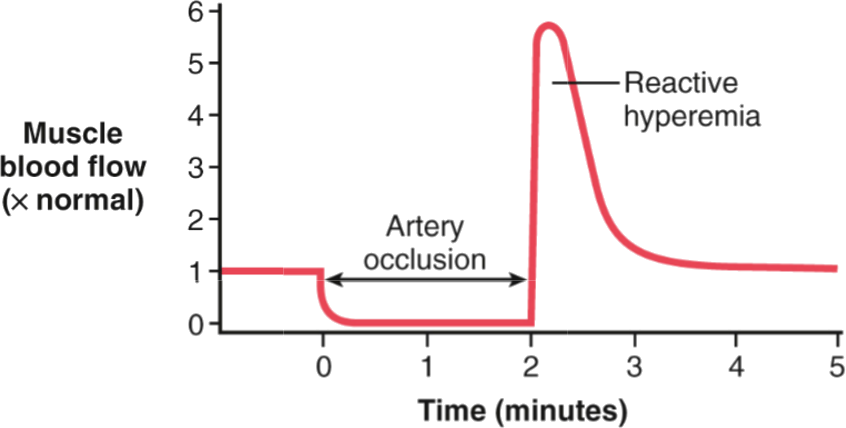
  

  

      
Reactive hyperaemia:

      <ul>
          <li> blood flow blocked to tissue.</li>
          <li> local metabolic demand during flow occlusion leads to vasodilatory metabolites, decreasing local resistance.</li>
          <li> when blood flow is restored, large compensatory blood flow due to vasodilated bed.</li>
          <li> additional effect of increased blood flow inducing increased shear on the endothelium, causing release of nitric oxide, causing further </li>arterial dilation.
      </ul>
  

  

  

Image: Guyton and Hall Textbook of Medical Physiology.

--
### Local (regional) blood flow autoregulation
#### Hyperaemic response - Reactive hyperaemia

  

    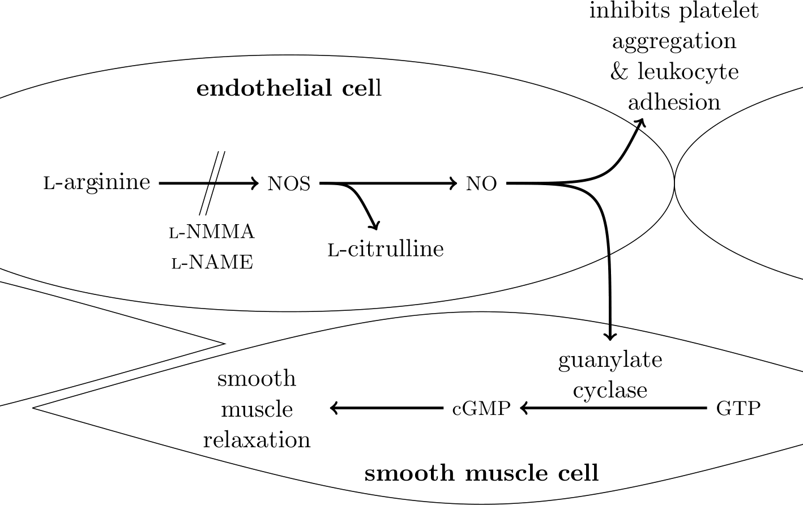
  

  

    
Shear stress on the endothelial cell (i.e. blood flowing along the vessel wall) stimulates the l-arginine–nitric oxide (NO) pathway inducing smooth muscle relaxation.

    
l-arginine is oxidised via nitric oxide synthase (NOS) to form NO.

    
NO in the smooth muscle cell stimulates guanylate cyclase, which converts guanosine triphosphate (GTP) to cyclic guanosine monophosphate (cGMP), which in turn causes smooth muscle relaxation.

    <!-- 
NO is also involved in the inhibition of platelet aggregation and leukocyte adhesion.}% The conversion of l-arginine to NO is prevented by analogues of l-arginine, such as N G -monomethyl-l-arginine (l-NMMA) and N $\omega$-nitro-l-arginine methyl ester (l-NAME)
 -->
  

  

  

    
Image: Butlin, M. Structural and functional effects on large artery stiffness: An in-vivo experimental investigation. PhD Thesis, UNSW, 2007.

--
### Local (regional) blood flow autoregulation
#### Hyperaemic response - Active hyperaemia

  

    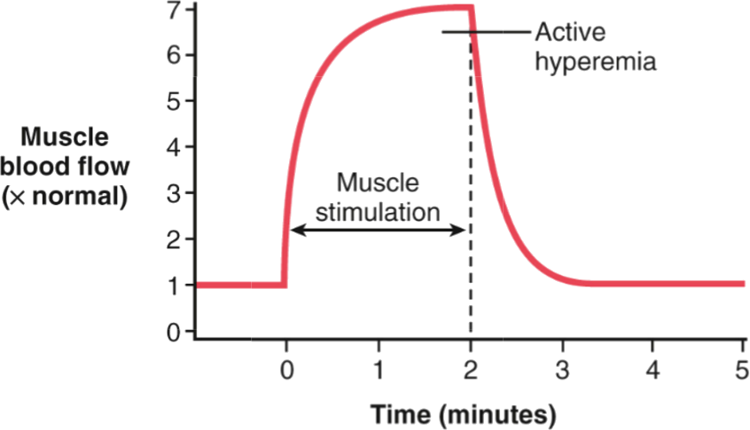
  

  

    
Active hyperaemia:

    <ul>
      <li> increased metabolic demand due to increased tissue activity</li>
      <li> local metabolism leads to vasodilator substances being generated</li>
      <li> dilation of vessels, decreased resistance, and increased blood flow</li>
    </ul>
  

  

  

Image: Guyton and Hall Textbook of Medical Physiology.

<!-- LO2.2.? Be familiar with the Korotkoff sounds and palpation of the pulse in order to estimate brachial arterial systolic and diastolic pressure.]{Measurement of blood pressure: Korotkoff sounds and palpation of the pulse}  Attend this week's practical activity. -->

---
<!-- .slide: data-auto-animate-restart -->
#### Learning objective
# Blood constituents
### Recall the constituents of blood and their general functions, with detailed knowledge of red blood cells and hemoglobin.

See this week's on-line module in iLearn.

