<!-- .slide: data-auto-animate-restart id="MEDI2101Wk6_1"-->
#### MEDI2101 Cardiovascular and Respiratory System.
### Block 2: Cardiovascular System
# Week 7: Cardiovascular regulation
##### Assoc. Prof. Mark Butlin (PhD, BE, SFHEA) (he/him)

Macquarie Medical School, Faculty of Medicine, Health and Human Sciences Macquarie University. On the land of the Wallumattagal clan of the Dharug Nation.

&nbsp;

&nbsp;

&nbsp;

This material is provided to you as a Macquarie University student for your individual research and study purposes only. You cannot share this material without permission. Macquarie University is the copyright owner of (or has licence to use) the intellectual property in this material. Legal and/or disciplinary actions may be taken if this material is shared without the University’s written permission.

--
### Open (physical and virtual) door
####

MEDI2101 Q&A Forum.

MEDI2101 iLearn private message.

See Assoc. Prof. Butlin's availability and book a time, face to face or video conference.

(Links on the MEDI2101 iLearn homepage.)

---
<!-- .slide: data-auto-animate-restart -->
**Cardiovascular regulation:** a mechanism that alters blood flow (and pressure) to maintain optimal perfusion. 

Requires an <em>input</em> (measurement) and an <em>output</em> (action).

--
<!-- .slide: data-background="#111111" -->

Blood pressure cannot be controlled directly.

--

Blood pressure cannot be controlled directly.</h3>

Therefore, we either need to alter stroke volume ($SV$) or heart rate ($HR$) to alter cardiac output ($CO$), change total peripheral resistance ($TPR$), or increase or decrease blood volume.

$\begin{eqnarray}
\mathrm{MAP} & = & \mathrm{CO} \times \mathrm{TPR} \\\\
                & = & \mathrm{SV} \times \mathrm{HR} \times \mathrm{TPR}
\end{eqnarray}$

$\begin{equation}
\mathrm{MAP} \propto \mathrm{blood~volume}
\end{equation}$

All of the cardiovascular regulatory pathways must result in a change in one or more of these factors (SV, HR, TPR, and/or blood volume) if there is a change in arterial blood pressure.

---
<!-- .slide: data-auto-animate-restart -->
#### Learning objective
# Venous return mechanisms
### Explain how venous return to the heart can be altered by the respiratory pump, skeletal muscle pump, abdominal compression reflex, and sympathetic stimulation of systemic veins.

--
### Altered venous return to the heart
####

  

    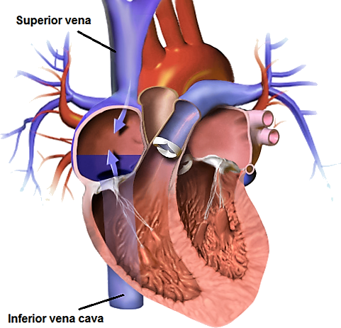
  

  

    
When thinking of venous return, it is usually referring to return of blood from the systemic vasculature via the inferior and superior vena cava to the right heart.

    
However, this same flow must logically also return to the left heart after travelling through the pulmonary circulation.

  

Image modified from BruceBlaus, <a href="https://commons.wikimedia.org/wiki/File:Vena_Cava-ar.png">https://commons.wikimedia.org/wiki/File:Vena_Cava-ar.png</a>

--
### Altered venous return to the heart
####

$\begin{align}
\mathrm{venous\~return} &= \dfrac{P_1 - P_2}{\mathrm{resistance}}\\\\
                &= \dfrac{\mathrm{venous\~pressure} - \mathrm{right\~atrial\~pressure}}{\mathrm{venous\~resistance}}
\end{align}$

Venous return can be increased through a number of mechanisms:

- respiratory pump
- skeletal muscle pump
- abdominal compression reflex
- sympathetic stimulation of the systemic veins

--
### Altered venous return to the heart
#### Respiratory pump (a.k.a. thoracic pump)

**inspiration**

- decreased intrathoracic pressure $\rightarrow$ decreased right atrial pressure
- increased abdominal pressure $\rightarrow$ increased inferior vena cava blood pressure
- increased (venous pressure $-$ right atrial pressure), therefore more blood flow to the heart

**expiration**

- increased intrathoracic pressure $\rightarrow$ increased pulmonary venous pressure
- increased blood flow to the left side of the heart

Therefore, an increase in respiration = increased venous return to the heart.

--
<!-- .slide: data-auto-animate data-background="#111111" -->
<video data-autoplay data-src="images/respiratorypump.mp4"></video>

Source: <a href="https://www.youtube.com/watch?v=RVYKlsoEEMU">www.youtube.com/watch?v=RVYKlsoEEMU</a>

--
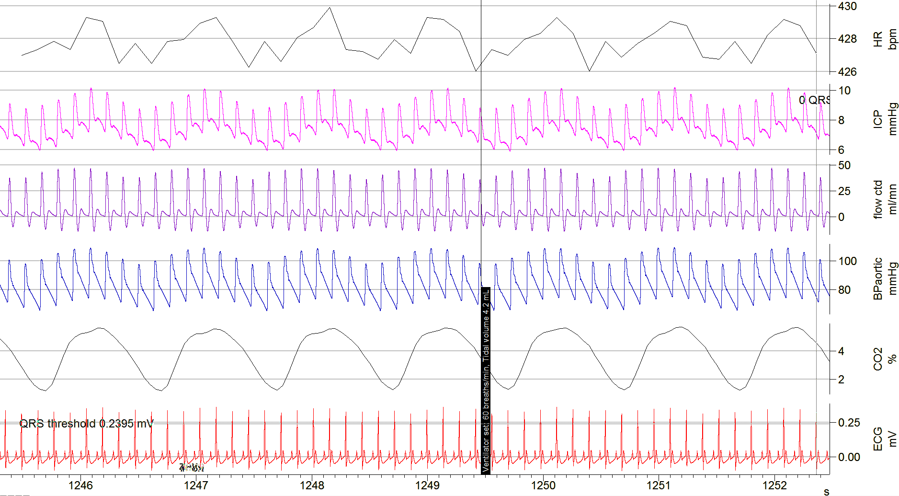

--
### Altered venous return to the heart
#### Skeletal muscle pump

Mechanism of increased venous return during movement (especially <em>dynamic</em> (not isometric) exercise).

  

    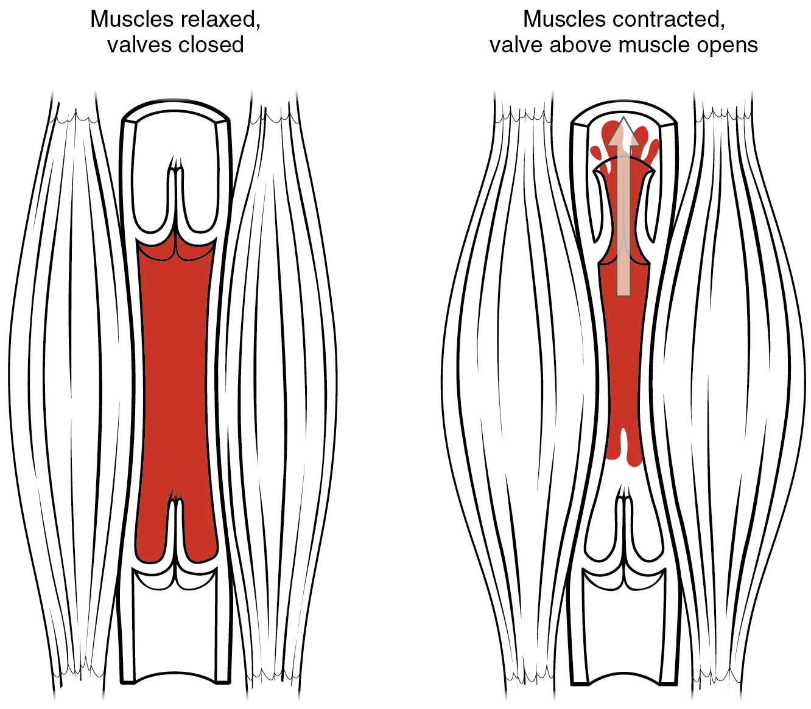
  

  

    
During skeletal muscle contraction (and shortening), the veins are compressed, increasing local pressure and increasing flow.

    
When the skeletal muscle relaxes and pressure drops, <b>retrograde flow of blood is prevented by the valves in the veins.</b>

  

  

    
<a href="http://cnx.org/content/col11496/1.6/">OpenStax College, Anatomy & Physiology, Connexions Web site.</a>

  

--
### Altered venous return to the heart
#### Abdominal compression reflex
Central nervous system output can cause skeletal muscle contraction, especially abdominal muscle.

This compresses venous reservoirs, increasing effective blood volume and venous return to the heart.

Evidence for this mechanism: if the majority of skeletal muscle is fundamentally inactive (e.g. people who are paralysed), hypotensive (systemic blood pressure drop) episodes are much more frequent*.

*Guyton and Hall Textbook of Medical Physiology, Chapter 18.

--
### Altered venous return to the heart
#### Sympathetic stimulation of systemic veins
The venous system is a large reservoir of blood volume. Vasoconstriction of the veins increases the effective blood volume in the arterial system and also increases return of blood to the heart.

  

    
  

  

    

  

Image created for MEDI2101.

--
### Altered venous return to the heart
#### Sympathetic stimulation of systemic veins

  

    
  

  

    

  

By shifting some of the blood volume from the venous to the arterial system it will increase pressure:

\begin{equation}
  \mathrm{systemic\~arterial\~pressure} \propto \mathrm{systemic\~arterial\~volume}
\end{equation}

Image created for MEDI2101.

<!--
Increasing arterial pressure will increase arterial blood flow:

\begin{equation}
  \mathrm{flow} = \dfrac{\mathrm{arterial\~pressure} - \mathrm{venous\~pressure}}{\mathrm{total\~peripheral\~resistance}}
\end{equation} -->

--
### Altered venous return to the heart
#### The effect of gravity, and hydrostatic pressure

The fluid (e.g. blood) in our body can move in response to gravity. This is especially true of blood under low pressure (i.e. venous blood). 

As the venous system is very compliant, a change in body position can alter the distribution of blood if there is change in the hydrostatic pressure (height of the column of fluid). 

When standing, there is a greater hydrostatic pressure (greater weight of the fluid) toward the feet than there is closer to the heart. This means that when we stand, the compliant venous system is more distended, and there is an increased blood volume in the lower extremities. This also impacts on venous return of blood to the heart, as the flow of blood must overcome the hydrostatic pressure within the column of fluid that is the veins.

--
### Reflection quiz
#### Venous return mechanisms
#### Explain how venous return to the heart can be altered by the respiratory pump, skeletal muscle pump, abdominal compression reflex, and sympathetic stimulation of systemic veins.

<a href="https://flux.qa/DA285K">flux.qa/DA285K</a>

---
<!-- .slide: data-auto-animate-restart -->
#### Learning objective
# Impact on cardiac output
### Explain how venous return affects cardiac output and blood volume, incorporating the Frank-Starling law and the three atrial reflexes (Bainbridge reflex, volume reflex, cardiopulmonary baroreceptors).

--
### Altered venous return to the heart
#### Frank-Starling law of the heart

**Definition: Frank-Starling mechanism of the heart**

An increase in the return of blood from the venous system (venous return) causes a greater volume of blood in the ventricle at the end of diastole (end diastolic volume), in turn increasing the contraction force of the heart muscle fibers (cardiac contractility), and therefore the greater the stroke volume and cardiac output.

--
### Altered venous return to the heart
#### Frank-Starling law of the heart

  

    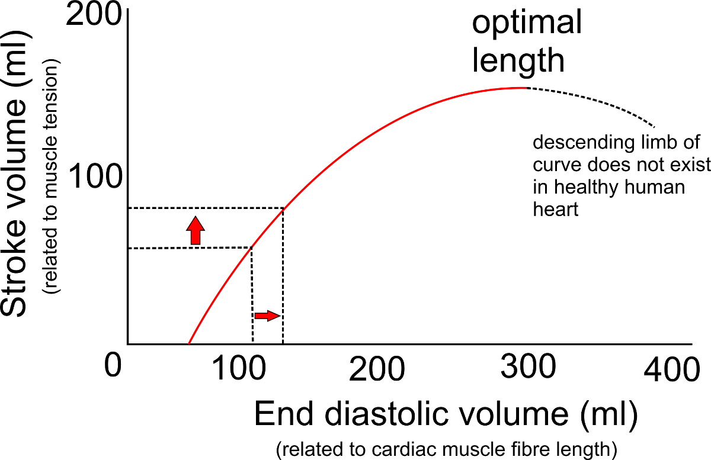
  

  

    
At low diastolic volumes, a small change in end diastolic volume results in a larger change in stroke volume (and cardiac output) than the same change in diastolic volume at high diastolic volumes.

    
<b>How can the increase in stroke volume exceed the increase in end diastolic volume?</b>

  

  

    

  

--
### Altered venous return to the heart
#### Frank-Starling law of the heart
**What is cardiac contractility?** The strength of contraction of the myocardial fibres.

The greater the contraction, the lower the end systolic volume, and the greater the stroke volume (therefore, greater cardiac output).

(A) end diastolic volume and (B) end systolic volume.

Increased cardiac contractility decreases end systolic volume, therefore increasing stroke volume.

\begin{equation}
\mathrm{stroke\~volume} = \mathrm{end\~diastolic\~volume} - \mathrm{end\~systolic\~volume}
\end{equation}

--
### Altered venous return to the heart
#### Atrial reflex: The Bainbridge Reflex alters heart rate and cardiac contractility

- Response to increase venous pressure (transmitted to the right atrium, distending the atrium)
- Activates the venoatrial stretch receptors.
- Transmits along the vagus nerve to the central nervous system, feeding back to the heart through the sympathetic and parasympathetic system.
- An <em>increase</em> in atrial pressure causes an <em>increase</em> in cardiac contractility and an <em>increase</em> in heart rate.

The Bainbridge reflex can cause about a 40 to 60% increase in heart rate in response to increased atrial pressure.

An additional 15% increase in heart rate in response to increased atrial pressure can be due to direct stretching of the sinus node, increasing the pacemaker rate.

--
### Altered venous return to the heart
#### Atrial volume reflex

- Atrial stretch is sensed by strectch receptors in the endocardium of the atria. (Sometimes referred to as <b>low pressure</b> baroreceptors.)

  

1.  Causes release of Atrial Natriuretic Peptide (ANP), inducing natriuresis.

<ul>
  <li> $\downarrow$ kidney afferent arteriolar resistance </li>
  <li> $\uparrow$ glomerular capillary pressure</li>
  <li> $\uparrow$ filtration of fluids in kidney tubules</li>
  <li> $\downarrow$ blood volume</li>
</ul>
  

  

    
    
2. Low pressure baroreceptors also signal directly to the hypothalamus of the brain. Decreases antidiuretic hormone production.

    <ul>
      <li> $\downarrow$ antidiuretic hormone</li>
      <li> $\downarrow$ reabsorption of water from tubules</li>
      <li> $\downarrow$ blood volume</li>
    </ul>
    
  

  
Both mechanisms increase fluid loss (via the kidneys), decreasing blood volume and therefore blood pressure.

Antidiruetic hormone is also knows as vasopressin or arginine vasopressin or argipressin.

<!-- ### Altered venous return to the heart
#### Atrial and pulmonary artery stretch receptors (cardiopulmonary baroreceptors)
The atria and pulmonary artery contain stretch receptors. 
As pressure increases within an artery (or atrium), the vessel (or atrium) will stretch. 
Therefore, these stretch receptors are called baroreceptors (baro = pressure, as in barometric). 
The stretch receptors in the atrium and pulmonary artery are known specifically as <em>cardiopulmonary baroreceptors</em>*.
These receptors have a **negative feedback** to the central nervous system in response to vessel wall stretch as a result of increase/decrease in blood pressure.

&nbsp;

* This is distinct from what is termed, simply, "the baroreceptors" located in the aorta and carotid artery.
 -->

--
### Altered venous return to the heart
#### Summary

Increased venous return to the heart can potentially:

  

    
<b>Positive feedback (increases arterial blood pressure)</b>

    <ul>
      <li> increase stroke volume directly (increased end diastolic volume can increase stroke volume).</li>
      <li> increase stroke volume through Frank-Starling mechanism (increased contractility, decreasing end systolic volume).</li>
      <li> increase heart rate and stroke volume through the Bainbridge reflex (activation of venoatrial stretch receptors).</li>
    </ul>
  

  

    
<b>Negative feedback (decreases arterial blood pressure)</b>

    <ul>
      <li> decrease blood volume through the atrial volume reflex.</li>
      <!--<li> decrease blood volume through atrial natriuetic peptide release.</li>-->
      <!--<li> decrease stroke volume and heart rate through activiation of the cardiopulmonary baroreceptors.</li>-->
    </ul>
  

  

    

  

--
### Altered venous return to the heart
#### Summary

Decreased venous return to the heart can potentially:

  

    
<b>Positive feedback (decreases arterial blood pressure)</b>

    <ul>
      <li> decrease stroke volume directly (decreased end diastolic volume can decrease stroke volume).</li>
      <li> decrease stroke volume through Frank-Starling mechanism (decreased contractility, increasing end systolic volume).</li>
      <li> decrease heart rate and stroke volume through the Bainbridge reflex (less activation of venoatrial stretch receptors).</li>
    </ul>
  

  

    
<b>Negative feedback (increases arterial blood pressure)</b>

    <ul>
      <li> increase blood volume through the reduced atrial volume reflex.</li>
      <!--<li> increase blood volume through reduced atrial natriuetic peptide release.</li>-->
      <!--<li> increase stroke volume and heart rate through less activation of the cardiopulmonary baroreceptors.</li>-->
    </ul>
  

  

    

  

--
### Reflection quiz
#### Impact on cardiac output
#### Explain how venous return affects cardiac output and blood volume, incorporating the Frank-Starling law and the three atrial reflexes (Bainbridge reflex, volume reflex, cardiopulmonary baroreceptors).

<a href="https://flux.qa/DA285K">flux.qa/DA285K</a>

---
<!-- .slide: data-auto-animate-restart -->
#### Learning objective
# Autonomic innervation
### Describe the differential sympathetic and parasympathetic innervation of the heart and systemic vasculature, including the role of the vasomotor center in the brain.

--
### Sympathetic and parasympathetic innervation
####

  

    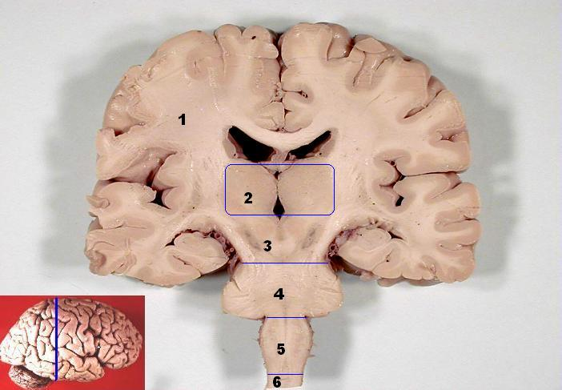
  

  

    
Centers  that regulate the cardiovascular system are spread across the brain

    
A large concentration of neurons controlling breathing and the cardiovascular system are centred in the lower brain, namely the medulla (5) and spinal cord (6).

  

Image: By John A Beal, PhD, Dep't. of Cellular Biology \& Anatomy, Louisiana State University Health Sciences Center – Shreveport [Creactive Commons BY 2.5], via Wikimedia Commons

--
### Sympathetic and parasympathetic innervation
#### Vasomotor centre of the brain*

  

    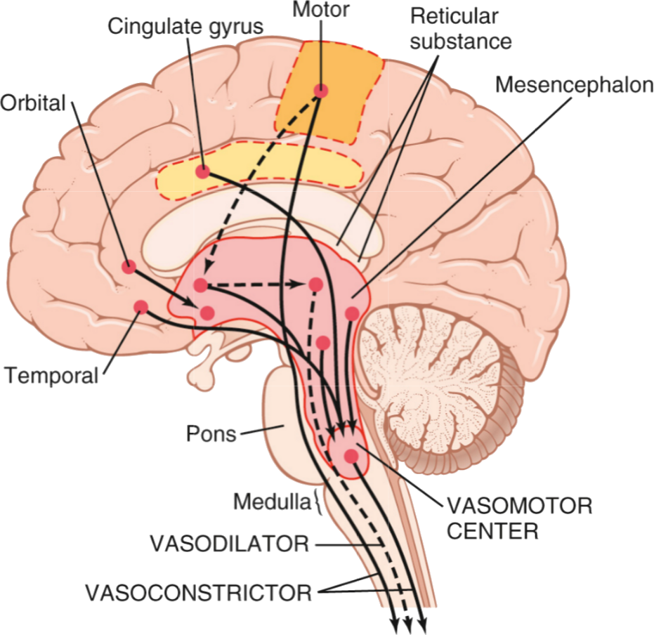
  

  

    
* The vasomotor centre is <em>not</em> the motor cortex that controls skeletal muscle movement. However, the motor cortex does communicate with the vasomotor centre, which is a pathway employed in exercise.

  

Image: Guyton and Hall Textbook of Medical Physiology

--
### Sympathetic and parasympathetic innervation
#### Vasomotor centre of the brain*

  

    
  

  

<b>Inputs and processing</b>

<ul>
<li> <b>vasoconstrictor area</b> anterolateral portions of the upper medulla</li>
<li> <b>vasodilator area</b> anterolateral portions of the lower half of the medulla</li>
<li> <b>sensory area</b> nucleus tractus solitarius in the posterolateral portions of the medulla and lower pons, <em>receives peripheral signals from the vagus and glossopharyngeal nerves</em>.</li>
</ul>
  

Image: Guyton and Hall Textbook of Medical Physiology

--
<!-- .slide: data-auto-animate   -->
### Sympathetic and parasympathetic innervation
#### Vasomotor centre of the brain

  

    
  

  

<b>Outputs from the vasomotor complex</b>

<ul>
<li> <b>sympathetic nerve fibres</b> extend from the lateral vasomotor centre.</li>
<li> <b>parasympathetic nerve fibres</b> extend from the medial vasomotor centre.</li>
</ul>

Therefore, the vasomotor centre has influence over heart rate and cardiac contractility, altering cardiac output. Sympathetic system also innervates blood vessels.)

The vasomotor centre <em>processes inputs</em> to invoke these functional responses. <b>It does not invoke these responses without an input.</b>

Image: Guyton and Hall Textbook of Medical Physiology

--
### Sympathetic and parasympathetic innervation
#### Sympathetic and parasympathetic nervous input to the heart

  

    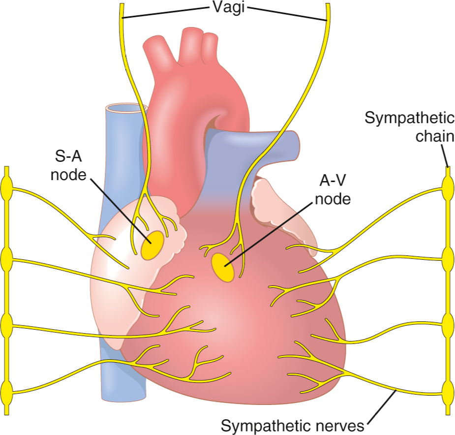
  

  

<ul>
  <li> Sympathetic stimulation:</li>
    <ul>
      <li> $\uparrow$ from resting 60-70 bpm heart rate (HR) to as high as 180 or even 250 bpm.</li>
      <li> increases cardiac contractility up to 200% and therefore increase stroke volume</li>
    </ul>
    <li> Sympathetic inhibition:</li>
    <ul>
      <li> smaller decrease in HR from resting level</li>
      <li> combined with decrease in cardiac contractility, can decrease cardiac output (CO) by about 30% from normal.</li>
    </ul>
</ul>
<ul class="fragment">
      <li> Strong parasympathetic (vagal) stimulation:</li>
            <ul>
             <li> can stop the heartbeat for a few seconds</li>
             <li> can reduce heart rate to 20 to 40 bpm</li>
             <li> can reduce cardiac contractility by up to 20-30%. Smaller than effect of sympathetic stimulation as vagal stimulation is mainly at the atria and less so in the ventricles.</li>
            </ul>
     </ul>
  

Image: Guyton and Hall Textbook of Medical Physiology

     
--
### Sympathetic and parasympathetic innervation
#### Sympathetic and parasympathetic nervous input to the heart

  

    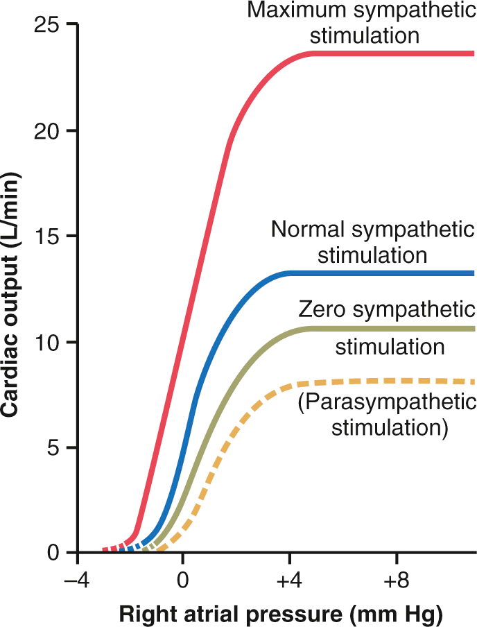
  

  

\begin{equation}
  CO=HR\times SV
\end{equation}
  

Image: Guyton and Hall Textbook of Medical Physiology

--
### Sympathetic innervation
#### Sympathetic input to peripheral arteries

Besides acting directly on the heart rate and cardiac contractility, the central nervous system (sympathetic and parasympathetic outputs) innervate the resistance (muscular) arteries of the body, changing their diameter and therefore their resistance.

\begin{equation}
  R = \dfrac{8\mu L}{\pi r^4}
\end{equation}

where:
- $\mu$ fluid viscosity
- $L$ length of tube
- $r$ radius of the tube

--
### Sympathetic innervation
#### Sympathetic input to peripheral arteries

  

    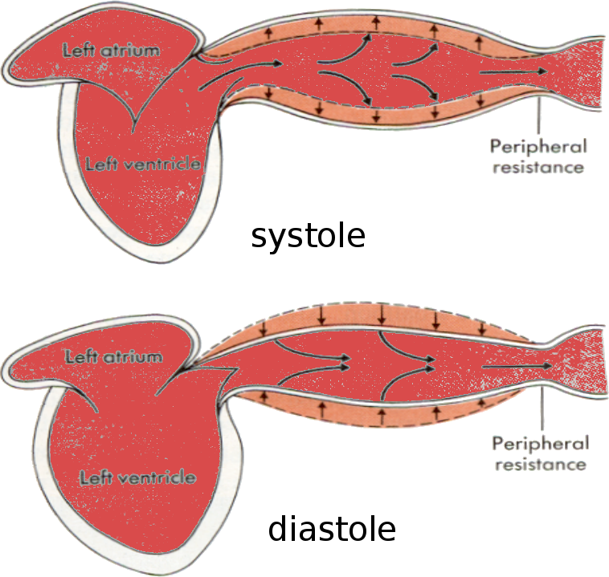
  

  

    
<b>Thinking of the systemic vasculature in a "lumped" way:</b>

    
The <em>Windkessel</em> model of the systemic vasculature.

    
Summing all of the peripheral resistance provides the impact on pressure within the <em>Windkessel</em> (large arteries).

  

  

    

  

--
### Sympathetic innervation
#### Sympathetic input to peripheral arteries

  

    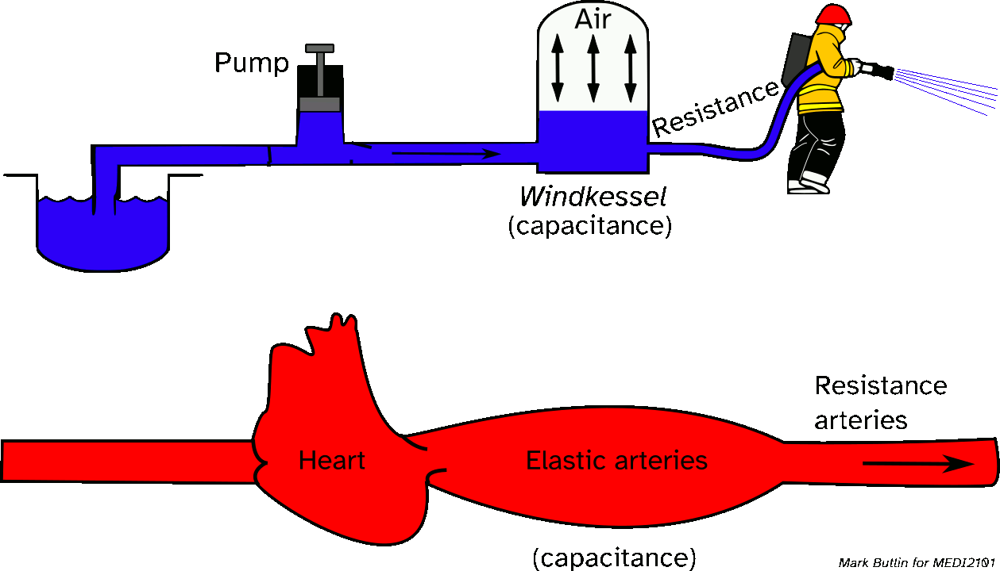
  

  

<ul>
     <li> <b>pump</b> Pump<li>
     <ul><li>(left ventricle)</li></ul>
     <li> <b>C</b> Capacitance</li>
     <ul><li>(Elastic arteries)</li></ul>
     <li> <b>R</b> Resistance</li>
     <ul><li>(Muscular arteries, total peripheral resistance)</li></ul>
     <li> <b>~</b> Valve</li>
     <ul><li>(Aortic valve)</li></ul>
</ul>

&nbsp;

<ul>
<li> <b>CO</b> pump flow</li>
<ul><li>(cardiac output)</li></ul>
<li> <b>MAP</b> mean pressure in <em>Windkessel</em></li>
<ul></li> (mean pressure in large, elastic arteries)</li></ul>
</ul>

  

  

    

  

--

\begin{equation}
MAP\uparrow~=CO\times TPR\uparrow
\end{equation}

<ul>
     <li> <b>MAP</b> mean arterial pressure</li>
     <li> <b>CO</b> cardiac output</li>
     <li> <b>TPR</b> total peripheral resistance</li>
</ul>

--
### Sympathetic innervation
#### Sympathetic nervous input to peripheral arteries

  

    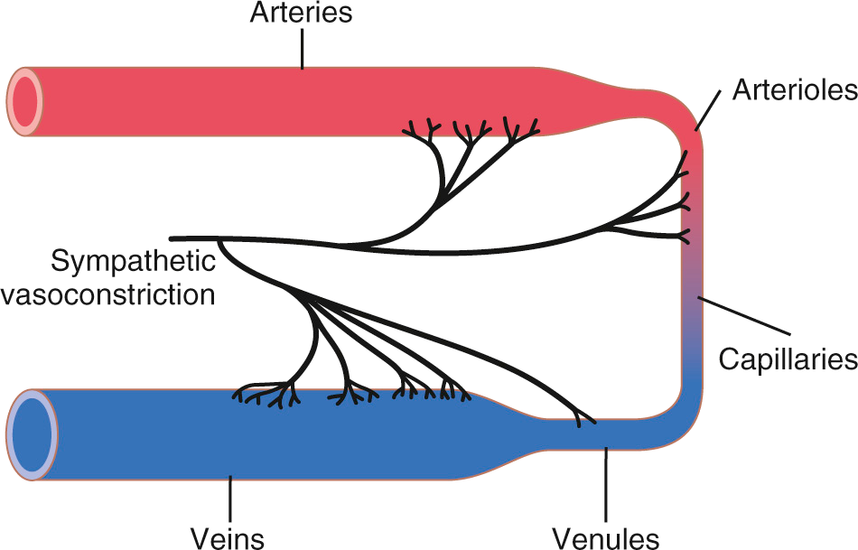
  

  

  
Sympathetic innervation causing vasoconstriction in smooth muscle of:

  <ul>
    <li> small arteries</li>
    <li> arterioles</li>
    <li> veins</li>
  </ul>
  
In some tissues (e.g. mesentary), also constriction of:

  <ul>
    <li> metarterioles</li>
    <li> precapillary sphincters</li>
  </ul>
  
The parasympathetic system does not innervate blood vessels, the exception being arterioles in the clitoris and penis, where parasympathetic stimulation causes release of the vasodilator, nitric oxide.

  

    
Guyton and Hall Textbook of Medical Physiology

  

--
### Sympathetic innervation
#### Sympathetic nervous input to peripheral arteries
Effect on large arteries...? The effect on large arteries is still not quantified. The theory is, as the large arteries are more elastic and contain much less smooth muscle, they do not play much of a role in blood flow regulation through changes in resistance.

--
### Sympathetic innervation
#### Norepinephrine and epinephrine (noradrenaline and adrenaline)

<h5>Vasoconstrictors</h5>
<ul>
  <li> Vasoconstrictor nerve terminals release predominantly norephinephrine, a potent vasoconstrictor acting on alpha adrenergic receptors of vascular smooth muscle.</li>
</ul>
 &nbsp; 

<h5>The adrenal medullae</h5>
<ul>
  <li> sympathetic nerves also terminate in the adrenal medullae</li>
  <li> stimulation causes secretion of both epinephrine and norepinephrine into the blood stream</li>
  <li> therefore, these potent vasoconstrictors act systemically on most organs*</li>
</ul>

&nbsp;

* Epinephrine can cause vasodilation because it also has a beta-adrenergic receptor stimulatory effect, which dilates rather than constricts certain vessels. <b>It has only a weak constriction effect on blood vessels of skeletal muscles.</b>

--
### Sympathetic and parasympathetic innervation
#### Rate of response

The central nervous system very rapidly alters blood pressure

- Arterial pressure can be doubled in just a few seconds
- Arterial pressure can be halved in 10 to 40 seconds

&nbsp;

How are such rapid changes in blood pressure made?

--
### Sympathetic and parasympathetic innervation
#### Rate of response

A rapid rise in blood pressure is invoked by:

<ul>
<li> constriction of most arterioles in the systemic vasculature, increasing peripheral resistance.</li>
<li> constriction of the veins, increasing blood volume delivered to the heart, causing greater stretch of the heart and greater ejection of blood (Frank-Starling mechanism).</li>
<li> direct stimulation of the heart increasing heart rate and heart muscle fibre contractility.</li>
</ul>

&nbsp;

Why are such rapid changes in blood pressure required?

--
### Sympathetic and parasympathetic innervation
#### Overview of sympathetic and parasympathetic drivers of blood pressure

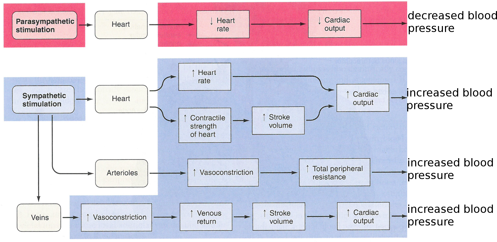

&nbsp;

Image: Sherwood L. Human Physiology: From Cells to Systems. 4th Ed

--
### Sympathetic and parasympathetic innervation
#### Physiological example: Vasovagal syncope

<ul>
<li> Large vagal cardioinhibitory response to emotional stress (e.g. bad news, sight of blood), physical stress, and sometimes in response to blood flow changes during urination, bowel movement, coughing or swallowing (Valsalva maneuver effect).</li>
<li> Vagal output reduces heart rate. Simultaneously, there is a vasodilatory response in the arteries.</li>
<li> The drop in cardiac output and peripheral resistance lowers drives a dramatic reduction in blood pressure and therefore reduced blood flow to peripheral organs.</li>
<li> Less blood flow to the brain causes fainting.</li>
</ul>

--
### Sympathetic and parasympathetic innervation
#### Physiological example: Vasovagal syncope
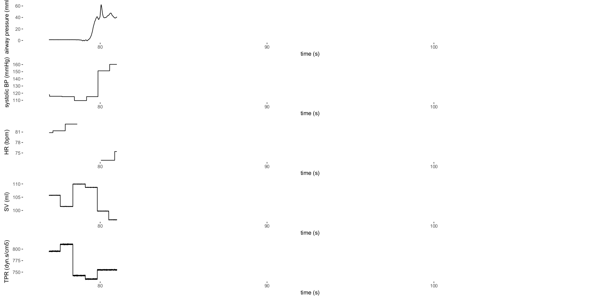

--
### Sympathetic and parasympathetic innervation
#### Physiological example: Vasovagal syncope
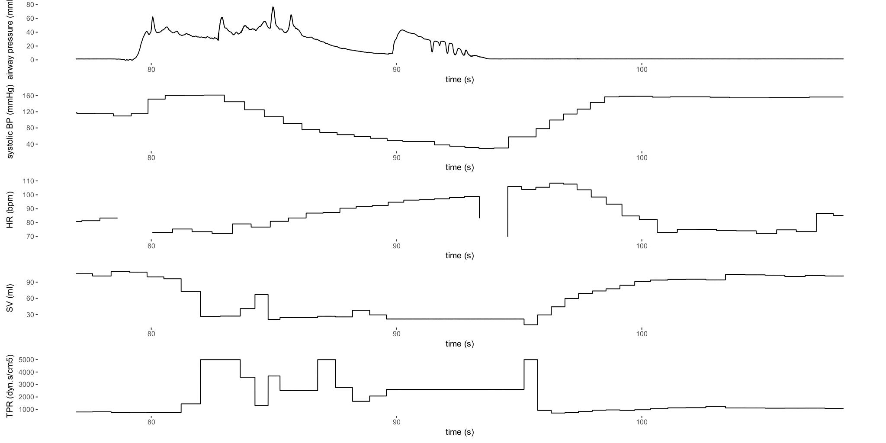

Data/image source: Macquarie University Blood Pressure and Vascular Function Laboratory

--
### Reflection quiz
#### Autonomic innervation
#### Describe the differential sympathetic and parasympathetic innervation of the heart and systemic vasculature, including the role of the vasomotor center in the brain.

<a href="https://flux.qa/DA285K">flux.qa/DA285K</a>

---
<!-- .slide: data-auto-animate-restart -->
#### Learning objective
# Baroreceptor reflex
## Outline the key steps of the baroreceptor reflex, including the stimulus, sensors, changes in autonomic outputs, arteriolar and myocardial targets, and resulting systemic changes.

--
### Baroreceptor reflex
####

  

    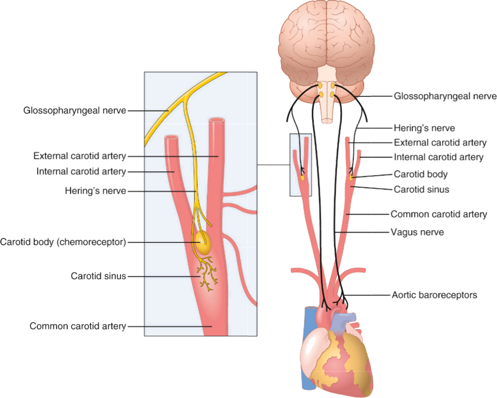
  

  

  
Baroreceptors:

    <ul>
     <li> "stretch" receptors</li>
     <li> located primarily in the carotid arteries (to a lesser degree in the aortic arch)</li>
     <li> provide a negative feedback</li>
    </ul>

Input: $\uparrow$ pressure $\longrightarrow~\uparrow$ vessel stretch

 $\longrightarrow$ vasomotor complex $\longrightarrow$ 

Output: $\downarrow$ sympathetic drive &nbsp;&nbsp;&nbsp;&nbsp;&nbsp;&nbsp;&nbsp;&nbsp;$\uparrow$ parasympathetic drive

  

Image: Guyton and Hall Textbook of Medical Physiology

--
### Baroreceptor reflex
####
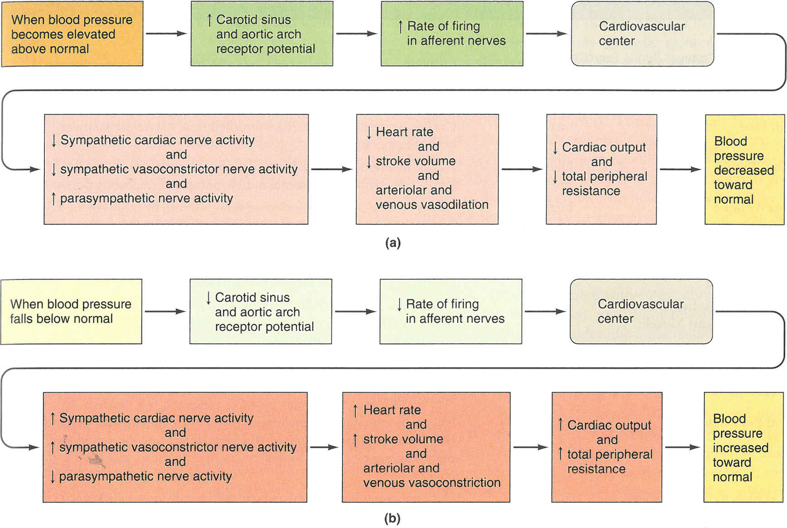

Image: Sherwood L. Human Physiology: From Cells to Systems. 4th Ed

--
### Baroreceptor reflex
####

  

    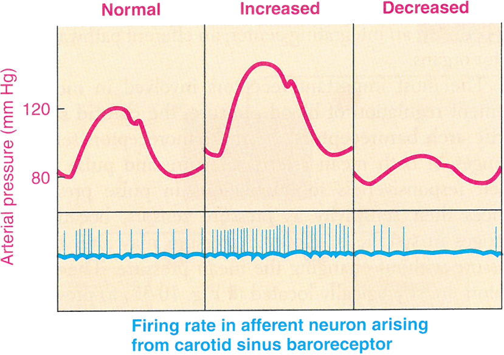
  

  

    
An example of baroreceptor firing rate in response to transient blood pressure changes.

  

  

    
Sherwood L. Human Physiology: From Cells to Systems. 4th Ed

  

--
### Baroreceptor reflex
####

  

    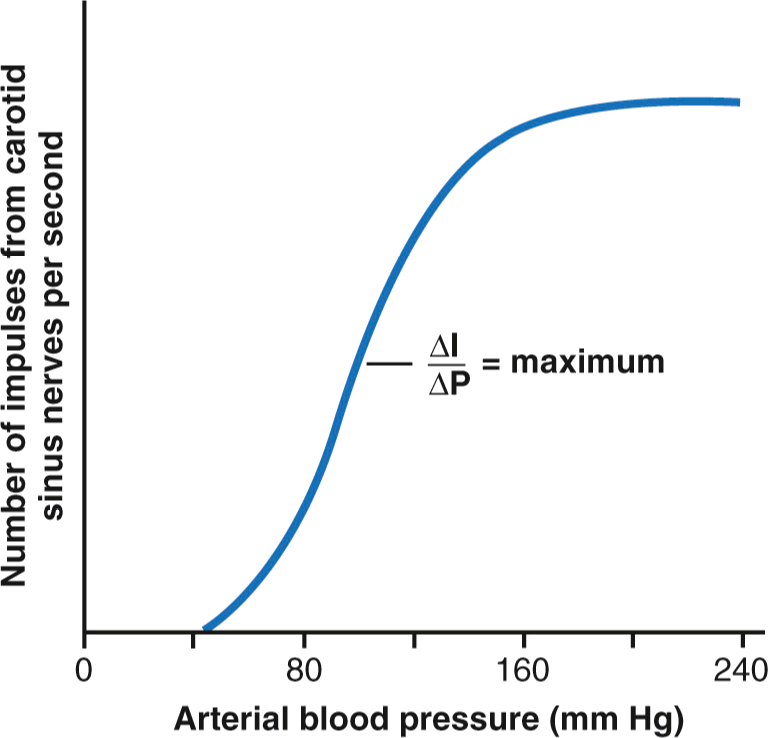
  

  

    
Baroreflex response curve.

    
Different levels of blood pressure activate the baroreflex complex to a different extent.

  

Image: Guyton and Hall Textbook of Medical Physiology

--
<!-- .slide: data-auto-animate-->
### Baroreceptor reflex
#### Physiological example 1: Valsalva maneuver (with faint)

Data/images souce: Macquarie University Blood Pressure and Vascular Function Laboratory

<aside class="notes">Valsalva maneuver (blowing against a closed system with an open glottis) to change intrathoracic pressure. Large systemic effects on sympathetic and parasympathetic output driven by and driving blood pressure (systolic blood pressure, SBP), cardiac output (heart rate HR, stroke volume SV), and total peripheral resistance (TPR) changes.</aside>

--
<!-- .slide: data-auto-animate data-background-image="images/VRL098.png" data-background-size="contain"-->
### Baroreceptor reflex
#### Physiological example 2: Orthostatic challenge

&nbsp;

Data/image source: Macquarie University Blood Pressure and Vascular Function Laboratory

<aside class="notes">{A normal response to standing up from a supine (laying down) position. There is an initial blood pressure drop (due to gravity effect is increase systemic venous pooling of blood, decreasing venous return, see Section \\ref{sec:venousreturn}). The blood pressure drop invokes the baroreceptors. Resulting sympathetic increase / parasympathetic withdrawal increases heart rate (and cardiac contractility) and blood pressure is normalised.</aside>

--
<!-- .slide: data-auto-animate data-background-image="images/VRL099.png" data-background-size="contain" -->
### Baroreceptor reflex
#### Physiological example 2: Orthostatic challenge

&nbsp;

Data/image source: Macquarie University Blood Pressure and Vascular Function Laboratory

<aside class="notes">If baroreceptor feedback and autonomic processing is abnormal, either orthostatic hypotension (sustained blood pressure drop) or orthostatic tachycardia (sustained heart rate increase) may occur. This plot presents a case of tachycardic response to moving from supine to upright (this time by use of a tilt-table).</aside>

--
### Baroreceptor reflex
#### Baroreceptors and short-term control of arterial blood pressure

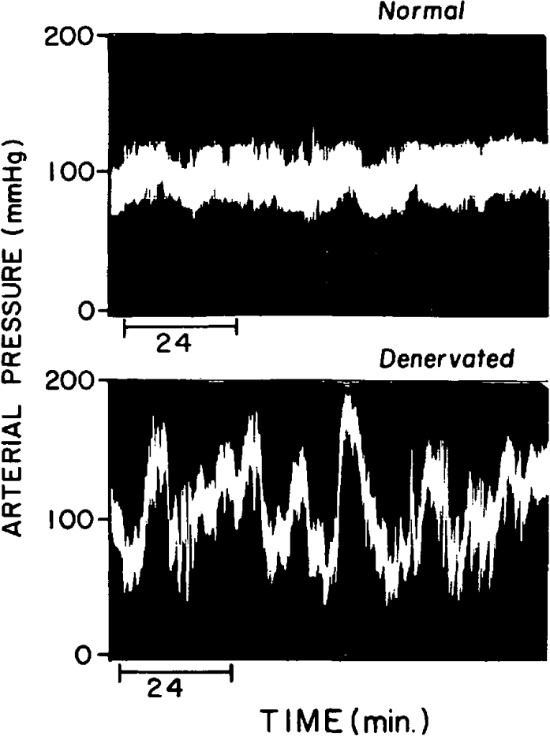
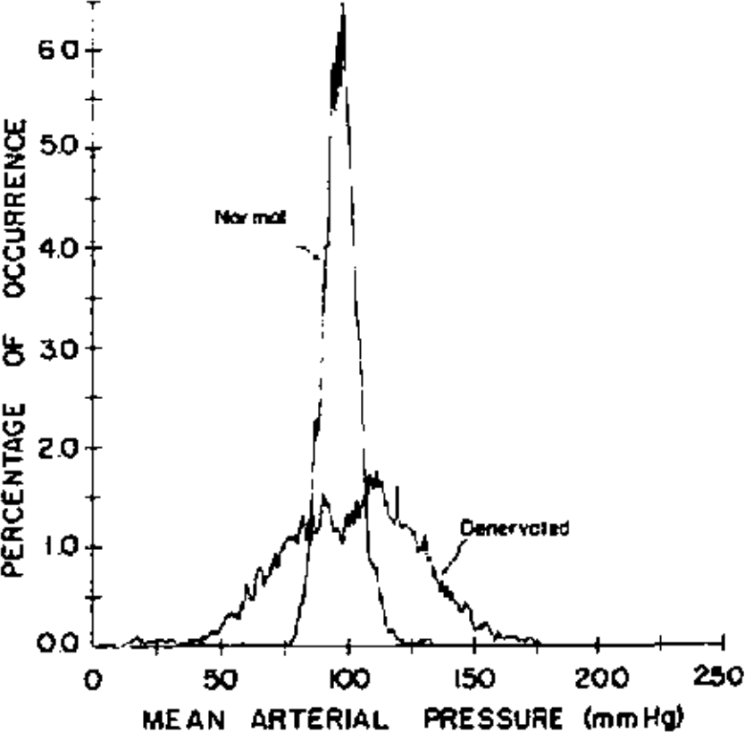

Baroreceptor dennervation in the dog shows the removal of the buffering reflex that the baroreceptors provide to counteract changes in blood pressure.

&nbsp;

Cowley AW Jr et al. Role of baroreceptor reflex in daily control of arterial blood pressure and other variables in dogs. Circ Res. 1973;32(5):564-76.

--
### Baroreceptor reflex
#### Baroreceptors and long-term control of arterial blood pressure
**The argument *against* long-term blood pressure control by baroreceptors**

"One reason that the baroreceptors have been considered by some physiologists to be <b>relatively unimportant in chronic regulation of arterial pressure</b> is that they <b>tend to reset in 1 to 2 days to the pressure level to which they are exposed</b>. That is, if the arterial pressure rises from the normal value of 100 mmHg to 160 mmHg, a very high rate of baroreceptor impulses are at first transmitted. During the next few minutes, the rate of firing diminishes considerably; then it diminishes much more slowly during the next 1 to 2 days, at the end of which time the rate of firing will have returned to nearly normal despite the fact that the mean arterial pressure still remains at 160 mmHg."

&nbsp;

Guyton and Hall Textbook of Medical Physiology.

--
### Baroreceptor reflex
#### Baroreceptors and long-term control of arterial blood pressure
**The argument *for* long-term blood pressure control by baroreceptors**

"Experimental studies, however, have suggested that <b>the baroreceptors do not completely reset and may therefore contribute to long-term blood pressure regulation</b>, especially by influencing sympathetic nerve activity of the kidneys. For example, with prolonged increases in arterial pressure, the baroreceptor reflexes may mediate decreases in renal sympathetic nerve activity that promote increased excretion of sodium and water by the kidneys. This action, in turn, causes a gradual decrease in blood volume, which helps to restore arterial pressure toward normal."

&nbsp;

Guyton and Hall Textbook of Medical Physiology.

--
### Reflection quiz
#### Baroreceptor reflex
#### Outline the key steps of the baroreceptor reflex, including the stimulus, sensors, changes in autonomic outputs, arteriolar and myocardial targets, and resulting systemic changes.

<a href="https://flux.qa/DA285K">flux.qa/DA285K</a>

---
<!-- .slide: data-auto-animate-restart -->
#### Learning objective
# Chemoreceptor reflex
### Outline the key steps of the chemoreceptor reflex, including the stimulus, sensors, changes in autonomic outputs, arteriolar and myocardial targets, and local and systemic changes.

--
### Chemoreceptor reflex
####
<ul>
<li> chemoreceptors monitor changes in blood concentrations of oxygen, carbon dioxide, and hydrogen ions</li>
<li> chemoreceptors are located in the carotid bodies and the aortic arch</li>
<li> they sense</li>
<ul>
        <li> <b>hypoxia</b> lowered blood oxygen availability</li>
        <li> <b>acidosis</b> increased hydrogen ion concentration in blood</li>
        <li> <b>hypercapnia</b> excess carbon dioxide in blood</li>
</ul>
<li> signals to the central nervous system (both the respiratory and cardiovascular centres).</li>
<li> in addition to respiratory changes, sympathetic and parasympathetic output alters cardiac contractility and heart rate (cardiac output), and vasoconstriction (total peripheral resistance).</li>
</ul>

We don't need any more information as we have covered chemoreceptors in Week 3, and the sympathetic and parasympathetic effect of the heart and blood vessels in the first lecture today.

--
<!-- .slide: data-auto-animate-restart data-visibility="hidden" -->
#### Learning objective
#
## Understand the concept of transmural pressure, why this is important in cerebral ischaemia, and how this is related to the Cushing reflex.

--
<!-- .slide: data-auto-animate data-background-image="images/bubble.jpg" data-visibility="hidden" -->
<h3 style="color:white">Cerebral ischaemia</h3>
<h4 style="color:white">Transmural pressure</h4>

The transmural pressure is the difference between the pressure outside a container of flexible/elastic material (for example, an artery) and that inside the container.

--
<!-- .slide: data-auto-animate data-background-image="images/bubble2.png" data-visibility="hidden" -->
<h3 style="color:white">Cerebral ischaemia</h3>
<h4 style="color:white">Transmural pressure</h4>

--
<!-- .slide: data-auto-animate data-background-image="images/bubble3.png" data-visibility="hidden" -->

--
<!-- .slide: data-auto-animate data-background-image="images/bubble4.png" data-visibility="hidden" -->

&nbsp;

&nbsp;

&nbsp;

The transmural pressure is the difference between the outside and inside pressure.

In the case of a bubble (or a systemic artery) it is the difference between the inside pressure (blood pressure in an artery) and atmospheric pressure (=0 mmHg).

--
<!-- .slide: data-background-image="images/bubble5.png" data-visibility="hidden" -->

&nbsp;

&nbsp;

The intracranial space has a positive pressure, above atmospheric pressure (healthy range approx. 7 to 20 mmHg), and high pressures in pathology/injury.

Therefore, the transmural arterial pressure can be close to, or less than zero at high intracranial pressures.

At a transmural pressure of zero (critical closing pressure), blood will not be able to flow to the brain tissue.

--
<!-- .slide: data-visibility="hidden" -->
### Cerebral ischaemia
#### Causes of cerebral ischaemia

- <b>Local causes</b> for example, stroke by vascular occlusion.
- <b>Systemic causes</b> for example, blood loss.
- <b>Cushing reflex</b> increased intracranial pressure above brain arterial blood pressure

--
<!-- .slide: data-visibility="hidden" -->
### Cerebral ischaemia
#### Cushing reflex

If the intracranial pressure reaches or exceeds the critical closing pressure of the intracranial vasculature (approximately 0 mmHg transmural pressure), blood supply to the brain will be cut.

<blockquote>
<b>Cushing reaction (or reflex)</b>

The blocking of blood flow (by increased pressure of the cerebrospinal fluid) results in a reaction that drives arterial pressure higher, above the level of the cerebrospinal fluid pressure, to restore blood flow to the brain.

</blockquote

--
<!-- .slide: data-visibility="hidden" -->
### Cerebral ischaemia
#### Response to cerebral ischaemia

Cerebral ischaemia causes a unique response whereby the vasomotor cortex senses and responds directly to the ischaemic event.

Mechanisms:
- Vasoconstrictor and cardioaccelerator neurons in the vasomotor center in the lower brainstem respond directly to the ischemia.
- Believed to be activated by high CO2 in the region when blood is unable to carry the waste product away from the region.
- Possible other factors are involved such as lactic acid and other acidic substances in the vasomotor center.

--
<!-- .slide: data-auto-animate data-background="#111111" data-visibility="hidden" -->

This direct vasomotor response is not invoked in everyday physiological events.

Why?
 

Arterial pressure must fall below intracranial pressure.

$\begin{equation}
\mathrm{flow} = \dfrac{\mathrm{arterial~pressure} - \mathrm{intracranial~pressure}}{\mathrm{resistance}}
\end{equation}$

--
<!-- .slide: data-visibility="hidden" -->
### Cerebral ischaemia
#### Response to cerebral ischaemia

$\begin{equation}
\mathrm{flow} = \dfrac{\mathrm{arterial\~pressure} - \mathrm{intracranial\~pressure}}{\mathrm{resistance}}
\end{equation}$
  
Why is intracranial pressure instead of venous pressure in this equation? 

If intracranial pressure exceeds venous pressure, then the veins will be collapsed, and it is the difference between arterial and intracranial pressure that determines flow.

Ischaemia of the vasomotor centre does not start to occur until systemic blood pressure falls below 60 mmHg, and does not reach maximum effect until pressures of 15 to 20 mmHg*

* Guyton and Hall Textbook of Medical Physiology

--
<!-- .slide: data-visibility="hidden" -->
<blockquote>

<b>"The greedy brain"</b>

<em>If</em> the vasomotor centre is directly and fully invoked, parasympathetic output ceases and sympathetic outflow is maximal.

        <ul>
          <li> Maximal heart rate and contractility will occur to maximise cardiac output.</li>
          <li> Peripheral vessels will contract, some organs (e.g. kidneys) receive very, very minimal blood flow. This increases total peripheral resistance.</li>
          <li> Systemic blood pressure can reach 250 mmHg for periods of up to 10 minutes*.</li>
        </ul>
</blockquote>

*Guyton and Hall Textbook of Medical Physiology.

--
### Reflection quiz
#### Chemoreceptor reflex
#### Outline the key steps of the chemoreceptor reflex, including the stimulus, sensors, changes in autonomic outputs, arteriolar and myocardial targets, and local and systemic changes.

<a href="https://flux.qa/DA285K">flux.qa/DA285K</a>

---
<!-- .slide: data-auto-animate-restart -->
#### Learning objective
# Blood volume and blood pressure
### Understand how changes in blood volume alter systemic arterial blood pressure.

--
### Blood volume and systemic arterial blood pressure
#### 

\begin{equation}
\mathrm{systemic\~arterial\~blood\~pressure} \propto \mathrm{blood\~volume}
\end{equation}

If total blood volume is increased, blood pressure will increase.

This is not a rapid method to alter blood pressure, as it takes a longer period of time to alter blood volume (as opposed to altering venous return, or chemosensor and baroreceptor feedback).

--
### Blood volume and systemic arterial blood pressure
#### Functions of the kidneys
<ul>
  <li> regulation of blood ionic composition (Na+, K+, Ca2+, Cl-, phosphate ions)</li>
  <li> regulates blood volume by regulating amount of water excreted (urine)</li>
  <li> regulates blood pressure through</li>
        <ul>
        <li> regulation of blood volume</li>
        <li> secreting renin (renin-angiotensin system)</li>
        </ul>
  <li> regulates blood pH by excreting H+ and conserving bicarbonate ions</li>
  <li> regulate red blood cell production through release of the hormone erythropoietin</li>
  <li> synthesises vitamin D</li>
  <li> filters waste products in blood, excreted in urine</li>
</ul>

--
### Blood volume and systemic arterial blood pressure
#### The Renin-Angiotensin System (RAS)

<ul>
  <li> Falling blood volume, or reduced blood flow (e.g. through sympathetic stimulation of  vascular smooth muscle) to the kidneys, induces renin secretion from the kidneys into the blood</li>
  <li> Renin and angiotensin converting enzyme produce angiotensin II, a powerful vasoconstrictor.</li>
  <li> Vasoconstriction increases resistance, and therefore pressure.</li>
  <li> Angiotensin II also causes aldosterone secretion, which causes sodium ion and water reabsorption.</li>
  <li> This increases blood volume, also increasing blood pressure.</li>
</ul>

&nbsp;

See this week's on-line module in iLearn.

--
### Reflection quiz
#### Blood volume and blood pressure
#### Understand how changes in blood volume alter systemic arterial blood pressure.

<a href="https://flux.qa/DA285K">flux.qa/DA285K</a>

---
<!-- .slide: data-auto-animate-restart -->
#### Learning objective
# Cardiovacsular responses
### Use knowledge of cardiovascular regulatory pathways to describe responses to physiological challenges.

--
### Bringing it all together
####
--
<!-- .slide: data-auto-animate data-background-image="images/MAPoverview.png" data-background-size="contain" -->

&nbsp;

Sherwood L. Human Physiology From Cells to Systems. 4th Ed.

--
### Bringing it all together
#### Consider the time course
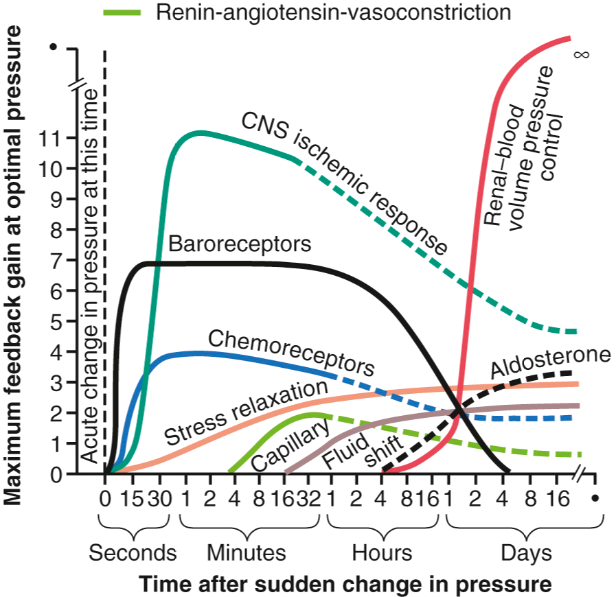

Image: Guyton and Hall Textbook of Medical Physiology.

--
<!-- .slide: data-auto-animate data-background-image="images/fishtankheater.jpg" data-background-opacity="0.5"-->
### Bringing it all together
#### Feedback loops - overshoot and undershoot (oscillations)
  
<blockquote>
Baroreflex, chemoreceptors, and the Cushing reflex are closed-loop feedback systems. This means that they change what they are sensing, thus all are susceptible to over/under shoot in blood pressure during regulation of blood pressure and flow.
</blockquote>

--
### Bringing it all together
#### Feedback loops - overshoot and undershoot (oscillations)

**Baroreflex associated blood pressure oscillations**

- **cause** lag between detection of blood pressure change and implementation of response results in a slow over/under shoot in baroreflex response to pressure falls/rises.
- **frequency** have a similar frequency response (and possibly are the cause of) "Mayer waves", that rise and fall at a frequency of approximately 0.1 to 0.15 Hz (an oscillation every 6 to 10 seconds).

<b>Chemoreceptor associated blood pressure oscillations</b>

<ul>
<li> <b>cause</b> Similar over/under shoot response as described in baroreflex above.</b>
<li> <b>when</b> stronger at lower blood pressures, where the baroreflex has a lesser effect.</b>
</ul>

--
<!-- .slide: data-visibility="hidden" -->
### Bringing it all together
#### Feedback loops - overshoot and undershoot (oscillations)

**Blood pressure oscillations caused by the Cushing reflex**

When the Cushing reflex is activated and blood flow is restored to the brain, the reflex is lessened causing a decrease in blood pressure to a point near where blood flow to the brain again stops, causing an increase in the Cushing reflex, and an increase in blood pressure.

--
<!-- .slide: data-auto-animate data-background-image="images/CirculatoryShock_Sherwood.png" data-background-size="contain" -->

  

    
Bringing it all together

  

  

    
Cardiovascular regulation in clinical emergency (simplified)

  

  

    
Sherwood L. Human Physiology: From Cells to Systems. 4th Ed.

  

--
<!-- .slide: data-auto-animate data-background-image="images/hemorrhage_Sherwood.png" data-background-size="contain" data-background-position="right"-->

Bringing it all together

Response to haemorrhage

&nbsp;

Sherwood L. Human Physiology: From Cells to Systems. 4th Ed.

--
### Bringing it all together
#### Regulating mean arterial pressure: An overview

To alter systemic arterial blood pressure (here mean arterial pressure, MAP), we must change one or more of:

$\begin{align}
\mathrm{MAP} & = \mathrm{CO} \times \mathrm{TPR}\\\\
  & = \mathrm{SV} \times \mathrm{HR} \times \mathrm{TPR}
\end{align}$

$ \mathrm{MAP} \propto \mathrm{blood\~volume} $

<!-- ### Bringing it all together
#### Regulating mean arterial pressure: An overview

Venous return mechanisms (where venous return is altered, e.g. by sympathetic stimulation of the venous smooth muscle; skeletal muscle pump; respiratory pump;). For increased venous return (opposite for decreased venous return):
<ul>
      <li> <b>Frank-Starling law of the heart:</b> positive feedback, increases stroke volume through increased cardiac contractility</li>
      <li> <b>Bainbridge reflex:</b> positive feedback, increases stroke volume (through cardiac contractility) and heart rate.</li>
      <li> <b>Atrial (volume) reflex:</b> negative feedback, signals to kidneys to increase fluid loss, reducing blood volume.</li>
      <li> <b>Cardiopulmonary baroreceptors:</b> negative feedback, signal to the central nervous system, decreasing sympathetic and increasing parasympathetic outflow (effects across SV, HR, TPR, and longer term, blood volume).</li>
</ul>

### Bringing it all together
#### Regulating mean arterial pressure: An overview

Other mechanisms that alter blood pressure:

<ul>
  <li> <b>baroreceptors:</b> negative feedback, signal to the central nervous system, decreasing sympathetic and increasing parasympathetic outflow (effects across SV, HR, TPR, and longer term, blood volume).</li>
  <li> <b>chemoreceptors:</b> negative feedback, signal to the central nervous system, decreasing sympathetic and increasing parasympathetic outflow (effects across SV, HR, TPR, and longer term, blood volume). Also cross-talk with respiratory system.</li>
</ul>
  

### Bringing it all together
#### Regulating mean arterial pressure: An overview

<ul>
  <li> <b>renal control of blood volume:</b> controlled (primarily) by central nervous system sympathetic outflow. Slower acting for blood pressure control than baroreceptors and chemoreceptors as it alters blood volume.</li>
  <li> <b>hormonal control of blood pressure:</b> also controlled (primarily) by central nervous system sympathetic outflow. Different hormones act on different places (vasocronstrictors = TPR changes; renal acting = changes in blood volume)</li>
</ul>-->

--
<!-- .slide: data-auto-animate data-background="#111111" -->

Remember that sympathetic and parasympathetic changes do not just "happen".

There must be a reason (cause, an input to the central nervous system) for the changes in sympathetic and parasympathetic outflow to occur.

--
### Bringing it all together
#### Regulating mean arterial pressure: An overview

<table>
  <tr>
    <th> receptor </th>
    <th> located </th>
    <th> senses </th>
  </tr><tr>
    <td> cardiopulmonary baroreceptors </td>
    <td> atria and pulmonary artery </td>
    <td> pulmonary arterial pressure </td>
  </tr><tr>
    <td> baroreceptors </td>
    <td> aorta and carotid artery </td>
    <td> systemic arterial blood pressure </td>
  </tr><tr>
    <td> chemoreceptors </td>
    <td> central (brain) and peripheral (carotid/aorta) </td>
    <td> blood O2, CO2, H+</td>
  </tr><tr>
    <td> pain receptors </td>
    <td> skin, some internal tissue </td>
    <td> pain</td>
  </tr><tr>
    <td> proprioceptors </td>
    <td> throughout body </td>
    <td> movement </td>
  </tr><tr>
    <td> thermoreceptors </td>
    <td> immediately under skin </td>
    <td> temperature </td>
  </tr><tr>
    <td> higher order brain </td>
    <td> throughout brain </td>
    <td> e.g. stress </td>
  </tr>
</table>

There are many receptors throughout the body that signal to the central nervous system and result in changes in sympathetic and parasympathetic outflow. This table is a list (that is not exhaustive) of some of those things that alter sympathetic and parasympathetic activity. Some of these will be familiar from the respiratory regulation material (Week 3).
