<!-- .slide: data-auto-animate-restart id="MEDI2101Wk6_1"-->
#### MEDI2101 Cardiovascular and Respiratory System.
### Block 3: Renal System
# Week 10: Filtration and reabsorption
##### Assoc. Prof. Mark Butlin (PhD, BE, SFHEA) (he/him)

Macquarie Medical School, Faculty of Medicine, Health and Human Sciences Macquarie University. On the land of the Wallumattagal clan of the Dharug Nation.

&nbsp;

&nbsp;

&nbsp;

This material is provided to you as a Macquarie University student for your individual research and study purposes only. You cannot share this material without permission. Macquarie University is the copyright owner of (or has licence to use) the intellectual property in this material. Legal and/or disciplinary actions may be taken if this material is shared without the University’s written permission.

--
### 
#### Extension reading

In past weeks, the recommended text if you wanted to take extension reading was <em>Guyton and Hall's Textbook of Medical Physiology</em>.

For renal physiology, I find that <em>D.U. Silverthorn. Human Physiology, An Integrated Approach</em> provides a more succinct summary of the topic area.

The chapter readings continue to be an extension study resource only, not a mandatory core to the unit.

<!-- #####################################LEARNING OBJECTIVE########################################### -->
---
<!-- .slide: data-auto-animate-restart -->
#### Learning objective
# Role of the kidney
### Summarise the physiological role of the kidney, and the functions by which it achieves that role.

--
### Roles of the kidneys
#### Recap

1. Regulation of blood volume and therefore blood pressure.
2. Regulation of osmolarity, which effects extracellular fluid volume.
3. Maintenance of ion balance (sodium, potassium, calcium, chloride and phosphate ions)
4. Regulation of pH by changing excretion of hydrogen ions and conserving of bicarbonate ions.
5. Excretion of wastes.
6. Production of hormones
    - erythropoietin, for red blood cell production
    - renin, to regulate kidney function

--
### Functional overview of the kidney
####

**Filtration | Renal corpuscle (glomerulus and Bowman's capsule)**
- Fluid from blood into the lumen of the nephron
- Filtered plasma is called filtrate – excreted unless reabsorbed

**Reabsorption | Peritubular capillaries (Proximal tubule, loop of Henle, distal nephron)**
- Materials in the filtrate are passed back into the blood

**Secretion | Peritubular capillaries  (Proximal tubule, loop of Henle, distal nephron)**
- Material from blood into lumen of tubule

--
### Functional overview of the kidney
####

Image source: D.U. Silverthorn. Human Physiology, An Integrated Approach.

--
### Reflection quiz
#### Role of the kidney
#### Summarise the physiological role of the kidney, and the functions by which it achieves that role.

<a href="https://flux.qa/DA285K">flux.qa/DA285K</a>

<!-- #####################################LEARNING OBJECTIVE########################################### -->
---
<!-- .slide: data-auto-animate-restart -->
#### Learning objective
# Glomerular filtration barrier
### Describe the structure and features of the glomerular filtration barrier and how that determines the composition of the filtrate.

--
### Glomerular filtration barrier
#### 

<!-- Highlight box -->

Image source: D.U. Silverthorn. Human Physiology, An Integrated Approach.

--
### Glomerular filtration barrier
#### Glomerular capillary membrane

Glomerular capillaries have **three** layers:

1. endothelium (as per other capillaries in the body)
2. basement membrane (as per other capillaries in the body)
3. epithelial cells - podocytes

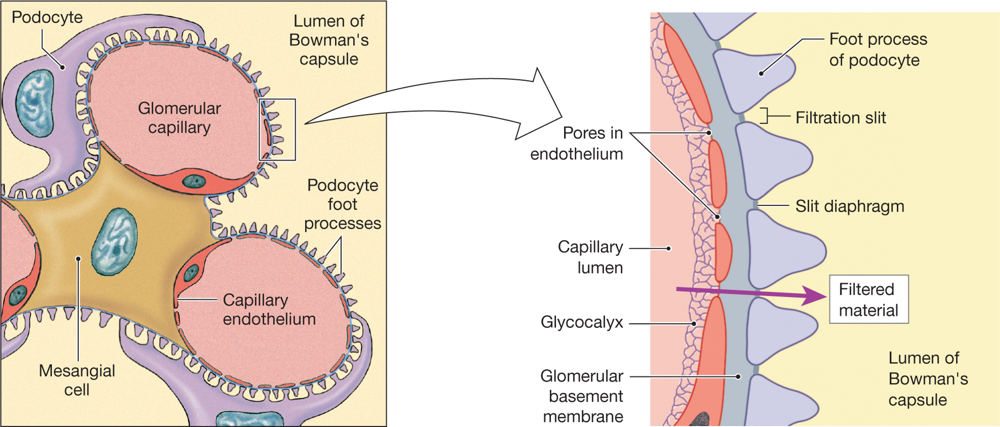

Image source: D.U. Silverthorn. Human Physiology, An Integrated Approach.

--
### Glomerular filtration barrier
#### Glomerular capillary membrane: High filtration rate

About 180 L/day of filtrate is generated.* High filtration rate achieved by:
- relatively large fenestrae in the glomerulus capillary endothelial cells.
- large spaces in the basement membrane.
- large filtration slits between epilthelial podocytes.

* Reabsorption means about 1.5 L/day remains for excretion.

--
### Glomerular filtration barrier
#### Filtration rate is inversely related to molecular size

Electrolytes such as sodium and small organic compounds (e.g., glucose) are filtered as readily as water.

<table border="1">
  <thead>
    <tr>
      <th>Substance</th>
      <th>Molecular weight (g/mol)</th>
      <th>Normalised filtration rate*</th>
    </tr>
  </thead>
  <tbody>
    <tr>
      <td>Water</td>
      <td>18</td>
      <td>1</td>
    </tr>
    <tr>
      <td>Sodium</td>
      <td>23</td>
      <td>1</td>
    </tr>
    <tr>
      <td>Glucose</td>
      <td>180</td>
      <td>1</td>
    </tr>
    <tr>
      <td>Inulin</td>
      <td>5,500</td>
      <td>1</td>
    </tr>
    <tr>
      <td>Myoglobin</td>
      <td>17,000</td>
      <td>0.75</td>
    </tr>
    <tr>
      <td>Albumin</td>
      <td>69,000</td>
      <td>0.005</td>
    </tr>
  </tbody>
</table>

* Normalised to filtration rate of water in the glomerulus. Source: Guyton and Hall Textbook of Medical Physiology.

--
### Glomerular filtration barrier
#### Barrier to negatively charged molecules

There is an electrostatic repulsion against negatively charged particles travelling across the glomerular capillary.

This is because the basement membrane is negatively charged. (Like charges repel.)

e.g., albumin is negatively charged.

Certain kidney disease see loss of the negative charge of the basement membrane. This allows some proteins, like albumin, to travel across the capillary membrane and appear in urine analysis samples (proteinuria or albuminuria).

--
### Glomerular filtration barrier
#### Composition of glomerular filtrate

- glomerular capillaries block most proteins.
- the glomerular filtrate is therefore mostly protein free
- it is also free of cellular material (including red blood cells)

--
### Glomerular filtration barrier
#### Composition of glomerular filtrate
So what DOES it contain? Filtrate is almost identical to plasma at the renal corpuscle.

- salts / ions
    - sodium
    - potassium
    - chloride
    - magnesium
    - sulfates
    - phosphates
    - ammonium
    - calcium

- organic molecules
    - urea
    - creatinine
    - uric acid

--
### Reflection quiz
#### Glomerular filtration barrier
#### Describe the structure and features of the glomerular filtration barrier and how that determines the composition of the filtrate.

<a href="https://flux.qa/DA285K">flux.qa/DA285K</a>

<!-- #####################################LEARNING OBJECTIVE########################################### -->
---
<!-- .slide: data-auto-animate-restart -->
#### Learning objective
# Factors affecting glomerular filtration rate
### Explain the factors that affect the glomerular filtration rate (GFR)

--
### Factors affecting glomerular filtration rate (GFR)
#### Starling hypothesis and filtration in capillaries

$\begin{equation}\mathrm{net~filtration~pressure}=P_c + \Pi_{if} - P_{if} - \Pi_p\end{equation}$

    

        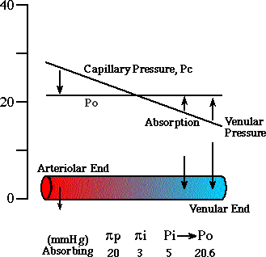
    

    

        
Average forces across the capillary wall over the length of the capillary (Principle of Starling equilibrium):

<table>
    <tr>
        <th> Outward pressures </th>
        <th> (mmHg) </th>
        <th> Inward pressures </th>
        <th> (mmHg) </th>
        <th> total (mmHg)</th>
    </tr><tr>
        <td> average capillary pressure ($P_c$)                  </td>
        <td> 17.3 </td>
        <td> interstitial pressure ($P_{if}$)</td>
        <td> -3 </td>
        <th> 20.3 </th>
    </tr><tr>
        <td> interstitial osmotic pressure ($\Pi_{if}$)  </td>
        <td> 8 </td>
        <td> plasma osmotic pressure ($\Pi_p$) </td>
        <td> 28 </td>
        <th> -20 </th>
    </tr><tr>
        <td> total outward pressure </td>
        <td> 25.3 </td>
        <td> total inward pressure </td>
        <td> 25 </td>
        <th> net filtration pressure 0.3 mmHg (outward flow)</th>
    </tr>
</table>
    

Source: Adapted from Guyton and Hall Textbook of Medical Physiology.

--
### Factors affecting glomerular filtration rate (GFR)
#### Filtration in glomerular capillaries

$\begin{equation}GFR=K_f \times (P_G + \Pi_{B} - P_{B} - \Pi_G)\end{equation}$

    

        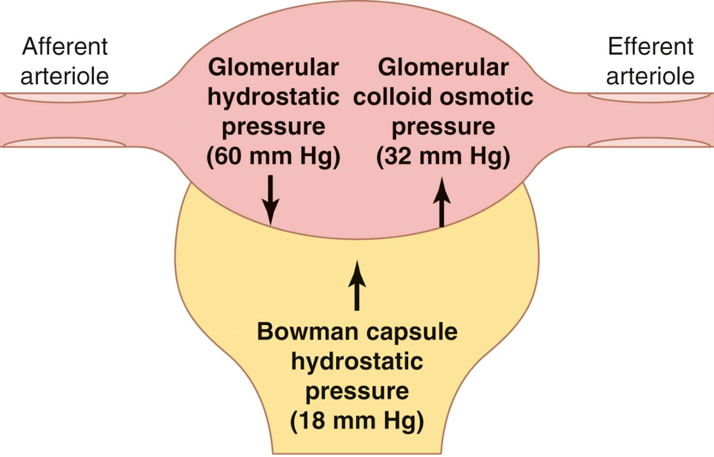
    

    

        
Average forces across the capillary wall over the length of the glomerular capillary:

<table>
    <tr>
        <th> Outward pressures </th>
        <th> (mmHg) </th>
        <th> Inward pressures </th>
        <th> (mmHg) </th>
        <th> total (mmHg)</th>
    </tr><tr>
        <td> glomerular hydrostatic pressure ($P_G$)                  </td>
        <td> 60 </td>
        <td> Bowman's capsule hydrostatic pressure ($P_{B}$)</td>
        <td> 18 </td>
        <th> 42 </th>
    </tr><tr>
        <td> Bowman's capsule osmotic pressure ($\Pi_{B}$)  </td>
        <td> 0 </td>
        <td> Glomerular osmotic pressure ($\Pi_G$) </td>
        <td> 32 </td>
        <th> -32 </th>
    </tr><tr>
        <td> total outward pressure </td>
        <td> 60 </td>
        <td> total inward pressure </td>
        <td> 50 </td>
        <th> net filtration pressure $K_f\times$10 mmHg (outward flow)</th>
    </tr>
</table>
    

Source: Adapted from Guyton and Hall Textbook of Medical Physiology.

--
### Factors affecting glomerular filtration rate (GFR)
#### Filtration coefficient ($K_f$)

$\begin{equation}GFR=\Large\boldsymbol{K_f}\normalsize \times (P_G + \Pi_{B} - P_{B} - \Pi_G)\end{equation}$

The filtration coefficient ($K_f$) can be altered  by:
- hydraulic conductivity
- surface area of the glomerular capillaries

$K_f$ is **not** likely a regulatory mechanism in kidney function in normal physiology.

Some diseases, however...
- reduce the number of functional glomerular capillaries (reduced surface area)
- increase the thickness of the glomerular capillary wall (decreasing hydraulic conductivity)
which would alter $K_f$.

--
### Factors affecting glomerular filtration rate (GFR)
#### Increased Bowman's capsule hydrostatic pressure ($P_B$) decreases GFR

$\begin{equation}GFR=K_f \times (P_G + \Pi_{B} - \Large\boldsymbol{P_{B}}\normalsize - \Pi_G)\end{equation}$

Average Bowman's capsule hydrostatic pressures (18 mmHg) does not change greatly in normal physiology.

Some pathology, e.g., obstruction of the urinary tract, can increase $P_B$, which would decrease GFR.

--
### Factors affecting glomerular filtration rate (GFR)
#### Increased glomerular capillary osmotic pressure ($\Pi_G$) decreases GFR

$\begin{equation}GFR=K_f \times (P_G + \Pi_{B} - P_{B} - \Large\boldsymbol{\Pi_G}\normalsize)\end{equation}$

    

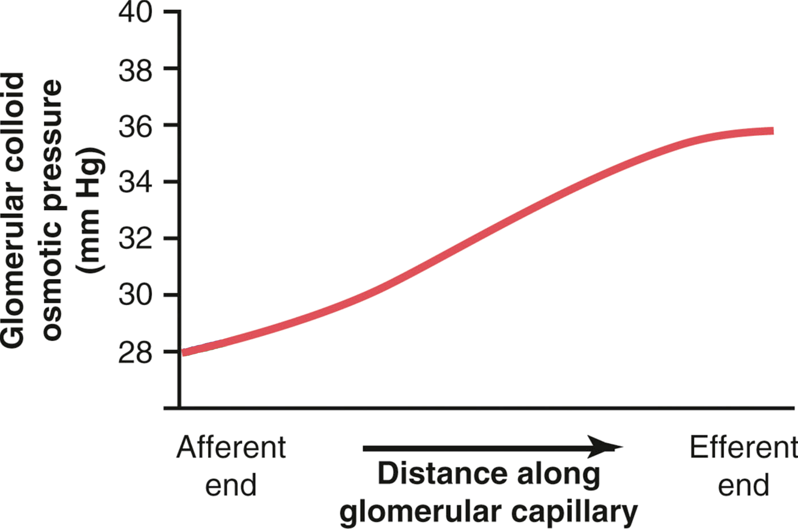
    

    

    <ol>
        <li style="margin-bottom: 20px;">as plasma (and blood) moves along the glomerular capillary, filtrate is removed.</li>
        <li style="margin-bottom: 20px;">this concentrates the plasma proteins.</li>
        <li style="margin-bottom: 20px;">this increases the glomerular capillary osmotic pressure ($\Pi_G$).</li>
        <li style="margin-bottom: 20px;">this decreases GFR</li>
    </ol>
    

Image: Guyton and Hall Textbook of Medical Physiology.

--
### Factors affecting glomerular filtration rate (GFR)
#### Increased glomerular capillary osmotic pressure ($\Pi_G$) decreases GFR

$\begin{equation}GFR=K_f \times (P_G + \Pi_{B} - P_{B} - \Large\boldsymbol{\Pi_G}\normalsize)\end{equation}$

    

        

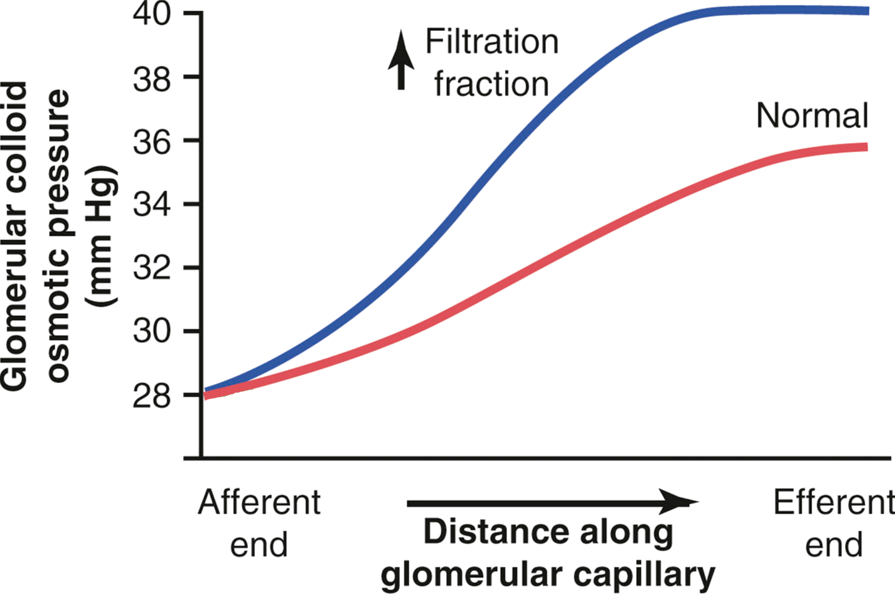
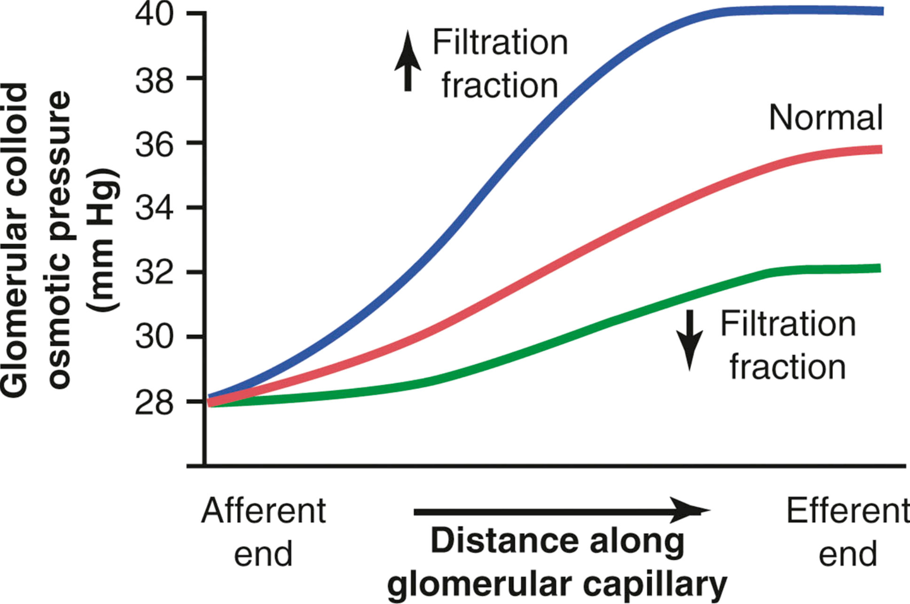
        
 
    

    

    
The greater the filtration fraction, &rarr; the greater the glomerular osmotic pressure, &rarr; the lower the GFR.

    
The lower the filtration fraction, &rarr; the lower the glomerular osmotic pressure, &rarr; the high the GFR.

    

Image: Guyton and Hall Textbook of Medical Physiology.

--
### Factors affecting glomerular filtration rate (GFR)
#### Decreased glomerular capillary hydrostatic pressure ($P_G$) decreases GFR

$\begin{equation}GFR=K_f \times (\Large\boldsymbol{P_G}\normalsize + \Pi_{B} - P_{B} - \Pi_G)\end{equation}$

    

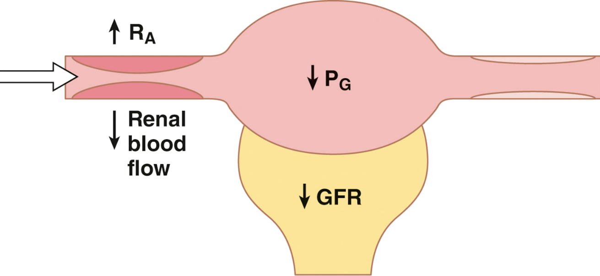
        

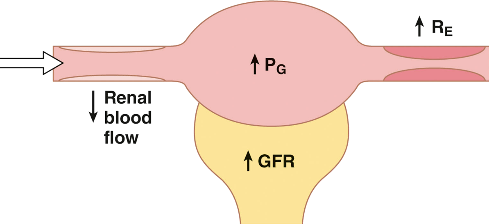
    

    

Increased afferent arteriolar resistance (RA) decreases the blood flow and pressure distally in the glomerulus (PG). This decreases the GFR.

<!-- 
&nbsp;
 -->

Increased efferent arteriolar resistance (RE) also decreases the blood flow, but increases pressure proximally in the glomerulus (PG). This increases the GFR.

    

Image: Guyton and Hall Textbook of Medical Physiology.

--
### Factors affecting glomerular filtration rate (GFR)
#### Efferent arteriolar resistance biphasic effect on GFR

$\begin{equation}GFR=K_f \times (\Large\boldsymbol{P_G}\normalsize + \Pi_{B} - P_{B} - \Large\boldsymbol{\Pi_G})\end{equation}$

    

        

    

    

Increased efferent arteriolar resistance (RE) also decreases the blood flow, but increases pressure proximally in the glomerulus (PG). This increases the GFR.

Large (over 3-fold) increase in RE increases PG initially increasing filtration fraction (GFR). But renal blood flow is reduce significantly,  which allows glomerular osmotic pressure to increase, which <b>then</b> decreases GFR.

    

Image modified from: Guyton and Hall Textbook of Medical Physiology.

--
### Factors affecting glomerular filtration rate (GFR)
#### Summary

$\begin{equation}GFR=K_f \times (P_G + \Pi_{B} - P_{B} - \Pi_G)\end{equation}$

<table border="1">
  <colgroup>
    <col style="width: 200px;">
    <col>
  </colgroup>
  <thead>
    <tr>
      <th></th>
      <th>Physiological cause </th>
      <th>Pathophysiological Causes</th>
    </tr>
  </thead>
  <tbody>
    <tr>
      <td>↓ Kf → ↓ GFR</td>
      <td></td>
      <td>Renal disease, diabetes mellitus, hypertension, aging</td>
    </tr>
    <tr>
      <td>↑ PB → ↓ GFR</td>
      <td></td>
      <td>Urinary tract obstruction (e.g., kidney stones)</td>
      <td></td>
    </tr>
    <tr>
      <td>↑ πG → ↓ GFR</td>
      <td>↓ Renal blood flow</td>
      <td>Increased plasma proteins</td>
    </tr>
    <tr>
      <td>↓ AP → ↓ PG → ↓ GFR</td>
      <td>↓ Arterial pressure (only a small effect because of autoregulation)</td>
      <td></td>
    </tr>
    <tr>
      <td>↓ RE → ↓ PG → ↓ GFR</td>
      <td>↓ Angiotensin II</td>
      <td>Drugs that block angiotensin II formation.</td>
    </tr>
    <tr>
      <td>↑ RA → ↓ PG → ↓ GFR</td>
      <td>↑ Sympathetic activity, vasoconstrictor hormones (e.g., norepinephrine, endothelin)</td>
      <td></td>
    </tr>
  </tbody>
</table>

Adapted from Guyton and Hall Textbook of Medical Physiology.

--
### Reflection quiz
#### Factors affecting glomerular filtration rate
#### Explain the factors that affect the glomerular filtration rate (GFR)

<a href="https://flux.qa/DA285K">flux.qa/DA285K</a>

<!-- #####################################LEARNING OBJECTIVE########################################### -->
---
<!-- .slide: data-auto-animate-restart -->
#### Learning objective
# Glomerular filtration rate (GFR) regulation
### Explain autoregulation of GFR through myogenic response, tubuloglomerular feedback,  hormones, and autonomic neurons

--
### Glomerular filtration rate (GFR) regulation
####

<video data-autoplay data-src="images/GFR_autoregulation_silverthorn.mp4" width="55%"></video>

Image source: D.U. Silverthorn. Human Physiology, An Integrated Approach.

--
### Glomerular filtration rate (GFR) regulation
####

**Myogenic response**
- Intrinsic ability of vascular smooth muscle to respond to pressure changes
- Similar to autoregulation in other systemic arterioles

**Tubuloglomerular feedback**
- Paracrine control
- Juxtaglomerular apparatus
    - Macula densa cells detect NaCl in the filtrate 
    - Granular cells secrete enzyme renin
**Hormones and autonomic neurons also influence GFR**
- By changing resistance in arterioles
- By altering the filtration coefficient

--
### Glomerular filtration rate (GFR) regulation
#### Myogenic response

We covered previously the theories for local blood flow autoregulation in an organ:
- vasodilator theory
- oxygen (or nutrient) theory
- metabolic theory
- myogenic theory

Also true for the kidneys. The regulated blood flow therefore effects GFR.
- greater blood flow &rarr; afferent vasoconstriction &rarr; lower glomerular pressure &rarr; reduced GFR
- reduced blood flow &rarr; afferent vasodilation* &rarr; increased glomerular pressure &rarr; increased GFR

* The effect at very low flow, or low blood pressure (MAP below around 80 mmHg), the autoregulation is not as strong as the renal vascular bed is a low resistance (dilated) bed to begin with. There is little capacity to provide further vasodilation.

--
### Glomerular filtration rate (GFR) regulation
<h4 data-id="subhead">Tubuloglomerular feedback</h4>

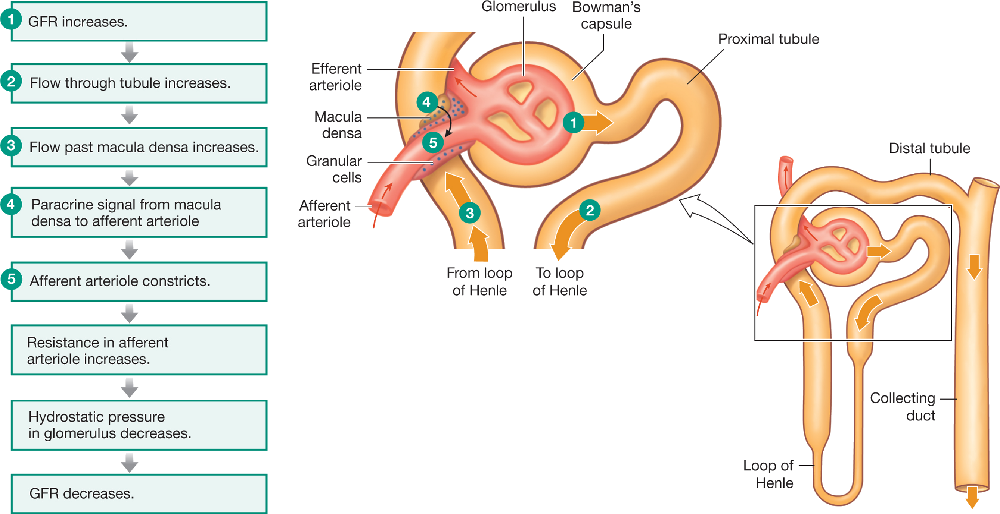

Image source: D.U. Silverthorn. Human Physiology, An Integrated Approach.

--
### Glomerular filtration rate (GFR) regulation
<h4 data-id="subhead">Tubuloglomerular feedback. Macula densa cells.</h4>

With increased tubule flow, the macula densa cells release paracrine signals* causing afferent arteriolar vasoconstriction.

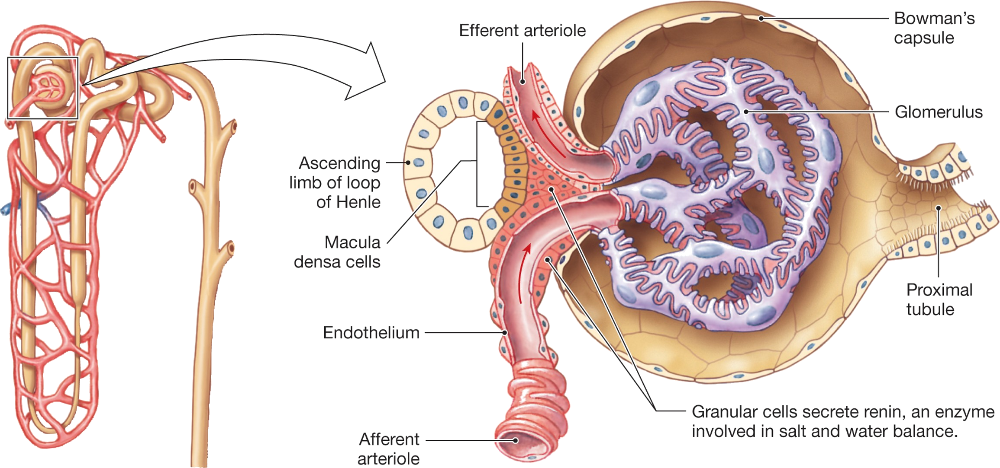

* Still an area of research to how this signalling cascade occurs. Image source: D.U. Silverthorn. Human Physiology, An Integrated Approach.

--
### Glomerular filtration rate (GFR) regulation
#### Autonomic neurons

- Sympathetic neurons innervate both afferent and efferent glomerular arterioles.
- Increased sympathetic stimulation causes vasoconstriction, reducing GFR.
- As always, there needs to be a **cause** for the change in sympathetic activity. Reasons could be:
    - sustained (hours, days) hypoxia or acidosis sensed by chemoreceptors
    - stress or pain response

--
### Glomerular filtration rate (GFR) regulation
#### Hormones

<table border="1" style="border-collapse: collapse; width: 100%;">
  <thead>
    <tr>
      <th>Hormone or Autacoid</th>
      <th>Source</th>
      <th>Vasoactive</th>
      <th>Effect on GFR</th>
    </tr>
  </thead>
  <tbody>
    <tr>
      <td>Norepinephrine</td>
      <td rowspan="2">Adrenal medulla</td>
      <td rowspan="3">Vasoconstriction</td>
      <td rowspan="3">↓</td>
    </tr>
    <tr>
      <td>Epinephrine</td>
    </tr>
    <tr>
      <td>Endothelin</td>
      <td>Vascular endothelial cells</td>
    </tr>
    <tr>
      <td>Angiotensin II</td>
      <td>Kidneys, multiple other organs</td>
      <td>Vasoconstriction</td>
      <td>Prevents ↓</td>
    </tr>
    <tr>
      <td>Endothelial derived nitric oxide</td>
      <td>Vascular endothelial cells</td>
      <td rowspan="2">Vasodilation</td>
      <td rowspan="2">↑</td>
    </tr>
    <tr>
      <td>Prostaglandins</td>
      <td>Most organs, including the heart</td>
    </tr>
  </tbody>
</table>

Autacoid: A biologically active substance that is produced by the body and acts locally near its site of synthesis. Table adapted from: Guyton and Hall Textbook of Medical Physiology.

--
### Reflection quiz
#### Glomerular filtration rate (GFR) regulation
#### Explain autoregulation of GFR through myogenic response, tubuloglomerular feedback,  hormones, and autonomic neurons

<a href="https://flux.qa/DA285K">flux.qa/DA285K</a>

<!-- #####################################LEARNING OBJECTIVE########################################### -->
---
<!-- .slide: data-auto-animate-restart -->
#### Learning objective
# Tubular Reabsorption
### Describe the mechanisms and physiological significance of tubular reabsorption in the nephron.

--
### Tubular Reabsorption
####

<!-- Highlight box with glow -->

Image source: D.U. Silverthorn. Human Physiology, An Integrated Approach.

--
### Tubular Reabsorption
####

Each day...
- about 180 litres of fluid comes into the tubule by glomerular filtration.
- about 1.5 litres of fluid is excreted (urine).

Therefore >99% of fluid filtered is reabsorbed.

Why filter so much only for it to be reabsorbed?

<!-- Highlight box with glow -->

Image: D.U. Silverthorn. Human Physiology, An Integrated Approach.

--
### Tubular Reabsorption
<h4  data-id="why">Why filter so much only for it to be reabsorbed?</h4>

1. Not everything filtered is reabsorbed. Allows for processing of a lot of fluid and...
    - unwanted foreign substances are not readily reabsorbed, clearing them from blood plasma.
    - wanted substances (glucose, acids) are readily reabsorbed.
2. Allows for large volume regulation of ions and water to allow for relatively quick regulation.

--
### Tubular Reabsorption
####

Reabsorption occurs by different mechanisms...

    

    

    <table>
        <tr>
            <th>substance</th>
            <th colspan="2">mechanism of transport</th>
        </tr><tr>
        <td style="padding-bottom: 40px;">Na+</td>
        <td>Active</td>
        <td>Reabsorbed by active transport.</td>
        </tr><tr>
        <td style="padding-bottom: 40px;">Anions</td>
        <td rowspan="2" style="vertical-align: middle;">Passive &nbsp;</td>
        <td>Electrochemical gradient.</td>
        </tr><tr>
        <td style="padding-bottom: 40px;">Water</td>
        <td>Osmosis.</td>
        </tr><tr>
        <td style="padding-bottom: 40px;">Permeable solutes (K+, Ca2+, urea)</td>
        <td>Active and passive</td>
        <td>Transcellular transport through membrane transporters or paracellular diffusion.
        </tr>
    </table>
    

    

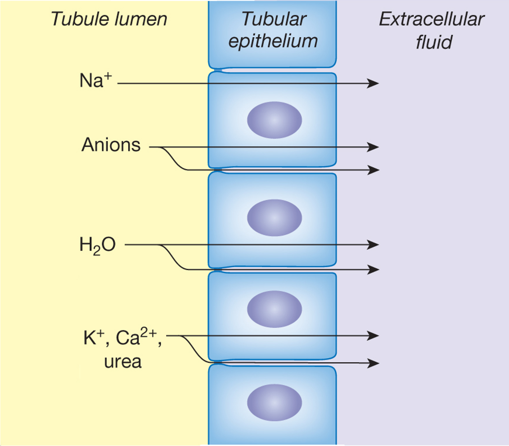

Image adapted from: D.U. Silverthorn. Human Physiology, An Integrated Approach.

    

--
### Tubular Reabsorption
#### Lower hydrostatic pressure in peritubular capillaries results in net reabsorption

    

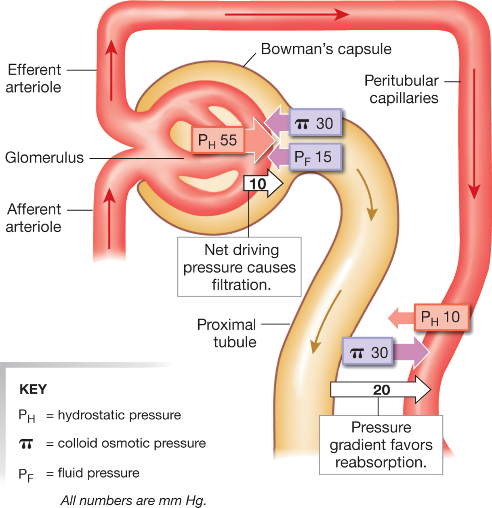

Image: D.U. Silverthorn. Human Physiology, An Integrated Approach.

    

    

    Passive processes of reabsorption means that, given normal peritubular capillary pressure, there is net reabsorption.
    

--
### Tubular Reabsorption
#### Active Na+ transport. Primary driving force for renal reabsorption.

    

        <b>Tubule lumen to tubule cell</b>
        <ul>
            <li>Na+ concentration higher in tubule lumen than in tubule cell.</li>
            <li>Therefore, Na+ will passively move down the electrochemical gradient into the tubule cells.</li>
            <li>Na+ symport or antiport with other molecules, e.g., symport of glucose <em>against</em> its concentration gradient.</li>
        </ul>
    

    

        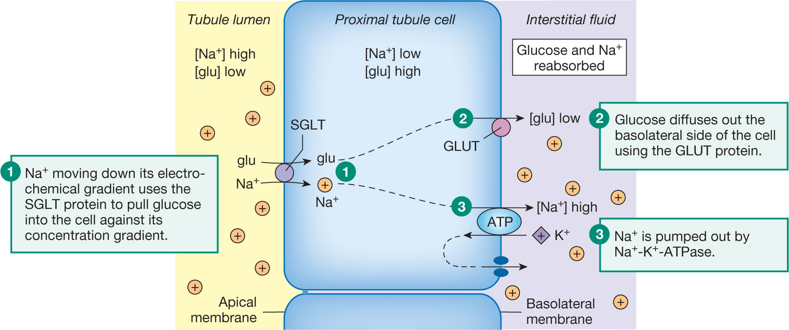
    

<b>symport</b>: two compounds (<em>sym-</em>) transported (<em>-port</em>) across a cell membrane. <b>antiport</b>: two compounds transported (<em>-port</em>) across a cell membrane in opposite (<em>anti-</em>) directions.

Image: D.U. Silverthorn. Human Physiology, An Integrated Approach.

--
### Tubular Reabsorption
#### Active Na+ transport. Primary driving force for renal reabsorption.

    

        
    

    

        <b>Tubule cell to interstitial fluid</b>
        <ul>
            <li>Na+ once in the cell needs to move <b>up</b> a concentration gradient to get into the interstitial fluid.</li>
            <li>This requires active transport.</li>
            <ul>
                <li>Na+ is pumped out in exchange for K+.</li>
                <li>K+ is allowed to return to the interstitium by leaky K+ channels in the basolateral membrane.</li>
            </ul>
        </ul>
    

Image: D.U. Silverthorn. Human Physiology, An Integrated Approach.

--
### Tubular Reabsorption
#### Saturation in active transport

    

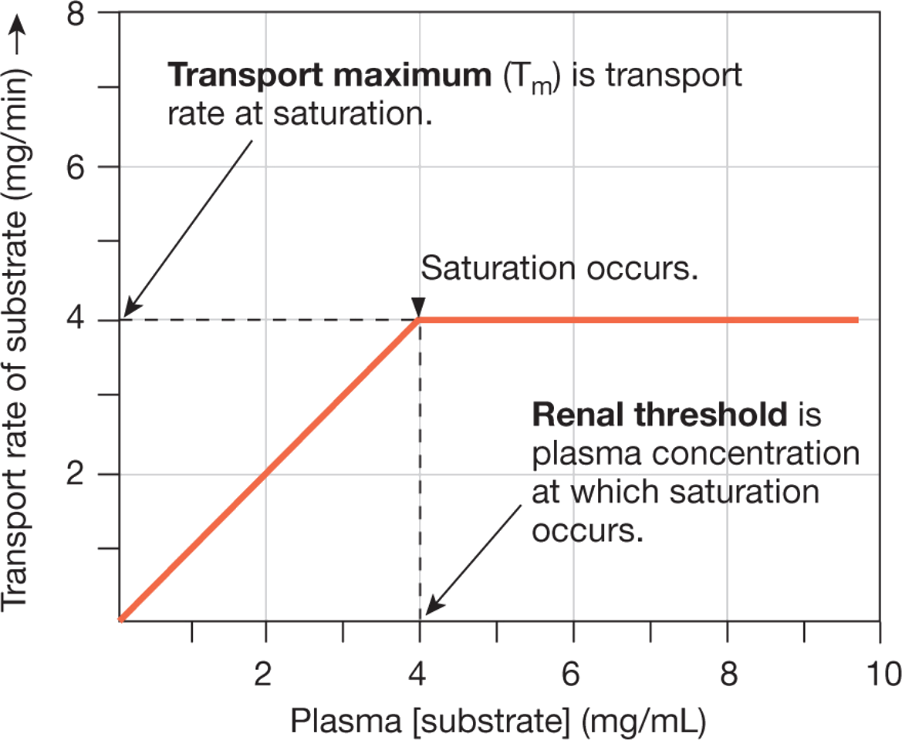

Image: D.U. Silverthorn. Human Physiology, An Integrated Approach.

    

    

Actively transported substances are limited by active transport channels.

Therefore, there is some limit to the rate of transport.

This is called saturation.

Analogy: There is a line of people waiting for a bus. If there are enough seats on the bus (active transport), everyone gets a seat (reabsorbed). If not, they have to wait for the next bus (excreted).

    

--
### Tubular Reabsorption
#### Saturation in active transport. Example.

    

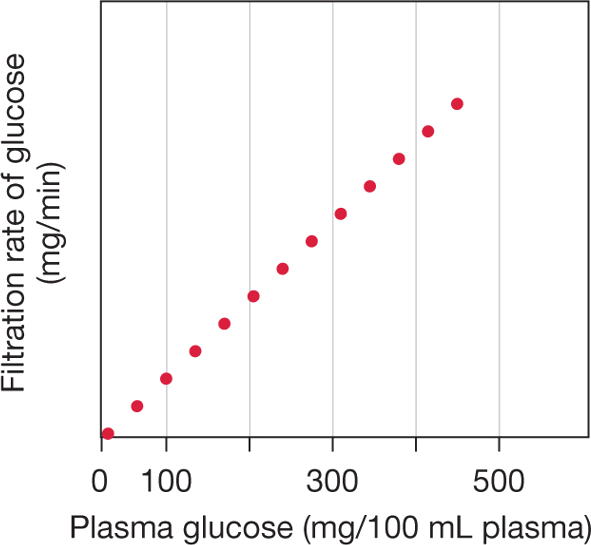
    

    

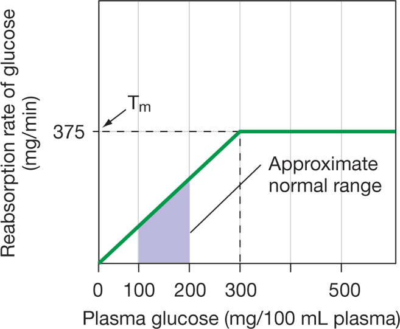
    

Image: D.U. Silverthorn. Human Physiology, An Integrated Approach.

--
### Tubular Reabsorption
#### Saturation in active transport. Example.

    

filtration&nbsp;&nbsp;&nbsp;&nbsp;&nbsp;&nbsp;&nbsp;&nbsp;&nbsp;&nbsp;&nbsp;&nbsp;&nbsp;&nbsp;&nbsp;&nbsp;&nbsp;&nbsp;&nbsp;&nbsp;reabsorption

&nbsp;&nbsp;

 

excretion = filtration - reabsorption

    

    

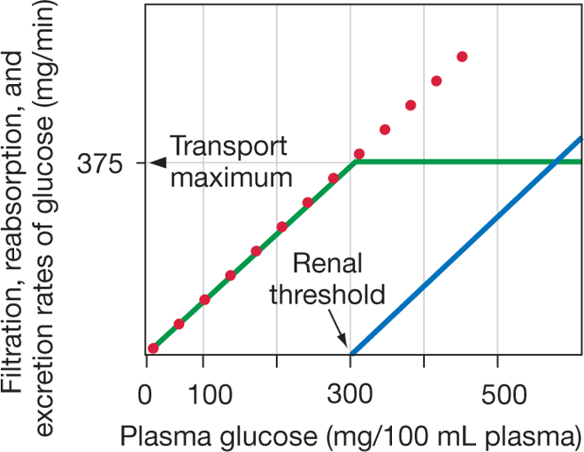
    

Image: D.U. Silverthorn. Human Physiology, An Integrated Approach.

--
### Tubular Reabsorption
#### Saturation in active transport. Example.

    

excretion = filtration - reabsorption

<ul>
    <li>At normal plasma glucose levels (approx. 100-200 mg/100 ml plasma), glucose is reabsorbed.</li>
    <li class="fragment fade-in">At abnormal plasma glucose levels (approx. >300 mg/100 ml plasma, e.g. diabetes mellitus), some glucose is excreted.</li>
<ul>
    

    

    

Image: D.U. Silverthorn. Human Physiology, An Integrated Approach.

--
### Reflection quiz
#### Tubular Reabsorption
#### Describe the mechanisms and physiological significance of tubular reabsorption in the nephron.

<a href="https://flux.qa/DA285K">flux.qa/DA285K</a>

<!-- #####################################LEARNING OBJECTIVE########################################### -->
---
<!-- .slide: data-auto-animate-restart -->
#### Learning objective
# Tubular Secretion
### Explain the process of tubular secretion in the nephron, identifying key substances secreted.

--
### Tubular Secretion
####

<!-- Highlight box with glow -->

Image source: D.U. Silverthorn. Human Physiology, An Integrated Approach.

--
### Tubular Secretion
####
- <b>Active</b> movement of molecules from peritubular capillaries, through extracellular fluid, into the tubule lumen.
- Enables the nephron to increase secretion (and therefore excretion) of substances.
- Important in homeostatic regulation of...
    - electrolytes: K+ and H+ ions
    - organic compounds: vitamins, drug compounds, epinephrine, norephrinephrine

<!-- Highlight box with glow -->

Image source: D.U. Silverthorn. Human Physiology, An Integrated Approach.

--
### Tubular Secretion
#### Organic compound transport - example

- Transporters have broad specificity
- e.g., <b>The Organic Anion Transporter (OAT)</b> transports bile salts, benzenoate (soft drink preservative), salicylate (in apsirin), saccharine (artificial sweetener),...

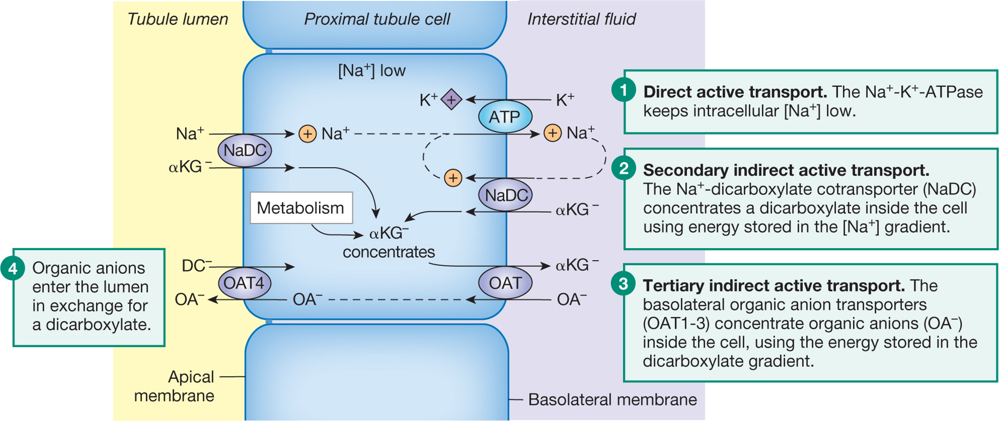

Image source: D.U. Silverthorn. Human Physiology, An Integrated Approach.

--
### Reflection quiz
#### Tubular Secretion
#### Explain the process of tubular secretion in the nephron, identifying key substances secreted.

<a href="https://flux.qa/DA285K">flux.qa/DA285K</a>

<!-- #####################################LEARNING OBJECTIVE########################################### -->
---
<!-- .slide: data-auto-animate-restart -->
#### Learning objective
# Renal Clearance
### Describe the relationship between filtration, reabsorption, secretion, and excretion of common substances, and explain the concept of renal clearance to quantify kidney function

--
### Renal clearance
####

<!-- Highlight box with glow -->

Image: D.U. Silverthorn. Human Physiology, An Integrated Approach.

--
### Renal clearance
####

**Excretion**

The rate at which a substance is being removed.

**Clearance**

The rate at which a substance is being removed, normalised to the concentration of the substance in the system it is being removed from.

--
### Renal clearance
####

**Excretion**

$\mathrm{excretion~rate~of~}X=X\mathrm{~filtration~rate}-X\mathrm{~reabsorption~rate}+X\mathrm{~secretion~rate}$

$\mathrm{excretion~rate~of~}X=\mathrm{urine~flow}\times[X]_{\mathrm{urine}}$

<b>Clearance</b>

$\mathrm{clearance~of~}X=\dfrac{\mathrm{excretion~rate~of~}X}{[X]_{\mathrm{plasma}}}$

--
### Renal clearance
#### Examples: Inulin

$\mathrm{excretion}=\mathrm{filtration}-\mathrm{reabsorption}+\mathrm{secretion}$

    

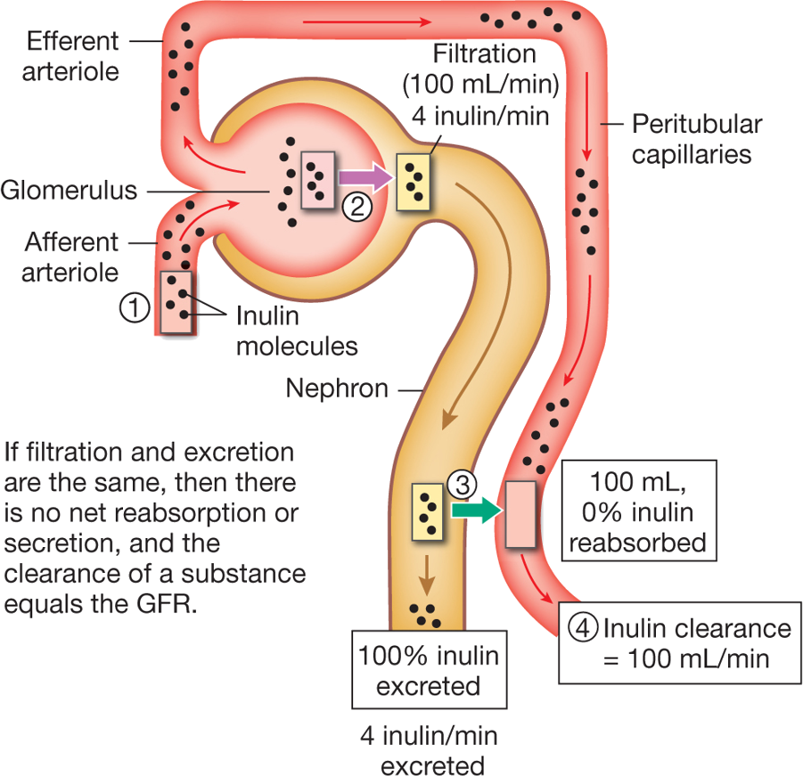
    

    

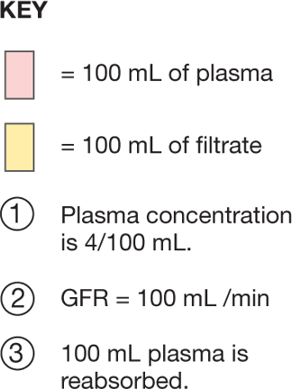
    

    

$\mathrm{excretion}=4-0+0\mathrm{~mg/min}$

$\mathrm{~~~~~~~~~~~~~~~}=4\mathrm{~mg/min}$

$\mathrm{clearance}=\dfrac{\mathrm{excretion~rate~of~}X}{[X]_{\mathrm{plasma}}}$

$\mathrm{~~~~~~~~~~~~~~~}=\dfrac{4\mathrm{~mg/min}}{0.04\mathrm{~mg/ml}}$

$\mathrm{~~~~~~~~~~~~~~~}=100\mathrm{~ml/min} = \mathrm{GFR}$
    

Image source: D.U. Silverthorn. Human Physiology, An Integrated Approach.

--
### Renal clearance
#### Examples: Glucose

$\mathrm{excretion}=\mathrm{filtration}-\mathrm{reabsorption}+\mathrm{secretion}$

    

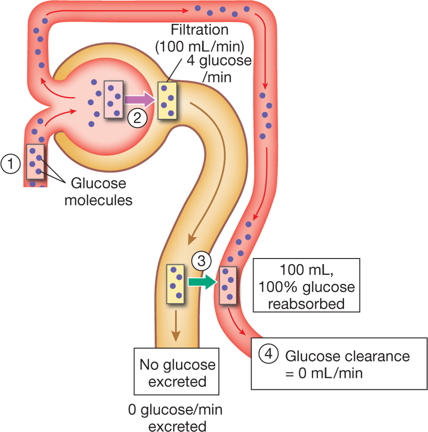
    

    

    

    

$\mathrm{excretion}=4-4+0\mathrm{~mg/min}$

$\mathrm{~~~~~~~~~~~~~~~}=0\mathrm{~mg/min}$

$\mathrm{clearance}=\dfrac{\mathrm{excretion~rate~of~}X}{[X]_{\mathrm{plasma}}}$

$\mathrm{~~~~~~~~~~~~~~~}=\dfrac{0\mathrm{~mg/min}}{0.04\mathrm{~mg/ml}}$

$\mathrm{~~~~~~~~~~~~~~~}=0\mathrm{~ml/min}$
    

Image source: D.U. Silverthorn. Human Physiology, An Integrated Approach.

--
### Renal clearance
#### Examples: Urea

$\mathrm{excretion}=\mathrm{filtration}-\mathrm{reabsorption}+\mathrm{secretion}$

    

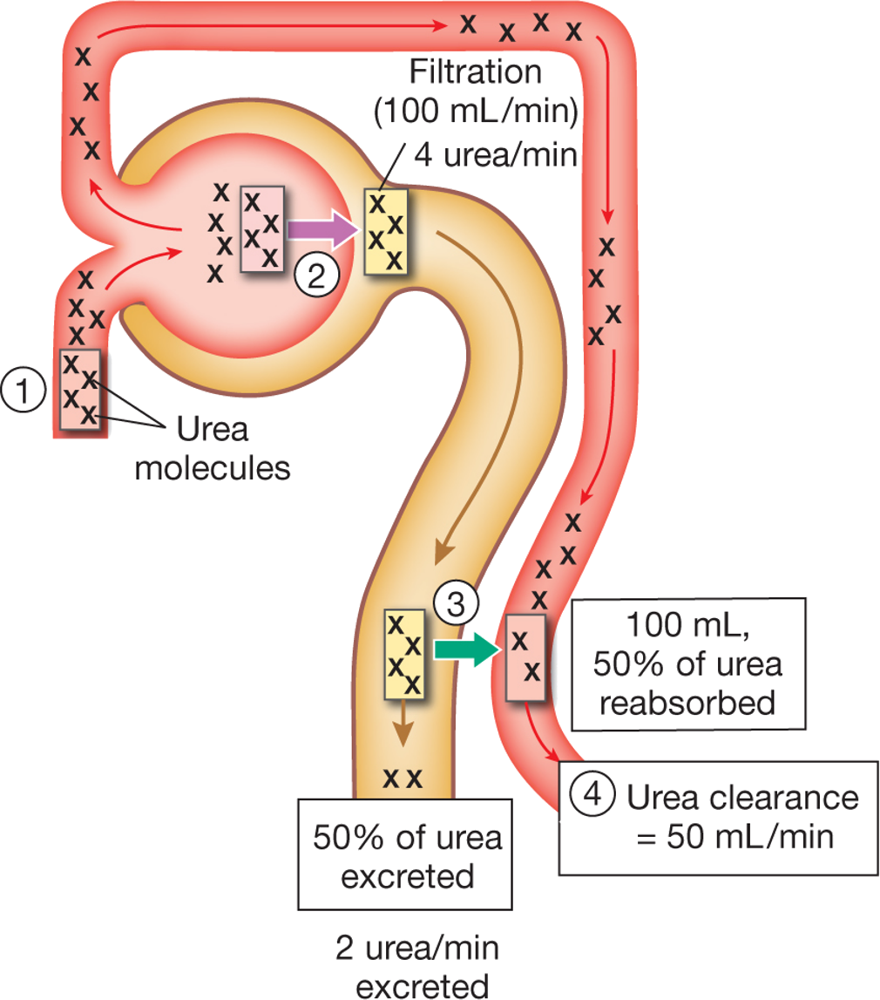
    

    

    

    

$\mathrm{excretion}=4-2+0\mathrm{~mg/min}$

$\mathrm{~~~~~~~~~~~~~~~}=2\mathrm{~mg/min}$

$\mathrm{clearance}=\dfrac{\mathrm{excretion~rate~of~}X}{[X]_{\mathrm{plasma}}}$

$\mathrm{~~~~~~~~~~~~~~~}=\dfrac{2\mathrm{~mg/min}}{0.04\mathrm{~mg/ml}}$

$\mathrm{~~~~~~~~~~~~~~~}=50\mathrm{~ml/min}$
    

Image source: D.U. Silverthorn. Human Physiology, An Integrated Approach.

--
### Renal clearance
#### Relation to Glomerular Filtration Rate (GFR)

<table>
    <tr>
        <th></th>
        <th></th>
        <th></th>
        <th>filtered</th>
        <th>reabsorbed</th>
        <th>secreted</th>
        <th>example solute</th>
    <tr>
    <tr>
        <td>clearance</td>
        <td>=</td>
        <td>GFR</td>
        <td>✅</td>
        <td>❌</td>
        <td>❌</td>
        <td>inulin (gold standard for measuring GFR)</td>
    </tr>
    <tr>
        <td>clearance</td>
        <td><</td>
        <td>GFR</td>
        <td>✅</td>
        <td colspan="2">net reabsorption</td>
        <td>glucose (100% reabsorbed)</td>
    </tr>
        <tr>
        <td>clearance</td>
        <td>></td>
        <td>GFR</td>
        <td>✅</td>
        <td colspan="2">net secretion</td>
        <td>urea</td>
    </tr>
</table>

--
### Renal clearance
#### 
<video data-autoplay data-src="images/clearance_silverthorn.mp4" width="75%"><video>

Image source: D.U. Silverthorn. Human Physiology, An Integrated Approach.
