<!-- .slide: data-auto-animate-restart id="MEDI2101Wk6_1"-->
#### MEDI2101 Cardiovascular and Respiratory System.
### Block 3: Renal System
# Week 11: Fluid, electrolyte, and acid-base balance
##### Assoc. Prof. Mark Butlin (PhD, BE, SFHEA) (he/him)

Macquarie Medical School, Faculty of Medicine, Health and Human Sciences Macquarie University. On the land of the Wallumattagal clan of the Dharug Nation.

&nbsp;

&nbsp;

&nbsp;

This material is provided to you as a Macquarie University student for your individual research and study purposes only. You cannot share this material without permission. Macquarie University is the copyright owner of (or has licence to use) the intellectual property in this material. Legal and/or disciplinary actions may be taken if this material is shared without the University’s written permission.

--
### 
#### Extension reading

In past weeks, the recommended text if you wanted to take extension reading was <em>Guyton and Hall's Textbook of Medical Physiology</em>.

For renal physiology, I find that <em>D.U. Silverthorn. Human Physiology, An Integrated Approach</em> provides a more succinct summary of the topic area.

The chapter readings continue to be an extension study resource only, not a mandatory core to the unit.

<!-- #####################################LEARNING OBJECTIVE########################################### -->
---
<!-- .slide: data-auto-animate-restart -->
#### Learning objective
# Importance of Fluid and Electrolyte Homeostasis
### Explain the physiological importance of fluid and electrolyte balance for cardiovascular, renal, and respiratory function.

--
### Importance of Fluid and Electrolyte Homeostasis
####

The cardiovascular and respiratory system is a system to maintain a liveable environment for body cells.

Body cells need...
- delivery of oxygen and nutrients.
- removal of waste products.

This is most efficiently done in...
- an environment that is not too acidic or alkalotic.
- an environment that is osmotically balanced (to prevent cells from removing or absorbing too much water, causing cell lysis)
- there is effective blood volume to transport material to all organs.

--
### Importance of Fluid and Electrolyte Homeostasis
####

To maintain fluid volume and electrolyte balance, a number of systems are involved.

- Volume receptors in atria of the heart.
- Carotid and aortic baroreceptors.
- Innate regulation in the kidneys.
- Cardiovascular and respiratory responses (cardiac output, vasoconstriction, minute ventilation).
- Behavioural changes.

--
### Reflection quiz
#### Importance of Fluid and Electrolyte Homeostasis. 
#### Explain the physiological importance of fluid and electrolyte balance for cardiovascular, renal, and respiratory function.

<a href="https://flux.qa/DA285K">flux.qa/DA285K</a>

<!-- #####################################LEARNING OBJECTIVE########################################### -->
---
<!-- .slide: data-auto-animate-restart -->
#### Learning objective
# Water Balance
### Summarize water balance regulation, focusing on vasopressin and the countercurrent mechanism (linking to prior nephron knowledge).

--
### Water Balance
####

Water is about 50 to 60% of our total body content.

e.g., a 70 kg person is about 35 to 42 litres of water.

Where is that water?

<table>
    <tr>
        <th>location</th>
        <th>proportion of water</th>
        <th>69 kg person</th>
    </tr><tr>
        <td>intracellular</td>
        <td>⅔</td>
        <td>25 L</td>
    </tr><tr>
        <td>interstitial</td>
        <td>¼</td>
        <td>10 L</td>
    </tr><tr>
        <td>plasma</td>
        <td>1/12</td>
        <td>3 L</td>
    </tr><tr>
        <td>total</td>
        <td>100%</td>
        <td>38 L</td>
    </tr>
</table>

Intracellular would also include water in red blood cells.

--
### Water Balance
####

    

We must take in the same amount of water as is removed from our body.

Otherwise dehydration (excess removal of water) or oedema (excess retention of water) results.
    

    

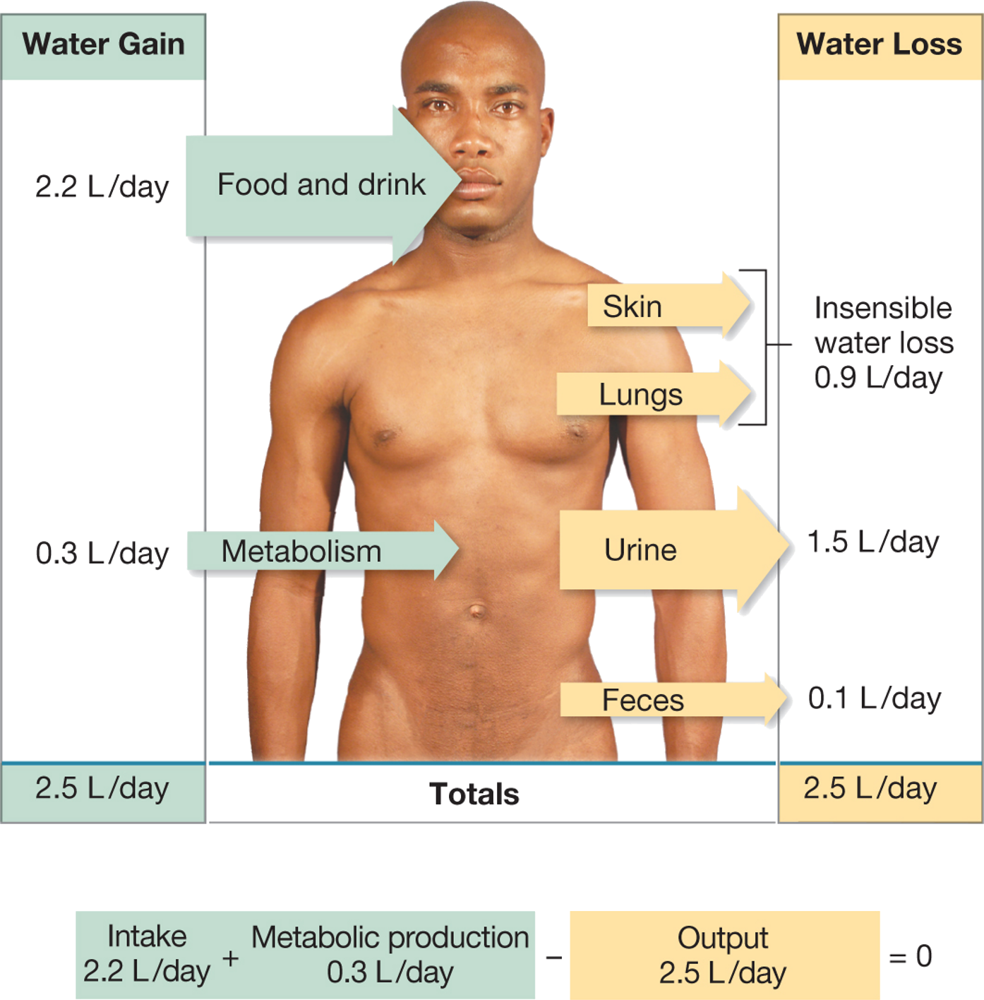

Image: D.U. Silverthorn. Human Physiology, An Integrated Approach.

    

--
### Water Balance
#### Removal of water

    

Image: D.U. Silverthorn. Human Physiology, An Integrated Approach.

    

    

<ul>
    <li><b>Insensible water loss</b> Not normally aware of this loss.</li>
    <ul>
        <li><b>skin</b>: evaporative water loss (sweat)</li>
        <li><b>lungs</b>: expiration of humidified air</li>
    </ul>
    <li><b>urine</b></li>
    <li><b>faeces</b></li>
</ul>
    

--
### Water Balance
#### Addition of water

    

<ul>
    <li><b>food and drink</b></li>
    <li><b>metabolism</b>: Aerobic respiration produces water:</li>
</ul>
$$
\mathrm{glucose}+\mathrm{O}_2\rightarrow\mathrm{CO}_2+\mathrm{H}_2\mathrm{O}
$$
    

    

Image: D.U. Silverthorn. Human Physiology, An Integrated Approach.

    

--
### Water Balance
#### Kidneys conserve, but do <b>not</b> add water

    

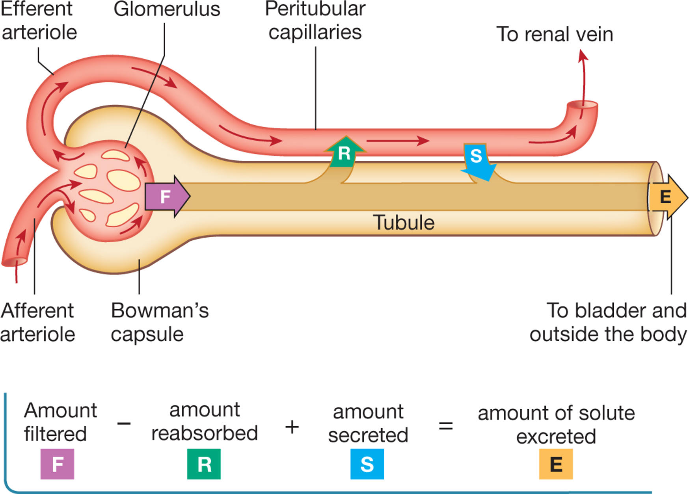
<!-- Highlight box with glow -->

Image: D.U. Silverthorn. Human Physiology, An Integrated Approach.

    

    

<ul>
    <li>Kidneys reabsorb water from the plasma filtrate.</li>
    <li>This allows kidneys to reduce the amount of water loss.</li>
    <li>Kidneys cannot increase plasma volume by drawing from urine.</li>
</ul>

That is, if dehydrated, the kidneys cannot "rescue" the situation by adding more water. They can only reduce further water loss.

    

--
### Water Balance
####  Kidneys conserve, but do <b>not</b> add water

    

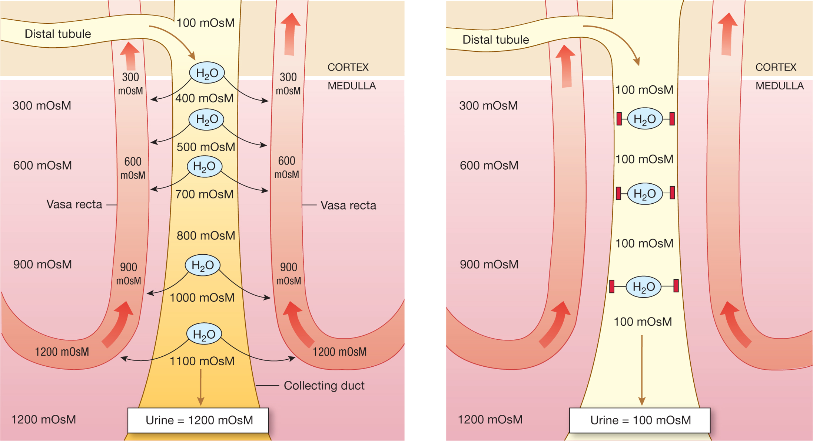

Image: D.U. Silverthorn. Human Physiology, An Integrated Approach.

    

    

If the filtrate is highly concentrated (high osmolarity), it drives increased water reabsorption.

If the filtrate is dilute (low osmolarity), it reduces water reabsorption.

    

--
### Water Balance
#### Vasopressin controls water reabsorption

    

<ol>
    <li>Vasopressin binds to collecting duct cell membrane receptor.</li>
    <li>Receptor activates cAMP second messenger system.</li>
    <li>Cell inserts aquaporin-2 (AQP2) regulated water channels.</li>
    <li>Water is reabsorbed by osmosis into the blood.</li>
</ol>

<b>Synonyms</b>: vasopressin, arginine vasopressin (AVP), antidiuretic hormone (ADH).

    

    

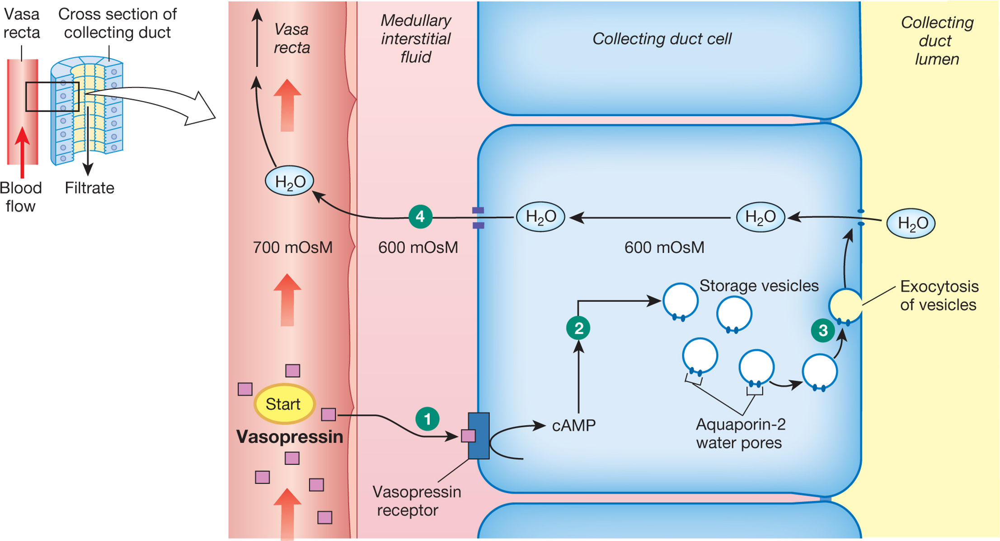

Image: D.U. Silverthorn. Human Physiology, An Integrated Approach.

    

--
### Water Balance
#### Where does the vasopressin come from?

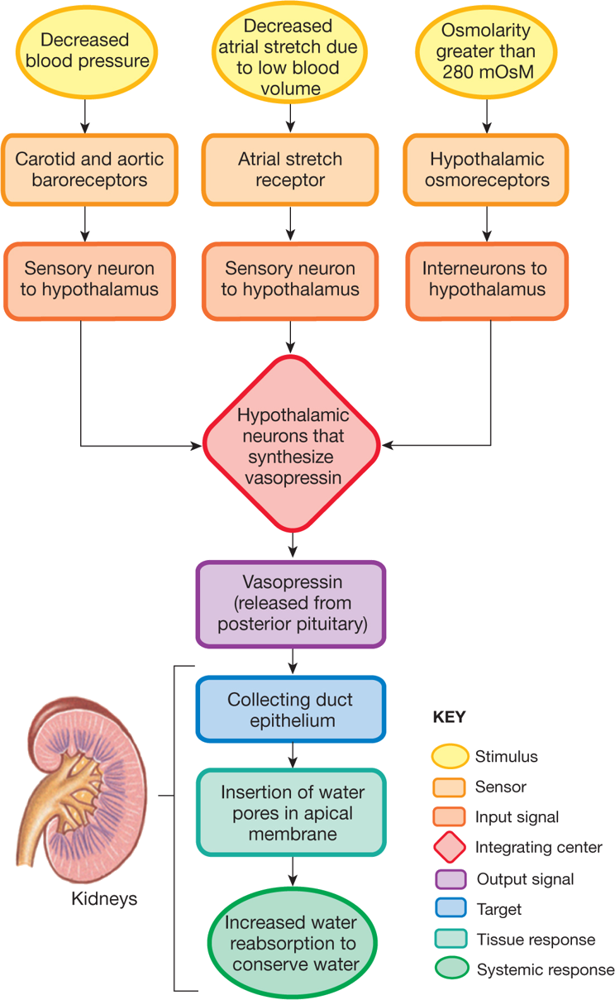
<!-- Highlight box with glow -->

Image: D.U. Silverthorn. Human Physiology, An Integrated Approach.

--
### Water Balance
#### Where does the vasopressin come from?

    

<ul>
    <li>Decreased blood pressure &rarr; baroreceptors &rarr; hypothalamus (and vasomotor and respiratory cortex) &nbsp;</li>
    <li>Decreased stretch of atria of heart &rarr; atrial stretch receptors &rarr; hypothalamus. &nbsp;</li>
    <li>Blood osmolarity high &rarr; hypothalamic osmoreceptors</li>
</ul>
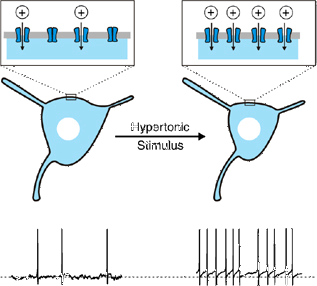

Image: Sharif-Naeini et al. Kidney Int. 2008;73(7):811-5. doi: <a href="http://doi.org/10.1038/sj.ki.5002788">10.1038/sj.ki.5002788</a>

    

    

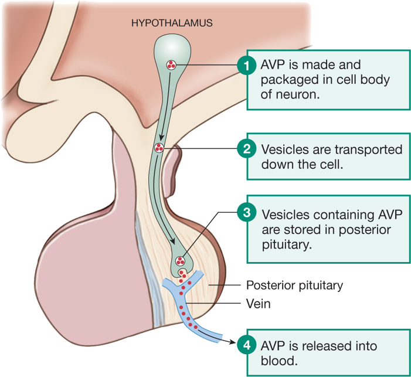

Image: D.U. Silverthorn. Human Physiology, An Integrated Approach.

    

--
### Water Balance
#### Renal countercurrent multiplier

The renal countercurrent multiplier is an additional mechanism that, by locally increasing osmolarity, increases water reabsorption.

A countercurrent what?

--
### Water Balance
<h4 data-id="counter"> A countercurrent what? e.g., A countercurrent heat exchanger.</h4>

    

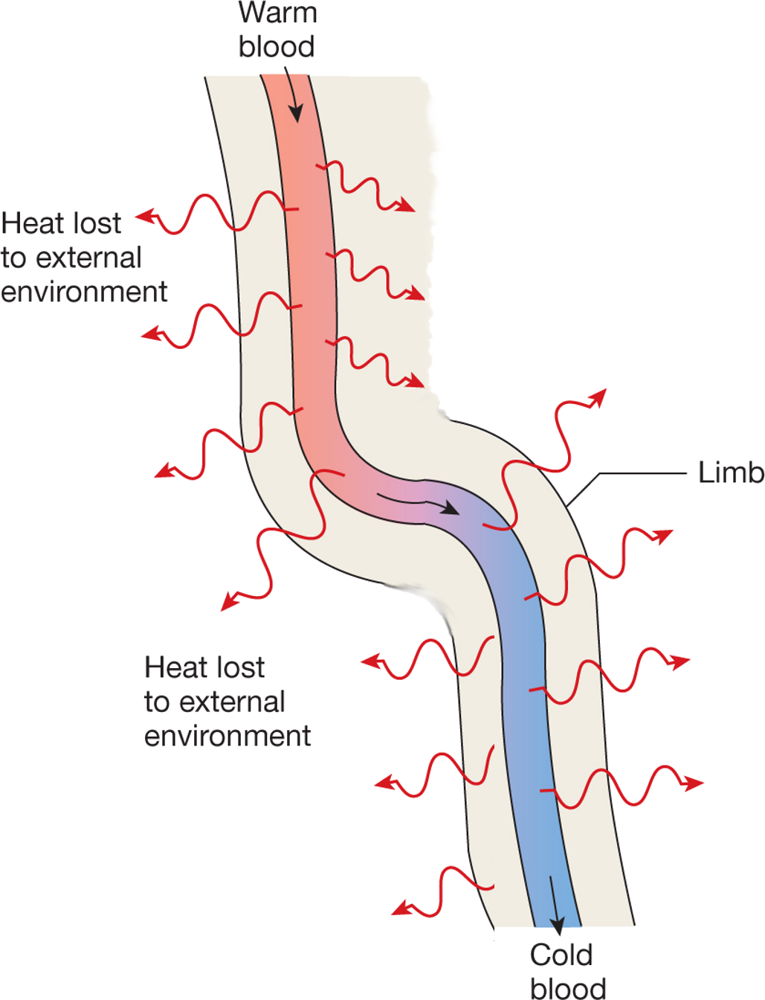
    

    

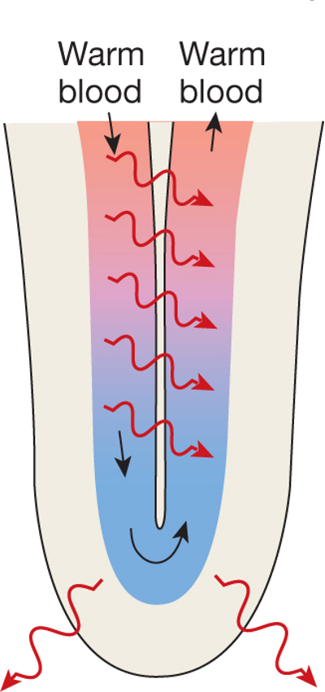

The heat loss from the proximal side of the blood vessel is absorbed by the cooler blood in the distal section of the blood vessel.

    

Image: D.U. Silverthorn. Human Physiology, An Integrated Approach.

--
### Water Balance
#### Renal countercurrent multiplier

    

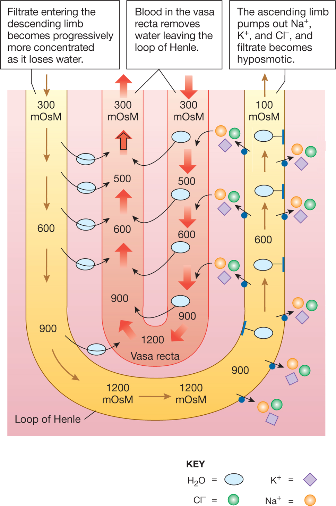
    

    

<ul>
    <li>The descending limb of the loop of Henle is water permeable, but does not transport ions.</li>
    <ul>
        <li>Locally decreases the osmolarity of the interstitium and distal vasa recta. &nbsp;</li>
    </ul>
    <li class="fragment" data-fragment-index="1">The ascending limb of the loop of Henle transports ions but is not water permeable.</li>
    <ul>
        <li class="fragment" data-fragment-index="1">Locally increases the osmolarity of the interstitium. Water is not reabsorbed into the proximal vasa recta. &nbsp;</li>
    </ul>
    <li class="fragment" data-fragment-index="2">The higher osmolarity proximal vasa recta allows water to move across by osmosis into the distal vasa recta. &nbsp;</li>
    <li class="fragment" data-fragment-index="3">The renal countercurrent multiplier means all other things equal, the osmolarity of the blood entering the vasa recta is approximately the osmolarity of the blood leaving the vasa recta.</li>
</ul>
    
Image: D.U. Silverthorn. Human Physiology, An Integrated Approach.

    

--
### Reflection quiz
#### Water Balance.
#### Summarize water balance regulation, focusing on vasopressin and the countercurrent mechanism (linking to prior nephron knowledge).

<a href="https://flux.qa/DA285K">flux.qa/DA285K</a>

<!-- #####################################LEARNING OBJECTIVE########################################### -->
---
<!-- .slide: data-auto-animate-restart -->
#### Learning objective
# Sodium Homeostasis and Extacellular Fluid (ECF) Volume
### Outline sodium balance and ECF volume control, emphasizing RAAS and natriuretic peptides.

--
### Sodium Homeostasis and ECF Volume
#### Hypothetical scenario without sodium control

A person eats 9 g (155 milliosmoles) of NaCl (salt) in a day (highly feasible in the western diet).

<h5>If they do drink water...</h5>

Normal body Na+ is 140 mOsm/litre.

To reduce the 155 mOsm of Na+ to 140 mOsm, the person would need to drink...

$155\mathrm{~mOsm/}x\mathrm{~litres}=140\mathrm{~mOsm/litre}$

$x=1.1\mathrm{~litres}$

This water would also need to be taken up by the ECF, causing oedema.

--
### Sodium Homeostasis and ECF Volume
#### Hypothetical scenario without sodium control

A person eats 9 g (155 milliosmoles) of NaCl (salt) in a day (highly feasible in the western diet).

<h5>If they don't drink water...</h5>

Osmosis will occur, and water will be taken out of cells into the ECF to reduce ECF osmolarity.

Cells will shrink, disrupting normal function.

--
### Sodium Homeostasis and ECF Volume
#### 
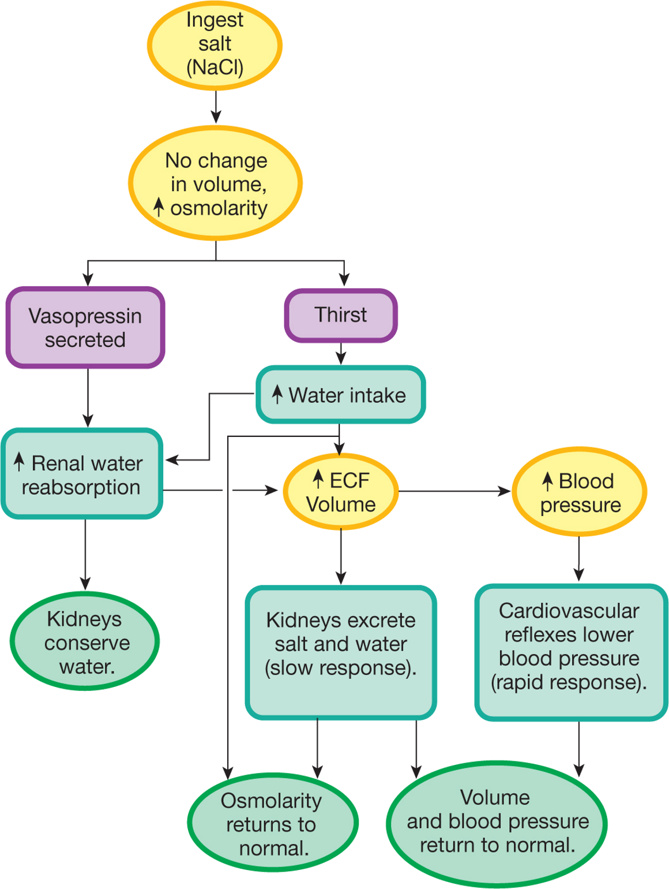

Image: D.U. Silverthorn. Human Physiology, An Integrated Approach.

--
### Reflection quiz
#### Sodium Homeostasis and Extacellular Fluid (ECF) Volume.
#### Outline sodium balance and ECF volume control, emphasizing RAAS and natriuretic peptides.

<a href="https://flux.qa/DA285K">flux.qa/DA285K</a>

<!-- #####################################LEARNING OBJECTIVE########################################### -->
---
<!-- .slide: data-auto-animate-restart -->
#### Learning objective
# Behavioural Mechanisms of Salt and Water Regulation
### Describe behavioural mechanisms involved in salt and water balance, including thirst and salt appetite as part of homeostatic regulation.

--
### Behavioural Salt and Water Regulation
#### Thirst
- Drinking water (or eating water containing foods) is the pathway to restore body water.
- High plasma and interstitial fluid osmolarity increases firing of osmoreceptors in the hypothalamus.
- This triggers the sensation of thirst.

<ul>
    <li>Drinking relieves the sensation of thirst <em>before</em> blood osmolarity changes.</li>
    <li>It is theorised that receptors in the mouth and pharynx detect the cool sensation of liquid, and silence the thirst response.</li>
    <li>This is why patients going into surgery (who cannot drink large volumes) are given ice chips to suck on. It alleviates thirst without adding significant body water content.</li>
</ul>

--
### Behavioural Salt and Water Regulation
#### Salt appetite

- The hypothalamus can trigger a sensation of appetite for salt with low blood osmolarity.
- Linked to aldosterone and angiotensin.
- Not to be confused with the reward system, which can also drive an appetite for salty foods.

--
### Behavioural Salt and Water Regulation
#### Avoidance preventing dehydration
- Dehydration can cause a desire to seek shady, cool places.
- Observed in animals who seek shade during the peak of the day.
- Shaped societal habits, such as the siesta in near equatorial regions of the world.

--
### Reflection quiz
#### Behavioural Mechanisms of Salt and Water Regulation.
#### Describe behavioural mechanisms involved in salt and water balance, including thirst and salt appetite as part of homeostatic regulation.

<a href="https://flux.qa/DA285K">flux.qa/DA285K</a>

<!-- #####################################LEARNING OBJECTIVE########################################### -->
---
<!-- .slide: data-auto-animate-restart -->
#### Learning objective
# Potassium Homeostasis
### Discuss potassium homeostasis, its role in neuromuscular and cardiac function, and key regulatory mechanisms.

--
### Potassium Homeostasis
####
Potassium...
- is critical to transmission of electrical signals in nerve cells.
- is critical to muscle function.
- contributes to osmotic concentration, and therefore fluid balance.
- has a role in acid-base balance.

In the kidney, potassium is...
- filtered,
- reabsorbed, and
- secreted

--
### Potassium Homeostasis
####
At normal levels, more K+ is filtered and secreted than reabsorbed.

Clearance of K+ is around 10 to 20%.

    

<b>Low K+ levels...</b>

<ul>
    <li>Low plasma K+ concentration.</li>
    <li>K+ reabsorption increases.</li>
    <li>K+ excretion decreases.</li>
</ul>
    

    

<b>High K+ levels (hyperkalemia)...</b>

<ul>
    <li>Hyperkalemia stimulates the adrenal cortex.</li>
    <li>Causes release of aldosterone.</li>
    <li>Aldosterone acts on the distal nephron, increasing the Na+-K+-ATPase pump.</li>
    <li>This secretion of K+ increases K+ excretion.</li>
</ul>
    

--
### Reflection quiz
#### Potassium Homeostasis.
#### Discuss potassium homeostasis, its role in neuromuscular and cardiac function, and key regulatory mechanisms.

<a href="https://flux.qa/DA285K">flux.qa/DA285K</a>

<!-- #####################################LEARNING OBJECTIVE########################################### -->
<!---
<!-- .slide: data-auto-animate-restart
#### Learning objective
# Volume and Arterial Blood Pressure
### Integrate volume, osmolarity, and blood pressure control, highlighting compensatory responses to common disturbances (e.g., dehydration, haemorrhage).

--
### Volume and Arterial Blood Pressure
####
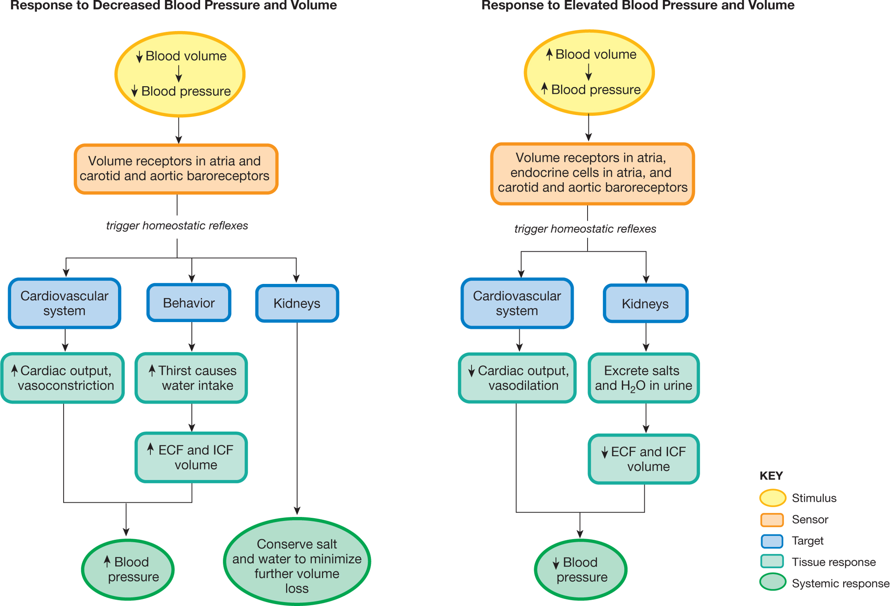

Image: D.U. Silverthorn. Human Physiology, An Integrated Approach.

--
### Reflection quiz
#### Volume and Arterial Blood Pressure.
#### Integrate volume, osmolarity, and blood pressure control, highlighting compensatory responses to common disturbances (e.g., dehydration, haemorrhage).

<a href="https://flux.qa/DA285K">flux.qa/DA285K</a>

-->

<!-- #####################################LEARNING OBJECTIVE########################################### -->
---
<!-- .slide: data-auto-animate-restart -->
#### Learning objective
# Acid-Base Balance
### Provide an overview of the respiratory and renal mechanisms of acid-base balance, including major buffering systems.

--
### Acid-Base Balance
#### 

    

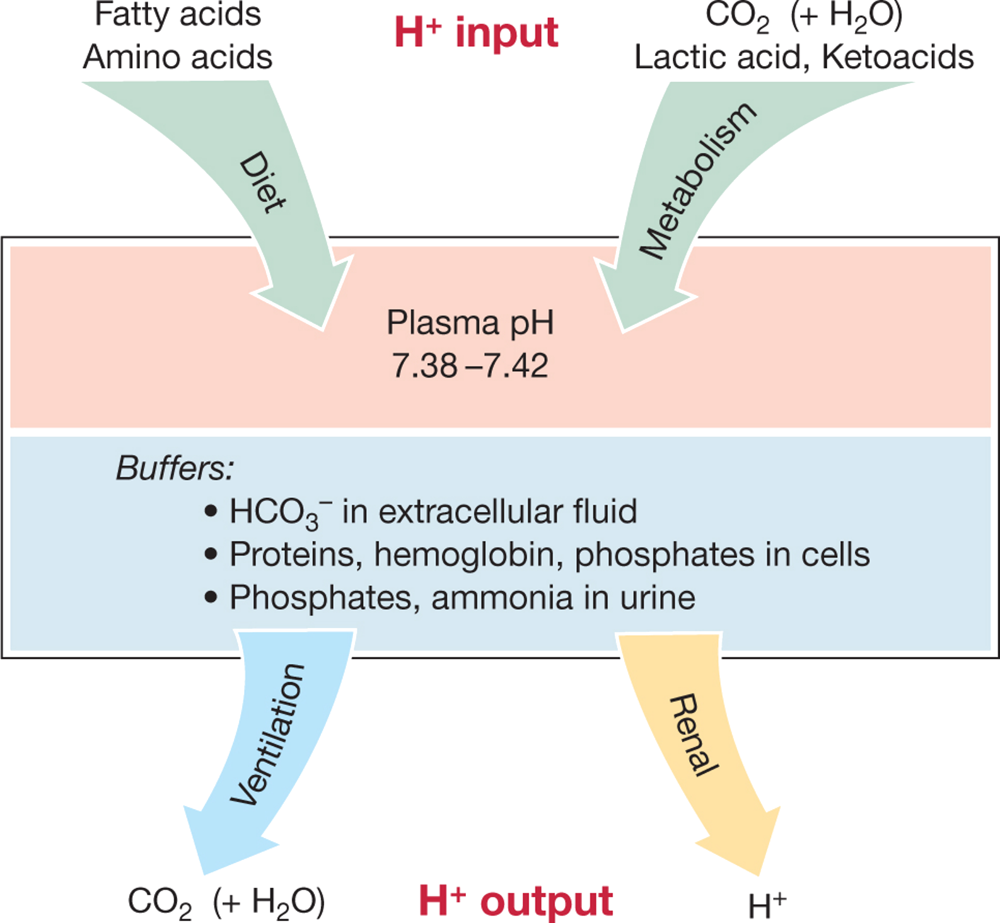

Image: D.U. Silverthorn. Human Physiology, An Integrated Approach.

    

    

<b>Sources of acids</b>

<b>Diet:</b> fatty acids, amino acids.

<b>Metabolism:</b> waste products include lactic acid and ketoacids, and CO2 production (bicarbonate reaction).

<b>Removal of acids</b>

<b>Respiratory:</b> Removal of CO2 (and subsequent bicarbonate reaction).

<b>Kidneys:</b> Removal of H+ ions.

    

--
### Acid-Base Balance
#### Control systems

    

Image: D.U. Silverthorn. Human Physiology, An Integrated Approach.

    

    

<b>Buffers:</b> Predominantly bicarbonate reaction.

<b>Respiratory:</b> Removal of CO2 (and subsequent bicarbonate reaction).

<b>Kidneys:</b> Removal of H+ ions.

    

--
### Acid-Base Balance
#### Buffer. Bicarbonate system.

\begin{equation}
\mathrm{carbon\~dioxide} + \mathrm{water} \rightleftharpoons \mathrm{carbonic\~acid} \rightleftharpoons \mathrm{hydrogen\~ions} + \mathrm{bicarbonate\~ions}
\end{equation}

\begin{equation}
\mathrm{CO}_2 + \mathrm{H}_2\mathrm{O} \overset{\mathrm{carbonic~anhydrase}}\rightleftharpoons \mathrm{H}_2\mathrm{CO}_3 \rightleftharpoons \mathrm{H}^+ + \mathrm{HCO}^{3-}
\end{equation}

\begin{equation}
\mathrm{CO}_2 + \mathrm{H}_2\mathrm{O} \rightleftharpoons \mathrm{H}^+ + \mathrm{HCO}^{3-}
\end{equation}

--
### Acid-Base Balance
#### Buffer. Bicarbonate system.

\begin{equation}
\mathrm{CO}_2 + \mathrm{H}_2\mathrm{O} \rightleftharpoons \mathrm{H}^+ + \mathrm{HCO}^{3-}
\end{equation}

Decreased respiration or increased metabolism results in a shift toward acidotic:

\begin{equation}
\textcolor{red}{\uparrow\mathrm{CO}_2} + \class{fragment}{\textcolor{blue}{\downarrow}}\mathrm{H}_2\mathrm{O} \rightleftharpoons \class{fragment}{\textcolor{red}{\uparrow}}\mathrm{H}^+ + \class{fragment}{\textcolor{red}{\uparrow}}\mathrm{HCO}^{3-}
\end{equation}

--
### Acid-Base Balance
#### Buffer. Bicarbonate system.

\begin{equation}
\mathrm{CO}_2 + \mathrm{H}_2\mathrm{O} \rightleftharpoons \mathrm{H}^+ + \mathrm{HCO}^{3-}
\end{equation}

Increased lactic acid from metabolism:

$$
\class{fragment}{\textcolor{red}{\uparrow}}\mathrm{CO}_2 + \class{fragment}{\textcolor{red}{\uparrow}}\mathrm{H}_2\mathrm{O} \rightleftharpoons \textcolor{red}{\uparrow\mathrm{H}^+} + \class{fragment}{\textcolor{blue}{\downarrow}}\mathrm{HCO}^{3-}
$$

--
### Acid-Base Balance
#### Respiratory compensation

    

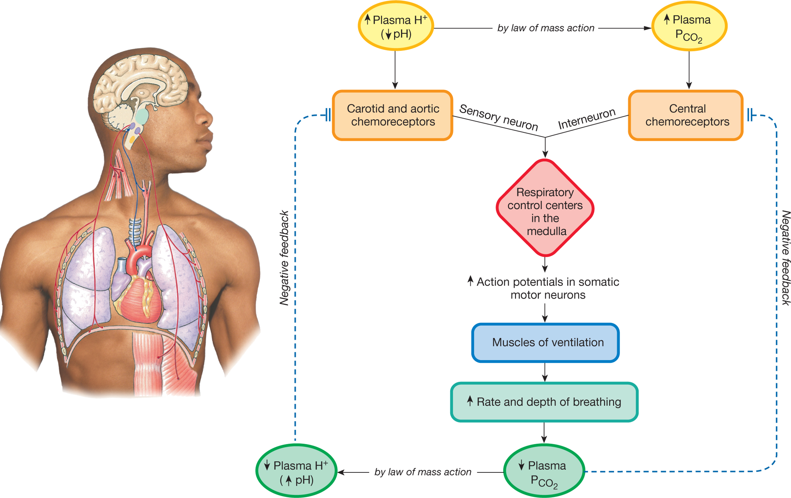

Image: D.U. Silverthorn. Human Physiology, An Integrated Approach.

    

    

The chemoreceptors sense blood carbon dioxide and pH, and blood oxygen.

As chemoreceptors sense blood pH, and communicate to the respiratory system, they can feedback to control pH by altering minute ventilation to alter lung and thus blood partial pressure of carbon dioxide.

    

--
### Acid-Base Balance
#### Respiratory compensation

The chemoreceptors sense blood carbon dioxide and pH, and blood oxygen.

As chemoreceptors sense blood pH, and communicate to the respiratory system, they can feedback to control pH by altering minute ventilation to alter lung and thus blood partial pressure of carbon dioxide.

**Blood tending alkalotic &rarr; Chemoreception &rarr; Respirtoary centre &rarr; Movement toward hypoventilation**

\begin{equation}
\class{fragment}{\textcolor{red}{\uparrow}}\mathrm{CO}_2 + \class{fragment}{\textcolor{blue}{\downarrow}}\mathrm{H}_2\mathrm{O} \rightleftharpoons \class{fragment}{\textcolor{red}{\uparrow}}\textcolor{blue}{\downarrow\mathrm{H}^+} + \class{fragment}{\textcolor{red}{\uparrow}}\mathrm{HCO}^{3-}
\end{equation}

--
### Acid-Base Balance
#### Respiratory compensation

The chemoreceptors sense blood carbon dioxide and pH, and blood oxygen.

As chemoreceptors sense blood pH, and communicate to the respiratory system, they can feedback to control pH by altering minute ventilation to alter lung and thus blood partial pressure of carbon dioxide.

**Blood tending acidotic &rarr; Chemoreception &rarr; Respirtoary centre &rarr; Movement toward hyperventilation**

\begin{equation}
\class{fragment}{\textcolor{blue}{\downarrow}}\mathrm{CO}_2 + \class{fragment}{\textcolor{red}{\uparrow}}\mathrm{H}_2\mathrm{O} \rightleftharpoons \class{fragment}{\textcolor{blue}{\downarrow}}\textcolor{red}{\uparrow\mathrm{H}^+} + \class{fragment}{\textcolor{blue}{\downarrow}}\mathrm{HCO}^{3-}
\end{equation}

--
### Acid-Base Balance
#### Hypoventilation and hyperventilation

If the cause of hypoventilation of hyperventilation is something other than a chemoreceptor feedback, then this will shift pH away from normal.

<b>Hypoventilation</b> (Lowers pH)

\begin{equation}
\textcolor{red}{\uparrow\mathrm{CO}_2} + \textcolor{blue}{\downarrow}\mathrm{H}_2\mathrm{O} \rightleftharpoons \textcolor{red}{\uparrow}\mathrm{H}^+ + \textcolor{red}{\uparrow}\mathrm{HCO}^{3-}
\end{equation}

<b>Hyperventilation</b> (Increases pH)

\begin{equation}
\textcolor{blue}{\downarrow\mathrm{CO}_2} + \textcolor{red}{\uparrow}\mathrm{H}_2\mathrm{O} \rightleftharpoons \textcolor{blue}{\downarrow}\mathrm{H}^+ + \textcolor{blue}{\downarrow}\mathrm{HCO}^{3-}
\end{equation}

--
### Acid-Base Balance
#### Metabolic compensation (kidneys)

Kidneys can slowly adjust blood pH through changing excretion or reaborption of:

1. H+ (directly alters blood pH).
2. HCO3- (bicarbonate buffer reaction).

--
### Acid-Base Balance
#### Metabolic compensation (kidneys). Tubule buffers.

    

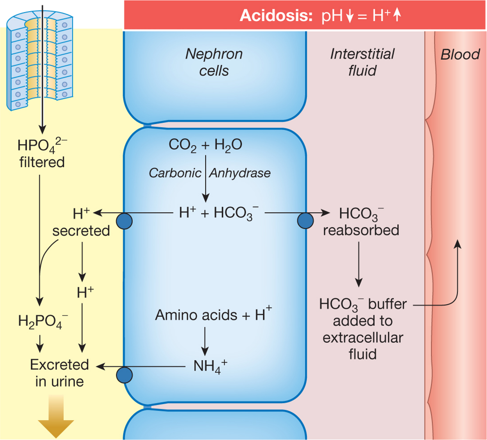

Image: D.U. Silverthorn. Human Physiology, An Integrated Approach.

    

    

<b>Blood tending acidotic...</b>

<ul>
    <li>H+ ions are secreted into the tubule.</li>
    <li>Phosphate ions (HPO42-) buffer the H+ ions 
    $$\mathrm{HPO}_4^{2-}+H^+ \rightleftharpoons \mathrm{H}_2\mathrm{PO}_4^-$$</li>
    <li>H+ and HPO42- excreted.
</ul>

With blood tending alkalotic, the degree to which this occurs is reduced.

<!-- 
Also...

<ul>
    <li>In the nephron, CO2 combines with water to form bicarbonate ions (bicarbonate reaction).</li>
    <li>Bicarbonate ions buffer H+ in blood.</li>
</ul> -->
    

--
### Acid-Base Balance
#### Metabolic compensation (kidneys). Proximal tubule secretes H+, reabsorbs HCO3-
Kidneys filter equivalent of around ½kg of baking soda (NaHCO3) every day.

Most of this is reabsorbed in the plasma to maintain its ability to buffer CO2.

There are two mechanisms that allow for this in the proximal tubule.

--
### Acid-Base Balance
#### Metabolic compensation (kidneys). Proximal tubule secretes H+, reabsorbs HCO3-

    

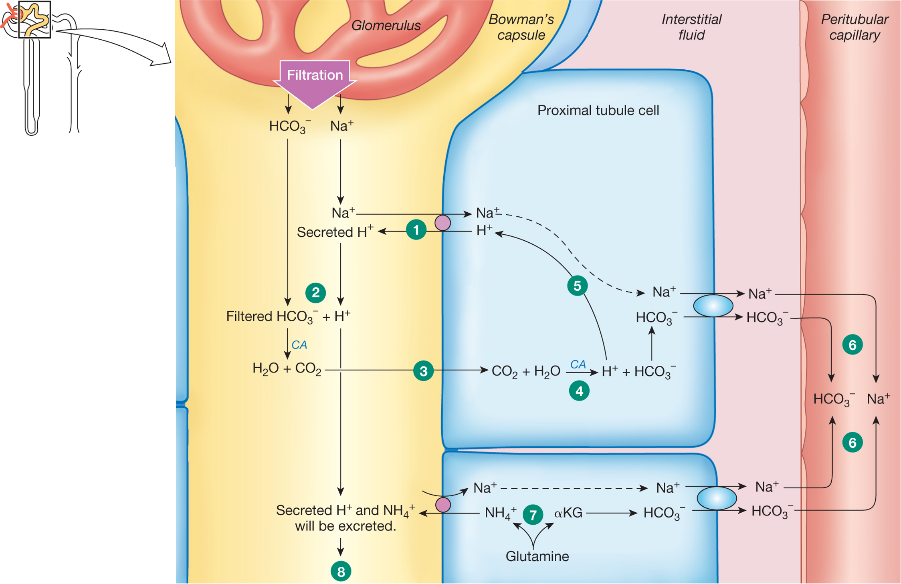

Image: D.U. Silverthorn. Human Physiology, An Integrated Approach.

    

    

1st proximal tubule mechanism:

<ol>
    <li>H+ <em>actively</em> secreted into the tubule in exchange for Na+.</li>
    <li>H+ buffered by HCO3- (bicarbonate reaction).</li>
    <li>Created CO2 diffuses into the tubule cell.</li>
    <li>CO2 now in the tubule cell combines with water to form HCO3- (bicarbonate reaction) then HCO3- moved to interstitium by Na+ symporter (6).</li>
</ol>
    

--
### Acid-Base Balance
#### Metabolic compensation (kidneys). Proximal tubule secretes H+, reabsorbs HCO3-

    

Image: D.U. Silverthorn. Human Physiology, An Integrated Approach.

    

    

2nd proximal tubule mechanism:

<ol start="7">
    <li>In the tubule cell, glutamine is metabolised, forming α-ketogluterate (α-KG). This is further metabolised into HCO3-. The HCO3- is then symported with Na+ into the interstitium.</li>
</ol>
    

--
### Acid-Base Balance
#### Metabolic compensation (kidneys). Distal nephron controls acid excretion

    

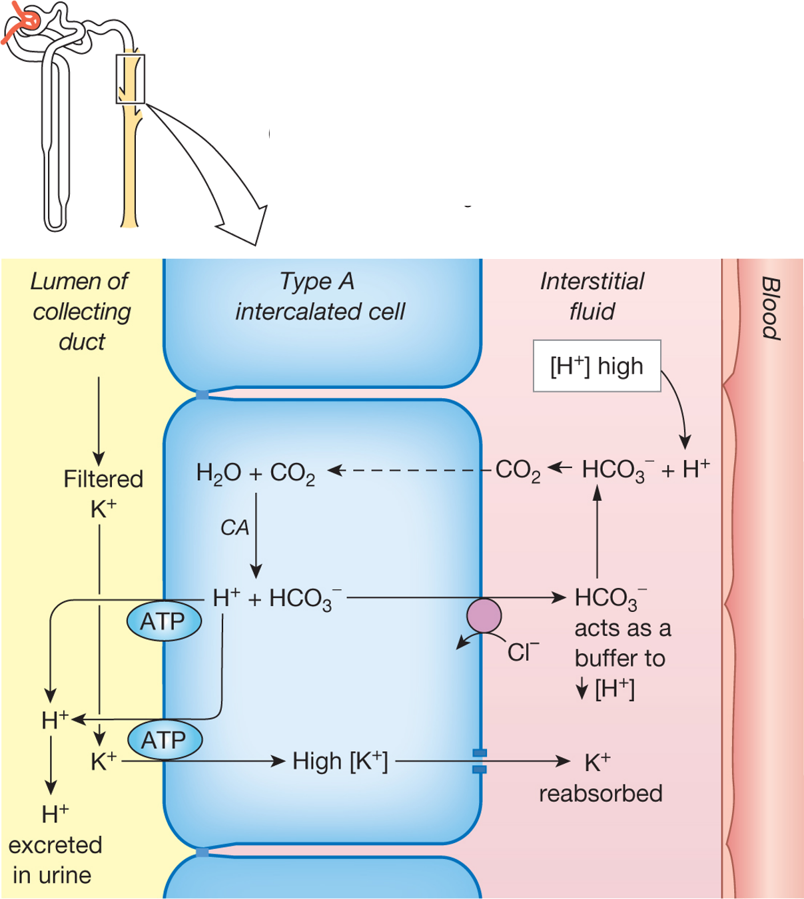

Image: D.U. Silverthorn. Human Physiology, An Integrated Approach.

    

    

<b>Type A intercalated cells. Compensation for acidosis.</b>

<ul>
    <li>H+ secretion.</li>
    <li>HCO3- reabsorption.</li>
</ul>
    

--
### Acid-Base Balance
#### Metabolic compensation (kidneys). Distal nephron controls acid excretion

    

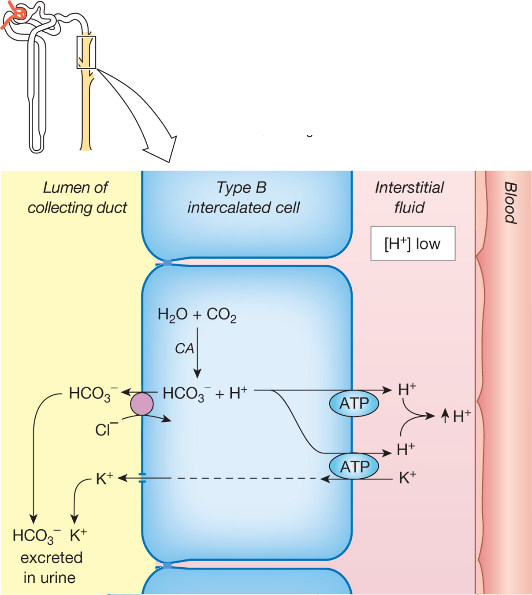

Image: D.U. Silverthorn. Human Physiology, An Integrated Approach.

    

    

<b>Type B intercalated cells. Compensatioan for alkalosis.</b>

<ul>
    <li>H+ reabsorbed.</li>
    <li>HCO3- secreted.</li>
</ul>
    

--
### Reflection quiz
#### Acid-base Balance.
#### Provide an overview of the respiratory and renal mechanisms of acid-base balance, including major buffering systems.

<a href="https://flux.qa/DA285K">flux.qa/DA285K</a>

<!-- #####################################LEARNING OBJECTIVE########################################### -->
---
<!-- .slide: data-auto-animate-restart -->
#### Learning objective
# Arterial Blood Gases
### Classify arterial blood gas results in terms of acid-base balance and compensation.

--
### Arterial Blood Gases
####
pH is a measure of the H+ concentration in a solution.

<table>
    <tr>
        <td style="text-align: center;">High H+ concentration</td>
        <td style="text-align: center;"></td>
        <td style="text-align: center;">Low H+ concentration</td>
    </tr><tr>
        <td style="text-align: center;">Acidic</td>
        <td style="text-align: center;">Neutral</td>
        <td style="text-align: center;">Basic</td>
    </tr>
    <tr>
        <td style="text-align: center;">pH < 7 </td>
        <td style="text-align: center;">pH = 7 </td>
        <td style="text-align: center;">pH > 7  </td>
    </tr>
</table>

--
### Arterial Blood Gases
####

For the human body:

<table>
    <tr>
        <td style="text-align: center;">High H+ concentration</td>
        <td style="text-align: center;"></td>
        <td style="text-align: center;">Low H+ concentration</td>
    </tr><tr>
        <td style="text-align: center;">Acidosis</td>
        <td style="text-align: center;">Normal</td>
        <td style="text-align: center;">Alkalosis</td>
    </tr>
    <tr>
        <td style="text-align: center;">pH < 7.38 </td>
        <td style="text-align: center;">pH between 7.38 and 7.42 </td>
        <td style="text-align: center;">pH > 7.42  </td>
    </tr>
</table>

- pH changes can denature proteins or change their function.
- Abnormal pH affects the nervous system...
    - Acidosis:  Neurons become less excitable; central nervous system depression.
    - Alkalosis: Neurons become hyperexcitable; severe can lead to muscle tetanus.
- pH disturbances are also associated with K+ disturbances.

--
### Arterial Blood Gases
#### Acid-base disturbances

**Respiratory acidosis**: hypoventilation &rarr; 🡅PCO2 &rarr; 🡇pH

**Metabolic acidosis**: dietary and/or metabolic H+ exceeds excretion &rarr; 🡇 pH

**Respiratory alkalosis**: hyperventilation &rarr; 🡇PCO2 &rarr; 🡅pH

**Metabolic alkalosis**: loss of H+ through excessive vomiting or excessive ingestion of bicarbonate-containing antacids &rarr; 🡅pH

--
### Arterial Blood Gases
#### Acid-base disturbances

<table>
    <tr>
        <th>disturbance</th>
        <th style="width: 100px;">PCO2</th>
        <th style="width: 100px;">H+</th>
        <th style="width: 100px;">pH</th>
        <th style="width: 100px;">HCO3-</th>
    </tr><tr>
        <td>respiratory acidosis</td>
        <td>🡅</td>
        <td>🡅</td>
        <td>🡇</td>
        <td>🡅</td>
    </tr>
    <tr>
        <td>metabolic acidosis</td>
        <td>normal or 🡇</td>
        <td>🡅</td>
        <td>🡇</td>
        <td>🡇</td>
    </tr>
    <tr>
        <td>respiratory alkalosis</td>
        <td>🡇</td>
        <td>🡇</td>
        <td>🡅</td>
        <td>🡇</td>
    </tr>
    <tr>
        <td>metabolic acidosis</td>
        <td>normal or 🡅</td>
        <td>🡇</td>
        <td>🡅</td>
        <td>🡅</td>
    </tr>
</table>

--
### Arterial Blood Gases
#### Acid-base compensation

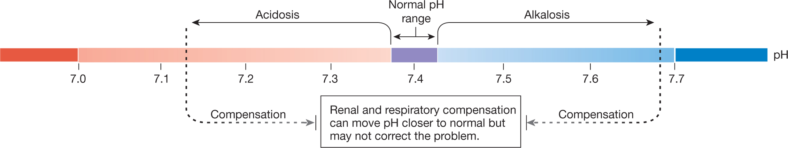

- Partial compensation: function of the kidney and/or respiratory system shift pH back toward normal, but not all the way back to normal.

- Full compensation: function of the kidney and/or respiratory system shift pH back into the normal range.

Image: D.U. Silverthorn. Human Physiology, An Integrated Approach.

--
###  Arterial blood gases
#### Tic-tac-toe
Rules:
- Two in a column indicates that condition.
- No compensation if odd one out is in normal column.
- Partial compenation if odd one out is in opposite column, but pH is still abnormal.
- Full compensation if pH is normal. 

<table>
    <tr>
        <td></td>
        <td>normal range</td>
        <td>patient</td>
        <th>acidosis</th>
        <th>normal</th>
        <th>alkalosis</th>
    </tr><tr>
        <td>pH</td>
        <td>7.35-7.45</td>
        <td>7.5</td>
        <td></td>
        <td></td>
        <td>╳</td>
    </tr><tr>
        <td>pCO2 (mmHg)</td>
        <td>35-45</td>
        <td>25</td>
        <td></td>
        <td></td>
        <td>╳</td>
    </tr><tr>
        <td>[HCO3-] (mEq/L)</td>
        <td>22-26</td>
        <td>19</td>
        <td>╳</td>
        <td></td>
        <td></td>
    </tr>
</table>

Respiratory alkalosis, partially compensated.

--
###  Arterial blood gases
#### Tic-tac-toe
Rules:
- Two in a column indicates that condition.
- No compensation if odd one out is in normal column.
- Partial compenation if odd one out is in opposite column, but pH is still abnormal.
- Full compensation if pH is normal. 

<table>
    <tr>
        <td></td>
        <td>normal range</td>
        <td>patient</td>
        <th>acidosis</th>
        <th>normal</th>
        <th>alkalosis</th>
    </tr><tr>
        <td>pH</td>
        <td>7.35-7.45</td>
        <td>7.47</td>
        <td></td>
        <td></td>
        <td>╳</td>
    </tr><tr>
        <td>pCO2 (mmHg)</td>
        <td>35-45</td>
        <td>43</td>
        <td></td>
        <td>╳</td>
        <td></td>
    </tr><tr>
        <td>[HCO3-] (mEq/L)</td>
        <td>22-26</td>
        <td>32</td>
        <td></td>
        <td></td>
        <td>╳</td>
    </tr>
</table>

Metabolic alkalosis, uncompensated.

--
###  Arterial blood gases
#### Tic-tac-toe
Rules:
- Two in a column indicates that condition.
- No compensation if odd one out is in normal column.
- Partial compenation if odd one out is in opposite column, but pH is still abnormal.
- Full compensation if pH is normal. 

<table>
    <tr>
        <td></td>
        <td>normal range</td>
        <td>patient</td>
        <th>acidosis</th>
        <th>normal</th>
        <th>alkalosis</th>
    </tr><tr>
        <td>pH</td>
        <td>7.35-7.45</td>
        <td>7.37</td>
        <td></td>
        <td>╳</td>
        <td></td>
    </tr><tr>
        <td>pCO2 (mmHg)</td>
        <td>35-45</td>
        <td>27</td>
        <td></td>
        <td></td>
        <td>╳</td>
    </tr><tr>
        <td>[HCO3-] (mEq/L)</td>
        <td>22-26</td>
        <td>19</td>
        <td>╳</td>
        <td></td>
        <td></td>
    </tr>
</table>

Fully compensated metabolic acidosis (pH more acidotic (pH<7.4) but within normal range).

Check this week's online module for further ABG tic-tac-toe instruction and examples.
