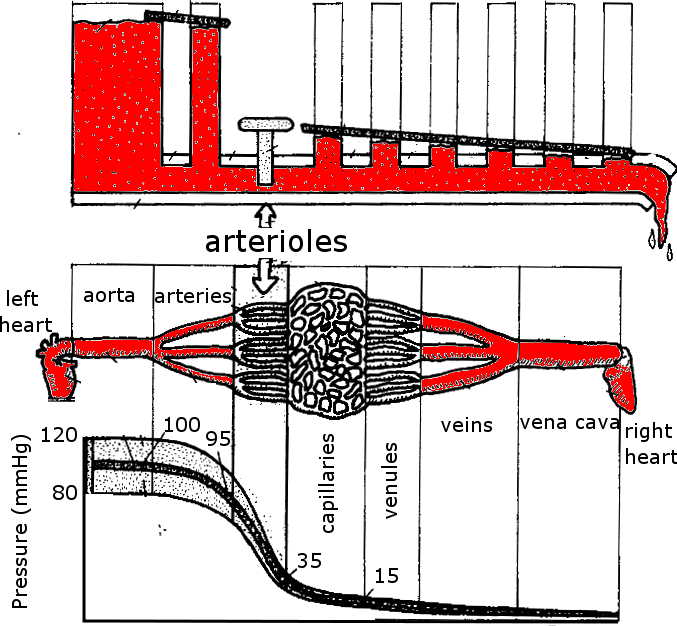
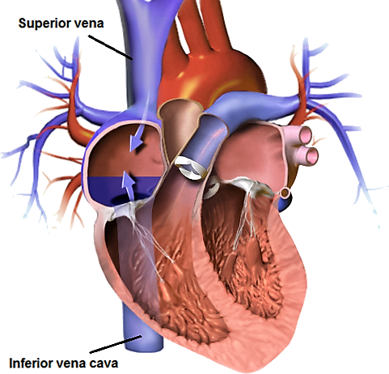
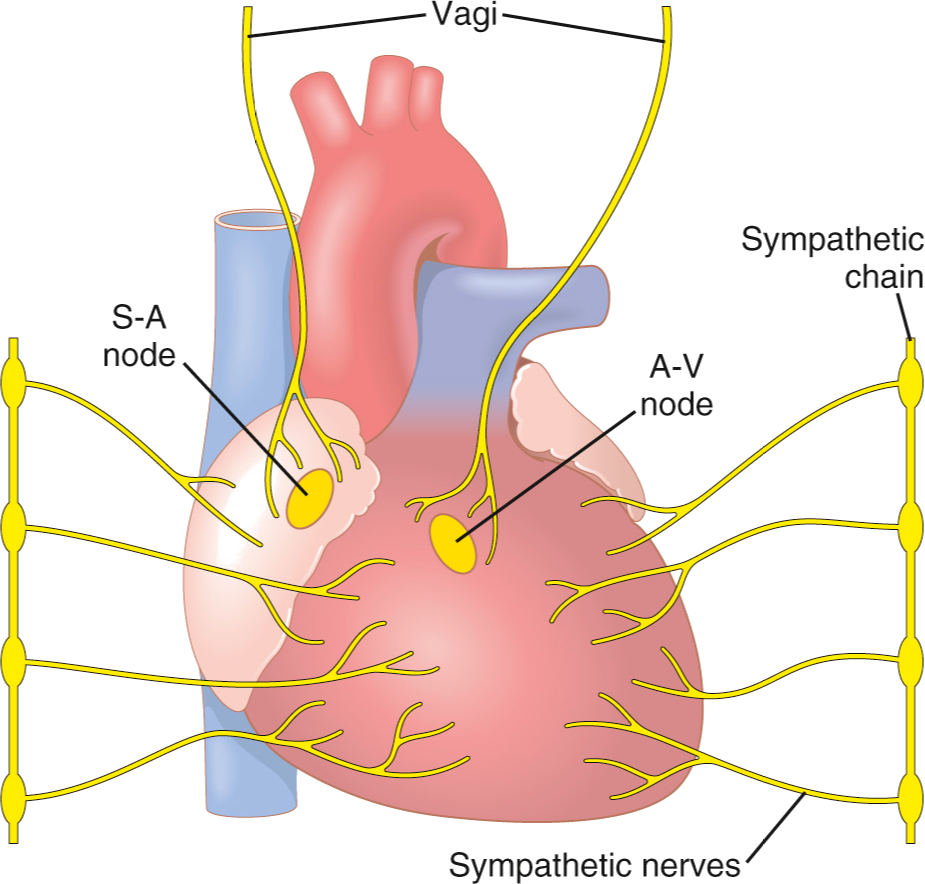
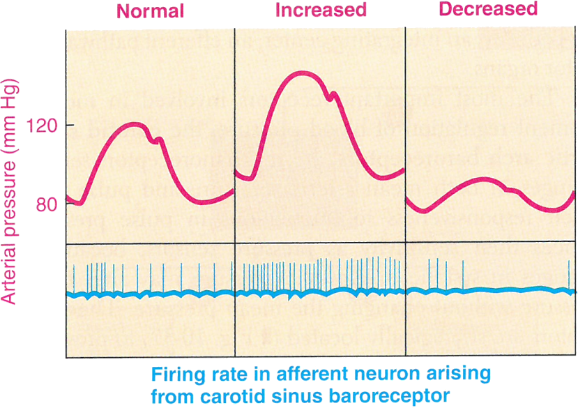
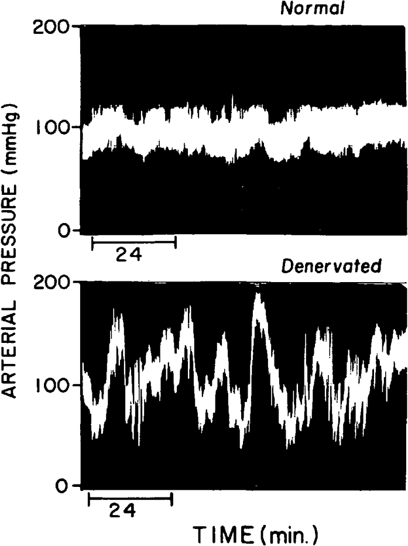
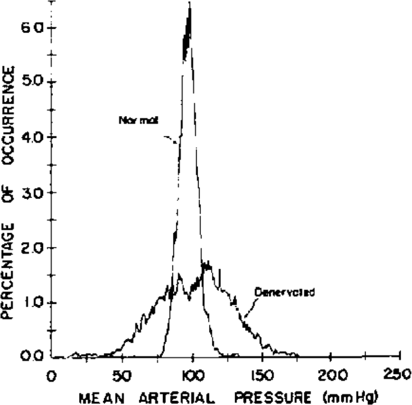
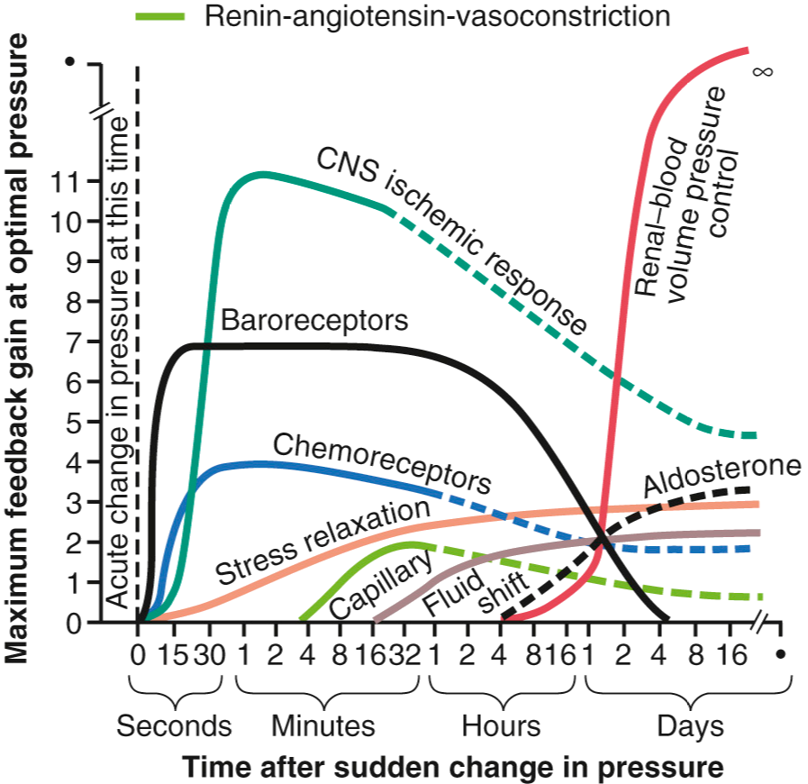

<!-- .slide: id="MEDI2101Wk12" -->
#### MEDI8100 Applied Medical Science 1
### Week 5: Cardiovascular II
# Control of blood flow and blood pressure: autonomic and hormonal control
##### Dr Mark Butlin (PhD, BE, SFHEA) (he/him)

Macquarie Medical School, Faculty of Medicine, Health and Human Sciences Macquarie University. On the land of the Wallumattagal clan of the Dharug Nation.

---

## LO1 Distinguish between systolic pressure, diastolic pressure, pulse pressure, and mean arterial pressure.

--

### Distinguish between systolic pressure, diastolic pressure, pulse pressure, and mean arterial pressure
####

--
### Distinguish between systolic pressure, diastolic pressure, pulse pressure, and mean arterial pressure</h3>
####

&nbsp;

Avolio AP, Butlin M, Walsh A. Arterial blood pressure measurement and pulse wave analysis–their role in enhancing cardiovascular assessment. 2010; 31 : R1–47.

<aside class="notes">The major waveform features of the blood pressure waveform in the aorta (left) and brachial or radial artery (right). Note that the incisura in the aortic waveform (caused by the closing of the aortic valve) is co-incident in approximate timing with the dichrotic notch in the radial waveform, even though the dichrotic notch is *not* caused by the closing of the aortic valve.
</aside>

--
### Distinguish between systolic pressure, diastolic pressure, pulse pressure, and mean arterial pressure</h3>
####

$$ \mathrm{pulse~pressure} =\mathrm{systolic~pressure}-\mathrm{diastolic~pressure} $$

$$ \mathrm{mean~pressure}  = \mathrm{area~under~the~curve} $$

$$ \mathrm{mean~pressure} \approx \mathrm{diastolic~pressure} + \dfrac{1}{3}\mathrm{pulse~pressure} $$

--
<!--  .element: height=30px -->
<!--          
        </section>

        <section data-auto-animate>
          
When would we need the 1/3rd rule to calculate mean pressure?

          <aside class="notes">When we measure blood pressure with a cuff (using ausculation (stethoscope method) or oscillometry (automatic devices) we only have a value of systolic and diastolic blood pressure. Mean pressure is unknown. We can estimate the mean pressure using the systolic and diastolic pressure.</aside>
        </section> 

        <section data-auto-animate>
          
When would we not need the 1/3rd rule to calculate mean pressure?

          <aside class="notes">When we are unable to get the pulse waveform. If we have an invasive line we can get the pulse waveform and can calculate the real mean and not have to estimate it using the diastolic and systolic pressure.</aside>
        </section> 
	</section>
-->

---
## LO2: Discuss how blood pressure changes throughout the cardiovascular system

--
### LO2: Discuss how blood pressure changes throughout the cardiovascular system
####

<!--  -->

<aside class="notes">Blood pressure is not (cannot be) the same throughout the vasculature. A decrease in mean pressure as we move distal to the heart is required as it is the pressure difference between two sites that drives blood flow. This diagram shows the typical decrease in mean arterial pressure in the systemic circulation as we move away from the heart. An often unexpected (but always present) feature is that systolic pressure is higher in the brachial artery (large arteries) than in the aorta. This is due to wave reflection augmenting the waveform in the large arteries, but to a lesser extent at the aorta.</aside>

---
## LO3: Describe factors that regulate blood flow

--

<!--	<section data-auto-animate data-notes="Liquids and gases will move from an area of high pressure to an area of low pressure. This bulk flow is the driving mechanism behind movement of blood through the arteries.">
			<h3 class="title">LO3: Describe factors that regulate blood flow</h3>
			<h4 class="subtitle"></h4>

			
Blood flows due to a pressure gradient. That is, a fluid (liquid or gas) will travel from a region of higher pressure to a region of lower pressure.

			
		
			
<a class='citation' href="https://sites.psu.edu/musingsofameteorologist/2013/02/05/how-does-air-move/">sites.psu.edu (2020)</a></h6>
		</section>

		<section data-auto-animate>
			<h3 class="title">LO3: Describe factors that regulate blood flow</h3>
			<h4 class="subtitle"></h4>
			
			$$\mathrm{flow} = \dfrac{P_1 - P_2}{\mathrm{resistance}}$$
			

			
For those that have done a little physics, you may recognise this from electrical work and Ohm's law:

			\begin{aligned}
			V &= I\cdot R~~\mathrm{or}\\
			I &= \dfrac{V}{R}\\
			\mathrm{flow} &= \dfrac{\mathrm{potential~difference~or~pressure~difference}}{\mathrm{resistance}}
			\end{aligned}
			

		</section>

		<section data-auto-animate>
			<h3 class="title">LO3: Describe factors that regulate blood flow</h3>
			<h4 class="subtitle"></h4>
			
			$$\mathrm{flow} = \dfrac{P_1 - P_2}{\mathrm{resistance}}$$
			
			
			
			$$\mathrm{resistance}\propto \dfrac{1}{\mathrm{radius}^4}$$
			

			
Example: If we halve the radius of a vessel, we increase resistance by $2^{4}=16$, resulting in $1/16^{th}$ of the flow.

		</section>

		<section data-auto-animate data-notes="This means that a change in radius has a dramatic effect on resistance.">
			<h3 class="title">LO3: Describe factors that regulate blood flow</h3>
			<h4 class="subtitle">Resistance ($R$) and corollary of Poiseuille's Law</h4>
			
			$$R = \dfrac{8\mu L}{\pi r^4}$$
			

			
where:

			<ul>
				<li> $\mu$ fluid viscosity </li>
				<li> $L$ length of tube </li>
				<li> $r$ radius of the tube </li>
			</ul>

			
The important thing to remember: resistance is directly proportional to the length of the tube, and inversely proportional to the fourth power of radius.

		</section>

		<section data-auto-animate data-notes="Flow is proportional to the pressure difference. If we consider the venous system near atmospheric pressure (0 mmHg, though actually pressure in the venous system is a little higher than this), then the driving force for blood flow is the arterial pressure minus 0 mmHg. Sympathetic stimulation changes the resistances of vessels. Increased resistance decreases flow and decreased resistance increases flow. The pressure at which there is zero flow is called the critical closing pressure (this is more applicable in the intracrannial space.">
			<h3 class="title">LO3: Describe factors that regulate blood flow</h3>
			<h4 class="subtitle"></h4>

			

			
			
			

			<table class="width:100%">
			<tr>
				<td>
			$$\mathrm{flow} = \dfrac{P_{\mathrm{arterial}} - P_{\mathrm{venous}}}{\mathrm{resistance}}$$
			</td><td>
			
To increased blood flow:

			<ul>
			<li>increases arterial pressure</li>
			<li>increases vessel radius, decreasing resistance, increasing flow.</li>
			</ul>
			</td></tr>
			</table>
		</section>

		<section data-auto-animate data-notes="Flow is driven by a pressure difference between two regions. Therefore, blood will flow from the aorta, to the arteries, to the arterioles, to the capillaries, to the venules, to the veins, then to the vena cava as pressure gets
		lower and lower as we travel through the systemic vasculature. The arterioles have highly variable resistance, and therefore can regulate the pressure drop, and thus blood flow across this segment.">
			<h3 class="title">LO3: Describe factors that regulate blood flow</h3>
			<h4 class="subtitle"></h4>

			
			
			<h6 class="citation">Medical Colouring in Book</h6>
		</section>
	</section>
-->

---
##  LO4: Describe the factors that determine mean arterial pressure and systemic vascular resistance

--

<!--
		<section data-auto-animate>
			<h3 class="title">LO4: Describe the factors that determine mean arterial pressure and systemic vascular resistance</h3>
			<h4 class="subtitle"></h4>

		\begin{eqnarray}
		\mathrm{mean~arterial~pressure} & = & \mathrm{cardiac~output} \times \\
		& & \mathrm{total~peripheral~resistance}\\
		MAP & = & CO \times TPR
		\end{eqnarray}
		
		
		\begin{eqnarray}
		CO & = & \mathrm{heart~rate} \times \mathrm {stroke~volume} \\
		& = & HR \times SV
		\end{eqnarray}

		
		\begin{equation}
		MAP = HR \times SV \times TPR
		\end{equation}
		
		</section>

		<section data-auto-animate="">
			<h3 class="title">LO4: Describe the factors that determine mean arterial pressure and systemic vascular resistance</h3>
			<h4 class="subtitle"></h4>
			$$MAP = HR \times SV \times TPR$$

			
				$$R = \dfrac{8\mu L}{\pi r^4}$$
			

			
Factors determining blood pressure and total peripheral resistance are anything that changes:

			

				<ul class="fragment fade-out" data-fragment-index="1">
					<li>heart rate</li>
					<ul>
						<li>sympathetic / parasympathetic input</li>
						<li> chronotropic exogenous drugs e.g. $\beta$-blockers</li>
					</ul>
				</ul>
				<ul class="fragment current-visible" data-fragment-index="1">
					<li>stroke volume</li>
					<ul>
						<li>sympathetic input</li>
						<li> pre-load / after-load</li>
						<li> inotropic exogenous drugs e.g. dobutamine</li>
					</ul>
				</ul>
				<ul class="fragment" data-fragment-index="2">
					<li>vascular smooth muscle tone, changing vessel diameter,
					changing resistance</li>
					<ul>
						<li>sympathetic input</li>
						<li>vasoconstrictors / vasodilators</li>
					</ul>
				</ul>
			

		
		</section>
	</section>

	<section>
		<section data-auto-animate>
			<h1 class="titleslide">MEDI8100: Applied Medical Science 1</h1>

			
Guest lecture

			<h2>Control of blood flow and blood pressure: autonomic and hormonal control</h2>
			<h3>Part 1</h3>

			
Dr Mark Butlin (PhD, BE, SFHEA)

		</section>
	</section>

	<section>
		<section data-auto-animate>
			<h1 class="titleslide">MEDI8100: Applied Medical Science 1</h1>
		
			
Guest lecture

		
			<h2>Control of blood flow and blood pressure: autonomic and hormonal control</h2>
			<h3>Part 2</h3>
		
			
Dr Mark Butlin (PhD, BE, SFHEA)

		</section>

		<section data-auto-animate>
			<h1 class="titleslide">MEDI8100: Applied Medical Science 1</h1>
			<h4 class="subtitle">Part 1</h3>
				<h4 class="subtitle">LO1: Distinguish between systolic pressure, diastolic pressure, pulse pressure, and mean
					arterial pressure</h4>
				<h4 class="subtitle">LO2: Discuss how blood pressure changes throughout the cardiovascular system</h4>
				<h4 class="subtitle">LO3: Describe factors that regulate blood flow</h4>
				<h4 class="subtitle">LO4: Describe the factors that determine mean arterial pressure and systemic vascular
					resistance</h4>
				<h4 class="subtitle">Part 2</h4>
				<h4 class="subtitle">LO5: Explain the mechanisms that regulate blood pressure - neural mechanisms and hormonal
					mechanisms</h4>
		</section>
	</section>

-->

---
## LO5: Explain the mechanisms that regulate blood pressure - neural mechanisms and hormonal mechanisms

--

<!--	<section data-auto-animate data-notes="It is not possible to do this learning outcome true service in the time available. A brief overview is provided here. It is highly recommended that you consult the Guyton \& Hall textbook (available on-line through the library). Guyton was a cardiovascular physiologist and that strength is apparent in the general medical textbook.">
			<h3 class="title">LO5: Mechanisms that
			regulate blood pressure - neural and hormonal</h3>
			<h4 class="subtitle"></h4>

			

			<h6 class="citation">Hall, J. E. (2015). Guyton and Hall Textbook of Medical
			Physiology. <a href="https://multisearch.mq.edu.au/permalink/61MACQUARIE_INST/467l3g/cdi_askewsholts_vlebooks_9780323389303">MQ Library link</a></h6>
		</section>
		
		<section data-auto-animate data-notes="When thinking of venous return, it is usually referring to return of blood from the systemic vasculature via the inferior and superior vena cava to the right heart. However, this same flow must logically also return to the left heart after travelling through the pulmonary circulation.">
			<h3 class="title">LO5: Mechanisms that 			regulate blood pressure - neural and hormonal</h3>
			<h4 class="subtitle">Altered venous return to the heart</h4>
			
			<h6 class="citation">Modified from BruceBlaus, <a href="https://commons.wikimedia.org/wiki/File:Vena_Cava-ar.png">https://commons.wikimedia.org/wiki/File:Vena_Cava-ar.png</a></h6>
		</section>

		<section data-auto-animate>
			<h3 class="title">LO5: Mechanisms that regulate blood pressure - neural and hormonal</h3>
			<h4 class="subtitle">Altered venous return to the heart</h4>
			\begin{align}
			\mathrm{venous~return} &= \dfrac{P_1 - P_2}{\mathrm{resistance}}\\
			&= \dfrac{\mathrm{venous~pressure} -
			\mathrm{right~atrial~pressure}}{\mathrm{venous~resistance}}
			\end{align}
		</section>

		<section data-auto-animate>
			<h3 class="title">LO5: Mechanisms that regulate blood pressure - neural and hormonal</h3>
			<h4 class="subtitle">Altered venous return to the heart</h4>
			
Venous return can be increased through a number of mechanisms:

			<ul>
			<li>respiratory pump</li>
			<li>skeletal muscle pump</li>
			<li>abdominal compression reflex</li>
			<li>sympathetic stimulation of the systemic veins</li>
			</ul>
		</section>

		<section data-auto-animate>
			<h3 class="title">LO5: Mechanisms that regulate blood pressure - neural and hormonal</h3>
			<h4 class="subtitle">Altered venous return to the heart</h4>
			
Changes in venous return alter arterial blood pressure through:

			<ul>
				<li>Frank-Starling law of the heart: Alters cardiac stroke volume</li>
				<li>Atrial reflex: The Bainbridge Reflex that alters heart rate and cardiac contractility</li>
				<li>Atrial reflex: The Volume Reflex altering blood volume</li>
				<li>Atrial natriuetic peptide: Promotes the loss of salt and water though the kidneys, reducing blood volume</li>
				<li>Atrial and pulmonary artery stretch receptors
					(cardiopulmonary baroreceptors)</li>
			</ul>
		</section>

		<!--

% <h5>Respiratory pump (a.k.a. thoracic pump)}
% <ul>
% <li>[inspiration]~
% <ul>
% <li>decreased intrathoracic pressure $\rightarrow$ decreased
right atrial pressure
% <li>increased abdominal pressure $\rightarrow$ increased
inferior vena cava blood pressure
% <li>increased $venous~pressure - right~atrial~pressure$,
therefore more blood flow to the heart
% </ul>
% <li>[expiration]~
% <ul>
% <li>increased intrathoracic pressure $\rightarrow$ increased
pulmonary venous pressure
% <li>increased blood flow to the left side of the heart
% </ul>
% </ul>
% \end{block}

% \pause
% Therefore, an increase in respiration = increased venous
return to the heart.

% \url{https://www.youtube.com/watch?v=RVYKlsoEEMU}
% \end{frame}

% % \begin{frame}
% % \movieslide{respiratorypump.mp4}
% % {0.96\linewidth}
% % {0.72\linewidth}
% % {Animated description of the respiratory pump.}
% % {\url{https://www.youtube.com/watch?v=RVYKlsoEEMU}}
% % {respiratorypump}
% % \end{frame}

% \only<presentation>{
%
{\usebackgroundtemplate{\includegraphics[width=\paperwidth]{BPRespiratoryWavesRat}}
% \frame[plain]{}
% }
% }

% \begin{frame}
% \startsubframe
% \begin{columns}
% \column{0.6\textwidth}
% <h5>Skeletal muscle pump}
% Mechanism of increased venous return during movement (especially \emph{dynamic} (not isometric) exercise). \only <presentation>{\\~\\}Skeletal muscle oscillates pressure in the veins with retrograde flow of blood prevented by the
valves within the veins.
% \end{block}
% \column{0.4\textwidth}
% \graphic{skeletalmusclepump}{1}
% {width = \columnwidth}
% {width = 0.75\textwidth}
% {The skeletal muscle pump is able to work largely due to the valves in the veins. During skeletal muscle contraction (and shortening), the veins are compressed, increasing local pressure and increasing flow. When the skeletal muscle relaxes and pressure drops, retrograde flow of blood is prevented by the valves in the veins.}
% {OpenStax College, Anatomy \& Physiology, Connexions
Web site. \url{http://cnx.org/content/col11496/1.6/}}
% \end{columns}
% \end{frame}

% <section data-auto-animate>
% \startsubframe%
% <h5>Abdominal compression reflex}
% Central nervous system output can cause skeletal muscle contraction, especially abdominal muscle.

% This compresses venous reservoirs, increasing effective blood volume and venous return to the heart.
% \end{block}

% Evidence for this mechanism: if the majority of skeletal muscle is fundamentally inactive (e.g. people who are paralysed), hypotensive (systemic blood pressure drop) episodes are much more frequent\footnote{Guyton and Hall Textbook of Medical Physiology.}.
% }

% \only<article>{\clearpage}
% <section data-auto-animate>
% \startsubframe
% <h5>Sympathetic stimulation of systemic
veins}
% The venous system is a large reservoir of blood volume. Vasoconstriction of the veins increases the effective blood volume in the arterial system and also increases return of blood to the heart.
% \end{block}
% }

% <section data-auto-animate>\startsubframe
% \graphic{blood_distribution}{1}
% {width = \textwidth}
% {width = \textwidth}
% {When at rest, the majority of the blood at any one time resides in the systemic veins. The veins have a very high capacitance to accommodate this. Veins also have smooth muscle and can contract (due to signals received by the central nervous system that result in increased sympathetic outflow) in order to distribute some this blood volume into the pulmonary vasculature and systemic arteries in order to increase blood flow and oxygenation of blood.}
% {Created for MEDI2101}
% }

% \begin{frame}
% \startsubframe
% By shifting some of the blood volume from the
venous to the arterial system it will increase
pressure:

% \begin{equation}
% systemic~arterial~pressure \propto
systemic~arterial~volume
% \end{equation}

% \pause
% Increasing arterial pressure will increase
arterial blood flow:

% \begin{equation}
% flow = \dfrac{arterial~pressure -
venous~pressure}{total~peripheral~resistance}
% \end{equation}
% \end{frame}

% \begin{frame}
% \startsubframe
% <h5>The effect of gravity, and
hydrostatic pressure}
% The fluid (e.g. blood) in our body can move in response to gravity. This is especially true of blood under low pressure (i.e. venous blood). \only
<presentation>{\\~\\}As the venous system is very compliant, a change in body position can alter the distribution of blood if there is change in the hydrostatic pressure (height of the column of fluid). 
\only<article>{When standing, there is a greater hydrostatic pressure (greater weight of the fluid) toward the feet than there is closer to the heart. This means that when we stand, the compliant venous system is more distended, and there is an increased blood volume in the lower extremities. This also impacts on venous return of blood to the heart, as the flow of blood must overcome the hydrostatic pressure within the column of fluid that is the veins.}
% \end{block}
% \end{frame}

% \subsubsection[Explain the length-tension
relationship within cardiac muscle
(Frank-Starling Curve, changing stroke
volume).]{Frank-Starling Law of the heart
(changing stroke volume)}
% <section data-auto-animate>
% \startsubframe
% Covered in previous lecture.
% }
% <section data-auto-animate>\startsubframe
% <h5>Definition: Frank-Starling
mechanism of the heart}
% An increase in the return of blood from the venous system (venous return) causes a greater volume of blood in the ventricle at the end of diastole (end diastolic volume), in turn increasing the contraction force of the heart muscle fibers (cardiac contractility), and therefore the greater the stroke volume and cardiac output.
% \end{block}
% }

% <section data-auto-animate>\startsubframe
% \graphic{FrankStarling}{1}%
% {height=0.8\textheight}{width=\textwidth}%
% {Frank-Starling mechanism of the heart. At low diastolic volumes, a small change in end diastolic volume results in a larger change in stroke volume (and cardiac output) than the same change in diastolic volume at high diastolic volumes.}%
% {}%
% }

% \begin{frame}
% <h5>What is cardiac
contractility?}
% Describes the strength of contraction of
the myocardial fibres. \only<presentation>
{\\~\\}The greater the contraction, the
lower the end systolic volume, and the
greater the stroke volume (therefore,
greater cardiac output).
% \end{block}

% \graphic{LV_volume}{1}
% {height = 0.4\textheight}
% {width = 0.6\textwidth}
% {(A) end diastolic volume and (B) end systolic volume. Increased cardiac contractility decreases end systolic volume, therefore increasing stroke volume (stroke volume = end diastolic volume - end systolic volume).}
% {}
% \end{frame}

% \subsubsection{Atrial reflex: The
Bainbridge Reflex that alters heart rate
and cardiac contractility}
% <section data-auto-animate>
% \startsubframe

% <ul>
% <li>Response to increase venous
pressure (transmitted to the right
atrium, distending the atrium)
% <li>Activates the venoatrial stretch
receptors.
% <li>Transmits along the vagus nerve
to the central nervous system, feeding
back to the heart through the
sympathetic and parasympathetic system.
% <li>An \emph{increase} in atrial
pressure causes an \emph{increase} in
cardiac contractility and an
\emph{increase} in heart rate.
% </ul>
% }

% <section data-auto-animate>
% \startsubframe
% <h5>}
% The Bainbridge reflex can cause about
a 40 to 60\% increase in heart rate in
response to increased atrial pressure.

% An additional 15\% increase in heart
rate in response to increased atrial
pressure can be due to direct stretching
of the sinus node, increasing the
pacemaker rate.
% \end{block}
% }

% \subsubsection{Atrial reflex: The
Volume Reflex altering blood volume}
% <section data-auto-animate>
% \startsubframe
% <ul>
% <li>Stretch of the atria feeds
through to the:
% <ul>
% <li>kidney afferent arterioles
instigating dilation.
% <li>hypothalamus decreasing
antidiuretic hormone.
% </ul>
% </ul>

% <h5>$\downarrow$ kidney
afferent arteriolar resistance}
% $\uparrow$ glomerular capillary
pressure $\rightarrow$~$\uparrow$
filtration of fluids in kidney tubules
% \end{block}

% <h5>$\downarrow$
antidiuretic hormone}
% $\downarrow$ reabsorption of water
from tubules
% \end{block}

% <ul>
% <li>Both mechanisms increase fluid loss (via the kidneys), decreasing blood volume.
% </ul>
% }

% <section data-auto-animate>\startsubframe
% <h5>Atrial natriuetic
peptide}
% Not grouped under the Volume Reflex, but also is a heart mechanism of controlling blood volume:
% <ul>
% <li>Released by cells in the atria of the heart in response to distension of the atria (stretching of the atrial
myocytes).
% <li>Promotes the loss of salt and water though the kidneys, reducing blood volume.
% <li>Also causes vasodilation (decrease in total peripheral resistance).
% </ul>
% \end{block}
% }

% \subsubsection{Atrial and pulmonary artery stretch receptors (cardiopulmonary baroreceptors)}
% <section data-auto-animate>
% \startsubframe

% The atria and pulmonary artery contain stretch receptors. \only<presentation>{\\~\\}As pressure increases within an
	artery (or atrium), the vessel (or atrium) will stretch. \only<presentation>{\\~\\}Therefore, these stretch
		receptors are called baroreceptors (baro = pressure\only<article>{, as in barometric}). \only<presentation>
				{\\~\\}The stretch receptors in the atrium and pulmonary artery are known specifically as
				\emph{cardiopulmonary baroreceptors}.\only<article>{ This is distinct from what is termed, simply, ``the
					baroreceptors'' located in the aorta and carotid artery (Section \ref{sec:baroreceptors}).}

					% \pause
					% These receptors have a \textbf{negative feedback} to the central nervous system in response to
					vessel wall stretch as a result of increase/decrease in blood pressure.
					% }
				-->

<!-- <section data-auto-animate data-notes="Centers  that regulate the cardiovascular system are spread across the brain, though a large concentration of neurons controlling breathing and the cardiovascular system are centred in the lower brain, namely the medulla (5) and spinal cord (6)."> 		<h3 class="title">LO5: Mechanisms that regulate blood pressure - neural and hormonal</h3>
			<h4 class="subtitle">Cardiovascular sympathetic and parasympathetic stimulation</h4>

			
Central cardiorespiratory control: across the brain.

			
			
Important centres in the lower brain: (5) medulla (6) spinal cord.

			

			<h6 class="citation">By John A Beal, PhD, Dep't. of Cellular Biology & Anatomy, Louisiana State University Health Sciences Center -	Shreveport [CC BY 2.5], via Wikimedia Commons</h6>
		</section>

		<section data-auto-animate data-notes="This is vasomotor centre is not the motor cortex that controls skeletal muscle movement.	However, the motor cortex does communicate with the vasomotor centre, which is a pathway employed in exercise.">
-->

--
<!-- .slide: data-auto-animate -->
### LO5: Mechanisms that regulate blood pressure - neural and hormonal
#### Cardiovascular sympathetic and parasympathetic stimulation

    

        
    

    

        
Vasomotor centre of the brain:

			<ul>
				<li><b>vasoconstrictor area</b>, anterolateral portions of the rostral (roughly upper) medulla</li>
				<li><b>vasodilator area</b>, anterolateral portions of the caudal (roughly lower half) of the medulla</li>
				<li><b>sensory area</b>, nucleus tractus solitarius in the posterolateral portions of the medulla and lower pons, receives peripheral signals from the vagus and glossopharyngeal nerves.</li>
			</ul>
    

    

        
Guyton and Hall Textbook of Medical Physiology

    

--
<!-- .slide: data-auto-animate -->
### LO5: Mechanisms that regulate blood pressure - neural and hormonal
#### Cardiovascular sympathetic and parasympathetic stimulation

    

        
    

    

			
The vasomotor centre also regulates the heart.

				<ul>
					<li><b>sympathetic nerve fibres</b> extend from the lateral vasomotor centre.</li>
					<li><b>parasympathetic nerve fibres</b> extend from the medial vasomotor centre.</li>
				</ul>
				
Therefore the vasomotor centre has influence over heart rate and cardiac contractility, altering cardiac output.

			
			
				
These areas <em>process inputs</em> to invoke these functional responses. <em>They do not invoke these responses without an input.</em>

			
    

    

        
Guyton and Hall Textbook of Medical Physiology

    

--

--
<!--
		<section data-auto-animate>
			<h3 class="title">LO5: Mechanisms that regulate blood pressure - neural and hormonal</h3>
			<h4 class="subtitle">Sympathetic and parasympathetic nervous input to the heart</h4>
			
			

			

				<ul class="fragment fade-out" data-fragment-index="0">
					<li> Sympathetic stimulation:
						<ul>
							<li> $\uparrow$ from resting 60-70 bpm heart rate (HR) to as high as 180 or even 250 bpm.
							<li> increases cardiac contractility up to 200\% and therefore increase stroke volume
						</ul>
					<li> Sympathetic inhibition:
						<ul>
							<li> smaller decrease in HR from resting level
							<li> combined with decrease in cardiac contractility, can decrease cardiac output (CO) by about 30\% from
								normal.
						</ul>
				</ul>
						<ul class="fragment current-visible" data-fragment-index="0">
							<li> Strong parasympathetic (vagal) stimulation:
								<ul>
									<li> can stop the heartbeat for a few seconds
									<li> can reduce heart rate to 20 to 40 bpm
									<li> can reduce cardiac contractility by up to 20-30\%. Smaller than effect of sympathetic stimulation as
										vagal stimulation is mainly at the atria and less so in the ventricles.
								</ul>
						
						</ul>
			

			<h6 class="citation">Guyton and Hall Textbook of Medical Physiology.</h6>
		</section>

		<section data-auto-animate>
			<h3 class="title">LO5: Mechanisms that regulate blood pressure - neural and hormonal</h3>
			<h4 data-id="sub" class="subtitle">Sympathetic and parasympathetic nervous input to the heart</h4>
			$$CO=HR\times SV$$

			
			<h6 class="citation">Guyton and Hall Textbook of Medical Physiology</h6>
		</section>

		<section data-auto-animate>
			<h3 class="title">LO5: Mechanisms that regulate blood pressure - neural and hormonal</h3>
			<h4 data-id="sub" class="subtitle">Sympathetic and parasympathetic nervous input to peripheral arteries</h4>
			
Besides acting directly on the heart rate and cardiac contractility, the central nervous system (sympathetic and parasympathetic outputs) innervate the resistance (muscular) arteries of the body.

		</section>

		<section data-auto-animate>
			<h3 class="title">LO5: Mechanisms that regulate blood pressure - neural and hormonal</h3>
			<h4 data-id="sub" class="subtitle">Sympathetic and parasympathetic nervous input to peripheral arteries</h4>

			
Resistance ($R$) and corollary of Poiseuille's Law

			
			$$R = \dfrac{8\mu L}{\pi r^4}$$
			
			
where:

			<ul>
				<li> $\mu$ fluid viscosity </li>
				<li> $L$ length of tube </li>
				<li> $r$ radius of the tube </li>
			</ul>
			
			
The important thing to remember: resistance is directly proportional to the length of the tube, and
				inversely proportional to the fourth power of radius.

		</section>

		<section data-auto-animate data-visibility="hidden">
			<h3 class="title">LO5: Mechanisms that regulate blood pressure - neural and hormonal</h3>
			<h4 data-id="sub" class="subtitle">Sympathetic and parasympathetic nervous input to peripheral arteries</h4>
			
			<!--  -->
<!--			<em>Windkessel</em> representation.
			<ul>
				<li><b>pump</b> Pump (left ventricle)</li>
				<li><b>C</b> Capacitance (Elastic arteries)</li>
				<li><b>R</b> Resistance (Muscular arteries)</li>
				<li>Valve (Aortic valve)</li>
			</ul>
		</section>

		<section data-auto-animate>
			<h3 class="title">LO5: Mechanisms that regulate blood pressure - neural and hormonal</h3>
			<h4 data-id="sub" class="subtitle">Sympathetic and parasympathetic nervous input to peripheral arteries</h4>

			$$MAP\uparrow~=CO\times TPR\uparrow$$

			<ul>
				<li><b>MAP</b> mean arterial pressure</li>
				<li><b>CO</b> cardiac output</li>
				<li><b>TPR</b> total peripheral resistance</li>
			</ul>
		</section>

		<section data-auto-animate data-notes="Sympathetic innervation causes vasoconstriction at the level of the small arteries, arterioles, and veins. In some tissues the precapillary sphincters and metarterioles are innervated. Capillaries do not receive direct sympathetic input (after all, there is no smooth muscle there).">
			<h3 class="title">LO5: Mechanisms that regulate blood pressure - neural and hormonal</h3>
			<h4 data-id="sub" class="subtitle">Sympathetic and parasympathetic nervous input to peripheral arteries</h4>
			
			

			
			
Sympathetic innervation causing vasoconstriction in smooth muscle of:

			<ul>
				<li> small arteries </li>
				<li> arterioles </li>
				<li> veins </li>
			</ul>
			
			
			
In some tissues (e.g. mesentary), also constriction of:

			<ul>
				<li> metarterioles </li>
				<li> precapillary sphincters </li>
			</ul>
			
			

			<h6 class="citation">Guyton and Hall Textbook of Medical Physiology</h6>
		</section>

		<section data-auto-animate data-notes="The effect on large arteries is still not quantified. The theory is, as the large arteries are more elastic and contain much less smooth muscle, they do not play much of a role in blood flow regulation through changes in resistance.">
			<h3 class="title">LO5: Mechanisms that regulate blood pressure - neural and hormonal</h3>
			<h4 data-id="sub" class="subtitle">Sympathetic and parasympathetic nervous input to peripheral arteries</h4>
			
Effect on large arteries?

		</section>

		<section data-auto-animate>
			<h3 class="title">LO5: Mechanisms that regulate blood pressure - neural and hormonal</h3>
			<h4 data-id="sub" class="subtitle">Sympathetic and parasympathetic nervous input - rate of response</h4>

			The central nervous system very rapidly alters blood pressure:
			<ul>
				<li> Arterial pressure can be doubled in just a few seconds</li>
				<li> Arterial pressure can be halved in 10 to 40 seconds</li>
			</ul>
		</section>

		<section data-auto-animate>
			<h3 class="title">LO5: Mechanisms that regulate blood pressure - neural and hormonal</h3>
			<h4 data-id="sub" class="subtitle">Sympathetic and parasympathetic nervous input - rate of response</h4>
			
Why are such rapid changes in blood pressure required?

		</section>

		<section data-auto-animate>
			<h3 class="title">LO5: Mechanisms that regulate blood pressure - neural and hormonal</h3>
			<h4 data-id="sub" class="subtitle">Sympathetic and parasympathetic nervous input - rate of response</h4>
			
How are such rapid changes in blood pressure made?

		</section>

		<section data-auto-animate>
			<h3 class="title">LO5: Mechanisms that regulate blood pressure - neural and hormonal</h3>
			<h4 data-id="sub" class="subtitle">Sympathetic and parasympathetic nervous input - rate of response</h4>

			
A rapid rise in blood pressure is invoked by:

			
			<ul>
				<li> constriction of most arterioles in the systemic vasculature, increasing peripheral resistance.</li>
				<li> constriction of the veins, increasing blood volume delivered to the heart, causing greater stretch of the heart and greater ejection of blood (Frank-Starling mechanism).</li>
				<li> direct stimulation of the heart increasing heart rate and heart muscle fibre contractility.</li>
			</ul>
		</section>

	<section data-auto-animate>
		<h3 class="title">LO5: Mechanisms that regulate blood pressure - neural and hormonal</h3>
		<h4 data-id="sub" class="subtitle">Overview of sympathetic and parasympathetic drivers of blood pressure</h4>
		
		<h6 class="citation">Sherwood L. <em>Human Physiology: From Cells to Systems. 4th Ed.</em></h6>
	</section>

	<section data-auto-animate>
		<h3 class="title">LO5: Mechanisms that regulate blood pressure - neural and hormonal</h3>
		<h4 data-id="sub" class="subtitle">Physiological example: Vasovagal syncope</h4>
		<ul>
			<li> Large vagal cardioinhibitory response to emotional stress (e.g. bad news, sight of blood), physical stress, and sometimes in response to blood flow changes during urination, bowel movement, coughing or swallowing (Valsalva	maneuver effect).</li>
			<li> Vagal output reduces heart rate. Simultaneously, there is a vasodilatory response in the arteries.</li>
			<li> The drop in cardiac output and peripheral eesistance lowers drives a dramatic reduction in blood pressure and therefore reduced blood flow to peripheral organs.</li>
			<li> Less blood flow to the brain causes fainting.</li>
		</ul>
	</section>

	<section data-auto-animate>
		<h3 class="title">LO5: Mechanisms that regulate blood pressure - neural and hormonal</h3>
		<h4 data-id="sub" class="subtitle">Baroreceptor reflex</h4>
		
		

		<ul class="fragment fade-out" data-fragment-index="0">
			<li> "stretch" receptors</li>
			<li> located primarily in the carotid arteries (to a lesser degree in the aorta)</li>
			<li> provide a negative feedback</li>
		</ul>
		
				
$\uparrow$ pressure $\longrightarrow~\uparrow$ stretch $\longrightarrow$ brain

				
				
$\downarrow$ sympathetic drive

				
				
$\uparrow$ parasympathetic drive

		
		

		<h6 class="citation">Guyton and Hall Textbook of Medical Physiology.</h6>
	</section>

	<section data-auto-animate>
		<h3 class="title">LO5: Mechanisms that regulate blood pressure - neural and hormonal</h3>
		<h4 data-id="sub" class="subtitle">Baroreceptor reflex</h4>
		
		<h6 class="citation">Sherwood L. <em>Human Physiology: From Cells to Systems. 4th Ed</em></h6>
	</section>

	<section data-auto-animate>
		<h3 class="title">LO5: Mechanisms that regulate blood pressure - neural and hormonal</h3>
		<h4 data-id="sub" class="subtitle">Baroreceptor reflex</h4>
		
		<h6 class="citation">Sherwood L. <em>Human Physiology: From Cells to Systems. 4th Ed</em></h6>
	</section>

	<section data-auto-animate data-notes="Baroreflex response curve. Different levels of blood pressure activate the baroreflex complex to a different extent.">
		<h3 class="title">LO5: Mechanisms that regulate blood pressure - neural and hormonal</h3>
		<h4 data-id="sub" class="subtitle">Baroreceptor reflex</h4>
		
		<h6 class="citation">Guyton and Hall Textbook of Medical Physiology.</h6>
	</section>

	<!--% <section data-auto-animate>
	% \startsubframe%
	% \graphic{BaroreceptorSequenceTechnique}{1}%
	% {height=0.7\textheight}{width=0.5\textwidth}%
	% {Baroreflex function can be estimated / calculated by plotting the heart rate response to natural rises and falls
	pulse to pulse in blood pressure.}%
	% {Hypertension and Vascular Function Laboratory, Macquarie University}%
	</section>
-->

--
<!-- .slide: data-auto-animate data-background-image="images/ValsalvaVasovagalFigure1.png" data-background-size="contain" -->

&nbsp;

Baroreceptor reflex: Physiological example 1: Valsalva maneuver (with faint). Data from the Blood Pressure and Vascular Function Laboratory, Macquarie University.

--
<!-- .slide: data-auto-animate data-background-image="images/ValsalvaVasovagalFigure2.png" data-background-size="contain"-->

&nbsp;

Baroreceptor reflex: Physiological example 1: Valsalva maneuver (with faint). Data from the Blood Pressure and Vascular Function Laboratory, Macquarie University.

<aside class="notes">Valsalva maneuver (blowing against a closed system with an open glottis) to change intrathoracic pressure. Large systemic effects on sympathetic and parasympathetic output driven by and driving blood pressure (systolic blood pressure, SBP), cardiac output (heart rate HR, stroke volume SV), and total peripheral resistance (TPR) changes.</aside>

--
<!--
	<section data-auto-animate data-visibility="hidden">
		\only<presentation>{\subsubsection{Physiological example 2: Orthostatic hypotension / tachycardia}}
		\startsubframe%
		\graphic{VRL098}{1}
		{height = 0.75\textheight}
		{width = \textwidth}
		{A normal response to standing up from a supine (laying down) position. There is an initial blood pressure drop
		(due to gravity effect is increase systemic venous pooling of blood, decreasing venous return, see Section
		\ref{sec:venousreturn}). The blood pressure drop invokes the baroreceptors. Resulting sympathetic increase /
		parasympathetic withdrawal increases heart rate (and cardiac contractility) and blood pressure is normalised.}
		{Macquarie University Blood Pressure and Vascular Function Clinic}
		\graphic{VRL099}{2}
		{height = 0.75\textheight}
		{width = \textwidth}
		{If baroreceptor feedback and autonomic processing is abnormal, either orthostatic hypotension (sustained blood
		pressure drop) or orthostatic tachycardia (sustained heart rate increase) may occur. This plot presents a case
		of tachycardic response to moving from supine to upright (this time by use of a tilt-table).}
		{Macquarie University Blood Pressure and Vascular Function Clinic}
		}
	</section>

	<section data-auto-animate data-notes="Baroreceptor dennervation in the dog shows the removal of the buffering reflex that the baroreceptors provide to	counteract changes in blood pressure." data-visibility="hidden">
		<h3 class="title">LO5: Mechanisms that regulate blood pressure - neural and hormonal</h3>
		<h4 data-id="sub" class="subtitle">Baroreceptors and short-term control of arterial blood pressure</h4>
		
		<h6 class="citation">Cowley AW Jr et al. Role of baroreceptor reflex in daily control of arterial blood pressure and other variables in dogs. <em>Circ Res.</em> 1973;32(5):564-76.</h6>
	</section>

	<section data-auto-animate data-notes="Baroreceptor dennervation in the dog shows the removal of the buffering reflex that the baroreceptors provide to counteract changes in blood pressure." data-visibility="hidden">
		<h3 class="title">LO5: Mechanisms that regulate blood pressure - neural and hormonal</h3>
		<h4 data-id="sub" class="subtitle">Baroreceptors and short-term control of arterial blood pressure</h4>
		
		<h6 class="citation">Cowley AW Jr et al. Role of baroreceptor reflex in daily control of arterial blood pressure and other variables in dogs. <em>Circ Res.</em> 1973;32(5):564-76.</h6>
	</section>

	<!--
		%   \subsubsection{Baroreceptors and long-term control of arterial blood pressure}
%   <section data-auto-animate>
%    \startsubframe%
%    <h5>The argument \emph{against} long-term blood pressure control by baroreceptors}
%     ``One reason that the baroreceptors have been considered by some physiologists to be relatively unimportant in chronic regulation of arterial pressure is that they tend to reset in 1 to 2 days to the pressure level to which they are exposed. That is, if the arterial pressure rises from the normal value of 100 mmHg to 160 mmHg, a very high rate of baroreceptor impulses are at first transmitted. During the next few minutes, the rate of firing diminishes considerably; then it diminishes much more slowly during the next 1 to 2 days, at the end of which time the rate of firing will have returned to nearly normal despite the fact that the mean arterial pressure still remains at 160 mmHg.''\footnote{Guyton and Hall Textbook of Medical Physiology.}
%    \end{block}
%   }

%   <section data-auto-animate>
%    \startsubframe%
%    <h5>The argument \emph{for} long-term blood pressure control by baroreceptors}
%     ``Experimental studies, however, have suggested that the baroreceptors do not completely reset and may therefore contribute to long-term blood pressure regulation, especially by influencing sympathetic nerve activity of the kidneys. For example, with prolonged increases in arterial pressure, the baroreceptor reflexes may mediate decreases in renal sympathetic nerve activity that promote increased excretion of sodium and water by the kidneys. This action, in turn, causes a gradual decrease in blood volume, which helps to restore arterial pressure toward normal.''\footnote{Guyton and Hall Textbook of Medical Physiology.}
%    \end{block}
%   }

\subsubsection[Outline the key steps of the chemoreceptor reflex, including the: stimulus, sensors, changes in sympathetic and parasympathetic outputs, the arteriolar and myocardial targets, and the local and systemic changes.]{Chemoreceptor reflex}
  <section data-auto-animate>\startsubframe
   <ul>
    <li> chemoreceptors monitor changes in blood concentrations of oxygen, carbon dioxide, and hydrogen ions
    <li> chemoreceptors are located in the carotid bodies and the aortic arch
    <li> they sense
          <ul>
           <li>[hypoxia] lowered blood oxygen availability
           <li>[acidosis] increased hydrogen ion concentration in blood
           <li>[hypercapnia] excess carbon dioxide in blood
          </ul>
    <li> signals to the central nervous system (both the respiratory and cardiovascular centres).
    <li> in addition to respiratory changes\only<article>{~(Section \ref{sec:chemoreceptors})}, sympathetic and parasympathetic output alters cardiac contractility and heart rate (cardiac output), and vasoconstriction (total peripheral resistance).
   </ul>
  }

% \subsubsection[Understand the concept of transmural pressure, why this is important in cerebral ischaemia, and how this is related to the Cushing reflex.]{Cerebral ischaemia}
%   \subsubsection{Transmural pressure}
%     <section data-auto-animate>
%      \startsubframe%

%       The transmural pressure is the difference between the pressures outside a container of flexible/elastic material (for example, an artery) and that inside container.
%     }

%     \only<presentation>{
%      {
%        \usebackgroundtemplate{\includegraphics[width=\paperwidth]{bubble}}
%        \frame[plain]{
%        }
%        \usebackgroundtemplate{\includegraphics[width=\paperwidth]{bubble2}}
%        \frame[plain]{
%        }
%        \usebackgroundtemplate{\includegraphics[width=\paperwidth]{bubble3}}
%        \frame[plain]{
%        }
%        \usebackgroundtemplate{\includegraphics[width=\paperwidth]{bubble4}}
%        \frame[plain]{
%        }
%        \usebackgroundtemplate{\includegraphics[width=\paperwidth]{bubble5}}
%        \frame[plain]{
%        }
%       }
%     }
%     \only<article>{
%      \graphic{bubble4}{1}%
%      {width=\textwidth}{width=\textwidth}%
%      {The transmural pressure is the difference between the outside and inside pressure. In the case of a bubble (or, largely speaking, a systemic artery) it is the difference between the inside pressure (blood pressure in an artery) and atmospheric pressure (=0 mmHg).}%
%      {}%

%      \graphic{bubble5}{1}%
%      {width=\textwidth}{width=\textwidth}%
%      {The intracranial space has a positive pressure, above atmospheric pressure (healthy range 7 to approximately 20 mmHg), and high pressures in pathology/injury. Therefore, the transmural arterial pressure can be close to, or less than zero at high intracranial pressures. At a transmural pressure of zero (critical closing pressure), blood will not be able to flow to the brain tissue.}%
%      {}%
%     }

%     \only<article>{\clearpage}
%     \subsubsection{Causes of cerebral ischaemia}

%     <section data-auto-animate>
%      \startsubframe%

%      <ul>
%       <li>[Local causes] for example, stroke by vascular occlusion.
%       <li>[Systemic causes] for example, blood loss.
%       <li>[Cushing reflex] increased intracranial pressure above brain arterial blood pressure
%      </ul>
%     }

%     \subsubsection{Cushing reaction}
%     <section data-auto-animate>
%      \startsubframe%

%      If the intracranial pressure reaches or exceeds the critical closing pressure of the intracranial vasculature (approximately 0 mmHg transmural pressure), blood supply to the brain will be cut.

%      <h5>Cushing reaction}
%       The blocking of blood flow (by increased pressure of the cerebrospinal fluid) results in a reaction that drives arterial pressure higher, above the level of the cerebrospinal fluid pressure, to restore blood flow to the brain.
%      \end{block}
%     }

%     \subsubsection{Response to cerebral ischaemia}
%     \begin{frame}
%      \startsubframe%
%      Cerebral ischaemia causes a unique response whereby the vasomotor cortex senses and responds directly to the ischaemic event.

%      <h5>mechanisms}
%        <ul>
%         <li> Vasoconstrictor and cardioaccelerator neurons in the vasomotor center in the lower brainstem respond directly to the ischemia.
%         <li> Believed to be activated by high \ce{CO2} in the region when blood is unable to carry the waste product away from the region.
%         <li> Possible other factors are involved such as lactic acid and other acidic substances in the vasomotor center.
%        </ul>
%       \end{block}
%     \end{frame}

%     \frame[standout]{
%       This direct vasomotor response is not invoked in everyday physiological events. \only<presentation>{\\~\\}Why? \only<presentation>{\\~\\\pause}Arterial pressure must fall below intracranial pressure.

%       \begin{equation}
%         flow = \dfrac{arterial~pressure - intracranial~pressure}{resistance}
%       \end{equation}
%     }

%     \begin{frame}
%       \startsubframe
%       \only<presentation>{
%       $blood~flow = \dfrac{arterial~pressure - intracranial~pressure}{resistance}$
%       \\~\\
%       }

%       Why is intracranial pressure instead of venous pressure in this equation? \only<presentation>{\\~\\\pause}If intracranial pressure exceeds venous pressure, then the veins will be collapsed, and it is the difference between arterial and intracranial pressure that determines flow.

%       \pause
%       Ischaemia of the vasomotor centre does not start to occur until systemic blood pressure falls below 60 mmHg, and does not reach maximum effect until pressures of 15 to 20 mmHg\footnote{Guyton and Hall Textbook of Medical Physiology}.
%     \end{frame}

%     \begin{frame}
%       \startsubframe
%       <h5>``The greedy brain''}
%         \emph{If} the vasomotor centre is directly and fully invoked, parasympathetic output ceases and sympathetic outflow is maximal.
%         <ul>
%           <li><2-> Maximal heart rate and contractility will occur to maximise cardiac output.
%           <li><3-> Peripheral vessels will contract, some organs (e.g. kidneys) receive very, very minimal blood flow. This increases total peripheral resistance.
%           <li><4-> Systemic blood pressure can reach 250 mmHg for periods of up to 10 minutes\footnote{Guyton and Hall Textbook of Medical Physiology}.
%         </ul>
%       \end{block}
%     \end{frame}

	<section data-auto-animate>
		<h3 class="title">LO5: Mechanisms that regulate blood pressure - neural and hormonal</h3>
		<h4 data-id="sub" class="subtitle">The role of blood volume in systemic arterial blood pressure</h4>
		
If total blood volume is increased, blood pressure will increase. This is not a rapid method to alter blood pressure, as it takes a longer period of time to alter blood volume (as opposed to altering venous return, or chemosensor and baroreceptor feedback).

	</section>

	<section data-auto-animate>
		<h3 class="title">LO5: Mechanisms that regulate blood pressure - neural and hormonal</h3>
		<h4 data-id="sub" class="subtitle">The role of blood volume in systemic arterial blood pressure</h4>
		
Functions of the kidneys

		<ul>
			<li> regulation of blood ionic composition (Na+, K+, Ca2+, Cl-, phosphate ions)</li>
			<li> regulates blood volume by regulating amount of water excreted (urine)</li>
			<li> regulates blood pressure through</li>
				<ul>
					<li> regulation of blood volume</li>
					<li> secreting renin (renin-angiotensin system)</li>
				</ul>
			<li> regulates blood pH by excreting H+ and conserving bicarbonate ions</li>
			<li> regulate red blood cell production through release of the hormone erythropoietin</li>
			<li> synthesises vitamin D</li>
			<li> filters waste products in blood, excreted in urine</li>
		</ul>
	</section>

	<section data-auto-animate>
		<h3 class="title">LO5: Mechanisms that regulate blood pressure - neural and hormonal</h3>
		<h4 data-id="sub" class="subtitle">The role of blood volume in systemic arterial blood pressure: renin-angioensin system</h4>
		<h5>The renin-angiotensin system:</h5>
		<ul>
			<li> Falling blood volume, or reduced blood flow (e.g. through sympathetic stimulation of vascular smooth muscle) to the kidneys, induces renin secretion from the kidneys into the blood</li>
			<li> Renin and angiotensin converting enzyme produce angiotensin II, a powerful vasoconstrictor.</li>
			<li> Vasoconstriction increases resistance, and therefore pressure.</li>
			<li> Angiotensin II also causes aldosterone secretion, which causes sodium ion and water reabsorption.</li>
			<li> This increases blood volume, also increasing blood pressure.</li>
		</ul>
	</section>

	<section data-auto-animate>
		<h3 class="title">LO5: Mechanisms that regulate blood pressure - neural and hormonal</h3>
		<h4 data-id="sub" class="subtitle">Hormonal control of blood pressure</h4>
		<h5>Vasoconstrictor: Norepinephrine</h5>
		
Vasoconstrictor nerve terminals release predominantly norephinephrine, a potent vasoconstrictor acting on alpha
		adrenergic receptors of vascular smooth muscle.

	</section>

	<section data-auto-animate data-notes="Epinephrine can cause vasodilation because it also has a beta-adrenergic receptor stimulatory effect, which dilates rather than constricts certain vessels. It has only a weak constriction effect on blood vessels of skeletal muscles.">
		<h3 class="title">LO5: Mechanisms that regulate blood pressure - neural and hormonal</h3>
		<h4 data-id="sub" class="subtitle">Hormonal control of blood pressure</h4>
		<h5>The adrenal medullae</h5>
		<ul>
			<li> sympathetic nerves also terminate in the adrenal medullae
			<li> stimulation causes secretion of both epinephrine and norepinephrine into the blood stream
			<li> therefore, these potent vasoconstrictors act systemically on most organs
		</ul>
	</section>

	<section data-auto-animate>
		<h3 class="title">LO5: Mechanisms that regulate blood pressure - neural and hormonal</h3>
		<h4 data-id="sub" class="subtitle">Hormonal control of blood pressure</h4>
		<h5>Antidiruetic hormone (ADH) or vasopressin</h5>
			
Produced by the hypothalamus (in the brain), transported to the pituitary gland where it is released into the blood.

		

		
			
Induced by:

			<ul>
				<li><b>hypovolemia</b> decreased blood volume caused by, for example, dehydration. Sensed by the cardiopulmonary baroreceptors and communicated to the hypothalamus.</li>
				<li><b>hypovolemia</b> sensed by hypothalamic osmoreceptors in response to high extracellular osmolarity.</li>
				<li><b>hypotension</b> sensed by the baroreceptors.</li>
				<li><b>angiotensin II</b> increased in circulating blood.</li>
			</ul>
		
		<ul class="fragment current-visible" data-fragment-index="0">
			<li> Increases reabsorption of water from renal tubules, increasing blood volume, increasing extracellular fluid and decreasing extracellular osmolarity.</li>
			<li> Causes vasoconstriction (only at very high concentrations, as may occur in severe hypovolemic shock).</li>
		</ul>
		

	</section>
</section>
-->

---
## Bringing it all together

--
<!--
	<section>
		<!-- <h3 class="title">Bringing it all together</h3>
		<h4 data-id="sub" class="subtitle">Regulating mean arterial pressure: An overview</h4> 
		
		<h6 class="citation">Sherwood L. <em>Human Physiology: From Cells to Systems. 4th Ed</em>.</h6>
	</section>

	<section data-notes="Time course of determinants of mean arterial pressure.">
		<!-- <h3 class="title">Bringing it all together</h3>
			<h4 data-id="sub" class="subtitle">Regulating mean arterial pressure: An overview</h4> 
		
		<h6 class="citation">Guyton and Hall Textbook of Medical Physiology.</h6>
	</section>

	<!--
	% \subsubsection{Oscillations in blood pressure}
	% {\only<presentation>{\usebackgroundtemplate{\includegraphics[width=\paperwidth]{images/fishtankheater}}}
		% \frame[standout]{
		% Baroreflex, chemoreceptors, and the Cushing reflex are closed-loop feedback systems. This means that they change
		what they are sensing, thus all are susceptible to over/under shoot in blood pressure during regulation of blood
		pressure and flow.
		% }}
	
		% <section data-auto-animate>
			% \startsubframe%
	
% <h5>Baroreflex associated blood pressure oscillations}
	% <ul>
		% <li>[cause] lag between detection of blood pressure change and implementation of response results in a
			slow over/under shoot in baroreflex response to pressure falls/rises.
			%
		<li>[frequency] have a similar frequency response (and possibly are the cause of) ``Mayer waves'', that
			rise and fall at a frequency of approximately 0.1 to 0.15 Hz (an oscillation every 6 to 10 seconds).
			%
	</ul>
	% \end{block}
	% }
	
% \only<article>{\clearpage}
% <section data-auto-animate>
	% \startsubframe
	% <h5>Chemoreceptor associated blood pressure oscillations}
		% <ul>
			% <li>[cause] Similar over/under shoot response as described in baroreflex above. Usually
				occurs simultaneously with the baroreflex response.
				%
			<li>[when] stronger at lower blood pressures, where the baroreflex has a lesser effect.
				%
		</ul>
		% \end{block}
		% }
	
	% <section data-auto-animate>
		% \startsubframe%
		% <h5>Blood pressure oscillations caused by the Cushing reflex}
			% When the Cushing reflex is activated and blood flow is restored to the brain, the
			reflex is lessened causing a decrease in blood pressure to a point near where blood flow
			to the brain again stops, causing an increase in the Cushing reflex, and an increase in
			blood pressure.
			% \end{block}
			% }
		

		<section data-auto-animate data-notes="Mechanisms resulting in drastic fall in mean pressure (circulatory shock) such that blood flow to organs is not maintained at an adequate level.>
			<h3 class="title">Bringing it all together</h3>
			<h4 data-id="sub" class="subtitle">Clinical emergency examples of cardiovascular regulation</h4>
			
			<h6 class="citation">Sherwood L. <em>Human Physiology: From Cells to Systems. 4th Ed</em>.</h6>
		</section>

		<section data-auto-animate data-notes="Resulting cardiovascular regulation pathway of a large loss of blood (haemorrhage).">
			<h3 class="title">Bringing it all together</h3>
			<h4 data-id="sub" class="subtitle">Response to haemorrhage</h4>
			
			<h6 class="citation">Sherwood L. <em>Human Physiology: From Cells to Systems. 4th Ed</em>.</h6>
		</section>

		<section data-auto-animate>
			<h3 class="title">Summary</h3>
			<h4 class="subtitle"></h4>
			
To alter systemic arterial blood pressure (here mean arterial pressure, MAP), we must change one or more of:

			
			\begin{equation}
			MAP = CO \times TPR = SV \times HR \times TPR
			\end{equation}
			
			\begin{equation}
			MAP \propto blood~volume
			\end{equation}
		</section>

		<section data-auto-animate>
			<h3 class="title">Summary</h3>
			<h4 class="subtitle"></h4>
			
Venous return mechanisms (where venous return is altered, e.g. by sympathetic stimulation of the venous smooth muscle; skeletal muscle pump; respiratory pump;). For increased venous return (opposite for decreased venous return):

			<ul>
				<li><b>Frank-Starling law of the heart</b>: positive feedback, increases stroke volume through increased cardiac contractility</li>
				<li><b>Bainbridge reflex</b>: positive feedback, increases stroke volume (through cardiac contractility) and heart rate.</li>
				<li><b>Atrial (volume) reflex</b>: negative feedback, signals to kidneys to increase fluid loss, reducing blood	volume.</li>
				<li><b>Cardiopulmonary baroreceptors</b>: negative feedback, signal to the central nervous system, decreasing sympathetic and increasing parasympathetic outflow (effects across SV, HR, TPR, and longer term, blood volume).</li>
			</ul>
		</section>

		<section data-auto-animate>
			<h3 class="title">Summary</h3>
			<h4 class="subtitle"></h4>
			<ul>
				<li><b>baroreceptors</b>: negative feedback, signal to the central nervous system, decreasing sympathetic and increasing parasympathetic outflow (effects across SV, HR, TPR, and longer term, blood volume).</li>
				<li><b>chemoreceptors</b>: negative feedback, signal to the central nervous system, decreasing sympathetic and increasing parasympathetic outflow (effects across SV, HR, TPR, and longer term, blood volume). Also cross-talk with respiratory system.</li>
			</ul>
		</section>

		<section data-auto-animate>
			<h3 class="title">Summary</h3>
			<h4 class="subtitle"></h4>
			<ul>
			<li><b>renal control of blood volume</b>: controlled (primarily) by central nervous system sympathetic outflow. Slower acting for blood pressure control than baroreceptors and chemoreceptors as it alters blood volume.</li>
			<li><b>hormonal control of blood pressure</b>: also controlled (primarily) by central nervous system sympathetic outflow. Different hormones act on different places (vasocronstrictors = TPR changes; renal acting = changes in blood volume)</li>
			</ul>
		</section>

		<section data-auto-animate>
		<h5>Remember that sympathetic and parasympathetic changes do not just "happen".</h5>
		
		
There must be a reason (a cause, an input to the central nervous system) for the changes in sympathetic and parasympathetic outflow to occur.

		</section>

		<section data-auto-animate data-notes="There are many receptors throughout the body that signal to the central nervous system and result in changes in sympathetic and parasympathetic outflow. This table is a list (that is not exhaustive) of some of those things that alter sympathetic and parasympathetic activity.">
			<h3 class="title">Summary</h3>
			<h4 class="subtitle"></h4>
			<table class="width:100%">
<tr>
<td> <b>receptor</b> </td><td> <b>located</b> </td><td> <b>senses</b> </td>
</tr>
<tr>
<td>cardiopulmonary baroreceptors</td><td>atria and pulmonary artery</td><td>pulmonary arterial pressure</td>
</tr>
<tr>
<td>baroreceptors</td><td>aorta and carotid artery</td><td>systemic arterial blood pressure</td>
</tr>
<tr>
<td>chemoreceptors</td><td>central (brain) and peripheral (carotid/aorta)</td><td>blood O2, CO2, H+</td>
</tr>
<tr>
<td>pain receptors</td><td>skin, some internal tissue</td><td>pain</td>
</tr>
<tr>
<td>proprioceptors</td><td>throughout body</td><td>movement</td>
</tr>
<tr>
<td>thermoreceptors</td><td>immediately under skin</td><td>temperature</td>
</tr>
<tr>
<td>higher order brain</td><td>throughout brain</td><td>e.g. stress</td>
</tr>
			</table>
		</section> -->