<!-- .slide: data-auto-animate-restart id="MHHS2402Wk3"-->
#### MHHS2402 Cardiovascular, Renal, and Respiratory Systems
### Block 1: Respiratory System
# Week 3: Ventilation and gas exchange
##### Assoc. Prof. Mark Butlin (PhD, BE, SFHEA) (he/him)

Macquarie Medical School, Faculty of Medicine, Health and Human Sciences Macquarie University. On the land of the Wallumattagal clan of the Dharug Nation.

  

    <a href="presentation.pdf" download>
      <button style="
        background-color: #76232F;
        color: white;
        border: none;
        padding: 10px 20px;
        font-size: 0.5em;
        border-radius: 5px;
        cursor: pointer;
        margin-top: 20px;
      ">Click to download PDF version</button>
    </a>
  

  

    
  

  

    
This material is provided to you as a Macquarie University student for your individual research and study purposes only. You cannot share this material without permission. Macquarie University is the copyright owner of (or has licence to use) the intellectual property in this material. Legal and/or disciplinary actions may be taken if this material is shared without the University's written permission.

  

---
<!-- .slide: data-auto-animate-restart -->
&nbsp; 
#### Learning objective
# Respiratory System Functions
### Describe the five major functions of the respiratory system: air conduction, air conditioning and protection, vocalization, gas exchange, and pH regulation.

--
### Five major functions of the respiratory system
#### 
The 5 major functions of the respiratory system are to:

1. **conduct air** from atmosphere to alveoli and vice versa.
1. **condition the air** and protect the lungs from inhaled, problematic substances.
1. facilitate **gas exchange** with blood.
1. assist in **blood pH regulation**.
1. allow for **vocalisation** for communication.
    

All of these functions, other than vocalisation, are to facilitate (or in the case of pH, a result of) respiration.

  
--
### Five major functions of the respiratory system
#### 1. Conduction of air

<figure>
  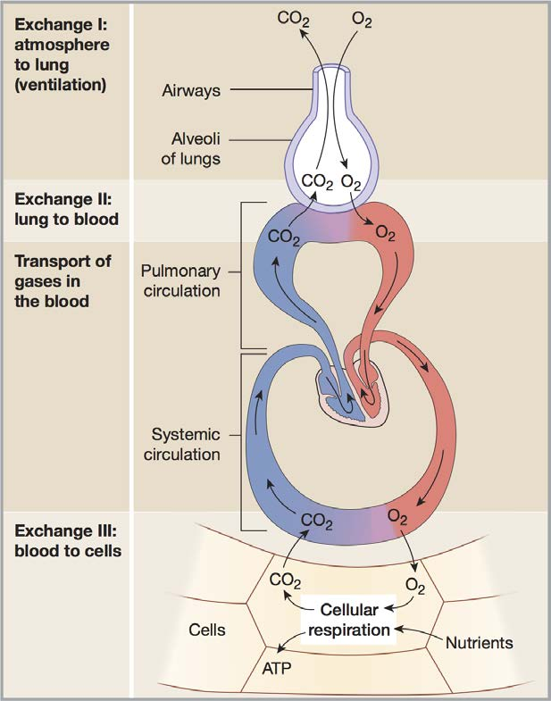
  <figcaption>

External respiration in the mammalian system is the movement of gasses to/from:

<ul>
<li> <b>(I)</b> the atmosphere to the lung;</li>
<li> <b>(II)</b> the lungs to the blood then through the blood stream to/from the capillaries;</li>
<li> <b>(III)</b> to/from the blood stream and the cells.</li>
<ul>

Cellular respiration refers to the the use of O2 and generation of CO2 in generating ATP (energy).

  </figcaption>
</figure>

Silverthorn, D U. <em>Human Physiology, an Integrated Approach</em>.

<!-- The five major functions of the respiratory system | Respiration in multi-cellular life can be used to refer to two different things:
- **Cellular respiration**: The **intracellular reaction** of oxygen (O2) with organic molecules to produce carbon dioxide (CO2) and water (H2O) and (importantly) energy (ATP).
- **External respiration**: The **movement of gases** between the environment (air for land-dwelling life) and the body's cells to supply O2 and remove CO2.
When we are talking about the movement of air through the lungs, we are addressing part of the pathway of external respiration, not cellular respiration.-->

--
### Five major functions of the respiratory system
#### 1. Conduction of air

<figure>
  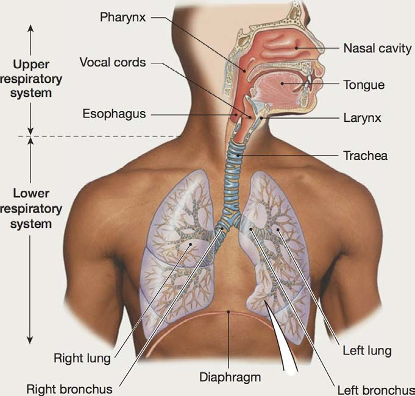
  <figcaption>
   
Referring to the bulk movement of air into, and out of, the lungs (specifically, alveoli) from the surrounding atmosphere.

- Upper respiratory tract
  - Mouth (oral) cavity (air and food)
  - Nasal cavity (air only)
  - Pharynx (air and food)
  - Larynx (vocal cords, air only)

- Lower respiratory tract (only air)
  - Trachea
  - Branching bronchi
  - Lungs (with alveoli)
  </figcaption>
</figure>

--
### Five major functions of the respiratory system
#### 1. Conduction of Air

<figure>
  
  <figcaption>
Functions of the nose

- warming air before it enters the lungs
- filters air to remove some particles
- olfactory sense (smell)
- resonating chamber for speech
  </figcaption>
</figure>
    
--
### Five major functions of the respiratory system
#### 1. Conduction of Air

<figure>
  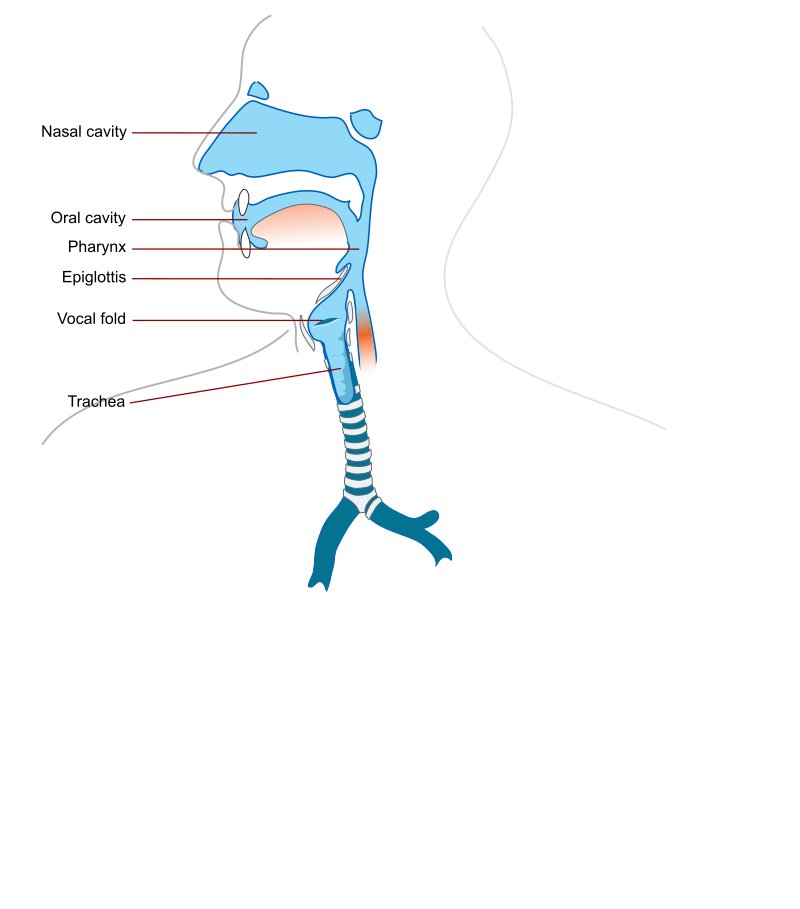
  <figcaption>
Function of the pharynx 
&nbsp; 
<ul>
  <li style="margin-bottom: 20px;">passage for air and food intake</li>
  <li style="margin-bottom: 20px;">equalise air pressure between the atmosphere and the middle ear through the Eustacian tube (pharyngotympanic tube)</li>
</ul>
  </figcaption>
</figure>

--
### Five major functions of the respiratory system
#### 1. Conduction of Air

<figure>
  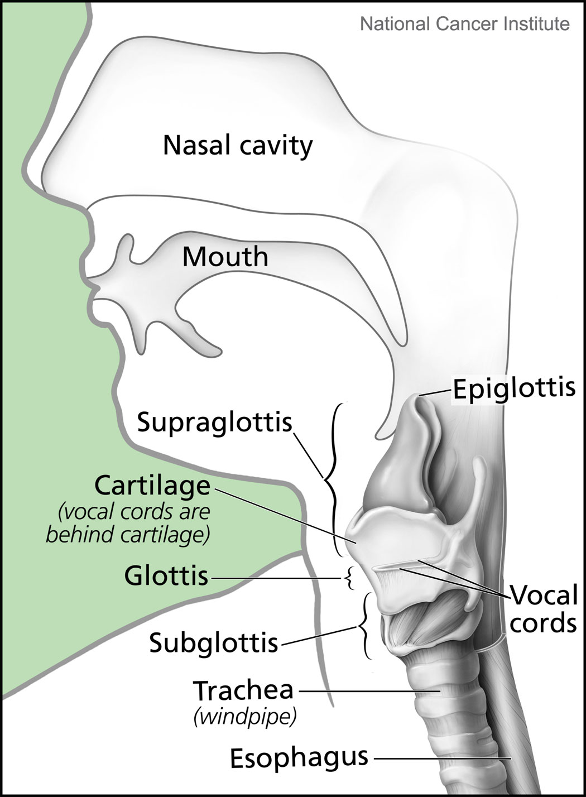
  <figcaption>
Function of the larynx

The larynx contains the epiglottis (diversion of food) and the vocal cords (forced breath hold, vocalisation).
<ul>
<li style="margin-bottom: 15px;"><b>epiglottis:</b> elastic cartilage "trap door" that is closed when swallowing food/liquid to prevent food/liquid from entering the trachea (wind pipe)</li>
<li style="margin-bottom: 15px;"><b>false vocal cords:</b> close to block/hold breath eg. when lifting a heavy object (these "vocal" cords don't produce sound)</li>
<li><b>true vocal cords:</b> elastic ligaments that when stretched, produce sound as air passes by them.</li>
  <ul>
    <li>pitch = degree of stretch</li>
    <li>amplitude = amount of air pressure applied</li>
  </ul>
</ul>
  </figcaption>
</figure>

&nbsp

National Cancer Institute, an agency part of the National Institutes of Health

--
### Five major functions of the respiratory system
#### 2. Conditioning of air and protection from inhaled substances

The respiratory mucosa lining the conducting airways conditions air before it reaches the alveoli.

<ul>
<li style="margin-bottom: 15px;"><b>Warming</b> Air is warmed to 37oC so core body temp is maintained and to protect the alveoli.
<li style="margin-bottom: 15px;"><b>Humidifying</b> Water vapor is added to 100% humidity so the exchange epithelium doesn’t dry.
<li style="margin-bottom: 15px;"><b>Filtering</b> Removal of particles and pathogens to protect the body from inflammation and infection. The <b>ciliary beat</b> that removes mucous (and trapped pathogens) relies on the thin saline secreted by epithelial cells of the respiratory system.
</ul>

<!--
### Five major functions of the respiratory system
#### 2. Conditioning of air and protection from inhaled substances
<figure>
  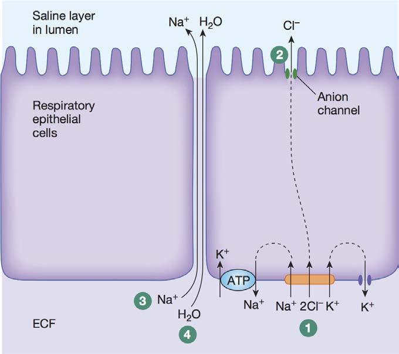
  <figcaption>

The mucosal lining is primarily made up of sodium and chloride ions in water (saline).

The epithelial cilia beat and along with the generation of the mucosal lining assist in transporting pathogens out of the airway.

This secretion involves:

<ul>
  <li> Cl- secretion into the airway lumen from epithelial cells.</li>
  <li> Na+ is drawn into the lumen by the electrochemical gradient.</li>
  <li> H2O is drawn into the lumen by the concentration gradient.</li>
</ul>
  </figcaption>
</figure>

Silverthorn, D U. <em>Human Physiology, an Integrated Approach</em>.
 -->

--
<!-- .slide: daa-auto-animate data-background="#111111" -->
<video data-autoplay data-src="images/MucociliaryClearance.mp4"></video>

<a href="https://www.youtube.com/watch?v=HMB6flEaZwI">https://www.youtube.com/watch?v=HMB6flEaZwI</a>

    
--
<!-- .slide: data-auto-animate data-background="#111111" -->
<video data-autoplay data-src="images/CiliaryBeating.mp4"></video>

<a href="https://www.youtube.com/watch?v=1Q8RL1g9txk">https://www.youtube.com/watch?v=1Q8RL1g9txk</a>

    
--
### Five major functions of the respiratory system
#### 2. Conditioning of air and protection from inhaled substances

The mucosal lining is a fluid. Therefore, there is a surface tension drawing the wetted surfaces together especially in the elastic, flexible alveoli.

An air pressure is needed to overcome this surface tension (Laplace Law).

\begin{equation}
\mathrm{pressure} = \dfrac{2\times\mathrm{surface\~tension}}{\mathrm{radius\~of\~alveoli}}
\end{equation}

If the mucosal fluid was pure water, a pressure of 18 cmH2O would be required to keep the alveoli open (<em>Guyton and Hall Textbook of Medical Physiology</em>).
    
--
### Five major functions of the respiratory system
#### 2. Conditioning of air and protection from inhaled substances

<figure>
  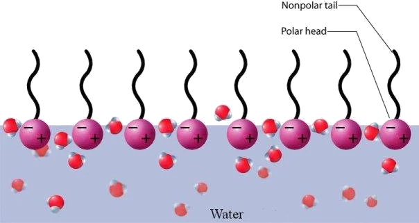
  <figcaption>

 A surfactant has a hydrophilic head (attracted to water) and hydrophobic tail (repels water).

This reduces surface tension. In the alveoli, by reducing surface tension, the required pressure to keep the alveoli open is reduced (Laplace Law).

  
<b>Surfactant</b>

  <ul>
    <li> reduces surface tension</li>
    <ul>
      <li> hydrophilic head</li>
      <li> hydrophobic tail</li>
    </ul>
  </ul>        
  
  <ul>
    <li> produced by the alveolar cells</li>
    <li> has a half life of about 14 hours</li>
    <li> lines alveoli and small bronchioles</li>
  </ul>

            

  </figcaption>
</figure>

--
### Five major functions of the respiratory system
#### 2. Conditioning of air and protection from inhaled substances

**Alveolar stability**
      
Action of surfactant:

$\dfrac{2T\downarrow}{R}=P\downarrow$

- Surfactant differentially reduces surface tension, more at lower volumes and less at higher volumes, giving alveolar stability and reducing the likelihood of alveolar collapse.
- Surfactant is formed relatively late in fetal life.
- Premature infants born without adequate amounts. experience respiratory distress requiring immediate therapy.
      
--
<!-- .slide: data-auto-animate data-background-image="images/bubbles-pexels-photo-3661471.jpg"  data-background-size="contain"-->

<table>
  <tr> 
    <td width="30%" style="font-size:1.5em">An everyday example of surfactant: bubbles</td>
    <td width="40 %"></td>
    <td width="30%"></td>
  </tr>
  <tr>
    <td></td>
    <td></td>
    <td><h3>Soap (surfactant) decreases water surface tension, allowing bubbles to form at lower air pressure.</h3></td>
  </tr>
</table>

--
### Five major functions of the respiratory system
#### 3. Gas exchange between air and blood

Oxygen needs to travel across the alveolar surface from the alveolar air into the blood stream.

Carbon dioxide needs to travel in the reverse direction.

This will be covered in greater detail shortly.

--
### Five major functions of the respiratory system
#### 4. pH regulation

When carbon dioxide is dissolved in blood (water):

\begin{equation}
\mathrm{carbon\~dioxide} + \mathrm{water} \rightleftharpoons \mathrm{carbonic\~acid} \rightleftharpoons \mathrm{hydrogen\~ions} + \mathrm{bicarbonate\~ions}
\end{equation}

\begin{equation}
\mathrm{CO}_2 + \mathrm{H}_2\mathrm{O} \overset{\mathrm{carbonic\~anhydrase}}{\rightleftharpoons} \mathrm{H}_2\mathrm{CO}_3 \rightleftharpoons \mathrm{H}^+ + \mathrm{HCO}^{3-}
\end{equation}

Increasing the concentration of H+ increases the acidity (decreases pH) and vice versa.

By altering the rate of ventilation, the rate of CO2 movement our of the blood can be modified, thereby changing blood pH. 

We will cover this in greater detail in later lectures.

--
### Five major functions of the respiratory system
#### 5. Vocalisation

Speech (or just vocal noise) requires three main processes to work together:

1. Air must be in motion (muscles of respiration and clear airways).
1. Vibrations must be established in the air stream (vocal cords).
1. The buzzing sound of the vibrating air stream must be altered by the shape of the resonator (which includes the throat, as well as the oral and nasal cavities).

--
### Reflection quiz
#### Respiratory System Functions
#### Describe the five major functions of the respiratory system: air conduction, air conditioning and protection, vocalization, gas exchange, and pH regulation.

<a href="https://flux.qa/DA285K">flux.qa/DA285K</a>

<!-- slide: data-background-iframe="https://flux.qa/#/presentations/64b753e21f524f73a6f606cd/64b753bc1f524f73a6f606c1?tab=polls&poll=64c9c2e31f524f73a6007dbf" data-background-interactive -->
<!-- sslide: data-background-iframe="https://flux.qa/#/presentations/64b753e21f524f73a6f606cd/64b753bc1f524f73a6f606c1?tab=polls&poll=64c9c7391f524f73a60081d0" data-background-interactive -->

---
<!-- .slide: data-auto-animate-restart -->
&nbsp; 
#### Learning objective
# Key terms in fluid movement
### Define and understand the relationships between pressure, pressure gradient, flow, velocity of flow, resistance, and radius in the context of the cardiovascular and respiratory systems.

--
### Key terms in fluid movement
#### Pressure and flow. Bulk fluid movement.

  
Tank A

  
Tank B

<figure>
  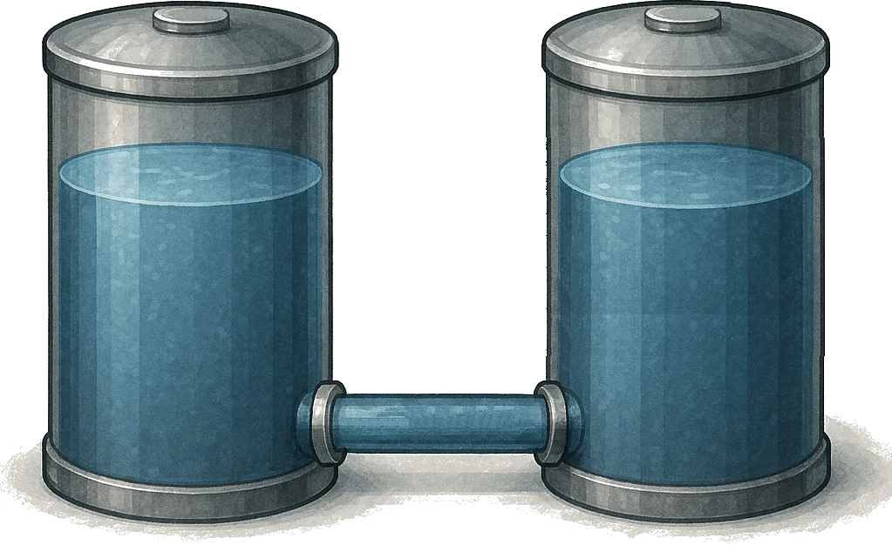
  <figcaption>
    <ul>
      <li style="margin-bottom: 30px;">Tank B pressure higher = flow to Tank A</li>
      <li style="margin-bottom: 30px;">Tank B pressure lower = flow from Tank A</li>
      <li style="margin-bottom: 30px;">Tank B pressure the same = no flow</li>
    </ul>
  </figcaption>
</figure>

Image generated using Microsoft Copilot.</em>

--
### Key terms in fluid movement
#### Pressure and flow. Bulk fluid movement.

  
Atmosphere

  
Lungs

<figure>
  
  <figcaption>
    <ul>
      <li style="margin-bottom: 30px;">Lung pressure higher = flow to atmosphere</li>
      <li style="margin-bottom: 30px;">Lung pressure lower = flow from atmosphere</li>
      <li style="margin-bottom: 30px;">Lung pressure the same = no flow</li>
    </ul>
  </figcaption>
</figure>

Image generated using Microsoft Copilot.</em>

--
### Key terms
#### Changing pressure

**Boyle's law**

That pressure ($P$) of a fixed mass of material (e.g. air) is inversely proportional to volume ($V$).

\begin{equation}
P 	\propto \dfrac{1}{V}
\end{equation}

The corollary is that if the pressure on a material is changed, the volume must also change proportionally.

\begin{equation}
P_1\cdot V_1 = P_2 \cdot V_2
\end{equation}

--
### Key terms
#### Changing pressure

<figure>
  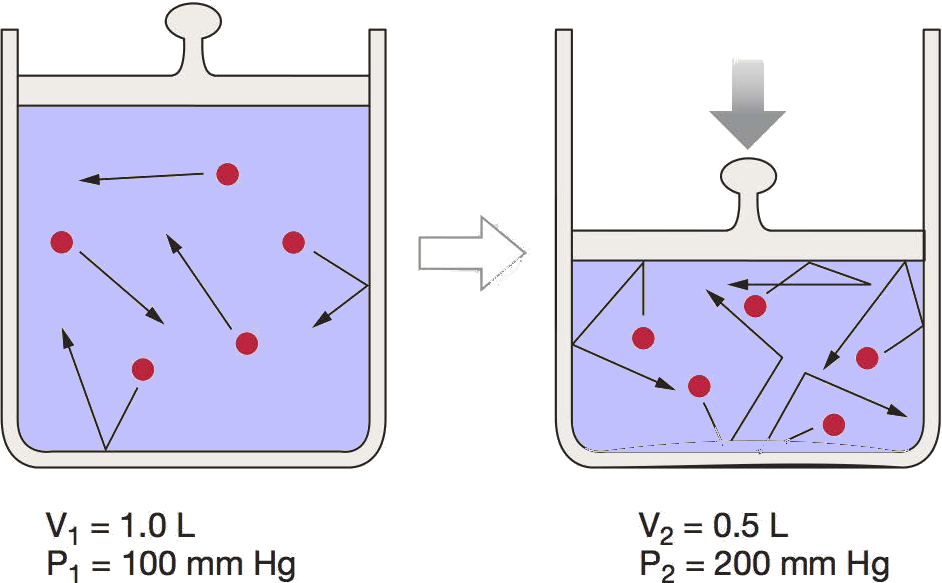
  <figcaption>
Boyle's Law states that if the volume of a fluid is changed, then the pressure must change inversely and proportionally. 

So if we halve the volume, the pressure would double.

\begin{equation}
P_1\cdot V_1 = P_2 \cdot V_2
\end{equation}
  </figcaption>
</figure>

Silverthorn, D U. <em>Human Physiology, an Integrated Approach</em>.

--
<!-- .slide: data-auto-animate data-background="#111111" -->
<video data-autoplay data-src="images/BoylesLaw.mp4"></video>

<a href="https://www.youtube.com/watch?v=N5xft2fIqQU">https://www.youtube.com/watch?v=N5xft2fIqQU</a>

  
--
### Key terms
#### Changing pressure

How does Boyle's Law relate to inspiration?

If we increase the volume of the lungs, it will reduce the pressure within the lungs.

$P_1\cdot V_1 = P_2 \downarrow \cdot V_2 \uparrow$

$P_2$ is now less than atmospheric pressure.

As fluid (includes gases) will move from a region of higher pressure to a region of lower pressure (from the surrounding atmosphere, into the lungs).

This air movement is <b>bulk flow</b> because the entire gas mixture is moving (not individual gases, as in diffusion across a <em>partial pressure</em> gradient).

  
--
### Key terms
#### Changing pressure

How does Boyle's Law relate to exhalation?

If we decrease the volume of the lungs, it will increase the pressure within the lungs.

$P_1\cdot V_1 = P_2 \uparrow \cdot V_2 \downarrow$

$P_2$ is now greater than atmospheric pressure.

As fluid (includes gases) will move from a region of higher pressure to a region of lower pressure (from the lungs, out to the surrounding atmosphere).

--
### Key terms in fluid movement
#### Resistance

<figure>
  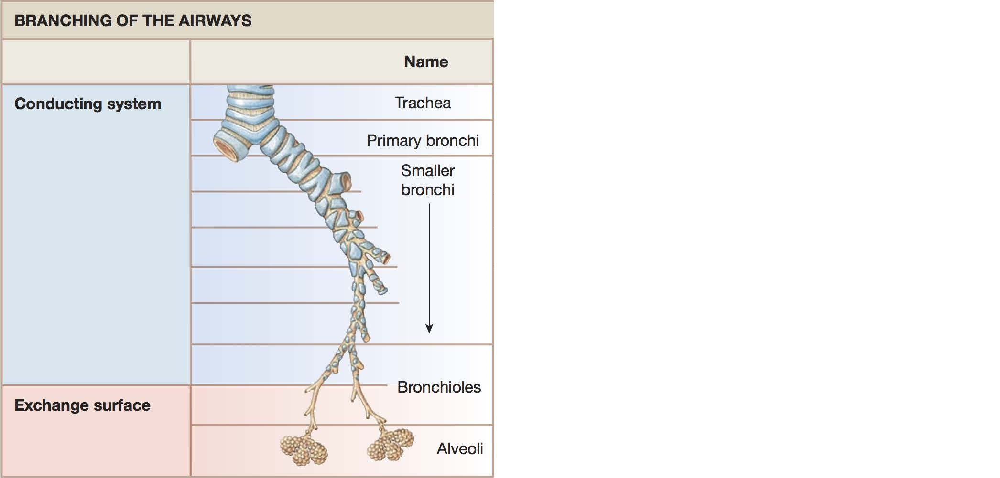
  <figcaption>
    
  </figcaption>
</figure>

Silverthorn, D U. <em>Human Physiology, an Integrated Approach.</em>

--
### Key terms in fluid movement
#### Resistance

Airway resistance (\$R$\) and corollary of Poiseuille's law

\begin{equation}
  R = \dfrac{8\mu L}{\pi r^4}
\end{equation}

where:
- $\mu$ fluid viscosity
- $L$ length of tube
- $r$ radius of the tube

The important thing to remember: resistance is directly proportional to the length of the tube, and inversely proportional to the fourth power of radius.

<em>This means that a change in radius has a dramatic effect on resistance.</em>

--
### Key terms in fluid movement
#### Resistance

\begin{equation}
R = \dfrac{8\mu L}{\pi r^4}
\end{equation}

As flow $Q$ is dependent on resistance:

\begin{equation}
  Q \propto \dfrac{\Delta P}{R}
\end{equation}

$\downarrow$ radius $\rightarrow$ $\uparrow$ resistance $\rightarrow$ $\downarrow$ flow

and inversely

$\uparrow$ radius $\rightarrow$ $\downarrow$ resistance $\rightarrow$ $\uparrow$ flow

--
<!-- .slide: data-auto-animate data-background-image="images/stainless_steel_drinking_straws.webp" data-background-size="contain" -->

Which straw has the

greatest resistance?

$R = \dfrac{8\mu L}{\pi r^4}$

--
<!-- .slide: data-auto-animate data-background-image="images/stainless_steel_drinking_straws.webp" data-background-size="contain" data-background-opacity="0.3" -->

Which straw has the

greatest resistance?

$R = \dfrac{8\mu L}{\pi r^4}$

To decrease resistance and increase flow:

<ul data-id="directionlist">
<li> increase the diameter (radius)</li>
<li> decrease the length</li>
</ul>

--
<!-- .slide: data-auto-animate data-background-image="images/stainless_steel_drinking_straws.webp" data-background-size="contain" data-background-opacity="0.3" -->

Which straw has the

greatest resistance?

$R = \dfrac{8\mu L}{\pi r^4}$

To increase resistance and decrease flow:

<ul data-id="directionlist">
<li> decrease the diameter (radius)</li>
<li> increase the length</li>
</ul>

<!-- slide: data-auto-animate data-background-image="images/LungBranches2.png" data-background-size="contain"
<table border="0">
  <tr>
    <td width="80%"></td>
    <td>Does the single trachea, or the combination of both bronchi, have the greatest resistance?</td>
  </tr>
  <tr>
    <td></td>
    <td>
$R = \dfrac{8\mu L}{\pi r^4}$
</td>
  <tr>
</table>-->

--

<!-- .slide: data-auto-animate data-background-image="images/LungBranches.png" data-background-size="contain" -->

--
### Key terms in fluid movement
#### Resistance 

<figure>
  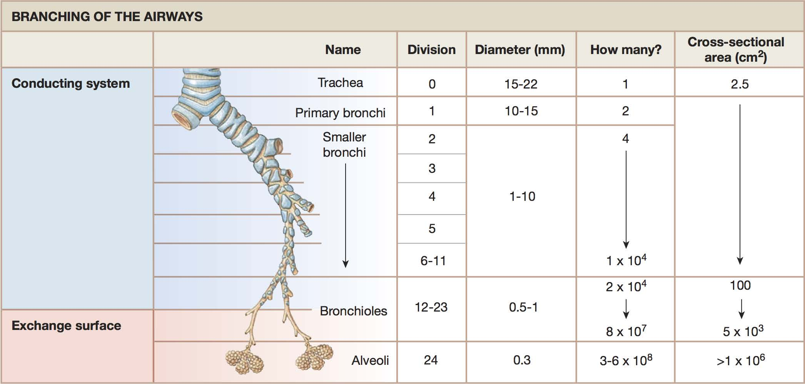
  <figcaption>
    <ul>
    <li> Air moves through the trachea, bronchi, and bronchioles.</li>
    <li> Exchange of gases between air and blood occurs at the level of the alveoli (largest cross sectional area, lowest resistance).</li>
    </ul>
  </figcaption>
</figure>

--
<!-- slide: data-background-iframe="https://flux.qa/#/presentations/64b753e21f524f73a6f606cd/64b753bc1f524f73a6f606c1?tab=polls&poll=64c9da0b1f524f73a600a74c" data-background-interactive -->
### Quiz
#### Key terms in fluid movement
#### Define and understand the relationships between pressure, pressure gradient, flow, velocity of flow, resistance, and radius in the context of the cardiovascular and respiratory systems.
<a href="https://flux.qa/DA285K">flux.qa/DA285K</a>

---
<!-- .slide: data-auto-animate-restart -->
&nbsp; 
#### Learning objective
# Lung mechanics
### Explain how lung pressure and volume change during normal breathing. Relate these changes to airflow and interpret alveolar and intra-pleural pressure changes throughout the respiratory cycle.

--
<!-- .slide: data-auto-animate data-background-image="images/musclesofrespiration1.png" data-background-size="contain" data-background-position="right" -->
### Pressure-volume changes during normal breathing
####
    
Inspiration involves the:

- **diaphragm** which moves down toward the abdomen.
- **external intercostals and scalenes** which pull the ribs up and out.

&nbsp

Silverthorn, D U. <em>Human Physiology, an Integrated Approach</em>.

    
--
<!-- .slide: data-auto-animate data-background-image="images/musclesofrespiration2.png" data-background-size="contain" data-background-position="left" -->
  
### Pressure-volume changes during normal breathing
####

<table>
  <tr>
    <td width="25%"></td>
    <td>
Exhalation is <b>nominally passive</b> (i.e. a relaxation of muscles), but may involve:

- <b>internal intercostals</b> antagonistic muscle group.
- <b>abdominal muscles</b> which compress the abdominal cavity pushing viscera and the diaphragm upward.
    </td>
  <tr>
</table>

&nbsp

Silverthorn, D U. <em>Human Physiology, an Integrated Approach</em>.

  
--
### Pressure-volume changes during normal breathing
####
Isolating the action of the diaphragm.

<figure>
  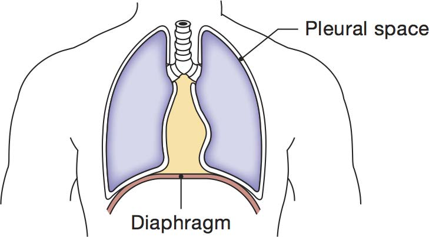
  <figcaption>
    
  </figcaption>
</figure>

--
### Pressure-volume changes during normal breathing
####
Isolating the action of the diaphragm.

<figure>
  
  <figcaption>
As it contracts, it flattens and decreases intrapleural pressure, increasing the volume of the lungs, assisting inspiration (along with the other inspiratory muscles).
  </figcaption>
</figure>

--
### Pressure-volume changes during normal breathing
####
Isolating the action of the diaphragm.

<figure>
  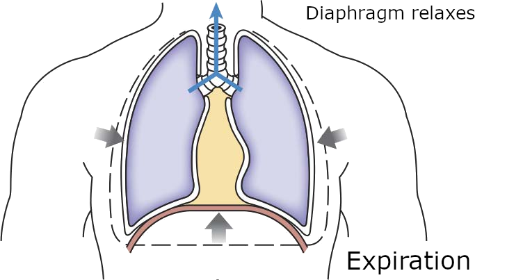
  <figcaption>
Upon relaxation, the diaphragm curves upward once more, increasing intrapleural pressure, decreasing lung volume, and assisting exhalation.
  </figcaption>
</figure>

--
### Pressure-volume changes during normal breathing
####

<figure>
  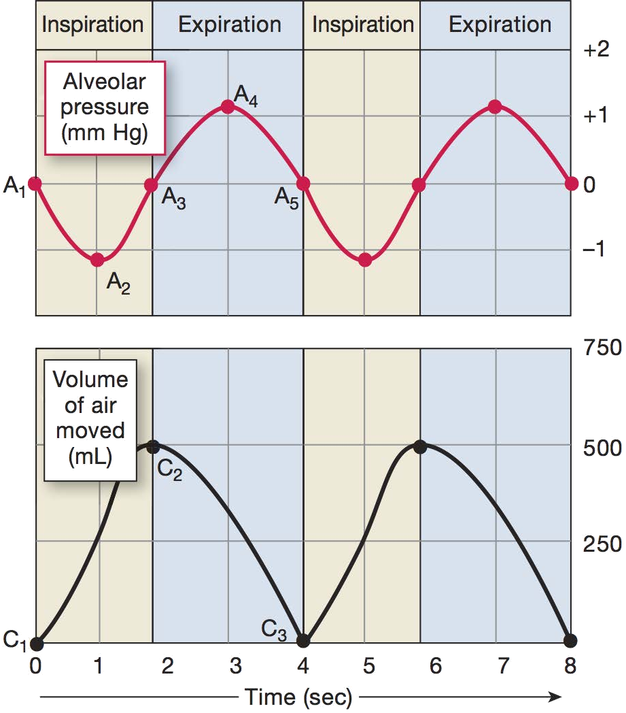
  <figcaption>

<b>(A1)</b>  In the brief pause between breaths, alveolar pressure ($P_A$) is equal to atmospheric pressure $P_{atm}$ (0 cmH2O). No difference between $P_A$ and $P_{atm}$ means no air flow.

<b>(A2) Inspiration.</b> Inspiratory muscles contract, and increase thoracic volume, decreasing $P_A$. Air flows into the alveoli (C1 to C2).

<b>(A3)</b>  When $P_A$ is equal to $P_{atm}$ the inward flow of air stops. At the end of inspiration, lung vol is at its maximum (C2).

<b>(A4) Exhalation.</b> is normally passive, inspiratory muscles relax and elastic recoil returns the diaphragm and ribs to their resting positions. Thoracic volume decreases, increasing $P_A$ above $P_{atm}$. So air flows out of the lungs (C2 to C3).

<b>(A5)</b>  At the end of exhalation, air movement ceases when $P_A$ is again equal to $P_{atm}$. One respiratory cycle consists of an inspiration and an exhalation.

  </figcaption>
</figure>

--
### Pressure-volume changes during normal breathing
####

<figure>
  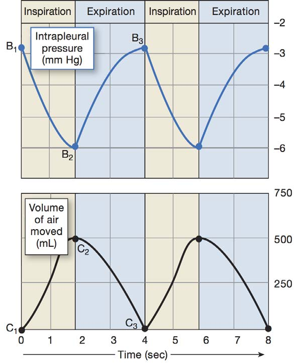
  <figcaption>

Lung tissue is non-contractile (no muscle in the lung tissue) but <em>is</em> elastic. It moves with the chest wall, due to the cohesive forces generated by the pleural fluid between the pleural membranes. The intra-pleural pressure is the pressure of the pleural fluid.

<b>(B1)</b> The intra-pleural pressure is negative at rest. 

<b>(B1-B2)</b> Inspiration.

The expanding thoracic cage, decreases intrapleural pressure. 

This pressure is a partially transferred to the lungs and alveoli (partially, as the lung tissue is elastic). 

This in turn decreases lung pressure, and flow of air into the lungs follows.
  </figcaption>
</figure>

Silverthorn, D U. <em>Human Physiology, an Integrated Approach</em>.

--
### Pressure-volume changes during normal breathing
####

<figure>
  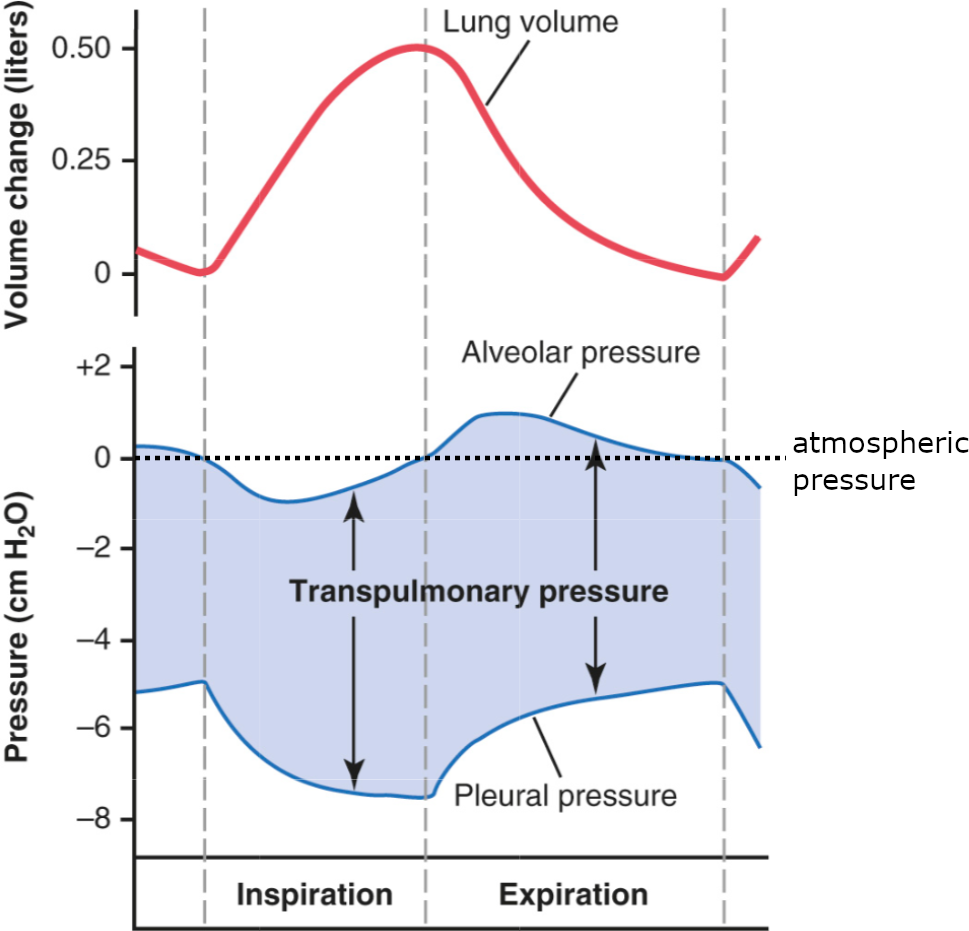
  <figcaption>
The intrapleural pressure pulls and pushes the alveolar (and lung) pressure. 

As lung pressure falls below atmospheric pressure, there is an inward flow of air (inspiration) as per Boyle's Law. 

When alveolar pressure rises above atmospheric pressure, there is an outward flow of air (exhalation).
  </figcaption>
</figure>

<em>Guyton and Hall Textbook of Medical Physiology</em>

<!-- ### Pressure-volume changes during normal breathing
#### Collapsed Lung
<figure>
  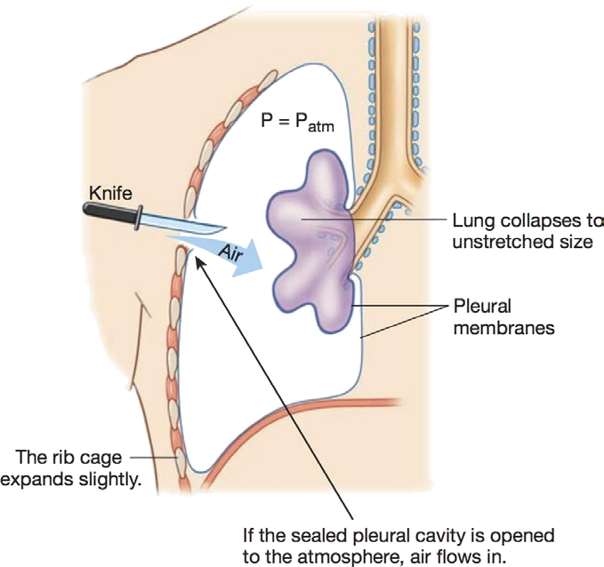
  <figcaption>
If the intrapleural space is punctured, the intrapleural pressure equalises to atmospheric pressure. -->

<!-- This means the intrapleural pressure would be equal to the lung pressure.

The lack of a negative intrapleural pressure on the elastic tissue of the lung means that the elastic tissue recoils to its unstretched state.

That is, the lung collapses.
  </figcaption>
</figure>

Silverthorn, D U. <em>Human Physiology, an Integrated Approach</em>.
 -->

--
### Quiz
#### Lung mechanics
#### Explain how lung pressure and volume change during normal breathing. Relate these changes to airflow and interpret alveolar and intra-pleural pressure changes throughout the respiratory cycle.
<a href="https://flux.qa/DA285K">flux.qa/DA285K</a>

---
<!-- .slide: data-auto-animate-restart -->
&nbsp;
#### Learning objective
# Pulmonary Volumes and Capacities
### Describe the four pulmonary volumes and the four pulmonary lung capacities.

--
### The four pulmonary volumes and four pulmonary capacities
#### 

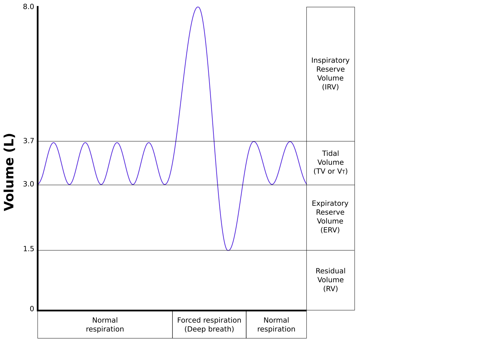
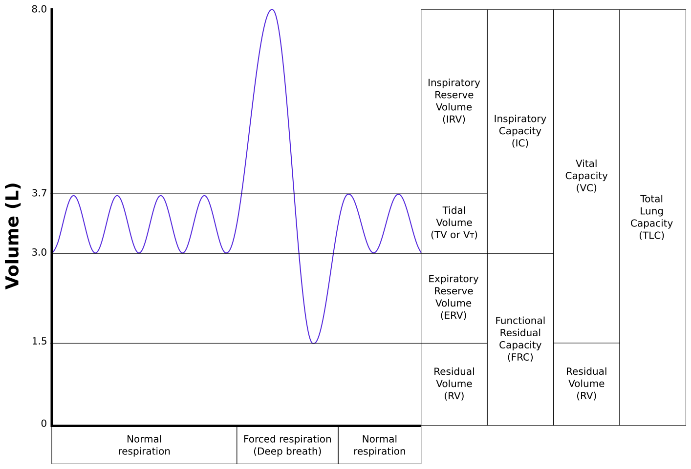

<!-- 
Volume numbers (y-axis) are approximate normals for a 70 kg adult male, or a 50 kg adult female.
 -->

Modified from <a href="https://commons.wikimedia.org/wiki/File:Lungvolumes.svg">https://commons.wikimedia.org/wiki/File:Lungvolumes.svg</a>

--
### The four pulmonary volumes and four pulmonary capacities
#### The pulmonary volumes
<figure>
  
  <figcaption>
    <ul>
      <li> <b>tidal volume</b> - the amount of air inspired (or expired) in a single, normal breath. For an adult, tidal volume is around 0.5 litres.</li>
      <li> <b>inspiratory reserve volume</b> - on a big breath in, the maximum amount of air that can be inspired above the normal tidal volume. For an adult, around 3 litres.</li> 
      <li> <b>expiratory reserve volume</b> - on a big breath out, the maximum amount of air that can be expired beyond the normal tidal volume. For an adult, around 1.1 L.</li>
      <li> <b>residual volume</b> - the amount of air left in the lungs after a maximal breath out. For an adult, around 1.2 L.</li>0
    </ul>
  </figcaption>
</figure>

Modified from <a href="https://commons.wikimedia.org/wiki/File:Lungvolumes.svg">https://commons.wikimedia.org/wiki/File:Lungvolumes.svg</a>

--
### The four pulmonary volumes and four pulmonary capacities
#### The pulmonary capacities

<figure>
  
  <figcaption>
    <ul>
      <li> <b>inspiratory capacity</b> = tidal volume + inspiratory reserve volume &nbsp;</li>
      <li> <b>functional residual capacity</b> = expiratory reserve volume + residual volume &nbsp;</li>
      <li> <b>vital capacity</b> = tidal volume + inspiratory reserve + expiratory reserve &nbsp;</li>
      <li> <b>total lung capacity</b> = vital capacity + residual volume</li>
    </ul>
  </figcaption>
</figure>

--
### The four pulmonary volumes and four pulmonary capacities
#### Minute respiratory volume, or minute ventilation

The rate at which air moves through the lungs is called the minute ventilation, or minute respiratory volume ($\dot{V}$). If we know:

- **the tidal volume ($V_T$)**
  - the volume breathed with each breath
- **the respiratory rate ($RR$)**
  - the number of breaths per minute

we can calculate the minute ventilation

\begin{equation}
\dot{V} = V_T \times RR
\end{equation}

There is not much more I can teach you about this formula - but it is important. More important than respiratory rate and tidal volume alone.

--
### Quiz
#### Pulmonary Volumes and Capacities
#### Describe the four pulmonary volumes and the four pulmonary lung capacities.
<a href="https://flux.qa/DA285K">flux.qa/DA285K</a>

---
<!-- .slide: data-auto-animate-restart -->
&nbsp;
#### Learning objective
# Gas Diffusion
### Communicate the factors that determine the rate of gas diffusion across a membrane.

--
### Diffusion of a gas across a membrane
#### Main anatomical elements of the respiratory airway

<figure>
  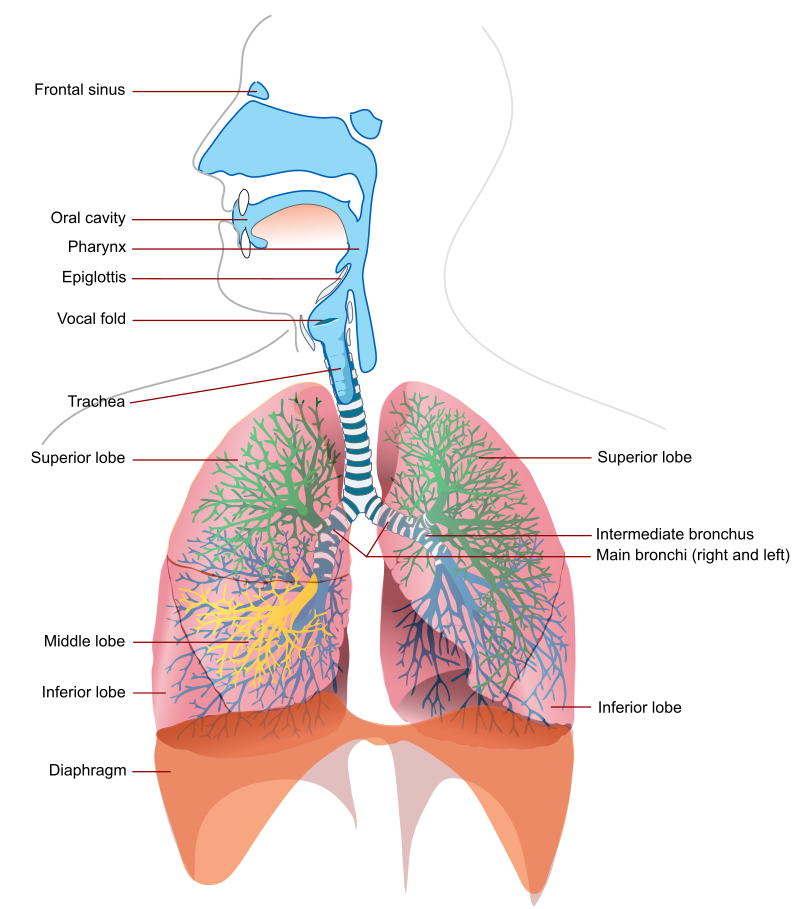
  <figcaption>
<b>Bulk transport of gases</b>

The movement of air as a whole from the surrounding atmosphere into and out of the lungs (and alveoli).
  </figcaption>
</figure>

Wikimedia Commons

--
### Diffusion of a gas across a membrane
#### Main anatomical elements of the respiratory airway

<figure>
  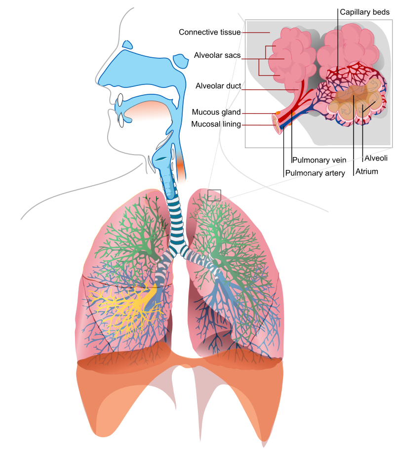
  <figcaption>
<b>Gas exchange between air and blood</b>

Diffusion of gases from a region of higher partial pressure to a region of lower partial pressure, across the alveolar membrane and capillary wall.

Capillaries are the smallest of blood vessels and are around the diameter of a single red blood cell and form a dense network supplying the cells of the body with nutrients. More detail will be in the cardiorespiratory component of the unit.
  </figcaption>
</figure>

Wikimedia Commons

--
### Diffusion of a gas across a membrane
####

- Diffusion is the movement of a material from a region of higher concentration to a region of lower concentration.
- The pressure of a particular gas (eg. oxygen) in a mix of gases (eg. in air or blood) is called the partial pressure.
- The greater the difference in partial pressure of a gas between two mediums (eg. air and blood), the greater the rate of diffusion.

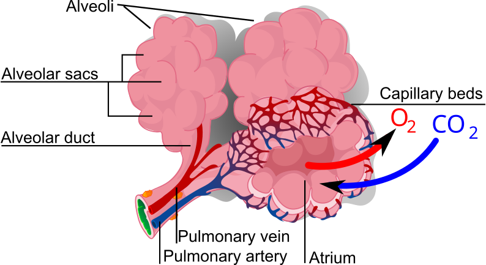

Modified from Wikimedia Commons

--
### Diffusion of a gas across a membrane
####

**Diffusion - definition**

\begin{equation}
D\approx \dfrac{\Delta P \times A \times S}{d \times \sqrt{MW}}
\end{equation}

<table>
  <tr>
    <td width=40%>

where

- **$D$** diffusion rate
- **$\Delta P$** difference in partial pressures
- **$A$** cross sectional area of the pathway
- **$S$** solubility of the gas
- **$MW$** molecular weight of the gas
- **$d$** distance of Diffusion
  </td><td>

<b>Important information in the diffusion equation for normal, healthy respiration:</b>

Diffusion ($D$) of a particular gas is dependent on the magnitude of the partial pressure difference ($\Delta P$) of that gas.

  </td>
  </tr>
</table>

--
### Diffusion of a gas across a membrane
####

<figure>
  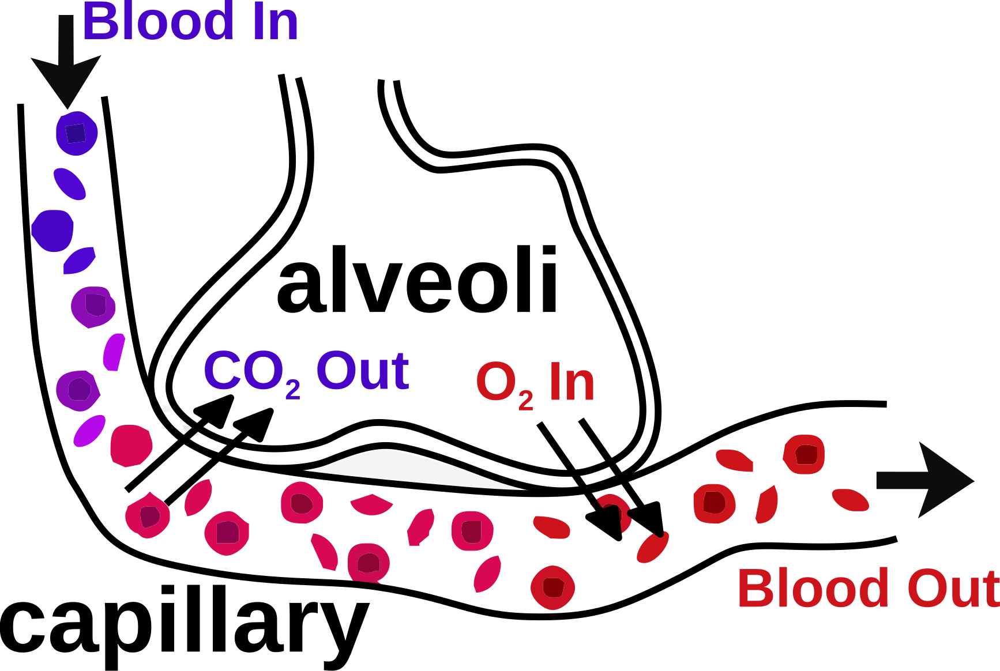
  <figcaption>
  
Movement of gasses from air to blood, and vice versa, is not a "pumped" (bulk flow) mechanism.

  
It is due to diffusion of gases from a region of higher partial pressure to a region of lower partial pressure.

  </figcaption>
</figure>

Modified from <a href="https://upload.wikimedia.org/wikipedia/commons/8/8b/Alveoli.svg">https://upload.wikimedia.org/wikipedia/commons/8/8b/Alveoli.svg</a>

--
### Diffusion of a gas across a membrane
####

<figure>
  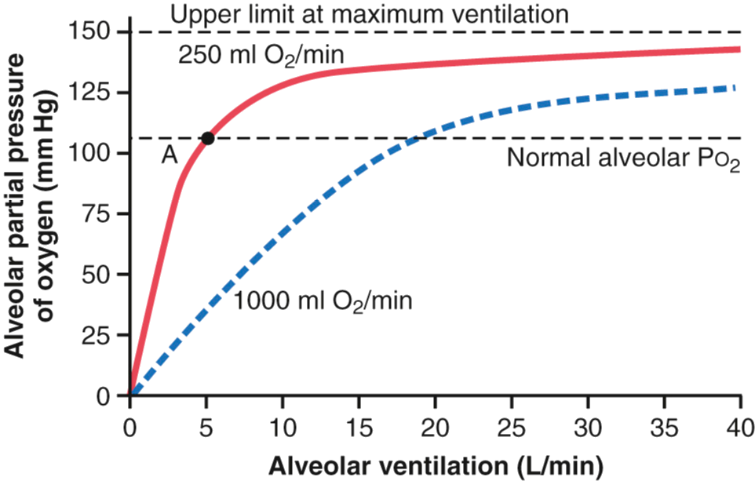
  <figcaption>
$\uparrow$ ventilation $\uparrow$ alveolar pO2 and therefore $\uparrow$ diffusion of oxygen from the alveolus into blood.

Absorption of oxygen into blood at rest and during exercise.
  </figcaption>
</figure>

Figure 40-4, <em>Guyton and Hall Textbook of Medical Physiology</em>

--
### Diffusion of a gas across a membrane
####

<figure>
  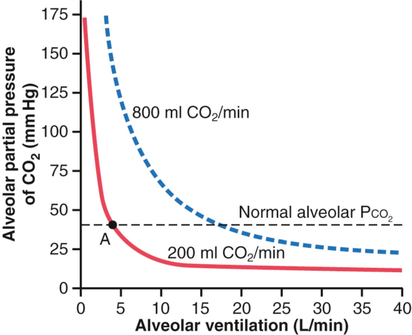
  <figcaption>
$\uparrow$ ventilation $\downarrow$ alveolar pCO2 and therefore $\uparrow$ diffusion of carbon dioxide from the blood into the alveolus.

Absorption of oxygen into blood at rest and during exercise.
  </figcaption>
</figure>

Figure 40-5, <em>Guyton and Hall Textbook of Medical Physiology</em>

--

### The oxygen cascade
#### Dalton's law and partial pressure

**Dalton's law**

The sum of the individual pressures that make up a mixture of gases
is the total pressure of that mixture of gases.

The pressure of an individual gas within a mixture of gases is known
as the *partial pressure*.

--

### The oxygen cascade
#### Dalton's law and partial pressure

Using Dalton's law we can calculate the the partial pressure of oxygen (pO2) and carbon dioxide (pCO2) in atmospheric ("dry") air and humid air (as found in the lungs). In reading this table, note that gases flow from regions of higher partial pressure to lower partial pressure.

<table>
    <tr>
        <th></th>
        <th>dry air </th>
        <th>100% humid air </th>
    </tr>
        <td>Atmospheric pressure </td>
        <td> 760 mmHg </td>
        <td> 760 mmHg </td>
    </tr>
    <tr>
        <td>Vapour pressure </td>
        <td> 0 mmHg </td>
        <td> 24 mmHg </td>
    </tr>
    <tr>
        <td>Gas pressure (atmospheric pressure - vapour pressure) </td>
        <td> 760 mmHg </td>
        <td> 736 mmHg </td>
    </tr>
    <tr>
        <td> pO2 = 21% \(\times\) gas pressure </td>
        <td> 160 mmHg </td>
        <td> 155 mmHg </td>
    </tr>
    <tr>
        <td> pCO2 = 0.033% \(\times\) gas pressure </td>
        <td> 0.25 mmHg </td>
        <td> 0.24 mmHg </td>
    </tr>
</table>

&nbsp

Extension from D.U. Silverthorn, <em>Human Physiology: An integrated approach.</em>

--

### The oxygen cascade
#### Partial pressure gradients and flow of gases

<figure>
    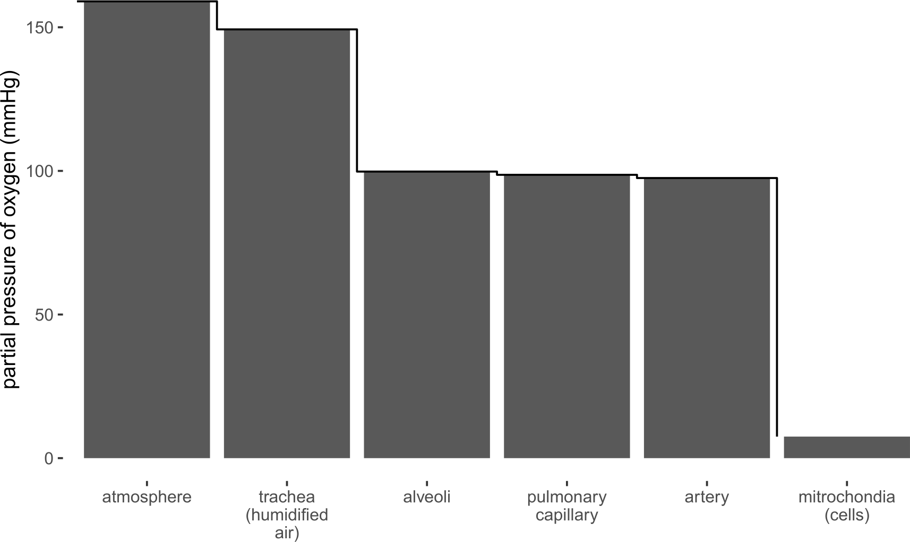
    <figcaption>
        <b>The oxygen cascade.</b> A gas flows from a region of higher partial pressure to a region of lower partial pressure. Therefore, oxygen will flow from the atmosphere right down to the mitochondria along the cascade of partial pressures along that pathway.
    </figcaption>
</figure>

Figure created for MHHS2402

--
### Movement of carbon dioxide from venous blood to the atmosphere
####

<figure>
    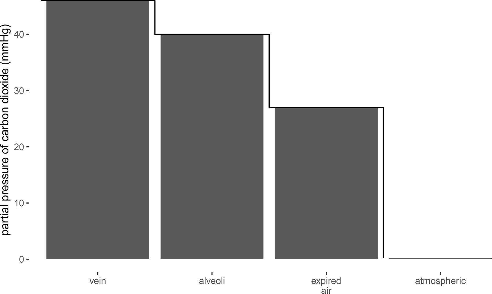
    <figcaption>
        A gas flows from a region of higher partial pressure to a region of lower partial pressure. Therefore, carbon dioxide will flow from vein, to alveoli, to trachea, and into the atmosphere.
    </figcaption>
</figure>

Figure created for MHHS2402.

--
### Quiz
#### Gas Diffusion
#### Communicate the factors that determine the rate of gas diffusion across a membrane.
<a href="https://flux.qa/DA285K">flux.qa/DA285K</a>

---
<!-- .slide: data-auto-animate-restart -->
&nbsp;
#### Learning objective
# Ventilation-Perfusion ratio
### Explain the clinical quantification of gas exchange using the ventilation-perfusion ratio.

--
### Ventilation-perfusion ratio
####

In broad terms:

- Increased ventilation increases partial pressure of alveolar oxygen, increasing diffusion of oxygen into and carbon dioxide out of blood.
- Increased lung perfusion increases the effective "surface area" (blood) exposed to the area for gas exchange, increasing diffusion of oxygen into and carbon dioxide out of blood.

--
### Ventilation-perfusion ratio
####

<figure>
  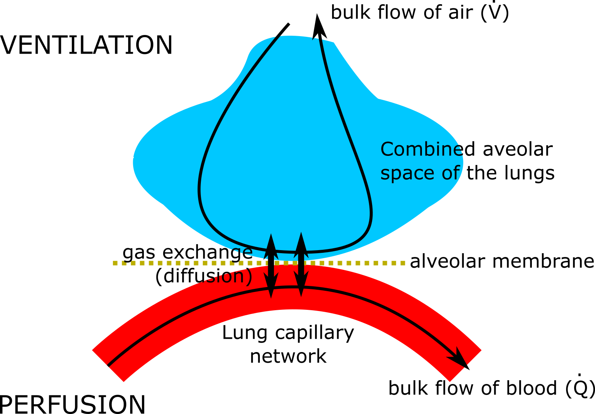
  <figcaption>
Increased ventilation increases partial pressure of alveolar oxygen, increasing diffusion of oxygen into and carbon dioxide out of blood.

Increased lung perfusion increases the effective "surface area" (blood) exposed to the area for gas exchange, increasing diffusion of oxygen into and carbon dioxide out of blood.    
  </figcaption>
</figure>

Original content created for MHHS2402.

--
### Ventilation-perfusion ratio
####

$\mathrm{ventilation\~perfusion\~ratio}=\dfrac{\mathrm{alveolar\~ventilation}}{\mathrm{blood\~flow}} = \dfrac{\dot V_{A}}{\dot Q}$

--
$\mathrm{ventilation\~perfusion\~ratio}=\dfrac{\mathrm{alveolar\~ventilation}}{\mathrm{blood\~flow}} = \dfrac{\dot V\_{A}}{\dot Q}$

What does it mean if the ventilation-perfusion ratio is zero?

Without ventilation ($\dot V_A=0$) alveolar oxygen partial pressure and alveolar carbon dioxide partial pressure will equilibrate with blood oxygen and carbon dioxide partial pressure.

Without a partial pressure difference between air and blood there will be no diffusion of oxygen into blood and carbon dioxide out of blood.

Therefore blood will not be oxygenated and cells will not receive the oxygen required to live.

--
$\mathrm{ventilation\~perfusion\~ratio}=\dfrac{\mathrm{alveolar\~ventilation}}{\mathrm{blood\~flow}} = \dfrac{\dot V\_{A}}{\dot Q}$

What does it mean if the ventilation-perfusion ratio reaches a very large number (becoming infinite)?

Without perfusion ($\dot Q=0$) alveolar oxygen partial pressure and alveolar carbon dioxide partial pressure will equilibrate with blood oxygen and carbon dioxide partial pressure of the stagnant blood in the lungs.

Without a partial pressure difference between air and blood there will be no diffusion of oxygen into blood and carbon dioxide out of blood.

Therefore blood will not be oxygenated and cells will not receive the oxygen required to live.

--
$\mathrm{ventilation\~perfusion\~ratio}=\dfrac{\mathrm{alveolar\~ventilation}}{\mathrm{blood\~flow}} = \dfrac{\dot V\_{A}}{\dot Q}$

What does it mean if the ventilation-perfusion ratio reaches a very large number (becoming infinite)?

Also, blood is not circulating so there is no bulk movement of oxygen to where it is needed in the body!

--
### Ventilation-perfusion ratio
####

- 1 litre of blood can contain around 200 ml of oxygen.
- 1 litre of dry air has around 210 ml of oxygen.
- Therefore, the ideal $\frac{\dot V_{A}}{\dot Q}$ ratio is around 1.

It is a bit more complex than this due to regional differences in the lung, and the normal $\frac{\dot V_{A}}{\dot Q}$ ratio is around 0.8.

This also makes sense if we know the average normal ventilation rate is around 4 L/min and the cardiac output is 5 L/min ($\frac{4\mathrm{~L/min}}{5\mathrm{~L/min}}=0.8$).

--
### Ventilation-perfusion ratio
####

**A low $\frac{\dot V_{A}}{\dot Q}$ ratio** means either low ventilation or high perfusion. It may be seen in conditions that reduce ventilation such as:

- asthma
- chronic bronchitis
- acute pulmonary edema
 

**A high  $\frac{\dot V_{A}}{\dot Q}$ ratio** means either high ventilation or low perfusion. It may be seen in:

- pulmonary embolism (reducing lung blood perfusion)
- emphysema (increased ventilation due to overwork to compensate for lung damage)

    We will be revisiting the ventilation-perfusion ratio in the unit content on homeostasis in exercise, and in chronic obstructive pulmonary disease.

---
<!-- .slide: data-auto-animate data-background="#111111" -->
<video data-autoplay data-src="images/VocalCords.mp4"></video>

<a href="https://www.youtube.com/watch?v=BipS88vaFfI">https://www.youtube.com/watch?v=BipS88vaFfI</a>
