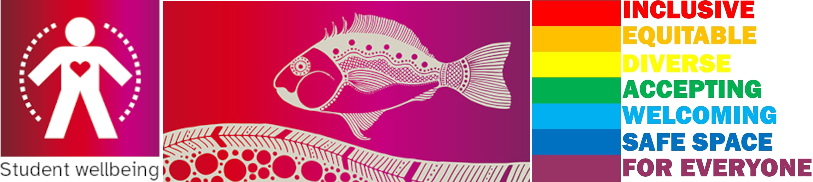
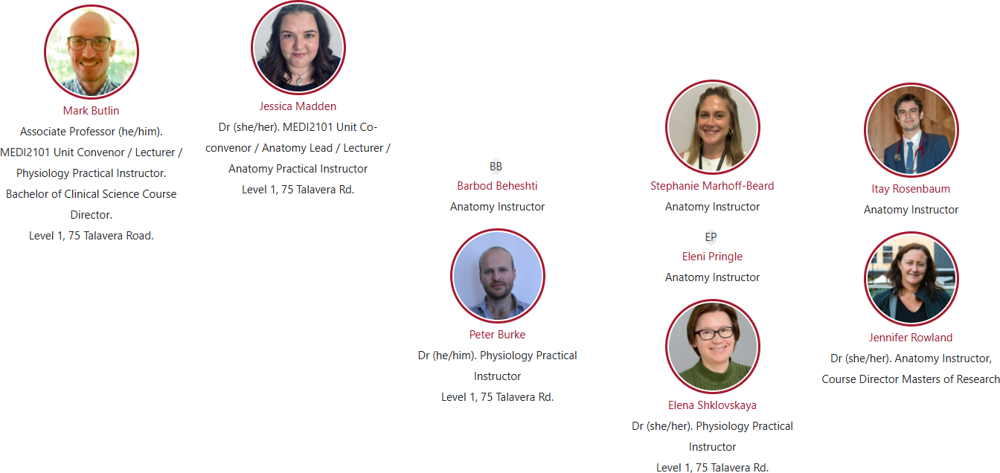
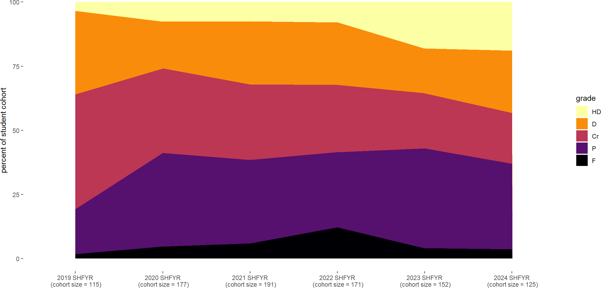
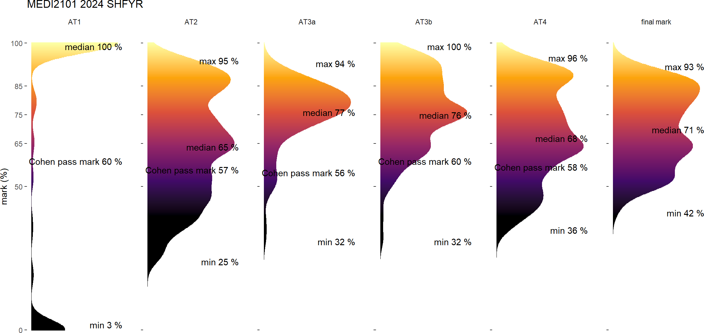
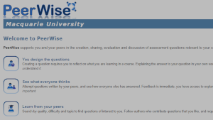
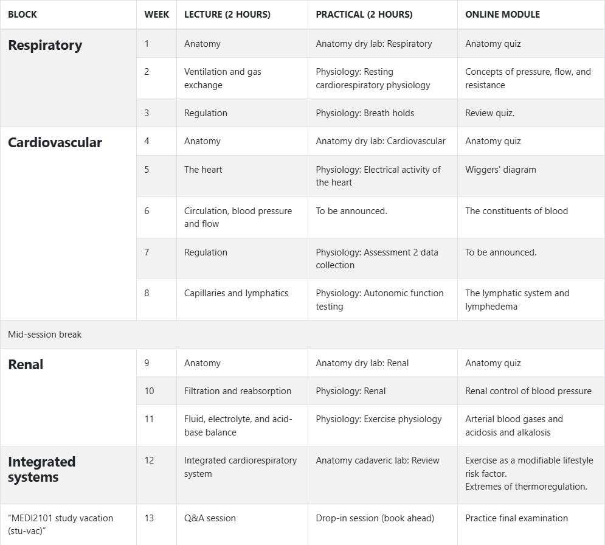
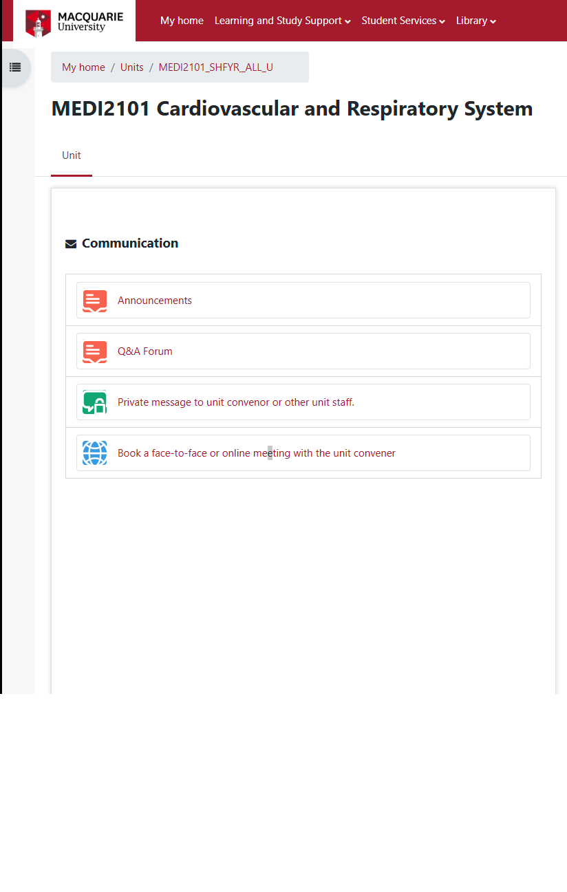

<!-- .slide: data-auto-animate-restart id="MHHS2402Wk1"-->
#### MHHS2402 Cardiovascular, Renal, and Respiratory System.
### 
# Unit Introduction
##### Convenor: Assoc. Prof. Mark Butlin (PhD, BE, SFHEA) (he/him)
##### Co-convenor: Dr Jessica Madden (PhD) (she/her)

Macquarie Medical School, Faculty of Medicine, Health and Human Sciences Macquarie University. On the land of the Wallumattagal clan of the Dharug Nation.

  

    <a href="presentation.pdf" download>
      <button style="
        background-color: #76232F;
        color: white;
        border: none;
        padding: 10px 20px;
        font-size: 0.5em;
        border-radius: 5px;
        cursor: pointer;
        margin-top: 20px;
      ">Click to download PDF version</button>
    </a>
  

  

    
  

  

    
This material is provided to you as a Macquarie University student for your individual research and study purposes only. You cannot share this material without permission. Macquarie University is the copyright owner of (or has licence to use) the intellectual property in this material. Legal and/or disciplinary actions may be taken if this material is shared without the University's written permission.

  

<!-- <button id="font-toggle-btn" aria-pressed="false">Switch to OpenDyslexic font</button> -->

---
### Slide navigation
####

- Page down to move sequentially through slides.
- Right arrow to move through weekly learning objectives.
- "o" to see an overview of the slides.
- "f" to see slides in full screen view.

&nbsp;

### Font selection

The title slide of the presentation has a button to switch to Open Dyslexic font.
- Click that button to see the Open Dyslexic font throughout.
- Click the button again to return to the default font (Atkinson Hyperlegible).

---
### Unit support
####

<ul>
  <li>Recognition that the university journey can have difficulties with causes <b>both internal and external</b> to the university.</li>
  <li>+ demands are different now (cost of living, university fees),</li>
  <li>+ world temperament is not great (unsettled; wars; climate change; ...),</li>
  <li>+ university is often a time of change (relocation; family responsibilities; ...),</li>
  <li>+ people come to the unit with many different abilities and learning needs,</li>
  <li>+ this is a second year unit that many will be sitting in their first year.</li>
</ul>

**Please contact Mark Butlin early if you are having difficulties, so that we can help you succeed in this unit.**

--
### Teaching staff
####

--
<!-- .slide:  data-background-image="images/AboriginalAustralia1.png" -->

I acknowledge, thank and respect the traditional custodians of the stolen land I have lived upon, the people of the Wiradjuri, Bundjalung, Tharawal, Eora and Dharug nations, whose cultures and customs have nurtured and continue to nurture this land, since the Dreamtime.

--
<!-- .slide: data-background-image="images/CollaborationsMap.png" -->
<h3>Your unit convener's experience</h3>
<h4>Engineer | Research collaborations | Industry collaborations | Clinical work</h4>

--
<!-- .slide: data-background-image="images/Internal_organs - cardiorespiratory.png" data-background-size="70%" -->

&nbsp

&nbsp

&nbsp

&nbsp

&nbsp

&nbsp

&nbsp

&nbsp

&nbsp

Modified from <a href="https://commons.wikimedia.org/wiki/File:Internal_organs.svg">https://commons.wikimedia.org/wiki/File:Internal_organs.svg</a>

<aside class="notes">This is a systems physiology unit, and encompasses the interaction between many different body components. This is what makes this unit fun and interesting. It is also what can make this unit challenging.</aside>

--
<h3>Past grades</h3>
<h4></h4>

---
<h3>Past grades</h3>
<h4></h4>

Uat#: Unit assessment task number #

---
### Learning opportunities
#### 

    

        
    

    

      <h5>One practical is held each week.</h5>
      
Either a dry-lab anatomy practical or a physiology practical. See each week in iLearn. 
      A week 12 revision laboratory will be held with cadaveric specimens. 
      Only in person, on campus. No Echo360 catch-up.

    

    

        
    

    

      <h5>Lectures are held each week.</h5>
      
In person. Simulcast online in Echo360. +Echo360 catch-up. 
      A copy of the slides are available in Echo360. 
      Closed captioning is available through Echo360.

    

    

        
    

    

      <h5>Online modules</h5>
      
Online modules are provided in each week's material on the unit iLearn page. These provide a mixture of new concepts not delivered in the lectures and practicals and review tools.

    

  

--
### Learning opportunities
#### Extension resources

    

        
    

    

    <h5>Have input into what will be in the final exam</h5>
    
Peerwise: This tool allows you to create practice questions – some of which may be chosen to be put in the MHHS2402 end of session examination. 
    

  

    

        
    

    

    <h5>Readings</h5>
    
The “Textbook of Medical Physiology” of Guyton and Hall provides excellent chapters on the respiratory, cardiovascular, and renal system. Hard copy and online versions are available through Waranara (Macquarie University Library).
    

  

---
### Unit overview
#### 

--
### Assessments
####

    

        
    

    

      <h5>1. Infographic on a respiratory disease (eosinophilic asthma).</h5>
  

    

        
    

    

    <h5>2. Discussion section of experiment report, including a flow diagram.</h5>
    

    

        
    

    

    <h5>3. End of session examination.</h5>
    

--
### Assessments
#### Free help
- <strong><a href="https://students.mq.edu.au/support/technology/systems/ilearn/assignments-grades" target="_blank">Turn-it-in Draft Coach</a></strong>. Check grammar, citations, and similarity <strong>before</strong> submitting your assessment.
- <strong><a href="https://ilearn.mq.edu.au/enrol/index.php?id=16580">StudyWise</a>. </strong>Macquarie free course.
- <a href="https://ilearn.mq.edu.au/mod/glossary/view.php?id=4608101&amp;mode=search&amp;hook=basics+referencing&amp;fullsearch=1" target="_blank" title="https://ilearn.mq.edu.au/mod/glossary/view.php?id=4608101&amp;mode=search&amp;hook=basics+referencing&amp;fullsearch=1"><strong>Connected Curriculum.</strong></a>&nbsp;Module on referencing.
- <strong>Unit convenor. </strong>Please contact the unit convenor no later than 48 hours before the due date </strong>to ensure you get a response before the due date.
- <strong><a href="https://students.mq.edu.au/support/study/writing/writewise" style="">WriteWise</a>.</strong> Macquarie free service. Work with trained senior students to analyse assignment questions (not just written assignments), get academic writing advice, and work on study strategies.
- <strong><a href="https://students.mq.edu.au/support/study/writing/consultations">Individual consultations</a>.</strong> One-on-one consultations with a Learning Adviser to help develop your academic writing and provide advice on study skills.
- <strong><a href="https://studiosity.com/connect/users/pin/new">Studiosity.</a></strong> Studiosity, an external service paid for by Macquarie University, provides feedback on academic writing, including structure, grammar, punctuation, and spelling. 

--
### Assessment tasks
#### Accessibility support
If you are someone with an on-going health condition, disability and/or are a carer of a person with a disability, please consider contacting <a href="https://students.mq.edu.au/support/accessibility-disability">Accessibility Support and Services</a> early during session to put in an Individual Education Access Plan (IEAP) for MHHS2402.

You are welcome to contact me (you do not need to provide details) so that I can follow up with Accessibility Support to make sure they have put in place your IEAP in MHHS2402.

---
<!-- .slide: data-auto-animate -->
### Open virtual and real door
####

